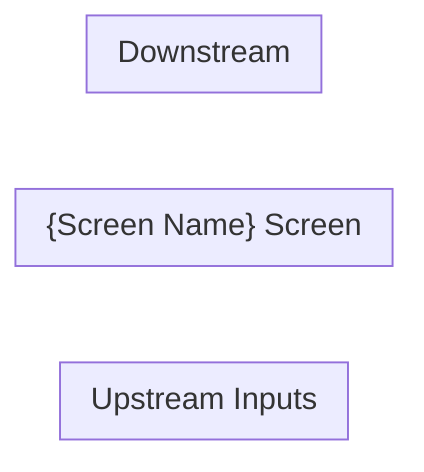

# Input Node Pipeline

**Node path:** `nodes/2025/f1040/inputs/{NODE}/`

Runs three phases in sequence. Gate after each phase before proceeding.

---

## Phase 1 — Research

### Goal
Produce `nodes/2025/f1040/inputs/{NODE}/research/context.md` — a complete reference document so a coding agent can implement the node with zero external knowledge.

### Step 0 — Resolve screen code
Read `nodes/2025/f1040/inputs/screens.json`. Match the input against `screen_code`, `alias_screen_codes`, or `form` field (case-insensitive). Use the matched `screen_code` as `{NODE}` for all paths.

If no match: list the closest entries and ask the user to clarify.

### Step 0b — Create files FIRST
Before any web fetching, write both files to disk:

**`nodes/2025/f1040/inputs/{NODE}/research/scratchpad.md`:**
```markdown
# {Screen Name} — Scratchpad

## Purpose
{One line — fill after Drake read}

## Fields identified (from Drake)
{Fill after Drake read}

## Open Questions
- [ ] Q: What fields does Drake show for this screen?
- [ ] Q: Where does each box flow on the 1040?
- [ ] Q: What are the TY2025 constants?
- [ ] Q: What edge cases exist?

## Sources to check
- [ ] Drake KB article
- [ ] IRS instructions PDF
- [ ] Rev Proc for TY2025 constants
```

**`nodes/2025/f1040/inputs/{NODE}/research/context.md`** — full skeleton with all section headers and empty tables (see structure below).

### Step 1 — Drake KB
Search `site:kb.drakesoftware.com {screen name} data entry screen`. Read the primary article in full, follow every link. Extract every data-entry field.

After reading: update `scratchpad.md` (Purpose + fields) and `context.md` (Overview + stub rows in Data Entry Fields).

**Rule: update context.md after EVERY source before moving to the next.**

### Step 2 — IRS form instructions
For each field: look up the IRS definition, constraints, and exactly where it flows on the 1040 / schedule / form. Write into Data Entry Fields and Per-Field Routing tables.

### Step 3 — Calculation logic
Step-by-step arithmetic. Cite exact IRS source and page for every formula. Write into Calculation Logic section.

### Step 4 — TY2025 constants
Always look up the value for TY2025 specifically (Rev Proc 2024-40 for most constants). Never copy from prior-year examples. If only prior-year is available, flag it: `[PRIOR YEAR: TY{N} value — TY2025 not yet published]`.

### Step 5 — Data flow diagram
Draw a Mermaid `flowchart LR` showing:
- Upstream inputs into this screen
- Each field → direct downstream node (one hop only)
- Conditional branches labeled

### Step 6 — Edge cases
Multiple instances, filing status differences, special codes, phase-outs, carryforwards.

### Step 7 — Scratchpad resolution loop
For every unresolved `[ ]` question in scratchpad: research it, find a verifiable IRS source, mark `[x]` with citation, update context.md. Loop until all resolved or `[!] NEEDS SOURCE: reason`.

### Step 8 — Download PDFs
Use `.research/docs/` at the repo root as the shared doc cache. Check before downloading — if the file already exists, skip it.

```bash
mkdir -p .research/docs
# Check before downloading:
ls .research/docs/{filename}.pdf 2>/dev/null && echo "already cached" || curl -sL "{url}" -o ".research/docs/{filename}.pdf" --max-time 60
```

Reference the file from context.md using the shared path: `.research/docs/{filename}.pdf`

### Step 9 — Final pass
Every field in Data Entry Fields has a row in Per-Field Routing. Data flow diagram complete. Every URL verified. Sources table complete.

**Gate:** context.md must have no sections still marked `_Research in progress._`, no empty tables.

---

### context.md structure

```markdown
# {Screen Name} — {IRS Form Full Name}

## Overview
{What this screen captures, what it feeds, why it matters.}

**IRS Form:** {form}
**Drake Screen:** {identifier}
**Tax Year:** 2025
**Drake Reference:** {verified URL}

---

## Data Entry Fields

| Field | Type | Required | Drake Label | Description | IRS Reference | URL |
| ----- | ---- | -------- | ----------- | ----------- | ------------- | --- |

---

## Per-Field Routing

| Field | Destination | How Used | Triggers | Limit / Cap | IRS Reference | URL |
| ----- | ----------- | -------- | -------- | ----------- | ------------- | --- |

---

## Calculation Logic

### Step 1 — {name}
{Description}
> **Source:** {Document}, {Section/Line}, p.{N} — {verified URL}

---

## Constants & Thresholds (Tax Year 2025)

| Constant | Value | Source | URL |
| -------- | ----- | ------ | --- |

---

## Data Flow Diagram



---

## Edge Cases & Special Rules

---

## Sources

| Document | Year | Section | URL | Saved as |
| -------- | ---- | ------- | --- | -------- |
```

---

## Phase 2 — Black-Box Tests

### Goal
Produce `nodes/2025/f1040/inputs/{NODE}/index.test.ts` from context.md only (never read index.ts).

### Step 1 — Analyst agent: build coverage checklist

Spawn an **Analyst agent** with this prompt:

> Read `nodes/2025/f1040/inputs/{NODE}/research/context.md` in full. Do NOT read any other file.
> Produce a structured coverage checklist with these sections. For each item include: test name (quoted string), scenario, and assertion type (routes_to / does_not_route / throws / does_not_throw / equals_scalar / output_count_unchanged).
>
> Sections:
> 1. Input schema validation — required fields, negative constraints, empty arrays
> 2. Per-box routing — one row per box → destination; include zero-value case
> 3. Aggregation — one row per box that sums across multiple items
> 4. Thresholds — one row each for below/at/above every constant in the Constants table
> 5. Hard validation rules — every rule marked ERROR: throw test + boundary-pass test
> 6. Warning-only rules — every rule marked WARNING: does_not_throw test
> 7. Informational fields — every field that must NOT produce tax outputs
> 8. Edge cases — one row per entry in the Edge Cases section
> 9. Smoke test — one comprehensive test with all major boxes populated
>
> Output ONLY the checklist. No prose, no code.

### Step 2 — Evaluator loop (max 5 iterations)

Spawn an **Evaluator agent**, passing the current checklist:

> You are a tax-software QA reviewer. You have the coverage checklist below and access to `nodes/2025/f1040/inputs/{NODE}/research/context.md`.
> Read context.md. Add missing items. Remove hallucinated items. Flag ambiguities.
> Return the revised checklist. End with "Changes made: NONE" if no additions or removals were made.
> --- CHECKLIST ---
> {CURRENT_CHECKLIST}

Loop until Evaluator writes `Changes made: NONE` or 5 iterations.

### Step 3 — Builder agent: write the test file

Spawn a **Builder agent** with the FINAL agreed checklist:

> Write a Deno test file for tax node **{NODE}**. Use ONLY the checklist below.
>
> **Important:** Input nodes receive ALL items in one `compute()` call — the node aggregates internally.
>
> ```typescript
> // Harness shape
> import { assertEquals, assertThrows } from "@std/assert";
> import { {node} } from "./index.ts";
>
> function minimalItem(overrides: Record<string, unknown> = {}) {
>   return { /* required fields at zero/false/empty */ ...overrides };
> }
>
> function compute(items: ReturnType<typeof minimalItem>[]) {
>   return {node}.compute({ {node}s: items }); // adjust key per checklist
> }
>
> function findOutput(result: ReturnType<typeof compute>, nodeType: string) {
>   return result.outputs.find((o) => o.nodeType === nodeType);
> }
> ```
>
> Write tests in checklist section order. Map assertion types:
> - `routes_to` → assert output exists + field value
> - `does_not_route` → assert output is undefined
> - `throws` → `assertThrows(() => compute([...]), Error)`
> - `does_not_throw` → call compute inside `assertEquals(Array.isArray(...), true)`
> - `equals_scalar` → assert exact number
> - `output_count_unchanged` → compute with/without field; assert lengths equal
>
> Write to: `nodes/2025/f1040/inputs/{NODE}/index.test.ts`
>
> --- AGREED CHECKLIST ---
> {FINAL_CHECKLIST}

**Gate:** `index.test.ts` must exist with at least one `Deno.test(`.

---

## Phase 3 — Implementation

### Goal
Write `nodes/2025/f1040/inputs/{NODE}/index.ts`, make all tests pass, register, and wire start node.

### Step 0 — Verify tests exist
```bash
ls nodes/2025/f1040/inputs/{NODE}/index.test.ts
```
If missing, stop and complete Phase 2 first.

Read the test file fully. Tests are the spec — never modify them.

### Step 1 — Read architecture references
- `nodes/2025/f1040/inputs/INT/index.ts` — simple routing
- `nodes/2025/f1040/inputs/W2/index.ts` — complex multi-output routing
- `nodes/2025/registry.ts` — registry to update

### Step 2 — Read context.md
Extract: Data Entry Fields → Zod schema; Per-Field Routing → compute() logic; Calculation Logic → aggregation rules; Constants → hard-coded values; Validation rules → throw conditions.

### Step 3 — Design Zod schema
```typescript
export const itemSchema = z.object({
  payer_name: z.string(),
  box1: z.number().nonnegative().optional(),
  box_adjustment: z.number().optional(),   // can be negative
  box13_statutory: z.boolean().optional(),
  routing_code: z.nativeEnum(MyEnum).optional(),
});
export const inputSchema = z.object({
  myNodes: z.array(itemSchema).min(1),
});
```
Rules: never `.default()` in schema (apply in compute with `?? value`); use `z.nativeEnum` for finite domain codes.

### Step 4 — Implement compute()
```typescript
compute(input: z.infer<typeof inputSchema>): NodeResult {
  const outputs: NodeOutput[] = [];
  // 1. Cross-field validation (throw on hard errors)
  // 2. Aggregate across all items
  // 3. Emit once per downstream nodeType
  return { outputs };
}
```
Rules: no mutation; emit one output object per nodeType (merge multiple fields); early return for zero values.

### Step 5 — nodeType naming
Verify: `grep -r "nodeType.*your_node" nodes/2025/`

### Step 6 — Run tests
```bash
deno test nodes/2025/f1040/inputs/{NODE}/ --allow-read
```
Fix the implementation if tests fail — never modify tests.

### Step 7 — Add stubs for new downstream nodeTypes
```bash
mkdir -p nodes/2025/f1040/intermediate/{newNode}
echo 'import { UnimplementedTaxNode } from "../../../../../core/types/tax-node.ts";\nexport const {newNode} = new UnimplementedTaxNode("{newNode}");' > nodes/2025/f1040/intermediate/{newNode}/index.ts
```

### Step 8 — Register in registry.ts
```typescript
import { myNode } from "./f1040/inputs/{NODE}/index.ts";
// registry key MUST equal the node's nodeType string
my_node_type: myNode,
```
Remove the old stub if replacing one.

### Step 9 — Wire into start node
Edit `nodes/2025/f1040/start/index.ts`:
1. Import item schema: `import { itemSchema as myNodeItemSchema } from "../inputs/{NODE}/index.ts";`
2. Add to inputSchema: `myNodes: z.array(myNodeItemSchema).optional(),`
3. Add to outputNodeTypes: `"my_node_type"`
4. Emit in compute(): `if (input.myNodes?.length) { outputs.push({ nodeType: "my_node_type", input: { myNodes: input.myNodes } }); }`

### Step 10 — Type check + full test run
```bash
deno check nodes/2025/registry.ts
deno check nodes/2025/f1040/start/index.ts
deno test nodes/ --allow-read
```
All must pass with zero errors.

---

## Completion Report

```
Node:      {NODE}
nodeType:  {registered nodeType string}
Schema:    {N} fields
Routing:   {downstream nodeTypes, comma-separated}
Tests:     {N} passed
Research:  nodes/2025/f1040/inputs/{NODE}/research/context.md
Tests:     nodes/2025/f1040/inputs/{NODE}/index.test.ts
Impl:      nodes/2025/f1040/inputs/{NODE}/index.ts
```
