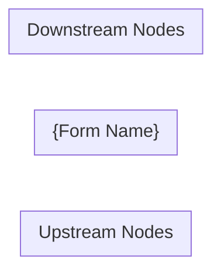

# Intermediate Node Pipeline

**Node path:** `nodes/2025/f1040/intermediate/{NODE}/`

Intermediate nodes are calculated forms (Schedule C, Form 8582, etc.) that receive
data from upstream `NodeOutput` objects rather than directly from user data entry.

Runs three phases in sequence. Gate after each phase before proceeding.

---

## Phase 1 — Research

### Goal
Produce `nodes/2025/f1040/intermediate/{NODE}/research/context.md`.

### Step 0 — Detect research mode

Check `nodes/2025/f1040/inputs/screens.json` for a Drake screen matching this node:
- Search `screen_code` (e.g. `C` for schedule_c, `SE` for schedule_se, `D` for schedule_d)
- Search `form` field (e.g. "Schedule C", "Form 8582")
- If found: **Drake + IRS mode** — follow Step 1a below
- If not found: **IRS-only mode** — skip to Step 1b

### Step 0b — Create files FIRST
Before any fetching, write both files:

**`nodes/2025/f1040/intermediate/{NODE}/research/scratchpad.md`:**
```markdown
# {Form Name} — Scratchpad

## Purpose
{One line — fill after reading Drake/IRS}

## Inputs received (from upstream nodes)
{What NodeOutputs does this node receive? Fill in after research.}

## Fields / lines identified
{Fill after Drake/IRS read}

## Open Questions
- [ ] Q: What upstream nodes feed into this form?
- [ ] Q: What calculations does this form perform?
- [ ] Q: What does this form output to downstream nodes?
- [ ] Q: What are the TY2025 constants?
- [ ] Q: What edge cases exist?

## Sources to check
- [ ] Drake KB article (if applicable)
- [ ] IRS form instructions
- [ ] Rev Proc for TY2025 constants
```

**`nodes/2025/f1040/intermediate/{NODE}/research/context.md`** — full skeleton with all sections and empty tables (see structure below).

### Step 1a — Drake + IRS research (for nodes with Drake screens)

**1a-1. Read Drake KB for the matched screen code.**

Search `site:kb.drakesoftware.com {screen name} {form name}`. Read the article in full.

After reading: update scratchpad + context.md Overview, Drake Reference, and stub rows in Input Fields.

**Rule: update context.md after EVERY source before moving to the next.**

**1a-2. IRS form instructions**
For each field: IRS definition, constraints, line number, how it's computed.

**1a-3.** Continue with Steps 2–7 below.

### Step 1b — IRS-only research (for purely calculated forms)

Skip Drake entirely. Focus on:
- IRS form instructions (PDF from irs.gov/pub/irs-pdf/)
- The IRS publication that explains the underlying rules (e.g. Pub 925 for passive activities)
- Rev Proc for TY2025 constants

After reading: update context.md Overview and stub rows in Input Fields from what upstream nodes would provide.

### Step 2 — Map upstream inputs
Determine what NodeOutput fields this node receives. Check:
```bash
grep -r "nodeType.*{NODE}\|\"$NODE\"" nodes/2025/f1040/inputs/ nodes/2025/f1040/intermediate/
```
For each upstream node: what fields does it send? Map these into the **Input Fields** table.

**After every source read: update context.md immediately.**

### Step 3 — Calculation logic
Step-by-step arithmetic from IRS instructions. Every formula must have an exact citation (document + section + page). Every constant must cite Rev Proc or official IRS source.

### Step 4 — TY2025 constants
Use Rev Proc 2024-40 as primary source. Flag prior-year values explicitly if TY2025 is not yet published.

### Step 5 — Data flow diagram
Mermaid `flowchart LR`:
- Upstream nodes that feed into this form
- Key computed fields
- Downstream nodes this form outputs to

### Step 6 — Edge cases
Filing status differences, phaseouts, limitations, carryforwards, special rules.

### Step 7 — Scratchpad resolution loop
For every `[ ]` question: research, find verifiable source, mark `[x]` with citation, update context.md.

### Step 8 — Download PDFs
```bash
mkdir -p nodes/2025/f1040/intermediate/{NODE}/research/docs
curl -sL "{url}" -o "nodes/2025/f1040/intermediate/{NODE}/research/docs/{filename}.pdf" --max-time 60
```

### Step 9 — Final pass
Every input field has a row in Input Fields and Calculation Logic. Data flow diagram complete. All URLs verified.

**Gate:** context.md has no `_Research in progress._` sections, no empty tables.

---

### context.md structure

```markdown
# {Form Name} — {IRS Form Full Name}

## Overview
{What this form calculates, what it receives from upstream, what it outputs downstream.}

**IRS Form:** {form}
**Drake Screen:** {identifier or "None — purely calculated"}
**Tax Year:** 2025
**Drake Reference:** {verified URL or "N/A"}

---

## Input Fields
Fields received from upstream NodeOutput objects.

| Field | Type | Source Node | Description | IRS Reference | URL |
| ----- | ---- | ----------- | ----------- | ------------- | --- |

---

## Calculation Logic

### Step 1 — {name}
{Description}
> **Source:** {Document}, {Section/Line}, p.{N} — {verified URL}

---

## Output Routing

| Output Field | Destination Node | Line / Field | Condition | IRS Reference | URL |
| ------------ | ---------------- | ------------ | --------- | ------------- | --- |

---

## Constants & Thresholds (Tax Year 2025)

| Constant | Value | Source | URL |
| -------- | ----- | ------ | --- |

---

## Data Flow Diagram



---

## Edge Cases & Special Rules

---

## Sources

| Document | Year | Section | URL | Saved as |
| -------- | ---- | ------- | --- | -------- |
```

---

## Phase 2 — Black-Box Tests

### Goal
Produce `nodes/2025/f1040/intermediate/{NODE}/index.test.ts` from context.md only.

### Key difference from input nodes
Intermediate nodes receive a **flat structured object** from the executor (merged NodeOutput fields), NOT an array of items. Test harness shape:

```typescript
// Intermediate nodes receive a flat merged input — no array wrapping
function compute(input: Record<string, unknown>) {
  return {node}.compute(input);
}
```

### Step 1 — Analyst agent: build coverage checklist

Spawn an **Analyst agent**:

> Read `nodes/2025/f1040/intermediate/{NODE}/research/context.md` in full. Do NOT read any other file.
> Produce a structured coverage checklist with these sections. For each item include: test name, scenario, and assertion type (routes_to / does_not_route / throws / does_not_throw / equals_scalar / output_count_unchanged).
>
> **Note:** This is an intermediate (calculated) node. It receives a flat object of merged upstream fields, not an array of items. Tests pass structured input objects directly, not arrays.
>
> Sections:
> 1. Input validation — required fields, type constraints
> 2. Per-field calculation — one row per computed output field; include zero/absent input case
> 3. Thresholds — below/at/above every constant in Constants table
> 4. Hard validation rules — throw test + boundary-pass test
> 5. Output routing — one row per downstream node in Output Routing table
> 6. Edge cases — one row per entry in Edge Cases section
> 7. Smoke test — comprehensive test with all major fields populated
>
> Output ONLY the checklist. No prose, no code.

### Step 2 — Evaluator loop (max 5 iterations)

Same as input-node.md Phase 2 Step 2, but reference `intermediate/{NODE}/research/context.md`.

### Step 3 — Builder agent: write the test file

Spawn a **Builder agent** with the FINAL checklist:

> Write a Deno test file for intermediate tax node **{NODE}**. Use ONLY the checklist below.
>
> **Important:** This is an intermediate node. It receives a flat object, NOT an array of items.
>
> ```typescript
> import { assertEquals, assertThrows } from "@std/assert";
> import { {node} } from "./index.ts";
>
> function compute(input: Record<string, unknown>) {
>   return {node}.compute(input);
> }
>
> function findOutput(result: ReturnType<typeof compute>, nodeType: string) {
>   return result.outputs.find((o) => o.nodeType === nodeType);
> }
> ```
>
> Write to: `nodes/2025/f1040/intermediate/{NODE}/index.test.ts`
>
> --- AGREED CHECKLIST ---
> {FINAL_CHECKLIST}

**Gate:** `index.test.ts` must exist with at least one `Deno.test(`.

---

## Phase 3 — Implementation

### Goal
Replace the `UnimplementedTaxNode` stub in `nodes/2025/f1040/intermediate/{NODE}/index.ts` with a real implementation that passes all tests.

### Step 0 — Verify tests exist
```bash
ls nodes/2025/f1040/intermediate/{NODE}/index.test.ts
```
Read the test file fully. Tests are the spec — never modify them.

### Step 1 — Read architecture references
- `nodes/2025/f1040/inputs/INT/index.ts` — simple routing pattern
- `nodes/2025/f1040/inputs/W2/index.ts` — complex routing with aggregation
- `nodes/2025/registry.ts` — registry to update
- `docs/product.md` §3 Core Architecture — TaxNode contract

### Step 2 — Read context.md
`nodes/2025/f1040/intermediate/{NODE}/research/context.md`

Extract: Input Fields → Zod schema; Calculation Logic → compute() logic; Output Routing → downstream nodeTypes; Constants → hard-coded TY2025 values; Validation rules → throw conditions.

### Step 3 — Design Zod schema

Intermediate nodes receive merged upstream fields as a flat object:
```typescript
export const inputSchema = z.object({
  // Fields from upstream NodeOutputs — match what upstream nodes actually emit
  field_from_upstream: z.number().optional(),
  another_field: z.number().nonnegative().optional(),
});
```
Rules: never `.default()` in schema; apply defaults in compute with `?? 0`; use `z.nativeEnum` for codes.

### Step 4 — Implement compute()
```typescript
compute(input: z.infer<typeof inputSchema>): NodeResult {
  const outputs: NodeOutput[] = [];
  // 1. Cross-field validation (throw on hard errors)
  // 2. Calculate intermediate values
  // 3. Emit once per downstream nodeType
  return { outputs };
}
```
Same rules as input nodes: no mutation; one output object per nodeType; early return for zero values.

### Step 5 — nodeType naming
```bash
grep -r "nodeType.*{node}" nodes/2025/
```

### Step 6 — Run tests
```bash
deno test nodes/2025/f1040/intermediate/{NODE}/ --allow-read
```
Fix the implementation if tests fail — never modify tests.

### Step 7 — Add stubs for new downstream nodeTypes (if needed)
Same pattern as input-node.md Step 7.

### Step 8 — Register in registry.ts
```typescript
import { myNode } from "./f1040/intermediate/{NODE}/index.ts";
my_node_type: myNode,
```
Remove the `UnimplementedTaxNode` stub registration — never register both.

### Step 9 — Type check + full test run
```bash
deno check nodes/2025/registry.ts
deno test nodes/ --allow-read
```
All must pass with zero errors.

**Note:** No start node wiring required for intermediate nodes.

---

## Completion Report

```
Node:      {NODE}
nodeType:  {registered nodeType string}
Schema:    {N} fields
Routing:   {downstream nodeTypes, comma-separated}
Tests:     {N} passed
Research:  nodes/2025/f1040/intermediate/{NODE}/research/context.md
Tests:     nodes/2025/f1040/intermediate/{NODE}/index.test.ts
Impl:      nodes/2025/f1040/intermediate/{NODE}/index.ts
```
