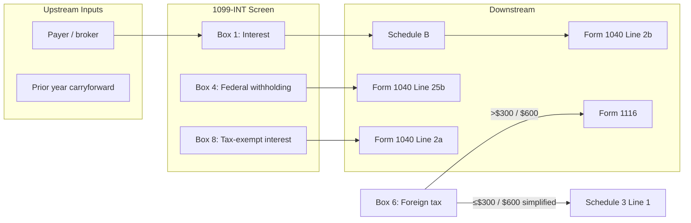
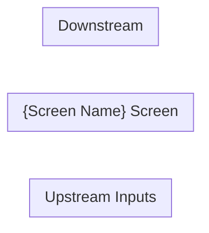

# F1040 Screen Researcher Skill

## Purpose

We are building a new professional tax software engine. Drake Tax is used as a **reference** — its screens define what data-entry fields a tax professional needs to enter. We use Drake to understand the input surface, then IRS publications to understand the calculation logic behind every field.

**The core question this research must answer:** Given the inputs on this screen, what happens next? Which other screens, forms, schedules, or engine nodes does this screen feed into? Which upstream screens or forms does this screen depend on? The data flow — both inputs into this screen and outputs out of it — must be fully mapped so the coding agent knows exactly how to wire this screen into the larger engine.

**The end goal of this research is implementation.** The `context.md` produced by this skill will be handed directly to a coding agent tasked with implementing the screen in full. The software must:
- Work correctly and accurately for every field and edge case
- Pass IRS e-file validation and schema requirements
- Produce results that would survive IRS review (correct routing, correct limits, correct form interactions)

Write as if the coding agent reading `context.md` has zero tax knowledge and no access to any other source. Every field must tell the agent: what to collect, what type/format, what constraints apply, and exactly where the value goes downstream. Every calculation must be spelled out step by step with exact arithmetic. Every constant must be a specific number with a cited source — no vague references like "see IRS instructions." If the agent can't implement correctly from `context.md` alone, the research is incomplete.

Given a Drake Tax data-entry screen name, produce exactly these outputs in `engine/nodes/2025/f1040/inputs/{SCREEN_CODE}/`:

```
engine/nodes/2025/f1040/inputs/{SCREEN_CODE}/
  index.ts             ← implementation (created by coding agent, not this skill)
  research/
    scratchpad.md      ← planning, open questions, resolved answers — updated throughout
    context.md         ← the research output — written and updated incrementally as you learn
    docs/              ← PDFs and downloaded docs go here
      {downloaded docs}
```

Nothing else.

**Iron rule:** Nothing goes into `context.md` without a verifiable reference and a confirmed working URL.

---

## Invocation

```
/f1040-screen-researcher <screen_name_or_code>
```

---

## Research Process

### Phase 0 — Resolve screen code from screens.json

Before creating any files, resolve the canonical screen code for the given input.

Read `engine/nodes/2025/f1040/inputs/screens.json` and match the input against:
1. `screen_code` (exact, case-insensitive)
2. `alias_screen_codes` entries (exact, case-insensitive)
3. `form` field (e.g. "W-2", "1099-INT", "Schedule A")

Use the matched `screen_code` as `{SCREEN_CODE}` for all paths below.

If no match is found, list the closest entries from `screens.json` and ask the user to clarify.

---

### Phase 0b — Create files FIRST (before any fetching)

**Do this before reading anything.** Create both files immediately when the skill is invoked.

**0b-1. Create `engine/nodes/2025/f1040/inputs/{SCREEN_CODE}/research/scratchpad.md`** with this skeleton:

```markdown
# {Screen Name} — Scratchpad

## Purpose

{One line: what this screen is for — fill in after Drake read}

## Fields identified (from Drake)

{Fill in after Drake read}

## Open Questions

- [ ] Q: What fields does Drake show for this screen?
- [ ] Q: Where does each box flow on the 1040?
- [ ] Q: What are the TY2025 constants (SS wage base, rates)?
- [ ] Q: What edge cases exist?

## Sources to check

- [ ] Drake KB article
- [ ] IRS instructions PDF
- [ ] Rev Proc for TY2025 constants
```

**0b-2. Create `engine/nodes/2025/f1040/inputs/{SCREEN_CODE}/research/context.md`** with the full skeleton (all sections, empty tables):

```markdown
# {Screen Name} — {IRS Form Full Name}

## Overview

_Research in progress._

**IRS Form:** {form}
**Drake Screen:** {identifier}
**Tax Year:** 2025
**Drake Reference:** {to be filled}

---

## Data Entry Fields

| Field | Type | Required | Drake Label | Description | IRS Reference | URL |
| ----- | ---- | -------- | ----------- | ----------- | ------------- | --- |

---

## Per-Field Routing

| Field | Destination | How Used | Triggers | Limit / Cap | IRS Reference | URL |
| ----- | ----------- | -------- | -------- | ----------- | ------------- | --- |

---

## Calculation Logic

_To be filled._

---

## Constants & Thresholds (Tax Year 2025)

| Constant | Value | Source | URL |
| -------- | ----- | ------ | --- |

---

## Data Flow Diagram

_To be filled._

---

## Edge Cases & Special Rules

_To be filled._

---

## Sources

| Document | Year | Section | URL | Saved as |
| -------- | ---- | ------- | --- | -------- |
```

**Both files must exist on disk before proceeding to Phase 1.**

---

### Phase 1 — Orient: read Drake, update both files

**1a. Read the Drake KB article for this screen.**

Search the Drake KB using search tool and then retrive the actual link from the search results:

```
example: Web Search("site:kb.drakesoftware.com W-2 data entry screen")
```

Articles are usually at `https://kb.drakesoftware.com/Site/Browse/{id}` — follow links from search results.

The path is invalid if it redirects to a login page.

Read the primary article in full. Follow every link in the article.
Extract: every data-entry field shown on the screen (required fields first, optional after)

**1b. Immediately after reading Drake — update BOTH files:**

Update `scratchpad.md`:

- Fill in Purpose
- List every field identified under "Fields identified"
- Add open questions for anything unclear
- Add sources to check

Update `context.md`:

- Fill in the Overview section (what screen captures, what it feeds, why it matters)
- Fill in Drake Reference URL
- Add a stub row to Data Entry Fields for each field identified (even if IRS details TBD)

**Rule: After every fetch or read, you MUST update context.md before fetching the next source.**

---

### Phase 2 — Core research (write to context.md after EVERY source)

**The loop for each source:**

1. Fetch the source (WebFetch or curl)
2. Extract relevant facts
3. **Immediately update context.md** — fill in or update rows in Data Entry Fields, Per-Field Routing, Calculation Logic, Constants, or Edge Cases
4. **Immediately update scratchpad.md** — check off resolved questions, add new ones
5. Only then move to the next source

Never batch research and write at the end. context.md must reflect current knowledge at every step.

Work through the scratchpad fields. For each area you research, immediately write what you learn into `context.md`. Don't batch it up — write it as you find it.

**2a. Inputs** — For each data-entry field:

- What does this field represent? (IRS definition, exact citation)
- Is it required or optional?
- Valid values / constraints?
  → Write into the **Data Entry Fields** table in context.md

**2b. How each input affects computation** — For each field:

- Where does this value flow? (form, line, schedule)
- How is it used? (summed, capped, rate applied, conditional routing)
- Does it trigger another form?
- Any limits or phase-outs?
  → Write into the **Per-Field Routing** table in context.md

**2c. The computation** — Step by step:

- What arithmetic happens with these inputs?
- In what order?
- What constants are needed? (cite to Rev Proc)
  → Write into **Calculation Logic** in context.md

**2d-pre. Tax year constants** — Before researching constants, confirm the target tax year:

- Constants (wage bases, limits, phase-outs, rates) change every year — always look up the value for the specific tax year being researched
- Primary source: the Rev Proc for that year (e.g. Rev. Proc. 2024-40 covers tax year 2025 constants)
- Secondary sources: IRS Publication 15 (Circular E), SSA.gov announcements
- If only a prior-year value is available, flag it explicitly: `[PRIOR YEAR: TY{N} value — TY{N+1} not yet published]`
- Do NOT copy constants from example code or prior research — always verify against the official source for the target year

**2e. Data flow diagram** — After routing is complete, draw the data flow as a Mermaid diagram:

- **Inputs into this screen:** What upstream screens, forms, or engine nodes feed data into this screen?
- **Outputs from this screen:** For every field, show the **direct** downstream node it flows into (one hop only — the immediate form/schedule/engine node, not where that node eventually goes).
- Use `flowchart LR` (left-to-right) with the screen itself as the central node
- Label edges with the field name or box number
- Show conditional routing with branching (e.g., "if foreign tax > $300 → Form 1116")
→ Write the diagram into **Data Flow Diagram** in context.md

Example shape:


**2d. Edge cases** — Actively investigate:

- Multiple instances (2+ W-2s, multiple 1099s, etc.)
- Filing status differences (Single / MFJ / MFS / HOH)
- Special codes, checkboxes, and their routing
- Phase-outs and limitations
- Interactions with other forms
- Carryforward rules
- Prior year dependencies
  → Write into **Edge Cases** in context.md

**As you research, keep scratchpad.md updated:**

- Check off resolved questions: `- [x] Q: ...` with the answer and citation
- Add new questions as they surface
- Note conflicting sources

---

### Phase 3 — Scratchpad resolution loop

When core research is done, go back to `scratchpad.md` and loop over every unresolved question:

```
for each open [ ] question in scratchpad:
  → research it
  → find verifiable IRS source
  → verify the URL resolves (WebFetch)
  → mark [x] resolved with citation
  → update context.md with the finding
  → if it surfaces new questions → add them and continue loop
```

Do not stop until every question is either:

- `[x]` Resolved with a verified citation, or
- `[!]` Explicitly flagged `[NEEDS SOURCE: reason]`

This loop is what surfaces edge cases. Do not skip it.

---

### Phase 4 — Download source documents

Download all PDFs referenced during research using the **Bash tool with curl**:

```bash
mkdir -p engine/nodes/2025/f1040/inputs/{SCREEN_CODE}/research/docs
curl -sL "{url}" -o "engine/nodes/2025/f1040/inputs/{SCREEN_CODE}/research/docs/{filename}.pdf" --max-time 60
```

> **Important:** Use `Bash` + `curl` to download PDFs — do NOT use `WebFetch`. WebFetch fetches content for reading but does **not** save files to the project directory. Only `curl` via Bash actually writes the file to `research/`.

HTML-only resources: record the URL directly in the **Sources** table of `context.md`.

**Common documents by screen type:**

| Screen             | Documents to fetch                                    |
| ------------------ | ----------------------------------------------------- |
| W-2                | iw2w3.pdf, p15.pdf, p525.pdf, i8959.pdf, rp-24-40.pdf |
| Schedule A         | i1040sca.pdf, p529.pdf, p936.pdf, p502.pdf            |
| Schedule B         | i1040scb.pdf, p550.pdf                                |
| Schedule C         | i1040sc.pdf, p334.pdf, p535.pdf, p946.pdf             |
| Schedule D / 8949  | i1040sd.pdf, p550.pdf, p544.pdf                       |
| Schedule E         | i1040se.pdf, p527.pdf, p925.pdf                       |
| Schedule SE        | i1040sse.pdf, p334.pdf                                |
| 1099-R             | i1099r.pdf, p590b.pdf, p575.pdf                       |
| 1098-T / education | i8863.pdf, p970.pdf                                   |
| 8812 (CTC)         | i8812.pdf                                             |
| 2441 (dep. care)   | i2441.pdf, p503.pdf                                   |
| 6251 (AMT)         | i6251.pdf                                             |
| 8995 (QBI)         | i8995.pdf, p535.pdf                                   |
| SSA-1099           | p915.pdf                                              |
| IRA / 5498         | p590a.pdf                                             |

---

### Phase 5 — Final pass on context.md

When the scratchpad loop is complete, do a final pass:

- Every data-entry field has a row in Data Entry Fields
- Every field has a row in Per-Field Routing
- Data Flow Diagram is complete — both upstream inputs and downstream outputs are shown, conditional branches labeled
- Every URL is verified to resolve
- Every `[NEEDS SOURCE]` item is flagged visibly
- Sources table is complete

---

## context.md structure

```markdown
# {Screen Name} — {IRS Form Full Name}

## Overview

{What this screen captures, what it feeds into, why it matters.}

**IRS Form:** {form}
**Drake Screen:** {identifier}
**Tax Year:** 2025
**Drake Reference:** {verified URL}

---

## Data Entry Fields

Required fields first, then optional. Data-entry only — no computed/display fields.

| Field       | Type   | Required | Drake Label | Description                     | IRS Reference         | URL         |
| ----------- | ------ | -------- | ----------- | ------------------------------- | --------------------- | ----------- |
| box_1_wages | number | yes      | "Box 1"     | Wages, tips, other compensation | iw2w3.pdf, Box 1, p.X | https://... |

---

## Per-Field Routing

For every field above: where the value goes, how it is used, what it triggers, any limits.

| Field       | Destination        | How Used               | Triggers | Limit / Cap | IRS Reference                   | URL         |
| ----------- | ------------------ | ---------------------- | -------- | ----------- | ------------------------------- | ----------- |
| box_1_wages | Form 1040, Line 1a | Summed across all W-2s | —        | None        | 1040 Instructions, Line 1a, p.X | https://... |

---

## Calculation Logic

### Step 1 — {name}

{Description}

> **Source:** {Document}, {Section/Line}, p.{N} — {verified URL}

---

## Constants & Thresholds (Tax Year 2025)

| Constant     | Value    | Source                   | URL         |
| ------------ | -------- | ------------------------ | ----------- |
| SS wage base | $176,100 | Rev. Proc. 2024-40, §3.X | https://... |

---

## Data Flow Diagram



_Label edges with field/box names. Show conditional branches (e.g., "if foreign tax > threshold → Form 1116")._

---

## Edge Cases & Special Rules

### {Rule name}

{Description}

> **Source:** {Document}, {Section}, p.{N} — {verified URL}

---

## Sources

All URLs verified to resolve.

| Document                     | Year | Section      | URL                                       | Saved as  |
| ---------------------------- | ---- | ------------ | ----------------------------------------- | --------- |
| Drake KB — W-2               | —    | Full article | https://kb.drakesoftware.com/...          | —         |
| General Instructions W-2/W-3 | 2025 | Full         | https://www.irs.gov/pub/irs-pdf/iw2w3.pdf | iw2w3.pdf |
```

---

## Quality Rules

1. **Create files first.** `scratchpad.md` and `context.md` (with full skeleton) must be written to disk before any fetching begins.
2. **Drake first.** Read Drake to get the field list. IRS to understand the math. Both required.
3. **Data-entry fields only.** No computed/read-only fields.
4. **Per-field routing is mandatory.** Every data-entry field must appear in Per-Field Routing.
5. **Write context.md after every source.** After each fetch: update context.md immediately, then scratchpad.md, then move to the next source. Never batch.
6. **Scratchpad is for questions.** Keep all open questions, working notes, and resolved answers there.
7. **Scratchpad loop before final pass.** Resolve every open question before signing off.
8. **Verify every URL.** Use WebFetch to confirm each URL resolves before writing it into context.md.
9. **Flag what you can't verify.** Write `[NEEDS SOURCE: description]` — never state unverified claims as fact.
10. **Exact citations.** Document name + section/line + page number. Not just "see instructions."
11. **Tax year 2025.** If only a prior-year pub is available, note it explicitly.
12. **Data flow diagram is mandatory.** Show direct upstream inputs and direct downstream output nodes only — one hop. Do not trace further than the immediate destination.
13. **Production accuracy standard.** Before signing off, apply the following test: *"Could a coding agent implement this screen from context.md alone — with zero tax knowledge and no other sources — and produce output that is 100% correct for every field, edge case, and form interaction?"* If the answer is no for any field, the research is not done. This includes:
    - Every downstream form's exact line numbers verified against TY2025 instructions (not assumed from prior years)
    - Every cross-field validation rule stated explicitly with numeric tolerances
    - Every secondary form flow (e.g. Form 8839, 8853, 8880) documented with its own step-by-step logic, not just a routing label
    - Every state-specific variation for Box 14 items documented or explicitly marked out of scope
    - No description field still containing "verify" or "TBD" language
    The research is complete only when you are confident that tax software built from context.md would be fully accurate to the highest professional standards and survive IRS scrutiny.
