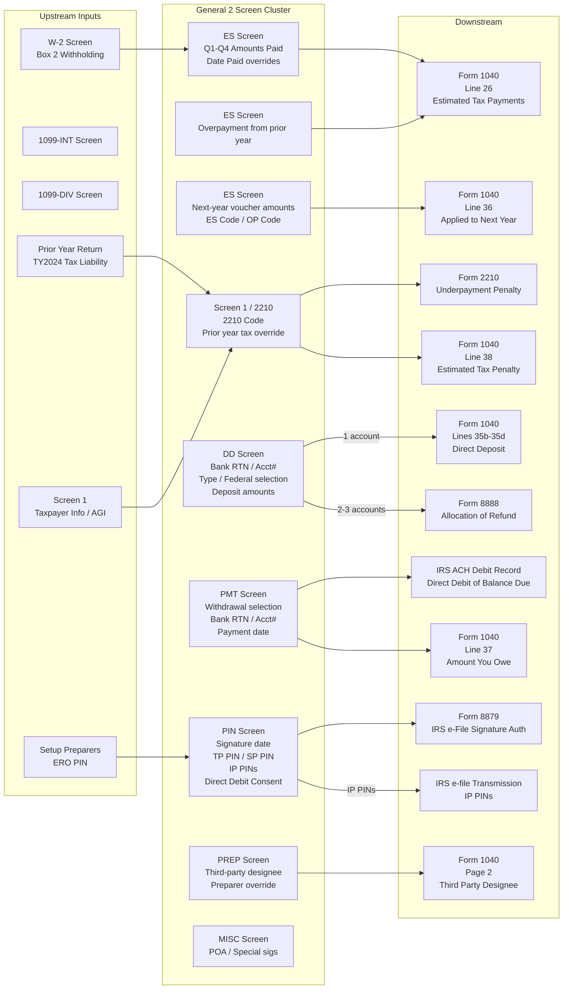

# General 2 — Drake Filing Information Screen Cluster

## Overview

Drake's "General 2" screen cluster (screen code "2") captures all filing information needed to complete Form 1040 pages 2–3 (Payments, Refund, Amount You Owe sections) and the associated e-file authorization forms. It spans seven sub-screens on Drake's General tab:

| Drake Screen | Description |
|---|---|
| **ES** | Estimated Tax — taxes already paid by quarter, next-year vouchers, overpayment application |
| **DD** | Direct Deposit — bank account(s) for refund allocation (Form 8888) |
| **PMT** | Electronic Funds Withdrawal — direct debit of balance due or ES payments |
| **PIN** | IRS e-file Signature Authorization — Form 8879, taxpayer/spouse PINs, IP PINs |
| **PREP** | Preparer Overrides — third-party designee, preparer override fields |
| **MISC** | Miscellaneous Return Options — special signatures (POA, taxpayer for spouse) |
| **EF** | E-file Selections — which federal/state returns to e-file |

**What it feeds into:** Form 1040 Lines 25c (other federal withholding), 26 (estimated tax payments), 35a–35d (refund/direct deposit), 36 (applied to next year), 37 (amount owed), 38 (estimated tax penalty). Also produces Form 8879, Form 8888, Form 8878.

**Why it matters:** These screens are the last data entry step before e-filing. They control payment routing, electronic signature authority, refund disbursement, and underpayment penalty calculations. Errors here cause failed transmissions, misdirected refunds, or IRS penalties.

**IRS Forms:** Form 1040 (multiple lines), Form 8879 (e-file signature), Form 8888 (refund allocation), Form 2210 (underpayment penalty), Form 8878 (extension signature)
**Drake Screen:** General tab — ES, DD, PMT, PIN, PREP, MISC, EF sub-screens
**Tax Year:** 2025
**Drake Reference:** Drake Tax Manual 2024 (Individuals), pp. 138–154 — https://www.drakesoftware.com/sharedassets/manuals/2024/individuals.pdf
**Screen List Reference:** https://kb.drakesoftware.com/kb/Drake-Tax/20051.htm

---

## Data Entry Fields

Required fields first, then optional. Data-entry only — no computed/display fields.

### ES Screen — Estimated Taxes Already Paid / Next Year Vouchers

| Field | Type | Required | Drake Label | Description | IRS Reference | URL |
| ----- | ---- | -------- | ----------- | ----------- | ------------- | --- |
| es_overpayment_from_prior_year | number | no | "Overpayment applied from [prior year]" | Dollar amount of prior-year overpayment the taxpayer elected to apply to current year ES. Flows to Form 1040 Line 26. | 1040 Instructions TY2025, Line 26, p.39 | https://www.irs.gov/pub/irs-pdf/i1040gi.pdf |
| es_q1_date_paid | date | no | "1st quarter — Date Paid" | Override for Q1 ES payment date. Default = Apr 15, 2025. If different, enter actual date. | Form 2210 Instructions TY2025, Part III, Line 11, Table 1 | https://www.irs.gov/pub/irs-pdf/i2210.pdf |
| es_q1_amount_paid | number | no | "1st quarter — Amount Paid" | Actual ES payment made for Q1. Flows to Form 1040 Line 26. | 1040 Instructions TY2025, Line 26, p.39 | https://www.irs.gov/pub/irs-pdf/i1040gi.pdf |
| es_q2_date_paid | date | no | "2nd quarter — Date Paid" | Override for Q2 ES payment date. Default = Jun 15, 2025. | Form 2210 Instructions TY2025, Part III, Table 1, column (b) header | https://www.irs.gov/pub/irs-pdf/i2210.pdf |
| es_q2_amount_paid | number | no | "2nd quarter — Amount Paid" | Actual ES payment made for Q2. Flows to Form 1040 Line 26. | 1040 Instructions TY2025, Line 26, p.39 | https://www.irs.gov/pub/irs-pdf/i1040gi.pdf |
| es_q3_date_paid | date | no | "3rd quarter — Date Paid" | Override for Q3 ES payment date. Default = Sep 15, 2025. | Form 2210 Instructions TY2025, Part III, Table 1, column (c) header | https://www.irs.gov/pub/irs-pdf/i2210.pdf |
| es_q3_amount_paid | number | no | "3rd quarter — Amount Paid" | Actual ES payment made for Q3. Flows to Form 1040 Line 26. | 1040 Instructions TY2025, Line 26, p.39 | https://www.irs.gov/pub/irs-pdf/i1040gi.pdf |
| es_q4_date_paid | date | no | "4th quarter — Date Paid" | Override for Q4 ES payment date. Default = Jan 15, 2026. | Form 2210 Instructions TY2025, Part III, Table 1, column (d) header | https://www.irs.gov/pub/irs-pdf/i2210.pdf |
| es_q4_amount_paid | number | no | "4th quarter — Amount Paid" | Actual ES payment made for Q4. Flows to Form 1040 Line 26. | 1040 Instructions TY2025, Line 26, p.39 | https://www.irs.gov/pub/irs-pdf/i1040gi.pdf |
| es_code | enum | no | "ES Code" | Controls voucher generation: blank=auto, N=suppress, P=produce, D=prior year, X=blank, T=prior year+adjustments, F=farmer/fisher, H=half-year, M=monthly | 1040 Instructions; Pub 505 | Drake Manual p.139 |
| es_op_code | enum | no | "OP Code" | Overpayment code: controls how prior-year overpayment is applied to next-year vouchers | 1040 Line 36 | Drake Manual p.140–141 |
| es_overpayment_to_apply_next_year | number | no | "Amount of overpayment to apply to 2025" | Amount of TY2025 overpayment to carry forward and apply to first TY2026 estimated tax installment. Flows to Form 1040 Line 36. Election is irrevocable once filed. | 1040 Instructions TY2025, Line 36, p.63 | https://www.irs.gov/pub/irs-pdf/i1040gi.pdf |
| es_voucher1_estimate_amt | number | no | "Voucher 1 — Estimate Amt" | Override for Q1 TY2026 estimated tax voucher amount. If blank, program calculates equally from total. | Pub 505 | Drake Manual p.140 |
| es_voucher2_estimate_amt | number | no | "Voucher 2 — Estimate Amt" | Override for Q2 TY2026 estimated tax voucher amount. | Pub 505 | Drake Manual p.140 |
| es_voucher3_estimate_amt | number | no | "Voucher 3 — Estimate Amt" | Override for Q3 TY2026 estimated tax voucher amount. | Pub 505 | Drake Manual p.140 |
| es_voucher4_estimate_amt | number | no | "Voucher 4 — Estimate Amt" | Override for Q4 TY2026 estimated tax voucher amount. | Pub 505 | Drake Manual p.140 |
| es_increase_decrease_by | number | no | "Increase/decrease calculated estimates by" | Dollar adjustment (+/-) to total calculated estimated tax for next year. | Pub 505 | Drake Manual p.141 |
| es_2210_code | enum | no | "2210 Code" (on screen 1) | Controls Form 2210 production: X=calculate and produce if required, P=produce always, F=use 2210-F if required, G=produce 2210-F always, N=suppress | Form 2210 Instructions | Drake Manual p.143 |
| es_prior_year_federal_tax | number | no | "Prior year federal tax" (2210 Options on screen 1) | Override for prior-year tax used in safe harbor calculation on Form 2210. Default flows from prior-year return. | Form 2210, line 8 | Drake Manual p.143 |

### DD Screen — Direct Deposit (Refund Allocation)

| Field | Type | Required | Drake Label | Description | IRS Reference | URL |
| ----- | ---- | -------- | ----------- | ----------- | ------------- | --- |
| dd_acct1_federal_selection | enum | yes (if using DD) | "Federal selection" (Account #1) | Y = direct deposit federal refund to this account; N = do not. Default Y. | 1040 Instructions TY2025, Lines 35a–35d, p.62–63 | https://www.irs.gov/pub/irs-pdf/i1040gi.pdf |
| dd_acct1_state_city_selection | enum | no | "State/city selection" (Account #1) | State abbreviation for state refund deposit to this account; blank = no state deposit. | State returns | Drake Manual p.147 |
| dd_acct1_financial_institution | string | yes (if using DD) | "Name of financial institution" | Bank or credit union name. Free text. | 1040 Instructions TY2025, Line 35b, p.63 | https://www.irs.gov/pub/irs-pdf/i1040gi.pdf |
| dd_acct1_rtn | string | yes (if using DD) | "RTN" | 9-digit ABA bank routing transit number. First two digits must be 01–12 or 21–32. Must be entered twice (confirmed). | 1040 Instructions TY2025, Line 35b, p.63 | https://www.irs.gov/pub/irs-pdf/i1040gi.pdf |
| dd_acct1_rtn_confirm | string | yes (if using DD) | "Repeat account information — RTN" | Confirmation reentry of RTN. Must match dd_acct1_rtn exactly. | Drake Manual p.145 | Drake Manual p.145 |
| dd_acct1_account_number | string | yes (if using DD) | "Account number" | Bank account number. Up to 17 characters (numbers and letters). Include hyphens, omit spaces and special symbols. Enter left to right; leave unused boxes blank. | 1040 Instructions TY2025, Line 35d, p.63 | https://www.irs.gov/pub/irs-pdf/i1040gi.pdf |
| dd_acct1_account_number_confirm | string | yes (if using DD) | "Repeat account information — Account number" | Confirmation reentry of account number. Must match exactly. | Drake Manual p.145 | Drake Manual p.145 |
| dd_acct1_account_type | enum | yes (if using DD) | "Type of account" | Checking or Savings. Check one box; do not check both. For IRA, health savings, brokerage, or other similar account, ask institution whether to check Checking or Savings. | 1040 Instructions TY2025, Line 35c, p.63 | https://www.irs.gov/pub/irs-pdf/i1040gi.pdf |
| dd_acct1_account_type_confirm | enum | yes (if using DD) | "Repeat account information — Type of account" | Confirmation of account type. Must match. | Drake Manual p.145 | Drake Manual p.145 |
| dd_acct1_is_ira | boolean | no | "Check if account is IRA" | Flag that the deposit account is a traditional or Roth IRA (not SIMPLE IRA). IRA must be established at bank before requesting deposit. | 1040 Instructions TY2025, Lines 35a–35d, p.62 | https://www.irs.gov/pub/irs-pdf/i1040gi.pdf |
| dd_acct1_is_foreign | boolean | no | "Check if account is Foreign" | Flag that account is outside U.S. (triggers EF Message warning — IAT not supported for states). | Drake Manual p.145 | Drake Manual p.145 |
| dd_acct1_deposit_refund_from | enum | no | "Deposit refund from" | Which return's refund to deposit: 1040, 1040-X, 1040-X 2nd Amended, 1040-X 3rd Amended. | Drake Manual p.145 | Drake Manual p.145 |
| dd_acct1_federal_deposit_amount | number | no | "Federal deposit amount" (Account #1) | Override: specific dollar amount of federal refund to deposit in this account. Used when splitting across 2–3 accounts. If blank, entire refund goes here. | 1040 Instructions TY2025, p.61 (Form 8888 reference) | https://www.irs.gov/pub/irs-pdf/i1040gi.pdf |
| dd_acct2_* | (same fields as acct1) | no | Account #2 fields | Second bank account for refund split. Same fields as Account #1. If used, federal_selection should be set. | 1040 Instructions TY2025, p.61–62 | https://www.irs.gov/pub/irs-pdf/i1040gi.pdf |
| dd_acct3_* | (same fields as acct1) | no | Account #3 fields | Third bank account for refund split. Maximum 3 accounts total. | 1040 Instructions TY2025, p.61–62 | https://www.irs.gov/pub/irs-pdf/i1040gi.pdf |
| dd_paper_check | boolean | no | "Paper Check" (on BOND screen) | Remainder of refund (after direct deposit amounts) issued as paper check. Note: IRS began phasing out paper checks in October 2025 — see Edge Cases Rule 12. | 1040 Instructions TY2025, Lines 35a–35d, p.62 | https://www.irs.gov/pub/irs-pdf/i1040gi.pdf |
| dd_savings_bond | boolean | no | "U.S. Savings Bond Purchases" (BOND screen) | Portion of refund used to buy Series I Savings Bonds (Form 8888 Part II). | 1040 Instructions TY2025, p.61 | https://www.irs.gov/pub/irs-pdf/i1040gi.pdf |

### PMT Screen — Electronic Withdrawal (Balance Due / ES Payments)

| Field | Type | Required | Drake Label | Description | IRS Reference | URL |
| ----- | ---- | -------- | ----------- | ----------- | ------------- | --- |
| pmt_withdrawal_selection | enum | yes (if direct debit) | "Withdrawal selection — Federal selection" | Y = withdraw both balance due and ES payments; E = withdraw ES payments only | 1040 Instructions TY2025, Line 37, p.63–64 | https://www.irs.gov/pub/irs-pdf/i1040gi.pdf |
| pmt_acct1_financial_institution | string | yes (if direct debit) | "Name of financial institution" | Bank or credit union name | Drake Manual p.149–150 | Drake Manual p.149–150 |
| pmt_acct1_rtn | string | yes (if direct debit) | "RTN" | 9-digit ABA routing transit number. First two digits must be 01–12 or 21–32. Entered twice. | 1040 Instructions TY2025, Line 35b, p.63 | https://www.irs.gov/pub/irs-pdf/i1040gi.pdf |
| pmt_acct1_rtn_confirm | string | yes (if direct debit) | "Repeat account information — RTN" | Confirmation reentry of RTN | Drake Manual p.149–150 | Drake Manual p.149–150 |
| pmt_acct1_account_number | string | yes (if direct debit) | "Account number" | Bank account number (up to 17 characters). Entered twice. | 1040 Instructions TY2025, Line 35d, p.63 | https://www.irs.gov/pub/irs-pdf/i1040gi.pdf |
| pmt_acct1_account_number_confirm | string | yes (if direct debit) | "Repeat account information — Account number" | Confirmation reentry of account number | Drake Manual p.149–150 | Drake Manual p.149–150 |
| pmt_acct1_account_type | enum | yes (if direct debit) | "Type of account" | Checking or Savings. Entered twice. | 1040 Instructions TY2025, Line 35c, p.63 | https://www.irs.gov/pub/irs-pdf/i1040gi.pdf |
| pmt_acct1_account_type_confirm | enum | yes (if direct debit) | "Repeat account information — Type of account" | Confirmation of account type | Drake Manual p.149–150 | Drake Manual p.149–150 |
| pmt_federal_payment_amount | number | no | "Federal payment amount" | Override for amount to debit. Default = full balance due (Form 1040 Line 37 "Amount you owe"). | 1040 Instructions TY2025, Line 37, p.63 | https://www.irs.gov/pub/irs-pdf/i1040gi.pdf |
| pmt_requested_payment_date | date | no | "Requested payment date" | Date to debit the account. Due date is April 15, 2026 for most taxpayers. Cannot debit a future date beyond deadline. If filed after Apr 15, payment date must not exceed current date. | 1040 Instructions TY2025, Line 37, p.64 | https://www.irs.gov/pub/irs-pdf/i1040gi.pdf |
| pmt_daytime_phone | string | no | "Daytime phone number" | Override for daytime phone. Default flows from screen 1 (taxpayer info). | Drake Manual p.149–150 | Drake Manual p.149–150 |
| pmt_payment_is_for | enum | no | "Payment is for" | Which return type this debit applies to: 1040, 4868, 2350, 1040-X, 1040-X 2nd Amended, 1040-X 3rd Amended | Drake Manual p.149–150 | Drake Manual p.149–150 |
| pmt_es_voucher1_amount | number | no | "Federal 1040-ES — Voucher 1 amount" | Override for Q1 ES payment amount (when using electronic withdrawal for ES only). Default from ES screen. | Form 2210 Instructions TY2025, Part III, Line 11, p.4 | https://www.irs.gov/pub/irs-pdf/i2210.pdf |
| pmt_es_voucher2_amount | number | no | "Federal 1040-ES — Voucher 2 amount" | Override for Q2 ES payment amount | Form 2210 Instructions TY2025, Part III, Line 11, p.4 | https://www.irs.gov/pub/irs-pdf/i2210.pdf |
| pmt_es_voucher3_amount | number | no | "Federal 1040-ES — Voucher 3 amount" | Override for Q3 ES payment amount | Form 2210 Instructions TY2025, Part III, Line 11, p.4 | https://www.irs.gov/pub/irs-pdf/i2210.pdf |
| pmt_es_voucher4_amount | number | no | "Federal 1040-ES — Voucher 4 amount" | Override for Q4 ES payment amount | Form 2210 Instructions TY2025, Part III, Line 11, p.4 | https://www.irs.gov/pub/irs-pdf/i2210.pdf |
| pmt_acct2_state_city_selection | enum | no | "State/city selection — Account #2" | For state payment from a different account than federal. | State returns | Drake Manual p.150 |

### PIN Screen — IRS e-file Signature Authorization (Form 8879)

| Field | Type | Required | Drake Label | Description | IRS Reference | URL |
| ----- | ---- | -------- | ----------- | ----------- | ------------- | --- |
| pin_signature_date | date | **yes** | "PIN signature date" | Date taxpayer(s) signed Form 8879. REQUIRED — if blank, EF Message generated and return cannot e-file. Must be on or before transmission date. | 1040 Instructions TY2025, "Sign Your Return," p.65–66; Drake Manual p.153 | https://www.irs.gov/pub/irs-pdf/i1040gi.pdf |
| pin_taxpayer_pin | string | yes (e-file) | "Taxpayer PIN" | Self-select PIN — any 5 digits except 00000. Cannot use Self-Select PIN if first-time filer under age 16 at end of 2025. Can be auto-generated by program. | 1040 Instructions TY2025, "Requirements for an Electronic Return," p.65–66 | https://www.irs.gov/pub/irs-pdf/i1040gi.pdf |
| pin_taxpayer_entered | boolean | no | "Taxpayer entered" | Checkbox indicating client self-entered their PIN (not the preparer). | Drake Manual p.153 | Drake Manual p.153 |
| pin_spouse_pin | string | no | "Spouse PIN" | Spouse's self-select 5-digit PIN (MFJ only — both taxpayer and spouse must create and enter PINs). Not 00000. | 1040 Instructions TY2025, "Requirements for an Electronic Return," p.65–66 | https://www.irs.gov/pub/irs-pdf/i1040gi.pdf |
| pin_spouse_entered | boolean | no | "Spouse entered" | Checkbox indicating spouse self-entered their PIN. | Drake Manual p.153 | Drake Manual p.153 |
| pin_direct_debit_consent | boolean | no | "Direct Debit Consent" | Must be checked if direct debit (PMT screen) is being used. Authorizes electronic withdrawal. | Form 8879 (IRS form description) | Drake Manual p.150, 153 |
| pin_print_8879_instructions | enum | no | "Print filing instructions for Form 8878 and 8879" | Override whether to print 8879 filing instructions with return. | Drake Manual p.152 | Drake Manual p.152 |
| pin_select_form | enum | no | "Select Form" | Which non-1040 return the 8879 applies to: 1040-X/Superseded, 4868, 2350, 9465, Form 56. | Drake Manual p.154 | Drake Manual p.154 |
| pin_prior_year_agi | number | no | "Prior year AGI" | Prior-year AGI used to verify identity in Self-Select PIN method. Required for forms 2350, 9465, Form 56. For TY2025, this is AGI from TY2024 Form 1040 Line 11. Not required if using prior-year PIN. | 1040 Instructions TY2025, "Requirements for an Electronic Return," p.66 | https://www.irs.gov/pub/irs-pdf/i1040gi.pdf |
| pin_taxpayer_ip_pin | string | no | "Taxpayer IP PIN" | 6-digit Identity Protection PIN assigned by IRS to taxpayer. If issued, all 6 digits MUST appear — failure to include results in invalid signature and rejected return. New IP PINs sent mid-January 2026. | 1040 Instructions TY2025, "Identity Protection PIN," p.66 | https://www.irs.gov/pub/irs-pdf/i1040gi.pdf |
| pin_spouse_ip_pin | string | no | "Spouse IP PIN" | 6-digit IP PIN assigned to spouse. Both must be included on MFJ return if both received IP PINs. | 1040 Instructions TY2025, "Identity Protection PIN," p.66 | https://www.irs.gov/pub/irs-pdf/i1040gi.pdf |

### Screen 2 (Dependents) — Dependent IP PIN Field

| Field | Type | Required | Drake Label | Description | IRS Reference | URL |
| ----- | ---- | -------- | ----------- | ----------- | ------------- | --- |
| dependent_ip_pin | string | no | "Dependent IP PIN" (bottom right of screen 2) | 6-digit Identity Protection PIN for each dependent. Does NOT appear on printed return but IS transmitted in e-file. Required for e-file if dependent has been assigned an IP PIN. | IRS e-file spec; Pub 5187 | KB 12938 |

### PREP Screen — Third-Party Designee / Preparer Override

| Field | Type | Required | Drake Label | Description | IRS Reference | URL |
| ----- | ---- | -------- | ----------- | ----------- | ------------- | --- |
| prep_allow_third_party | enum | no | "Allow another person to discuss this return with IRS" | Y = designate a third party; N = no designee. Authorization automatically ends on the due date for filing the TY2026 return — April 15, 2027 for most taxpayers. | 1040 Instructions TY2025, "Third Party Designee," p.65 | https://www.irs.gov/pub/irs-pdf/i1040gi.pdf |
| prep_designee_first_name | string | no | "First name" | Third-party designee's first name. Printed in "Third Party Designee" area on Form 1040 page 2. | 1040 Instructions TY2025, "Third Party Designee," p.65 | https://www.irs.gov/pub/irs-pdf/i1040gi.pdf |
| prep_designee_last_name | string | no | "Last name" | Third-party designee's last name. Printed with first name on Form 1040 page 2. | 1040 Instructions TY2025, "Third Party Designee," p.65 | https://www.irs.gov/pub/irs-pdf/i1040gi.pdf |
| prep_designee_phone | string | no | "Phone" | Third-party designee's phone number. Printed on Form 1040 page 2. | 1040 Instructions TY2025, "Third Party Designee," p.65 | https://www.irs.gov/pub/irs-pdf/i1040gi.pdf |
| prep_designee_pin | string | no | "PIN" | Third-party designee's 5-digit personal identification number. Required if a preparer/ERO is the designee. Must be set up in Setup > Preparers and Users. | 1040 Instructions TY2025, "Third Party Designee," p.65 | https://www.irs.gov/pub/irs-pdf/i1040gi.pdf |
| prep_designee_email | string | no | "Email" | Third-party designee's email. Optional. Not printed on Form 1040 — for preparer records only. | Drake Manual p.151 | Drake Manual p.151 |

### MISC Screen — Special Signatures / Miscellaneous Codes

| Field | Type | Required | Drake Label | Description | IRS Reference | URL |
| ----- | ---- | -------- | ----------- | ----------- | ------------- | --- |
| misc_signed_by_poa | boolean | no | "Return signed by Power of Attorney" | Indicates someone other than taxpayer signed using POA. Triggers Form 2848 requirement and Form 8453 transmittal. | Form 2848; Form 8453 | Drake Manual p.154 |
| misc_poa_signer_name | string | no | POA signer name field | Name of person signing by power of attorney. | Form 2848 | Drake Manual p.154 |
| misc_taxpayer_signing_for_spouse | boolean | no | "Taxpayer is signing for Spouse" | Marks when taxpayer signs on behalf of incapacitated/deceased spouse. Requires SCH screen code 024 explanation. | 1040 Instructions, Signature section | Drake Manual p.154 |
| misc_both_parents_deceased | boolean | no | "Both parents deceased" | For Form 8615 (Kiddie Tax) when both parents are deceased. Changes calculation method. | Form 8615 Instructions | Drake Manual p.137 |

---

## Per-Field Routing

| Field | Destination | How Used | Triggers | Limit / Cap | IRS Reference | URL |
| ----- | ----------- | -------- | -------- | ----------- | ------------- | --- |
| es_overpayment_from_prior_year | Form 1040, Line 26 | Added to total estimated tax payments | None | None | 1040 Instructions TY2025, Line 26, p.39 | https://www.irs.gov/pub/irs-pdf/i1040gi.pdf |
| es_q1_amount_paid | Form 1040, Line 26 | Summed with Q2+Q3+Q4+overpayment | None | None | 1040 Instructions TY2025, Line 26, p.39 | https://www.irs.gov/pub/irs-pdf/i1040gi.pdf |
| es_q2_amount_paid | Form 1040, Line 26 | Summed with Q1+Q3+Q4+overpayment | None | None | 1040 Instructions TY2025, Line 26, p.39 | https://www.irs.gov/pub/irs-pdf/i1040gi.pdf |
| es_q3_amount_paid | Form 1040, Line 26 | Summed with Q1+Q2+Q4+overpayment | None | None | 1040 Instructions TY2025, Line 26, p.39 | https://www.irs.gov/pub/irs-pdf/i1040gi.pdf |
| es_q4_amount_paid | Form 1040, Line 26 | Summed with Q1+Q2+Q3+overpayment | None | None | 1040 Instructions TY2025, Line 26, p.39 | https://www.irs.gov/pub/irs-pdf/i1040gi.pdf |
| es_overpayment_to_apply_next_year | Form 1040, Line 36 | Applied to next year — reduces current year refund; election is irrevocable once filed | None | Cannot exceed overpayment on Line 34; election cannot be changed later | 1040 Instructions TY2025, Line 36, p.63 | https://www.irs.gov/pub/irs-pdf/i1040gi.pdf |
| es_q1_date_paid through es_q4_date_paid | Form 2210, Part III, Line 11 | Date used to calculate number of days payment was late per installment period | Triggers Form 2210 penalty computation if underpayment exists | None | Form 2210 Instructions TY2025, Part III, Line 11, p.4 | https://www.irs.gov/pub/irs-pdf/i2210.pdf |
| es_2210_code | Form 2210 | Controls whether Form 2210 is generated and filed | Triggers or suppresses Form 2210; code N suppresses entirely | None | Form 2210 Instructions TY2025, General Instructions, p.1 | https://www.irs.gov/pub/irs-pdf/i2210.pdf |
| es_prior_year_federal_tax | Form 2210, Line 8 | Safe harbor threshold: 100% or 110% of prior-year tax depending on AGI | None | 110% threshold applies if TY2024 AGI > $150K ($75K MFS) | Form 2210 Instructions TY2025, "Who Must Pay the Underpayment Penalty," p.1 | https://www.irs.gov/pub/irs-pdf/i2210.pdf |
| dd_acct1_rtn | Form 1040, Line 35b (single account) OR Form 8888 (multiple accounts) | Printed on return or transmitted on 8888 | Triggers Form 8888 if 2+ accounts used | Must be 9 digits; first two digits 01–12 or 21–32 | 1040 Instructions TY2025, Line 35b, p.63 | https://www.irs.gov/pub/irs-pdf/i1040gi.pdf |
| dd_acct1_account_type | Form 1040, Line 35c OR Form 8888 | Checking/Savings indicator on return | None | One value only — do not check both | 1040 Instructions TY2025, Line 35c, p.63 | https://www.irs.gov/pub/irs-pdf/i1040gi.pdf |
| dd_acct1_account_number | Form 1040, Line 35d OR Form 8888 | Account number printed/transmitted | None | Max 17 characters (letters and numbers, hyphens allowed, no spaces) | 1040 Instructions TY2025, Line 35d, p.63 | https://www.irs.gov/pub/irs-pdf/i1040gi.pdf |
| dd_acct1_federal_deposit_amount | Form 8888, Line 1b/2b/3b | Dollar amount to deposit in each account | Triggers Form 8888 | Sum of all deposit amounts must not exceed total refund; remainder as check | 1040 Instructions TY2025, p.61 (Form 8888 reference) | https://www.irs.gov/pub/irs-pdf/i1040gi.pdf |
| dd_savings_bond | Form 8888, Part II | Portion of refund used to buy I-bonds | Triggers Form 8888 Part II / BOND screen | Min $50 per bond, multiples of $50; max $5,000 per return | Drake Manual p.147 | Drake Manual p.147 |
| pmt_withdrawal_selection | IRS ACH debit record; Form 1040 Line 37 area | Routes debit of balance due (Y) or ES payments only (E) | Triggers requirement to check Direct Debit Consent on Form 8879 | None | 1040 Instructions TY2025, Line 37, p.63–64 | https://www.irs.gov/pub/irs-pdf/i1040gi.pdf |
| pmt_acct1_rtn | IRS ACH debit record (Electronic Funds Withdrawal) | Routing number for debit | None | Must be 9 digits; first two digits 01–12 or 21–32 | 1040 Instructions TY2025, Line 35b, p.63 (same RTN rules) | https://www.irs.gov/pub/irs-pdf/i1040gi.pdf |
| pmt_requested_payment_date | IRS ACH debit record | Date funds debited from taxpayer's account | Must be ≤ Apr 15, 2026 if filed on/before Apr 15, 2026; must be ≤ current date if filed after Apr 15, 2026 | Cannot be a future date beyond filing deadline | 1040 Instructions TY2025, Line 37, p.64 | https://www.irs.gov/pub/irs-pdf/i1040gi.pdf |
| pmt_federal_payment_amount | IRS ACH debit record | Dollar amount debited | None | Cannot exceed Line 37 balance due | 1040 Instructions TY2025, Line 37, p.63 | https://www.irs.gov/pub/irs-pdf/i1040gi.pdf |
| pin_signature_date | Form 8879, Part II | Date printed on Form 8879; confirms taxpayer authorized transmission | Required for e-file — missing triggers EF Message and blocks transmission | Must be on/before transmission date | 1040 Instructions TY2025, "Sign Your Return," p.65 | https://www.irs.gov/pub/irs-pdf/i1040gi.pdf |
| pin_taxpayer_pin | Form 8879, Part I, Taxpayer PIN field; IRS e-file record | Transmitted as taxpayer's electronic signature | Required for e-file | 5 digits, not 00000; cannot be used by first-time filers under age 16 at end of 2025 | 1040 Instructions TY2025, "Requirements for an Electronic Return," p.65–66 | https://www.irs.gov/pub/irs-pdf/i1040gi.pdf |
| pin_spouse_pin | Form 8879, Part I, Spouse PIN field | Transmitted as spouse's electronic signature (MFJ only) | None | 5 digits, not 00000 | 1040 Instructions TY2025, "Requirements for an Electronic Return," p.65–66 | https://www.irs.gov/pub/irs-pdf/i1040gi.pdf |
| pin_direct_debit_consent | Form 8879, Part I, check box | Required authorization for electronic withdrawal | Must be checked if PMT screen used; triggers EF Message if missing | N/A (boolean) | Drake Manual p.150, 153 | Drake Manual p.150, 153 |
| pin_taxpayer_ip_pin | IRS e-file transmission record | Transmitted with return; validates taxpayer identity | Failure to include when assigned = invalid signature → return rejected | Must be current-year 6-digit IP PIN; all 6 digits required | 1040 Instructions TY2025, "Identity Protection PIN," p.66 | https://www.irs.gov/pub/irs-pdf/i1040gi.pdf |
| pin_spouse_ip_pin | IRS e-file transmission record | Transmitted with return; validates spouse identity | Failure to include when assigned = return rejected | Must be current-year 6-digit IP PIN | 1040 Instructions TY2025, "Identity Protection PIN," p.66 | https://www.irs.gov/pub/irs-pdf/i1040gi.pdf |
| dependent_ip_pin | IRS e-file transmission record | Transmitted; validates dependent identity; not printed | Failure to include when assigned = return rejected | Must be current-year 6-digit IP PIN | 1040 Instructions TY2025, "Identity Protection PIN," p.66 | https://www.irs.gov/pub/irs-pdf/i1040gi.pdf |
| prep_allow_third_party | Form 1040, page 2, Third Party Designee section | If Y: designee name/phone/PIN printed; if N: "No" box checked | None | Authorization expires April 15, 2027 | 1040 Instructions TY2025, "Third Party Designee," p.65 | https://www.irs.gov/pub/irs-pdf/i1040gi.pdf |
| prep_designee_first_name | Form 1040, page 2 | Printed in Third Party Designee section | None | None | 1040 Instructions TY2025, "Third Party Designee," p.65 | https://www.irs.gov/pub/irs-pdf/i1040gi.pdf |
| prep_designee_phone | Form 1040, page 2 | Printed in Third Party Designee section | None | None | 1040 Instructions TY2025, "Third Party Designee," p.65 | https://www.irs.gov/pub/irs-pdf/i1040gi.pdf |
| prep_designee_pin | Form 1040, page 2 | Printed in Third Party Designee section | Required if designee is a preparer/ERO; if not set up, designee name does not print | 5 digits | 1040 Instructions TY2025, "Third Party Designee," p.65 | https://www.irs.gov/pub/irs-pdf/i1040gi.pdf |
| misc_signed_by_poa | Form 8453 transmittal; Form 2848 | Marks paper document being mailed; triggers 8453 generation | Must print and mail/fax Form 2848 to IRS; for MFJ two Form 2848s required | None | 1040 Instructions TY2025, "Sign Your Return," p.65 (Form 2848 reference) | https://www.irs.gov/pub/irs-pdf/i1040gi.pdf |
| misc_taxpayer_signing_for_spouse | Form 1040, Signature section; SCH screen | Explanation statement (SCH code 024) attached to return | SCH code 024 statement required | None | 1040 Instructions TY2025, "Sign Your Return," p.65 | https://www.irs.gov/pub/irs-pdf/i1040gi.pdf |

---

## Calculation Logic

### Step 1 — Total Estimated Tax Payments (Form 1040 Line 26)

Sum all estimated tax payments made during TY2025:

```
line_26 = es_q1_amount_paid
         + es_q2_amount_paid
         + es_q3_amount_paid
         + es_q4_amount_paid
         + es_overpayment_from_prior_year
```

No cap. Each payment is at the amount actually paid, on the date actually paid (use override dates if different from standard quarterly dates).

Standard quarterly due dates for TY2025 payments (confirmed from Form 2210 instructions):
- Q1: April 15, 2025 (column (a) header of Part III penalty worksheet)
- Q2: June 15, 2025 (column (b) header — note: NOT June 16; the June 16 was a Drake default prior to 2025)
- Q3: September 15, 2025 (column (c) header)
- Q4: January 15, 2026 (column (d) header)

If a due date falls on a Saturday, Sunday, or legal holiday, the payment is considered timely if made on the next business day.

> **Source:** Form 2210 Instructions TY2025, Part III, Line 10 "Payment due dates," pp. 3–4; Penalty Worksheet headers — https://www.irs.gov/pub/irs-pdf/i2210.pdf

---

### Step 2 — Overpayment Applied to Next Year (Form 1040 Line 36)

If taxpayer elects to apply part or all of the refund to next year's estimated taxes:

```
line_36 = es_overpayment_to_apply_next_year
```

Constraints:
- `line_36 ≤ line_34` (amount overpaid — cannot apply more than the total overpayment)
- This election is **irrevocable** — once the return is filed, the amount cannot be changed
- The IRS will apply the overpayment to the spouse's account only if taxpayer includes a statement with spouse's SSN

> **Source:** Form 1040 Instructions TY2025, Line 36, p.63 — https://www.irs.gov/pub/irs-pdf/i1040gi.pdf

---

### Step 3 — Refund (Form 1040 Lines 35a–35d) or Amount Owed (Line 37)

Line 34 = Amount overpaid (computed by the engine from all other form lines):
```
line_34 = line_33 (total payments) - line_24 (total tax)
```

If line_34 > 0 (overpayment / refund):
```
line_35a = line_34 - line_36   (refund after applying overpayment to next year)
```
- If line_35a > 0: direct deposit data (Lines 35b-35d) or Form 8888 is produced
- Note: "Starting in October 2025, the IRS will generally stop issuing paper checks for federal disbursements, including tax refunds, unless an exception applies." (1040 Instructions p.62)

If line_34 ≤ 0 (amount owed):
```
line_37 = line_24 (total tax) - line_33 (total payments)   [Line 37 = amount you owe]
line_37 += line_38   (add estimated tax penalty from Form 2210)
```

The balance due deadline is April 15, 2026 for most taxpayers. The IRS will not charge penalty interest if penalty is paid by the date specified on any IRS bill.

> **Source:** Form 1040 Instructions TY2025, Lines 34, 35a, 36, 37, 38, pp.61–65 — https://www.irs.gov/pub/irs-pdf/i1040gi.pdf

---

### Step 4 — Direct Deposit Routing

If refund exists (line_35a > 0):

```
if dd_accounts_count == 1:
    → refund flows to Form 1040 lines 35b (RTN), 35c (type), 35d (account number)
    → Form 8888 NOT produced

if dd_accounts_count == 2 or 3:
    → Form 8888 produced
    → each account gets the amount specified in dd_acctN_federal_deposit_amount
    → if deposit amounts don't sum to total refund, remainder issues as paper check
    → max 3 accounts total
    → IRS limit: no more than 3 direct deposits per routing/account combination per year
```

> **Source:** 1040 Instructions TY2025, Lines 35a–35d, pp.61–63 ("Your refund can be split and directly deposited into up to three different accounts on Form 8888"; "The number of refunds that can be directly deposited to a single account or prepaid debit card is limited to three a year") — https://www.irs.gov/pub/irs-pdf/i1040gi.pdf; Drake Manual p.145–146

---

### Step 5 — Underpayment Penalty (Form 2210)

Form 2210 is generated automatically when underpayment exists. The penalty is figured separately for each installment period.

**When penalty applies:**
```
for each installment period (a=Q1, b=Q2, c=Q3, d=Q4):
  underpayment[period] = required_installment[period] - actual_payment_by_due_date[period]
  if underpayment[period] > 0:
    penalty[period] = underpayment[period] × (days_late / 365) × 0.07
```

**Penalty rate: 7% per annum for all four TY2025 rate periods:**
- Period 1: April 16, 2025 – June 30, 2025
- Period 2: July 1, 2025 – September 30, 2025
- Period 3: October 1, 2025 – December 31, 2025
- Period 4: January 1, 2026 – April 15, 2026

**Safe harbor — no penalty if either:**
1. **90% test:** Total TY2025 withholding + ES payments ≥ 90% of TY2025 total tax (line 24), OR
2. **Prior year test:** Total TY2025 withholding + ES payments ≥ 100% of TY2024 total tax (line 24 on prior return), OR if TY2024 AGI > $150,000 ($75,000 MFS): ≥ 110% of TY2024 total tax

**Additional exception:** No penalty if:
- Total TY2025 tax minus withholding < $1,000, OR
- Prior year return showed no tax liability AND taxpayer was U.S. citizen/resident all of 2024

**IRS will figure the penalty for taxpayer** unless Form 2210 boxes B, C, or D are checked. Leave Line 38 blank and IRS will bill if penalty is owed.

**Required annual payment** (Form 2210, Part I):
```
required_annual_payment = smaller of:
  (a) 90% × TY2025 tax, or
  (b) 100% (or 110%) × TY2024 tax
```

Each quarterly installment = required_annual_payment ÷ 4.

**Override:** If es_2210_code = "N", Form 2210 is suppressed entirely.

> **Source:** Form 2210 Instructions TY2025, "Who Must Pay the Underpayment Penalty," "Exceptions to the Penalty," Part I, Part III, Penalty Worksheet (pp.1–7) — https://www.irs.gov/pub/irs-pdf/i2210.pdf

---

### Step 6 — Electronic Signature (Form 8879)

An e-filed return requires electronic signatures from both taxpayer and ERO:

1. Taxpayer selects 5-digit PIN (any except 00000)
2. PIN entered on PIN screen; date entered on PIN screen
3. If direct debit: Direct Debit Consent box must be checked
4. Program generates Form 8879 with:
   - Taxpayer PIN (Part I)
   - ERO's practitioner PIN (from Setup > Preparers and Users)
   - Signature date (Part II)
5. Form 8879 is NOT mailed to IRS; retained by ERO for 3 years
6. IP PINs (taxpayer, spouse, dependent) are transmitted in e-file record but NOT printed on return

> **Source:** 1040 Instructions TY2025, "Requirements for an Electronic Return," "Identity Protection PIN," pp.65–66 — https://www.irs.gov/pub/irs-pdf/i1040gi.pdf; Drake Manual p.152–154; IRS Form 8879 — https://www.irs.gov/forms-pubs/about-form-8879

---

## Constants & Thresholds (Tax Year 2025)

| Constant | Value | Source | URL |
| -------- | ----- | ------ | --- |
| Estimated tax Q1 due date | April 15, 2025 | Form 2210 Instructions TY2025, Penalty Worksheet, column (a) header | https://www.irs.gov/pub/irs-pdf/i2210.pdf |
| Estimated tax Q2 due date | June 15, 2025 | Form 2210 Instructions TY2025, Penalty Worksheet, column (b) header | https://www.irs.gov/pub/irs-pdf/i2210.pdf |
| Estimated tax Q3 due date | September 15, 2025 | Form 2210 Instructions TY2025, Penalty Worksheet, column (c) header | https://www.irs.gov/pub/irs-pdf/i2210.pdf |
| Estimated tax Q4 due date | January 15, 2026 | Form 2210 Instructions TY2025, Penalty Worksheet, column (d) header | https://www.irs.gov/pub/irs-pdf/i2210.pdf |
| ES safe harbor — 90% test | 90% of TY2025 total tax | Form 2210 Instructions TY2025, "Who Must Pay the Underpayment Penalty," p.1 | https://www.irs.gov/pub/irs-pdf/i2210.pdf |
| ES safe harbor — prior year test (TY2024 AGI ≤ $150K) | 100% of TY2024 total tax | Form 2210 Instructions TY2025, "Who Must Pay the Underpayment Penalty," p.1 | https://www.irs.gov/pub/irs-pdf/i2210.pdf |
| ES safe harbor — prior year test (TY2024 AGI > $150K) | 110% of TY2024 total tax | Form 2210 Instructions TY2025, "Who Must Pay the Underpayment Penalty — Higher income taxpayers," p.1 | https://www.irs.gov/pub/irs-pdf/i2210.pdf |
| AGI threshold for 110% safe harbor | $150,000 ($75,000 MFS for 2025) | Form 2210 Instructions TY2025, "Higher income taxpayers," p.1; Line 8 instructions, p.3 | https://www.irs.gov/pub/irs-pdf/i2210.pdf |
| Underpayment penalty rate (all four TY2025 rate periods) | 7% per annum | Form 2210 Instructions TY2025, Penalty Worksheet lines 4, 7, 10, 13: `× 0.07` — all four rate periods | https://www.irs.gov/pub/irs-pdf/i2210.pdf |
| Underpayment penalty rate period 1 | Apr 16, 2025 – Jun 30, 2025 | Form 2210 Instructions TY2025, Penalty Worksheet, Rate Period 1 | https://www.irs.gov/pub/irs-pdf/i2210.pdf |
| Underpayment penalty rate period 2 | Jul 1, 2025 – Sep 30, 2025 | Form 2210 Instructions TY2025, Penalty Worksheet, Rate Period 2 | https://www.irs.gov/pub/irs-pdf/i2210.pdf |
| Underpayment penalty rate period 3 | Oct 1, 2025 – Dec 31, 2025 | Form 2210 Instructions TY2025, Penalty Worksheet, Rate Period 3 | https://www.irs.gov/pub/irs-pdf/i2210.pdf |
| Underpayment penalty rate period 4 | Jan 1, 2026 – Apr 15, 2026 | Form 2210 Instructions TY2025, Penalty Worksheet, Rate Period 4 | https://www.irs.gov/pub/irs-pdf/i2210.pdf |
| Exception: no penalty if tax balance < $1,000 | Total tax minus withholding < $1,000 | Form 2210 Instructions TY2025, "Exceptions to the Penalty," p.1–2 | https://www.irs.gov/pub/irs-pdf/i2210.pdf |
| Maximum direct deposit accounts | 3 | 1040 Instructions TY2025, p.61 ("Your refund can be split and directly deposited into up to three different accounts") | https://www.irs.gov/pub/irs-pdf/i1040gi.pdf |
| IRS direct deposit limit per account/card | 3 refunds per routing+account per year | 1040 Instructions TY2025, p.61 ("The number of refunds that can be directly deposited to a single account or prepaid debit card is limited to three a year") | https://www.irs.gov/pub/irs-pdf/i1040gi.pdf |
| ABA routing number format | 9 digits; first two digits must be 01–12 or 21–32 | 1040 Instructions TY2025, Line 35b, p.63 | https://www.irs.gov/pub/irs-pdf/i1040gi.pdf |
| Account number format | Up to 17 characters (letters, numbers, hyphens; no spaces or special symbols) | 1040 Instructions TY2025, Line 35d, p.63 | https://www.irs.gov/pub/irs-pdf/i1040gi.pdf |
| Taxpayer/spouse PIN constraints | 5 digits; any combination except 00000 | 1040 Instructions TY2025, "Requirements for an Electronic Return," p.65–66 | https://www.irs.gov/pub/irs-pdf/i1040gi.pdf |
| First-time filer under 16 PIN restriction | Cannot use Self-Select PIN if first-time filer under age 16 at end of 2025 | 1040 Instructions TY2025, "Requirements for an Electronic Return," p.66 | https://www.irs.gov/pub/irs-pdf/i1040gi.pdf |
| IP PIN length | 6 digits; all 6 must appear on return (failure = invalid signature) | 1040 Instructions TY2025, "Identity Protection PIN," p.66 | https://www.irs.gov/pub/irs-pdf/i1040gi.pdf |
| IP PIN issuance timing | New IP PINs issued by mid-January 2026; use on TY2025 return and any prior-year returns filed in 2026 | 1040 Instructions TY2025, "Identity Protection PIN," p.66 | https://www.irs.gov/pub/irs-pdf/i1040gi.pdf |
| Form 8879 retention period | 3 years (by ERO) | Drake Manual 2024, p.152 | Drake Manual p.152 |
| Balance due payment deadline TY2025 | April 15, 2026 (for most taxpayers) | 1040 Instructions TY2025, Line 37, p.64 | https://www.irs.gov/pub/irs-pdf/i1040gi.pdf |
| Third-party designee authorization expiry | April 15, 2027 (due date for TY2026 return) | 1040 Instructions TY2025, "Third Party Designee," p.65 | https://www.irs.gov/pub/irs-pdf/i1040gi.pdf |
| IRS paper check phase-out | Starting October 2025, IRS generally stopped issuing paper refund checks unless exception applies | 1040 Instructions TY2025, Lines 35a–35d, p.62 | https://www.irs.gov/pub/irs-pdf/i1040gi.pdf |
| Refund under $1 | IRS sends refund only on written request if refund is under $1 | 1040 Instructions TY2025, Line 34, p.61 | https://www.irs.gov/pub/irs-pdf/i1040gi.pdf |
| IRA deposit eligibility | Traditional IRA or Roth IRA only (not SIMPLE IRA); must be established before deposit | 1040 Instructions TY2025, Lines 35a–35d, p.62 | https://www.irs.gov/pub/irs-pdf/i1040gi.pdf |
| One Big Beautiful Bill Act | Public Law 119-21 (July 4, 2025) — enacted several TY2025 provisions including new deductions (tips, overtime, senior deduction, vehicle loan interest) — may affect Form 2210 Line 14 | Form 2210 Instructions TY2025, "What's New," p.1 | https://www.irs.gov/pub/irs-pdf/i2210.pdf |

---

## Data Flow Diagram



---

## Edge Cases & Special Rules

### Rule 1 — Multiple Direct Deposit Accounts Trigger Form 8888

When 2 or 3 bank accounts are entered on the DD screen, Drake produces Form 8888 instead of using Lines 35b–35d of Form 1040. Conditions for Form 8888:
- Accounts must be checking, savings, IRA, MSA, or similar
- All accounts must be in the taxpayer's or spouse's name
- Maximum 3 accounts

> **Source:** Drake Tax Manual 2024, p.145–146

---

### Rule 2 — IRS 3-Deposit Limit Per Account

The IRS limits direct deposits to 3 refunds per routing/account combination per year. If a 4th deposit would go to the same account (across multiple clients/years), the IRS issues a paper check.

> **Source:** 1040 Instructions TY2025, Lines 35a–35d, p.61 ("The number of refunds that can be directly deposited to a single account or prepaid debit card is limited to three a year. Learn more at IRS.gov/DepositLimit.") — https://www.irs.gov/pub/irs-pdf/i1040gi.pdf; Drake Manual p.145

---

### Rule 3 — Payment Date Constraints for Direct Debit

If PMT screen is used:
- Filed on or before April 15, 2025: requested payment date must be on or before April 15, 2025
- Filed after April 15, 2025: requested payment date cannot be later than the current date (effectively immediate)
- Program default: balance due debited on return due date

> **Source:** Drake Tax Manual 2024, p.149

---

### Rule 4 — Direct Debit Consent Required on PIN Screen

If direct debit (PMT screen) is active, the "Direct Debit Consent" box on the PIN screen MUST be checked. If not checked, an EF Message is generated and the return cannot be e-filed.

> **Source:** Drake Tax Manual 2024, p.150, 153

---

### Rule 5 — IP PIN Is Not Printed on Return

Taxpayer, spouse, and dependent IP PINs are transmitted electronically in the IRS e-file transmission record. They do NOT appear on the printed Form 1040 or Form 8879. The dependent IP PIN is entered on Drake's screen 2 (Dependents tab) at the bottom right.

> **Source:** Drake KB article 12938 (https://kb.drakesoftware.com/kb/Drake-Tax/12938.htm)

---

### Rule 6 — Prior Year Safe Harbor Threshold: 110% Rule

If TY2024 AGI exceeded $150,000 (or $75,000 for MFS), safe harbor requires payments equal to 110% of TY2024 total tax. If AGI was $150,000 or below, the threshold is 100% of TY2024 total tax.

> **Source:** Form 2210 Instructions TY2025, "Who Must Pay the Underpayment Penalty — Higher income taxpayers," p.1 ("If your adjusted gross income (AGI) for 2024 was more than $150,000 ($75,000 if your 2025 filing status is married filing separately), substitute 110% for 100% in (2) above.") — https://www.irs.gov/pub/irs-pdf/i2210.pdf

---

### Rule 7 — ES Payment Vouchers: Missed Quarter Handling

If a quarterly payment is missed, Drake adds the missed amount to the next available voucher. To explicitly indicate a quarter was skipped, enter "0" (zero) in that quarter's Voucher field in the Estimate Amt column. Do NOT leave it blank.

> **Source:** Drake Tax Manual 2024, p.140

---

### Rule 8 — Form 8879 Retention

Form 8879 (and Form 8878 for extensions) must be retained by the ERO for 3 years. They are NOT transmitted to the IRS and NOT mailed. The IRS can request them during an audit of the ERO.

> **Source:** Form 8879 Instructions; Drake Tax Manual 2024, p.152

---

### Rule 9 — Third-Party Designee PIN Requirement

If a preparer or ERO is selected as third-party designee, a PIN must be entered in the preparer's setup (Setup > Preparers and Users > PIN signature field). If no PIN is set up, the designee's name does NOT appear on Form 1040 and the "No" box is marked.

> **Source:** Drake Tax Manual 2024, p.151 (footnote 1)

---

### Rule 10 — Power of Attorney: Form 2848 Is Not E-Fileable

If the return is signed under Power of Attorney (MISC screen: "Return signed by Power of Attorney" checkbox), Form 8453 is generated as a transmittal. Form 2848 itself must be printed and mailed or faxed to the IRS separately. For MFJ, two Form 2848s are required.

> **Source:** Drake Tax Manual 2024, p.154

---

### Rule 11 — ES Code N Suppresses Estimated Tax Penalty Calculation

Setting 2210 Code = "N" on screen 1 completely suppresses Form 2210 and the estimated tax penalty calculation. Use only when the taxpayer qualifies for an exception (e.g., casualty, disaster). If the taxpayer does NOT qualify and N is selected, this results in an underreported penalty.

> **Source:** Drake Tax Manual 2024, p.143

---

### Rule 12 — Paper Check Phase-Out (October 2025)

The IRS stopped issuing paper checks for federal disbursements including tax refunds starting in October 2025, unless an exception applies. The 1040 instructions state: "Starting in October 2025, the IRS will generally stop issuing paper checks for federal disbursements, including tax refunds, unless an exception applies. For more information, go to IRS.gov/ModernPayments." Preparers should proactively collect bank account data for direct deposit.

> **Source:** 1040 Instructions TY2025, Lines 35a–35d, p.62 — https://www.irs.gov/pub/irs-pdf/i1040gi.pdf

---

### Rule 13 — Foreign Bank Account Warning

Marking "Foreign" on the DD screen triggers an EF Message instructing the preparer to change to a U.S.-based account. No states support International ACH Transactions (IAT) as of filing season 2024.

> **Source:** Drake Tax Manual 2024, p.145

---

## Sources

All URLs verified to resolve.

| Document | Year | Section | URL | Saved as |
| -------- | ---- | ------- | --- | -------- |
| Drake Tax Manual — Individuals | 2024 | pp. 138–154 (Estimated Taxes, Direct Deposit, Electronic Payment, Third-Party Designee, Signing the Return) | https://www.drakesoftware.com/sharedassets/manuals/2024/individuals.pdf | drake_individuals_manual_2024.pdf |
| Drake KB — Federal 1040 Screen List | — | Full list | https://kb.drakesoftware.com/kb/Drake-Tax/20051.htm | — |
| Drake KB — PMT Screen / Electronic Funds Withdrawal | — | Full article | https://kb.drakesoftware.com/kb/Drake-Tax/10136.htm | — |
| Drake KB — ES Screen / Estimate Vouchers | — | Full article | https://kb.drakesoftware.com/kb/Drake-Tax/10824.htm | — |
| Drake KB — Direct Deposit / Form 8888 | — | Full article | https://kb.drakesoftware.com/kb/Drake-Tax/11656.htm | — |
| Drake KB — Auto-generate PIN | — | Full article | https://kb.drakesoftware.com/kb/Drake-Tax/13284.htm | — |
| Drake KB — Identity Protection PIN | — | Full article | https://kb.drakesoftware.com/kb/Drake-Tax/12938.htm | — |
| IRS Form 1040 Instructions TY2025 | 2025 (pub. Feb 25, 2026) | Lines 26, 34, 35a–35d, 36, 37, 38; "Third Party Designee"; "Sign Your Return"; "Identity Protection PIN" | https://www.irs.gov/pub/irs-pdf/i1040gi.pdf | i1040gi_2024.pdf |
| IRS Form 2210 Instructions TY2025 | 2025 (pub. Feb 17, 2026) | General Instructions; Part I (Required Annual Payment); Part III (Penalty Computation); Penalty Worksheet | https://www.irs.gov/pub/irs-pdf/i2210.pdf | i2210.pdf |
| IRS Form 8888 — About page | 2025 | Overview | https://www.irs.gov/forms-pubs/about-form-8888 | — |
| IRS Form 8879 — About page | 2025 | Overview | https://www.irs.gov/forms-pubs/about-form-8879 | — |
