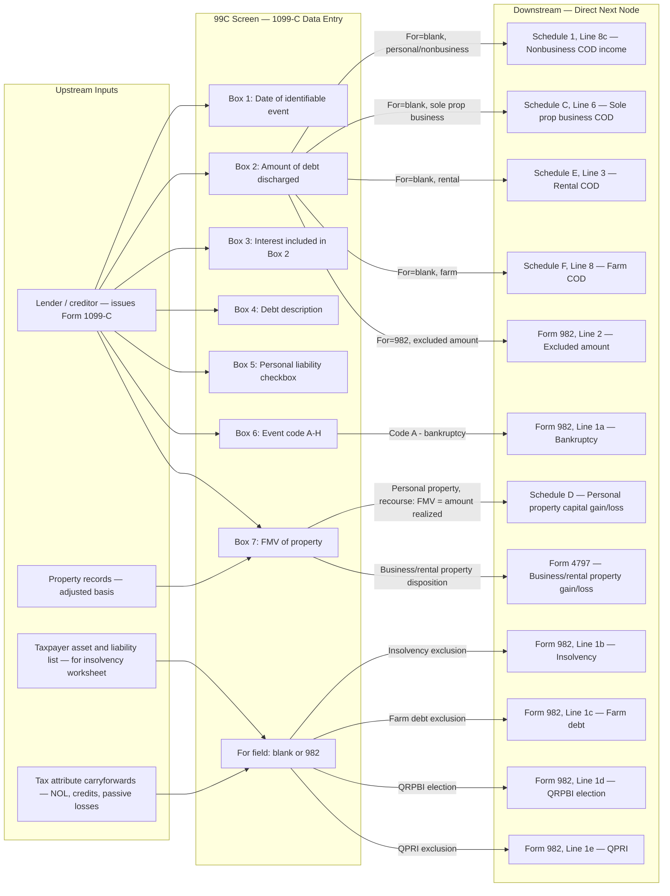

# 99C — Form 1099-C, Cancellation of Debt

## Overview

The 99C screen captures data from IRS Form 1099-C (Cancellation of Debt), which lenders must issue when $600 or more of a taxpayer's debt is cancelled, forgiven, or discharged. Cancelled debt is generally taxable ordinary income and flows to Schedule 1, line 8c (for nonbusiness personal debt). However, six exclusions may apply — bankruptcy, insolvency, qualified principal residence indebtedness (QPRI), qualified farm indebtedness, qualified real property business indebtedness (QRPBI), and certain student loans. When an exclusion applies, the excluded amount is reported on Form 982 (Reduction of Tax Attributes Due to Discharge of Indebtedness) and reduces the taxpayer's tax attributes or property basis rather than being included in income.

For property-related cancellations (foreclosures, short sales — Box 6 codes B/D/F), Box 7 (FMV of property) triggers a separate gain/loss calculation routed to Schedule D (personal property) or Form 4797 (business/rental property), in addition to any COD income.

Drake's "For" field on the 99C screen determines routing: blank → taxable COD income to Schedule 1 line 8c; "982" → excluded COD income to Form 982 line 2 (and the 982 screen must also be completed).

**IRS Form:** 1099-C
**Drake Screen:** 99C
**Tax Year:** 2025
**Drake Reference:** https://kb.drakesoftware.com/kb/Drake-Tax/11715.htm

---

## Data Entry Fields

Required fields first, then optional. Data-entry only — no computed/display fields.

| Field | Type | Required | Drake Label | Description | IRS Reference | URL |
| ----- | ---- | -------- | ----------- | ----------- | ------------- | --- |
| for_field | enum | no | "For" | Drake routing selector. Blank = taxable COD income flows to Schedule 1 line 8c (or appropriate business schedule). "982" = debt is excludable; flows to Form 982 line 2. Must also complete the 982 screen when "982" is selected. | Drake KB #11715 | https://kb.drakesoftware.com/kb/Drake-Tax/11715.htm |
| box_1_date | date | yes | "Box 1 — Date of identifiable event" | Date the cancellation event occurred. MM/DD/YYYY. Identifiable events include: bankruptcy discharge (A), other judicial debt relief (B), statute of limitations expiration (C), power-of-sale foreclosure (D), probate proceeding (E), short sale (F), creditor's internal policy (G), actual discharge (H). Critical for QPRI: must be on or before 12/31/2025 for QPRI exclusion to apply. | 1099-C Instructions, Box 1; Pub 4681, p.1 | https://www.irs.gov/instructions/i1099ac |
| box_2_amount | number (decimal) | yes | "Box 2 — Amount of debt discharged" | Total amount of debt cancelled/forgiven. Cannot exceed total outstanding debt minus amounts already received through settlement, foreclosure sale proceeds, or short sale. This is the primary COD income amount before any exclusion. Minimum $600 for form to be issued. | 1099-C Instructions, Box 2; Pub 4681 | https://www.irs.gov/instructions/i1099ac |
| box_3_interest | number (decimal) | no | "Box 3 — Interest if included in Box 2" | Portion of Box 2 attributable to accrued interest. Lender reporting is optional. If included, this amount is already inside Box 2 — Box 3 is informational only. Treated identically to the principal portion of COD income. | 1099-C Instructions, Box 3; Pub 4681, p.2 | https://www.irs.gov/instructions/i1099ac |
| box_4_description | text | no | "Box 4 — Debt description" | Free-text description of the origin of the debt (e.g., "student loan," "mortgage," "credit card expenditure"). Used to populate supporting statements and helps determine which business schedule receives income (if business debt). | 1099-C Instructions, Box 4 | https://www.irs.gov/instructions/i1099ac |
| box_5_personal_liability | boolean | no | "Box 5 — Debtor was personally liable" | Checkbox (marked = recourse debt; unmarked = nonrecourse debt). When marked: debtor was personally liable for the debt at creation or last modification. Critical for gain/loss calculation when property is involved: recourse → FMV is amount realized; nonrecourse → full cancelled debt is amount realized. Also affects insolvency worksheet (recourse debt = full outstanding balance in liabilities; nonrecourse = min of FMV and balance). | 1099-C Instructions, Box 5; Pub 4681, Recourse vs. Nonrecourse section | https://www.irs.gov/instructions/i1099ac |
| box_6_event_code | enum (A–H) | yes | "Box 6 — Identifiable event code" | Code indicating type of cancellation event. A=Bankruptcy Title 11, B=Other judicial debt relief, C=Statute of limitations/expiration, D=Power-of-sale foreclosure, E=Probate/similar proceeding, F=Short sale, G=Creditor's written policy, H=Other actual discharge before identifiable event. Code A triggers bankruptcy exclusion; codes B/D/F indicate property disposition and trigger Box 7 gain/loss calculation. | 1099-C Instructions, Box 6 | https://www.irs.gov/instructions/i1099ac |
| box_7_fmv | number (decimal) | no | "Box 7 — Fair market value of property" | FMV of property (real or personal) involved in foreclosure, abandonment, or short sale. Used as "amount realized" in gain/loss calculation for the property disposition. Required when Box 6 is B, D, E, or F (property-related events). May also appear on a coordinated Form 1099-A. | 1099-C Instructions, Box 7; Pub 4681, Foreclosures section | https://www.irs.gov/instructions/i1099ac |

---

## Per-Field Routing

| Field | Destination | How Used | Triggers | Limit / Cap | IRS Reference | URL |
| ----- | ----------- | -------- | -------- | ----------- | ------------- | --- |
| for_field | Internal routing only | "blank" → Schedule 1 line 8c (or business schedule); "982" → Form 982 line 2 | Determines full routing path for Box 2 | — | Drake KB #11715 | https://kb.drakesoftware.com/kb/Drake-Tax/11715.htm |
| box_1_date | Form 982 / QPRI eligibility gate | Date must be ≤ 12/31/2025 for QPRI exclusion. Date determines which tax year receives the COD income. | QPRI eligibility check | QPRI expires after 12/31/2025 | Pub 4681 (2025), QPRI section | https://www.irs.gov/publications/p4681 |
| box_2_amount | Schedule 1 line 8c (nonbusiness taxable) OR Schedule C line 6 (sole prop business) OR Schedule E line 3 (rental) OR Form 4835 line 6 (farm rental) OR Schedule F line 8 (farm) OR Form 982 line 2 (excluded) | Full Box 2 = gross COD income before exclusion. Taxable portion = Box 2 minus any excluded amount. Nonbusiness personal debt → Schedule 1 line 8c. Business debt routed based on the type of business. Excluded debt → Form 982 line 2. | If Box 6 = A (bankruptcy) → Form 982 line 1a automatically. If "For" = "982" → Form 982. Business type determines which schedule. | None on basic nonbusiness COD. QPRI: $750k MFJ / $375k MFS. Insolvency: capped at insolvency amount. Farm: capped at adjusted tax attributes + basis. QRPBI: capped at principal − FMV. | Pub 4681 (2025), all exclusion sections; Schedule 1 line 8c | https://www.irs.gov/publications/p4681 |
| box_3_interest | Same destination as box_2_amount | Already included in Box 2 total; no separate routing. Informational — identifies the interest component of cancelled debt. | — | — | 1099-C Instructions, Box 3 | https://www.irs.gov/instructions/i1099ac |
| box_4_description | Supporting statement; helps determine business schedule routing | Description informs which business schedule should receive income (e.g., "mortgage" → Schedule E, "farm debt" → Schedule F). Not a computed field — human judgment required for business routing. | — | — | 1099-C Instructions, Box 4 | https://www.irs.gov/instructions/i1099ac |
| box_5_personal_liability | Gain/loss calculation for property dispositions | Recourse (checked): gain/loss on property = FMV (Box 7) − adjusted basis; COD income = Box 2 − Box 7. Nonrecourse (unchecked): amount realized = Box 2 (full debt); gain/loss = Box 2 − adjusted basis; no separate COD income. Also used in insolvency worksheet: recourse debt = full outstanding balance; nonrecourse = min(FMV of property, outstanding balance). | When Box 7 is populated → triggers gain/loss calculation | — | Pub 4681 (2025), Recourse vs. Nonrecourse, Foreclosures sections | https://www.irs.gov/publications/p4681 |
| box_6_event_code | Form 982 line 1a selection; gain/loss trigger | Code A → bankruptcy → Form 982 line 1a (full exclusion, no other test needed). Codes B/D/F → property disposition → trigger Box 7 gain/loss calculation routed to Schedule D or Form 4797. | Code A → Form 982 line 1a. Codes B/D/F + Box 7 present → Schedule D or Form 4797 | — | 1099-C Instructions, Box 6; Pub 4681 | https://www.irs.gov/instructions/i1099ac |
| box_7_fmv | Schedule D (personal property gain/loss) OR Form 4797 (business property gain/loss) | Recourse: amount realized on property = FMV (Box 7); compute gain/loss = Box 7 − adjusted basis. Nonrecourse: amount realized = Box 2 (full debt); compute gain/loss = Box 2 − adjusted basis; Box 7 used only for FMV reference in this case. | Only when Box 6 is B, D, E, or F (property event) | — | Pub 4681 (2025), Foreclosures and Repossessions section | https://www.irs.gov/publications/p4681 |

---

## Calculation Logic

### Step 1 — Determine Gross COD Income

Gross COD income = **Box 2** (Amount of Debt Discharged) from Form 1099-C.

If Box 3 (interest) is populated, it is already included in Box 2. Box 3 is informational only — do not add it again.

Minimum 1099-C reporting threshold: $600. However, even if no 1099-C is received, COD income must be reported if the debt was actually cancelled.

> **Source:** IRS Instructions for Forms 1099-A and 1099-C (April 2025 revision), Box 2 — https://www.irs.gov/instructions/i1099ac; IRS Publication 4681 (2025), General Rules — https://www.irs.gov/publications/p4681

---

### Step 2 — Test for Exceptions (No Income, No Form 982 Needed)

Before testing exclusions, test these exceptions. If any apply, the cancelled debt is simply not income — no Form 982, no tax attribute reduction:

1. **Gift** — Debt cancelled as a gift, bequest, devise, or inheritance
2. **Price reduction** — Seller of property reduces the purchase price after sale (treated as purchase price adjustment, not income)
3. **Deductible debt** — Cash-method taxpayer: cancelled debt would have been deductible if paid (e.g., cancelled accounts payable for a cash-method business)
4. **Certain student loan discharges** — Discharges due to work in designated professions/areas for qualified lenders; NHSC/state loan repayment assistance; death/permanent disability (post-2018, no income); 2021–2025 temporary expansion (postsecondary education loans cancelled by eligible entities — no 1099-C issued for these)

> **Source:** IRS Publication 4681 (2025), Exceptions section — https://www.irs.gov/publications/p4681

---

### Step 3 — Test for Exclusions (Income Excluded, Form 982 Required)

Apply exclusions in this priority order. Bankruptcy stops the chain — if bankruptcy applies, no other exclusion is tested.

#### 3a. Bankruptcy (Title 11) — Box 6 = "A" or taxpayer filed Title 11 bankruptcy

- **Eligible:** Taxpayer is under jurisdiction of bankruptcy court AND debt discharge is granted by the court
- **Excluded amount:** Full Box 2 amount (no limit)
- **Form 982:** Check line 1a; enter full excluded amount on line 2
- **Tax attribute reduction:** Required (Part II, lines 6–13); see Step 5
- **Priority:** Highest — if bankruptcy applies, stop; do not test insolvency or other exclusions

> **Source:** IRS Publication 4681 (2025), Bankruptcy section — https://www.irs.gov/publications/p4681; IRC §108(a)(1)(A)

#### 3b. Insolvency (not in bankruptcy)

- **Eligible:** Taxpayer was insolvent immediately before the cancellation
- **Insolvency test:** Insolvency amount = Total liabilities (immediately before cancellation) MINUS FMV of total assets (immediately before cancellation). If result > 0, taxpayer was insolvent.
- **Excluded amount:** Lesser of: (a) Box 2 amount, or (b) insolvency amount calculated above
- **Formula:** `Excluded = MIN(Box 2, MAX(0, Total Liabilities Before − Total Assets FMV Before))`
- **Insolvency Worksheet (Pub 4681):**
  - **Part I — Liabilities (lines 1–15):**
    1. Credit card debt
    2. Mortgages on real property (first/second mortgages, home equity loans)
    3. Car and other vehicle loans
    4. Medical bills owed
    5. Student loans
    6. Accrued or past-due mortgage interest
    7. Accrued or past-due real estate taxes
    8. Accrued or past-due utilities (water, gas, electric, etc.)
    9. Accrued or past-due childcare costs
    10. Federal or state income taxes remaining due (prior tax years)
    11. Judgments
    12. Business debts (sole proprietor or partner obligations)
    13. Margin debt on stocks and other investment-secured debt (excluding real property)
    14. Other liabilities not included above
    15. **Total liabilities** (sum of lines 1–14)
  - **Part II — Assets at FMV (lines 16–37):**
    16. Cash and bank account balances
    17. Real property, including land value
    18. Cars and other vehicles
    19. Computers
    20. Household goods and furnishings
    21. Tools
    22. Jewelry
    23. Clothing
    24. Books
    25. Stocks and bonds
    26. Investments in coins, stamps, paintings, collectibles
    27. Firearms, sports, photographic, hobby equipment
    28. Interest in retirement accounts (IRA, 401(k), other)
    29. Interest in pension plan
    30. Interest in education accounts
    31. Cash value of life insurance
    32. Security deposits with landlords, utilities, others
    33. Interests in partnerships
    34. Value of investment in a business
    35. Other investments (annuities, mutual funds, commodity accounts, hedge funds, options)
    36. Other assets not included above
    37. **FMV of total assets** (sum of lines 16–36)
  - **Part III — Insolvency:**
    38. Insolvency = Line 15 minus Line 37. If zero or less, taxpayer is NOT insolvent (no exclusion available).
  - **IMPORTANT:** Include ALL assets even if exempt from creditors (retirement accounts, pension plans). Include the entire outstanding balance of recourse debts; for nonrecourse debt include the lesser of FMV of securing property or outstanding balance.
- **Form 982:** Check line 1b; enter excluded amount (up to insolvency amount) on line 2
- **Tax attribute reduction:** Required (Part II, lines 6–13); see Step 5

> **Source:** IRS Publication 4681 (2025), Insolvency section and Insolvency Worksheet — https://www.irs.gov/publications/p4681; IRC §108(a)(1)(B), §108(d)(3)

#### 3c. Qualified Principal Residence Indebtedness (QPRI)

- **Eligible:** All of:
  1. Debt was used to buy, build, or substantially improve taxpayer's **main home** (principal residence)
  2. Debt is secured by the main home
  3. Discharge date (Box 1) is on or before **December 31, 2025** OR discharge agreement was entered into and evidenced in writing before January 1, 2026
  4. For refinancing: only the original acquisition debt portion qualifies; cash-out refinancing amounts do NOT qualify
- **Excluded amount:** Lesser of:
  (a) Box 2 amount attributable to QPRI, or
  (b) $750,000 ($375,000 if Married Filing Separately) — **STATUTORY FIXED LIMIT, NOT INFLATION-ADJUSTED**
- **Ordering with non-QPRI portion:** If loan is partially QPRI and partially non-QPRI (e.g., refinancing with cash-out), the exclusion applies only to the excess of cancelled debt over the non-QPRI portion. Example: $115,000 cancelled from $850,000 refinance where only $740,000 was QPRI — only $5,000 excluded ($115,000 − $110,000 non-QPRI portion).
- **CRITICAL: QPRI EXPIRES AFTER DECEMBER 31, 2025.** Discharges completed after 12/31/2025 are NOT eligible. Check Box 1 date.
- **Form 982:** Check line 1e; enter excluded amount on line 2; enter excluded amount on line 10b (basis of principal residence reduced by excluded amount, but not below zero)
- **Tax attribute reduction:** ONLY reduce basis of principal residence (line 10b) — do NOT reduce other tax attributes (NOL, credits, etc.)

> **Source:** IRS Publication 4681 (2025), Qualified Principal Residence Indebtedness section — https://www.irs.gov/publications/p4681; IRC §108(a)(1)(E), §108(h); IRS Instructions for Forms 1099-A and 1099-C (2025) note: "Mortgage and student loan forgiveness relief expires in 2025"

#### 3d. Qualified Farm Indebtedness

- **Eligible:** All of:
  1. Debt was incurred directly in connection with the trade or business of farming
  2. Debt is cancelled by a **qualified person** (not a related party; generally a commercial lender or government agency)
  3. Taxpayer had **50% or more** of aggregate gross receipts from farming in **each of the 3 prior tax years** (2022, 2023, AND 2024 for TY2025)
- **Excluded amount:** Lesser of:
  (a) Box 2 amount, or
  (b) Sum of: adjusted tax attributes + total adjusted basis of qualified property at beginning of TY2025
  - **Adjusted tax attributes** = sum of:
    - NOL for 2025 + any NOL carryovers to 2025
    - Net capital loss for 2025 + carryovers
    - Passive activity loss carryovers from 2025
    - 3 × (general business credit carryovers + minimum tax credit + foreign tax credit carryovers + passive activity credit carryovers)
  - Note: If insolvency exclusion already applied to the same debt, use post-insolvency-reduction tax attributes (not pre-reduction) for this calculation.
- **Form 982:** Check line 1c; enter excluded amount on line 2; complete lines 11a (depreciable property used in business), 11b (farm land), 11c (other business/income-producing property) for basis reductions
- **Tax attribute reduction:** Use Part II (lines 6–13) until excluded amount is exhausted; then any remainder reduces qualified property basis (lines 11a–11c)

> **Source:** IRS Publication 4681 (2025), Qualified Farm Indebtedness section — https://www.irs.gov/publications/p4681; IRC §108(a)(1)(C), §108(g)

#### 3e. Qualified Real Property Business Indebtedness (QRPBI)

- **Eligible:** All of:
  1. Debt is secured by real property used in a **trade or business** (not personal use)
  2. Debt was either: (a) incurred before 1993, OR (b) incurred after 1992 and was "qualified acquisition indebtedness" (used to acquire, construct, or substantially improve the property) or a qualified refinancing thereof
  3. **Election required** — taxpayer must elect to exclude (check Form 982 line 1d)
- **Excluded amount:** Lesser of:
  (a) Outstanding principal balance of the debt immediately before cancellation MINUS FMV of securing property immediately before cancellation, OR
  (b) Total adjusted basis of all depreciable real property held at time of cancellation (before any basis reductions from this section)
- **Form 982:** Check line 1d; enter excluded amount on line 2; enter excluded amount on line 4 (reduce basis of depreciable real property)
- **Tax attribute reduction:** ONLY reduce basis of depreciable real property (line 4) — do NOT reduce NOL, credits, or other attributes
- **Amended return election:** QRPBI election may be made on an amended return filed within 6 months of the original return due date

> **Source:** IRS Publication 4681 (2025), Qualified Real Property Business Indebtedness section — https://www.irs.gov/publications/p4681; IRC §108(a)(1)(D), §108(c)

---

### Step 4 — Compute Taxable COD Income

```
Taxable COD income = Box 2 amount − Excluded amount (from Step 3)
```

If no exclusion applies: Taxable COD income = Box 2 (full amount).
If full exclusion applies: Taxable COD income = $0.
Partial exclusion: Taxable COD income = Box 2 − excluded portion.

---

### Step 5 — Route Taxable COD Income to Return

| Debt Type | Destination | Line |
|-----------|-------------|------|
| Nonbusiness / personal debt (credit card, personal loan, personal mortgage) | Schedule 1 (Form 1040) | Line 8c |
| Sole proprietorship / nonfarm business debt | Schedule C (Form 1040) | Line 6 |
| Nonfarm rental property debt | Schedule E (Form 1040) | Line 3 |
| Farm rental property debt | Form 4835 | Line 6 |
| Farm debt (actual farmer) | Schedule F (Form 1040) | Line 8 |

> **Source:** IRS Publication 4681 (2025), "Reporting Canceled Debt" — https://www.irs.gov/publications/p4681

---

### Step 6 — Complete Form 982 (when any exclusion under Step 3 applies)

**Part I:**
- **Line 1:** Check the applicable exclusion box:
  - 1a: Discharge in Title 11 (bankruptcy) case
  - 1b: Discharge to extent insolvent (not in Title 11)
  - 1c: Discharge of qualified farm indebtedness
  - 1d: Discharge of qualified real property business indebtedness (election)
  - 1e: Discharge of qualified principal residence indebtedness
- **Line 2:** Enter total amount excluded from gross income (= excluded amount from Step 3)
- **Line 3:** Election to treat real property held for sale in ordinary business as depreciable property (yes/no)
- **Line 4:** (QRPBI only) Amount applied to reduce basis of depreciable real property
- **Line 5:** Optional election under §108(b)(5) to reduce basis of depreciable property BEFORE other tax attributes (requires SCH statement, Drake code "387 — 982 LN 5, REDUCE BASIS")

**Part II — Tax Attribute Reductions (Bankruptcy/Insolvency/Farm exclusions):**

Reduce attributes in this order (dollar-for-dollar unless noted) until excluded amount from line 2 is fully applied:

| Line | Tax Attribute | Reduction Rate |
|------|---------------|----------------|
| 6 | Net Operating Loss — current year and carryovers | $1.00 per $1.00 excluded |
| 7 | General Business Credit carryovers | $0.33⅓ per $1.00 excluded |
| 8 | Minimum Tax Credit carryover | $0.33⅓ per $1.00 excluded |
| 9 | Net Capital Loss — current year and carryovers | $1.00 per $1.00 excluded |
| 10a | Basis of property (nondepreciable and depreciable, if not reduced on line 5) | $1.00 per $1.00 excluded |
| 11a | (Farm only) Basis of depreciable property used/held in farming trade/business | $1.00 per $1.00 excluded |
| 11b | (Farm only) Basis of land used/held in farming trade/business | $1.00 per $1.00 excluded |
| 11c | (Farm only) Basis of other business/income-producing property | $1.00 per $1.00 excluded |
| 12 | Passive Activity Loss and Credit carryovers | $1.00 per $1.00 (loss) / $0.33⅓ (credit) |
| 13 | Foreign Tax Credit carryovers | $0.33⅓ per $1.00 excluded |

**QPRI exception (line 1e checked):** SKIP lines 6–10a. Go directly to line 10b: reduce basis of principal residence by excluded amount (but not below zero). Do not reduce any other attributes.

**QRPBI exception (line 1d checked):** Use line 4 only — reduce basis of depreciable real property. Do not reduce other attributes or use lines 6–13.

**Line 5 election (§108(b)(5)):** If elected, reduce depreciable property basis (line 10a) FIRST before reducing NOL and other attributes. Requires SCH statement attachment.

**Part III:** Only for corporations (§1082 basis adjustment). Not applicable to individual 1040 returns.

> **Source:** IRS Form 982 Instructions (Rev. December 2021, applicable through TY2025) — https://www.irs.gov/instructions/i982; IRS Publication 4681 (2025), Tax Attribute Reduction section — https://www.irs.gov/publications/p4681

---

### Step 7 — Property Gain/Loss When Box 7 Is Present (Foreclosure/Short Sale/Abandonment)

When Box 7 (FMV of property) is populated and Box 6 is B, D, E, or F (property-related event), a separate gain/loss on property disposition must be calculated in addition to COD income.

**Recourse debt (Box 5 checked — personal liability):**
1. Amount realized from property disposition = Box 7 (FMV)
2. Gain/Loss on property = Box 7 FMV − Adjusted Basis of property
3. COD income (the "deficiency") = Box 2 (cancelled debt) − Box 7 (FMV)
   - This COD income goes through Steps 2–5 (exception/exclusion testing, then routing)

**Nonrecourse debt (Box 5 unchecked):**
1. Amount realized from property disposition = Box 2 (full cancelled debt amount)
2. Gain/Loss on property = Box 2 − Adjusted Basis of property
3. No separate COD income (entire amount treated as gain/loss on property)
   - Box 7 FMV is used only as a reference; it does NOT cap the amount realized for nonrecourse debt

**Gain/Loss routing:**
| Property Type | Destination |
|---------------|------------|
| Personal-use (primary home, car) | Schedule D (capital gain/loss) |
| Business real property | Form 4797 (ordinary income or §1231 gain/loss) |
| Business personal property | Form 4797 |
| Rental property | Form 4797 |
| Farm property | Form 4797 |

> **Source:** IRS Publication 4681 (2025), Foreclosures and Repossessions section — https://www.irs.gov/publications/p4681

---

## Constants & Thresholds (Tax Year 2025)

| Constant | Value | Source | URL |
| -------- | ----- | ------ | --- |
| Minimum 1099-C reporting threshold | $600 | 1099-C Instructions (April 2025), General Info | https://www.irs.gov/instructions/i1099ac |
| QPRI exclusion maximum — Single/MFJ | $750,000 | Pub 4681 (2025), QPRI section; IRC §108(h)(2) — STATUTORY FIXED, NOT INFLATION-ADJUSTED | https://www.irs.gov/publications/p4681 |
| QPRI exclusion maximum — MFS | $375,000 | Pub 4681 (2025), QPRI section; IRC §108(h)(2) | https://www.irs.gov/publications/p4681 |
| QPRI expiration | Discharges after 12/31/2025 NOT eligible; discharge agreements entered into after 12/31/2025 NOT eligible | Pub 4681 (2025), QPRI section; 1099-C Instructions (2025) — "Mortgage and student loan forgiveness relief expires in 2025" | https://www.irs.gov/instructions/i1099ac |
| Student loan temporary expansion | 2021–2025 only; student loans discharged by eligible entities for postsecondary education are nontaxable; expires after 12/31/2025 | Pub 4681 (2025), Student Loans exception section | https://www.irs.gov/publications/p4681 |
| Farm gross receipts test | 50% or more of aggregate gross receipts from farming in EACH of 2022, 2023, AND 2024 | Pub 4681 (2025), Farm Indebtedness section; IRC §108(g)(1) | https://www.irs.gov/publications/p4681 |
| Credit reduction rate on Form 982 (general business, min tax, foreign tax credits) | 33⅓ cents per $1.00 of excluded debt | Form 982 Instructions (Rev. December 2021), Part II | https://www.irs.gov/instructions/i982 |
| Maximum Form 982 instances per return (Drake e-file) | 1 (one Form 982 per return) | Drake KB #11374 | https://kb.drakesoftware.com/kb/Drake-Tax/11374.htm |
| QRPBI election amended return deadline | Within 6 months of original return due date | Pub 4681 (2025), QRPBI section | https://www.irs.gov/publications/p4681 |
| Student loan SSN requirement (post-2025) | After 2025, SSN required for death/disability student loan discharge exclusion; SSN must be valid for employment and issued before return due date | Pub 4681 (2025), Student Loans exception section | https://www.irs.gov/publications/p4681 |

---

## Data Flow Diagram



---

## Edge Cases & Special Rules

### Multiple 1099-Cs in the Same Tax Year

Each Form 1099-C is entered as a separate 99C screen instance. Exclusions are applied per-debt in the same priority order (bankruptcy → insolvency → farm/QRPBI/QPRI). Tax attribute reductions on Form 982 accumulate across all exclusions — total excluded amounts from all 1099-Cs are combined on a single Form 982.

**Critical Drake limitation:** Only one Form 982 is allowed per return for e-filing or printing. If multiple exclusions apply to multiple 1099-Cs, all must be consolidated onto one Form 982.

> **Source:** Drake KB #11374 — https://kb.drakesoftware.com/kb/Drake-Tax/11374.htm; Pub 4681 (2025) — https://www.irs.gov/publications/p4681

---

### When Both 1099-A and 1099-C Are Received for the Same Debt

Some lenders issue Form 1099-A (Acquisition/Abandonment) in one year (establishing the property disposition/amount realized) and Form 1099-C in a later year (triggering COD income). When this happens:

- **Year 1 (1099-A year):** Use Drake 99A screen to report the property disposition. Amount realized = FMV (Box 4 of 1099-A) for recourse debt; outstanding balance (Box 2 of 1099-A) for nonrecourse. Compute gain/loss to Schedule D or Form 4797.
- **Later year (1099-C year):** Enter 99C screen with cancelled debt amount. COD income = cancelled amount (Box 2 of 1099-C) minus FMV already reported in the 1099-A year (for recourse). Avoid double-counting the gain/loss already recognized.
- **Alternative:** When lender issues 1099-C alone for a foreclosure/short sale in the same year the property changed hands, treat it as both the disposition AND the cancellation — use Box 7 (FMV) for the property gain/loss and Box 2 for the COD income (recourse) or combined gain/loss (nonrecourse).

> **Source:** Drake KB #10908 (1099-A Data Entry) — https://kb.drakesoftware.com/kb/Drake-Tax/10908.htm; Pub 4681 (2025), "Form 1099-A" and "Foreclosures" sections — https://www.irs.gov/publications/p4681

---

### QPRI Expiration — Discharges After December 31, 2025

The QPRI exclusion under IRC §108(a)(1)(E) does NOT apply to discharges of qualified principal residence indebtedness:
- Completed after December 31, 2025, OR
- Subject to a discharge arrangement entered into after December 31, 2025

For TY2025: check Box 1 (date of identifiable event). If the date is on or before 12/31/2025, QPRI can still apply. If Box 1 shows a 2026 date, QPRI is NOT available and full Box 2 amount is taxable (unless another exclusion applies — insolvency being the primary alternative).

> **Source:** IRS Publication 4681 (2025), QPRI section — https://www.irs.gov/publications/p4681; 1099-C Instructions (April 2025) — https://www.irs.gov/instructions/i1099ac

---

### Married Filing Separately — Joint Debt

When spouses file separately (MFS) and were jointly liable on the cancelled debt, each must report their proportionate share of COD income:

- Proportionate share determined by: debt proceeds each received, interest deductions each claimed, basis allocated to co-owned property
- Each spouse applies their OWN insolvency test independently — one may be insolvent while the other is not, resulting in different exclusion amounts
- QPRI limit for MFS = $375,000 (not $750,000)

> **Source:** IRS Publication 4681 (2025), Insolvency Example 3 (MFS joint debt) — https://www.irs.gov/publications/p4681

---

### Bankruptcy Priority Rule

If Box 6 = "A" (Title 11 bankruptcy discharge), the bankruptcy exclusion takes absolute priority over all other exclusions. The full Box 2 amount is excluded. Do NOT also test insolvency, QPRI, or farm exclusions for the same debt. Tax attribute reductions are still required.

> **Source:** IRS Publication 4681 (2025), Bankruptcy section — https://www.irs.gov/publications/p4681; IRC §108(a)(2) (priority rule)

---

### Recourse vs. Nonrecourse — Box 5 Determines Gain/Loss Treatment

**Recourse (Box 5 checked — personally liable):**
- Gain/loss on property = FMV (Box 7) − Adjusted Basis
- COD income (deficiency) = Box 2 − Box 7
- Both amounts calculated separately; COD income then tested for exclusions
- For insolvency worksheet: include full outstanding balance of recourse debt in Part I liabilities

**Nonrecourse (Box 5 unchecked):**
- Amount realized = full outstanding balance (= Box 2)
- Gain/loss on property = Box 2 − Adjusted Basis
- No separate COD income (all in gain/loss)
- For insolvency worksheet: include the lesser of FMV of property or outstanding balance in Part I liabilities

> **Source:** IRS Publication 4681 (2025), Recourse Debt vs. Nonrecourse Debt section — https://www.irs.gov/publications/p4681

---

### Student Loan Discharges — No 1099-C Issued for Post-2020 Qualifying Discharges

For student loans discharged after December 31, 2020 that qualify under the 2021–2025 temporary expansion (postsecondary education loans discharged by eligible entities), lenders do NOT issue Form 1099-C. No 99C screen entry is needed.

However, if a 1099-C IS received for a student loan:
- Test whether it qualifies for an exception (work-requirement discharge, NHSC, etc.)
- If the loan does not qualify for any exception, enter it on the 99C screen normally and it is taxable income

After 2025: death/permanent disability student loan discharges require a valid SSN (for employment) issued before the return due date for the exclusion to apply.

The 2021–2025 temporary expansion itself expires after December 31, 2025 — loans discharged in 2026 and beyond are no longer covered by this provision.

> **Source:** IRS Publication 4681 (2025), Student Loans exception section — https://www.irs.gov/publications/p4681; 1099-C Instructions (April 2025) — https://www.irs.gov/instructions/i1099ac

---

### Section 108(i) Election (Historical — 2009/2010 Only)

Available only to businesses that had debt cancelled in 2009 or 2010 and elected to defer income recognition under IRC §108(i). If a taxpayer is still reporting deferred 108(i) income in TY2025, Drake requires a SCH attachment (code "E1 — Section 108(i) Election"). This is a legacy provision; not applicable to new TY2025 cancellations.

> **Source:** Drake KB #11374 — https://kb.drakesoftware.com/kb/Drake-Tax/11374.htm

---

### Line 5 Election on Form 982 — Depreciable Property Basis First

Taxpayers with bankruptcy or insolvency exclusions may elect on Form 982, line 5 under §108(b)(5) to reduce the basis of depreciable property BEFORE reducing other tax attributes (NOL, credits, etc.). This election:
- Is available ONLY for bankruptcy (line 1a) or insolvency (line 1b) exclusions
- Is NOT available for QPRI, QRPBI, or farm debt exclusions
- Requires an explanatory statement attached via Drake SCH screen, code "387 — 982 LN 5, REDUCE BASIS"
- Triggers Drake e-file message 5014 if statement is missing

> **Source:** Form 982 Instructions (Rev. December 2021), Line 5 — https://www.irs.gov/instructions/i982; Drake KB #11374 — https://kb.drakesoftware.com/kb/Drake-Tax/11374.htm

---

### Box 6 Identifiable Event Code Reference

| Code | Event Type | Key Tax Implications |
|------|-----------|---------------------|
| A | Title 11 (bankruptcy) court discharge | Triggers bankruptcy exclusion (full exclusion, Form 982 line 1a) |
| B | Other judicial debt relief (non-Title 11) | Not automatic exclusion; test insolvency/other exclusions; property gain/loss if Box 7 present |
| C | Statute of limitations / expiration of collection period | Test insolvency/other exclusions; no automatic exclusion |
| D | Power-of-sale foreclosure | Property disposition; Box 7 triggers gain/loss calculation |
| E | Probate / similar proceeding | Property disposition; Box 7 triggers gain/loss if present |
| F | Short sale | Property disposition; Box 7 triggers gain/loss calculation |
| G | Creditor's written policy (discontinued collection) | Test insolvency/other exclusions; no automatic exclusion |
| H | Actual discharge before identifiable event | Test applicable exclusions based on debt type |

> **Source:** IRS Instructions for Forms 1099-A and 1099-C (April 2025), Box 6 — https://www.irs.gov/instructions/i1099ac

---

### Drake 982 Screen — Required Fields When "For" = "982"

When the 99C screen's "For" field is set to "982", the user must also complete the Drake **982 screen** with:

1. **Part I — General Information:** Select "Amount excluded is due to" from:
   - A: Title 11 Case (bankruptcy)
   - B: Insolvency
   - C: Farm Indebtedness
   - D: Real Property Indebtedness (QRPBI election)
   - E: Principal Residence Indebtedness (QPRI)
2. **Line 2:** Total excluded amount (dollar amount)
3. **Part II:** Tax attribute reduction amounts as appropriate for the exclusion type
4. **SCH attachment (if line 5 elected):** Code "387 — 982 LN 5, REDUCE BASIS"
5. **SCH attachment (if §108(i) election):** Code "E1 — Section 108(i) Election" (triggers Drake e-file message 5675 if missing)

> **Source:** Drake KB #11374 — https://kb.drakesoftware.com/kb/Drake-Tax/11374.htm; Drake KB #11715 — https://kb.drakesoftware.com/kb/Drake-Tax/11715.htm

---

## Sources

All URLs verified to resolve.

| Document | Year | Section | URL | Saved as |
| -------- | ---- | ------- | --- | -------- |
| Drake KB — 1099-C: Cancellation of Debt and Form 982 (#11715) | — | Full article | https://kb.drakesoftware.com/kb/Drake-Tax/11715.htm | — |
| Drake KB — Form 982 FAQ (#11374) | — | Full article | https://kb.drakesoftware.com/kb/Drake-Tax/11374.htm | — |
| Drake KB — 1099-A Data Entry (#10908) | — | Full article | https://kb.drakesoftware.com/kb/Drake-Tax/10908.htm | — |
| IRS Instructions for Forms 1099-A and 1099-C (April 2025 revision) | 2025 | All boxes, filer instructions | https://www.irs.gov/instructions/i1099ac | i1099ac.pdf |
| IRS Publication 4681 — Canceled Debts, Foreclosures, Repossessions, and Abandonments | 2025 | Full publication including Insolvency Worksheet | https://www.irs.gov/publications/p4681 | p4681.pdf |
| IRS Form 982 Instructions (Rev. December 2021, applicable TY2025) | 2021 (current) | All lines, Parts I–III | https://www.irs.gov/instructions/i982 | i982.pdf |
| IRS Form 982 (Rev. March 2018, current version) | 2018 (current) | Full form | https://www.irs.gov/pub/irs-pdf/f982.pdf | f982.pdf |
| IRS Schedule 1 (Form 1040) 2025 | 2025 | Line 8c — Cancellation of Debt | https://www.irs.gov/pub/irs-pdf/f1040s1.pdf | f1040s1.pdf |
| taxinstructions.net — Form 982 Instructions 2025-2026 (third-party summary) | 2025 | Part I lines 1a-1e, Part II lines 4-13 | https://taxinstructions.net/form-982/ | — |
