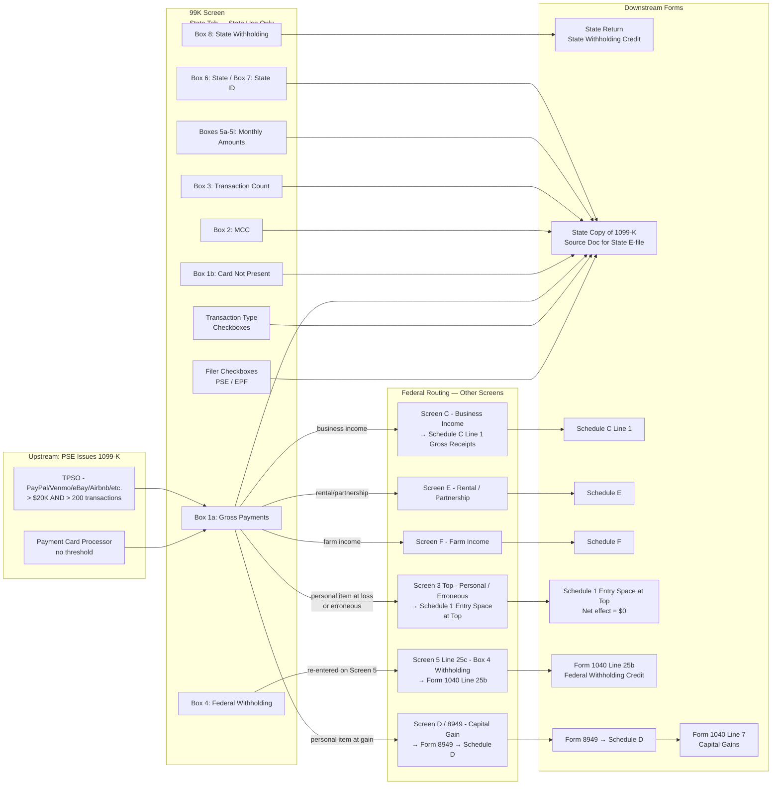

# 1099-K — Payment Card and Third Party Network Transactions

## Overview

Form 1099-K is issued by a Payment Settlement Entity (PSE) — either a merchant acquiring bank (for credit/debit card transactions) or a Third Party Settlement Organization such as PayPal, Venmo, eBay, Etsy, Airbnb, Uber, etc. — to report aggregate gross payments made to a payee during the calendar year.

**The 99K screen in Drake Tax is exclusively for state e-file purposes.** It generates a copy of Form 1099-K that certain states require as a source document for their state e-file submission. No data entered on the 99K screen flows to any federal form. The sole exception is Box 8 (state income tax withheld), which flows to the relevant state return.

**Federal reporting of 1099-K income is handled on other Drake screens**, depending on the nature of the income:
- Business/self-employment income → Schedule C (Drake Screen C), Line 1 (Gross Receipts)
- Partnership or rental income → Schedule E (Drake Screen E)
- Farm income → Schedule F (Drake Screen F)
- Personal item sold at a loss, or erroneous/incorrect 1099-K → Drake Screen 3 (top entry space → Schedule 1 entry space at top)
- Federal tax withheld (Box 4) → Drake Screen 5, Line 25c → Form 1040 Line 25b

This screen matters because:
1. States need it for e-file validation
2. The Box 8 state withholding amount flows directly to a state credit
3. The tax preparer must understand the routing rules to correctly report the income on the federal return, even though it goes elsewhere in Drake

**IRS Form:** 1099-K (Payment Card and Third Party Network Transactions)
**Drake Screen:** 99K (located on the States tab)
**Tax Year:** 2025
**Drake Reference:** https://kb.drakesoftware.com/kb/Drake-Tax/10520.htm

---

## Data Entry Fields

Required fields first, then optional. Data-entry only — no computed/display fields.

The following fields appear on the **99K screen** (state use only). For federal routing, see Per-Field Routing below.

| Field | Type | Required | Drake Label | Description | IRS Reference | URL |
| ----- | ---- | -------- | ----------- | ----------- | ------------- | --- |
| filer_type_pse | checkbox | conditional | "PSE" | Check if the filer is a Payment Settlement Entity (merchant acquiring entity or TPSO). Do NOT complete PSE Name/Phone when this box is checked. | Instructions for Form 1099-K (03/2024), "Who Must File," p.1 | https://www.irs.gov/instructions/i1099k |
| filer_type_epf | checkbox | conditional | "EPF/Other Third Party" | Check if the filer is an Electronic Payment Facilitator or Other Third Party acting on behalf of a PSE. When checked, complete PSE Name and PSE Phone fields. | Instructions for Form 1099-K (03/2024), "Electronic Payment Facilitators," p.1 | https://www.irs.gov/instructions/i1099k |
| pse_name | text | conditional | "PSE Name" | Name of the Payment Settlement Entity on whose behalf the EPF is filing. Only complete when EPF checkbox is selected. Leave blank when PSE checkbox is selected. | Instructions for Form 1099-K (03/2024), "Electronic Payment Facilitators," p.1 | https://www.irs.gov/instructions/i1099k |
| pse_phone | text (phone) | conditional | "PSE Phone" | Phone number of the PSE "that will allow a payee to reach a person knowledgeable about the payments reported." Only complete when EPF checkbox is selected. | Instructions for Form 1099-K (03/2024), "Payee Statement," p.3 | https://www.irs.gov/instructions/i1099k |
| transaction_type_payment_card | checkbox | conditional | "Payment card transactions" | Check if the reported transactions include payment card (credit, debit, gift card) transactions. | Instructions for Form 1099-K (03/2024), "Transactions Reported," p.2 | https://www.irs.gov/instructions/i1099k |
| transaction_type_tpso | checkbox | conditional | "Third party network transactions" | Check if the reported transactions include third-party network transactions (PayPal, Venmo, eBay, etc.). When a payee receives both types, a separate 1099-K is required per type. | Instructions for Form 1099-K (03/2024), "Transactions Reported," p.2 | https://www.irs.gov/instructions/i1099k |
| account_number | text | optional | "Account Number" | Payee account number at the PSE. Required when filing multiple Forms 1099-K for the same payee; otherwise encouraged. May be truncated per Reg. §301.6109-4. | Instructions for Form 1099-K (03/2024), "Account Number," p.2 | https://www.irs.gov/instructions/i1099k |
| second_tin_notice | checkbox | optional | "2nd TIN Not." | Check with "X" if the IRS has notified the filer twice within three calendar years that the payee provided an incorrect TIN. Prevents further IRS notices. | Instructions for Form 1099-K (03/2024), "2nd TIN Not.," p.2 | https://www.irs.gov/instructions/i1099k |
| box_1a | number (currency) | yes | "Box 1a — Gross amount" | Aggregate gross dollar amount of all reportable payment transactions for the calendar year. "Gross amount means the total dollar amount of total reportable payment transactions for each participating payee without regard to any adjustments for credits, cash equivalents, discount amounts, fees, refunded amounts, shipping amounts, or any other amounts." | Instructions for Form 1099-K (03/2024), "Box 1a," p.2 | https://www.irs.gov/instructions/i1099k |
| box_1b | number (currency) | optional | "Box 1b — Card Not Present" | Gross amount of transactions where "the card was not present at the time of the transaction or the card number was keyed into the terminal." Includes online, phone, and catalog sales. | Instructions for Form 1099-K (03/2024), "Box 1b," p.2 | https://www.irs.gov/instructions/i1099k |
| box_2 | text (4 digits) | optional | "Box 2 — Merchant Category Code" | Four-digit Merchant Category Code (MCC) from payment card industry classification system. Not completed by TPSOs or filers without an industry classification system. When payee has multiple MCCs, either file separate 1099-Ks per MCC or use the MCC representing the largest revenue share. | Instructions for Form 1099-K (03/2024), "Box 2," p.2 | https://www.irs.gov/instructions/i1099k |
| box_3 | integer | optional | "Box 3 — Number of Payment Transactions" | Total count of non-refund transactions processed through the card or network during the year. Refund transactions are excluded. | Instructions for Form 1099-K (03/2024), "Box 3," p.2 | https://www.irs.gov/instructions/i1099k |
| box_4 | number (currency) | optional | "Box 4 — Federal Income Tax Withheld" | Backup withholding under IRC §3406 when the payee failed to furnish a TIN or the IRS notified the PSE of under-reporting. Rate: 24%. NOTE: This field on the 99K screen is for state record only — actual federal withholding from 1099-K must be entered on Drake Screen 5, Line 25c to flow to Form 1040 Line 25b. | Instructions for Form 1099-K (03/2024), "Box 4," p.2; IRS Topic 307 | https://www.irs.gov/instructions/i1099k; https://www.irs.gov/taxtopics/tc307 |
| box_5a | number (currency) | optional | "Box 5a — January" | Gross amount of reportable transactions for January. | Instructions for Form 1099-K (03/2024), "Boxes 5a–5l," p.3 | https://www.irs.gov/instructions/i1099k |
| box_5b | number (currency) | optional | "Box 5b — February" | Gross amount of reportable transactions for February. | Instructions for Form 1099-K (03/2024), "Boxes 5a–5l," p.3 | https://www.irs.gov/instructions/i1099k |
| box_5c | number (currency) | optional | "Box 5c — March" | Gross amount of reportable transactions for March. | Instructions for Form 1099-K (03/2024), "Boxes 5a–5l," p.3 | https://www.irs.gov/instructions/i1099k |
| box_5d | number (currency) | optional | "Box 5d — April" | Gross amount of reportable transactions for April. | Instructions for Form 1099-K (03/2024), "Boxes 5a–5l," p.3 | https://www.irs.gov/instructions/i1099k |
| box_5e | number (currency) | optional | "Box 5e — May" | Gross amount of reportable transactions for May. | Instructions for Form 1099-K (03/2024), "Boxes 5a–5l," p.3 | https://www.irs.gov/instructions/i1099k |
| box_5f | number (currency) | optional | "Box 5f — June" | Gross amount of reportable transactions for June. | Instructions for Form 1099-K (03/2024), "Boxes 5a–5l," p.3 | https://www.irs.gov/instructions/i1099k |
| box_5g | number (currency) | optional | "Box 5g — July" | Gross amount of reportable transactions for July. | Instructions for Form 1099-K (03/2024), "Boxes 5a–5l," p.3 | https://www.irs.gov/instructions/i1099k |
| box_5h | number (currency) | optional | "Box 5h — August" | Gross amount of reportable transactions for August. | Instructions for Form 1099-K (03/2024), "Boxes 5a–5l," p.3 | https://www.irs.gov/instructions/i1099k |
| box_5i | number (currency) | optional | "Box 5i — September" | Gross amount of reportable transactions for September. | Instructions for Form 1099-K (03/2024), "Boxes 5a–5l," p.3 | https://www.irs.gov/instructions/i1099k |
| box_5j | number (currency) | optional | "Box 5j — October" | Gross amount of reportable transactions for October. | Instructions for Form 1099-K (03/2024), "Boxes 5a–5l," p.3 | https://www.irs.gov/instructions/i1099k |
| box_5k | number (currency) | optional | "Box 5k — November" | Gross amount of reportable transactions for November. | Instructions for Form 1099-K (03/2024), "Boxes 5a–5l," p.3 | https://www.irs.gov/instructions/i1099k |
| box_5l | number (currency) | optional | "Box 5l — December" | Gross amount of reportable transactions for December. | Instructions for Form 1099-K (03/2024), "Boxes 5a–5l," p.3 | https://www.irs.gov/instructions/i1099k |
| box_6 | text (2 chars) | conditional | "Box 6 — State" | State abbreviation. Required for Combined Federal/State Filing Program participants and those filing with a state tax department. Up to 2 states per form copy. | Instructions for Form 1099-K (03/2024), "Box 6," p.3 | https://www.irs.gov/instructions/i1099k |
| box_7 | text | conditional | "Box 7 — State ID Number" | Filer's state identification number assigned by the individual state. Required when state withholding is reported. | Instructions for Form 1099-K (03/2024), "Box 7," p.3 | https://www.irs.gov/instructions/i1099k |
| box_8 | number (currency) | conditional | "Box 8 — State Income Tax Withheld" | State income tax withheld. **This is the ONLY field on the 99K screen that flows to a state return.** No other 99K screen field affects any tax calculation. | Instructions for Form 1099-K (03/2024), "Box 8," p.3; Drake KB 10520 | https://www.irs.gov/instructions/i1099k |

---

## Per-Field Routing

The 99K screen is state-only. For each field, the routing is to the state return or to no form at all, except Box 8.

Federal income routing from a 1099-K is handled on separate Drake screens — see the bottom of this table and the Calculation Logic section.

| Field | Destination | How Used | Triggers | Limit / Cap | IRS Reference | URL |
| ----- | ----------- | -------- | -------- | ----------- | ------------- | --- |
| filer_type_pse | State form (1099-K copy) | Identifies filer type on state source document | Determines if PSE Name/Phone fields apply | — | Instructions for Form 1099-K (03/2024), p.1 | https://www.irs.gov/instructions/i1099k |
| filer_type_epf | State form (1099-K copy) | Identifies filer type on state source document | Requires PSE Name + PSE Phone to be completed | — | Instructions for Form 1099-K (03/2024), p.1 | https://www.irs.gov/instructions/i1099k |
| pse_name | State form (1099-K copy) | Printed on state copy of 1099-K | Only when EPF box checked | — | Instructions for Form 1099-K (03/2024), p.1 | https://www.irs.gov/instructions/i1099k |
| pse_phone | State form (1099-K copy) | Printed on state copy of 1099-K | Only when EPF box checked | — | Instructions for Form 1099-K (03/2024), p.1 | https://www.irs.gov/instructions/i1099k |
| transaction_type_payment_card | State form (1099-K copy) | Identifies transaction type on state copy | — | — | Instructions for Form 1099-K (03/2024), p.2 | https://www.irs.gov/instructions/i1099k |
| transaction_type_tpso | State form (1099-K copy) | Identifies transaction type on state copy | — | — | Instructions for Form 1099-K (03/2024), p.2 | https://www.irs.gov/instructions/i1099k |
| account_number | State form (1099-K copy) | Printed on state copy for payee identification | — | — | Instructions for Form 1099-K (03/2024), p.2 | https://www.irs.gov/instructions/i1099k |
| second_tin_notice | State form (1099-K copy) | Printed on state copy | — | — | Instructions for Form 1099-K (03/2024), p.2 | https://www.irs.gov/instructions/i1099k |
| box_1a | State form only (99K screen); **Federal income separately entered per income type** | State source document; federal amount entered on Screen C/E/F/3 | Triggers income routing on federal screens | None (gross reporting; no withholding of fees/refunds) | Instructions for Form 1099-K (03/2024), "Box 1a," p.2 | https://www.irs.gov/instructions/i1099k |
| box_1b | State form only | State source document | — | Subset of box_1a | Instructions for Form 1099-K (03/2024), "Box 1b," p.2 | https://www.irs.gov/instructions/i1099k |
| box_2 | State form only | State source document | — | 4-digit MCC code | Instructions for Form 1099-K (03/2024), "Box 2," p.2 | https://www.irs.gov/instructions/i1099k |
| box_3 | State form only | State source document | — | Integer count | Instructions for Form 1099-K (03/2024), "Box 3," p.2 | https://www.irs.gov/instructions/i1099k |
| box_4 | **Federal: Drake Screen 5, Line 25c → Form 1040 Line 25b** (must be re-entered on Screen 5 — not carried automatically from 99K screen) | Federal withholding credit against tax liability | Backup withholding applies when payee has no TIN on file | None | IRS Topic 307; Instructions for Form 1099-K (03/2024), "Box 4," p.2 | https://www.irs.gov/taxtopics/tc307 |
| box_5a–5l | State form only | Monthly breakdown on state source document | — | Sum of 5a–5l should equal box_1a | Instructions for Form 1099-K (03/2024), "Boxes 5a–5l," p.3 | https://www.irs.gov/instructions/i1099k |
| box_6 | State form only | State on state copy | — | 2-char state abbreviation | Instructions for Form 1099-K (03/2024), "Box 6," p.3 | https://www.irs.gov/instructions/i1099k |
| box_7 | State form only | State ID on state copy | — | — | Instructions for Form 1099-K (03/2024), "Box 7," p.3 | https://www.irs.gov/instructions/i1099k |
| box_8 | **State return — state withholding credit** | Summed with other state withholding credits | — | None | Instructions for Form 1099-K (03/2024), "Box 8," p.3 | https://www.irs.gov/instructions/i1099k |

### Federal Income Routing by Income Type (Entered on Other Screens — NOT the 99K Screen)

| Income Type | Drake Screen | Federal Form/Line | Notes |
| ----------- | ------------ | ----------------- | ----- |
| Business / self-employment (sole proprietor, gig, freelance) | Screen C | Schedule C, Line 1 (Gross Receipts) | Amount from 1099-K Box 1a included in gross receipts. Use business records — not just 1099-K amounts — since 1099-K only shows gross payments, not net income. |
| Partnership income | Screen E | Schedule E, Part II | — |
| Rental income | Screen E | Schedule E, Part I | — |
| Farm income | Screen F | Schedule F, Line 2 (Gross receipts from farming) | — |
| Personal item sold at loss | Screen 3 (top entry space, T/S field) | Schedule 1 (Form 1040), entry space at top | Entered as combined total of all 1099-K amounts for personal items sold at a loss. Drake auto-generates Schedule 1 entry. Net effect on income = $0. |
| Personal item sold at gain | Screen D / Form 8949 | Form 8949 → Schedule D | Short-term gain: Schedule D Part I; Long-term gain: Schedule D Part II. Sales proceeds = Box 1a amount; Basis = taxpayer's cost. |
| Erroneous or incorrect 1099-K | Screen 3 (top entry space, T/S field) | Schedule 1 (Form 1040), entry space at top | Enter amount from erroneous 1099-K. Net effect on income = $0. |
| Federal tax withheld (Box 4) | Screen 5, Line 25c | Form 1040, Line 25b (Federal tax withheld from 1099 forms) | Must be entered separately on Screen 5; not auto-carried from 99K screen. |

---

## Calculation Logic

### Step 1 — Determine income type for each 1099-K received

For each Form 1099-K received by the taxpayer, the preparer must classify the income:

1. **Business income?** If the taxpayer received payments in the course of a trade or business (sole proprietor, gig worker, freelancer, craft seller, etc.), the Box 1a amount is included in gross receipts on Schedule C Line 1 (or Schedule E/F for partnerships/rentals/farms).

2. **Personal item sold?**
   - At a **loss** (sale proceeds < original cost): Non-deductible, but must be reported to zero it out. Enter in Schedule 1 entry space at top.
   - At a **gain** (sale proceeds > original cost): Taxable capital gain. Report on Form 8949 + Schedule D.

3. **Erroneous or incorrect 1099-K?** (Amount reported is wrong, not your income, or you are not the correct payee): Enter in Schedule 1 entry space at top to zero it out.

4. **Gifts, reimbursements from family/friends?** These are not income and should not be on a 1099-K. If received in error, treat as erroneous 1099-K.

> **Source:** IRS "What to do with Form 1099-K," last updated 2025 — https://www.irs.gov/businesses/what-to-do-with-form-1099-k

---

### Step 2 — Business Income: Include in Schedule C Gross Receipts

If income is from business/self-employment:

1. Add the Box 1a gross amount to gross receipts on Schedule C Line 1.
2. **Important:** The Box 1a amount is a **gross** figure — it does not account for fees, refunds, returns, shipping charges, or other adjustments. The taxpayer must use their own books/records to determine actual gross receipts and deductible expenses.
3. The IRS uses the 1099-K amount to cross-check Schedule C reporting. **Always report at least the 1099-K amount**, and add any income not captured by the 1099-K (e.g., cash receipts, checks).
4. Report returns/allowances on Schedule C Line 2. Net sales = Line 1 minus Line 2.

> **Source:** 2025 Instructions for Schedule C (Form 1040), "Line 1 — Gross receipts or sales," p.3 — https://www.irs.gov/instructions/i1040sc

---

### Step 3 — Personal Item Sold at Loss: Schedule 1 Entry Space

If the 1099-K covers personal items sold at a loss (the taxpayer sold used personal property for less than what they originally paid):

1. The sale is **not deductible** — personal losses on personal property are not deductible (IRC §165(c); personal use exclusion).
2. However, the 1099-K gross amount appears to be income and must be addressed on the return so the IRS does not treat it as unreported income.
3. **Report the amount in the entry space at the top of Schedule 1 (Form 1040).** This is a TY2025 change — the dedicated "entry space at top" replaced the Line 8z/24z approach used for TY2022–2023.
4. Drake mechanism: Enter the combined 1099-K amount for personal items at a loss in the T or S field at the top of Screen 3. This flows to the Schedule 1 entry space. Net effect on taxable income = $0.

> **Source:** IRS "What to do with Form 1099-K" — https://www.irs.gov/businesses/what-to-do-with-form-1099-k; IRS 1099-K FAQs (What to do if you receive) — https://www.irs.gov/newsroom/form-1099-k-faqs-what-to-do-if-you-receive-a-form-1099-k; Current Federal Tax Developments (10/24/2025) — https://www.currentfederaltaxdevelopments.com/blog/2025/10/24/form-1099-k-information-reporting-technical-update-and-application-guidance

---

### Step 4 — Personal Item Sold at Gain: Form 8949 + Schedule D

If the taxpayer sold a personal item (furniture, collectible, jewelry, concert tickets, etc.) for **more** than their original cost:

1. The gain is a **taxable capital gain**.
2. Determine holding period:
   - **Short-term** (held ≤ 1 year): Schedule D Part I, via Form 8949.
   - **Long-term** (held > 1 year): Schedule D Part II, via Form 8949.
3. On Form 8949:
   - Column (d) Proceeds = Box 1a amount from 1099-K (gross proceeds)
   - Column (e) Cost or Other Basis = taxpayer's original purchase cost
   - Column (h) Gain or Loss = Proceeds − Basis
4. Total from Form 8949 flows to Schedule D.
5. Net Schedule D capital gain flows to Form 1040 Line 7.

> **Source:** IRS "What to do with Form 1099-K" — https://www.irs.gov/businesses/what-to-do-with-form-1099-k; IRS 1099-K FAQs — https://www.irs.gov/newsroom/form-1099-k-faqs-what-to-do-if-you-receive-a-form-1099-k; 2025 Instructions for Form 8949 — https://www.irs.gov/instructions/i8949

---

### Step 5 — Erroneous or Incorrect 1099-K: Schedule 1 Entry Space

If the 1099-K was issued in error (wrong payee, incorrect amount, non-taxable payments like gift reimbursements):

1. First, attempt to get a corrected 1099-K from the issuer.
2. If unable to obtain a corrected form, report the erroneous amount in the **entry space at the top of Schedule 1 (Form 1040)**.
3. The entry creates a $0 net effect on income.
4. Drake mechanism: Enter the erroneous amount in the T or S field at top of Screen 3.
5. Keep documentation (correspondence with PSE, proof that amounts were not taxable income).

> **Source:** IRS "Actions to take if a Form 1099-K is received in error" — https://www.irs.gov/newsroom/actions-to-take-if-a-form-1099-k-is-received-in-error-or-with-incorrect-information; Drake KB 10520 — https://kb.drakesoftware.com/kb/Drake-Tax/10520.htm

---

### Step 6 — Federal Tax Withheld (Box 4): Form 1040 Line 25b

If the PSE withheld federal backup withholding (because the taxpayer did not provide a TIN or the IRS notified the PSE of underreporting):

1. The Box 4 amount is a **credit** against the taxpayer's federal income tax.
2. In Drake: enter this amount on **Screen 5, Line 25c** ("Other federal withholding").
3. This flows to the **Federal Withholding worksheet** and ultimately to **Form 1040, Line 25b** ("Federal income tax withheld from Form(s) 1099").
4. **Important:** Do NOT rely on the Box 4 entered on the 99K screen — it does NOT automatically carry to the federal return. The preparer must separately enter the withholding amount on Screen 5.

> **Source:** Drake KB 10520 — https://kb.drakesoftware.com/kb/Drake-Tax/10520.htm; Form 1040 instructions, Line 25b; IRS Topic 307 — https://www.irs.gov/taxtopics/tc307

---

### Step 7 — Monthly Consistency Check (Boxes 5a–5l)

The sum of Boxes 5a through 5l should equal Box 1a (Gross Amount). This is a validation rule built into the IRS form. The engine should flag a warning if sum(5a..5l) ≠ box_1a when all monthly fields are provided.

> **Source:** Instructions for Form 1099-K (03/2024), "Boxes 5a–5l," p.3 — https://www.irs.gov/instructions/i1099k

---

## Constants & Thresholds (Tax Year 2025)

| Constant | Value | Source | URL |
| -------- | ----- | ------ | --- |
| TY2025 TPSO reporting threshold (transactions) | > $20,000 gross payments AND > 200 transactions | One Big Beautiful Bill (retroactive); IRS Fact Sheet 2025-08 (IR-2025-107, Oct 23 2025) | https://www.irs.gov/newsroom/irs-issues-faqs-on-form-1099-k-threshold-under-the-one-big-beautiful-bill-dollar-limit-reverts-to-20000 |
| TY2025 Payment card processor threshold | None — 1099-K required for ALL amounts from payment card transactions | Instructions for Form 1099-K (03/2024), "Who Must File," p.1 | https://www.irs.gov/instructions/i1099k |
| Backup withholding rate (TY2025) | 24% flat rate | IRS Topic No. 307, Backup Withholding (updated Sept 12, 2025); IRC §3406 | https://www.irs.gov/taxtopics/tc307 |
| TPSO de minimis exception | No reporting required if payments to a single payee ≤ $20,000 for the year (TPSO only; payment card has no de minimis) | One Big Beautiful Bill; IRS IR-2025-107 | https://www.irs.gov/newsroom/irs-issues-faqs-on-form-1099-k-threshold-under-the-one-big-beautiful-bill-dollar-limit-reverts-to-20000 |
| Schedule 1 top entry space for 1099-K | TY2025 uses dedicated entry space at top of Schedule 1 (not Line 8z/24z as in TY2022-2023) | IRS "What to do with Form 1099-K" (TY2025 form), Schedule 1 instructions | https://www.irs.gov/businesses/what-to-do-with-form-1099-k |
| Form 1040 withholding line for 1099-K Box 4 | Form 1040, Line 25b ("Federal income tax withheld from Form(s) 1099") | 2025 Form 1040 instructions, Line 25 | https://www.irs.gov/instructions/i1040gi |

---

## Data Flow Diagram

---

## Edge Cases & Special Rules

### 1. PSE vs. EPF Checkbox Mutual Exclusivity

When the **PSE** checkbox is checked, do **NOT** complete the PSE Name and PSE Phone fields — those fields are only used by Electronic Payment Facilitators. When the **EPF** checkbox is checked, the PSE Name and PSE Phone fields **must** be completed to identify the Payment Settlement Entity on whose behalf the EPF is filing.

> **Source:** Drake KB 10520 — https://kb.drakesoftware.com/kb/Drake-Tax/10520.htm; Instructions for Form 1099-K (03/2024), p.1 — https://www.irs.gov/instructions/i1099k

---

### 2. TY2025 Reporting Threshold: One Big Beautiful Bill Change

The threshold history is complex. The effective TY2025 threshold for **TPSOs** is:
- **> $20,000 gross payments AND > 200 transactions**

This was retroactively reinstated by the One Big Beautiful Bill after a series of delayed lower thresholds:
- Original ARPA 2021 goal: $600 (never fully took effect due to IRS delays)
- Notice 2024-85 had set $2,500 for TY2025
- The OBBB (enacted 2025) retroactively reinstated the pre-ARPA $20,000 / 200 threshold

**Payment card processors (credit/debit/gift card networks)** have **no minimum threshold** — they must file regardless of amount.

**Warning:** Some taxpayers may still receive 1099-K forms below the $20,000 threshold if PSEs voluntarily issue them or if state law requires reporting at lower thresholds (e.g., Vermont, Maryland require 1099-K at $600). The taxpayer is still required to report all income regardless of whether a 1099-K is received.

> **Source:** IRS Fact Sheet 2025-08 (IR-2025-107, October 23, 2025) — https://www.irs.gov/pub/taxpros/fs-2025-08.pdf; IRS FAQ on OBBB threshold — https://www.irs.gov/newsroom/irs-issues-faqs-on-form-1099-k-threshold-under-the-one-big-beautiful-bill-dollar-limit-reverts-to-20000

---

### 3. Box 4 Federal Withholding: Must Be Re-Entered on Screen 5

**Critical implementation note:** The Box 4 amount entered on the 99K screen does NOT flow to the federal return. The preparer must separately enter the federal withholding amount on Drake **Screen 5, Line 25c** ("Other Federal Withholding from Form 1099-K"). Only then does it flow to the Federal Withholding worksheet and Form 1040 Line 25b.

Failure to re-enter on Screen 5 means the taxpayer does not receive credit for the backup withholding — this is a significant preparer error risk.

> **Source:** Drake KB 10520 — https://kb.drakesoftware.com/kb/Drake-Tax/10520.htm

---

### 4. TY2025 Schedule 1: Entry Space at Top (Not Line 8z/24z)

For **TY2024 forward**, the IRS added a dedicated entry space at the **top of Schedule 1** for 1099-K personal item sales and erroneous forms. This replaced the TY2022–2023 approach of using Line 8z (Other Income) and Line 24z (Other Adjustments) with matching amounts.

**TY2022–2023 approach (no longer used for TY2025):**
- Part I, Line 8z: "Form 1099-K Personal Item Sold at a Loss" — enter gross proceeds
- Part II, Line 24z: "Form 1099-K Personal Item Sold at a Loss" — enter matching offset
- Net = $0

**TY2025 approach (current):**
- Entry space at **top of Schedule 1** — enter combined total of all such 1099-K amounts
- Drake Screen 3: T/S field at top of screen
- Net effect on income = $0

> **Source:** IRS "What to do with Form 1099-K" — https://www.irs.gov/businesses/what-to-do-with-form-1099-k; Current Federal Tax Developments 10/24/2025 — https://www.currentfederaltaxdevelopments.com/blog/2025/10/24/form-1099-k-information-reporting-technical-update-and-application-guidance; Drake KB 10520 — https://kb.drakesoftware.com/kb/Drake-Tax/10520.htm

---

### 5. Mixed 1099-K: Some Items at Gain, Some at Loss

When a single Form 1099-K covers multiple personal items sold, some at gain and some at loss:

- **Gains**: Cannot be offset against losses. Each gain is separately reported on Form 8949 / Schedule D.
- **Losses**: Cannot be deducted. Report proceeds in Schedule 1 entry space to zero them out.
- Transactions cannot be netted against each other.

> **Source:** IRS 1099-K FAQs (Common situations) — https://www.irs.gov/newsroom/form-1099-k-faqs-common-situations; IRS "What to do with Form 1099-K" — https://www.irs.gov/businesses/what-to-do-with-form-1099-k

---

### 6. Multiple Forms 1099-K from Different PSEs

A taxpayer may receive multiple Forms 1099-K in the same year from different payment processors (e.g., Square for credit cards + PayPal for app payments):

- **For Schedule C business income**: Sum all Box 1a amounts from all 1099-Ks into the gross receipts total on Schedule C Line 1. Do not reduce by fees, returns, or other adjustments on the 1099-K — report those on Schedule C separately.
- **For state reporting (99K screen)**: Enter a separate 99K screen entry for each Form 1099-K received (each PSE gets its own screen entry with its state withholding).
- **For personal item entries (Schedule 1 entry space)**: Enter the **combined total** of all 1099-K amounts for personal items at a loss and erroneous 1099-Ks in the single entry space.

> **Source:** Drake KB 10520; IRS 1099-K FAQs — https://www.irs.gov/newsroom/form-1099-k-faqs-what-to-do-if-you-receive-a-form-1099-k

---

### 7. Gross Amount vs. Net Income — Critical Distinction

The Box 1a "Gross Amount" on Form 1099-K includes **all** payment transactions without any deduction for:
- Platform/transaction fees
- Refunds and returns
- Shipping charges
- Cost of goods
- Chargebacks

For Schedule C reporting, this means the taxpayer may report a Box 1a amount larger than their actual income. **This is correct** — they report the full Box 1a as gross receipts on Schedule C Line 1, then deduct:
- Returns/allowances on Schedule C Line 2
- Cost of goods sold on Schedule C Part III
- Business expenses on Schedule C Part II

> **Source:** IRS "Understanding your Form 1099-K" — https://www.irs.gov/businesses/understanding-your-form-1099-k; 2025 Instructions for Schedule C — https://www.irs.gov/instructions/i1040sc

---

### 8. Crowdfunding Income

Crowdfunding platforms may issue Form 1099-K. The characterization depends on the nature of the payments:
- **Gifts/donations**: Not taxable income (no 1099-K should be issued, but if issued in error, use Schedule 1 entry space to zero out)
- **Payment for goods/services** (rewards-based crowdfunding): Taxable income, reportable on Schedule C

> **Source:** IRS 1099-K FAQs (Common situations) — https://www.irs.gov/newsroom/form-1099-k-faqs-common-situations

---

### 9. Monthly Amounts Validation (Boxes 5a–5l)

When all monthly boxes 5a through 5l are provided, their sum must equal Box 1a (Gross Amount). This is a consistency check. If the filer provides partial monthly data, the sum of provided months may be less than Box 1a (which is acceptable — it means some months were left blank rather than $0).

The engine should validate: if all 12 monthly boxes have a value (including $0), then sum(5a..5l) = box_1a ± rounding tolerance ($1).

> **Source:** Instructions for Form 1099-K (03/2024), "Boxes 5a–5l," p.3 — https://www.irs.gov/instructions/i1099k

---

### 10. When a Taxpayer Does NOT Receive a 1099-K

A taxpayer may not receive a Form 1099-K even if they have income that would normally be captured (e.g., business below the TPSO threshold, all-cash business). The **absence of a 1099-K does not mean the income is not taxable** — all income must be reported regardless of whether a 1099-K is issued.

> **Source:** IRS "Understanding your Form 1099-K" — https://www.irs.gov/businesses/understanding-your-form-1099-k

---

### 11. Hobby Income (Not Schedule C)

If an activity is a hobby (not a for-profit business), income is reported as Other Income on Schedule 1, not Schedule C. A hobby activity that receives a 1099-K does not get Schedule C treatment. Hobby expenses are not deductible after TCJA 2017. The amount would go to Schedule 1, Line 8z as hobby income.

> **Source:** IRS "Hobby or Business?" guidance (Publication 535); IRS 1099-K FAQs (Common situations) — https://www.irs.gov/newsroom/form-1099-k-faqs-common-situations

---

## Sources

All URLs verified to resolve.

| Document | Year | Section | URL | Saved as |
| -------- | ---- | ------- | --- | -------- |
| Drake KB — 1099-K: Data Entry (KB 10520) | — | Full article | https://kb.drakesoftware.com/kb/Drake-Tax/10520.htm | — |
| Drake KB — Guide to 1098 and 1099 Informational Returns (KB 11742) | — | 1099-K section | https://kb.drakesoftware.com/kb/Drake-Tax/11742.htm | — |
| Drake KB — 2025 Changes for Form 1040 and Related Schedules (KB 18910) | 2025 | 1099-K changes | https://kb.drakesoftware.com/kb/Drake-Tax/18910.htm | — |
| Instructions for Form 1099-K (Rev. March 2024) | 2024 | Full | https://www.irs.gov/instructions/i1099k | i1099k.pdf |
| Form 1099-K (Rev. March 2024) | 2024 | Full form | https://www.irs.gov/pub/irs-pdf/f1099k.pdf | f1099k.pdf |
| IRS — What to do with Form 1099-K | 2025 | Full | https://www.irs.gov/businesses/what-to-do-with-form-1099-k | — |
| IRS — Understanding your Form 1099-K | 2025 | Full | https://www.irs.gov/businesses/understanding-your-form-1099-k | — |
| IRS — Form 1099-K FAQs: What to do if you receive a Form 1099-K | 2025 | Full | https://www.irs.gov/newsroom/form-1099-k-faqs-what-to-do-if-you-receive-a-form-1099-k | — |
| IRS — Form 1099-K FAQs: Common situations | 2025 | Full | https://www.irs.gov/newsroom/form-1099-k-faqs-common-situations | — |
| IRS — Actions to take if Form 1099-K received in error | 2025 | Full | https://www.irs.gov/newsroom/actions-to-take-if-a-form-1099-k-is-received-in-error-or-with-incorrect-information | — |
| IRS Fact Sheet 2025-08 (IR-2025-107) — OBBB 1099-K threshold | 2025 | Full | https://www.irs.gov/pub/taxpros/fs-2025-08.pdf | — |
| IRS FAQs on OBBB 1099-K threshold | 2025 | Full | https://www.irs.gov/newsroom/irs-issues-faqs-on-form-1099-k-threshold-under-the-one-big-beautiful-bill-dollar-limit-reverts-to-20000 | — |
| IRS Taxpayer Advocate — I received a Form 1099-K | 2025 | Full | https://www.taxpayeradvocate.irs.gov/get-help/filing-returns/i-received-a-form-1099-k/ | — |
| IRS Topic No. 307 — Backup Withholding | 2025 | Full (updated Sept 12, 2025) | https://www.irs.gov/taxtopics/tc307 | — |
| 2025 Instructions for Schedule C (Form 1040) | 2025 | Line 1, Gross Receipts | https://www.irs.gov/instructions/i1040sc | i1040sc.pdf |
| 2025 Instructions for Schedule D (Form 1040) | 2025 | Full | https://www.irs.gov/pub/irs-pdf/i1040sd.pdf | i1040sd.pdf |
| 2025 Instructions for Form 8949 | 2025 | Full | https://www.irs.gov/instructions/i8949 | i8949.pdf |
| 2025 Schedule 1 (Form 1040) — draft | 2025 | Full form | https://www.irs.gov/pub/irs-dft/f1040s1--dft.pdf | f1040s1.pdf |
| 2025 Form 1040 Instructions (General) | 2025 | Lines 7, 25b | https://www.irs.gov/instructions/i1040gi | — |
| Current Federal Tax Developments — Form 1099-K Technical Update | Oct 24 2025 | TY2025 Schedule 1 changes | https://www.currentfederaltaxdevelopments.com/blog/2025/10/24/form-1099-k-information-reporting-technical-update-and-application-guidance | — |
