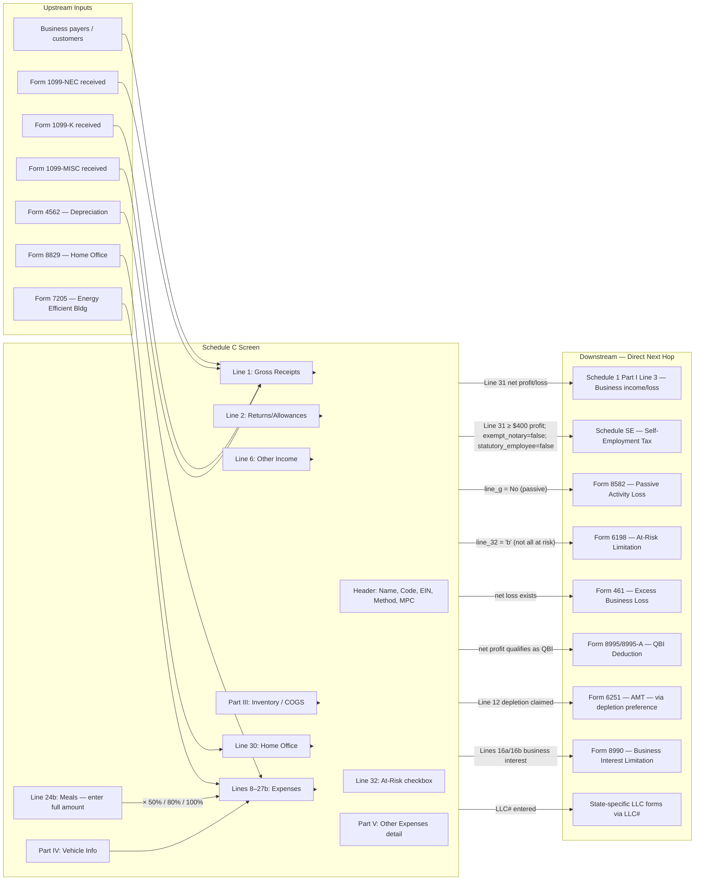

# Schedule C — Profit or Loss From Business (Sole Proprietorship)

## Overview

Schedule C is the form used by sole proprietors (and single-member LLCs treated as disregarded entities) to report income and expenses from a business activity. The net profit or loss from Schedule C flows to **Schedule 1, Part I, Line 3** ("Business income or (loss)"), which then flows to **Form 1040 Line 8** ("Other income from Schedule 1"). A net profit of **$400 or more** (or $108.28 for clergy) also triggers **Schedule SE** (self-employment tax). Schedule C net profit is also Qualified Business Income (QBI) eligible for the 20% QBI deduction via **Form 8995/8995-A** (Form 1040 Line 13a).

Key 2025 changes: 100% bonus depreciation restored (OBBBA, P.L. 119-21, for property placed in service after January 19, 2025); Section 179 limit raised to $2,500,000; new Line 27a for energy-efficient buildings; Line 27b replaces Line 48 for other expenses; qualified tips and overtime now deducted on Schedule 1-A (not Schedule C); domestic R&D may now be deducted currently per Rev. Proc. 2025-28.

Taxpayers may have multiple Schedule C instances — one per separate business. Each instance generates its own net profit/loss and is separately routed to Schedule 1 Line 3 (where all instances are summed).

**IRS Form:** Schedule C (Form 1040)
**Drake Screen:** C (Income tab > C screen; Carryovers/State Info tab for LLC# and state options)
**Tax Year:** 2025
**Drake Reference:**
- https://kb.drakesoftware.com/kb/Drake-Tax/11809.htm (Special Tax Treatment)
- https://kb.drakesoftware.com/kb/Drake-Tax/14104.htm (Disposed of Business)
- https://kb.drakesoftware.com/kb/Drake-Tax/14219.htm (Business Activity Codes)
- https://kb.drakesoftware.com/kb/Drake-Tax/10651.htm (Schedule SE FAQs)
- https://kb.drakesoftware.com/kb/Drake-Tax/10301.htm (Schedule C Loss Not Flowing)
- https://kb.drakesoftware.com/kb/Drake-Tax/11974.htm (SMLLC State Forms)

---

## Data Entry Fields

Required fields first, then optional. Data-entry only — no computed/display fields.

### Header / Identification

| Field | Type | Required | Drake Label | Description | IRS Reference | URL |
| ----- | ---- | -------- | ----------- | ----------- | ------------- | --- |
| line_a_principal_business | text | yes | "Principal business or profession" | General field or activity that is the principal source of business income. For multiple business types, file a separate Schedule C for each. Include product/service type and whether wholesale/retail. | i1040sc.pdf, Line A, p.2 | https://www.irs.gov/instructions/i1040sc |
| line_b_business_code | string (6-digit) | yes | "Business code" (drop-list in Drake) | Six-digit Principal Business Activity code from the IRS NAICS-based code list at the end of Schedule C instructions. In Drake, use the Business Code drop-list (Ctrl+Shift+S to search). Not all NAICS codes are included — only those in the IRS Schedule C instructions are available. | i1040sc.pdf, Line B, p.2 | https://www.irs.gov/instructions/i1040sc |
| line_c_business_name | text | no | "Business name" | Name of business if different from taxpayer's personal name. Leave blank if operating under personal name. | i1040sc.pdf, Line C, p.2 | https://www.irs.gov/instructions/i1040sc |
| line_d_ein | string (9-digit XX-XXXXXXX) | no | "EIN" | Employer Identification Number from Form SS-4. Required only if: (1) qualified retirement plan exists, (2) employment returns are filed, or (3) gambling winnings reporting. Leave blank otherwise. | i1040sc.pdf, Line D, p.2 | https://www.irs.gov/instructions/i1040sc |
| line_e_business_address | text (street, city, state, ZIP) | no | "Business address" | Street address (not P.O. box) of principal business location. May omit if business conducted at home address already shown on Form 1040. Include suite/room number if applicable. | i1040sc.pdf, Line E, p.2 | https://www.irs.gov/instructions/i1040sc |
| line_f_accounting_method | enum (Cash / Accrual / Other) | yes | "Accounting method" | Cash = income recognized when received, expenses when paid. Accrual = income/expenses recognized when earned/incurred. Other = any IRS-permitted method that clearly reflects income. Accrual is required for sales/purchases of inventory unless small business taxpayer exception applies (avg. gross receipts ≤$30M). Form 3115 required to change method. | i1040sc.pdf, Line F, p.2 | https://www.irs.gov/instructions/i1040sc |
| line_g_material_participation | boolean (Yes/No) | yes | "Did you materially participate in the operation of this business during 2025?" | Yes = activity is a trade/business (not hobby/passive) and taxpayer meets at least one of 7 material participation tests: (1) 500+ hours during the year; (2) substantially all participation; (3) 100+ hours as the most-participating individual; (4) significant participation activity and aggregate significant participation ≥500 hours; (5) material participation in 5 of prior 10 years; (6) personal service activity with any 3 prior years of material participation; (7) regular/continuous/substantial participation based on facts and circumstances with 100+ hours. No = passive — Form 8582 applies and losses may be suspended. | i1040sc.pdf, Line G, p.2 | https://www.irs.gov/instructions/i1040sc |
| line_h_new_business | boolean (checkbox) | no | "If you started or acquired this business in 2025, check here" | Check if the business was started, acquired, or reopened in 2025 without a prior 2024 Schedule C filing for this activity. Used to identify startup-year returns. | i1040sc.pdf, Line H, p.2 | https://www.irs.gov/instructions/i1040sc |
| line_i_made_1099_payments | boolean (Yes/No) | no | "Did you make any payments in 2025 that would require you to file Form(s) 1099?" | Yes if any payment ≥$600 was made to contractors, landlords, or other recipients requiring Form 1099 filing. | i1040sc.pdf, Line I, p.2 | https://www.irs.gov/instructions/i1040sc |
| line_j_filed_1099s | boolean (Yes/No) | no | "If 'Yes,' did you or will you file all required Forms 1099?" | Companion to Line I. Yes = taxpayer is compliant with 1099 reporting obligations. | i1040sc.pdf, Line J, p.2 | https://www.irs.gov/instructions/i1040sc |
| statutory_employee | boolean (checkbox) | no | "Statutory employee" (checkbox on Line 1) | Check if income was reported on Form W-2 Box 1 AND Box 13 "Statutory employee" was checked. Social Security/Medicare taxes were already withheld by the employer; Schedule SE is NOT generated for this Schedule C. | i1040sc.pdf, Line 1, p.3 | https://www.irs.gov/instructions/i1040sc |

### Drake-Specific Special Treatment Fields (no direct IRS line — affect calculations)

| Field | Type | Required | Drake Label | Description | IRS Reference | URL |
| ----- | ---- | -------- | ----------- | ----------- | ------------- | --- |
| professional_gambler | boolean | no | "Professional gambler" | Check if taxpayer is a professional gambler operating as a sole proprietor. Per TCJA/26 USC §165(d), losses from professional gambling are limited to $0 — no net loss allowed. Drake caps Schedule C Line 31 at $0 when checked. | 26 USC §165(d); IRS Pub 525 | https://www.irs.gov/pub/irs-pdf/p525.pdf |
| exempt_notary | boolean | no | "All income is from notary services (exempt from SE)" | Check if all income on this Schedule C is notary income. Notary fees are exempt from self-employment tax per Rev. Rul. 57-116. Drake suppresses Schedule SE for this Schedule C when checked. | Rev. Rul. 57-116; i1040sc | https://www.irs.gov/instructions/i1040sc |
| paper_route | boolean | no | "Under 18 newspaper delivery" | Check if taxpayer is under age 18 and all income is from delivering newspapers/shopping news. Exempt from SE tax per 26 USC §3121(b)(14). Drake suppresses Schedule SE when checked. | 26 USC §3121(b)(14) | https://www.irs.gov/instructions/i1040sc |
| clergy_schedule_c | enum (Yes/No) | no | "Clergy Schedule C" | Select Yes if this Schedule C belongs to a member of the clergy. Triggers specialized clergy income and housing allowance rules. Select No otherwise. | IRS Pub 517; i1040sc | https://www.irs.gov/pub/irs-pdf/p517.pdf |
| disposed_of_business | boolean | no | "Taxpayer disposed of business during 2025" | Check if taxpayer closed or disposed of this business during 2025. No impact on current-year tax computation. Drake uses this to prevent the Schedule C from rolling forward when the return is updated to next year. | Drake KB 14104 | https://kb.drakesoftware.com/kb/Drake-Tax/14104.htm |
| multi_form_code | string (1–999) | no | "MFC" (Multi-Form Code) | Used when taxpayer has multiple Schedule C instances (multiple businesses). Each distinct business gets a unique integer code. Drake uses this to route data entry to the correct Schedule C instance. | Drake internal | https://kb.drakesoftware.com/kb/Drake-Tax/10651.htm |
| llc_number | integer (1–999) | no | "LLC#" (on Carryovers/State Info tab) | For Single-Member LLCs: enter a unique number 1–999 to tie this Schedule C to state-specific LLC forms (e.g., CA Form 568, KY Form 725, TX Franchise, Philadelphia tax forms, TN Form 170). No federal tax effect. Location: Carryovers/State Info tab (moved from main screen in Drake Tax 19+). | Drake KB 11974 | https://kb.drakesoftware.com/kb/Drake-Tax/11974.htm |

### Part I: Income

| Field | Type | Required | Drake Label | Description | IRS Reference | URL |
| ----- | ---- | -------- | ----------- | ----------- | ------------- | --- |
| line_1_gross_receipts | number (dollars, ≥0) | yes | "Gross receipts or sales" | Total business revenue for the year. Must reconcile with Forms 1099-NEC, 1099-MISC, 1099-K received. Special cases: (a) NIL income for student-athletes: report here; (b) Medicaid waiver payments: report full amount received, claim excludable portion as Part V expense with "Notice 2014-7" notation; (c) installment sales: attach statement showing gross sales, COGS, gross profit %, and collections for TY2025 and 3 prior years. | i1040sc.pdf, Line 1, p.3 | https://www.irs.gov/instructions/i1040sc |
| line_2_returns_allowances | number (dollars, ≥0) | no | "Returns and allowances" | Cash refunds and price reductions given to customers for returned or defective goods. Enter as positive number. Subtracted from Line 1 to get net sales (Line 3 = Line 1 − Line 2). | i1040sc.pdf, Line 2, p.3 | https://www.irs.gov/instructions/i1040sc |
| line_6_other_income | number (dollars) | no | "Other income, including federal and state gasoline or fuel tax credit or refund" | Miscellaneous business income not captured on Line 1: finance reserve income, scrap sales, recovered bad debts, business interest received, state fuel tax refunds, biofuel credits, prior-year federal fuel tax paid, business prizes/awards, Form 1099-PATR amounts. Also: recaptured excess depreciation if listed property business use drops to ≤50% (recapture via Form 4797 Part IV). | i1040sc.pdf, Line 6, p.3 | https://www.irs.gov/instructions/i1040sc |

### Part II: Expenses

| Field | Type | Required | Drake Label | Description | IRS Reference | URL |
| ----- | ---- | -------- | ----------- | ----------- | ------------- | --- |
| line_8_advertising | number (dollars, ≥0) | no | "Advertising" | Ordinary and necessary advertising costs (print, digital, signage, direct mail, promotional items directly related to the business). | i1040sc.pdf, Line 8, p.4 | https://www.irs.gov/instructions/i1040sc |
| line_9_car_truck_expenses | number (dollars, ≥0) | no | "Car and truck expenses (see instructions)" | Choose ONE method per vehicle: (a) Standard mileage rate: business miles × $0.70/mile (TY2025) + parking fees + tolls. Cannot use if: 5+ vehicles used simultaneously, Section 179 claimed on vehicle in first year, MACRS/bonus depreciation claimed in prior year, or leased vehicle not using standard rate for entire lease period. Requires Part IV vehicle info if not filing Form 4562. OR (b) Actual operating expenses × business-use %: fuel, oil, repairs, insurance, license plates, garage rent. Show depreciation on Line 13; rent/lease on Line 20a. Cannot combine methods for same vehicle. | i1040sc.pdf, Line 9, p.4; IRS Notice 2025-5 (IR-2024-312) | https://www.irs.gov/instructions/i1040sc |
| line_10_commissions_fees | number (dollars, ≥0) | no | "Commissions and fees" | Total commissions and nonemployee fees paid during the year. Exclude capitalized amounts. Form 1099-NEC required for any payee receiving ≥$600. Do not include employee wages (use Line 26) or amounts reported on Lines 17, 21, or 37. | i1040sc.pdf, Line 10, p.4 | https://www.irs.gov/instructions/i1040sc |
| line_11_contract_labor | number (dollars, ≥0) | no | "Contract labor" | Payments to independent contractors for services. Exclude amounts already deducted on Lines 17 (professional services), 21 (repairs), 26 (wages), or 37 (cost of labor). Form 1099-NEC required for any payee receiving ≥$600. | i1040sc.pdf, Line 11, p.4 | https://www.irs.gov/instructions/i1040sc |
| line_12_depletion | number (dollars, ≥0) | no | "Depletion" | Annual depletion deduction for timber, minerals, oil/gas, or other natural resources used in the business. Timber: attach Form T. Important: depletion is an Alternative Minimum Tax (AMT) preference item — claiming it may trigger Form 6251 (AMT). | i1040sc.pdf, Line 12, p.4 | https://www.irs.gov/instructions/i1040sc |
| line_13_depreciation | number (dollars, ≥0) | no | "Depreciation and section 179 expense deduction (not included in Part III) — see instructions" | Cost recovery for business property placed in service. Form 4562 MUST be attached if: (a) depreciation claimed on property first placed in service in TY2025, (b) listed property is being depreciated (any year), or (c) a Section 179 election is made. TY2025 rules: Section 179 limit = $2,500,000 (phase-out begins at $4,000,000 of property placed in service; phase-out is dollar-for-dollar). 100% bonus depreciation available for qualified MACRS property with ≤20-year recovery period placed in service after January 19, 2025 (per OBBBA, P.L. 119-21). SUV Section 179 cap: $31,300. Passenger automobile first-year depreciation cap (with 100% bonus): $20,200 (per Rev. Proc. 2025-16). Enter the total from Form 4562 here. | i1040sc.pdf, Line 13; Form 4562 instructions; Rev. Proc. 2025-16 | https://www.irs.gov/instructions/i1040sc |
| line_14_employee_benefits | number (dollars, ≥0) | no | "Employee benefit programs (other than on line 19)" | Employer contributions to accident/health plans, group-term life insurance, dependent care assistance — for employees only, not the self-employed owner. Cannot deduct self-employed group-term life insurance. Reduce by Form 8941 (small employer health insurance credit) if applicable. Self-employed health insurance premiums for the owner are deducted on Schedule 1 Line 17, NOT here. | i1040sc.pdf, Line 14, p.4 | https://www.irs.gov/instructions/i1040sc |
| line_15_insurance | number (dollars, ≥0) | no | "Insurance (other than health)" | Business liability, property, fire, theft, vehicle, and other business insurance premiums. Cannot deduct: self-insurance reserves, personal disability income replacement policies. Employee health insurance premiums go on Line 14, not here. | i1040sc.pdf, Line 15, p.5 | https://www.irs.gov/instructions/i1040sc |
| line_16a_interest_mortgage | number (dollars, ≥0) | no | "Mortgage (paid to banks, etc.)" | Mortgage interest on real property used in the business, as reported on Form 1098. If actual amount paid exceeds the Form 1098 amount, attach a statement explaining the difference. | i1040sc.pdf, Line 16a, p.5 | https://www.irs.gov/instructions/i1040sc |
| line_16b_interest_other | number (dollars, ≥0) | no | "Other" interest | Business interest not on Form 1098: business loan interest, shared mortgage (attach statement with payer info), other business debt interest. Cannot deduct personal-use portion of vehicle loan interest here (that portion may go to Schedule 1-A for TY2025). May require Form 8990 (limitation on business interest expense under IRC §163(j)) unless small business taxpayer exception applies. Home equity loan interest limited by IRC §163(h)(3)(F). | i1040sc.pdf, Line 16b, p.5 | https://www.irs.gov/instructions/i1040sc |
| line_17_professional_services | number (dollars, ≥0) | no | "Legal and professional services" | Accountant fees, attorney fees for business operations, tax preparation fees for business returns, fees to resolve business tax deficiencies. Must be ordinary and necessary for the business. | i1040sc.pdf, Line 17, p.5 | https://www.irs.gov/instructions/i1040sc |
| line_18_office_expense | number (dollars, ≥0) | no | "Office expense" | Office supplies, stationery, and postage used in business operations. | i1040sc.pdf, Line 18, p.5 | https://www.irs.gov/instructions/i1040sc |
| line_19_pension_plans | number (dollars, ≥0) | no | "Pension and profit-sharing plans" | Employer contributions to employee SEP, SIMPLE, SARSEP, pension, or profit-sharing plans. Critical distinction: self-employed contributions by the SOLE PROPRIETOR for themselves are deducted on Schedule 1 (Form 1040) Line 16 — NOT here. Only contributions made on behalf of employees appear on this line. May require Form 5500-EZ, 5500-SF, or 5500 filing depending on plan type and size. | i1040sc.pdf, Line 19, p.5 | https://www.irs.gov/instructions/i1040sc |
| line_20a_rent_vehicles | number (dollars, ≥0) | no | "Vehicles, machinery, and equipment" (rent/lease) | Business-use portion of vehicle/machinery/equipment rental or lease payments. If vehicle is leased for 30+ days, may need to reduce by lease inclusion amount per IRS Publication 463, Chapter 4. | i1040sc.pdf, Line 20a, p.5 | https://www.irs.gov/instructions/i1040sc |
| line_20b_rent_other | number (dollars, ≥0) | no | "Other business property" (rent/lease) | Rent for office space, warehouse, retail space, and other business property. | i1040sc.pdf, Line 20b, p.5 | https://www.irs.gov/instructions/i1040sc |
| line_21_repairs | number (dollars, ≥0) | no | "Repairs and maintenance" | Cost of incidental repairs that do not add value to or materially extend the useful life of property. Cannot deduct: personal labor, restoration/replacement (must capitalize instead). | i1040sc.pdf, Line 21, p.5 | https://www.irs.gov/instructions/i1040sc |
| line_22_supplies | number (dollars, ≥0) | no | "Supplies" | Cost of materials and supplies actually consumed or used in the business during the year. Books and professional instruments: deductible if normally used within one year; otherwise must be depreciated. | i1040sc.pdf, Line 22, p.5 | https://www.irs.gov/instructions/i1040sc |
| line_23_taxes_licenses | number (dollars, ≥0) | no | "Taxes and licenses" | Deductible: state/local sales taxes on business goods/services (as seller); property taxes on business assets; business licenses and regulatory fees; employer share of Social Security/Medicare; FUTA; highway use tax; state SDI/PFML contributions. Non-deductible (do not include): federal income tax, self-employment tax, estate/gift taxes, improvement assessments, personal property taxes, sales taxes on business property purchases (capitalize), sales taxes collected from customers. | i1040sc.pdf, Line 23, p.5 | https://www.irs.gov/instructions/i1040sc |
| line_24a_travel | number (dollars, ≥0) | no | "Travel" | Lodging and transportation for overnight business travel away from tax home (the general area of the taxpayer's main place of business). Excludes meals (Line 24b). Cannot deduct: spouse/dependent travel (unless a bona fide employee with business purpose), travel away from home exceeding one year, conventions outside North America unless directly related and location reasonable. $5/day optional incidental expense method available on days no meals are paid. | i1040sc.pdf, Line 24a, p.6 | https://www.irs.gov/instructions/i1040sc |
| line_24b_meals | number (dollars, ≥0) | no | "Meals (subject to limitations)" | Business meal expenses. Enter the FULL (pre-limitation) amount in Drake; the software applies the applicable percentage. Deductible at: (a) 50% — most business meals; (b) 80% — individuals subject to DOT hours-of-service limits (air crew, interstate truck/bus driver, merchant mariner, railroad employee); (c) 100% — if properly treated as wages subject to withholding or reported on Form 1099-NEC. Conditions: ordinary/necessary; not lavish/extravagant; taxpayer or employee present; business contact present; food/beverages purchased separately from entertainment. Alternative: use federal M&IE standard meal allowance rates by locality from GSA.gov/travel (IRS Notice 2024-68 covers Oct 2024–Sep 2025; IRS Notice 2025-54 covers subsequent periods). | i1040sc.pdf, Line 24b, p.6; IRS Notice 2024-68; IRS Notice 2025-54 | https://www.irs.gov/instructions/i1040sc |
| line_25_utilities | number (dollars, ≥0) | no | "Utilities" | Business utility expenses: electricity, water, gas, internet, cable for business premises. Cannot deduct: base rate (including taxes) of the first residential phone line. May deduct: additional business-related long-distance charges or second residential line charges. | i1040sc.pdf, Line 25, p.6 | https://www.irs.gov/instructions/i1040sc |
| line_26_wages | number (dollars, ≥0) | no | "Wages (less employment credits)" | Total employee salaries and wages paid during the year, reduced by any applicable employment tax credits. Credits that reduce this line: Work Opportunity Credit (Form 5884), Empowerment Zone Employment Credit (Form 8844), Employer Differential Wage Payment Credit (Form 8932), Employer Paid Family/Medical Leave Credit (Form 8994). Enter the net amount after subtracting credits. Does not include contract labor (Line 11) or owner's draw. | i1040sc.pdf, Line 26, p.6 | https://www.irs.gov/instructions/i1040sc |
| line_27a_energy_efficient | number (dollars, ≥0) | no | "Energy efficient commercial buildings deduction" | IRC §179D deduction for qualified energy-efficient commercial building property. Computed on Form 7205. New for TY2025: now reported on Line 27a (previously reported at a different location). Note: OBBBA eliminates this deduction for new buildings beginning construction after June 30, 2026. | i1040sc.pdf, Line 27a, p.6; Form 7205 instructions | https://www.irs.gov/instructions/i1040sc |
| line_27b_other_expenses | number (dollars, ≥0) | no | "Other expenses (from line 48)" | Total of Part V "Other Expenses" detail (Line 48). New for TY2025: redesignated from Line 48 to Line 27b on the face of the form. Common items entered in Part V: amortization (Form 4562 required), bad debts (accrual method only; cash-method bad debts are capital losses), business startup costs (up to $5,000 immediate; excess amortize over 15 years; phase-out starts when total startup costs exceed $50,000), disability access removal (up to $15,000/year; IRC §190), nontaxable Medicaid waiver exclusion (label "Notice 2014-7"), de minimis safe harbor tangible property (<$2,500/item or <$5,000 with written accounting policy), film/TV/live theatrical/sound recording production costs (IRC §181; sound recording: up to $150,000 for costs after July 4, 2025 through January 1, 2026), domestic R&D expenditures (TY2025: may deduct currently as business expense OR capitalize and amortize over ≥60 months; election per Rev. Proc. 2025-28), technology/software tools, reforestation/forestation costs. | i1040sc.pdf, Line 27b/Line 48, p.6/p.10; Rev. Proc. 2025-28 | https://www.irs.gov/instructions/i1040sc |
| line_30_home_office | number (dollars, ≥0) | no | "Expenses for business use of your home" | Either: (a) Simplified method: $5 × qualified square feet (max 300 sq ft = $1,500 maximum). No Form 8829. No depreciation deduction. Can carry over unallowed prior actual-method expenses. OR (b) Actual method (Form 8829): allocates actual home expenses (mortgage interest, real estate taxes, insurance, utilities, repairs, depreciation) by the business-use percentage. Form 8829 produces the allowable deduction, which is entered here. Gross income limitation: deduction cannot exceed Schedule C gross profit from the home-based business. Excess carries forward. | i1040sc.pdf, Line 30, p.7; Form 8829 instructions | https://www.irs.gov/instructions/i1040sc |
| line_32_at_risk | enum ("a" / "b") | conditional | "At-risk" checkbox | Present only when there is a net loss on Line 31. "a" = all investment at risk (taxpayer personally liable for all losses). "b" = some investment NOT at risk (nonrecourse financing or third-party guarantees present). If "b" is checked, Form 6198 must be attached. Form 6198 computes the allowable loss; excess carries forward as a suspended at-risk loss. | i1040sc.pdf, Line 32, p.7; Form 6198 instructions | https://www.irs.gov/instructions/i1040sc |

### Part III: Cost of Goods Sold (complete only if taxpayer has inventory or sells goods)

| Field | Type | Required | Drake Label | Description | IRS Reference | URL |
| ----- | ---- | -------- | ----------- | ----------- | ------------- | --- |
| line_33_inventory_method | enum (Cost / LCM / Other) | conditional | "Method(s) used to value closing inventory" | Cost = valued at cost. LCM = lower of cost or market. Other = any other IRS-approved method. Must be applied consistently year-to-year. Changing methods requires Form 3115 and possible §481(a) adjustment. Exception: small business taxpayers (avg. annual gross receipts ≤$30M over 3 years) may treat inventories as nonincidental materials/supplies and skip formal inventory tracking. | i1040sc.pdf, Part III, p.8 | https://www.irs.gov/instructions/i1040sc |
| line_34_inventory_change | boolean (Yes/No) | conditional | "Was there a change in determining quantities, costs, or valuations between opening and closing inventory?" | Yes if inventory accounting method changed from the prior year. Requires Form 3115 if changing valuation method. | i1040sc.pdf, Part III, p.8 | https://www.irs.gov/instructions/i1040sc |
| line_35_beg_inventory | number (dollars, ≥0) | conditional | "Inventory at beginning of year" | Opening inventory balance. Must equal prior year's closing inventory (Line 41 from prior year return). If first year in business, enter $0. | i1040sc.pdf, Line 35, p.8 | https://www.irs.gov/instructions/i1040sc |
| line_36_purchases | number (dollars, ≥0) | conditional | "Purchases less cost of items withdrawn for personal use" | Cost of merchandise purchased for resale during the year, minus the cost of any items withdrawn for personal use (deducted at cost). | i1040sc.pdf, Line 36, p.8 | https://www.irs.gov/instructions/i1040sc |
| line_37_cost_of_labor | number (dollars, ≥0) | conditional | "Cost of labor (Do not include any amounts paid to yourself)" | Labor directly involved in producing the goods sold. Do not include amounts already on Line 26 (employee wages). Self-employed owner's labor is not deductible here. | i1040sc.pdf, Line 37, p.8 | https://www.irs.gov/instructions/i1040sc |
| line_38_materials_supplies_cogs | number (dollars, ≥0) | conditional | "Materials and supplies" | Raw materials and supplies incorporated into or consumed in producing goods for sale. Separate and distinct from Line 22 (office/operating supplies). | i1040sc.pdf, Line 38, p.8 | https://www.irs.gov/instructions/i1040sc |
| line_39_other_costs | number (dollars, ≥0) | conditional | "Other costs" | Other production costs not captured on Lines 35–38. Attach statement if material. | i1040sc.pdf, Line 39, p.8 | https://www.irs.gov/instructions/i1040sc |
| line_41_end_inventory | number (dollars, ≥0) | conditional | "Inventory at end of year" | Closing inventory at December 31, 2025. Must be valued consistently with Line 33 method. Becomes next year's Line 35. Subject to uniform capitalization rules (IRC §263A) unless small business taxpayer exception applies. | i1040sc.pdf, Line 41, p.8 | https://www.irs.gov/instructions/i1040sc |

### Part IV: Vehicle Information (required if Line 9 claimed and Form 4562 not filed)

| Field | Type | Required | Drake Label | Description | IRS Reference | URL |
| ----- | ---- | -------- | ----------- | ----------- | ------------- | --- |
| line_43_date_in_service | date (mm/dd/yyyy) | conditional | "When did you place your vehicle in service for business purposes?" | Date the vehicle was first placed in business service. Required if claiming Line 9 expenses and not attaching Form 4562 (or using standard mileage rate). | i1040sc.pdf, Part IV, p.9 | https://www.irs.gov/instructions/i1040sc |
| line_44a_total_miles | integer | conditional | "Total number of miles you drove your vehicle during 2025" | Total miles driven (all purposes) in TY2025. Used to compute business-use percentage if using actual expenses. | i1040sc.pdf, Line 44a, p.9 | https://www.irs.gov/instructions/i1040sc |
| line_44b_business_miles | integer | conditional | "Business miles" | Miles driven for qualified business purposes. Multiplied by $0.70/mile (TY2025) if using standard mileage method. | i1040sc.pdf, Line 44b, p.9 | https://www.irs.gov/instructions/i1040sc |
| line_44c_commuting_miles | integer | conditional | "Commuting miles" | Miles driven between home and regular workplace. Non-deductible in all circumstances. | i1040sc.pdf, Line 44c, p.9 | https://www.irs.gov/instructions/i1040sc |
| line_44d_other_miles | integer | conditional | "Other miles" | Personal and other non-business, non-commuting miles. Non-deductible. | i1040sc.pdf, Line 44d, p.9 | https://www.irs.gov/instructions/i1040sc |
| line_45_personal_use | boolean (Yes/No) | conditional | "Was your vehicle available for personal use during off-duty hours?" | Yes if vehicle was available for personal use when not used for business. Affects listed property substantiation requirements. | i1040sc.pdf, Line 45, p.9 | https://www.irs.gov/instructions/i1040sc |
| line_46_another_vehicle | boolean (Yes/No) | conditional | "Do you (or your spouse) have another vehicle available for personal use?" | Yes if another vehicle (business or personal) is available. Relevant to listed property rules. | i1040sc.pdf, Line 46, p.9 | https://www.irs.gov/instructions/i1040sc |
| line_47a_evidence | boolean (Yes/No) | conditional | "Do you have evidence to support your deduction?" | Yes if contemporaneous mileage records or other documentation supports the business use claim. | i1040sc.pdf, Line 47a, p.9 | https://www.irs.gov/instructions/i1040sc |
| line_47b_written_evidence | boolean (Yes/No) | conditional | "If 'Yes,' is the evidence written?" | Yes if the supporting evidence is in written form (mileage log, receipts). Written evidence required for listed property. | i1040sc.pdf, Line 47b, p.9 | https://www.irs.gov/instructions/i1040sc |

### Part V: Other Expenses (itemized detail for Line 27b)

| Field | Type | Required | Drake Label | Description | IRS Reference | URL |
| ----- | ---- | -------- | ----------- | ----------- | ------------- | --- |
| part_v_other_expenses | array of {description: string, amount: number} (up to ~9 line items) | no | "Other expenses" rows (description + amount) | Itemized list of other business expenses. Descriptions must identify the expense type. Totaled on Line 48, which flows to Line 27b. Common items (not exhaustive): amortization (requires Form 4562); bad debts (accrual method only — cash method bad debts are short-term capital losses, not deductible here); business startup costs ($5,000 immediate, phased out $1-for-$1 when total startup costs exceed $50,000; excess amortized over 15 years); disability access removal (up to $15,000/year, IRC §190); Medicaid waiver exclusion (label exactly "Notice 2014-7"); de minimis safe harbor property (cost <$2,500, or <$5,000 with written accounting policy, per Treas. Reg. §1.263(a)-1(f)); technology/software tools; domestic R&D (TY2025: current deduction OR ≥60-month amortization per IRC §174A; Rev. Proc. 2025-28); sound recording production costs (up to $150,000 for costs incurred after July 4, 2025 through January 1, 2026, per IRC §181). | i1040sc.pdf, Part V / Line 48; Rev. Proc. 2025-28 | https://www.irs.gov/instructions/i1040sc |

---

## Per-Field Routing

For every field above: where the value goes, how it is used, what it triggers, any limits.

| Field | Destination | How Used | Triggers | Limit / Cap | IRS Reference | URL |
| ----- | ----------- | -------- | -------- | ----------- | ------------- | --- |
| line_a_principal_business | Schedule C header | Descriptive / identifying only | None | None | i1040sc Line A | https://www.irs.gov/instructions/i1040sc |
| line_b_business_code | Schedule C header | IRS statistics; some states use for local tax | None | 6-digit IRS-approved code | i1040sc Line B | https://www.irs.gov/instructions/i1040sc |
| line_c_business_name | Schedule C header | Descriptive | None | None | i1040sc Line C | https://www.irs.gov/instructions/i1040sc |
| line_d_ein | Schedule C header | Employer identification | None | Format: XX-XXXXXXX | i1040sc Line D | https://www.irs.gov/instructions/i1040sc |
| line_e_business_address | Schedule C header | Descriptive | None | None | i1040sc Line E | https://www.irs.gov/instructions/i1040sc |
| line_f_accounting_method | Income/expense recognition timing | Controls when income/expenses appear | Form 3115 if changing | Accrual required for inventory unless small biz exception | i1040sc Line F | https://www.irs.gov/instructions/i1040sc |
| line_g_material_participation | Sch C Line 31 treatment; Form 8582 | No → passive; Form 8582 suspends losses | Form 8582 (if No) | None | i1040sc Line G | https://www.irs.gov/instructions/i1040sc |
| line_h_new_business | Sch C header | Identifies startup-year returns | None | None | i1040sc Line H | https://www.irs.gov/instructions/i1040sc |
| line_i_made_1099_payments | Sch C header | Compliance indicator | None | None | i1040sc Line I | https://www.irs.gov/instructions/i1040sc |
| line_j_filed_1099s | Sch C header | Compliance indicator | None | None | i1040sc Line J | https://www.irs.gov/instructions/i1040sc |
| statutory_employee | Schedule SE suppression | Suppresses Schedule SE for this Sch C | Suppresses Schedule SE | None | i1040sc Line 1 | https://www.irs.gov/instructions/i1040sc |
| professional_gambler | Sch C Line 31 cap | Caps net loss at $0 | None | Loss limited to $0 per TCJA/§165(d) | 26 USC §165(d) | https://www.irs.gov/instructions/i1040sc |
| exempt_notary | Schedule SE suppression | Suppresses SE tax on this Sch C | Suppresses Schedule SE | None | Rev. Rul. 57-116 | https://www.irs.gov/instructions/i1040sc |
| paper_route | Schedule SE suppression | Suppresses SE tax (under-18 newspaper delivery) | Suppresses Schedule SE | Taxpayer must be under age 18 | 26 USC §3121(b)(14) | https://www.irs.gov/instructions/i1040sc |
| clergy_schedule_c | Clergy SE and housing calculation | Triggers clergy income rules and housing allowance | Clergy-specific schedules | None | Pub 517 | https://www.irs.gov/pub/irs-pdf/p517.pdf |
| disposed_of_business | Drake system only | Prevents rollforward; no current-year tax effect | None (Drake internal) | None | Drake KB 14104 | https://kb.drakesoftware.com/kb/Drake-Tax/14104.htm |
| multi_form_code | Drake routing only | Routes data entry to specific Sch C instance | None | 1–999 | Drake internal | https://kb.drakesoftware.com/kb/Drake-Tax/10651.htm |
| llc_number | State forms (CA 568, KY 725, TX Franchise, etc.) | Ties Sch C to state LLC forms | State-specific forms | 1–999 | Drake KB 11974 | https://kb.drakesoftware.com/kb/Drake-Tax/11974.htm |
| line_1_gross_receipts | Sch C Line 3 | Line 3 = Line 1 − Line 2 | None | None | i1040sc Line 1 | https://www.irs.gov/instructions/i1040sc |
| line_2_returns_allowances | Sch C Line 3 | Reduces gross receipts: Line 3 = Line 1 − Line 2 | None | None | i1040sc Line 2 | https://www.irs.gov/instructions/i1040sc |
| line_6_other_income | Sch C Line 7 | Adds to gross profit: Line 7 = Line 5 + Line 6 | None | None | i1040sc Line 6 | https://www.irs.gov/instructions/i1040sc |
| line_8_advertising | Sch C Line 28 (total expenses) | Reduces net profit via Line 28 | None | None | i1040sc Line 8 | https://www.irs.gov/instructions/i1040sc |
| line_9_car_truck_expenses | Sch C Line 28; Part IV (vehicle info) | Reduces net profit. If no Form 4562, Part IV questions required | Form 4562 (listed property or actual method with depreciation); Part IV if standard mileage | Cannot use standard rate for 5+ simultaneous vehicles; §280F caps apply to actual method | i1040sc Line 9 | https://www.irs.gov/instructions/i1040sc |
| line_10_commissions_fees | Sch C Line 28 | Reduces net profit | None | None | i1040sc Line 10 | https://www.irs.gov/instructions/i1040sc |
| line_11_contract_labor | Sch C Line 28 | Reduces net profit | None | None | i1040sc Line 11 | https://www.irs.gov/instructions/i1040sc |
| line_12_depletion | Sch C Line 28 | Reduces net profit | Form 6251 (AMT preference item) | None | i1040sc Line 12 | https://www.irs.gov/instructions/i1040sc |
| line_13_depreciation | Sch C Line 28; Form 4562 | Reduces net profit. Amount comes from Form 4562. | Form 4562 (required if: depreciation in TY2025, listed property any year, Sec. 179 election) | Sec 179: $2,500,000 limit; phase-out at $4,000,000; SUV cap $31,300; auto cap $20,200 with bonus | i1040sc Line 13; Form 4562 | https://www.irs.gov/instructions/i1040sc |
| line_14_employee_benefits | Sch C Line 28 | Reduces net profit | Form 8941 (credit offsets wage cost) | None | i1040sc Line 14 | https://www.irs.gov/instructions/i1040sc |
| line_15_insurance | Sch C Line 28 | Reduces net profit | None | None | i1040sc Line 15 | https://www.irs.gov/instructions/i1040sc |
| line_16a_interest_mortgage | Sch C Line 28 | Reduces net profit | Form 8990 if §163(j) applies | HELOC limit per §163(h)(3)(F) | i1040sc Line 16a | https://www.irs.gov/instructions/i1040sc |
| line_16b_interest_other | Sch C Line 28 | Reduces net profit | Form 8990 if §163(j) applies | None | i1040sc Line 16b | https://www.irs.gov/instructions/i1040sc |
| line_17_professional_services | Sch C Line 28 | Reduces net profit | None | None | i1040sc Line 17 | https://www.irs.gov/instructions/i1040sc |
| line_18_office_expense | Sch C Line 28 | Reduces net profit | None | None | i1040sc Line 18 | https://www.irs.gov/instructions/i1040sc |
| line_19_pension_plans | Sch C Line 28 | Reduces net profit (employee contributions only) | Forms 5500-EZ / 5500-SF / 5500 | None | i1040sc Line 19 | https://www.irs.gov/instructions/i1040sc |
| line_20a_rent_vehicles | Sch C Line 28 | Reduces net profit | None | Reduce by lease inclusion amount if vehicle leased 30+ days (Pub 463 Ch. 4) | i1040sc Line 20a | https://www.irs.gov/instructions/i1040sc |
| line_20b_rent_other | Sch C Line 28 | Reduces net profit | None | None | i1040sc Line 20b | https://www.irs.gov/instructions/i1040sc |
| line_21_repairs | Sch C Line 28 | Reduces net profit | None | None | i1040sc Line 21 | https://www.irs.gov/instructions/i1040sc |
| line_22_supplies | Sch C Line 28 | Reduces net profit | None | None | i1040sc Line 22 | https://www.irs.gov/instructions/i1040sc |
| line_23_taxes_licenses | Sch C Line 28 | Reduces net profit | None | SE tax NOT deductible here | i1040sc Line 23 | https://www.irs.gov/instructions/i1040sc |
| line_24a_travel | Sch C Line 28 | Reduces net profit (100% deductible) | None | None | i1040sc Line 24a | https://www.irs.gov/instructions/i1040sc |
| line_24b_meals | Sch C Line 28 | Enter full amount; Drake multiplies by 50%, 80%, or 100% depending on taxpayer category. Net deductible amount flows to Line 28. | None | 50% general; 80% DOT; 100% if treated as wages/1099 | i1040sc Line 24b | https://www.irs.gov/instructions/i1040sc |
| line_25_utilities | Sch C Line 28 | Reduces net profit | None | None | i1040sc Line 25 | https://www.irs.gov/instructions/i1040sc |
| line_26_wages | Sch C Line 28 | Reduces net profit (net of employment credits) | Forms 5884, 8844, 8932, 8994 (credit offsets) | None | i1040sc Line 26 | https://www.irs.gov/instructions/i1040sc |
| line_27a_energy_efficient | Sch C Line 28; requires Form 7205 | Reduces net profit | Form 7205 | None (OBBBA eliminates for new buildings after June 30, 2026) | i1040sc Line 27a; Form 7205 | https://www.irs.gov/instructions/i1040sc |
| line_27b_other_expenses | Sch C Line 28 (= Line 48 total) | Reduces net profit; itemized in Part V | Form 4562 (amortization), Form 6198 (at-risk) | Varies by expense type | i1040sc Line 27b/48 | https://www.irs.gov/instructions/i1040sc |
| line_30_home_office | Sch C Line 31 computation | Reduces tentative profit (Line 29) to arrive at Line 31 | Form 8829 (actual method) | $1,500 max simplified; gross income cap (both methods) | i1040sc Line 30; Form 8829 | https://www.irs.gov/instructions/i1040sc |
| line_32_at_risk | Form 6198; modifies Line 31 deductible amount | "b" → Form 6198 limits deductible loss; excess carries forward | Form 6198 | Loss limited to at-risk amount; excess is suspended | i1040sc Line 32; Form 6198 | https://www.irs.gov/instructions/i1040sc |
| line_33_inventory_method | Part III valuation | Controls how Line 41 is valued | Form 3115 if changing | Must be applied consistently | i1040sc Line 33 | https://www.irs.gov/instructions/i1040sc |
| line_34_inventory_change | Form 3115 trigger | Yes → Form 3115 required | Form 3115 | None | i1040sc Line 34 | https://www.irs.gov/instructions/i1040sc |
| line_35_beg_inventory through line_39_other_costs | Sch C Line 40 | Summed: Line 40 = Lines 35+36+37+38+39 | None | Line 35 must = prior year Line 41 | i1040sc Lines 35–39 | https://www.irs.gov/instructions/i1040sc |
| line_41_end_inventory | Sch C Line 42 | COGS = Line 40 − Line 41; Line 42 flows to Line 4 | None | Must match valuation method | i1040sc Line 41 | https://www.irs.gov/instructions/i1040sc |
| line_43_date_in_service through line_47b_written_evidence | Sch C Part IV (substantiation) | Support vehicle expense deduction | None | Written evidence required for listed property | i1040sc Part IV | https://www.irs.gov/instructions/i1040sc |
| part_v_other_expenses | Sch C Line 27b (Line 48 total) | Itemized detail; total flows to Line 27b | Form 4562, Form 6198 as applicable | Varies by item | i1040sc Part V | https://www.irs.gov/instructions/i1040sc |

---

## Calculation Logic

### Step 1 — Cost of Goods Sold (Part III, only if inventory exists)

```
Line 40 = Line 35 + Line 36 + Line 37 + Line 38 + Line 39
Line 42 = Line 40 − Line 41   [Cost of Goods Sold]
```

Line 42 flows to Line 4 on the front of Schedule C.

> **Source:** IRS Schedule C Instructions 2025, Part III, Lines 33–42 — https://www.irs.gov/instructions/i1040sc

### Step 2 — Gross Income (Part I)

```
Line 3 = Line 1 − Line 2   [Net Sales = Gross Receipts − Returns/Allowances]
Line 4 = Line 42 from Part III (Cost of Goods Sold; $0 if no inventory)
Line 5 = Line 3 − Line 4   [Gross Profit]
Line 7 = Line 5 + Line 6   [Gross Income]
```

> **Source:** IRS Schedule C Instructions 2025, Part I, Lines 1–7 — https://www.irs.gov/instructions/i1040sc

### Step 3 — Meals Deduction Adjustment (Line 24b)

The Line 24b entry is the full (pre-limitation) meal cost. The deductible amount is:

```
If DOT worker:       deductible_meals = line_24b × 0.80
If treated as wages: deductible_meals = line_24b × 1.00
Otherwise:           deductible_meals = line_24b × 0.50
```

Drake applies this percentage internally. The amount flowing to Line 28 is the post-percentage amount.

> **Source:** IRS Schedule C Instructions 2025, Line 24b — https://www.irs.gov/instructions/i1040sc

### Step 4 — Total Expenses (Part II)

```
Line 28 = Line 8 + Line 9 + Line 10 + Line 11 + Line 12 + Line 13 + Line 14 + Line 15
        + Line 16a + Line 16b + Line 17 + Line 18 + Line 19 + Line 20a + Line 20b
        + Line 21 + Line 22 + Line 23 + Line 24a + deductible_meals (from Step 3)
        + Line 25 + Line 26 + Line 27a + Line 27b
```

Note: Line 28 is labeled "Total expenses before expenses for business use of home."

> **Source:** IRS Schedule C Instructions 2025, Part II, Lines 8–27b — https://www.irs.gov/instructions/i1040sc

### Step 5 — Tentative Profit / Loss

```
Line 29 = Line 7 − Line 28   [Tentative Profit or Loss]
```

> **Source:** IRS Schedule C Instructions 2025, Line 29 — https://www.irs.gov/instructions/i1040sc

### Step 6 — Home Office Deduction (Line 30)

**Simplified Method:**
```
simplified_deduction = min(qualified_sq_ft, 300) × $5.00
home_office_deduction = min(simplified_deduction, Line 29)   [cannot exceed gross income]
```

**Actual Method (Form 8829):**
```
business_use_pct = business_sq_ft / total_home_sq_ft
deductible_home_expenses = (direct_expenses × 1.0) + (indirect_expenses × business_use_pct)
home_office_deduction = min(deductible_home_expenses, Line 29)  [gross income limitation]
excess_carryover = deductible_home_expenses − home_office_deduction  [to next year Form 8829]
```

> **Source:** IRS Schedule C Instructions 2025, Line 30; Form 8829 Instructions 2025; 26 USC §280A — https://www.irs.gov/instructions/i1040sc; https://www.irs.gov/instructions/i8829

### Step 7 — Net Profit / Loss

```
Line 31 = Line 29 − Line 30   [Net Profit or Loss]

If professional_gambler = true:
    Line 31 = max(Line 29 − Line 30, 0)   [loss capped at $0 per 26 USC §165(d)]
```

> **Source:** IRS Schedule C Instructions 2025, Line 31; 26 USC §165(d) — https://www.irs.gov/instructions/i1040sc

### Step 8 — At-Risk Limitation (only if Line 31 < 0 and line_32 = "b")

```
If Line 31 < 0 AND line_32_at_risk = "b":
    → Attach Form 6198
    allowable_loss = min(|Line 31|, taxpayer_at_risk_amount)
    suspended_loss = |Line 31| − allowable_loss   [carries forward to future years]
    effective_line_31 = −allowable_loss
```

> **Source:** 26 USC §465; Form 6198 Instructions; IRS Schedule C Instructions 2025, Line 32 — https://www.irs.gov/form6198

### Step 9 — Passive Activity Limitation (only if line_g = No)

```
If line_g_material_participation = "No":
    → Activity is passive
    → Attach Form 8582
    → Loss suspended unless taxpayer has passive income from other activities
    → In Drake: Line 31 shows "PAL" designation
    → Suspended losses tracked in Wks PAL and Wks CARRY
```

> **Source:** 26 USC §469; Form 8582 Instructions; Drake KB 10301 — https://www.irs.gov/form8582

### Step 10 — Excess Business Loss Limitation (Form 461)

Applies when Line 31 (net after at-risk and passive limitations) is a loss:

```
excess_business_loss_threshold = $313,000 (single) OR $626,000 (MFJ)   [TY2025]
aggregate_business_losses = sum of all business losses (Sch C, Sch E, Sch F, etc.)
aggregate_business_income = sum of all business income

if (aggregate_business_losses − aggregate_business_income) > threshold:
    excess = (aggregate_business_losses − aggregate_business_income) − threshold
    disallowed_loss = excess
    → Treated as NOL carryforward to the following tax year
    → Report disallowed amount on Schedule 1 (Form 1040) Line 8p
```

> **Source:** 26 USC §461(l); Form 461 Instructions TY2025 — https://www.irs.gov/instructions/i461

### Step 11 — Routing Line 31 to Form 1040

```
Sch C Line 31 (Net Profit or Loss)
    → Schedule 1 (Form 1040), Part I, Line 3: "Business income or (loss)"
    → Schedule 1, Line 10: Part I total
    → Form 1040, Line 8: "Other income from Schedule 1, line 10"
```

Each Schedule C instance is separate. Multiple Schedule C Line 31 amounts are each reported on Schedule 1 Line 3 (Drake aggregates them for the summed schedule 1 line).

> **Source:** IRS Schedule C Instructions 2025, Line 31; IRS Schedule 1 — https://www.irs.gov/instructions/i1040sc

### Step 12 — Self-Employment Tax (Schedule SE)

Triggers when: Line 31 net profit ≥ $400 (non-clergy), OR clergy income ≥ $108.28 with no approved Form 4361.
Does NOT trigger if: statutory_employee = true, OR exempt_notary = true, OR paper_route = true.

```
se_net_earnings = Line 31 × 0.9235   [= 92.35%, reducing for the deductible SE tax equivalent]

If se_net_earnings ≤ $176,100 (TY2025 SS wage base):
    se_tax = se_net_earnings × 0.153   [12.4% SS + 2.9% Medicare]

If se_net_earnings > $176,100:
    se_tax = ($176,100 × 0.124) + (se_net_earnings × 0.029)

Additional Medicare Tax (Form 8959):
    If SE income + wages > $200,000 (single) OR $250,000 (MFJ):
        additional_medicare = (se_net_earnings above threshold) × 0.009

Deductible SE:
    → One-half of SE tax deducted on Schedule 1 (Form 1040), Line 15
```

> **Source:** IRS Schedule SE Instructions; IRS Schedule C Instructions 2025, Line 31; SSA.gov TY2025 fact sheet — https://www.irs.gov/instructions/i1040sse; https://www.ssa.gov/oact/cola/cbb.html

### Step 13 — QBI Deduction Eligibility (Form 8995 / 8995-A)

Schedule C net profit (reduced by the SE tax deduction and self-employed health insurance deduction) constitutes Qualified Business Income (QBI) subject to the §199A deduction:

```
qbi = line_31_net_profit − (0.5 × se_tax) − self_employed_health_insurance_deduction
     [QBI excludes: capital gains, dividends, interest income, wage income]

Taxable income thresholds (TY2025, per Rev. Proc. 2024-40):
    threshold_lower = $197,300 (single) / $394,600 (MFJ)
    threshold_upper = $247,300 (single) / $494,600 (MFJ)

Case 1: taxable_income ≤ threshold_lower:
    → Use Form 8995 (simplified)
    → QBI deduction = min(qbi × 0.20, taxable_income × 0.20)
    → SSTB income fully qualifies

Case 2: threshold_lower < taxable_income ≤ threshold_upper:
    → Use Form 8995-A
    → SSTB applicable percentage phases out
    → applicable_pct = 1 − ((taxable_income − threshold_lower) / $50,000 single or $100,000 MFJ)
    → SSTB deduction = min(qbi × applicable_pct × 0.20, taxable_income × 0.20)
    → Non-SSTB: W-2 wages and qualified property limitation begins

Case 3: taxable_income > threshold_upper:
    → SSTB: QBI deduction = $0
    → Non-SSTB: deduction limited to lesser of:
        (a) 20% of QBI, or
        (b) max of: (i) 50% of W-2 wages paid, or (ii) 25% of W-2 wages + 2.5% of unadjusted basis of qualified property

QBI deduction flows to Form 1040, Line 13a.
```

SSTBs (Specified Service Trade or Business) per IRC §199A(d)(1)(A): health, law, accounting, actuarial science, performing arts, consulting, athletics, financial services, brokerage services, investing/investment management, trading in securities/commodities, any trade where principal asset is owner/employee reputation or skill.

> **Source:** IRC §199A; Form 8995 Instructions TY2025; Form 8995-A Instructions; Rev. Proc. 2024-40 — https://www.irs.gov/instructions/i8995

---

## Constants & Thresholds (Tax Year 2025)

All values verified from primary IRS/SSA sources.

| Constant | Value | Source | URL |
| -------- | ----- | ------ | --- |
| Standard mileage rate — business | $0.70 per mile | IRS Notice 2025-5 (IR-2024-312), effective Jan 1, 2025 | https://www.irs.gov/newsroom/irs-increases-the-standard-mileage-rate-for-business-use-in-2025-key-rate-increases-3-cents-to-70-cents-per-mile |
| Standard mileage rate — medical | $0.21 per mile | IRS Notice 2025-5 | https://www.irs.gov/newsroom/irs-increases-the-standard-mileage-rate-for-business-use-in-2025-key-rate-increases-3-cents-to-70-cents-per-mile |
| Standard mileage rate — charity | $0.14 per mile | IRS Notice 2025-5 | https://www.irs.gov/newsroom/irs-increases-the-standard-mileage-rate-for-business-use-in-2025-key-rate-increases-3-cents-to-70-cents-per-mile |
| Section 179 maximum deduction | $2,500,000 | OBBBA (P.L. 119-21); IRS Schedule C Instructions 2025, Line 13 | https://www.irs.gov/instructions/i1040sc |
| Section 179 phase-out threshold | $4,000,000 | OBBBA (P.L. 119-21); IRS Schedule C Instructions 2025, Line 13 | https://www.irs.gov/instructions/i1040sc |
| Section 179 SUV deduction cap | $31,300 | Form 4562 Instructions TY2025 | https://www.irs.gov/instructions/i4562 |
| Bonus depreciation rate | 100% for qualified property placed in service after January 19, 2025 | OBBBA (P.L. 119-21); IRS Schedule C Instructions 2025, Line 13 | https://www.irs.gov/instructions/i1040sc |
| Passenger auto — Year 1 depreciation cap (with bonus) | $20,200 | Rev. Proc. 2025-16 | https://www.irs.gov/pub/irs-drop/rp-25-16.pdf |
| Passenger auto — Year 1 depreciation cap (no bonus) | $12,200 | Rev. Proc. 2025-16 | https://www.irs.gov/pub/irs-drop/rp-25-16.pdf |
| Passenger auto — Year 2 depreciation cap | $19,600 | Rev. Proc. 2025-16 | https://www.irs.gov/pub/irs-drop/rp-25-16.pdf |
| Passenger auto — Year 3 depreciation cap | $11,800 | Rev. Proc. 2025-16 | https://www.irs.gov/pub/irs-drop/rp-25-16.pdf |
| Passenger auto — Year 4+ depreciation cap | $7,060 | Rev. Proc. 2025-16 | https://www.irs.gov/pub/irs-drop/rp-25-16.pdf |
| SE income threshold to trigger Schedule SE | $400 (non-clergy); $108.28 (clergy with no Form 4361 exemption) | IRS Schedule SE Instructions | https://www.irs.gov/instructions/i1040sse |
| Social Security wage base (OASDI) | $176,100 | SSA.gov TY2025 COLA fact sheet | https://www.ssa.gov/oact/cola/cbb.html |
| SE tax rate (total) | 15.3% (12.4% SS + 2.9% Medicare) | IRS Schedule SE Instructions | https://www.irs.gov/instructions/i1040sse |
| SE income deductible fraction | 92.35% (= 1 − 7.65%) | IRS Schedule SE, Line 4a | https://www.irs.gov/instructions/i1040sse |
| SE tax — Medicare only rate (above SS wage base) | 2.9% | IRS Schedule SE Instructions | https://www.irs.gov/instructions/i1040sse |
| Additional Medicare Tax rate | 0.9% | Form 8959 Instructions | https://www.irs.gov/instructions/i8959 |
| Additional Medicare Tax threshold — single | $200,000 | Form 8959 Instructions | https://www.irs.gov/instructions/i8959 |
| Additional Medicare Tax threshold — MFJ | $250,000 | Form 8959 Instructions | https://www.irs.gov/instructions/i8959 |
| Home office — simplified rate | $5.00 per qualified square foot | IRS Schedule C Instructions 2025, Line 30 | https://www.irs.gov/instructions/i1040sc |
| Home office — simplified maximum square footage | 300 sq ft ($1,500 max deduction) | IRS Schedule C Instructions 2025, Line 30 | https://www.irs.gov/instructions/i1040sc |
| Meals deduction rate — general business | 50% | IRS Schedule C Instructions 2025, Line 24b | https://www.irs.gov/instructions/i1040sc |
| Meals deduction rate — DOT hours-of-service workers | 80% | IRS Schedule C Instructions 2025, Line 24b | https://www.irs.gov/instructions/i1040sc |
| Meals deduction rate — employer-treated as wages | 100% | IRS Schedule C Instructions 2025, Line 24b | https://www.irs.gov/instructions/i1040sc |
| Business startup cost — immediate deduction | Up to $5,000; phase-out $1-for-$1 when total startup costs >$50,000 | 26 USC §195; IRS Pub 535 | https://www.irs.gov/pub/irs-pdf/p535.pdf |
| Sound recording production deduction | Up to $150,000 for costs incurred July 4, 2025 – January 1, 2026 | IRC §181; IRS Schedule C Instructions 2025 | https://www.irs.gov/instructions/i1040sc |
| Disability access removal deduction | Up to $15,000 per year | IRC §190; IRS Pub 535 | https://www.irs.gov/pub/irs-pdf/p535.pdf |
| Domestic R&D amortization period | ≥60 months (TY2025, alternatively: current deduction) | IRC §174A; Rev. Proc. 2025-28 | https://www.irs.gov/pub/irs-drop/rp-25-28.pdf |
| QBI deduction rate | 20% of lesser of QBI or (taxable income − net capital gain) | IRC §199A(a) | https://www.irs.gov/instructions/i8995 |
| QBI / SSTB phase-in threshold — single | $197,300 (taxable income) | Rev. Proc. 2024-40; Form 8995 Instructions TY2025 | https://www.irs.gov/instructions/i8995 |
| QBI / SSTB phase-in threshold — MFJ | $394,600 (taxable income) | Rev. Proc. 2024-40; Form 8995 Instructions TY2025 | https://www.irs.gov/instructions/i8995 |
| SSTB phase-out complete — single | $247,300 (taxable income) | Rev. Proc. 2024-40; Form 8995 Instructions TY2025 | https://www.irs.gov/instructions/i8995 |
| SSTB phase-out complete — MFJ | $494,600 (taxable income) | Rev. Proc. 2024-40; Form 8995 Instructions TY2025 | https://www.irs.gov/instructions/i8995 |
| Excess business loss threshold — single | $313,000 | Form 461 Instructions TY2025; 26 USC §461(l) | https://www.irs.gov/instructions/i461 |
| Excess business loss threshold — MFJ | $626,000 | Form 461 Instructions TY2025; 26 USC §461(l) | https://www.irs.gov/instructions/i461 |
| Small business taxpayer gross receipts threshold (inventory/accounting) | $30,000,000 avg annual (3-year average) | IRC §448(c); §471(c) | https://www.irs.gov/instructions/i1040sc |
| Small business taxpayer gross receipts threshold (§163(j) Form 8990 exception) | $31,000,000 avg annual (3-year average 2022–2024) | IRC §163(j)(3); Form 8990 Instructions Dec 2025 | https://www.irs.gov/instructions/i8990 |
| SALT deduction limit (Form 8829 home office — OBBBA) | $40,000 ($20,000 MFS); reduced above $500,000 MAGI | OBBBA; Form 8829 Instructions TY2025 | https://www.irs.gov/instructions/i8829 |

---

## Data Flow Diagram



---

## Edge Cases & Special Rules

### 1. Multiple Schedule C Instances (Multi-Business Taxpayer)

A taxpayer with multiple sole proprietorships files a separate Schedule C for each distinct business. In Drake, the MFC (Multi-Form Code) field (1–999) associates each data entry screen with the correct Schedule C. Each Schedule C produces its own net profit/loss figure, and each flows separately to Schedule 1 Part I Line 3 where they are summed. QBI and SE tax are computed per-business and then aggregated. A taxpayer may have both a profit and a loss from different Schedule C businesses in the same year.

> **Source:** IRS Schedule C Instructions 2025, Line A — https://www.irs.gov/instructions/i1040sc

### 2. Passive Activity Loss Rules (Line G = No)

If the taxpayer did NOT materially participate (Line G = No), the Schedule C is a passive activity. Losses are suspended by Form 8582 and may only be released against passive income in current or future years, or upon complete disposition of the activity. Drake displays "PAL" on line 31 for passive activities. Suspended losses accumulate in Drake worksheets "Wks PAL" and "Wks CARRY." A passive activity profit is still included in income and subject to SE tax.

> **Source:** 26 USC §469; Form 8582 Instructions; Drake KB 10301 — https://kb.drakesoftware.com/kb/Drake-Tax/10301.htm

### 3. Hobby Loss Rules (IRC §183)

If the IRS determines an activity is not engaged in for profit (hobby), losses cannot offset other income. IRS presumes profit motive if business shows a net profit in at least 3 of 5 consecutive years (2 of 7 for horse-related activities). If hobby: income is reported on Schedule 1 Line 8j; no deduction allowed for expenses exceeding income. Drake does not automatically enforce §183 — the determination is a judgment applied before filing. If the activity is a hobby, it should NOT be entered on Schedule C.

> **Source:** 26 USC §183; IRS Pub 535, Chapter 1 — https://www.irs.gov/pub/irs-pdf/p535.pdf

### 4. Professional Gambler Loss Limitation (26 USC §165(d))

A professional gambler who operates as a sole proprietor may NOT deduct a net loss from gambling activities. TCJA permanently capped the deductible loss at $0. Drake implements this via the "Professional gambler" checkbox — when checked, Line 31 is capped at $0 regardless of actual expenses. This rule applies only to professional gambling businesses. Personal (recreational) gambling losses are reported on Schedule A (limited to gambling winnings).

> **Source:** 26 USC §165(d); IRS Pub 525 — https://www.irs.gov/pub/irs-pdf/p525.pdf; Drake KB 11809 — https://kb.drakesoftware.com/kb/Drake-Tax/11809.htm

### 5. Statutory Employee Status

If W-2 Box 13 "Statutory employee" is checked, the employer already withheld Social Security/Medicare taxes. A separate Schedule C must be filed for statutory employee income (separate from any non-employee income). The statutory employee checkbox on Line 1 suppresses Schedule SE for that Schedule C. If the taxpayer ALSO has 1099-NEC income, a second Schedule C is needed (use MFC field) — the statutory employee status on one Schedule C does not block Schedule SE on the other.

> **Source:** IRS Schedule C Instructions 2025, Line 1; Drake KB 10651 — https://kb.drakesoftware.com/kb/Drake-Tax/10651.htm

### 6. At-Risk Rules (Form 6198)

When a Schedule C shows a net loss AND the taxpayer has borrowed money for the activity that is not personally guaranteed (nonrecourse financing or third-party guarantees), the deductible loss is limited to the amount "at risk." At-risk amount includes: cash contributed + adjusted basis of contributed property + personally guaranteed loans. Form 6198 computes the allowable loss; excess carries forward. Checking Line 32 "b" is the trigger. Exception: oil/gas wells may qualify for nonrecourse exception.

> **Source:** 26 USC §465; Form 6198 Instructions — https://www.irs.gov/form6198

### 7. Excess Business Loss (Form 461) — TY2025

If a taxpayer's total noncorporate business losses (from all Schedule C, E, F activities combined) minus total business income exceeds $313,000 (single) / $626,000 (MFJ), the excess is disallowed. The disallowed amount is treated as an NOL carryforward to the following year. Report excess on Schedule 1, Line 8p. This limitation is computed on Form 461 before other loss limitations.

> **Source:** 26 USC §461(l); Form 461 Instructions TY2025 — https://www.irs.gov/instructions/i461

### 8. Self-Employed Health Insurance — Circular Dependency

The self-employed health insurance deduction (Schedule 1 Line 17) reduces QBI, but QBI is needed to compute the §199A deduction, which reduces taxable income, which in turn can affect the QBI deduction limit. This creates a mathematical circular dependency. The IRS allows an iterative approximation. Drake handles this automatically using a worksheet calculation.

> **Source:** IRC §162(l); Treas. Reg. §1.199A-3; IRS Schedule C Instructions — https://www.irs.gov/instructions/i1040sc

### 9. Self-Employed Retirement Plan — Circular Dependency

The self-employed retirement plan deduction (Schedule 1 Line 16) is computed as a percentage of net Schedule C profit MINUS half of SE tax MINUS the retirement contribution itself — another circular dependency. The deduction is computed using the worksheet in IRS Publication 560 (Retirement Plans for Self-Employed). Drake resolves this automatically.

> **Source:** IRC §404; IRS Pub 560 — https://www.irs.gov/pub/irs-pdf/p560.pdf

### 10. Vehicle — Standard Mileage Rate Restrictions

Standard mileage rate ($0.70/mile for TY2025) CANNOT be used if:
(a) The taxpayer used five or more vehicles simultaneously in the business;
(b) Section 179 was claimed on the vehicle in the year placed in service;
(c) MACRS or bonus depreciation was claimed on the vehicle in any prior year;
(d) The vehicle is leased and the standard rate was not used from the beginning of the lease.
Once standard mileage is elected in the first year a vehicle is placed in service, actual expenses may be used in later years. The reverse is NOT true: once actual expenses are used in year one, standard mileage is not permitted in subsequent years. Commuting miles are never deductible.

> **Source:** IRS Schedule C Instructions 2025, Line 9; Rev. Proc. 2010-51 — https://www.irs.gov/instructions/i1040sc

### 11. Home Office — Gross Income Limitation and Method Election

The home office deduction cannot exceed gross income from the home-based business. Excess carries forward. Taxpayers can switch between simplified and actual methods annually. Prior-year carryovers from Form 8829 may be used when switching back to actual method from simplified. Under simplified method: no depreciation recapture on eventual home sale. Under actual method: depreciation claimed must be recaptured as §1250 gain when home is sold.

> **Source:** 26 USC §280A; IRS Schedule C Instructions 2025, Line 30; Form 8829 Instructions TY2025 — https://www.irs.gov/instructions/i8829

### 12. Inventory — Small Business Taxpayer Exception

Sole proprietors with average annual gross receipts ≤$30,000,000 (3-year average) are "small business taxpayers" and may: (a) treat inventories as nonincidental materials and supplies — deduct when used/consumed rather than tracking COGS; (b) use the cash method regardless of inventory; (c) skip the uniform capitalization rules (IRC §263A). These taxpayers may leave Part III blank and instead deduct purchases on Line 22 (Supplies) when consumed.

> **Source:** IRC §448(c); §471(c); IRS Schedule C Instructions 2025, Part III — https://www.irs.gov/instructions/i1040sc

### 13. Qualified Tips and Overtime Deductions (New TY2025)

New for TY2025: taxpayers may deduct qualified tips (up to $25,000) and qualified overtime compensation (up to $12,500 single / $25,000 MFJ) as above-the-line deductions on Schedule 1-A (Form 1040) — NOT on Schedule C. These do NOT reduce Schedule C net profit, do NOT reduce QBI, and do NOT reduce SE income. These are employee/gig-worker deductions from AGI only.

> **Source:** IRS Schedule C Instructions 2025, "What's New" — https://www.irs.gov/instructions/i1040sc

### 14. Domestic R&D Expenses (New TY2025 — IRC §174A via OBBBA)

Before TY2025: domestic R&D had to be capitalized and amortized over 5 years (TCJA change). Starting TY2025: taxpayers may choose to (a) deduct domestic R&D as a current business expense (report in Part V "Other Expenses"), or (b) capitalize and amortize over ≥60 months beginning with first month benefits are realized. Election is made per Rev. Proc. 2025-28. Previously capitalized amounts from TY2022–TY2024 may also have recovery options.

> **Source:** IRC §174A; Rev. Proc. 2025-28; OBBBA (P.L. 119-21) — https://www.irs.gov/pub/irs-drop/rp-25-28.pdf

### 15. Community Property States

In community property states (AZ, CA, ID, LA, NV, NM, TX, WA, WI), business income may be community property. Generally, if only one spouse operates the business, all income is reported on that spouse's Schedule C. Married taxpayers who jointly operate a business may file as a Qualified Joint Venture (elect on Schedule C) with each spouse filing their own Schedule C for their share — this avoids partnership filing requirements for spouses. See IRC §761(f).

> **Source:** IRS Pub 555 (Community Property); IRC §761(f) — https://www.irs.gov/pub/irs-pdf/p555.pdf

### 16. Depreciation Recapture on Listed Property (Business Use Drop to ≤50%)

If a vehicle or other listed property is used less than 50% for business in TY2025 (after exceeding 50% in a prior year), the excess depreciation claimed in prior years must be recaptured. The recaptured amount is computed on Form 4797 Part IV and reported as ordinary income on Schedule C Line 6.

> **Source:** 26 USC §179(d)(10); IRS Schedule C Instructions 2025, Line 6; Form 4797 — https://www.irs.gov/instructions/i1040sc

### 17. Business Interest Limitation (§163(j) / Form 8990)

For sole proprietors with average annual gross receipts EXCEEDING $31,000,000 (3-year average for 2022–2024), the §163(j) business interest expense limitation applies. Lines 16a and 16b must be reported through Form 8990 first to determine the deductible amount. For TY2025, the OBBBA reinstated the add-back of depreciation/amortization/depletion when computing Adjusted Taxable Income for Form 8990 (previously removed by TCJA). Sole proprietors below the $31M threshold are exempt from Form 8990 and may deduct interest on Lines 16a/16b directly.

> **Source:** IRC §163(j)(3); Form 8990 Instructions (Dec 2025) — https://www.irs.gov/instructions/i8990

### 18. Name, Image, Likeness (NIL) Income — Student Athletes

Student-athletes who receive NIL compensation (monetary or non-cash) report it as Schedule C self-employment income if they are engaged in a trade or business of licensing their image. Non-SE NIL income (royalties) goes on Schedule E instead. Monetary NIL income goes on Schedule C Line 1.

> **Source:** IRS Schedule C Instructions 2025, Line 1 — https://www.irs.gov/instructions/i1040sc

---

## Sources

All URLs verified to resolve.

| Document | Year | Section | URL | Saved as |
| -------- | ---- | ------- | --- | -------- |
| IRS Instructions for Schedule C (HTML) | 2025 | Full | https://www.irs.gov/instructions/i1040sc | — |
| IRS Instructions for Schedule C (PDF) | 2025 | Full | https://www.irs.gov/pub/irs-pdf/i1040sc.pdf | i1040sc.pdf |
| IRS Notice 2025-5 — Standard Mileage Rates | 2025 | Full | https://www.irs.gov/pub/irs-drop/n-25-05.pdf | n-25-05.pdf |
| IRS News Release IR-2024-312 — 70¢ mileage rate | 2025 | Full | https://www.irs.gov/newsroom/irs-increases-the-standard-mileage-rate-for-business-use-in-2025-key-rate-increases-3-cents-to-70-cents-per-mile | — |
| Rev. Proc. 2024-40 — TY2025 Inflation Adjustments | 2024 | §3 (QBI, EBL, small biz) | https://www.irs.gov/pub/irs-drop/rp-24-40.pdf | rp-24-40.pdf |
| Rev. Proc. 2025-16 — Automobile Depreciation Limits | 2025 | Full | https://www.irs.gov/pub/irs-drop/rp-25-16.pdf | rp-25-16.pdf |
| Rev. Proc. 2025-28 — Domestic R&D Expenditures | 2025 | Full | https://www.irs.gov/pub/irs-drop/rp-25-28.pdf | rp-25-28.pdf |
| IRS Form 4562 Instructions (HTML) | 2025 | Lines 1–25; Part IV | https://www.irs.gov/instructions/i4562 | — |
| IRS Form 8829 Instructions (HTML) | 2025 | Full | https://www.irs.gov/instructions/i8829 | — |
| IRS Form 8995 Instructions (HTML) | 2025 | Full | https://www.irs.gov/instructions/i8995 | — |
| IRS Form 461 Instructions (HTML) | 2025 | Full | https://www.irs.gov/instructions/i461 | — |
| SSA.gov — Contribution and Benefit Base (SS Wage Base) | 2025 | TY2025: $176,100 | https://www.ssa.gov/oact/cola/cbb.html | — (SSA.gov blocks automated fetch; value confirmed from paycor.com/resource-center/articles/social-security-taxable-wage-base/ and Journal of Accountancy: $184,500 for 2026 confirms $176,100 for 2025) |
| IRS Publication 334 — Tax Guide for Small Business | 2025 | Full | https://www.irs.gov/pub/irs-pdf/p334.pdf | p334.pdf |
| IRS Publication 535 — Business Expenses | 2025 | Full | https://www.irs.gov/pub/irs-pdf/p535.pdf | p535.pdf |
| IRS Publication 946 — How to Depreciate Property | 2025 | Full | https://www.irs.gov/pub/irs-pdf/p946.pdf | p946.pdf |
| IRS Schedule SE Instructions (HTML) | 2025 | Full | https://www.irs.gov/instructions/i1040sse | — |
| Drake KB — Schedule C Special Tax Treatment | — | Full article | https://kb.drakesoftware.com/kb/Drake-Tax/11809.htm | — |
| Drake KB — Schedule C Disposed of Business | — | Full article | https://kb.drakesoftware.com/kb/Drake-Tax/14104.htm | — |
| Drake KB — Schedule C Business Activity Codes | — | Full article | https://kb.drakesoftware.com/kb/Drake-Tax/14219.htm | — |
| Drake KB — Schedule C Loss Not Flowing | — | Full article | https://kb.drakesoftware.com/kb/Drake-Tax/10301.htm | — |
| Drake KB — Schedule SE FAQs | — | Full article | https://kb.drakesoftware.com/kb/Drake-Tax/10651.htm | — |
| Drake KB — Schedules C/E/F SMLLC | — | Full article | https://kb.drakesoftware.com/kb/Drake-Tax/11974.htm | — |
| IRS Form 8990 Instructions (PDF) | Dec 2025 | §163(j) business interest limitation | https://www.irs.gov/pub/irs-pdf/i8990.pdf | i8990.pdf |
| IRS Form 8990 Instructions (HTML) | Dec 2025 | §163(j) business interest limitation | https://www.irs.gov/instructions/i8990 | — |
