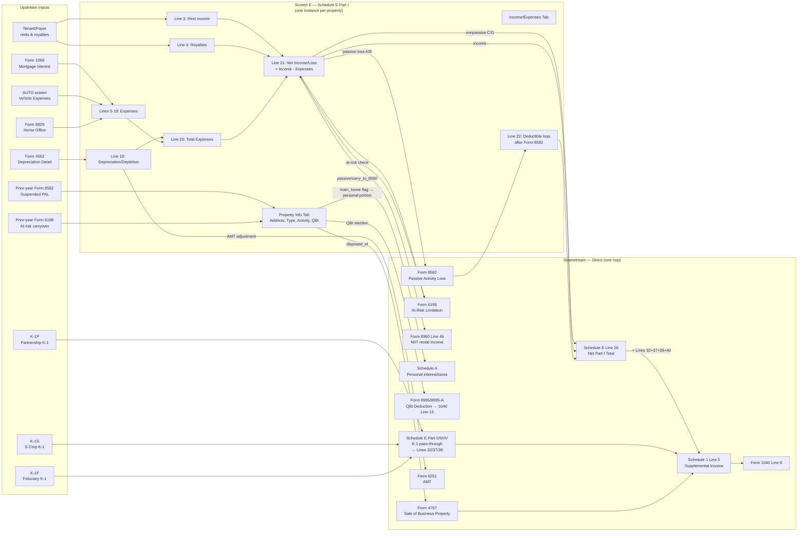

# Schedule E — Supplemental Income and Loss (Form 1040)

## Overview

Schedule E (Form 1040) reports supplemental income and loss from:
- **Part I** (Lines 1a–26): Rental real estate and royalties — up to 3 properties per page; use multiple pages if more than 3
- **Part II** (Lines 27–32): Partnerships and S corporations (from Schedule K-1)
- **Part III** (Lines 33–37): Estates and trusts (from Schedule K-1)
- **Part IV** (Lines 38–39): Real estate mortgage investment conduits (REMICs) — residual holder
- **Part V** (Lines 40–43): Summary — totals from Parts I–IV plus Form 4835 flowing to Schedule 1

**Key output:** Schedule E, Line 26 (Part I net) + Line 32 (Part II net) + Line 37 (Part III net) + Line 39 (Part IV net) + Line 40 (Form 4835) = **Line 41** → flows to **Schedule 1 (Form 1040), Line 5** → **Form 1040, Line 8**.

Passive activity loss rules (Form 8582), at-risk limitations (Form 6198), excess business loss rules (Form 461), and QBI deduction (Form 8995/8995-A) all interact with Schedule E.

In Drake Tax, Part I is entered on screen **E** (three tabs: Property Info, Income/Expenses, Prior Year Compare). Parts II, III, and IV are entered on screens **E2** (Partnerships/S Corps), **E3** (Estates and Trusts), and **E4** (REMICs), respectively.

**IRS Form:** Schedule E (Form 1040) 2025 — OMB No. 1545-0074, Attachment Sequence No. 13, Cat. No. 11344L, Created 5/6/25
**Drake Screen:** E (tabs: Property Info, Income/Expenses, Prior Year Compare); E2; E3; E4
**Tax Year:** 2025
**Drake Reference:** https://www.drakesoftware.com/sharedassets/education/classroomtraining/drakeindepth_schedule_e_handout.pdf

---

## Data Entry Fields

Required fields first, then optional. Data-entry only — no computed/display fields.

### Tab 1: Property Info Tab (Screen E — one screen per property)

| Field | Type | Required | Drake Label | Description | IRS Reference | URL |
| ----- | ---- | -------- | ----------- | ----------- | ------------- | --- |
| tsj | enum(T,S,J) | yes | "TSJ" | Taxpayer (T), Spouse (S), or Joint (J). Determines whose income/loss this is for the return. | Schedule E instructions, General Information | https://www.irs.gov/pub/irs-pdf/i1040se.pdf |
| property_description | string | yes | "Property description for reporting" | Free-text description printed on Schedule E. Street address and city for domestic. City, province/country for foreign. | Schedule E, Line 1a | https://www.irs.gov/pub/irs-pdf/f1040se.pdf |
| form_1099_payments_made | boolean | yes (first screen only) | "A: Did taxpayer make any payments in 2025 that would require filing Forms 1099?" | Answer Yes/No. If $600+ paid for services to nonemployees, Form 1099-NEC required. If $600+ rents paid, Form 1099-MISC required. Answered ONLY on the first Schedule E screen. | Schedule E, Line A; IRC §6041; 2025 General Instructions for Certain Information Returns | https://www.irs.gov/pub/irs-pdf/i1040se.pdf |
| form_1099_filed | boolean | conditional | "B: If 'Yes,' did or will taxpayer file all required Forms 1099?" | Required only when form_1099_payments_made = Yes. | Schedule E, Line B | https://www.irs.gov/pub/irs-pdf/i1040se.pdf |
| street_address | string | yes (US) | "Street address" | Physical street address of rental property | Schedule E, Line 1a | https://www.irs.gov/pub/irs-pdf/f1040se.pdf |
| city | string | yes | "City" | City of rental property | Schedule E, Line 1a | https://www.irs.gov/pub/irs-pdf/f1040se.pdf |
| state | string | yes (US) | "State" | Two-letter state abbreviation (U.S. property only) | Schedule E, Line 1a | https://www.irs.gov/pub/irs-pdf/f1040se.pdf |
| zip | string | yes (US) | "ZIP" | ZIP code (U.S. property only) | Schedule E, Line 1a | https://www.irs.gov/pub/irs-pdf/f1040se.pdf |
| foreign_country | string | conditional | "Province/State, Country, Postal Code" | For foreign property only — city, province/state, country, postal code | Schedule E, Line 1a instructions | https://www.irs.gov/pub/irs-pdf/i1040se.pdf |
| property_type | enum(1–8) | yes | "Type of Property" (Line 1b) | Code 1=Single Family Residence; 2=Multi-Family Residence; 3=Vacation/Short-Term Rental; 4=Commercial; 5=Land; 6=Royalties; 7=Self-Rental; 8=Other (describe). For royalty property, enter code 6 and leave Lines 1a and 2 blank. | Schedule E, Line 1b; i1040se.pdf p.5 | https://www.irs.gov/pub/irs-pdf/i1040se.pdf |
| property_type_other_desc | string | conditional | "Other — Describe" | Required when property_type = 8. Attach statement describing the property. | Schedule E, Line 1b; i1040se.pdf p.5 | https://www.irs.gov/pub/irs-pdf/i1040se.pdf |
| qualified_joint_venture | boolean | no | "QJV" checkbox (Line 2) | Check if MFJ spouses both materially participate and elect QJV treatment. Both must materially participate; not an LLC; must file MFJ return. | Schedule E, Line 2 (QJV column); IRC §761(f); i1040se.pdf p.2 | https://www.irs.gov/pub/irs-pdf/i1040se.pdf |
| activity_type | enum(A,B,C,D) | yes | "Treat this ENTIRE activity as:" | A=Active rental real estate (default, eligible for $25K special allowance); B=Other passive activity; C=Real estate professional (nonpassive — requires >50% services in real property trades AND >750 hours); D=Nonpassive. | IRC §469; IRC §469(c)(7); i1040se.pdf p.3; i8582.pdf p.4 | https://www.irs.gov/pub/irs-pdf/i1040se.pdf |
| some_investment_not_at_risk | boolean | no | "Some investment is NOT at risk" | Check to trigger Form 6198 computation. Required when taxpayer has borrowed funds not personally at risk (nonrecourse debt other than qualified nonrecourse financing on real property). | Schedule E, Line 21 (reference); IRC §465; i1040se.pdf p.7 | https://www.irs.gov/pub/irs-pdf/i1040se.pdf |
| operating_expenses_carryover | number | no | "Operating expenses carryover" | Prior-year operating expenses disallowed under IRC §280A vacation home rules carried forward. | IRC §280A; IRS Pub. 527 | https://www.irs.gov/pub/irs-pdf/p527.pdf |
| ownership_percent | number (0–100) | no | "Ownership percent" | Taxpayer's ownership percentage. Used to prorate income and expense when property is co-owned. If blank, 100% assumed. | Schedule E instructions, Part I | https://www.irs.gov/pub/irs-pdf/i1040se.pdf |
| tax_court_method | boolean | no | "To use the Tax Court method to allocate interest and taxes" | Election to allocate interest and taxes by rental days / total days used rather than the IRS method. Produces larger rental deduction for interest and taxes but smaller for other expenses. | IRC §280A; Bolton v. Commissioner, 694 F.2d 556 (9th Cir. 1982) | https://www.irs.gov/pub/irs-pdf/i1040se.pdf |
| days_owned_in_year | integer | conditional | "number of days owned if not 365" | Required when tax_court_method = true and property not owned full year. Used to compute tax court method fraction. | IRC §280A | https://www.irs.gov/pub/irs-pdf/i1040se.pdf |
| placed_in_service | boolean | no | "Property placed in service during [year]" | Indicates first year of rental. Affects depreciation start date. | Schedule E instructions | https://www.irs.gov/pub/irs-pdf/i1040se.pdf |
| disposed_of | boolean | no | "Property was disposed of in [year]" | When checked, Drake automatically computes overall gain/loss and flows it to Schedule 1, Line 5 via Form 4797 or Schedule D. | Schedule E instructions; IRC §1231; kb.drakesoftware.com/kb/Drake-Tax/14249.htm | https://www.irs.gov/pub/irs-pdf/i1040se.pdf |
| carry_to_8960 | boolean | no | "Carry to 8960 line 4b" | Routes rental income to Form 8960 Line 4b for NIIT. Generally required for passive rental income. | IRC §1411; Form 8960 instructions TY2025 | https://www.irs.gov/pub/irs-pdf/i8960.pdf |
| main_home_or_second_home | boolean | no | "This is taxpayer's main home or second home" | Triggers IRC §280A mixed-use rules. Personal portion of mortgage interest and taxes automatically flows to Schedule A. Required for accurate duplex/multi-unit splitting. | IRC §280A; i1040se.pdf p.5 | https://www.irs.gov/pub/irs-pdf/i1040se.pdf |
| prior_unallowed_passive_operating | number | no | "Prior unallowed passive operating" (Regular Tax Total) | Prior-year suspended passive operating loss from Form 8582, Part VII col (c). Enter positive amount. Three columns: Regular Tax Total | Regular Tax Pre-2018 | AMT | IRC §469(b); Form 8582; i8582.pdf p.10 | https://www.irs.gov/pub/irs-pdf/i8582.pdf |
| prior_unallowed_passive_4797_part1 | number | no | "Prior unallowed passive 4797 Part I" | Prior-year suspended §1245/§1250 recapture loss from Form 4797 Part I that was passive | IRC §469(b) | https://www.irs.gov/pub/irs-pdf/i8582.pdf |
| prior_unallowed_passive_4797_part2 | number | no | "Prior unallowed passive 4797 Part II" | Prior-year suspended §1231 loss from Form 4797 Part II that was passive | IRC §469(b) | https://www.irs.gov/pub/irs-pdf/i8582.pdf |
| prior_unallowed_at_risk | number | no | "Prior unallowed at-risk losses" | Losses suspended by at-risk rules (Form 6198) in prior year | IRC §465; Form 6198 | https://www.irs.gov/pub/irs-pdf/i1040se.pdf |
| disallowed_mortgage_interest_8990 | number | no | "Disallowed mortgage interest from [year] 8990" | Business interest expense disallowed by Form 8990 in prior year; carried forward | IRC §163(j); Form 8990 | https://www.irs.gov/pub/irs-pdf/i1040se.pdf |
| disallowed_other_interest_8990 | number | no | "Disallowed other interest from [year] 8990" | Other business interest disallowed by Form 8990 in prior year; carried forward | IRC §163(j); Form 8990 | https://www.irs.gov/pub/irs-pdf/i1040se.pdf |
| qbi_trade_or_business | enum(Y,N) | no | "This activity is a trade or business" | Y or N. Determines if activity qualifies for §199A QBI deduction. Must be a §162 trade or business, or meet Rev. Proc. 2019-38 safe harbor. | IRC §199A; Treas. Reg. §1.199A-1(b)(14); Rev. Proc. 2019-38 | https://www.irs.gov/pub/irs-drop/rp-19-38.pdf |
| qbi_specified_service | boolean | no | "Rented to a 'specified service business'" | If the rental is to a commonly-controlled SSTB, the rental is automatically an SSTB for §199A purposes. | IRC §199A(d); Treas. Reg. §1.199A-5(c)(2); Rev. Proc. 2019-38 §3.05(D) | https://www.irs.gov/pub/irs-drop/rp-19-38.pdf |
| qbi_aggregation_number | integer | no | "Business aggregation number (BAN)" | Integer 1–99. Groups multiple qualifying rental activities into one QBI aggregation. Activities with same BAN are treated as a single trade or business for §199A. Must be disclosed on return. | Treas. Reg. §1.199A-4 | https://www.irs.gov/pub/irs-pdf/i1040se.pdf |
| qbi_w2_wages | number | no | "W-2 wages paid" | W-2 wages attributable to the rental activity. Used in the W-2 wage limitation for QBI deduction. Enter $0 if no employees. | IRC §199A(b)(2)(B)(i) | https://www.irs.gov/pub/irs-pdf/i1040se.pdf |
| qbi_unadjusted_basis | number | no | "Unadjusted basis of all qualified property immediately after acquisition" | UBIA of qualified property (depreciable tangible property held at year-end and used in the activity). Used in 2.5% of UBIA alternative W-2 wage limitation. | IRC §199A(b)(2)(B)(ii); Treas. Reg. §1.199A-2(c) | https://www.irs.gov/pub/irs-pdf/i1040se.pdf |
| qbi_override | number | no | "Override calculated qualified business income (or loss)" | Manual override of Drake-computed QBI. Use with caution — overrides all automatic computation. | IRC §199A | https://www.irs.gov/pub/irs-pdf/i1040se.pdf |
| qbi_safe_harbor | enum(A,B,C) | no | "Meets Section 199A rental 'safe harbor'" | A=Separate rental enterprise (each property separate); B=Residential rental enterprise grouping (all residential combined); C=Commercial rental enterprise grouping (all commercial combined). Selection must be consistent year-to-year. Cannot be triple-net-lease property. Cannot be property used as residence under §280A(d). | Rev. Proc. 2019-38 §§3.02–3.05; i1040se.pdf p.1 | https://www.irs.gov/pub/irs-drop/rp-19-38.pdf |
| section_179 | number | no | "Section 179" | §179 deduction for assets in the activity. ONLY allowed for Activity Type C (real estate professional). Not available for passive rental activities. TY2025 max: $2,500,000 (phases out above $4,000,000 of §179 property placed in service). | IRC §179; i1040se.pdf p.1 ("What's New") | https://www.irs.gov/pub/irs-pdf/i1040se.pdf |
| section_1231_gain_loss | number | no | "Section 1231 Gain/Loss" | Manual override for §1231 gain/loss on disposition (positive = gain). Use when auto-calculated amount needs correction. | IRC §1231 | https://www.irs.gov/pub/irs-pdf/i1040se.pdf |
| elect_out_biie | boolean | no | "Electing out of Business Interest Expense Limit" | Election to opt out of IRC §163(j) for qualifying real property business. Must be elected on ELEC screen with statement on SCH screen. Once elected, must use ADS depreciation for non-residential real property, residential rental, and QIP. | IRC §163(j)(7)(B); Form 8990 instructions | https://www.irs.gov/pub/irs-pdf/i1040se.pdf |

### Tab 2: Income/Expenses Tab (Screen E)

| Field | Type | Required | Drake Label | Description | IRS Reference | URL |
| ----- | ---- | -------- | ----------- | ----------- | ------------- | --- |
| fair_rental_days | integer (0–365) | yes | "Fair rental days" (Line 2) | Number of days rented at fair market rent during the year. If a day was personal use, do NOT count it as a fair rental day. Determines whether vacation home rules apply. | Schedule E, Line 2; IRC §280A(d); i1040se.pdf p.5 | https://www.irs.gov/pub/irs-pdf/i1040se.pdf |
| personal_use_days | integer (0–365) | yes | "Personal use days" (Line 2) | Days used personally (by taxpayer, family, or below-FMR users). If > 14 days OR > 10% of fair_rental_days: vacation home rules apply (§280A). If fair_rental_days < 15: exclude all rental income, no rental deductions. | Schedule E, Line 2; IRC §280A(d)(1); i1040se.pdf p.5 | https://www.irs.gov/pub/irs-pdf/i1040se.pdf |
| rent_income | number | yes | "Rent income" (Line 3) | Gross rents received or accrued during 2025. Include services/property received as rent at fair market value. Report in column A, B, or C for each property. | Schedule E, Line 3; IRC §61(a)(5); i1040se.pdf p.5 | https://www.irs.gov/pub/irs-pdf/i1040se.pdf |
| royalties_income | number | no | "Royalties from oil, gas, mineral, copyright, or patent" (Line 4) | Gross royalties received. Report even if state/local taxes withheld. Include NIL income if not self-employment. Do NOT include working interest in oil/gas (use Schedule C). | Schedule E, Line 4; IRC §61(a)(6); i1040se.pdf p.6 | https://www.irs.gov/pub/irs-pdf/i1040se.pdf |
| occupancy_percent | number (0–100) | conditional | "Taxpayer or spouse occupancy percentage" | Required for multi-occupancy units (e.g., duplex). Percentage of unit occupied by taxpayer/spouse. Used to split expenses: col 1 (rental unit) applied 100%; col 2 (entire property) multiplied by (1 - occupancy_percent/100) for rental portion. | IRC §280A; Drake In-Depth Schedule E handout p.27 | https://www.drakesoftware.com/sharedassets/education/classroomtraining/drakeindepth_schedule_e_handout.pdf |
| expense_advertising | number | no | "Advertising" (Line 5) | Advertising expenses for rental property. | Schedule E, Line 5 | https://www.irs.gov/pub/irs-pdf/f1040se.pdf |
| expense_auto_travel | number | no | "Auto and travel" (Line 6) | Auto and travel expenses for rental activities. Can enter actual expenses or standard mileage. If standard mileage: 70 cents/mile × business miles. Must complete Form 4562, Part V if claiming auto expenses (actual or mileage). Cannot deduct vehicle loan interest claimed on Schedule 1-A. 50% of meals deductible. | Schedule E, Line 6; i1040se.pdf p.6 | https://www.irs.gov/pub/irs-pdf/i1040se.pdf |
| expense_cleaning | number | no | "Cleaning and maintenance" (Line 7) | Cleaning and routine maintenance costs. | Schedule E, Line 7 | https://www.irs.gov/pub/irs-pdf/f1040se.pdf |
| expense_commissions | number | no | "Commissions" (Line 8) | Commissions paid to rental agents or property managers. | Schedule E, Line 8 | https://www.irs.gov/pub/irs-pdf/f1040se.pdf |
| expense_insurance | number | no | "Insurance" (Line 9) | Insurance premiums for rental property (fire, liability, flood, etc.). | Schedule E, Line 9 | https://www.irs.gov/pub/irs-pdf/f1040se.pdf |
| expense_legal_professional | number | no | "Legal and other professional fees" (Line 10) | Tax preparation fees, attorney fees related to rental activities. Do NOT include fees to defend title, recover property, or develop/improve property (capitalize instead). | Schedule E, Line 10; i1040se.pdf p.6 | https://www.irs.gov/pub/irs-pdf/i1040se.pdf |
| expense_management | number | no | "Management fees" (Line 11) | Property management fees paid to third-party managers. | Schedule E, Line 11 | https://www.irs.gov/pub/irs-pdf/f1040se.pdf |
| expense_mortgage_interest | number | no | "Mortgage interest paid to banks, etc." (Line 12) | Mortgage interest paid. Use Form 1098 for bank-paid interest. If rental real estate is a trade or business: subject to §163(j) interest limitation; file Form 8990 if applicable. Do not include prepaid interest. Points deducted over loan life. | Schedule E, Line 12; i1040se.pdf p.6–7 | https://www.irs.gov/pub/irs-pdf/i1040se.pdf |
| expense_other_interest | number | no | "Other interest" (Line 13) | Non-mortgage interest on rental debt. If did not receive Form 1098, report deductible amount here. Must trace interest to rental use. | Schedule E, Line 13; i1040se.pdf p.6–7 | https://www.irs.gov/pub/irs-pdf/i1040se.pdf |
| expense_repairs | number | no | "Repairs" (Line 14) | Cost of repairs that keep property in ordinarily efficient operating condition (not improvements). Examples: fixing a lock, painting a room. Do NOT deduct cost of improvements (capitalize and depreciate). | Schedule E, Line 14; i1040se.pdf p.7 | https://www.irs.gov/pub/irs-pdf/i1040se.pdf |
| expense_supplies | number | no | "Supplies" (Line 15) | Supplies used in rental activity. | Schedule E, Line 15 | https://www.irs.gov/pub/irs-pdf/f1040se.pdf |
| expense_taxes | number | no | "Taxes" (Line 16) | Real estate taxes paid on rental property. Do NOT include income taxes. | Schedule E, Line 16 | https://www.irs.gov/pub/irs-pdf/f1040se.pdf |
| expense_utilities | number | no | "Utilities" (Line 17) | Utility costs paid by landlord (electricity, gas, water, telephone calls for rental activities). The base rate for the first telephone line into a residence is not deductible. | Schedule E, Line 17; i1040se.pdf p.7 | https://www.irs.gov/pub/irs-pdf/i1040se.pdf |
| expense_depreciation | number | no | "Depreciation expense or depletion" (Line 18) | Annual MACRS depreciation from Form 4562 (buildings, improvements, personal property). Land is NOT depreciable. Must attach Form 4562 if: (a) first-year property placed in service in 2025; (b) listed property; (c) §179 election; (d) amortization began in 2025. For 2025: 100% bonus depreciation available for property acquired after Jan 19, 2025. | Schedule E, Line 18; i1040se.pdf p.1, p.7 | https://www.irs.gov/pub/irs-pdf/i1040se.pdf |
| expense_depreciation_amt | number | no | "Depreciation adjustment (AMT)" (Line 18) | Difference between MACRS depreciation and ADS depreciation for AMT purposes. AMT requires ADS (longer recovery periods). This amount flows to Form 6251. | IRC §56(a)(1); Form 6251 | https://www.irs.gov/pub/irs-pdf/i1040se.pdf |
| expense_depletion | number | no | "Depletion" (Line 18) | Oil, gas, mineral depletion. For oil/gas royalties: percentage depletion = 15% of gross income from property (limited to 100% of net income). | Schedule E, Line 18; IRC §611, §613; i1040se.pdf p.7 | https://www.irs.gov/pub/irs-pdf/i1040se.pdf |
| expense_other_lines | array(6) | no | "Other (list)" (Line 19) | Up to 6 rows: each row has `description` (string) and `amount` (number). Enter ordinary and necessary expenses not listed on Lines 5–18 (e.g., HOA fees, pest control, snow removal). A Federal Supporting Statement is auto-generated and e-filed. May include energy efficient commercial building deduction under §179D/Form 7205. | Schedule E, Line 19; i1040se.pdf p.7 | https://www.irs.gov/pub/irs-pdf/i1040se.pdf |

---

## Per-Field Routing

For every field: where the value goes, how it is used, what it triggers, any limits. All line numbers verified against TY2025 Schedule E (Form 1040) 2025 (f1040se.pdf, created 5/6/25) and i1040se.pdf (Nov 12, 2025).

| Field | Destination | How Used | Triggers | Limit / Cap | IRS Reference | URL |
| ----- | ----------- | -------- | -------- | ----------- | ------------- | --- |
| tsj | Internal routing only | Determines which spouse's return receives the income/loss. T = taxpayer's; S = spouse's; J = split per ownership_percent. Not printed on Schedule E itself. | None | None | Schedule E instructions; i1040se.pdf p.2 | https://www.irs.gov/pub/irs-pdf/i1040se.pdf |
| street_address | Schedule E, Line 1a | Printed in property address column (A, B, or C). Max 1 domestic address per column. | None | None | Schedule E, Line 1a | https://www.irs.gov/pub/irs-pdf/f1040se.pdf |
| city | Schedule E, Line 1a | Printed as part of property address | None | None | Schedule E, Line 1a | https://www.irs.gov/pub/irs-pdf/f1040se.pdf |
| state | Schedule E, Line 1a | Printed as part of property address (U.S. only) | None | None | Schedule E, Line 1a | https://www.irs.gov/pub/irs-pdf/f1040se.pdf |
| zip | Schedule E, Line 1a | Printed as part of property address (U.S. only) | None | None | Schedule E, Line 1a | https://www.irs.gov/pub/irs-pdf/f1040se.pdf |
| foreign_country | Schedule E, Line 1a | Printed in place of city/state/ZIP for foreign properties | None | None | Schedule E, Line 1a; i1040se.pdf instructions | https://www.irs.gov/pub/irs-pdf/i1040se.pdf |
| property_type_other_desc | Schedule E, Line 1b + attached statement | When property_type = 8: description printed and attached statement generated | None | None | Schedule E, Line 1b; i1040se.pdf p.5 | https://www.irs.gov/pub/irs-pdf/i1040se.pdf |
| operating_expenses_carryover | Schedule E, Lines 5–17 (added to current-year expenses before §280A ceiling) | Prior-year §280A disallowed operating expenses re-enter the current-year expense pool before the income ceiling is applied again | None | Still subject to §280A ceiling in current year | IRC §280A; i1040se.pdf p.5 | https://www.irs.gov/pub/irs-pdf/i1040se.pdf |
| ownership_percent | Schedule E income and expense lines (internal proration) | When < 100%: all income and expense amounts entered by user are multiplied by ownership_percent/100 before being placed on Schedule E. If blank, 100% assumed. | None | 0%–100% | Schedule E instructions | https://www.irs.gov/pub/irs-pdf/i1040se.pdf |
| tax_court_method | §280A expense allocation fraction | Changes allocation denominator from (FRD + PUD) to total days in year. Affects Lines 12 (mortgage interest) and 16 (taxes) allocation fraction only. | None — election disclosed on return | None | IRC §280A; i1040se.pdf p.5 | https://www.irs.gov/pub/irs-pdf/i1040se.pdf |
| days_owned_in_year | §280A allocation computation | Used only when tax_court_method = true and property not owned full year. Replaces 365 in denominator with actual days owned. | None | 1–365 | IRC §280A | https://www.irs.gov/pub/irs-pdf/i1040se.pdf |
| placed_in_service | Form 4562 (depreciation start date) | Signals that Form 4562 must be completed for this property. Depreciation begins on placed-in-service date (mid-month convention for real property). | Form 4562 required | Depreciation: MACRS residential = 27.5 years; commercial = 39 years | IRC §168; Schedule E instructions | https://www.irs.gov/pub/irs-pdf/i1040se.pdf |
| qbi_trade_or_business | Form 8995 or 8995-A | Y: activity's QBI flows to Form 8995/8995-A for §199A deduction computation → Form 1040, Line 13. N: no QBI deduction for this activity. | Form 8995 or 8995-A | QBI deduction = 20% × QBI (before income-based limitations) | IRC §199A; i8995a.pdf | https://www.irs.gov/pub/irs-pdf/i8995a.pdf |
| qbi_specified_service | Form 8995-A, Schedule A | Flags activity as SSTB. Above income phase-in range ($247,300/$494,600): $0 QBI deduction. Within range: applicable percentage phased in. | Form 8995-A Schedule A required | 0% QBI deduction if taxable income > $247,300 (all other) / $494,600 (MFJ) | IRC §199A(d); i8995a.pdf p.5 | https://www.irs.gov/pub/irs-pdf/i8995a.pdf |
| qbi_aggregation_number | Form 8995-A, Schedule B | Activities with same BAN aggregated as single trade or business for W-2 wage limitation. Must disclose aggregation on return. | Form 8995-A Schedule B required | BAN 1–99 | Treas. Reg. §1.199A-4; i8995a.pdf | https://www.irs.gov/pub/irs-pdf/i8995a.pdf |
| qbi_w2_wages | Form 8995-A, Part II | W-2 wages of the activity. Used to compute W-2 wage limitation: greater of (a) 50% × W-2 wages or (b) 25% × W-2 wages + 2.5% × UBIA. | Form 8995-A | W-2 wage limitation applies if taxable income > $197,300 (all other) / $394,600 (MFJ) | IRC §199A(b)(2)(B)(i); i8995a.pdf | https://www.irs.gov/pub/irs-pdf/i8995a.pdf |
| qbi_unadjusted_basis | Form 8995-A, Part II | UBIA of qualified property in the activity. Used in alternative W-2 wage limitation: 25% × W-2 wages + 2.5% × UBIA. | Form 8995-A | Applies only when taxable income > threshold | IRC §199A(b)(2)(B)(ii); i8995a.pdf | https://www.irs.gov/pub/irs-pdf/i8995a.pdf |
| qbi_override | Form 8995/8995-A (replaces computed QBI) | Overrides Drake-calculated QBI for this activity with manually entered amount. Use only when auto-computation is incorrect. | Form 8995 or 8995-A | Overrides all automatic QBI computation | IRC §199A | https://www.irs.gov/pub/irs-pdf/i8995a.pdf |
| section_179 | Form 4562, Part I | §179 deduction for assets in the activity. Activity Type C (real estate professional) only. NOT available for passive rental (Types A/B). Maximum TY2025: $2,500,000, phases out dollar-for-dollar above $4,000,000 of §179 property placed in service. | Form 4562; Activity Type must be C | Max $2,500,000 (TY2025); 0 if Activity Type A/B | IRC §179; i1040se.pdf p.1 | https://www.irs.gov/pub/irs-pdf/i1040se.pdf |
| section_1231_gain_loss | Form 4797, Part I (if gain) or Schedule E, Line 22 (if loss) | Override for §1231 result on disposition. Positive = §1231 gain → Form 4797 Part I. Negative = §1231 loss → Schedule E, Line 22. | Form 4797 (gain) or Schedule E Line 22 (loss) | None | IRC §1231 | https://www.irs.gov/pub/irs-pdf/i1040se.pdf |
| elect_out_biie | ELEC screen + SCH screen (statement attached to return) | Election under IRC §163(j)(7)(B). Exempts rental real property trade or business from §163(j). Consequence: must use ADS depreciation for non-residential real property (39→40 yr), residential rental (27.5→30 yr), and QIP (15→20 yr). | ADS depreciation required; Form 4562 affected; Form 8990 not filed | Once elected, irrevocable | IRC §163(j)(7)(B); i8990.pdf (Rev. 12-2025) | https://www.irs.gov/pub/irs-pdf/i8990.pdf |
| occupancy_percent | Schedule E expense lines (internal proration) | For column 2 expenses ("entire property"): rental portion = expense × (1 − occupancy_percent/100). Personal portion may flow to Schedule A if main_home_or_second_home = true. | Schedule A (if main_home flag) | 0%–100% | IRC §280A; Drake In-Depth p.27 | https://www.irs.gov/pub/irs-pdf/i1040se.pdf |
| prior_unallowed_passive_4797_part1 | Form 8582, Part IV col (c) or Part V col (c) | Prior-year suspended §1231/§1250 loss from Form 4797 Part I that was passive. Added to current-year loss column in PAL computation. | Form 8582 | Remaining suspension carries forward again via Form 8582 Part VII | IRC §469(b); i8582.pdf | https://www.irs.gov/pub/irs-pdf/i8582.pdf |
| prior_unallowed_passive_4797_part2 | Form 8582, Part IV col (c) or Part V col (c) | Prior-year suspended §1231 loss from Form 4797 Part II that was passive. Added to current-year loss column in PAL computation. | Form 8582 | Remaining suspension carries forward again via Form 8582 Part VII | IRC §469(b); i8582.pdf | https://www.irs.gov/pub/irs-pdf/i8582.pdf |
| prior_unallowed_at_risk | Form 6198 (current year at-risk computation) | Prior-year at-risk suspended loss. Added to current-year at-risk computation to determine how much can be deducted this year. | Form 6198 | Limited to amount at risk in current year | IRC §465; Form 6198 | https://www.irs.gov/pub/irs-pdf/i1040se.pdf |
| disallowed_mortgage_interest_8990 | Form 8990 (current-year business interest carryforward) | Prior-year §163(j) disallowed mortgage interest carried forward. Enters Form 8990 as business interest expense carryforward; deductible to extent of current-year ATI limit. | Form 8990 | Subject to current-year §163(j) limit | IRC §163(j); i8990.pdf | https://www.irs.gov/pub/irs-pdf/i8990.pdf |
| disallowed_other_interest_8990 | Form 8990 (current-year business interest carryforward) | Prior-year §163(j) disallowed non-mortgage business interest carried forward. Same treatment as disallowed_mortgage_interest_8990. | Form 8990 | Subject to current-year §163(j) limit | IRC §163(j); i8990.pdf | https://www.irs.gov/pub/irs-pdf/i8990.pdf |
| form_1099_payments_made | Schedule E, Line A (checkbox) | Reported on first Schedule E only. Yes/No checkbox on form. | None (compliance check only) | None | Schedule E, Line A; IRC §6041 | https://www.irs.gov/pub/irs-pdf/f1040se.pdf |
| form_1099_filed | Schedule E, Line B (checkbox) | Reported on first Schedule E only. Yes/No checkbox. | None | None | Schedule E, Line B | https://www.irs.gov/pub/irs-pdf/f1040se.pdf |
| property_description | Schedule E, Line 1a | Printed as address for each property (col A, B, or C per page) | None | None | Schedule E, Line 1a | https://www.irs.gov/pub/irs-pdf/f1040se.pdf |
| property_type | Schedule E, Line 1b | Entered as numeric code in the Type of Property column | Self-rental (7) triggers recharacterization rules | None | Schedule E, Line 1b | https://www.irs.gov/pub/irs-pdf/f1040se.pdf |
| qualified_joint_venture | Schedule E, Line 2 (QJV checkbox) | Each spouse reports their share on separate Schedule E; treated as separate properties | Prevents Form 1065 filing; each spouse reports on Line 1 of Schedule E | None | Schedule E, Line 2; IRC §761(f) | https://www.irs.gov/pub/irs-pdf/i1040se.pdf |
| activity_type = A | Form 8582, Part IV | Active rental — eligible for $25K special allowance against non-passive income | Form 8582 required if loss; active participation required | $25,000 special allowance; phases out $100K–$150K MAGI | IRC §469(i); i8582.pdf p.4 | https://www.irs.gov/pub/irs-pdf/i8582.pdf |
| activity_type = B | Form 8582, Part V | Other passive — no special allowance; loss only deductible against passive income | Form 8582 required if loss | Loss deductible only against passive income | IRC §469; i8582.pdf p.10 | https://www.irs.gov/pub/irs-pdf/i8582.pdf |
| activity_type = C | Schedule E directly (nonpassive column) | Real estate professional — not passive; deductible against all income; §179 allowed | Form 8582 not required; Schedule E Line 26 directly | Must meet: >50% of personal services in real property trades + >750 hours | IRC §469(c)(7); i1040se.pdf p.3 | https://www.irs.gov/pub/irs-pdf/i1040se.pdf |
| activity_type = D | Schedule E directly (nonpassive column) | Nonpassive — deductible against all income | None | None | IRC §469 | https://www.irs.gov/pub/irs-pdf/i1040se.pdf |
| fair_rental_days | Schedule E, Line 2 | Reported per column (A, B, C). If personal_use_days > 14 or > 10% of fair_rental_days: §280A vacation home limits apply. If fair_rental_days < 15: exclude all income AND no deductions. | IRC §280A vacation home rules | See §280A calculation rules | IRC §280A(d); i1040se.pdf p.5 | https://www.irs.gov/pub/irs-pdf/i1040se.pdf |
| personal_use_days | Schedule E, Line 2 | Reported per column. Triggers §280A if > 14 days OR > 10% of rental days | §280A expense allocation required | Expenses limited to gross rental income if threshold met | IRC §280A(d)(1); i1040se.pdf p.5 | https://www.irs.gov/pub/irs-pdf/i1040se.pdf |
| rent_income | Schedule E, Line 3 (per property column) | Summed: Line 23a = total of all Line 3 amounts across all properties. Net flows into Line 21 (income minus expenses). | Form 8960 Line 4a (if passive or carry_to_8960) | None | Schedule E, Lines 3 and 23a | https://www.irs.gov/pub/irs-pdf/f1040se.pdf |
| royalties_income | Schedule E, Line 4 (per property column) | Summed: Line 23b = total of all Line 4 amounts across all royalty properties. | Passive activity rules if royalty activity is passive | None | Schedule E, Lines 4 and 23b | https://www.irs.gov/pub/irs-pdf/f1040se.pdf |
| expense_advertising | Schedule E, Line 5 | Deducted from rental income per property. Subject to §280A proration if vacation home. | None | §280A limits if personal use days exceeded | Schedule E, Line 5; i1040se.pdf p.6 | https://www.irs.gov/pub/irs-pdf/i1040se.pdf |
| expense_auto_travel | Schedule E, Line 6 | Enters rental column. Drake AUTO screen calculates actual vs. mileage automatically, then flows here. | Form 4562, Part V required if claiming auto deduction | Standard mileage: 70¢/mile for 2025; cannot use standard mileage if >4 vehicles simultaneously | Schedule E, Line 6; i1040se.pdf p.6 | https://www.irs.gov/pub/irs-pdf/i1040se.pdf |
| expense_cleaning | Schedule E, Line 7 | Deducted from rental income per property | None | §280A limits | Schedule E, Line 7 | https://www.irs.gov/pub/irs-pdf/f1040se.pdf |
| expense_commissions | Schedule E, Line 8 | Deducted from rental income per property | None | §280A limits | Schedule E, Line 8 | https://www.irs.gov/pub/irs-pdf/f1040se.pdf |
| expense_insurance | Schedule E, Line 9 | Deducted from rental income per property | None | §280A limits | Schedule E, Line 9 | https://www.irs.gov/pub/irs-pdf/f1040se.pdf |
| expense_legal_professional | Schedule E, Line 10 | Deducted from rental income per property; fees for title defense must be capitalized | None | §280A limits | Schedule E, Line 10; i1040se.pdf p.6 | https://www.irs.gov/pub/irs-pdf/i1040se.pdf |
| expense_management | Schedule E, Line 11 | Deducted from rental income per property | None | None | Schedule E, Line 11 | https://www.irs.gov/pub/irs-pdf/f1040se.pdf |
| expense_mortgage_interest | Schedule E, Lines 12 and 23c | Flows to Line 12 per property; totaled to Line 23c. If rental is a trade or business: §163(j) may limit deduction; file Form 8990 first. If main_home_or_second_home: personal portion splits to Schedule A. | Form 8990 if trade or business; Schedule A if mixed-use | §163(j) interest limitation if trade or business; prepaid interest not deductible | Schedule E, Lines 12 and 23c; i1040se.pdf p.6–7 | https://www.irs.gov/pub/irs-pdf/i1040se.pdf |
| expense_other_interest | Schedule E, Line 13 | Deducted from rental income per property | None | §280A limits; specific tracing rules for allocating interest | Schedule E, Line 13 | https://www.irs.gov/pub/irs-pdf/f1040se.pdf |
| expense_repairs | Schedule E, Line 14 | Deducted from rental income per property. Capital improvements must be capitalized to Form 4562. | Form 4562 for improvements | Repairs: current deduction. Improvements: capitalize + depreciate. | Schedule E, Line 14; i1040se.pdf p.7 | https://www.irs.gov/pub/irs-pdf/i1040se.pdf |
| expense_supplies | Schedule E, Line 15 | Deducted from rental income per property | None | §280A limits | Schedule E, Line 15 | https://www.irs.gov/pub/irs-pdf/f1040se.pdf |
| expense_taxes | Schedule E, Line 16 | Deducted from rental income per property; real estate taxes only | None | §280A limits | Schedule E, Line 16 | https://www.irs.gov/pub/irs-pdf/f1040se.pdf |
| expense_utilities | Schedule E, Line 17 | Deducted from rental income per property | None | First telephone line base rate not deductible | Schedule E, Line 17; i1040se.pdf p.7 | https://www.irs.gov/pub/irs-pdf/i1040se.pdf |
| expense_depreciation | Schedule E, Lines 18 and 23d | Flows to Line 18 per property; totaled to Line 23d. From Form 4562. | Form 4562 required if new property in 2025, listed property, §179, or amortization | MACRS rules; 100% bonus depreciation for property acquired after Jan 19, 2025 | Schedule E, Lines 18 and 23d; i1040se.pdf p.7 | https://www.irs.gov/pub/irs-pdf/i1040se.pdf |
| expense_depreciation_amt | Form 6251, Line 2l | AMT depreciation adjustment flows to Form 6251 | Form 6251 (AMT) | None | IRC §56(a)(1); Form 6251 | https://www.irs.gov/pub/irs-pdf/i1040se.pdf |
| expense_depletion | Schedule E, Line 18 | Royalty depletion deducted on Line 18. Percentage depletion = 15% × gross income from property (oil/gas). | None | Cannot exceed 100% of net income from the property | IRC §613; Schedule E, Line 18 | https://www.irs.gov/pub/irs-pdf/i1040se.pdf |
| expense_other_lines | Schedule E, Line 19 (per property); Line 23e includes in total expenses | Each description and amount entered; Federal Supporting Statement auto-generated and e-filed | None | §280A limits; must be ordinary and necessary | Schedule E, Lines 19 and 23e; i1040se.pdf p.7 | https://www.irs.gov/pub/irs-pdf/i1040se.pdf |
| prior_unallowed_passive_operating | Form 8582, Part IV col (c) (active) or Part V col (c) (other passive) | Added to current-year loss in PAL computation; allowed to extent of passive income or $25K special allowance | Form 8582 | Remaining suspension → Schedule E carryforward next year via Form 8582 Part VII | IRC §469(b); i8582.pdf p.9–10 | https://www.irs.gov/pub/irs-pdf/i8582.pdf |
| disposed_of = true | Schedule E, Line 22 (loss after Form 8582); Form 4797; Schedule D | If overall gain: Form 4797 Part I (§1231), unrecaptured §1250 gain at max 25%. If overall loss: all prior suspended PAL losses released. Net flows through Schedule 1, Line 5. | Form 4797; Schedule D; Form 8582 (releases all PAL on full disposal) | Unrecaptured §1250 gain taxed at max 25% rate | IRC §1231; §1250; i8582.pdf p.9 | https://www.irs.gov/pub/irs-pdf/i8582.pdf |
| carry_to_8960 = true | Form 8960, Line 4b | Net rental income from this property routes to NIIT computation. NIIT = 3.8% × lesser of NII or excess MAGI over threshold. | Form 8960 | NIIT rate: 3.8%. Thresholds: $250,000 MFJ/QSS; $125,000 MFS; $200,000 Single/HOH | IRC §1411; i8960.pdf p.2 | https://www.irs.gov/pub/irs-pdf/i8960.pdf |
| main_home_or_second_home = true | Schedule A (personal interest/taxes) | Personal portion of mortgage interest and real estate taxes auto-computed based on occupancy_percent and flows to Schedule A | Schedule A | §280A requires pro-rata allocation | IRC §280A; Drake In-Depth p.27 | https://www.drakesoftware.com/sharedassets/education/classroomtraining/drakeindepth_schedule_e_handout.pdf |
| qbi_safe_harbor = A/B/C | Form 8995 or 8995-A | QBI deduction for qualifying rental: 20% × QBI, subject to W-2 wage / UBIA limitations if taxable income (before QBI deduction) exceeds $394,600 (MFJ) or $197,300 (all other). Use Form 8995 if below threshold and no SSTB/REIT/PTP; otherwise Form 8995-A. | Form 8995 or 8995-A → Form 1040, Line 13 | 20% of QBI; W-2 wage limitation (50% of W-2 wages OR 25% of W-2 wages + 2.5% UBIA) applies above income threshold; full limitation above $494,600 (MFJ) / $247,300 (others) | IRC §199A; Rev. Proc. 2019-38; i8995a.pdf pp.1, 5 (Jan 26, 2026) | https://www.irs.gov/pub/irs-pdf/i8995a.pdf |
| some_investment_not_at_risk = true | Form 6198 | At-risk limitation computed on Form 6198; loss limited to at-risk amount; enters Schedule E, Line 21 | Form 6198; Schedule E, Line 21 | Loss limited to amount at risk | IRC §465; i1040se.pdf p.7 | https://www.irs.gov/pub/irs-pdf/i1040se.pdf |

---

## Calculation Logic

### Step 1 — Vacation Home Check (Per Property, IRC §280A)

For each property, compare `personal_use_days` (PUD) and `fair_rental_days` (FRD):

**Rule 1 — Rented fewer than 15 days:**
- If FRD < 15: ALL rental income is EXCLUDED from income (not reported on Schedule E). NO rental expenses are deductible.
- Source: IRC §280A(g); i1040se.pdf p.5

**Rule 2 — Vacation home (personal use exceeds threshold):**
- If PUD > 14 days OR PUD > (FRD × 10%): vacation home rules apply.
- Expenses deductible only up to gross rental income (no rental loss).
- Expense deduction ORDER:
  1. First: allocable interest and taxes (deductible under §163 and §164 regardless)
  2. Second: other operating expenses (advertising, cleaning, insurance, etc.)
  3. Third: depreciation (deducted last; reduces basis but cannot create loss)
- Allocation fraction for each expense = FRD / (FRD + PUD) [IRS method] OR FRD / total days in year [Tax Court method if elected]
- Excess operating expenses → `operating_expenses_carryover` for next year
- Source: IRC §280A(c)(5), §280A(d)(1); IRS Pub. 527; i1040se.pdf p.5

**Rule 3 — Pure rental (no vacation home):**
- If vacation home rules do NOT apply: all ordinary and necessary rental expenses are deductible (subject to passive activity and at-risk rules). Loss is allowed subject to PAL rules.
- Source: IRC §280A; i1040se.pdf p.5

### Step 2 — Multi-Occupancy Expense Allocation (IRC §280A)

For duplex/multi-unit where taxpayer occupies portion (`occupancy_percent` > 0):
1. Column 1 expenses ("attributable to rental unit"): applied 100% to rental Schedule E
2. Column 2 expenses ("attributable to entire property"):
   - Rental portion = Amount × (1 − occupancy_percent / 100)
   - Personal portion = Amount × (occupancy_percent / 100)
3. If `main_home_or_second_home` = true AND `occupancy_percent` entered:
   - Personal portion of mortgage interest → Schedule A (itemized deductions)
   - Personal portion of real estate taxes → Schedule A
4. If Tax Court method elected: mortgage interest and taxes allocated by FRD / (FRD + PUD) instead

> **Source:** IRC §280A; Drake In-Depth Schedule E handout p.27; https://www.drakesoftware.com/sharedassets/education/classroomtraining/drakeindepth_schedule_e_handout.pdf

### Step 3 — Compute Net Income/(Loss) Per Property (Schedule E, Part I)

For each property column (A, B, or C):
1. Total income (Line 3 + Line 4 for that column): `rent_income` + `royalties_income`
2. Total expenses (Line 20 = sum Lines 5–19): `expense_advertising` + `expense_auto_travel` + `expense_cleaning` + `expense_commissions` + `expense_insurance` + `expense_legal_professional` + `expense_management` + `expense_mortgage_interest` + `expense_other_interest` + `expense_repairs` + `expense_supplies` + `expense_taxes` + `expense_utilities` + `expense_depreciation` + `expense_depletion` + sum(expense_other_lines)
3. Line 21 = Total income − Total expenses
   - If result is income (positive): enter on Line 21
   - If result is loss (negative): check whether at-risk rules apply (Form 6198); enter after at-risk limitation on Line 21

> **Source:** Schedule E (Form 1040) 2025, f1040se.pdf Lines 3–21; https://www.irs.gov/pub/irs-pdf/f1040se.pdf

### Step 4 — Schedule E Lines 23a–23e (Totals Across All Properties)

These totals are entered only once on one Schedule E page (even if multiple pages used):
- Line 23a = Total of all Line 3 amounts (all rental income across all properties)
- Line 23b = Total of all Line 4 amounts (all royalty income)
- Line 23c = Total of all Line 12 amounts (all mortgage interest)
- Line 23d = Total of all Line 18 amounts (all depreciation/depletion)
- Line 23e = Total of all Line 20 amounts (all total expenses)

> **Source:** Schedule E instructions; i1040se.pdf p.5; f1040se.pdf Lines 23a-e; https://www.irs.gov/pub/irs-pdf/f1040se.pdf

### Step 5 — At-Risk Limitation (Form 6198)

If `some_investment_not_at_risk` = true:
1. Compute amount at risk on Form 6198 (cash invested + adjusted basis of property + qualified nonrecourse financing on real property − amounts protected against loss)
2. Loss limited to at-risk amount
3. Loss after at-risk limitation entered on Schedule E, Line 21
4. Enter "Form 6198" to the left of Line 21 on Schedule E
5. Amounts not at risk for:
   - Nonrecourse loans not secured by real property
   - Cash protected by stop-loss agreements or guarantees
   - Amounts borrowed from persons with interest in the activity

> **Source:** IRC §465; i1040se.pdf p.7 (Line 21 instructions); i8582.pdf p.2; https://www.irs.gov/pub/irs-pdf/i1040se.pdf

### Step 6 — Passive Activity Loss Limitation (Form 8582)

**Active rental real estate (Activity Type A) — Part IV of Form 8582:**

Exception — skip Form 8582 if ALL of these apply:
- Active participation in all rental real estate activities
- No prior-year unallowed PAL
- Net loss ≤ $25,000 ($12,500 MFS)
- No current or prior-year unallowed passive credits
- MAGI ≤ $100,000 ($50,000 MFS)
- No interest held as limited partner or as beneficiary of estate/trust

Otherwise, complete Form 8582:

Step 6a. Compute net income/(loss) per activity:
- Column (a): current-year net income from activity (from Line 21 if positive)
- Column (b): current-year net loss from activity (from Line 21 if negative, as positive number)
- Column (c): prior-year unallowed losses (`prior_unallowed_passive_operating` + `prior_unallowed_passive_4797_part1` + `prior_unallowed_passive_4797_part2`)

Step 6b. Form 8582, Part I:
- Line 1a = total of col (a) amounts (current-year income from active rental)
- Line 1b = total of col (b) amounts (current-year losses from active rental)
- Line 1c = total of col (c) amounts (prior-year unallowed losses from active rental)
- Line 1d = Line 1a − (Line 1b + Line 1c) [overall gain if positive, overall loss if negative]

Step 6c. Form 8582, Part II (Special Allowance — if Line 1d is a loss):
- Line 4 = lesser of: |Line 1d| or $25,000 ($12,500 for MFS who lived apart all year; $25,000 for qualifying estate)
- Line 5 = $150,000 ($75,000 for MFS who lived apart all year) [MFS who lived with spouse at any time: NOT eligible for Part II at all — use Part III]
- Line 6 = Modified AGI = AGI excluding passive activity losses, rental real estate losses allowed to real estate professionals, taxable SS/RR benefits, IRA deductions, student loan interest, series EE bond exclusion, adoption assistance exclusion, foreign DIGI exclusion, student loan interest deduction. Include portfolio income and expenses clearly allocable to portfolio income.
  - Example: Line 11 of Form 1040 = $92,000; taxable SS = $5,500 on Line 6b → MAGI = $92,000 − $5,500 = $86,500
- Line 7 = Line 6 − $100,000 ($50,000 for MFS) [if zero or less, enter -0-]
- Line 8 = Line 7 × 50% [special allowance reduced by 50¢ per dollar of MAGI above $100K]
  - Cap: Line 8 ≤ $12,500 if MFS
- Line 9 = lesser of Line 4 or Line 8 [this is the special allowance]

Step 6d. Form 8582, Part III:
- Line 11 = total losses allowed for all passive activities

Step 6e. Result enters Schedule E:
- Deductible rental real estate loss → Schedule E, Line 22 (shown in parentheses per property)

> **Source:** i8582.pdf pp.4, 10–11; https://www.irs.gov/pub/irs-pdf/i8582.pdf

**Other passive (Activity Type B) — Part V of Form 8582:**
- Column (a): current-year net income
- Column (b): current-year net loss
- Column (c): prior-year unallowed losses from Part VII of 2024 Form 8582
- Losses allowed only to extent of passive income from all activities
- No $25,000 special allowance

> **Source:** i8582.pdf p.10; https://www.irs.gov/pub/irs-pdf/i8582.pdf

### Step 7 — Schedule E Part I Summary Lines 24–26

- Line 24 = INCOME: Add positive amounts from Line 21 only (do NOT include losses)
- Line 25 = LOSSES: Add royalty losses from Line 21 + rental real estate losses from Line 22 (after 8582). Enter as positive number.
- Line 26 = Line 24 − Line 25 (net total rental real estate and royalty income or loss)

**If Parts II, III, IV, and Line 40 (Form 4835) do not apply:** Enter Line 26 amount directly on Schedule 1, Line 5.
**If other parts apply:** Line 26 flows to Part V, Line 41.

> **Source:** Schedule E Lines 24–26; i1040se.pdf p.7–8; f1040se.pdf; https://www.irs.gov/pub/irs-pdf/f1040se.pdf

### Step 8 — Schedule E Part V Summary (Line 41 → Schedule 1)

- Line 40 = Net farm rental income/(loss) from Form 4835
- Line 41 = Line 26 + Line 32 + Line 37 + Line 39 + Line 40
- Enter Line 41 on **Schedule 1 (Form 1040), Line 5**
- Schedule 1, Line 5 flows to **Form 1040, Line 8**

> **Source:** Schedule E, Lines 40–41; f1040se.pdf p.2; i1040se.pdf p.11; https://www.irs.gov/pub/irs-pdf/f1040se.pdf

### Step 9 — Net Investment Income Tax (Form 8960)

Rental income is generally NII (IRC §1411(c)(2)(A)) unless derived in the ordinary course of a non-passive trade or business.

For passive rental activities (Activity Types A and B):
1. Net rental income after PAL limitations → Form 8960, Line 4a (total income from Schedule C, E, F potentially subject to NIIT) — specifically Line 4b for net rental income
2. Form 8960, Line 12 = Net Investment Income total
3. Form 8960, Line 13 = MAGI (from Form 1040, Line 11 with adjustments)
4. Form 8960, Line 14 = MAGI threshold: $250,000 (MFJ/QSS), $125,000 (MFS), $200,000 (Single/HOH)
5. Form 8960, Line 15 = Line 13 − Line 14 [if zero or less: -0-]
6. Form 8960, Line 16 = lesser of Line 12 or Line 15
7. Form 8960, Line 17 = Line 16 × 3.8% = NIIT

For real estate professionals (Activity Type C):
- Rental income is NOT NII if it is derived in the ordinary course of a §162 trade or business
- But: Real estate professional NIIT safe harbor requires >500 hours in each rental activity OR participation >500 hours in any 5 tax years in prior 10 years
- If safe harbor not met: gross rental income still included in NII even for real estate professionals

> **Source:** IRC §1411; i8960.pdf pp.2, 4 (Feb 4, 2026 dated); https://www.irs.gov/pub/irs-pdf/i8960.pdf

### Step 10 — QBI Deduction (Form 8995 or 8995-A)

Only if `qbi_trade_or_business` = Y (or property otherwise qualifies as a §162 trade or business):

**Rev. Proc. 2019-38 Safe Harbor Requirements (ALL must be met annually):**
1. Separate books and records maintained for each rental real estate enterprise
2. Hours of rental services ≥ 250 per year (for enterprises < 4 years old); OR ≥ 250 in 3 of last 5 consecutive years (for enterprises ≥ 4 years old)
3. Contemporaneous records: (a) hours of all services; (b) description of services; (c) dates; (d) who performed them
4. Statement attached to timely-filed return each year

**Excluded from safe harbor:**
- Property used as residence under §280A(d) (vacation home)
- Property rented under triple net lease (tenant pays taxes, insurance, maintenance)
- Property rented to commonly-controlled trade or business (self-rental) under §1.199A-4(b)(1)(i)
- Property where any portion is an SSTB under §1.199A-5(c)(2)

**Safe harbor options (qbi_safe_harbor):**
- A = Separate rental enterprise (each property is its own enterprise)
- B = All residential properties grouped as single enterprise
- C = All commercial properties grouped as single enterprise
- Mixed-use property: must be treated as single enterprise or bifurcated; cannot be grouped with other residential/commercial

**QBI Deduction Calculation:**
1. QBI = net income from qualifying rental activity (after all expense deductions)
2. If `qbi_override` entered: use override amount
3. W-2 wages paid (`qbi_w2_wages`) → used in W-2 wage limitation
4. UBIA (`qbi_unadjusted_basis`) → used in alternative 2.5% of UBIA limitation
5. QBI deduction (before income limitation) = 20% × QBI
6. W-2 wage limitation = greater of: (a) 50% × W-2 wages, OR (b) 25% × W-2 wages + 2.5% × UBIA
7. TY2025 income thresholds (taxable income BEFORE QBI deduction):
   - **Threshold (W-2 wage limitation begins):** $394,600 (MFJ) / $197,300 (all other returns)
   - **Phase-in range (partial limitation):** $394,600–$494,600 (MFJ) / $197,300–$247,300 (all other returns)
   - **Above phase-in range:** full W-2 wage / UBIA limitation applies
   - **Below threshold:** no W-2 wage limitation — deduction = 20% × QBI (limited to 20% of taxable income before QBI deduction)
   - Use Form 8995 (simplified) if taxable income ≤ threshold AND no SSTB AND no REIT/PTP income. Otherwise use Form 8995-A.
   - SSTB disqualification: if taxable income > $247,300 ($494,600 MFJ), SSTB receives $0 QBI deduction. If within phase-in range: applicable percentage of SSTB treated as qualified.
8. QBI deduction flows to Form 8995 or 8995-A → Form 1040, Line 13

> **Source:** IRC §199A; Rev. Proc. 2019-38 §§3.02–3.05; i8995a.pdf pp.1, 5 (Jan 26, 2026 dated); https://www.irs.gov/pub/irs-pdf/i8995a.pdf; https://www.irs.gov/pub/irs-drop/rp-19-38.pdf

---

## Constants & Thresholds (Tax Year 2025)

All values verified against TY2025 IRS source documents.

| Constant | Value | Source | URL |
| -------- | ----- | ------ | --- |
| Standard mileage rate (rental vehicles) | 70 cents per mile | i1040se.pdf p.1 ("What's New"), Nov 12, 2025 | https://www.irs.gov/pub/irs-pdf/i1040se.pdf |
| §179 maximum deduction | $2,500,000 | i1040se.pdf p.1 ("What's New") | https://www.irs.gov/pub/irs-pdf/i1040se.pdf |
| §179 phase-out begins | $4,000,000 of §179 property placed in service | i1040se.pdf p.1 ("What's New") | https://www.irs.gov/pub/irs-pdf/i1040se.pdf |
| Bonus depreciation rate (property acquired after Jan 19, 2025) | 100% | i1040se.pdf p.1 ("What's New") | https://www.irs.gov/pub/irs-pdf/i1040se.pdf |
| Bonus depreciation rate (property placed in service Jan 1–Jan 19, 2025, or acquired before Jan 20, 2025) | Subject to prior phase-down rules | i1040se.pdf p.1 | https://www.irs.gov/pub/irs-pdf/i1040se.pdf |
| §469(i) special allowance (active rental, Single/MFJ) | $25,000 | IRC §469(i)(2) (statutory); i8582.pdf p.4 | https://www.irs.gov/pub/irs-pdf/i8582.pdf |
| §469(i) special allowance (MFS, lived apart all year) | $12,500 | IRC §469(i)(5)(B); i8582.pdf p.4 | https://www.irs.gov/pub/irs-pdf/i8582.pdf |
| §469(i) special allowance (MFS, lived with spouse any time during year) | $0 | IRC §469(i)(5)(A); i8582.pdf p.10 | https://www.irs.gov/pub/irs-pdf/i8582.pdf |
| §469(i) special allowance (qualifying estate) | $25,000 (reduced by any allowance surviving spouse qualified for) | i8582.pdf p.4 | https://www.irs.gov/pub/irs-pdf/i8582.pdf |
| §469(i) MAGI phase-out begins (Single/MFJ) | $100,000 | IRC §469(i)(3)(A); i8582.pdf p.4, 11 | https://www.irs.gov/pub/irs-pdf/i8582.pdf |
| §469(i) MAGI phase-out ends / zero allowance (Single/MFJ) | $150,000 | IRC §469(i)(3)(A) | https://www.irs.gov/pub/irs-pdf/i8582.pdf |
| §469(i) MAGI phase-out begins (MFS, lived apart all year) | $50,000 | IRC §469(i)(5)(B); i8582.pdf p.11 (Line 5 instructions) | https://www.irs.gov/pub/irs-pdf/i8582.pdf |
| §469(i) MAGI phase-out ends (MFS, lived apart all year) | $75,000 | IRC §469(i)(5)(B) | https://www.irs.gov/pub/irs-pdf/i8582.pdf |
| §469(i) phase-out rate | 50% of (MAGI − $100,000) | IRC §469(i)(3)(A) | https://www.irs.gov/pub/irs-pdf/i8582.pdf |
| §469(c)(7) real estate professional: hours threshold | >750 hours per year in real property trades/businesses in which taxpayer materially participates | IRC §469(c)(7)(B)(ii); i1040se.pdf p.3 | https://www.irs.gov/pub/irs-pdf/i1040se.pdf |
| §469(c)(7) real estate professional: service percentage | >50% of total personal services must be in real property trades/businesses | IRC §469(c)(7)(B)(i); i1040se.pdf p.3 | https://www.irs.gov/pub/irs-pdf/i1040se.pdf |
| IRC §280A vacation home personal use threshold | Greater of: 14 days OR 10% of fair rental days | IRC §280A(d)(1); i1040se.pdf p.5 | https://www.irs.gov/pub/irs-pdf/i1040se.pdf |
| IRC §280A exclusion threshold (rented < 15 days) | <15 fair rental days: exclude all income, no deductions | IRC §280A(g) | https://www.irs.gov/pub/irs-pdf/i1040se.pdf |
| NIIT rate | 3.8% | IRC §1411(a)(1); i8960.pdf p.2 | https://www.irs.gov/pub/irs-pdf/i8960.pdf |
| NIIT MAGI threshold — MFJ / Qualifying Surviving Spouse | $250,000 | IRC §1411(b); i8960.pdf p.2 | https://www.irs.gov/pub/irs-pdf/i8960.pdf |
| NIIT MAGI threshold — MFS | $125,000 | IRC §1411(b); i8960.pdf p.2 | https://www.irs.gov/pub/irs-pdf/i8960.pdf |
| NIIT MAGI threshold — Single / Head of Household | $200,000 | IRC §1411(b); i8960.pdf p.2 | https://www.irs.gov/pub/irs-pdf/i8960.pdf |
| NIIT real estate professional safe harbor: hours per rental activity | >500 hours per activity per year, OR >500 hours in any 5 of 10 preceding tax years | i8960.pdf p.4 | https://www.irs.gov/pub/irs-pdf/i8960.pdf |
| Rev. Proc. 2019-38 safe harbor minimum rental service hours | 250 hours per year (enterprises < 4 years); or 250 hours in 3 of last 5 years (enterprises ≥ 4 years) | Rev. Proc. 2019-38 §3.03(B) | https://www.irs.gov/pub/irs-drop/rp-19-38.pdf |
| §199A QBI deduction rate | 20% of qualified business income | IRC §199A(a) (statutory) | https://www.irs.gov/pub/irs-drop/rp-19-38.pdf |
| §199A W-2 wage limitation threshold (MFJ) | $394,600 taxable income before QBI deduction | i8995a.pdf p.1 (Jan 26, 2026) | https://www.irs.gov/pub/irs-pdf/i8995a.pdf |
| §199A W-2 wage limitation threshold (all other filers) | $197,300 taxable income before QBI deduction | i8995a.pdf p.1 (Jan 26, 2026) | https://www.irs.gov/pub/irs-pdf/i8995a.pdf |
| §199A W-2 wage limitation phase-in range end (MFJ) | $494,600 (full limitation above this) | i8995a.pdf p.1 (Jan 26, 2026) | https://www.irs.gov/pub/irs-pdf/i8995a.pdf |
| §199A W-2 wage limitation phase-in range end (all other filers) | $247,300 (full limitation above this) | i8995a.pdf p.1 (Jan 26, 2026) | https://www.irs.gov/pub/irs-pdf/i8995a.pdf |
| §199A SSTB complete disqualification threshold (MFJ) | Above $494,600 taxable income | i8995a.pdf p.5 (Jan 26, 2026) | https://www.irs.gov/pub/irs-pdf/i8995a.pdf |
| §199A SSTB complete disqualification threshold (all other filers) | Above $247,300 taxable income | i8995a.pdf p.5 (Jan 26, 2026) | https://www.irs.gov/pub/irs-pdf/i8995a.pdf |
| De minimis safe harbor — with applicable financial statement (AFS) | $5,000 per item/invoice | Treas. Reg. §1.263(a)-1(f)(1)(i) | https://www.irs.gov/pub/irs-pdf/i1040se.pdf |
| De minimis safe harbor — without AFS | $2,500 per item/invoice | Treas. Reg. §1.263(a)-1(f)(1)(ii) | https://www.irs.gov/pub/irs-pdf/i1040se.pdf |
| Sec. 1263(a)-3(h) election threshold (small taxpayers): lesser of | $10,000 OR 2% of unadjusted basis of eligible building | Treas. Reg. §1.263(a)-3(h); Drake In-Depth p.16 | https://www.drakesoftware.com/sharedassets/education/classroomtraining/drakeindepth_schedule_e_handout.pdf |
| Small taxpayer §1.263(a)-3(h) gross receipts threshold | ≤$10 million average annual gross receipts | Treas. Reg. §1.263(a)-3(h)(3) | https://www.irs.gov/pub/irs-pdf/i1040se.pdf |
| §163(j) gross receipts threshold — small business taxpayer exemption (TY2025) | ≤$31 million average annual gross receipts for the 3 prior tax years (inflation-adjusted) | i8990.pdf p.2 (Rev. December 2025, dated Jan 21, 2026) | https://www.irs.gov/pub/irs-pdf/i8990.pdf |
| Oil/gas percentage depletion rate | 15% of gross income from property | IRC §613A(c); i1040se.pdf p.7 | https://www.irs.gov/pub/irs-pdf/i1040se.pdf |
| Maximum oil/gas depletion deduction | 100% of net income from property | IRC §613(a) | https://www.irs.gov/pub/irs-pdf/i1040se.pdf |

---

## Data Flow Diagram

---

## Edge Cases & Special Rules

### 1. Vacation Home — Rented < 15 Days (IRC §280A(g))

If the property is rented fewer than 15 days during the year:
- Do NOT report any rental income (it is excluded from gross income)
- Do NOT deduct any rental expenses on Schedule E
- Mortgage interest and taxes may still be deductible on Schedule A as personal expenses
- Do not enter this property on Schedule E at all

> **Source:** IRC §280A(g); i1040se.pdf p.5; https://www.irs.gov/pub/irs-pdf/i1040se.pdf

### 2. Self-Rental Recharacterization Rule (Treas. Reg. §1.469-2(f)(6))

When property_type = 7 (Self-Rental) — taxpayer rents property to a business in which they materially participate:
- Net rental INCOME is recharacterized as NONPASSIVE (cannot be used to shelter passive losses from other activities)
- Net rental LOSS is PASSIVE (treated as passive, subject to PAL rules)
- This asymmetric treatment prevents taxpayers from manufacturing passive income to offset passive losses

> **Source:** Treas. Reg. §1.469-2(f)(6); i8960.pdf p.4; https://www.irs.gov/pub/irs-pdf/i8960.pdf

### 3. Qualified Joint Venture (IRC §761(f))

Requirements (ALL must be met):
1. Only members are spouses (not LLC)
2. Both spouses materially participate
3. File MFJ return
4. Both spouses elect QJV treatment
5. Rental real estate income is generally not subject to self-employment tax even if QJV

Effect:
- Each spouse reports their ownership share on their own Schedule E line (as separate properties on Line 1)
- Not treated as partnership for federal tax purposes — Form 1065 not required
- Lines 3 through 22 reported separately for each spouse's share on same Schedule E

QJV applies only to businesses jointly owned and operated by spouses — mere joint ownership of property does NOT qualify.

> **Source:** IRC §761(f); i1040se.pdf p.2; https://www.irs.gov/pub/irs-pdf/i1040se.pdf

### 4. Multiple Properties — More Than 3 Per Page

- Schedule E accommodates 3 properties per page (columns A, B, C)
- If more than 3 properties: use additional Schedule E pages
- Lines 23a–26 totals reported only on ONE Schedule E (the figures are combined totals for ALL properties)
- Questions A and B (Form 1099) answered ONLY on the first Schedule E screen

> **Source:** i1040se.pdf p.5; https://www.irs.gov/pub/irs-pdf/i1040se.pdf

### 5. Disposition of Rental Property

When disposed_of = true:
1. Drake computes overall gain or loss for the activity
2. If overall GAIN:
   - §1231 gain → Form 4797, Part I
   - §1250 recapture (unrecaptured section 1250 gain) included in gain subject to max 25% tax rate
   - §1245 recapture (if any personal property) → Form 4797, Part II → ordinary income
   - Remaining §1231 gain → Form 4797 → flows to Schedule D Part II
3. If overall LOSS:
   - All prior-year suspended PAL losses are released (fully allowed) in year of complete disposition to unrelated party
   - Form 8582: disposition-year losses reported but PAL is fully allowed
   - Loss flows to Schedule E, Line 22 → Line 26 → Schedule 1, Line 5
4. Installment sales: use Form 4562 (if sold) + Form 6252; prior-year unrecognized gain carries forward

> **Source:** IRC §1231; §1250; i8582.pdf p.9 (Disposition of Entire Interest); i1040se.pdf; Drake In-Depth pp.20–24; https://www.irs.gov/pub/irs-pdf/i8582.pdf

### 6. Real Estate Professional — Single Activity Election (IRC §469(c)(7)(A))

If taxpayer qualifies as a real estate professional, each rental interest is generally a SEPARATE activity. To treat all rental real estate interests as ONE activity:
- Taxpayer must make an election on Schedule E by filing a statement
- Election made by attaching a statement to the original return for the first year; cannot make late election
- Drake screen 43 (Schedule E Line 43) reconciles real estate professional net income/loss

> **Source:** IRC §469(c)(7)(A); i1040se.pdf p.3; Treas. Reg. §1.469-9(g); https://www.irs.gov/pub/irs-pdf/i1040se.pdf

### 7. Royalties vs. Schedule C

Royalties belong on Schedule E if the taxpayer is an investor (not in the business of producing the royalties). Use Schedule C if the taxpayer regularly and continuously produces royalties as a trade or business:
- Schedule E royalties: oil/gas/mineral (non-working interests), copyright/patent royalties held as investments, NIL income not from service
- Schedule C royalties: self-employed author, musician, inventor, NIL income from business sponsorships/service activities
- Working interest in oil/gas well: NOT a passive activity regardless of participation; report on Schedule C if material participation, Schedule E (nonpassive) if not

> **Source:** i1040se.pdf p.6 (Line 4 instructions); https://www.irs.gov/pub/irs-pdf/i1040se.pdf

### 8. Personal Property Rental (Schedule C, Not E)

Do NOT use Schedule E for rental of personal property (equipment, vehicles) unless the primary purpose of renting is income/profit AND the taxpayer is in the business of renting personal property. If NOT in the business: report on Schedule 1, Lines 8l and 24b.

> **Source:** i1040se.pdf p.5 (Line 1a instructions); https://www.irs.gov/pub/irs-pdf/i1040se.pdf

### 9. Farm Rental Income

Estates and trusts (but NOT individuals) may use Schedule E for farm rental income based on crops or livestock produced by the tenant. Individual taxpayers who did not materially participate in farm management: use Form 4835.

> **Source:** i1040se.pdf p.5 (Line 3 instructions); https://www.irs.gov/pub/irs-pdf/i1040se.pdf

### 10. §163(j) Business Interest Expense Limitation

If the rental real estate activity is a trade or business (activity types C or D, or certain active rentals):
- Subject to IRC §163(j) if average annual gross receipts > $31M for the 3 prior tax years (TY2025 inflation-adjusted threshold; confirmed from i8990.pdf Rev. December 2025)
- Interest expense limited to: business interest income + 30% of adjusted taxable income (ATI) + floor plan financing interest
- For TY2025 (tax years beginning after 2024): ATI **includes** add-back for depreciation, amortization, and depletion. P.L. 119-21 (One Big Beautiful Bill Act) reinstated this add-back, reversing the 2022 change. Form 8990, Line 11 revised accordingly.
- Disallowed interest carries forward indefinitely
- Election out available under IRC §163(j)(7)(B): elect out → must use ADS for non-residential real property (39-year), residential rental property (30-year), and qualified improvement property (20-year)
- Elect-out on ELEC screen; enter disallowed carryforward in `disallowed_mortgage_interest_8990` / `disallowed_other_interest_8990` fields

> **Source:** IRC §163(j); i1040se.pdf p.1 ("Business interest expense limitation" section), p.7; https://www.irs.gov/pub/irs-pdf/i1040se.pdf

### 11. AMT Depreciation Adjustment

- MACRS depreciation (regular tax) uses 200% or 150% declining balance → faster
- AMT requires ADS depreciation (straight-line, longer lives)
- Difference = AMT adjustment entered in `expense_depreciation_amt`
- This positive adjustment flows to Form 6251, Line 2l
- If taxpayer elects out of §163(j), ADS is required for the electing-out assets for regular tax too (eliminating the AMT adjustment for those assets)

> **Source:** IRC §56(a)(1); i1040se.pdf p.7; https://www.irs.gov/pub/irs-pdf/i1040se.pdf

### 12. Excess Business Loss Limitation (Form 461)

If a loss is reported on Schedule E from a partnership, S corporation, or noncorporate trade or business (Activity Types C or D):
- May be subject to excess business loss limitation (Form 461)
- TY2025: excess business loss = allowable business losses minus business income, above threshold
- Any disallowed excess business loss is included as income on Schedule 1, Line 8p and carried forward as an NOL
- Form 461 limitation applies AFTER Form 8582 passive activity limitations
- This limitation is NOT reflected on Schedule E — it is a separate computation

> **Source:** i1040se.pdf p.1; i8582.pdf p.2; https://www.irs.gov/pub/irs-pdf/i1040se.pdf

### 13. Section 174A (One Big Beautiful Bill Act — New for TY2025)

New IRC §174A (added by P.L. 119-21) allows a deduction for domestic research and experimental expenditures.
- Applies to amounts paid or incurred in the trade or business
- May affect rental activities that incur R&D-related expenses
- Form 8582 instructions note this as a "What's New" item for 2025

> **Source:** i8582.pdf p.1 ("What's New"); https://www.irs.gov/pub/irs-pdf/i8582.pdf

---

## Sources

All URLs verified to resolve (confirmed by direct download or WebFetch).

| Document | Year | Section | URL | Saved as |
| -------- | ---- | ------- | --- | -------- |
| Schedule E (Form 1040) 2025 — Actual form | 2025 | Full form (2 pages); created 5/6/25 | https://www.irs.gov/pub/irs-pdf/f1040se.pdf | f1040se.pdf |
| Instructions for Schedule E (Form 1040) 2025 | 2025 | Full (11 pages); published Nov 12, 2025 | https://www.irs.gov/pub/irs-pdf/i1040se.pdf | i1040se.pdf |
| Instructions for Form 8582 (2025) | 2025 | Full (16 pages); published Nov 26, 2025 | https://www.irs.gov/pub/irs-pdf/i8582.pdf | i8582.pdf |
| Instructions for Form 8960 (2025) | 2025 | pp.1–6 reviewed; dated Feb 4, 2026 | https://www.irs.gov/pub/irs-pdf/i8960.pdf | i8960.pdf |
| Rev. Proc. 2019-38 (§199A rental safe harbor) | 2019 | Full (10 pages) | https://www.irs.gov/pub/irs-drop/rp-19-38.pdf | rp-19-38.pdf |
| Drake In-Depth Schedule E — Rentals and Assets for Individuals | 2022 | Full (38 pages); Summer 2022 edition | https://www.drakesoftware.com/sharedassets/education/classroomtraining/drakeindepth_schedule_e_handout.pdf | drake_schedule_e_handout.pdf |
| Drake KB — Sch E Activity Type, Sec 179, Return Note 120 | — | Full article | https://kb.drakesoftware.com/kb/Drake-Tax/18104.htm | — |
| Drake KB — Sch E Disposition of Rental Property | — | Full article | https://kb.drakesoftware.com/kb/Drake-Tax/14249.htm | — |
| Drake KB — Sch E Page 1 Not Produced | — | Full article | https://kb.drakesoftware.com/kb/Drake-Tax/10899.htm | — |
| Drake KB — Sch E Duplex Mortgage Interest Not on Schedule A | — | Full article | https://kb.drakesoftware.com/kb/Drake-Tax/11142.htm | — |
| Drake KB — Losses Not on Schedule E Page 2 | — | Full article | https://kb.drakesoftware.com/kb/Drake-Tax/10128.htm | — |
| Drake KB — Prior Unallowed Passive Operating Losses | — | Full article | https://kb.drakesoftware.com/kb/Drake-Tax/10311.htm | — |
| Instructions for Form 8995-A (2025) | 2025 | Full (pp.1–5 reviewed); published Jan 26, 2026 | https://www.irs.gov/pub/irs-pdf/i8995a.pdf | i8995a.pdf |
| Instructions for Form 8990 (Rev. December 2025) | 2025 | pp.1–3 reviewed; dated Jan 21, 2026 | https://www.irs.gov/pub/irs-pdf/i8990.pdf | i8990.pdf |
