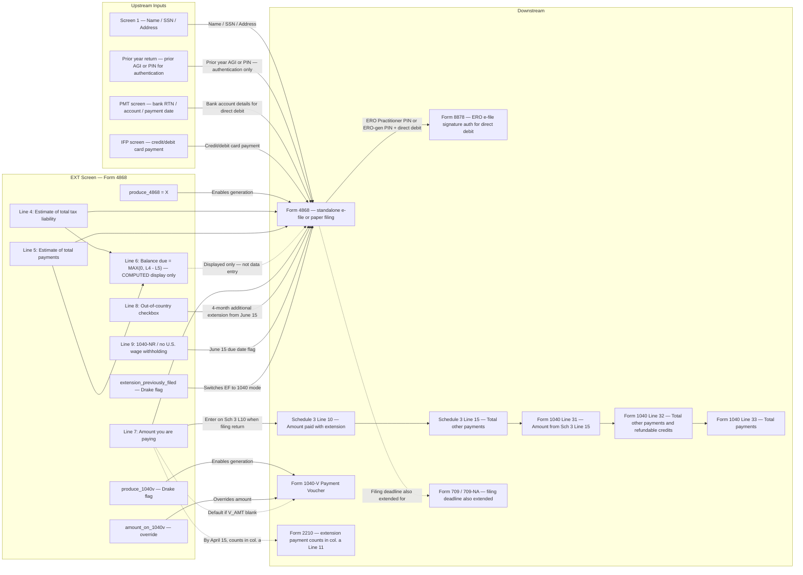

# Form 4868 (EXT) — Application for Automatic Extension of Time to File U.S. Individual Income Tax Return

## Overview

The EXT screen captures all data needed to generate IRS Form 4868, which grants an automatic extension of time to FILE a U.S. individual income tax return (Form 1040, 1040-SR, 1040-NR, or 1040-SS). The screen also captures any payment being remitted with the extension request.

**Critical rule (must be enforced by the engine):** Form 4868 extends only the time to FILE — not the time to PAY. Tax must be paid by the original due date (April 15, 2026 for TY2025 calendar-year filers) to avoid late-payment penalties and interest. The extension itself is automatic; no reason is required.

Form 4868 is a **standalone filing** transmitted separately from (and before) the actual tax return. The payment made with Form 4868 (Line 7) is later entered on Schedule 3 Line 10 of the filed return and credited against tax owed.

**What this screen feeds:**
- Produces Form 4868 (transmitted as a separate e-file submission or paper filing before the return due date)
- Optionally produces a Form 1040-V payment voucher for the extension payment
- May trigger Form 8878 (ERO e-file signature authorization) if direct debit + ERO-managed PIN
- When the actual return is filed: Line 7 (amount paid with extension) flows to Schedule 3 Line 10 → Schedule 3 Line 15 → Form 1040 Line 31 → Form 1040 Line 32 → Form 1040 Line 33 (total payments)

**What this screen depends on:**
- Screen 1 (taxpayer identification: name, SSN, spouse SSN, address, filing status)
- PMT screen (if using direct debit for payment)
- IFP screen (if paying by credit/debit card)

**IRS Form:** 4868
**Drake Screen:** EXT (located on the "Other Forms" tab of the Data Entry Menu)
**Tax Year:** 2025
**Drake Reference:** https://kb.drakesoftware.com/kb/Drake-Tax/11761.htm

---

## Data Entry Fields

Required fields first, then optional. Data-entry only — no computed/display fields.

| Field | Type | Required | Drake Label | Description | IRS Reference | URL |
| ----- | ---- | -------- | ----------- | ----------- | ------------- | --- |
| produce_4868 | enum ("X" or blank) | yes | "4868" dropdown | Select "X" to generate Form 4868. Without this selection, no other EXT screen fields apply. This is the master switch for this screen. | Drake KB 11761 | https://kb.drakesoftware.com/kb/Drake-Tax/11761.htm |
| line_4_total_tax | dollar (whole) | yes (when filing 4868) | "Estimate of total tax liability for 2025" | Taxpayer's best-faith estimate of total 2025 tax liability. Must equal the amount expected on Form 1040 Line 24 (or 1040-NR Line 24; or 1040-SS Part I Line 7). Enter 0 if expected to be zero. Must be a reasonable estimate made with available information — an unreasonable estimate voids the extension. Round to whole dollars. | Form 4868 (2025), Line 4 instructions, p.3 | https://www.irs.gov/pub/irs-pdf/f4868.pdf |
| line_5_total_payments | dollar (whole) | yes (when filing 4868) | "Estimate of total payments for 2025" | Total 2025 payments the taxpayer expects on Form 1040 Line 33 (excluding the amount being paid WITH this Form 4868 — Line 7). Includes: federal income tax withholding, estimated tax payments (Form 1040-ES), refundable credits, etc. Round to whole dollars. Do NOT include the amount on Line 7 of this form. | Form 4868 (2025), Line 5 instructions, p.3 | https://www.irs.gov/pub/irs-pdf/f4868.pdf |
| line_7_amount_paying | dollar (whole) | no | "Amount you're paying" | Dollar amount the taxpayer is remitting with this extension request. Treated as a tax payment by the IRS. When the final return is filed, this amount is entered on Schedule 3 Line 10. Taxpayer may pay any amount from $0 to any positive number — paying less than the Line 6 balance is permitted but will result in interest and potentially a late-payment penalty. Enter 0 (or leave blank, treating as 0) if no payment is being made. Round to whole dollars. | Form 4868 (2025), Line 7 instructions, p.3 | https://www.irs.gov/pub/irs-pdf/f4868.pdf |
| line_8_out_of_country | boolean | no | "Check here if you're 'out of the country'" | Check if, on the original due date of the return, the taxpayer (a) lives outside the United States and Puerto Rico AND their main place of work is outside the United States and Puerto Rico, OR (b) is in military or naval service on duty outside the United States and Puerto Rico. Checking this box indicates the taxpayer already had a 2-month automatic extension (to June 15, 2026) and is now requesting an additional 4-month extension (to October 15, 2026). | Form 4868 (2025), Line 8 instructions, p.3 | https://www.irs.gov/pub/irs-pdf/f4868.pdf |
| line_9_1040nr_no_wages | boolean | no | "Check here if you file Form 1040-NR and didn't receive wages as an employee subject to U.S. income tax withholding" | For nonresident alien filers only. Check if the taxpayer's Form 1040-NR return is due June 15, 2026 (not April 15, 2026) because they had no wages subject to U.S. income tax withholding. This field applies only to 1040-NR filers. | Form 4868 (2025), Line 9 instructions, p.3 | https://www.irs.gov/pub/irs-pdf/f4868.pdf |
| extension_previously_filed | boolean | no | "Extension was previously filed; ready to file tax return" | Drake software flag only — does not appear on Form 4868. Check this after the 4868 has been successfully transmitted. This instructs Drake's e-file system to switch transmission mode from 4868 to 1040 for this return. | Drake KB 11761 | https://kb.drakesoftware.com/kb/Drake-Tax/11761.htm |
| produce_1040v | boolean | no | "Produce 1040-V for extension" | Drake software flag only. Check to generate a Form 1040-V payment voucher for the extension payment (for paper check/money order payments). The voucher will display the amount from line_7_amount_paying unless overridden by amount_on_1040v. | Drake KB 11761 | https://kb.drakesoftware.com/kb/Drake-Tax/11761.htm |
| amount_on_1040v | dollar | no | "Amount to print on 1040-V" | Optional override for the voucher amount shown on Form 1040-V. If blank, the voucher defaults to the line_7_amount_paying value. This field does not affect Form 4868 or any tax calculation. | Drake KB 11761 | https://kb.drakesoftware.com/kb/Drake-Tax/11761.htm |

**Part I Identification (not re-entered on EXT screen — carried from Screen 1):**
- Line 1: Name(s) — from Screen 1. For MFJ, include both spouses' names in the order they will appear on the return.
- Line 2: Taxpayer SSN — from Screen 1. For MFJ, this is the SSN shown first on the joint return. For non-resident aliens without SSN, use ITIN or write "ITIN TO BE REQUESTED." For estate/trust filing 1040-NR, use EIN and write "estate" or "trust" in the left margin.
- Line 3: Spouse SSN — from Screen 1. MFJ only.
- Address (city, state, ZIP) — from Screen 1.
- Tax year begin/end dates — from Screen 1 (calendar year: Jan 1, 2025 – Dec 31, 2025; fiscal year: as specified).

---

## Per-Field Routing

| Field | Destination | How Used | Triggers | Limit / Cap | IRS Reference | URL |
| ----- | ----------- | -------- | -------- | ----------- | ------------- | --- |
| produce_4868 | Drake EF system — Form 4868 generation | Controls whether Drake generates and transmits Form 4868. Only when "X" is selected does the form get produced and transmitted. | None (administrative) | None | Drake KB 11761 | https://kb.drakesoftware.com/kb/Drake-Tax/11761.htm |
| line_4_total_tax | Form 4868 Line 4 | Taxpayer's estimate of TY2025 total tax liability. Used to compute Line 6 (balance due = Line 4 − Line 5). Must reconcile with actual Form 1040 Line 24 when return is filed. If the IRS determines the estimate was not reasonable, the extension is null and void. | None | Must be ≥ 0 | Form 4868 (2025), p.3 | https://www.irs.gov/pub/irs-pdf/f4868.pdf |
| line_5_total_payments | Form 4868 Line 5 | Subtracted from Line 4 to compute Line 6. Must exclude the amount being paid with this form (Line 7). Corresponds to expected Form 1040 Line 33 (excluding Schedule 3 Line 10 amount). | None | Must be ≥ 0; do not include Line 7 amount | Form 4868 (2025), p.3 | https://www.irs.gov/pub/irs-pdf/f4868.pdf |
| line_7_amount_paying | Form 4868 Line 7 → on final return: Schedule 3 Line 10 → Schedule 3 Line 15 → Form 1040 Line 31 → Form 1040 Line 32 → Form 1040 Line 33 | Amount remitted with the extension. Treated as a tax payment by the IRS. When the final return is filed, the preparer enters this amount on Schedule 3 Line 10 ("Amount paid with request for extension to file"). This flows through Schedule 3 Part II totals to Form 1040 Line 31, then Line 32, then Line 33 (total payments). For Form 2210: the extension payment made by April 15 counts in Part III Section A Line 11 column (a) — the same column as estimated payments made through April 15. | May trigger Form 8878 if paid by direct debit through an ERO (see Edge Case 8) | No upper cap; no minimum (can be $0) | Form 4868 (2025), p.2 "How To Claim Credit"; 1040 instructions Sch 3 Line 10; Form 2210 instructions Table 1 | https://www.irs.gov/pub/irs-pdf/f4868.pdf |
| line_8_out_of_country | Form 4868 Line 8 | Checkbox. Changes the extension period granted: if checked, the taxpayer had a prior automatic 2-month extension (to June 15) and is now requesting an additional 4 months (to October 15). If not checked, the full 6-month extension runs from April 15 to October 15. Note: for out-of-country filers, the late-payment penalty starts accruing from June 15 (not April 15) since the 2-month automatic extension covers the payment deadline too. However, interest on unpaid tax still accrues from April 15 for all filers regardless of the out-of-country status. | None | N/A | Form 4868 (2025), p.2-3; Pub. 54 p.5-6 | https://www.irs.gov/pub/irs-pdf/f4868.pdf |
| line_9_1040nr_no_wages | Form 4868 Line 9 | For 1040-NR filers only. Marks that their original return due date is June 15, 2026 (not April 15). Applied only when the filer is submitting Form 1040-NR and had no wages subject to U.S. income tax withholding. | Applicable only to 1040-NR filers | N/A | Form 4868 (2025), p.2 | https://www.irs.gov/pub/irs-pdf/f4868.pdf |
| extension_previously_filed | Drake EF system only | Switches Drake from 4868 transmission mode to 1040 transmission mode. No effect on any IRS form. | None | N/A | Drake KB 11761 | https://kb.drakesoftware.com/kb/Drake-Tax/11761.htm |
| produce_1040v | Drake print system only | Generates Form 1040-V payment voucher document. No effect on Form 4868 or any tax calculation. | None | N/A | Drake KB 11761 | https://kb.drakesoftware.com/kb/Drake-Tax/11761.htm |
| amount_on_1040v | Form 1040-V voucher display field only | Overrides the dollar amount printed on the 1040-V voucher. No effect on Form 4868 or any tax calculation. | None | N/A | Drake KB 11761 | https://kb.drakesoftware.com/kb/Drake-Tax/11761.htm |

---

## Calculation Logic

### Step 1 — Line 6: Balance Due (COMPUTED)

```
line_6_balance_due = MAX(0, line_4_total_tax - line_5_total_payments)
```

If line_5_total_payments ≥ line_4_total_tax, then line_6_balance_due = 0.
This is a display-only computed field. It is shown on Form 4868 for reference but is not entered by the user.

> **Source:** Form 4868 (2025), Line 6 instructions, p.3 — https://www.irs.gov/pub/irs-pdf/f4868.pdf

---

### Step 2 — Line 7: Amount You're Paying (DATA ENTRY)

Line 7 is the dollar amount the taxpayer is actually remitting with the extension. It is a data-entry field — the user can enter any amount ≥ $0. There is no enforced minimum, and the amount does not need to equal Line 6. A taxpayer may pay zero and still get the extension (though they will owe interest and potentially a late-payment penalty on the unpaid balance).

Constraint: Line 7 ≥ 0. Round to whole dollars.

> **Source:** Form 4868 (2025), Line 7 instructions, p.3 — https://www.irs.gov/pub/irs-pdf/f4868.pdf

---

### Step 3 — Penalty Avoidance: 90% Safe Harbor

To avoid the **late-payment penalty** (but not eliminate interest), BOTH conditions must be true:

1. (line_5_total_payments + line_7_amount_paying) ≥ 0.90 × line_4_total_tax
   — at least 90% of total tax is paid by the original due date via withholding, estimated payments, and/or the Form 4868 payment
2. The remaining unpaid balance is paid when the final return is filed

If both conditions are met, the IRS treats the taxpayer as having "reasonable cause" for not paying in full by the due date, and the late-payment penalty is waived. **Interest still accrues** on any unpaid balance regardless.

Note: This safe harbor is specific to the late-payment penalty on Form 4868 extensions. It is separate from the underpayment penalty calculated on Form 2210, which uses different safe-harbor rules (90% of current year tax OR 100%/110% of prior year tax, whichever is smaller).

> **Source:** Form 4868 (2025), "Late Payment Penalty" section, p.2 — https://www.irs.gov/pub/irs-pdf/f4868.pdf

---

### Step 4 — Downstream Credit: How the Extension Payment Credits on the Final Return

When the taxpayer files their actual return (Form 1040/1040-SR/1040-NR):

1. Preparer enters line_7_amount_paying on **Schedule 3, Line 10** ("Amount paid with request for extension to file")
2. Do NOT include any processing fees charged for electronic payment (the fee is excluded)
3. Also include on Schedule 3 Line 10 any amount paid with Form 2350 (same line)
4. Schedule 3 Line 10 flows into:
   - Schedule 3 Line 14 (add lines 9 through 12 and 14) → Schedule 3 Line 15
   - Schedule 3 Line 15 → Form 1040 Line 31
   - Form 1040 Line 32 = add lines 27a, 28, 29, 30, and 31 (total other payments and refundable credits)
   - Form 1040 Line 33 = Lines 25d + 26 + 32 (total payments)

The credit flows: `Sch3 L10 → Sch3 L15 → 1040 L31 → 1040 L32 → 1040 L33`

For Form 1040-SS: the corresponding line is Part I, Line 9.

> **Source:** Form 4868 (2025), "How To Claim Credit for Payment Made With This Form," p.2 — https://www.irs.gov/pub/irs-pdf/f4868.pdf
> **Source:** Schedule 3 (Form 1040) (2025), Part II — https://www.irs.gov/pub/irs-pdf/f1040s3.pdf
> **Source:** Form 1040 (2025), Lines 31–33 — https://www.irs.gov/pub/irs-pdf/f1040.pdf
> **Source:** Form 1040 instructions (2025), Schedule 3 Line 10 — https://www.irs.gov/pub/irs-pdf/i1040gi.pdf

---

### Step 5 — Form 2210 Underpayment Penalty: How Extension Payment Is Treated

A payment made with Form 4868 by April 15, 2026 is treated as a payment made on or before April 15, 2026 for Form 2210 purposes. It is included in:

- Form 2210 Part III Section A, Line 11, **Column (a)** — "payments made through April 15, 2025 [sic 2026 for TY2025]"

This means the extension payment helps satisfy the estimated tax installment requirement for Q4 (April 15 deadline) on Form 2210. The payment reduces or eliminates the underpayment shown in Part III.

The Form 2210 Table 1 (Line 11) includes: prior-year overpayment applied, estimated tax payments, withholding, and balance-due payments made with the return. Although Form 4868 is not specifically named, a payment made before or on April 15 (the original due date) counts in the same bucket as any other payment made through April 15.

> **Source:** Form 2210 (2025) instructions, Part III Section A, Line 11, Table 1 — https://www.irs.gov/pub/irs-pdf/i2210.pdf

---

### Step 6 — MFJ / Separate Filing Allocation Rules

**Scenario A: Joint Form 4868 filed, then separate returns filed:**
The total paid on the joint 4868 (line_7_amount_paying) may be allocated to either spouse's separate return in any agreed amounts. The total allocated across both separate returns cannot exceed the amount paid on the joint 4868.

**Scenario B: Each spouse filed a separate Form 4868, then joint return filed:**
Add both 4868 payment amounts. Enter the combined total on Schedule 3 Line 10 of the joint return.

> **Source:** Form 4868 (2025), "How To Claim Credit for Payment Made With This Form," p.2 — https://www.irs.gov/pub/irs-pdf/f4868.pdf

---

### Step 7 — Rounding Rules

All amounts on Form 4868 may be rounded to whole dollars. Rules:
- Drop cents below $0.50 (e.g., $1.39 → $1)
- Round up cents $0.50 and above (e.g., $2.50 → $3)
- If rounding is used, ALL amounts on the form must be rounded (no selective rounding)
- When adding two or more amounts to produce a total: add with cents, then round only the total

> **Source:** Form 4868 (2025), p.3 "Rounding off to whole dollars" — https://www.irs.gov/pub/irs-pdf/f4868.pdf

---

## Constants & Thresholds (Tax Year 2025)

| Constant | Value | Source | URL |
| -------- | ----- | ------ | --- |
| Original filing due date (calendar year) | April 15, 2026 | Form 4868 (2025), p.2 | https://www.irs.gov/pub/irs-pdf/f4868.pdf |
| Extended filing due date (6-month extension, calendar year) | October 15, 2026 | Form 4868 (2025), p.2 | https://www.irs.gov/pub/irs-pdf/f4868.pdf |
| Out-of-country automatic 2-month extension due date (file + pay) | June 15, 2026 | Form 4868 (2025), p.2; Pub. 54 p.5 | https://www.irs.gov/pub/irs-pdf/f4868.pdf |
| Out-of-country + Form 4868 extended due date | October 15, 2026 (4 more months from June 15) | Form 4868 (2025), p.2 | https://www.irs.gov/pub/irs-pdf/f4868.pdf |
| Out-of-country discretionary additional extension (by letter) | December 15, 2026 (2 more months from October 15) | Pub. 54 (12-2025), p.6 | https://www.irs.gov/pub/irs-pdf/p54.pdf |
| 1040-NR (no U.S. wage withholding) due date | June 15, 2026 | Form 4868 (2025), p.2 | https://www.irs.gov/pub/irs-pdf/f4868.pdf |
| Late payment penalty rate | 0.5% per month or partial month on unpaid tax; maximum 25% | Form 4868 (2025), p.2 | https://www.irs.gov/pub/irs-pdf/f4868.pdf |
| Late filing penalty rate | 5% per month or partial month on amount due; maximum 25% | Form 4868 (2025), p.2 | https://www.irs.gov/pub/irs-pdf/f4868.pdf |
| Minimum late filing penalty (return > 60 days late) | $525, or the balance of tax due on return, whichever is smaller | Rev. Proc. 2024-40 §.53 | https://www.irs.gov/pub/irs-drop/rp-24-40.pdf |
| Penalty safe-harbor threshold (4868 late-payment penalty waiver) | 90% of total tax (Line 4) paid by original due date through withholding, estimated payments, and/or Form 4868 payment; remaining balance paid with return | Form 4868 (2025), p.2 | https://www.irs.gov/pub/irs-pdf/f4868.pdf |
| Form 2210 underpayment safe harbor — current year | 90% of current year tax | Form 2210 instructions (2025) | https://www.irs.gov/pub/irs-pdf/i2210.pdf |
| Form 2210 underpayment safe harbor — prior year (standard) | 100% of prior year tax (if prior year AGI ≤ $150,000) | Form 2210 instructions (2025) | https://www.irs.gov/pub/irs-pdf/i2210.pdf |
| Form 2210 underpayment safe harbor — prior year (high income) | 110% of prior year tax (if prior year AGI > $150,000; $75,000 for MFS) | Form 2210 instructions (2025) | https://www.irs.gov/pub/irs-pdf/i2210.pdf |

---

## Data Flow Diagram



---

## Edge Cases & Special Rules

### 1. Extension Does NOT Extend the Payment Deadline

The most important rule for implementation: filing Form 4868 extends only the FILING deadline, not the PAYMENT deadline. Tax owed must be paid by:
- April 15, 2026 — calendar-year filers (all filers, including out-of-country)
- June 15, 2026 — out-of-country filers get an extra 2 months to pay (the automatic 2-month extension covers payment)
- April 15, 2026 — 1040-NR filers with wages; June 15, 2026 — 1040-NR filers without wages

Interest accrues from April 15, 2026 on any unpaid tax, even for out-of-country filers with the 2-month automatic extension (interest starts at April 15 regardless of the extended payment period, per Form 4868 instructions — although Pub. 54 clarifies that for the 2-month automatic extension the late-payment PENALTY starts accruing from June 15, not April 15).

> **Source:** Form 4868 (2025), p.1 CAUTION box and p.2 "Interest" section — https://www.irs.gov/pub/irs-pdf/f4868.pdf
> **Source:** Pub. 54 (12-2025), p.5-6 — https://www.irs.gov/pub/irs-pdf/p54.pdf

---

### 2. Out-of-Country Filers: Penalty vs. Interest Start Date Distinction

This is a critical distinction. For taxpayers qualifying as "out of the country" who use the automatic 2-month extension:

- **Interest** accrues from **April 15, 2026** (original due date) on any unpaid tax
- **Late-payment penalty** (0.5%/month) starts accruing from **June 15, 2026** (the end of the 2-month automatic extension period), NOT April 15

For taxpayers NOT qualifying as out of the country:
- Both interest and late-payment penalty start from April 15, 2026

> **Source:** Pub. 54 (12-2025), p.5 "Previous 2-month extension" — "penalties for paying the tax late are assessed from the original due date of your return, unless you qualify for the automatic 2-month extension. In that situation, penalties for paying late are assessed from the extended due date of the payment (June 15 for calendar-year taxpayers)." — https://www.irs.gov/pub/irs-pdf/p54.pdf

---

### 3. Unreasonable Estimate Voids the Extension

The Line 4 estimate must be made in good faith with the information available at the time of filing. If the IRS later determines the estimate was not reasonable (e.g., wildly and intentionally understated), the extension is null and void. This means the return would be treated as filed late from the original April 15, 2026 due date, with full late-filing penalties retroactively applied.

The engine must not allow a Line 4 value of zero unless the taxpayer genuinely expects zero tax liability (e.g., they know they owe nothing).

> **Source:** Form 4868 (2025), Line 4 "CAUTION" box, p.3 — https://www.irs.gov/pub/irs-pdf/f4868.pdf

---

### 4. Fiscal Year Taxpayers Must File Paper

Fiscal year taxpayers (non-calendar year) must file Form 4868 on paper; they cannot e-file it. The due date is the 15th day of the 4th month after the close of the fiscal year, and the extended due date is 6 months later.

> **Source:** Form 4868 (2025), p.1 "Note: If you're a fiscal year taxpayer, you must file a paper Form 4868." — https://www.irs.gov/pub/irs-pdf/f4868.pdf

---

### 5. No Need to File Form 4868 If Paying Electronically

If the taxpayer makes any electronic payment (IRS Direct Pay, EFTPS, credit/debit card, digital wallet such as Click to Pay, PayPal, Venmo) and indicates the payment is for an extension, the IRS automatically processes an extension of time to file. Form 4868 does not need to be separately submitted. The engine should support this as a payment-only extension path, without requiring the EXT screen to produce a Form 4868.

> **Source:** Form 4868 (2025), p.1 "Pay Electronically" — https://www.irs.gov/pub/irs-pdf/f4868.pdf

---

### 6. Form 709 / 709-NA: Filing Extended, Payment Not Extended

Filing Form 4868 also extends the FILING deadline for the gift and generation-skipping transfer tax return (Form 709 or 709-NA). However, it does NOT extend the time to PAY gift/GST tax. If the taxpayer owes gift/GST tax, they must file Form 8892 to make the payment. If they fail to pay by the due date of Form 709/709-NA, they owe interest and possibly penalties.

If the donor died during 2025, there are additional rules — see Form 709/709-NA and Form 8892 instructions.

> **Source:** Form 4868 (2025), p.1 "Gift and generation-skipping transfer (GST) tax return" — https://www.irs.gov/pub/irs-pdf/f4868.pdf

---

### 7. Out-of-Country Filers: Discretionary Additional 2-Month Extension

Beyond the 6-month extension (to October 15, 2026), out-of-country taxpayers can request an additional discretionary 2-month extension (to December 15, 2026) by sending the IRS a letter explaining why they need the extra time. This request must be sent by October 15, 2026. This is NOT handled through Form 4868 — it is a letter request only. The engine's Form 4868 logic covers extensions through October 15 only.

> **Source:** Pub. 54 (12-2025), "Additional extension of time for taxpayers out of the country" — https://www.irs.gov/pub/irs-pdf/p54.pdf

---

### 8. Form 8878: e-File Signature Authorization Decision Tree

Form 8878 is required only in specific e-file scenarios involving direct debit. Use the following decision tree exactly:

| Filing scenario | Form 8878 required? | Which parts? |
|---|---|---|
| e-filing 4868, NO electronic funds withdrawal | No | — |
| e-filing 4868, electronic funds withdrawal, taxpayer enters own PIN, ERO NOT using Practitioner PIN | No | — |
| e-filing 4868, electronic funds withdrawal, ERO to enter/generate PIN, ERO NOT using Practitioner PIN | Yes | Parts I and II |
| e-filing 4868, electronic funds withdrawal, ERO using Practitioner PIN method | Yes | Parts I, II, and III |
| e-filing Form 2350, ERO to enter/generate PIN | Yes | Parts I and II |

Form 8878 is retained by the ERO for 3 years. It is NOT submitted to the IRS unless the IRS requests it.

When ERO is NOT using Practitioner PIN and taxpayer IS authorizing electronic funds withdrawal: the ERO must enter the taxpayer's prior-year AGI or prior-year PIN for authentication (from the originally filed prior-year return — NOT from an amended return or IRS math error correction).

> **Source:** Form 8878 (2025), p.2 "When and How To Complete" decision chart and "Important Notes for EROs" — https://www.irs.gov/pub/irs-pdf/f8878.pdf

---

### 9. Form 2350 vs. Form 4868 for Overseas Filers

Overseas filers who expect to qualify for the foreign earned income exclusion (Form 2555) but have not yet met the bona fide residence or physical presence test by their return due date should use **Form 2350** instead of Form 4868. Form 2350 can provide an extension beyond 6 months if the taxpayer needs time to meet the residency/physical presence tests. Form 4868 is capped at 6 months from the original due date (October 15, 2026 for calendar-year filers).

> **Source:** Form 4868 (2025), p.2 "Taxpayers who are out of the country"; Pub. 54 (12-2025), "Extension of time to meet residency tests" — https://www.irs.gov/pub/irs-pdf/p54.pdf

---

### 10. Combat Zone / Contingency Operation

Taxpayers serving in a designated combat zone or contingency operation may qualify for additional time to file beyond Form 4868. This is handled separately through Pub. 3 (Armed Forces' Tax Guide) and is outside the scope of the EXT screen's standard processing. The engine should not prevent filing for combat zone taxpayers but should note that their actual extended deadline may be different from October 15.

> **Source:** Form 1040 instructions (2025), "What if You Can't File on Time?" — https://www.irs.gov/pub/irs-pdf/i1040gi.pdf

---

### 11. Disaster Relief

If the taxpayer was affected by a federally declared disaster, additional time may be available to file Form 4868 itself. See IRS.gov/DisasterRelief. The engine must not prevent a late-filed 4868 from being processed where disaster relief applies.

> **Source:** Form 4868 (2025), p.2 "When To File Form 4868" — https://www.irs.gov/pub/irs-pdf/f4868.pdf

---

### 12. No Reason Required; No Denial Notification

The taxpayer does not need to explain why they are requesting an extension. The IRS will contact the taxpayer only if the extension request is denied (which is rare).

> **Source:** Form 4868 (2025), p.1 "Qualifying for the Extension" — https://www.irs.gov/pub/irs-pdf/f4868.pdf

---

### 13. Do Not Attach Form 4868 to the Return

When the taxpayer later files their return, Form 4868 should NOT be attached to the return. The extension payment amount is reported on Schedule 3 Line 10.

> **Source:** Form 4868 (2025), p.2 "Filing Your Tax Return" — https://www.irs.gov/pub/irs-pdf/f4868.pdf

---

## Sources

All URLs verified to resolve.

| Document | Year | Section | URL | Saved as |
| -------- | ---- | ------- | --- | -------- |
| Drake KB — 1040: Individual Extension Form 4868 | — | Full article | https://kb.drakesoftware.com/kb/Drake-Tax/11761.htm | — |
| Form 4868 — Application for Automatic Extension of Time to File U.S. Individual Income Tax Return | 2025 | Full form + instructions | https://www.irs.gov/pub/irs-pdf/f4868.pdf | f4868.pdf |
| Form 8878 — IRS e-file Signature Authorization for Form 4868 or Form 2350 | 2025 | Full form + instructions | https://www.irs.gov/pub/irs-pdf/f8878.pdf | f8878.pdf |
| Schedule 3 (Form 1040) — Additional Credits and Payments | 2025 | Part II, Line 10 | https://www.irs.gov/pub/irs-pdf/f1040s3.pdf | f1040s3.pdf |
| Form 1040 (2025) | 2025 | Lines 31–33 | https://www.irs.gov/pub/irs-pdf/f1040.pdf | f1040.pdf |
| Instructions for Form 1040 (2025) | 2025 | Schedule 3 Line 10; extension sections | https://www.irs.gov/pub/irs-pdf/i1040gi.pdf | i1040gi.pdf |
| Instructions for Form 2210 (2025) | 2025 | Part III, Table 1, Line 11 | https://www.irs.gov/pub/irs-pdf/i2210.pdf | i2210.pdf |
| Publication 54 — Tax Guide for U.S. Citizens and Resident Aliens Abroad (12-2025) | 2025 | "Extensions" section, pp. 5–6 | https://www.irs.gov/pub/irs-pdf/p54.pdf | p54.pdf |
| Rev. Proc. 2024-40 | 2024 | §.53 (minimum late-filing penalty = $525) | https://www.irs.gov/pub/irs-drop/rp-24-40.pdf | rp-24-40.pdf |
| IRS About Form 4868 | — | Overview | https://www.irs.gov/forms-pubs/about-form-4868 | — |
| IRS Topic 304 — Extensions of Time to File | — | Full topic | https://www.irs.gov/taxtopics/tc304 | — |
| IRS Get an Extension to File Your Tax Return | — | Filing overview | https://www.irs.gov/filing/get-an-extension-to-file-your-tax-return | — |
