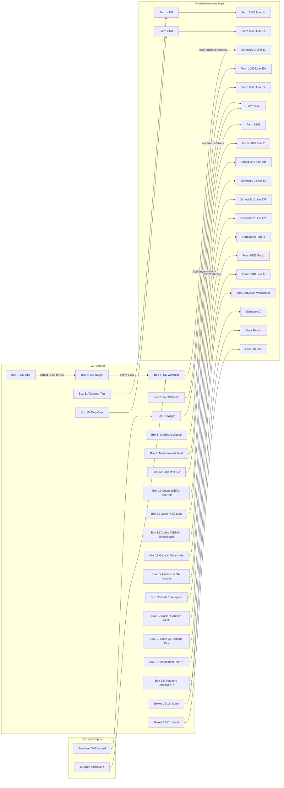

# W2 — Wage and Tax Statement

## Overview

The W2 screen captures all data from IRS Form W-2, the Wage and Tax Statement issued by an employer to each employee. It is the primary source of earned income for the 1040 and drives federal income tax, FICA tax credits, withholding credits, and several downstream forms.

**What this screen captures:** Every box from the taxpayer's W-2 — employer/employee identification, wage amounts, FICA amounts, Box 12 benefit codes, checkboxes, and state/local tax data.

**What it feeds:**
- Box 1 wages → Form 1040, Line 1a (total wages)
- Box 2 withholding → Form 1040, Line 25a (federal tax withheld from W-2s)
- Box 8 allocated tips → Form 4137 → Form 1040, Line 1c (tip income not in Box 1)
- Box 10 dependent care → Form 2441
- Box 12 codes → various (Form 8889, Schedule 1, Schedule 2, Schedule 3, etc.)
- Box 13 checkboxes → Schedule C (statutory employee), IRA deduction phase-out
- Boxes 15–20 state → state return

**Upstream inputs:** Employer issues W-2; no prior-year screen feeds this directly. Multiple W-2 instances are allowed (one per employer).

**IRS Form:** W-2 (Wage and Tax Statement)
**Drake Screen:** W2 (General tab of Data Entry Menu)
**Tax Year:** 2025
**Drake Reference:** https://kb.drakesoftware.com/kb/Drake-Tax/10378.htm

---

## Data Entry Fields

Required fields first, then optional. Data-entry only — no computed/display fields.

### Employer & Employee Header

| Field | Type | Required | Drake Label | Description | IRS Reference | URL |
| ----- | ---- | -------- | ----------- | ----------- | ------------- | --- |
| employee_ssn | string (9-digit, no dashes) | yes | "a Employee's social security number" | Employee's SSN. Must match SSA records exactly. May be truncated on employee copies only (format ***-**-1234). Never truncate on tax software entry. | iw2w3, Box a | https://www.irs.gov/instructions/iw2w3 |
| employer_ein | string (9-digit, format XX-XXXXXXX) | yes | "b Employer identification number (EIN)" | Employer's federal EIN. Never truncated. If employer uses agent, enter agent's EIN. | iw2w3, Box b | https://www.irs.gov/instructions/iw2w3 |
| employer_name | string | yes | "c Employer's name" | Employer's legal business name | iw2w3, Box c | https://www.irs.gov/instructions/iw2w3 |
| employer_address | string | yes | "c Employer's address and ZIP code" | Street, city, state, ZIP of employer's principal business location | iw2w3, Box c | https://www.irs.gov/instructions/iw2w3 |
| control_number | string | no | "d Control number" | Optional sequential ID assigned by employer for internal tracking; no tax significance | iw2w3, Box d | https://www.irs.gov/instructions/iw2w3 |
| employee_first_name | string | yes | "e Employee's first name and initial" | Employee's legal first name and middle initial | iw2w3, Box e | https://www.irs.gov/instructions/iw2w3 |
| employee_last_name | string | yes | "e Last name" | Employee's legal surname | iw2w3, Box e | https://www.irs.gov/instructions/iw2w3 |
| employee_suffix | string | no | "e Suff." | Name suffix (Jr., Sr., II, etc.) | iw2w3, Box e | https://www.irs.gov/instructions/iw2w3 |
| employee_address | string | yes | "f Employee's address and ZIP code" | Employee's mailing address for their copies of the W-2 | iw2w3, Box f | https://www.irs.gov/instructions/iw2w3 |

### Wage & Tax Boxes

| Field | Type | Required | Drake Label | Description | IRS Reference | URL |
| ----- | ---- | -------- | ----------- | ----------- | ------------- | --- |
| box_1_wages | number (dollars, 2 decimals) | yes | "1 Wages, tips, other comp." | Total wages, tips, and other compensation subject to federal income tax withholding. Excludes: pre-tax 401(k)/403(b)/457(b) deferrals, health insurance premiums (§125 cafeteria plan), FSA contributions. Includes: taxable fringe benefits, group-term life >$50k (Code C), nonstatutory stock option income (Code V), section 409A income (Code Z). | iw2w3, Box 1, General Instructions | https://www.irs.gov/instructions/iw2w3 |
| box_2_fed_withheld | number (dollars, 2 decimals) | yes | "2 Federal income tax withheld" | Total federal income tax withheld from employee's wages during the tax year. This is a straight withholding credit — no calculation. | iw2w3, Box 2 | https://www.irs.gov/instructions/iw2w3 |
| box_3_ss_wages | number (dollars, 2 decimals) | yes* | "3 Social security wages" | Wages subject to Social Security (OASDI) tax. Capped at SS wage base by employer, but taxpayer may have multiple employers (combined Box 3 may exceed wage base). Cannot exceed $176,100 per employer for TY2025. *Required if taxpayer had SS wages. | iw2w3, Box 3; SSA COLA 2025 | https://www.irs.gov/instructions/iw2w3 |
| box_4_ss_withheld | number (dollars, 2 decimals) | yes* | "4 Social security tax withheld" | SS (OASDI) tax withheld at exactly 6.2% of Box 3. Should equal Box 3 × 0.062. If employee had multiple employers, sum of all Box 4 may exceed $10,918.20 — excess is a refundable credit. *Required if Box 3 > 0. | iw2w3, Box 4 | https://www.irs.gov/instructions/iw2w3 |
| box_5_medicare_wages | number (dollars, 2 decimals) | yes* | "5 Medicare wages and tips" | Wages and tips subject to Medicare (HI) tax. No ceiling — all wages subject to Medicare. Generally = Box 1 + pre-tax 401(k) deferrals − some exclusions. Usually ≥ Box 1. | iw2w3, Box 5 | https://www.irs.gov/instructions/iw2w3 |
| box_6_medicare_withheld | number (dollars, 2 decimals) | yes* | "6 Medicare tax withheld" | Medicare tax withheld at 1.45% of Box 5. NOTE: employer withholds additional 0.9% when Box 5 exceeds $200,000 in a year (this extra withholding is also included in Box 6). Final reconciliation via Form 8959. | iw2w3, Box 6; i8959 | https://www.irs.gov/instructions/iw2w3 |
| box_7_ss_tips | number (dollars, 2 decimals) | no | "7 Social security tips" | Cash tips reported by employee to employer that are subject to SS tax. These tips are already included in Box 1 wages. Box 7 + Box 3 = total SS wages (subject to SS wage base cap). | iw2w3, Box 7 | https://www.irs.gov/instructions/iw2w3 |
| box_8_allocated_tips | number (dollars, 2 decimals) | no | "8 Allocated tips" | Tips allocated by employer to employee using IRS tip allocation rules (large food/beverage establishment). NOT included in Box 1 — must be added by employee on Form 4137. Taxpayer determines whether to include or dispute with employer. | iw2w3, Box 8; Form 4137 | https://www.irs.gov/instructions/iw2w3 |
| box_10_dep_care | number (dollars, 2 decimals) | no | "10 Dependent care benefits" | Total employer-provided dependent care benefits (including amounts from salary reduction under §129). First $5,000 excluded from income ($2,500 if MFS). Excess above exclusion flows to Form 1040 Line 1e via Form 2441. | iw2w3, Box 10; Form 2441 instructions | https://www.irs.gov/instructions/iw2w3 |
| box_11_nonqual_plans | number (dollars, 2 decimals) | no | "11 Nonqualified plans" | Amount distributed from nonqualified deferred compensation or nongovernmental §457(b) plans that is includible in income. ALREADY INCLUDED in Box 1 — this is informational only showing what portion of Box 1 comes from NQDC. | iw2w3, Box 11 | https://www.irs.gov/instructions/iw2w3 |

### Box 12 — Code Entries (up to 8: 4 on main screen + 4 on Additional Entries tab)

Each entry is a code + amount pair. Valid codes are listed below with their routing.

| Field | Type | Required | Drake Label | Description | IRS Reference | URL |
| ----- | ---- | -------- | ----------- | ----------- | ------------- | --- |
| box_12_entry_1_code | string (1–2 chars, uppercase) | no | "12a Code" | Letter code from IRS Box 12 code list (A–II, TP, TT) | iw2w3, Box 12; Specific Instructions | https://www.irs.gov/instructions/iw2w3 |
| box_12_entry_1_amount | number | no | "12a Amount" | Dollar amount for the code in entry 1 | iw2w3, Box 12 | https://www.irs.gov/instructions/iw2w3 |
| box_12_entry_2_code | string (1–2 chars) | no | "12b Code" | Second Box 12 code | iw2w3, Box 12 | https://www.irs.gov/instructions/iw2w3 |
| box_12_entry_2_amount | number | no | "12b Amount" | Dollar amount for entry 2 | iw2w3, Box 12 | https://www.irs.gov/instructions/iw2w3 |
| box_12_entry_3_code | string (1–2 chars) | no | "12c Code" | Third Box 12 code | iw2w3, Box 12 | https://www.irs.gov/instructions/iw2w3 |
| box_12_entry_3_amount | number | no | "12c Amount" | Dollar amount for entry 3 | iw2w3, Box 12 | https://www.irs.gov/instructions/iw2w3 |
| box_12_entry_4_code | string (1–2 chars) | no | "12d Code" | Fourth Box 12 code | iw2w3, Box 12 | https://www.irs.gov/instructions/iw2w3 |
| box_12_entry_4_amount | number | no | "12d Amount" | Dollar amount for entry 4 | iw2w3, Box 12 | https://www.irs.gov/instructions/iw2w3 |
| box_12_entry_5_code | string (1–2 chars) | no | "12e Code (Additional)" | Fifth Box 12 code (Additional Entries tab in Drake) | iw2w3, Box 12 | https://www.irs.gov/instructions/iw2w3 |
| box_12_entry_5_amount | number | no | "12e Amount (Additional)" | Dollar amount for entry 5 | iw2w3, Box 12 | https://www.irs.gov/instructions/iw2w3 |
| box_12_entry_6_code | string (1–2 chars) | no | "12f Code (Additional)" | Sixth Box 12 code | iw2w3, Box 12 | https://www.irs.gov/instructions/iw2w3 |
| box_12_entry_6_amount | number | no | "12f Amount (Additional)" | Dollar amount for entry 6 | iw2w3, Box 12 | https://www.irs.gov/instructions/iw2w3 |
| box_12_entry_7_code | string (1–2 chars) | no | "12g Code (Additional)" | Seventh Box 12 code | iw2w3, Box 12 | https://www.irs.gov/instructions/iw2w3 |
| box_12_entry_7_amount | number | no | "12g Amount (Additional)" | Dollar amount for entry 7 | iw2w3, Box 12 | https://www.irs.gov/instructions/iw2w3 |
| box_12_entry_8_code | string (1–2 chars) | no | "12h Code (Additional)" | Eighth Box 12 code | iw2w3, Box 12 | https://www.irs.gov/instructions/iw2w3 |
| box_12_entry_8_amount | number | no | "12h Amount (Additional)" | Dollar amount for entry 8 | iw2w3, Box 12 | https://www.irs.gov/instructions/iw2w3 |

### Box 13 — Checkboxes

| Field | Type | Required | Drake Label | Description | IRS Reference | URL |
| ----- | ---- | -------- | ----------- | ----------- | ------------- | --- |
| box_13_statutory_employee | boolean | no | "Statutory employee" | If checked: this employee is a statutory employee (certain agent-drivers, life insurance salespeople, home workers, traveling salespeople). Wages report on Schedule C, not Line 1a. Employee pays SE tax on these wages. | iw2w3, Box 13; IRS Pub 15-A | https://www.irs.gov/instructions/iw2w3 |
| box_13_retirement_plan | boolean | no | "Retirement plan" | If checked: employee was an active participant in an employer-sponsored retirement plan during the year (401k, 403b, SIMPLE, pension, etc.). This checkbox triggers the IRA deduction phase-out rules. | iw2w3, Box 13; Pub 590-A | https://www.irs.gov/instructions/iw2w3 |
| box_13_third_party_sick | boolean | no | "Third-party sick pay" | If checked: sick pay was paid by a third-party payer (insurance company). Prevents double-counting of withholding when the third party has already reported. | iw2w3, Box 13 | https://www.irs.gov/instructions/iw2w3 |

### Box 14 (up to 8 entries: 4 main + 4 Additional Entries tab)

| Field | Type | Required | Drake Label | Description | IRS Reference | URL |
| ----- | ---- | -------- | ----------- | ----------- | ------------- | --- |
| box_14_entry_1_desc | string | no | "14 Other (description)" | Free-text employer label. Common examples: SDI (state disability insurance), VDI, union dues, parsonage allowances, after-tax 401(k) contributions, educational assistance. No standardized codes — varies by employer and state. | iw2w3, Box 14 | https://www.irs.gov/instructions/iw2w3 |
| box_14_entry_1_amount | number | no | "14 Other (amount)" | Dollar amount for the Box 14 item. Most Box 14 items are informational. Some states use Box 14 for specific withholding (e.g., CA SDI → deductible on Schedule A Line 5a; NY SDI, NJ FLI, OR/WA/MA PFML → deductible on Schedule A Line 5a if taxpayer itemizes, subject to $10,000 SALT cap). See Edge Case 11 for state-by-state mappings. | iw2w3, Box 14; Rev. Ruling 2025-4 | https://www.irs.gov/instructions/iw2w3 |
| box_14b_tipped_code | string | no | "14b Treasury Tipped Occupation Code" | New for TY2025: IRS-designated occupation code for employees in customary tipping industries. Used with the "No Tax on Tips" deduction (up to $25,000 on Schedule 1 for TY2025). Box 14 was split into 14a (Other) and 14b (Tipped Occupation Code) on the 2025 Form W-2. Applicable to TY2025. | iw2w3, Box 14b (TY2025 W-2) | https://www.irs.gov/pub/irs-prior/iw2w3--2025.pdf |

*(Entries 2–8 follow same pattern as entry 1 for Box 14)*

---

### State & Local Boxes (up to 14 states: 4 main + 10 Additional Entries tab)

| Field | Type | Required | Drake Label | Description | IRS Reference | URL |
| ----- | ---- | -------- | ----------- | ----------- | ------------- | --- |
| box_15_state | string (2-char ISO) | no | "15 State" | Two-letter state abbreviation (e.g., CA, NY, TX) | iw2w3, Box 15 | https://www.irs.gov/instructions/iw2w3 |
| box_15_employer_state_id | string | no | "15 Employer's state ID" | State-assigned employer ID number for state withholding | iw2w3, Box 15 | https://www.irs.gov/instructions/iw2w3 |
| box_16_state_wages | number | no | "16 State wages, tips, etc." | Wages subject to state income tax; may differ from Box 1 (some states exclude certain items or include others) | iw2w3, Box 16 | https://www.irs.gov/instructions/iw2w3 |
| box_17_state_withheld | number | no | "17 State income tax withheld" | State income tax withheld from wages; credited on state return | iw2w3, Box 17 | https://www.irs.gov/instructions/iw2w3 |
| box_18_local_wages | number | no | "18 Local wages, tips, etc." | Wages subject to local/city/county income tax | iw2w3, Box 18 | https://www.irs.gov/instructions/iw2w3 |
| box_19_local_withheld | number | no | "19 Local income tax withheld" | Local income tax withheld; credited on local return | iw2w3, Box 19 | https://www.irs.gov/instructions/iw2w3 |
| box_20_locality_name | string | no | "20 Locality name" | Name of local taxing jurisdiction (e.g., "NYC", "Philadelphia") | iw2w3, Box 20 | https://www.irs.gov/instructions/iw2w3 |

---

## Per-Field Routing

For every field above: where the value goes, how it is used, what it triggers, any limits.

### Wage & Tax Routing

| Field | Destination | How Used | Triggers | Limit / Cap | IRS Reference | URL |
| ----- | ----------- | -------- | -------- | ----------- | ------------- | --- |
| box_1_wages | Form 1040, Line 1a | Summed across ALL W-2 instances; total goes on Line 1a directly | — | None | 1040 Instructions, Line 1a | https://www.irs.gov/instructions/i1040gi |
| box_2_fed_withheld | Form 1040, Line 25a | Summed across ALL W-2 instances; directly reduces tax owed | — | None | 1040 Instructions, Line 25a | https://www.irs.gov/instructions/i1040gi |
| box_3_ss_wages | SS verification / Schedule 3 Line 11 | Engine verifies Box 4 ≈ Box 3 × 0.062. Sum of all Box 3 amounts tracked to determine if total wages > SS wage base. | Schedule 3 Line 11 if multi-employer excess | $176,100 per employer (TY2025 SS wage base) | iw2w3, Box 3; SSA 2025 | https://www.irs.gov/instructions/iw2w3 |
| box_4_ss_withheld | Schedule 3, Line 11 (if multi-employer excess) | Sum all W-2 Box 4. If total > $10,918.20 AND from 2+ employers → excess is refundable credit on Schedule 3 Line 11. If single employer over-withheld → contact employer, not a 1040 credit. | Schedule 3 Line 11 | $10,918.20 total (6.2% × $176,100, TY2025) | 1040 Instructions, Schedule 3 Line 11 | https://www.irs.gov/instructions/i1040gi |
| box_5_medicare_wages | Form 8959, Line 1 | Sum all W-2 Box 5. If sum > filing status threshold, AMT applies. Employer MUST withhold extra 0.9% once Box 5 exceeds $200,000 on that W-2 during the year. | Form 8959 (AMT Medicare) if any Box 5 > $200,000 or if sum > $250,000 MFJ / $200,000 Single/HOH/QSS / $125,000 MFS | None (no ceiling on Medicare wages) | i8959, Lines 1–7 | https://www.irs.gov/instructions/i8959 |
| box_6_medicare_withheld | Form 1040, Line 25 (via Schedule 3 Line 11 or directly) | Credited as withholding. Any AMT extra withholding in Box 6 is reconciled on Form 8959 Part III. | — | None | i8959, Part III | https://www.irs.gov/instructions/i8959 |
| box_7_ss_tips | SS wages computation | Added to Box 3 for SS tax purposes. Box 3 + Box 7 must not exceed SS wage base ($176,100). Tips also included in Box 1. | — | SS wage base $176,100 (combined Box 3 + Box 7) | iw2w3, Box 7 | https://www.irs.gov/instructions/iw2w3 |
| box_8_allocated_tips | Form 4137, then Form 1040 Line 1c | Taxpayer must include allocated tips in income via Form 4137 (Social Security Tax on Unreported Tip Income). Employer allocates tips when reported tips < 8% of gross receipts. | Form 4137 | None | iw2w3, Box 8; Form 4137 instructions | https://www.irs.gov/instructions/iw2w3 |
| box_10_dep_care | Form 2441 | Employer-provided dependent care. Form 2441 computes the excludable amount (≤ $5,000 general, ≤ $2,500 MFS). Excess above exclusion: Form 2441 Line 26 → Form 1040 Line 1e. | Form 2441 | $5,000 exclusion ($2,500 MFS) | iw2w3, Box 10; Form 2441 | https://www.irs.gov/instructions/i2441 |
| box_11_nonqual_plans | Informational (no additional action) | Already in Box 1. No separate 1040 entry. Engine should display for preparer awareness — distributions from NQDC already taxable. | — | None | iw2w3, Box 11 | https://www.irs.gov/instructions/iw2w3 |

### Box 12 Code Routing

| Code | Full Name | Destination | How Used | Limit (TY2025) | IRS Reference | URL |
| ---- | --------- | ----------- | -------- | -------------- | ------------- | --- |
| A | Uncollected SS tax on tips | Schedule 2, Line 13 | Employee owes uncollected SS tax; reported as "UT" | — | iw2w3, Box 12, Code A; Schedule 2 Line 13 | https://www.irs.gov/instructions/iw2w3 |
| B | Uncollected Medicare tax on tips | Schedule 2, Line 13 | Employee owes uncollected Medicare tax; reported as "UT" | — | iw2w3, Box 12, Code B; Schedule 2 Line 13 | https://www.irs.gov/instructions/iw2w3 |
| C | Taxable group-term life >$50k | Informational | Already included in Box 1; also in Box 3 and Box 5 for FICA | None | iw2w3, Box 12, Code C | https://www.irs.gov/instructions/iw2w3 |
| D | 401(k) elective deferrals | Retirement limit tracking + Form 8880 Line 2 | Pre-tax; NOT on 1040. Used to verify deferral ≤ limit. Code D flows to Form 8880 Line 2 (elective deferrals) for Saver's Credit if eligible. | $23,500 (combined D+AA); catch-up 50+ $7,500; 60-63 $11,250 | IRS Notice 2024-80; Form 8880 Line 2 | https://www.irs.gov/pub/irs-drop/n-24-80.pdf |
| E | 403(b) elective deferrals | Retirement limit tracking + Form 8880 Line 2 | Same as D for 403(b) plans. Code E flows to Form 8880 Line 2 for Saver's Credit if eligible. | $23,500 (combined E+BB); catch-up 50+ $7,500; 60-63 $11,250 | IRS Notice 2024-80; Form 8880 Line 2 | https://www.irs.gov/pub/irs-drop/n-24-80.pdf |
| F | 408(k)(6) SEP deferrals | Retirement limit tracking | SAR-SEP deferrals; plan must have been in existence before 12/31/96 | $16,500 (same as SIMPLE) | IRS Notice 2024-80 | https://www.irs.gov/pub/irs-drop/n-24-80.pdf |
| G | 457(b) plan deferrals | Retirement limit tracking + Form 8880 Line 2 | Government and non-government 457(b) plans. Code G flows to Form 8880 Line 2 for Saver's Credit if eligible. | $23,500 (combined G+EE); catch-up 50+ $7,500; 60-63 $11,250 | IRS Notice 2024-80; Form 8880 Line 2 | https://www.irs.gov/pub/irs-drop/n-24-80.pdf |
| H | 501(c)(18)(D) plan deferrals | Schedule 1, Line 24f | Deductible by employee as above-the-line adjustment; reduces AGI. Confirmed TY2025. | Lesser of $7,000 or 25% of includible compensation | iw2w3, Box 12, Code H; Schedule 1 Part II Line 24f | https://www.irs.gov/instructions/iw2w3 |
| J | Nontaxable sick pay | Informational only | NOT in Box 1; no tax entry needed | — | iw2w3, Box 12, Code J | https://www.irs.gov/instructions/iw2w3 |
| K | 20% excise tax on excess golden parachute | Schedule 2, Line 17k | 20% excise tax on "excess parachute payments" above 3× base amount. Confirmed TY2025 line = 17k. | — | iw2w3, Box 12, Code K; Schedule 2 Line 17k | https://www.irs.gov/instructions/iw2w3 |
| L | Substantiated employee business expense reimbursements | Informational only | Accountable plan reimbursements; not taxable; not in Box 1 | — | iw2w3, Box 12, Code L | https://www.irs.gov/instructions/iw2w3 |
| M | Uncollected SS tax on group-term life (former employees) | Schedule 2, Line 13 | Employee owes SS tax not withheld; reported as "UT" | — | iw2w3, Box 12, Code M; Schedule 2 Line 13 | https://www.irs.gov/instructions/iw2w3 |
| N | Uncollected Medicare tax on group-term life (former employees) | Schedule 2, Line 13 | Employee owes Medicare tax not withheld; reported as "UT" | — | iw2w3, Box 12, Code N; Schedule 2 Line 13 | https://www.irs.gov/instructions/iw2w3 |
| P | Excludable moving expense reimbursements | Informational only | Only for active military; NOT in Box 1; no tax entry | — | iw2w3, Box 12, Code P | https://www.irs.gov/instructions/iw2w3 |
| Q | Nontaxable combat pay | Form 1040, Line 1i (election) | Military may ELECT to include in earned income for EITC purposes; otherwise excluded. Enter on Line 1i. Confirmed TY2025: Line 1i is still the correct line for the combat pay EITC election. | — | iw2w3, Box 12, Code Q; 1040 Line 1i; IRS Pub 3 (2025) | https://www.irs.gov/instructions/i1040gi |
| R | Archer MSA employer contributions | Form 8853, Part I, Line 1 | Excluded from employee income if qualified. Code R amount flows to Form 8853 Part I Line 1 (employer contributions). See Step 9 for full Part I calculation logic. | 65% of HDHP deductible (self-only); 75% of HDHP deductible (family) | Rev. Proc. 2024-40 §3; Form 8853 Part I Line 1 | https://www.irs.gov/instructions/i8853 |
| S | SIMPLE retirement account deferrals | Retirement limit tracking | Pre-tax SIMPLE IRA/401(k) contributions | $16,500 standard; catch-up 50+ $3,500; 60-63 $5,250 | IRS Notice 2024-80 | https://www.irs.gov/pub/irs-drop/n-24-80.pdf |
| T | Adoption benefits | Form 8839, Part III | Excluded up to $17,280 (TY2025). Code T flows to Form 8839 Part III (Lines 19–31). See Step 10 for full exclusion and phase-out logic. Phase-out begins $259,190 MAGI; complete at $299,190. | $17,280 exclusion (TY2025); phase-out $259,190–$299,190 | iw2w3, Box 12, Code T; Form 8839 Part III; IRS newsroom TY2025 | https://www.irs.gov/instructions/i8839 |
| V | Income from nonstatutory stock options | Informational | Already in Box 1 AND in Boxes 3 and 5; no additional 1040 entry | — | iw2w3, Box 12, Code V | https://www.irs.gov/instructions/iw2w3 |
| W | Employer HSA contributions | Form 8889, Part II | Used on Form 8889 to determine deductible employer contributions vs. limit | Self-only $4,300; Family $8,550; Catch-up (55+) $1,000 (TY2025) | iw2w3, Box 12, Code W; Form 8889 | https://www.irs.gov/instructions/iw2w3 |
| Y | Section 409A deferrals | Informational only | Informational; not separately taxed | — | iw2w3, Box 12, Code Y | https://www.irs.gov/instructions/iw2w3 |
| Z | Section 409A income (fails 409A) | Form 1040 Line 1a + Schedule 2, Line 17h | Amount included in Box 1; additional 20% excise tax + interest on Schedule 2 Line 17h. Confirmed TY2025 line = 17h. | — | iw2w3, Box 12, Code Z; Schedule 2 Line 17h | https://www.irs.gov/instructions/iw2w3 |
| AA | Roth 401(k) contributions | Retirement limit tracking | After-tax; combined with Code D for deferral limit | Combined D+AA ≤ $23,500 | IRS Notice 2024-80 | https://www.irs.gov/pub/irs-drop/n-24-80.pdf |
| BB | Roth 403(b) contributions | Retirement limit tracking | After-tax; combined with Code E | Combined E+BB ≤ $23,500 | IRS Notice 2024-80 | https://www.irs.gov/pub/irs-drop/n-24-80.pdf |
| DD | Cost of employer health coverage | Informational only | NOT taxable; not on 1040; reporting required but no tax impact | None | iw2w3, Box 12, Code DD | https://www.irs.gov/instructions/iw2w3 |
| EE | Roth 457(b) contributions | Retirement limit tracking | After-tax; combined with Code G | Combined G+EE ≤ $23,500 | IRS Notice 2024-80 | https://www.irs.gov/pub/irs-drop/n-24-80.pdf |
| FF | QSEHRA permitted benefits | Informational | Not included in Box 1 if qualified; no tax impact | Self-only $6,350; Family $12,800 (TY2025; Rev. Proc. 2024-40) | iw2w3, Box 12, Code FF; Rev. Proc. 2024-40 | https://www.irs.gov/instructions/iw2w3 |
| GG | Section 83(i) income | Informational | Already included in Box 1 | — | iw2w3, Box 12, Code GG | https://www.irs.gov/instructions/iw2w3 |
| HH | Section 83(i) aggregate deferrals | Informational only | Tracking purposes; no 1040 entry | — | iw2w3, Box 12, Code HH | https://www.irs.gov/instructions/iw2w3 |
| II | Medicaid waiver payments excluded | Informational only | Excluded under Notice 2014-7; not in Box 1; no tax entry | — | iw2w3, Box 12, Code II | https://www.irs.gov/instructions/iw2w3 |
| TP | Total cash tips reported | **NOT on TY2025 W-2** | OBBB provision. IRS confirmed penalty relief — 2025 Form W-2 will NOT include Code TP. Applies to 2026 Form W-2 only. | N/A for TY2025 | IRS Newsroom (penalty relief) | https://www.irs.gov/newsroom/treasury-irs-provide-penalty-relief-for-tax-year-2025-for-information-reporting-on-tips-and-overtime-under-the-one-big-beautiful-bill |
| TT | Total qualified overtime compensation | **NOT on TY2025 W-2** | OBBB provision. IRS confirmed penalty relief — 2025 Form W-2 will NOT include Code TT. Applies to 2026 Form W-2 only. | N/A for TY2025 | IRS Newsroom (penalty relief) | https://www.irs.gov/newsroom/treasury-irs-provide-penalty-relief-for-tax-year-2025-for-information-reporting-on-tips-and-overtime-under-the-one-big-beautiful-bill |

### Box 13 & 14 Routing

| Field | Destination | How Used | Triggers | Limit / Cap | IRS Reference | URL |
| ----- | ----------- | -------- | -------- | ----------- | ------------- | --- |
| box_13_statutory_employee | Schedule C | W-2 wages for statutory employee go to Schedule C, NOT Line 1a. Subject to SE tax. Box 13 statutory employee checkbox must be checked. | Schedule C | None | iw2w3, Box 13; Pub 15-A | https://www.irs.gov/instructions/iw2w3 |
| box_13_retirement_plan | IRA deduction worksheet | Triggers phaseout of traditional IRA deduction. If checked: Single/HOH phase-out $79,000–$89,000; MFJ both covered $126,000–$146,000; MFJ non-covered spouse $236,000–$246,000; MFS $0–$10,000. | IRA deduction phase-out | See IRA phase-out ranges (TY2025) | IRS Notice 2024-80; Pub 590-A | https://www.irs.gov/pub/irs-drop/n-24-80.pdf |
| box_13_third_party_sick | Informational | Prevents duplicate withholding credit. Third party may have already filed Form 8922. | — | — | iw2w3, Box 13 | https://www.irs.gov/instructions/iw2w3 |
| box_14_entry_amount | State return / Schedule A Line 5a (sometimes) | Most Box 14 items are informational. State SDI/PFML contributions (CA SDI, NY SDI, NJ FLI, OR/WA/MA PFML) → deductible on Schedule A Line 5a as state taxes paid if taxpayer itemizes, subject to $10,000 SALT cap. Per IRS Rev. Ruling 2025-4. Engine must support state-specific Box 14 SDI/PFML flag. | State return + Schedule A Line 5a (if itemizing) | $10,000 SALT cap (total state/local taxes on Schedule A) | iw2w3, Box 14; Rev. Ruling 2025-4 | https://www.irs.gov/instructions/iw2w3 |

### State & Local Routing

| Field | Destination | How Used | IRS Reference | URL |
| ----- | ----------- | -------- | ------------- | --- |
| box_16_state_wages | State income tax return | State wages; may differ from Box 1 federal wages | iw2w3, Box 16 | https://www.irs.gov/instructions/iw2w3 |
| box_17_state_withheld | State income tax return | State withholding credit | iw2w3, Box 17 | https://www.irs.gov/instructions/iw2w3 |
| box_18_local_wages | Local income tax return | Local/city wages | iw2w3, Box 18 | https://www.irs.gov/instructions/iw2w3 |
| box_19_local_withheld | Local income tax return | Local withholding credit | iw2w3, Box 19 | https://www.irs.gov/instructions/iw2w3 |

---

## Calculation Logic

### Step 1 — Aggregate W-2 Boxes Across All Instances

When a taxpayer has multiple W-2s, sum these fields across all instances before computing:

```
total_wages      = SUM(box_1_wages)          → Form 1040 Line 1a
total_fed_w/h    = SUM(box_2_fed_withheld)    → Form 1040 Line 25a
total_ss_wages   = SUM(box_3_ss_wages)        → used in Step 2
total_ss_w/h     = SUM(box_4_ss_withheld)     → used in Step 3
total_med_wages  = SUM(box_5_medicare_wages)  → Form 8959 Line 1
total_med_w/h    = SUM(box_6_medicare_withheld) → credited
total_alloc_tips = SUM(box_8_allocated_tips)  → Form 4137
total_dep_care   = SUM(box_10_dep_care)       → Form 2441
```

> **Source:** IRS 1040 Instructions, Lines 1a, 25a — https://www.irs.gov/instructions/i1040gi

---

### Step 2 — Social Security Excess Withholding Check

Applies only if taxpayer had 2+ employers with total SS wages > $176,100.

```
max_ss_tax = $176,100 × 0.062 = $10,918.20

IF total_ss_w/h > $10,918.20 AND 2+ employers:
  excess_ss = total_ss_w/h - $10,918.20
  → Schedule 3, Line 11 (refundable credit)

IF single employer over-withheld:
  taxpayer must contact employer for refund
  NOT a 1040 credit
```

> **Source:** Schedule 3 instructions, Line 11; SSA COLA 2025 Fact Sheet ($176,100 wage base) — https://www.ssa.gov/news/press/factsheets/colafacts2025.pdf

---

### Step 3 — Additional Medicare Tax (Form 8959)

Triggered when combined Medicare wages exceed filing-status threshold.

**Employer withholding trigger:** Employer must begin withholding extra 0.9% once an individual employee's wages on that W-2 exceed $200,000 during the calendar year. This extra withholding appears in Box 6.

**Final reconciliation at return level:**

```
thresholds:
  MFJ    = $250,000
  MFS    = $125,000
  Single/HOH/QSS = $200,000

combined_med_wages = SUM all W-2 Box 5
combined_rrta      = (if applicable)
combined_se_income = (if applicable)

Part I of Form 8959:
  Line 1 = combined_med_wages
  Line 2 = unreported tips (Form 4137 Line 6)
  Line 3 = wages from Form 8919 Line 6
  Line 4 = total of Lines 1–3
  Line 5 = threshold for filing status
  Line 6 = max(Line 4 - Line 5, 0)
  Line 7 = Line 6 × 0.009
  → This is the AMT Medicare on wages

Line 18 total AMT → Schedule 2, Line 11 → Form 1040 total tax
AMT already withheld in Box 6 → Form 1040 Line 25c (reconciliation)
```

> **Source:** IRS Instructions for Form 8959, Lines 1–18 — https://www.irs.gov/instructions/i8959

---

### Step 4 — Dependent Care Benefits (Box 10 → Form 2441)

```
IF box_10_dep_care > 0:
  → Form 2441, Part III
  exclusion_limit = $5,000 (or $2,500 if MFS)
  taxable_dep_care = max(box_10_dep_care - exclusion_limit, 0)
  IF taxable_dep_care > 0:
    → Form 2441, Line 26 → Form 1040, Line 1e
```

> **Source:** Form 2441 Instructions — https://www.irs.gov/instructions/i2441

---

### Step 5 — IRA Deduction Phase-Out (Box 13 Retirement Plan Checkbox)

```
IF box_13_retirement_plan = true (for taxpayer or spouse):
  APPLY phase-out to traditional IRA deduction:

  Single/HOH (covered):
    Full deduction if MAGI ≤ $79,000
    Partial if MAGI $79,001–$89,000
    No deduction if MAGI > $89,000

  MFJ (covered spouse contributes):
    Full if MAGI ≤ $126,000
    Partial if MAGI $126,001–$146,000
    No deduction if MAGI > $146,000

  MFJ (non-covered spouse contributes, covered spouse has plan):
    Full if MAGI ≤ $236,000
    Partial if MAGI $236,001–$246,000
    No deduction if MAGI > $246,000

  MFS (covered):
    Partial always if MAGI $0–$10,000
    No deduction if MAGI > $10,000
```

> **Source:** IRS Notice 2024-80 (IR-2024-285), IRA phase-out ranges for TY2025 — https://www.irs.gov/newsroom/401k-limit-increases-to-23500-for-2025-ira-limit-remains-7000

---

### Step 6 — Allocated Tips (Box 8 → Form 4137)

```
IF box_8_allocated_tips > 0:
  Taxpayer must file Form 4137
  Form 4137 computes SS and Medicare tax on unreported tips
  Result flows to:
    - Unreported tip income → Form 1040 Line 1c (added to total wages)
    - SS/Medicare tax on tips → Schedule 2
```

> **Source:** IRS Form 4137 Instructions; iw2w3 Box 8 instructions — https://www.irs.gov/instructions/iw2w3

---

### Step 7 — Statutory Employee (Box 13 Checkbox)

```
IF box_13_statutory_employee = true:
  W-2 wages do NOT go to Form 1040 Line 1a
  Instead: wages go to Schedule C as self-employment income
  Employee pays SE tax on these wages
  Box 2 withholding still credited on Line 25a (withholding from statutory W-2 is valid)
```

> **Source:** iw2w3, Box 13; IRS Pub 15-A — https://www.irs.gov/instructions/iw2w3

---

### Step 8 — Cross-Box Validation Rules

The engine MUST enforce these machine-checkable validation rules on every W-2 instance. These are soft-error warnings (display to preparer) except where noted as hard errors.

**Rule 8.1 — Social Security Tax Rate Check (Box 4 vs. Box 3)**
```
expected_ss_tax = box_3_ss_wages × 0.062
tolerance = $0.50

IF abs(box_4_ss_withheld - expected_ss_tax) > tolerance:
  WARNING: "Box 4 ($X) does not equal Box 3 × 6.2% (expected $Y).
  Verify with employer. Difference: $Z."
```

> Source: iw2w3, Box 4; SS employee rate 6.2% — https://www.irs.gov/instructions/iw2w3

**Rule 8.2 — Medicare Tax Rate Check (Box 6 vs. Box 5)**
```
IF box_5_medicare_wages ≤ $200,000:
  expected_medicare = box_5_medicare_wages × 0.0145
ELSE:
  expected_medicare = ($200,000 × 0.0145) + ((box_5_medicare_wages - $200,000) × 0.0235)
  -- Note: employer withholds extra 0.9% on the excess over $200,000 in Box 6
tolerance = $0.50

IF abs(box_6_medicare_withheld - expected_medicare) > tolerance:
  WARNING: "Box 6 ($X) does not match expected Medicare tax on Box 5 wages (expected $Y).
  Verify with employer."
```

> Source: iw2w3, Box 6; Form 8959 instructions — https://www.irs.gov/instructions/i8959

**Rule 8.3 — Social Security Wage Base Cap (Box 3 + Box 7)**
```
combined_ss_wages = box_3_ss_wages + box_7_ss_tips

IF combined_ss_wages > $176,100:
  ERROR: "Box 3 + Box 7 ($X) exceeds the TY2025 SS wage base of $176,100.
  Employer should not have reported wages exceeding the wage base."
```

> Source: SSA COLA 2025 Fact Sheet ($176,100) — https://www.ssa.gov/news/en/cola/factsheets/2025.html

**Rule 8.4 — Maximum SS Tax Per Employer (Box 4)**
```
IF box_4_ss_withheld > $10,918.20:
  ERROR: "Box 4 ($X) exceeds the TY2025 maximum SS employee tax of $10,918.20
  (6.2% × $176,100). Single employer cannot withhold more than this amount."
```

> Source: iw2w3, Box 4; SSA COLA 2025 — https://www.irs.gov/instructions/iw2w3

**Rule 8.5 — Combined 401(k)/Roth 401(k) Deferral Limit (Code D + Code AA)**
```
combined_401k = code_D_amount + code_AA_amount

IF taxpayer_age >= 60 AND taxpayer_age <= 63:
  limit = $34,750
ELSE IF taxpayer_age >= 50:
  limit = $31,000
ELSE:
  limit = $23,500

IF combined_401k > limit:
  ERROR: "Code D + Code AA ($X) exceeds the TY2025 deferral limit of $Y
  for taxpayer age Z. Verify with employer."
```

> Source: IRS Notice 2024-80 (SECURE 2.0 enhanced catch-up) — https://www.irs.gov/pub/irs-drop/n-24-80.pdf

**Rule 8.6 — Combined 403(b)/Roth 403(b) Deferral Limit (Code E + Code BB)**
```
combined_403b = code_E_amount + code_BB_amount
-- Apply same age-based limits as Rule 8.5 above
IF combined_403b > limit:
  ERROR: "Code E + Code BB ($X) exceeds the TY2025 deferral limit of $Y
  for taxpayer age Z."
```

> Source: IRS Notice 2024-80 — https://www.irs.gov/pub/irs-drop/n-24-80.pdf

**Rule 8.7 — Combined 457(b)/Roth 457(b) Deferral Limit (Code G + Code EE)**
```
combined_457b = code_G_amount + code_EE_amount
-- Apply same age-based limits as Rule 8.5 above
IF combined_457b > limit:
  ERROR: "Code G + Code EE ($X) exceeds the TY2025 deferral limit of $Y
  for taxpayer age Z."
```

> Source: IRS Notice 2024-80 — https://www.irs.gov/pub/irs-drop/n-24-80.pdf

**Rule 8.8 — Dependent Care Employer Exclusion Cap (Box 10)**
```
IF box_10_dep_care > $5,000 (or > $2,500 if MFS):
  WARNING: "Box 10 ($X) exceeds the §129 exclusion limit of $5,000
  ($2,500 MFS). Excess above limit is already included in Box 1 wages
  and will also appear on Form 2441 Line 26 → 1040 Line 1e."
```
Note: Employer exceeding the limit is unusual but valid. The excess is taxable and should already be in Box 1.

> Source: iw2w3, Box 10; Form 2441 — https://www.irs.gov/instructions/i2441

---

### Step 9 — Archer MSA (Box 12 Code R → Form 8853 Part I)

Triggered when any W-2 Box 12 has Code R (employer Archer MSA contributions).

```
Form 8853 Part I — Line-by-Line:

  Line 1 = Code R amount from all W-2 Box 12 (employer contributions for the year)
           [This is the input from W-2]

  Line 2 = Employee's own Archer MSA contributions for the year
           (from employee's records; does not include rollovers)

  Line 3 = Allowable contribution limit (from Line 3 Limitation Chart and Worksheet):
           Self-only HDHP: 65% of annual deductible
             (deductible range $2,850–$4,300 TY2025; max limit $2,795 if deductible = $4,300)
           Family HDHP: 75% of annual deductible
             (deductible range $5,700–$8,550 TY2025; max limit $6,413 if deductible = $8,550)
           Prorated monthly if not enrolled all 12 months.

  Line 4 = Lesser of compensation for the year or Line 3
           (compensation ceiling; deduction cannot exceed earned income)

  Line 5 = Allowable deduction = min(Line 3, Line 4)

  IF (Line 1 + Line 2) > Line 5:
    excess_contributions = (Line 1 + Line 2) - Line 5
    Excess employee contributions: must be withdrawn by tax return due date + extensions
      to avoid additional tax. If not withdrawn: file Form 5329 for 6% excise tax.
    Excess employer contributions: included as income on return unless timely withdrawn.
    → Form 5329 calculates additional tax on remaining excess amounts.

  Line 5 result → Schedule 1, Line 23 (Archer MSA deduction — employee portion only)
  Employer contributions (Line 1) are excluded from income if ≤ Line 5; no Schedule 1 entry.
```

> **Source:** IRS Instructions for Form 8853 (2025), Part I — https://www.irs.gov/instructions/i8853; Rev. Proc. 2024-40 §3 (contribution limits)

---

### Step 10 — Adoption Benefits (Box 12 Code T → Form 8839 Part III)

Triggered when any W-2 Box 12 has Code T (employer-provided adoption benefits).

```
Form 8839 Part III — Employer-Provided Adoption Benefits (Lines 19–31):

  Line 19 = Maximum exclusion per child = $17,280 (TY2025)
  Line 20 = Benefits excluded in prior years for same child
  Line 21 = Current year employer-provided benefits (= Code T amount from W-2)
  Line 22 = Total benefits received across all years (= Line 20 + Line 21)
  Line 23 = Smaller of Line 19 or Line 22 (total potentially excludable)
  Line 24 = Excludable amount (special needs child rules may allow full exclusion)

  Phase-out calculation (Lines 25–27):
    Line 25 = Modified AGI (same computation as for the adoption credit)
    Phase-out begins at $259,190 MAGI (TY2025)
    Complete phase-out at $299,190 MAGI (TY2025; $40,000 phase-out range)
    Phase-out fraction = (MAGI - $259,190) / $40,000
    Reduction = Line 23 or Line 24 × phase-out fraction
    Line 27 = Reduced excludable amount after phase-out

  Line 30 = Final exclusion amount (enter on Form 2441 line or as excluded from income)
  Line 31 = Taxable adoption benefits = Code T amount - Line 30
    → If Line 31 > 0: amount flows to Form 1040, Line 1f (employer-paid adoption benefits)

Exclusion vs. Credit distinction:
  - Part III computes the EXCLUSION (employer-provided benefits not included in income)
  - Part II computes the CREDIT (for out-of-pocket qualified adoption expenses paid by employee)
  - The same qualified adoption expenses CANNOT receive both the exclusion and the credit
  - Maximum $17,280 per child applies separately to exclusion and credit

For special needs adoptions: full exclusion ($17,280) is allowed regardless of actual expenses.
```

> **Source:** IRS Instructions for Form 8839 (2025), Part III — https://www.irs.gov/instructions/i8839; IRS newsroom TY2025 inflation adjustments

---

### Step 11 — Saver's Credit (Box 12 Codes D/E/G → Form 8880)

Triggered when any of these conditions are met:
- Box 12 Code D, E, G, AA, BB, EE (retirement deferrals) and AGI is within Saver's Credit range
- Taxpayer made IRA contributions
- Box 13 retirement plan checkbox does NOT prevent eligibility (separate determination)

```
Form 8880 — Credit for Qualified Retirement Savings Contributions:

  Eligibility requirements (ALL must be met):
    1. Age 18 or older
    2. Not a full-time student
    3. Not claimed as a dependent on another return

  AGI thresholds to QUALIFY (credit = 0% if AGI exceeds):
    Single / MFS / QSS: $39,500
    Head of Household: $59,250
    Married Filing Jointly: $79,000

  Credit rate tiers (TY2025):
    Filing Status      | 50%        | 20%              | 10%              | 0%
    Single/MFS/QSS     | ≤$23,750   | $23,751–$25,500  | $25,501–$39,500  | >$39,500
    Head of Household  | ≤$35,625   | $35,626–$38,250  | $38,251–$59,250  | >$59,250
    MFJ                | ≤$47,500   | $47,501–$51,000  | $51,001–$79,000  | >$79,000

  Form 8880 line flow:
    Line 1 = Total qualified retirement contributions (IRA + employer plan)
    Line 2 = Elective deferrals from W-2 Box 12:
             Codes D (401k), E (403b), G (457b), AA (Roth 401k),
             BB (Roth 403b), EE (Roth 457b), S (SIMPLE), F (SAR-SEP)
             + voluntary employee contributions to defined contribution plans
    Line 3 = Distributions from qualified plans in testing period
             (2 years before + current year)
    Line 4 = Net contributions = Line 1 + Line 2 - Line 3
    Line 5 = Amount of line 4 for taxpayer (max $2,000)
    Line 6 = Amount of line 4 for spouse (max $2,000, MFJ only)
    Line 7 = Credit rate from table above (0.5, 0.2, or 0.1)
    Line 8 = Credit = (Line 5 + Line 6) × Line 7 rate

  Maximum credit: $1,000 per person ($2,000 for MFJ)
  This is a NONREFUNDABLE credit → flows to Schedule 3, Line 4
```

> **Source:** IRS Form 8880 (TY2025) — https://www.irs.gov/pub/irs-pdf/f8880.pdf; IRS retirement savings credit page — https://www.irs.gov/retirement-plans/plan-participant-employee/retirement-savings-contributions-credit-savers-credit

---

## Constants & Thresholds (Tax Year 2025)

| Constant | Value | Source | URL |
| -------- | ----- | ------ | --- |
| Social Security (OASDI) wage base | $176,100 | SSA COLA 2025 Fact Sheet | https://www.ssa.gov/news/press/factsheets/colafacts2025.pdf |
| SS employee tax rate | 6.2% | iw2w3, Box 4 | https://www.irs.gov/instructions/iw2w3 |
| Max SS employee tax (per employer) | $10,918.20 ($176,100 × 6.2%) | SSA COLA 2025; iw2w3 | https://www.ssa.gov/news/press/factsheets/colafacts2025.pdf |
| Medicare base rate (employee) | 1.45% | iw2w3, Box 6 | https://www.irs.gov/instructions/iw2w3 |
| Additional Medicare Tax rate | 0.9% | Form 8959 instructions | https://www.irs.gov/instructions/i8959 |
| AMT Medicare threshold — Single/HOH/QSS | $200,000 | Form 8959 instructions | https://www.irs.gov/instructions/i8959 |
| AMT Medicare threshold — MFJ | $250,000 | Form 8959 instructions | https://www.irs.gov/instructions/i8959 |
| AMT Medicare threshold — MFS | $125,000 | Form 8959 instructions | https://www.irs.gov/instructions/i8959 |
| 401(k)/403(b)/457(b)/TSP elective deferral | $23,500 | IRS Notice 2024-80 (IR-2024-285) | https://www.irs.gov/newsroom/401k-limit-increases-to-23500-for-2025-ira-limit-remains-7000 |
| Catch-up deferral (age 50+) for 401k/403b/457b | $7,500 (total $31,000) | IRS Notice 2024-80 | https://www.irs.gov/newsroom/401k-limit-increases-to-23500-for-2025-ira-limit-remains-7000 |
| Enhanced catch-up (ages 60–63) for 401k/403b/457b | $11,250 (total $34,750) | IRS Notice 2024-80 (SECURE 2.0) | https://www.irs.gov/newsroom/401k-limit-increases-to-23500-for-2025-ira-limit-remains-7000 |
| SIMPLE IRA/401(k) deferral | $16,500 | IRS Notice 2024-80 | https://www.irs.gov/newsroom/401k-limit-increases-to-23500-for-2025-ira-limit-remains-7000 |
| SIMPLE catch-up (age 50+) | $3,500 (total $20,000) | IRS Notice 2024-80 | https://www.irs.gov/newsroom/401k-limit-increases-to-23500-for-2025-ira-limit-remains-7000 |
| SIMPLE enhanced catch-up (ages 60–63) | $5,250 (total $21,750) | IRS Notice 2024-80 (SECURE 2.0) | https://www.irs.gov/newsroom/401k-limit-increases-to-23500-for-2025-ira-limit-remains-7000 |
| Traditional/Roth IRA contribution | $7,000 | IRS Notice 2024-80 | https://www.irs.gov/newsroom/401k-limit-increases-to-23500-for-2025-ira-limit-remains-7000 |
| IRA catch-up (age 50+) | $1,000 (total $8,000) | IRS Notice 2024-80 | https://www.irs.gov/newsroom/401k-limit-increases-to-23500-for-2025-ira-limit-remains-7000 |
| HSA limit — self-only (Code W) | $4,300 | IRS newsroom TY2025 adjustments | https://www.irs.gov/newsroom/irs-releases-tax-inflation-adjustments-for-tax-year-2025 |
| HSA limit — family (Code W) | $8,550 | IRS newsroom TY2025 adjustments | https://www.irs.gov/newsroom/irs-releases-tax-inflation-adjustments-for-tax-year-2025 |
| HSA catch-up (age 55+) | $1,000 | IRS newsroom TY2025 adjustments | https://www.irs.gov/newsroom/irs-releases-tax-inflation-adjustments-for-tax-year-2025 |
| Adoption exclusion (Code T) | $17,280 | IRS newsroom TY2025 adjustments | https://www.irs.gov/newsroom/irs-releases-tax-inflation-adjustments-for-tax-year-2025 |
| Adoption phase-out begins (modified AGI) | $259,190 | IRS newsroom TY2025 adjustments | https://www.irs.gov/newsroom/irs-releases-tax-inflation-adjustments-for-tax-year-2025 |
| Adoption phase-out complete (modified AGI) | $299,190 | IRS Form 8839 instructions (2025), Part III | https://www.irs.gov/instructions/i8839 |
| Dependent care exclusion (§129) | $5,000 ($2,500 MFS) | iw2w3, Box 10; Form 2441 | https://www.irs.gov/instructions/i2441 |
| IRA phase-out — Single/HOH, covered | $79,000–$89,000 | IRS Notice 2024-80 | https://www.irs.gov/newsroom/401k-limit-increases-to-23500-for-2025-ira-limit-remains-7000 |
| IRA phase-out — MFJ, contributor covered | $126,000–$146,000 | IRS Notice 2024-80 | https://www.irs.gov/newsroom/401k-limit-increases-to-23500-for-2025-ira-limit-remains-7000 |
| IRA phase-out — MFJ, non-covered, spouse covered | $236,000–$246,000 | IRS Notice 2024-80 | https://www.irs.gov/newsroom/401k-limit-increases-to-23500-for-2025-ira-limit-remains-7000 |
| IRA phase-out — MFS, covered | $0–$10,000 | IRS Notice 2024-80 | https://www.irs.gov/newsroom/401k-limit-increases-to-23500-for-2025-ira-limit-remains-7000 |
| QSEHRA limit — self-only (Code FF) | $6,350 | Rev. Proc. 2024-40 | https://www.irs.gov/pub/irs-drop/rp-24-40.pdf |
| QSEHRA limit — family (Code FF) | $12,800 | Rev. Proc. 2024-40 | https://www.irs.gov/pub/irs-drop/rp-24-40.pdf |
| Archer MSA — HDHP deductible range, self-only (Code R) | $2,850–$4,300 | Rev. Proc. 2024-40 §3; Pub. 969 (2025) | https://www.irs.gov/publications/p969 |
| Archer MSA — HDHP deductible range, family (Code R) | $5,700–$8,550 | Rev. Proc. 2024-40 §3; Pub. 969 (2025) | https://www.irs.gov/publications/p969 |
| Archer MSA — out-of-pocket max, self-only | $5,700 | Rev. Proc. 2024-40 §3; Pub. 969 (2025) | https://www.irs.gov/publications/p969 |
| Archer MSA — out-of-pocket max, family | $10,500 | Rev. Proc. 2024-40 §3; Pub. 969 (2025) | https://www.irs.gov/publications/p969 |
| Archer MSA — contribution limit, self-only (Code R) | 65% of annual HDHP deductible (max $2,795 if deductible = $4,300) | Rev. Proc. 2024-40 §3; Pub. 969 (2025) | https://www.irs.gov/publications/p969 |
| Archer MSA — contribution limit, family (Code R) | 75% of annual HDHP deductible (max $6,413 if deductible = $8,550) | Rev. Proc. 2024-40 §3; Pub. 969 (2025) | https://www.irs.gov/publications/p969 |
| Saver's Credit — max qualifying contribution per person | $2,000 ($4,000 MFJ combined) | Form 8880 (TY2025) | https://www.irs.gov/pub/irs-pdf/f8880.pdf |
| Saver's Credit — AGI cutoff Single/MFS | $39,500 | Form 8880 (TY2025) | https://www.irs.gov/pub/irs-pdf/f8880.pdf |
| Saver's Credit — AGI cutoff HOH | $59,250 | Form 8880 (TY2025) | https://www.irs.gov/pub/irs-pdf/f8880.pdf |
| Saver's Credit — AGI cutoff MFJ | $79,000 | Form 8880 (TY2025) | https://www.irs.gov/pub/irs-pdf/f8880.pdf |
| "No Tax on Tips" max deduction (TY2025, not on W-2) | $25,000 | P.L. 119-21 (OBBBA), for TY2025; IRS forthcoming guidance | https://www.irs.gov/newsroom/treasury-irs-provide-penalty-relief-for-tax-year-2025-for-information-reporting-on-tips-and-overtime-under-the-one-big-beautiful-bill |

---

## Data Flow Diagram



---

## Edge Cases & Special Rules

### 1. Multiple Employers — Excess SS Withholding

When a taxpayer works for 2+ employers and combined wages exceed $176,100, each employer withholds SS tax on their wages up to $176,100. The combined Box 4 total may exceed $10,918.20. The excess is a **refundable credit** on Schedule 3 Line 11.

**Rule:** Only applies when multiple employers caused the over-withholding. If one employer over-withheld, the employee must get a corrected W-2 (W-2c) from that employer — not a 1040 credit.

> **Source:** Schedule 3 instructions, Line 11; IRS Topic 608 — https://www.irs.gov/instructions/i1040gi

---

### 2. Additional Medicare Tax — Multi-Employer / Spouse Income Situation

Employer withholds extra 0.9% once wages on a single W-2 exceed $200,000. But the actual threshold depends on filing status:
- MFJ threshold: $250,000 — a high-earning spouse may have over-withheld AMT on their W-2 that is credit against less-than-expected AMT on the joint return
- MFS threshold: $125,000 — taxpayer may OWE more AMT than withheld if spouse's W-2 was factored separately

These over/under situations are reconciled on Form 8959, which flows to Schedule 2 Line 11 (additional tax) and Line 25c (additional withholding credit).

> **Source:** i8959 instructions, General Instructions — https://www.irs.gov/instructions/i8959

---

### 3. Statutory Employee (Box 13 Checked)

Wages from a statutory employee W-2 go to Schedule C, not Line 1a. The taxpayer ALSO pays SE tax (self-employment tax via Schedule SE) on these wages. Box 2 withholding is still credited. This is unusual — most W-2 employees pay zero SE tax.

Categories of statutory employees: agent-drivers/commission-drivers, life insurance salespeople, home workers (piece-rate), traveling/city salespeople.

> **Source:** iw2w3, Box 13; IRS Pub 15-A — https://www.irs.gov/instructions/iw2w3

---

### 4. Allocated Tips (Box 8)

Allocated tips are NOT in Box 1. The employer allocated tips using IRS methods (hours worked, gross receipts, good faith agreement) because reported tips were less than 8% of gross receipts.

Taxpayer must file Form 4137. Taxpayer can dispute the allocation if they have records showing actual tips. If reported on Form 4137: amount → Line 1c on 1040, SS/Medicare tax on tips → Schedule 2.

> **Source:** iw2w3, Box 8; Form 4137 instructions — https://www.irs.gov/instructions/iw2w3

---

### 5. Multiple W-2 Instances for One Employer — Split State Reporting

A taxpayer may receive a single W-2 showing wages in 14+ states. Drake allows 4 states on the main W2 screen + 10 on Additional Entries tab (14 total). If the taxpayer has more than 14 states, Drake uses multiple W2 screen instances. When splitting across multiple W2 screens for the same employer:
- Federal Box 1 must be allocated proportionally across instances based on state amounts
- Total Box 1 across all instances must equal the actual W-2 Box 1 amount

> **Source:** kb.drakesoftware.com/kb/Drake-Tax/10378.htm

---

### 6. Box 12 Code D/E/G — SECURE 2.0 Enhanced Catch-Up (Ages 60–63)

Starting 2025, employees ages 60–63 may make enhanced catch-up contributions:
- 401(k)/403(b)/457(b): $11,250 additional (vs. $7,500 for 50+)
- Total possible for ages 60–63: $23,500 + $11,250 = $34,750

These appear in the same Box 12 Code D/E/G as regular deferrals. The engine should validate: Code D + Code AA ≤ $34,750 if taxpayer is age 60–63, ≤ $31,000 if 50–59, ≤ $23,500 if under 50.

> **Source:** IRS Notice 2024-80 (IR-2024-285) — https://www.irs.gov/newsroom/401k-limit-increases-to-23500-for-2025-ira-limit-remains-7000

---

### 7. Box 12 Code W — HSA Employer Contributions and Form 8889 Interaction

Code W amount flows to Form 8889, Part II (Line 9). It reduces the employee's own deductible HSA contribution for the year. If employer contributions alone reach the limit ($4,300 self-only / $8,550 family), employee contributions are not deductible.

> **Source:** iw2w3, Box 12, Code W; Form 8889 instructions — https://www.irs.gov/instructions/iw2w3

---

### 8. Box 10 — Dependent Care Benefits Exceeding Limit

If Box 10 > $5,000 (or > $2,500 MFS), the excess is included in Box 1 wages AND reported on Form 2441 Line 26 → Form 1040 Line 1e. This is a situation where wages are effectively double-counted: Box 1 includes the excess, and Line 1e also reports it — but Form 2441 handles the netting correctly.

> **Source:** iw2w3, Box 10; Form 2441 instructions — https://www.irs.gov/instructions/i2441

---

### 9. OBBB Codes (TA, TP, TT) and Box 14b — TY2025 vs TY2026 Distinction

**Critical:** The IRS W-2/W-3 instructions at https://www.irs.gov/instructions/iw2w3 currently show **2026 instructions** (not 2025). Several new features only apply to the **2026 Form W-2** (TY2026 wages):

- **Code TA (Trump Account employer contributions):** Effective July 4, 2026 — NOT applicable to TY2025. Do not implement.
- **Code TP (Total Cash Tips):** NOT on 2025 Form W-2. IRS issued penalty relief: "Forms W-2 and 1099 for tax year 2025 will not be updated to account for the OBBB-related changes."
- **Code TT (Total Qualified Overtime):** NOT on 2025 Form W-2. Same penalty relief — no 2025 W-2 reporting.

**Box 14b (Treasury Tipped Occupation Code):** Box 14 was split into 14a (Other) and 14b (Tipped Occupation Code) starting with **the 2025 Form W-2** — so this IS applicable to TY2025. Employers in tipping industries report the IRS occupation code here.

**"No Tax on Tips" Deduction for TY2025:** Available under P.L. 119-21 (OBBBA) for tax years beginning after 2024. Employees can deduct up to $25,000 of qualified tips on Schedule 1, even though TY2025 W-2s don't include Code TP. IRS is providing forthcoming guidance on how to claim without W-2 tracking. The engine should support a separate tips deduction input for TY2025, not tied to W-2 Box 12.

**Archived TY2025 W-2 instructions:** https://www.irs.gov/pub/irs-prior/iw2w3--2025.pdf (verified URL resolves)

> **Source:** IRS Newsroom (OBBB penalty relief) — https://www.irs.gov/newsroom/treasury-irs-provide-penalty-relief-for-tax-year-2025-for-information-reporting-on-tips-and-overtime-under-the-one-big-beautiful-bill

---

### 10. MFS Filing and IRA Phase-Out

Married filing separately taxpayer who is covered by a retirement plan (Box 13 checked) has the harshest IRA phase-out: $0 to $10,000 of MAGI. Any MAGI above $10,000 means zero IRA deduction. This applies regardless of whether the MFS spouse has retirement plan coverage.

> **Source:** IRS Notice 2024-80; Pub 590-A — https://www.irs.gov/pub/irs-drop/n-24-80.pdf

---

### 11. Box 14 — State SDI and PFML Mappings

Per IRS Revenue Ruling 2025-4 (effective January 1, 2025), employee contributions to state-mandated paid family and medical leave (PFML) and state disability insurance (SDI) programs are:
- **Included in federal wages** (withheld after-tax, subject to FICA)
- **Deductible on Schedule A, Line 5a** as state income taxes paid, IF the taxpayer itemizes
- **Subject to the $10,000 SALT cap** (§164(b)(6)) combined with other state and local taxes

The engine must support a `is_state_sdi_pfml` flag on each Box 14 entry. When flagged, the amount flows to Schedule A Line 5a (state and local income taxes), not merely informational.

**State-by-State Box 14 Mapping:**

| State Program | Common Box 14 Label | Federal Schedule A Treatment | Condition |
|---|---|---|---|
| CA State Disability Insurance | SDI, CASDI | Schedule A Line 5a — deductible as state income tax | Taxpayer itemizes; subject to $10k SALT cap |
| NY State Disability Insurance | NY SDI, NY SUI | Schedule A Line 5a — deductible as state income tax | Taxpayer itemizes; subject to $10k SALT cap |
| NJ Family Leave Insurance | NJ FLI, FLI | Schedule A Line 5a — deductible as state income tax | Taxpayer itemizes; subject to $10k SALT cap |
| NJ State Disability Insurance | NJ SDI, SDI | Schedule A Line 5a — deductible as state income tax | Taxpayer itemizes; subject to $10k SALT cap |
| OR Paid Leave Oregon | OR PFML, OPFML | Schedule A Line 5a — deductible as state income tax | Taxpayer itemizes; subject to $10k SALT cap |
| WA Paid Family & Medical Leave | WA PFML, WAPFML | Schedule A Line 5a — deductible as state income tax | Taxpayer itemizes; subject to $10k SALT cap |
| MA Paid Family & Medical Leave | MA PFML, MAPFML | Schedule A Line 5a — deductible as state income tax | Taxpayer itemizes; subject to $10k SALT cap |
| Other state SDI/PFML programs | Varies | Schedule A Line 5a — deductible if mandatory state program | Taxpayer itemizes; employer must confirm mandatory status |

**Engine requirements:**
1. Each Box 14 entry must have a `category` field with possible values: `informational`, `state_sdi_pfml`, `other_deductible`, `union_dues`, `other`
2. When `category = state_sdi_pfml`: amount → Schedule A Line 5a aggregate (pooled with Box 17 state withholding for SALT cap check)
3. The $10,000 SALT cap applies to the combined total of: Box 17 state income tax withheld + Box 19 local income tax withheld + Box 14 SDI/PFML amounts
4. Transition relief: IRS allows 2025 transition period for employer reporting compliance (Notice 2026-6). For TY2025 returns, treat all mandatory state SDI/PFML withholding as deductible per Rev. Ruling 2025-4.

> **Source:** IRS Revenue Ruling 2025-4 (effective January 1, 2025); IRS Notice 2026-6 (transition relief); Groom Law Group analysis — https://www.groom.com/resources/irs-provides-tax-guidance-related-to-state-run-paid-family-and-medical-leave-programs/

---

## Sources

All URLs verified to resolve (unless noted).

| Document | Year | Section | URL | Saved as |
| -------- | ---- | ------- | --- | -------- |
| Drake KB — W-2 Box 12 Codes | — | Full | https://kb.drakesoftware.com/kb/Drake-Tax/10248.htm | — |
| Drake KB — W-2 Additional Entries (Boxes 12, 14, States) | — | Full | https://kb.drakesoftware.com/kb/Drake-Tax/10378.htm | — |
| Drake KB — Wage Verification Fields | — | Full | https://kb.drakesoftware.com/kb/Drake-Tax/10932.htm | — |
| IRS General Instructions W-2/W-3 (HTML, 2026 form) | 2026 | All boxes | https://www.irs.gov/instructions/iw2w3 | — |
| IRS General Instructions W-2/W-3 (PDF, 2026 form) | 2026 | All boxes | https://www.irs.gov/pub/irs-pdf/iw2w3.pdf | iw2w3.pdf ✓ |
| IRS General Instructions W-2/W-3 — TY2025 archived | 2025 | TY2025 W-2 | https://www.irs.gov/pub/irs-prior/iw2w3--2025.pdf | iw2w3--2025.pdf ✓ |
| IRS Form 1040 Instructions | 2025 | Lines 1a–1i, 25a | https://www.irs.gov/instructions/i1040gi | — |
| IRS Instructions Form 8959 | 2025 | All lines | https://www.irs.gov/instructions/i8959 | i8959.pdf ✓ |
| IRS Instructions Form 2441 | 2025 | Dep. care | https://www.irs.gov/instructions/i2441 | — |
| IRS Notice 2024-80 (TY2025 plan limits) | 2024 | All limits | https://www.irs.gov/pub/irs-drop/n-24-80.pdf | n-24-80.pdf ✓ |
| IRS Publication 15 (Circular E) | 2025 | FICA rates | https://www.irs.gov/pub/irs-pdf/p15.pdf | p15.pdf ✓ |
| IRS Publication 525 (Taxable/Nontaxable Income) | 2025 | Income types | https://www.irs.gov/pub/irs-pdf/p525.pdf | p525.pdf ✓ |
| IRS Newsroom — TY2025 Inflation Adjustments | 2024 | HSA, adoption | https://www.irs.gov/newsroom/irs-releases-tax-inflation-adjustments-for-tax-year-2025 | — |
| IRS Newsroom — 401k limit 2025 | 2024 | Retirement limits | https://www.irs.gov/newsroom/401k-limit-increases-to-23500-for-2025-ira-limit-remains-7000 | — |
| SSA COLA 2025 Fact Sheet (HTML — PDF access denied) | 2025 | SS wage base $176,100 | https://www.ssa.gov/news/en/cola/factsheets/2025.html | — |
| IRS Newsroom — OBBB Tips/Overtime Penalty Relief | 2025 | TY2025 W-2 scope | https://www.irs.gov/newsroom/treasury-irs-provide-penalty-relief-for-tax-year-2025-for-information-reporting-on-tips-and-overtime-under-the-one-big-beautiful-bill | — |
| IRS Schedule 2 (Form 1040) Instructions | 2025 | Lines 13, 17h, 17k | https://taxinstructions.net/schedule-2-form-1040/ | — |
| IRS Schedule 1 (Form 1040) Instructions | 2025 | Line 24f (501c18D) | https://taxinstructions.net/schedule-1-form-1040/ | — |
| IRS Instructions Form 8853 | 2025 | Part I (Archer MSA) | https://www.irs.gov/instructions/i8853 | — |
| IRS Instructions Form 8839 | 2025 | Part III (adoption benefits) | https://www.irs.gov/instructions/i8839 | — |
| IRS Form 8880 (Saver's Credit) | 2025 | AGI tiers, Line 2 | https://www.irs.gov/pub/irs-pdf/f8880.pdf | — |
| IRS Pub 3 (Armed Forces Tax Guide) | 2025 | Line 1i combat pay | https://www.irs.gov/publications/p3 | — |
| Rev. Proc. 2024-40 (TY2025 inflation adjustments) | 2024 | QSEHRA, HSA, Archer MSA limits | https://www.irs.gov/pub/irs-drop/rp-24-40.pdf | rp-24-40.pdf ✓ |
| IRS Revenue Ruling 2025-4 (PFML tax treatment) | 2025 | Employee contributions deductible | https://www.groom.com/resources/irs-provides-tax-guidance-related-to-state-run-paid-family-and-medical-leave-programs/ | — |
