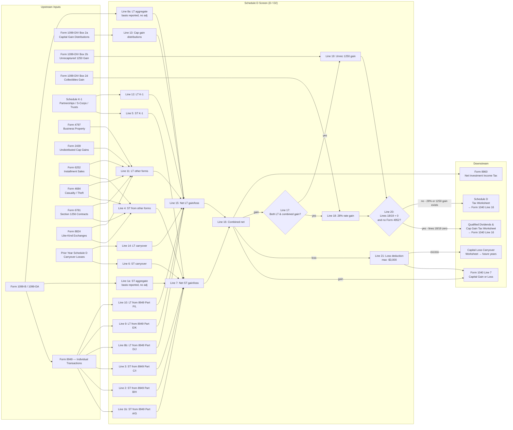

# Schedule D — Capital Gains and Losses

## Overview

Schedule D (Form 1040) captures all capital asset sales and dispositions,
aggregates them from Form 8949, applies the correct tax rates (0%/15%/20% for
long-term, ordinary rates for short-term, 25% for unrecaptured Section 1250, and
28% for collectibles), and carries the net result to Form 1040 Line 7. It also
handles capital loss carryovers from prior years, capital gain distributions
from mutual funds/REITs, and gains/losses from other forms (installment sales,
like-kind exchanges, casualties, K-1s). The engine must implement two entry
surfaces: the individual transaction screen (Form 8949) and the aggregate
summary screen (Schedule D / D2), then compute through up to three nested
worksheets depending on gain composition.

**IRS Form:** Schedule D (Form 1040) + Form 8949 (Sales and Other Dispositions
of Capital Assets) **Drake Screen:** D (alias: D2) for aggregate/carryover
entries; 8949 screen for individual transactions **Tax Year:** 2025 **Drake
Reference (Lines 1a/8a):** https://kb.drakesoftware.com/kb/Drake-Tax/12530.htm
**Drake Reference (Carryover):**
https://kb.drakesoftware.com/kb/Drake-Tax/11406.htm **Drake Reference (Line
12):** https://kb.drakesoftware.com/kb/Drake-Tax/11601.htm **Drake Reference
(8949 Import):** https://kb.drakesoftware.com/kb/Drake-Tax/10139.htm **Drake
Reference (8949 Codes):** https://kb.drakesoftware.com/kb/Drake-Tax/13157.htm

---

## Data Entry Fields

There are two entry surfaces. **Surface 1: Form 8949 (individual transactions)**
— one screen per transaction. **Surface 2: Schedule D / D2 screen (aggregate
entries and carryovers)** — direct line entries and prior-year carryovers.

### Surface 1: Form 8949 Fields (per transaction)

Required fields first, then optional.

| Field             | Type                     | Required | Drake Label                           | Description                                                                                                                                                                                                                                                                                                                       | IRS Reference                                         | URL                                    |
| ----------------- | ------------------------ | -------- | ------------------------------------- | --------------------------------------------------------------------------------------------------------------------------------------------------------------------------------------------------------------------------------------------------------------------------------------------------------------------------------- | ----------------------------------------------------- | -------------------------------------- |
| part              | enum                     | yes      | "Applicable Part I/Part II check box" | Which part of 8949 this transaction belongs to. Short-term: A (basis reported to IRS), B (basis NOT reported), C (no 1099-B). Long-term: D (basis reported to IRS), E (basis NOT reported), F (no 1099-B). For digital assets, short-term: G (basis reported), H (basis not reported), I (no 1099-B/1099-DA); long-term: J, K, L. | Form 8949 Instructions, Part I and Part II checkboxes | https://www.irs.gov/instructions/i8949 |
| description       | string                   | yes      | Column (a): Description of property   | Text description of the property sold. For stocks: number of shares + name (e.g., "100 sh XYZ Corp"). For digital assets: include units and identifier. For real estate: address.                                                                                                                                                 | Form 8949 Instructions, col (a)                       | https://www.irs.gov/instructions/i8949 |
| date_acquired     | date or string           | yes      | Column (b): Date acquired             | Date the property was acquired. Format: MM/DD/YYYY. Special values allowed: "VARIOUS" (if multiple acquisition dates) or "INHERITED" (if property was inherited — see holding period rules below).                                                                                                                                | Form 8949 Instructions, col (b)                       | https://www.irs.gov/instructions/i8949 |
| date_sold         | date                     | yes      | Column (c): Date sold or disposed of  | Date the property was sold or disposed of (use trade date for securities). Format: MM/DD/YYYY.                                                                                                                                                                                                                                    | Form 8949 Instructions, col (c)                       | https://www.irs.gov/instructions/i8949 |
| proceeds          | number                   | yes      | Column (d): Proceeds (sales price)    | Gross proceeds from the sale. If no Form 1099-B was received, enter net proceeds (after selling expenses). If a 1099-B was received, enter gross proceeds even if selling expenses were also reported. Can be $0 but not negative.                                                                                                | Form 8949 Instructions, col (d)                       | https://www.irs.gov/instructions/i8949 |
| cost_basis        | number                   | yes      | Column (e): Cost or other basis       | Original cost plus improvements, adjusted for stock splits, return of capital distributions, wash sale disallowances, or other basis adjustments. For inherited property: use fair market value at date of death (or alternate valuation date).                                                                                   | Form 8949 Instructions, col (e)                       | https://www.irs.gov/instructions/i8949 |
| adjustment_codes  | string (up to ~40 chars) | no       | Column (f): Code(s)                   | One or more adjustment codes (alphabetical order if multiple, separated by space). See Adjustment Codes table below. Enter only if an adjustment is needed.                                                                                                                                                                       | Form 8949 Instructions, col (f)                       | https://www.irs.gov/instructions/i8949 |
| adjustment_amount | number                   | no       | Column (g): Amount of adjustment      | Dollar amount of the adjustment. Negative amounts are losses/reductions (entered in parentheses on paper form; use negative number in system). If multiple codes apply, enter the NET adjustment in col (g).                                                                                                                      | Form 8949 Instructions, col (g)                       | https://www.irs.gov/instructions/i8949 |

**Column (h) — Gain or Loss — is COMPUTED, not entered:**
`col_h = col_d − col_e + col_g`

If col_h is positive → gain. If negative → loss (enter as negative).

### Form 8949 Adjustment Codes (Column f)

| Code | Situation                                                                                     | Column (g) Entry                                                                                |
| ---- | --------------------------------------------------------------------------------------------- | ----------------------------------------------------------------------------------------------- |
| B    | Incorrect basis shown on 1099-B/1099-DA (basis reported to IRS)                               | Positive if basis was overstated (reduces gain); negative if understated                        |
| C    | Collectibles gain or loss (artwork, antiques, bullion, gems, stamps, coins, alcohol)          | Enter 0 unless another code also applies                                                        |
| D    | Accrued market discount on bond reported on 1099-B                                            | Use accrued market discount worksheet; enter negative amount (ordinary income portion excluded) |
| E    | Selling expenses, digital asset transaction costs, or option premiums not reflected on 1099-B | Negative for expenses/costs paid; positive for option premiums received                         |
| H    | Sale of main home with eligible Section 121 exclusion                                         | Enter excluded amount as negative (in parentheses)                                              |
| L    | Nondeductible loss (not a wash sale)                                                          | Enter loss amount as positive                                                                   |
| M    | Multiple transactions reported on one row under Exception 2                                   | Enter 0 unless another code also applies                                                        |
| N    | Received 1099-B as nominee for actual owner                                                   | Enter adjustment to bring col (h) to $0                                                         |
| O    | Contingent payment debt instrument or other non-listed adjustment                             | Use contingent payment worksheet if applicable                                                  |
| P    | Nonresident alien/foreign entity selling partnership interest in U.S. trade/business          | Apply Regulations §1.864(c)(8)-1                                                                |
| Q    | Qualified small business (QSB) stock with eligible Section 1202 exclusion                     | Enter excluded amount as negative                                                               |
| R    | Gain deferred via rollover (e.g., empowerment zone, rollover from QSB stock)                  | Enter postponed gain as negative                                                                |
| S    | Section 1244 small business stock loss exceeding $100,000 ordinary loss limit                 | See Schedule D instructions                                                                     |
| T    | Incorrect gain/loss type shown on 1099-B (e.g., short-term reported as long-term)             | Enter 0; report on the correct Part                                                             |
| W    | Wash sale nondeductible loss                                                                  | Enter disallowed loss amount as positive                                                        |
| X    | DC Zone asset or qualified community asset gain exclusion                                     | Enter excluded amount as negative                                                               |
| Y    | Previously deferred QOF (Qualified Opportunity Fund) gain being recognized                    | See QOF disposition instructions                                                                |
| Z    | Electing to defer eligible gain by investing in QOF                                           | Enter deferred gain as negative                                                                 |

### Surface 2: Schedule D / D2 Screen Fields (aggregate and carryover entries)

| Field                 | Type   | Required | Drake Label                                    | Description                                                                                                                                                                                                                                                                        | IRS Reference               | URL                                      |
| --------------------- | ------ | -------- | ---------------------------------------------- | ---------------------------------------------------------------------------------------------------------------------------------------------------------------------------------------------------------------------------------------------------------------------------------- | --------------------------- | ---------------------------------------- |
| line_1a_proceeds      | number | no       | "Proceeds" (Line 1a)                           | Total short-term proceeds from all 1099-B/1099-DA transactions where basis was reported to IRS, with NO adjustments needed (no boxes 1f/1g amounts, ordinary box unchecked, QOF box unchecked). This is the aggregate of all such transactions — do NOT list individually on 8949. | Sch D Instructions, Line 1a | https://www.irs.gov/instructions/i1040sd |
| line_1a_cost          | number | no       | "Cost or other basis" (Line 1a)                | Total cost/basis for the transactions aggregated in line_1a_proceeds. Must match same transactions.                                                                                                                                                                                | Sch D Instructions, Line 1a | https://www.irs.gov/instructions/i1040sd |
| line_8a_proceeds      | number | no       | "Proceeds" (Line 8a)                           | Total long-term proceeds from all 1099-B/1099-DA transactions where basis was reported to IRS, with NO adjustments needed. Aggregate of all such long-term transactions.                                                                                                           | Sch D Instructions, Line 8a | https://www.irs.gov/instructions/i1040sd |
| line_8a_cost          | number | no       | "Cost or other basis" (Line 8a)                | Total cost/basis for the transactions aggregated in line_8a_proceeds.                                                                                                                                                                                                              | Sch D Instructions, Line 8a | https://www.irs.gov/instructions/i1040sd |
| line_6_carryover      | number | no       | Line 6: Short-term capital loss carryover      | Short-term capital loss carryover from 2024 return. Enter as positive number; treated as a loss (negative) in computation. From prior year Capital Loss Carryover Worksheet line 8.                                                                                                | Sch D Instructions, Line 6  | https://www.irs.gov/instructions/i1040sd |
| line_14_carryover     | number | no       | Line 14: Long-term capital loss carryover      | Long-term capital loss carryover from 2024 return. Enter as positive number; treated as a loss (negative) in computation. From prior year Capital Loss Carryover Worksheet line 13.                                                                                                | Sch D Instructions, Line 14 | https://www.irs.gov/instructions/i1040sd |
| line_12_cap_gain_dist | number | no       | Line 12: Capital gain distributions            | Total capital gain distributions from mutual funds, REITs, or regulated investment companies (from Form 1099-DIV box 2a). Always treated as long-term regardless of how long shares were held. Enter 0 if none.                                                                    | Sch D Instructions, Line 12 | https://www.irs.gov/instructions/i1040sd |
| line_11_form2439      | number | no       | Line 11: Undistributed long-term capital gains | Undistributed long-term capital gains from Form 2439 (box 1a). Also include Form 4797 Part I overall gain, installment gains from Form 6252, casualties from Form 4684, Section 1256 contracts from Form 6781, like-kind exchanges from Form 8824.                                 | Sch D Instructions, Line 11 | https://www.irs.gov/instructions/i1040sd |
| line_4_other_st       | number | no       | Line 4: Short-term from other forms            | Net short-term gain/loss from Form 6252 (installment), Form 4684 (casualty), Form 6781 (Section 1256), Form 8824 (like-kind exchange).                                                                                                                                             | Sch D Instructions, Line 4  | https://www.irs.gov/instructions/i1040sd |
| line_5_k1_st          | number | no       | Line 5: Short-term K-1 gain/loss               | Net short-term capital gain/loss from pass-through entities (Schedule K-1 from partnerships, S corps, estates, trusts).                                                                                                                                                            | Sch D Instructions, Line 5  | https://www.irs.gov/instructions/i1040sd |
| line_12_k1_lt         | number | no       | Line 12: Long-term K-1 gain/loss               | Net long-term capital gain/loss from pass-through entities (Schedule K-1). Note: line 12 on the form combines K-1 long-term gains AND capital gain distributions in the form itself; in the engine, track separately and sum.                                                      | Sch D Instructions, Line 12 | https://www.irs.gov/instructions/i1040sd |

**Note:** Lines 1b, 2, 3, 8b, 9, 10 are populated by summing Form 8949
transactions grouped by their Part checkbox (A/B/C or D/E/F). These are not
direct user entries on the D2 screen — they are computed from 8949 entries.

---

## Per-Field Routing

### Form 8949 Fields → Schedule D

| Field                                  | Destination                             | How Used                                                                                              | Triggers      | Limit / Cap                        | IRS Reference                     | URL                                      |
| -------------------------------------- | --------------------------------------- | ----------------------------------------------------------------------------------------------------- | ------------- | ---------------------------------- | --------------------------------- | ---------------------------------------- |
| part = A or G (ST, basis reported)     | Sch D Line 1b, cols (d)(e)(g)(h)        | Summed across all Part A/G transactions; totals flow to Sch D line 1b                                 | None          | None                               | Sch D Instructions, Line 1b       | https://www.irs.gov/instructions/i1040sd |
| part = B or H (ST, basis NOT reported) | Sch D Line 2, cols (d)(e)(g)(h)         | Summed across all Part B/H transactions                                                               | None          | None                               | Sch D Instructions, Line 2        | https://www.irs.gov/instructions/i1040sd |
| part = C or I (ST, no 1099-B)          | Sch D Line 3, cols (d)(e)(g)(h)         | Summed across all Part C/I transactions                                                               | None          | None                               | Sch D Instructions, Line 3        | https://www.irs.gov/instructions/i1040sd |
| part = D or J (LT, basis reported)     | Sch D Line 8b, cols (d)(e)(g)(h)        | Summed across all Part D/J transactions                                                               | None          | None                               | Sch D Instructions, Line 8b       | https://www.irs.gov/instructions/i1040sd |
| part = E or K (LT, basis NOT reported) | Sch D Line 9, cols (d)(e)(g)(h)         | Summed across all Part E/K transactions                                                               | None          | None                               | Sch D Instructions, Line 9        | https://www.irs.gov/instructions/i1040sd |
| part = F or L (LT, no 1099-B)          | Sch D Line 10, cols (d)(e)(g)(h)        | Summed across all Part F/L transactions                                                               | None          | None                               | Sch D Instructions, Line 10       | https://www.irs.gov/instructions/i1040sd |
| adjustment_code = C (collectible)      | Sch D Line 18 (28% Rate Gain Worksheet) | Triggers 28% Rate Gain Worksheet; collectible gain taxed at 28% max rate                              | line_17 = yes | 28% max rate                       | Sch D Instructions, Line 18       | https://www.irs.gov/instructions/i1040sd |
| adjustment_code = Q (QSB exclusion)    | Sch D Line 18 (28% Rate Gain Worksheet) | Triggers 28% Rate Gain Worksheet; exclusion reduces gain but remaining section 1202 gain taxed at 28% | line_17 = yes | 28% max rate                       | Sch D Instructions, Line 18       | https://www.irs.gov/instructions/i1040sd |
| adjustment_code = H (home exclusion)   | col (g) reduces col (h)                 | Excluded gain does NOT appear in Sch D totals                                                         | None          | $250,000 (single) / $500,000 (MFJ) | IRC §121; Form 8949 Instructions  | https://www.irs.gov/instructions/i8949   |
| adjustment_code = W (wash sale)        | col (g) disallows loss                  | Disallowed loss added back to basis of replacement shares; NOT deductible                             | None          | None                               | IRC §1091; Form 8949 Instructions | https://www.irs.gov/instructions/i8949   |

### Schedule D / D2 Fields → Form 1040

| Field                                              | Destination                                        | How Used                                                                                                      | Triggers                           | Limit / Cap                  | IRS Reference                              | URL                                      |
| -------------------------------------------------- | -------------------------------------------------- | ------------------------------------------------------------------------------------------------------------- | ---------------------------------- | ---------------------------- | ------------------------------------------ | ---------------------------------------- |
| line_1a_proceeds / line_1a_cost                    | Sch D Line 1a                                      | Entered directly; gain/loss = proceeds − cost                                                                 | None                               | None                         | Sch D Instructions, Line 1a                | https://www.irs.gov/instructions/i1040sd |
| line_8a_proceeds / line_8a_cost                    | Sch D Line 8a                                      | Entered directly; gain/loss = proceeds − cost                                                                 | None                               | None                         | Sch D Instructions, Line 8a                | https://www.irs.gov/instructions/i1040sd |
| line_6_carryover                                   | Sch D Line 6                                       | Subtracted in Part I computation (treated as loss)                                                            | None                               | None                         | Sch D Instructions, Line 6                 | https://www.irs.gov/instructions/i1040sd |
| line_14_carryover                                  | Sch D Line 14                                      | Subtracted in Part II computation (treated as loss)                                                           | None                               | None                         | Sch D Instructions, Line 14                | https://www.irs.gov/instructions/i1040sd |
| line_12_cap_gain_dist                              | Sch D Line 13                                      | Added to Part II long-term total                                                                              | None                               | None                         | Sch D Instructions, Line 13                | https://www.irs.gov/instructions/i1040sd |
| Sch D Line 16 (net gain)                           | Form 1040 Line 7                                   | If positive gain: enter on Form 1040 Line 7; complete Lines 17–22                                             | Triggers tax computation worksheet | None                         | 1040 Instructions, Line 7                  | https://www.irs.gov/instructions/i1040gi |
| Sch D Line 21 (loss deduction)                     | Form 1040 Line 7                                   | If Line 16 is a loss: enter the LESSER of Line 16 loss OR $3,000 ($1,500 MFS) as negative on Form 1040 Line 7 | None                               | $3,000 ($1,500 MFS) annually | Sch D Instructions, Line 21; IRS Topic 409 | https://www.irs.gov/taxtopics/tc409      |
| Sch D Line 16 (gain) + Sch D Line 19 > 0           | Unrecaptured Section 1250 Gain Worksheet           | Must complete if line 17=yes and 1250 property sold                                                           | line_17 = yes                      | 25% max rate                 | Sch D Instructions, Line 19                | https://www.irs.gov/instructions/i1040sd |
| Sch D Line 18 (28% gain)                           | Schedule D Tax Worksheet                           | If > 0, must use Schedule D Tax Worksheet (not Qualified Dividends worksheet)                                 | line_18 > 0 OR line_19 > 0         | 28% max rate                 | Sch D Instructions, Line 20                | https://www.irs.gov/instructions/i1040sd |
| Sch D net LTCG (if lines 18=0, 19=0, no Form 4952) | Qualified Dividends and Capital Gain Tax Worksheet | Use simpler worksheet to compute preferential rate tax                                                        | line_20 = yes                      | 0%/15%/20%                   | 1040 Instructions, Line 16                 | https://www.irs.gov/instructions/i1040gi |

---

## Calculation Logic

### Step 1 — Aggregate Form 8949 Transactions by Part

For each distinct Form 8949 checkbox (A, B, C, G, H, I for Part I; D, E, F, J,
K, L for Part II):

```
For each Part-A/G transaction: sum col(d) proceeds, col(e) cost, col(g) adj, col(h) gain/loss
→ Place on Schedule D Line 1b (cols d, e, g, h)

For each Part-B/H transaction: sum → Sch D Line 2
For each Part-C/I transaction: sum → Sch D Line 3
For each Part-D/J transaction: sum → Sch D Line 8b
For each Part-E/K transaction: sum → Sch D Line 9
For each Part-F/L transaction: sum → Sch D Line 10
```

> **Source:** Form 8949 Instructions (2025), pp. 1–3 —
> https://www.irs.gov/instructions/i8949

### Step 2 — Compute Schedule D Part I (Short-Term)

```
Line 7 = Line 1a(h) + Line 1b(h) + Line 2(h) + Line 3(h) + Line 4 + Line 5 − Line 6_carryover
```

Where:

- Line 1a(h) = line_1a_proceeds − line_1a_cost
- Line 1b through Line 3 = summed col(h) from 8949 transactions (grouped by
  checkbox)
- Line 4 = other form short-term gain/loss (Form 6252, 4684, 6781, 8824)
- Line 5 = K-1 short-term gain/loss
- Line 6 = prior year short-term capital loss carryover (enters as
  negative/loss)

Result: Line 7 may be positive (net short-term gain) or negative (net short-term
loss). Short-term gains/losses are taxed/deducted at **ordinary income rates**
(same as wages).

> **Source:** Schedule D Instructions (2025), Part I line descriptions —
> https://www.irs.gov/instructions/i1040sd

### Step 3 — Compute Schedule D Part II (Long-Term)

```
Line 15 = Line 8a(h) + Line 8b(h) + Line 9(h) + Line 10(h) + Line 11 + Line 12_combined + Line 13 − Line 14_carryover
```

Where:

- Line 8a(h) = line_8a_proceeds − line_8a_cost
- Line 8b through Line 10 = summed col(h) from 8949 transactions (grouped by
  checkbox)
- Line 11 = Form 4797/2439/6252/4684/6781/8824 long-term gains
- Line 12_combined = K-1 long-term gain/loss
- Line 13 = capital gain distributions (Form 1099-DIV box 2a) — always long-term
- Line 14 = prior year long-term capital loss carryover (enters as
  negative/loss)

Result: Line 15 may be positive (net long-term gain) or negative (net long-term
loss). Long-term gains use preferential rates (0%/15%/20%) — see Step 7.

> **Source:** Schedule D Instructions (2025), Part II line descriptions —
> https://www.irs.gov/instructions/i1040sd

### Step 4 — Compute Schedule D Part III Summary

```
Line 16 = Line 7 + Line 15
```

**Branch A — Line 16 is a LOSS:**

- Skip Lines 17–20
- Line 21 = lesser of |Line 16| or $3,000 ($1,500 if MFS)
- Enter Line 21 as negative on Form 1040 Line 7
- Excess loss (|Line 16| − $3,000) carries forward — compute via Capital Loss
  Carryover Worksheet

**Branch B — Line 16 is ZERO:**

- Skip Lines 17–21
- Enter $0 on Form 1040 Line 7
- Go to Line 22

**Branch C — Line 16 is a GAIN:**

- Enter Line 16 on Form 1040 Line 7
- Proceed to Line 17

> **Source:** Schedule D Instructions (2025), Part III —
> https://www.irs.gov/instructions/i1040sd

### Step 5 — Line 17 Gate

```
Line 17 = "Yes" if (Line 15 > 0) AND (Line 16 > 0)
Line 17 = "No" if either condition fails → skip to Line 22
```

If Line 17 = "No": tax on Line 16 is computed at ordinary income rates (no
preferential LTCG rates apply).

> **Source:** Schedule D Instructions (2025), Line 17 —
> https://www.irs.gov/instructions/i1040sd

### Step 6 — 28% Rate Gain Worksheet (if applicable)

**Trigger:** Line 17 = "Yes" AND at least one of:

- Any Form 8949 Part II transaction has adjustment code "C" (collectible)
- Any Form 8949 Part II transaction has adjustment code "Q" (QSB exclusion)
- Form 1099-DIV box 2d > 0 (collectibles from mutual fund)
- Collectibles gains/losses reported on Forms 4684, 6252, 6781, 8824
- K-1 showing collectibles gain

**28% Rate Gain Worksheet Steps (from Schedule D Instructions):**

```
Line 1: Collectibles gains/losses from Form 8949, Part II (col h for C-coded transactions only)
Line 2: Section 1202 exclusion adjustment (QSB stock, code Q):
         - 50% exclusion: enter full exclusion amount
         - 60% exclusion: enter 2/3 of exclusion amount
         - 75% exclusion: enter 1/3 of exclusion amount
         - 100% exclusion: do NOT enter (excluded entirely, not taxed at 28%)
Line 3: Collectibles from Forms 4684/6252/6781/8824 (long-term portions)
Line 4: Collectibles gain from Form 1099-DIV box 2d or Form 2439 box 1d
Line 5: Collectibles from Schedule K-1
Line 6: Net short-term capital loss from Sch D Line 7 (if negative, enter as positive; if positive, enter 0)
Line 7: Long-term capital loss carryover from Sch D Line 14
Line 8 (result): Lines 1 + 2 + 3 + 4 + 5 − Line 6 − Line 7; if zero or less, enter 0
```

If Line 8 > 0 → enter on Schedule D Line 18. 28% rate gain is taxed at maximum
28% rate (not the preferential 0%/15%/20% rates).

> **Source:** Schedule D Instructions (2025), 28% Rate Gain Worksheet —
> https://www.irs.gov/instructions/i1040sd

### Step 7 — Unrecaptured Section 1250 Gain Worksheet (if applicable)

**Trigger:** Line 17 = "Yes" AND at least one of:

- Sold/disposed of section 1250 property (depreciated real property) held > 1
  year
- Received installment payments for section 1250 property held > 1 year
- K-1 shows unrecaptured section 1250 gain
- Form 1099-DIV box 2b > 0 (from REIT/mutual fund)
- Form 2439 box 1b > 0

**Definition:** Unrecaptured Section 1250 gain = the lesser of (a) depreciation
claimed on the real property, or (b) the total gain on the property. This
portion is taxed at a maximum 25% rate (not the lower 0%/15%/20% LTCG rates).

**Worksheet Steps:**

```
For each section 1250 property sold:
  Step 1: Depreciation claimed (from Form 4797, line 22)
  Step 2: Subtract ordinary income recapture (Form 4797, line 26g)
  Step 3: For installment sales, allocate proportionally to current year payments

Sum from all sources:
  Line 1: Section 1250 gain from Form 4797 for each property
  Line 2+: Additional lines for each property
  Line 11: Gain from Form 1099-DIV box 2b or Form 2439 box 1b
  Net: After reducing by net short-term capital loss (Sch D Line 7 if negative) and long-term carryover
  Final result: Enter on Schedule D Line 19
```

Unrecaptured Section 1250 gain is taxed at maximum 25%.

> **Source:** Schedule D Instructions (2025), Unrecaptured Section 1250 Gain
> Worksheet — https://www.irs.gov/instructions/i1040sd

### Step 8 — Line 20 Worksheet Selection Gate

```
Line 20 = "Yes" if:
  Schedule D Line 18 = 0 (or blank)
  AND Schedule D Line 19 = 0 (or blank)
  AND taxpayer is NOT claiming investment interest expense deduction on Form 4952

Line 20 = "No" if any of the above conditions fails
```

- **If Line 20 = "Yes":** Use the **Qualified Dividends and Capital Gain Tax
  Worksheet** (in Form 1040 Instructions, Line 16) to compute tax on capital
  gains. Skip Lines 21–22.
- **If Line 20 = "No":** Use the **Schedule D Tax Worksheet** (in Schedule D
  Instructions) to compute tax on capital gains.
- **If Line 16 is a loss:** Skip Lines 17–20; use Line 21 (loss limitation).

> **Source:** Schedule D Instructions (2025), Line 20 —
> https://www.irs.gov/instructions/i1040sd; TeachMePersonalFinance.com Schedule
> D Instructions —
> https://www.teachmepersonalfinance.com/irs-schedule-d-instructions/

### Step 9 — Qualified Dividends and Capital Gain Tax Worksheet (Line 20 = "Yes")

This worksheet is in the Form 1040 Instructions (Line 16). Agent MUST verify
exact 2025 line numbers from https://www.irs.gov/instructions/i1040gi. The
conceptual structure (from IRS instructions):

```
When to use: Line 20 = "Yes" (Lines 18 and 19 = 0 or blank AND no Form 4952 investment interest)
OR: taxpayer has qualified dividends on Form 1040 Line 3a

Structure:
Line 1: Taxable income (Form 1040 Line 15)
Line 2: Net qualified dividends (Form 1040 Line 3a)
Line 3: Net capital gain (smaller of Sch D Line 15 or Sch D Line 16, if gain; else -0-)
Line 4: Line 2 + Line 3 (total preferential income)
Line 5: Line 1 − Line 4; if zero or less, enter -0- (ordinary income portion)
Line 6: 0% rate upper threshold by filing status:
         Single: $48,350
         MFJ/QSS: $96,700
         MFS: $48,350
         HOH: $64,750
Line 7: Lesser of Line 1 or Line 6
Line 8: Lesser of Line 5 or Line 7
Line 9: Line 7 − Line 8 (amount taxed at 0% — zero LTCG tax)
Line 10: Lesser of Line 1 or Line 4
Line 11: Lesser of Line 9 or Line 10 (entered as the amount already handled at 0%)
Line 12: Line 10 − Line 11
Line 13: 15% rate upper threshold by filing status:
          Single: $533,400
          MFJ/QSS: $600,050
          MFS: $300,000
          HOH: $566,700
Line 14: Lesser of Line 1 or Line 13
Line 15: Line 5 + Line 9
Line 16: Line 14 − Line 15; if zero or less, enter -0-
Line 17: Lesser of Line 12 or Line 16 (income taxed at 15%)
Line 18: Line 17 × 0.15
Line 19: Line 11 + Line 17
Line 20: Line 10 − Line 19 (income taxed at 20%)
Line 21: Line 20 × 0.20
Line 22: Compute tax on Line 5 using Tax Table or Tax Computation Worksheet
Line 23: Lines 18 + 21 + 22 (sum of all rate-bucket taxes)
Line 24: Compute tax on Line 1 at ordinary rates using Tax Table
Line 25: SMALLER of Line 23 or Line 24 → enter on Form 1040 Line 16
```

> **Source:** Conceptual structure from WhiteCoatInvestor.com
> (https://www.whitecoatinvestor.com/qualified-dividends-capital-gain-tax-worksheet/)
> and IRS 1040 Instructions (Line 16). Agent MUST verify exact 2025 lines from
> https://www.irs.gov/instructions/i1040gi. The 2025 thresholds are from IRS
> Topic 409: https://www.irs.gov/taxtopics/tc409. The Schedule D Tax Worksheet
> in research/docs/i1040sd.pdf confirms $48,350/$96,700/$64,750 and
> $533,400/$300,000/$600,050/$566,700 as the correct TY2025 values.

### Step 10 — Schedule D Tax Worksheet (Line 20 = "No")

**When to use:** Line 18 (28% rate gain) > 0 OR Line 19 (unrecaptured 1250 gain)

> 0 OR taxpayer claims Form 4952 investment interest expense deduction (and Line
> 4g > 0).

**Exception — do NOT use either worksheet if:** (a) Sch D Lines 15 and 16 are
zero or negative AND no qualified dividends, OR (b) Form 1040 Line 15 is zero or
less. In these cases, see Form 1040 Line 16 instructions.

**Complete worksheet (extracted from i1040sd.pdf — 2025 official form):**

```
Line 1:  Taxable income (Form 1040 Line 15). If filing Form 2555, use Foreign Earned Income
         Tax Worksheet line 3 instead.
Line 2:  Qualified dividends (Form 1040 Line 3a)
Line 3:  Form 4952 line 4g (investment interest expense for preference items; enter -0- if no Form 4952)
Line 4:  Form 4952 line 4e* (or lesser amount from dotted line next to 4e)
Line 5:  Line 3 − Line 4; if zero or less, enter -0-
Line 6:  Line 2 − Line 5; if zero or less, enter -0- (adjusted qualified dividends)
Line 7:  Smaller of Schedule D line 15 or Schedule D line 16 (net LTCG)
Line 8:  Smaller of Line 3 or Line 4
Line 9:  Line 7 − Line 8; if zero or less, enter -0-
Line 10: Line 6 + Line 9 (total preferential income)
Line 11: Schedule D lines 18 + 19 (sum of 28%-rate and unrecaptured 1250 gain)
Line 12: Smaller of Line 9 or Line 11
Line 13: Line 10 − Line 12
Line 14: Line 1 − Line 13; if zero or less, enter -0-
Line 15: 0% rate upper threshold by filing status:
          Single or MFS: $48,350
          MFJ/QSS: $96,700
          HOH: $64,750
Line 16: Smaller of Line 1 or Line 15
Line 17: Smaller of Line 14 or Line 16
Line 18: Line 1 − Line 10 (ordinary income portion that stays below the 0% bracket)
         [Note: actual line is more complex; see PDF]
Line 19: Smaller of Line 1 or:
          Single or MFS: $197,300
          MFJ/QSS: $394,600
          HOH: $197,300
Line 20: Smaller of Line 14 or Line 19
Line 21: Larger of Line 18 or Line 20
Line 22: Line 16 − Line 17 (income taxed at 0% rate — zero tax)
         [If Lines 1 and 16 are the same, skip lines 23–43 and go to line 44]
Line 23: Smaller of Line 1 or Line 13
Line 24: Line 22 (or -0- if blank)
Line 25: Line 23 − Line 24; if zero or less, enter -0-
Line 26: 15% rate upper threshold by filing status:
          Single: $533,400
          MFS: $300,000
          MFJ/QSS: $600,050
          HOH: $566,700
Line 27: Smaller of Line 1 or Line 26
Line 28: Line 21 + Line 22
Line 29: Line 27 − Line 28; if zero or less, enter -0-
Line 30: Smaller of Line 25 or Line 29
         [If Lines 1 and 32 are the same, skip lines 33–43 and go to line 44]
Line 31: Line 30 × 0.15 (tax at 15% rate)
Line 32: Line 24 + Line 30
Line 33: Line 23 − Line 32
Line 34: Line 33 × 0.20 (tax at 20% rate)
         [If Schedule D Line 19 is zero or blank, skip lines 35–40 and go to line 41]
Line 35: Smaller of Line 9 (above) or Schedule D Line 19
Line 36: Line 10 + Line 21
Line 37: Amount from Line 1
Line 38: Line 36 − Line 37; if zero or less, enter -0-
Line 39: Line 35 − Line 38; if zero or less, enter -0-
Line 40: Line 39 × 0.25 (tax at 25% rate on unrecaptured 1250 gain)
         [If Schedule D Line 18 is zero or blank, skip lines 41–43 and go to line 44]
Line 41: Line 21 + Line 22 + Line 30 + Line 33 + Line 39
Line 42: Line 1 − Line 41
Line 43: Line 42 × 0.28 (tax at 28% rate on collectibles/QSB gain)
Line 44: Tax on Line 21 using Tax Table (if < $100,000) or Tax Computation Worksheet (if ≥ $100,000)
Line 45: Lines 31 + 34 + 40 + 43 + 44 (sum of all buckets)
Line 46: Tax on Line 1 (entire taxable income) using Tax Table or Tax Computation Worksheet
Line 47: SMALLER of Line 45 or Line 46 → enter on Form 1040 Line 16
```

**Footnotes:**

- Line 4: Use lesser of the amount on line 4e of Form 4952, or the smaller
  amount from dotted line next to 4e (if applicable)
- Lines 6 and others: If filing Form 2555, see Foreign Earned Income Tax
  Worksheet footnote in 1040 Instructions before completing

> **Source:** Schedule D Instructions (2025), Schedule D Tax Worksheet —
> extracted from research/docs/i1040sd.pdf (verified download). URL:
> https://www.irs.gov/pub/irs-pdf/i1040sd.pdf

### Step 11 — 28% Rate Gain Worksheet (Complete)

**Trigger:** Line 17 = "Yes" AND collectibles gain or Section 1202 QSB stock
exclusion on Form 8949 Part II.

**Complete worksheet (extracted from i1040sd.pdf):**

```
Line 1: Total collectibles gain/(loss) from Form 8949, Part II (col h, for collectibles transactions)
Line 2: Section 1202 exclusion amounts (positive number):
         - 50% exclusion: enter the full exclusion amount
         - 60% exclusion: enter 2/3 of the exclusion amount
         - 75% exclusion: enter 1/3 of the exclusion amount
         - 100% exclusion: DO NOT enter anything (no 28% tax on this portion)
Line 3: Total collectibles gain/(loss) from Form 4684 line 4 (only if Form 4684 line 15 > 0);
         Form 6252; Form 6781 Part II; and Form 8824
Line 4: Total collectibles gain from:
         - Form 1099-DIV box 2d
         - Form 2439 box 1d
         - Schedule K-1 from partnership, S corp, estate, or trust
Line 5: Long-term capital loss carryover from Schedule D line 14; and
         Schedule K-1 (Form 1041) box 11 code D (enter as negative/loss)
Line 6: Schedule D line 7, if a loss — enter as negative. If line 7 is zero or gain, enter -0-
Line 7: Lines 1 + 2 + 3 + 4 + 5 + 6 (combine all). If zero or less, enter -0-.
         If > 0, also enter this amount on Schedule D, line 18.
```

> **Source:** Schedule D Instructions (2025), 28% Rate Gain Worksheet—Line 18 —
> extracted from research/docs/i1040sd.pdf. URL:
> https://www.irs.gov/pub/irs-pdf/i1040sd.pdf

### Step 12 — Unrecaptured Section 1250 Gain Worksheet (Complete)

**Trigger:** Line 17 = "Yes" AND section 1250 property disposed, installment
payments received, K-1 with 1250 gain, Form 1099-DIV box 2b > 0, or Form 2439
box 1b > 0.

**Complete worksheet (extracted from i1040sd.pdf):**

```
If not reporting gain on Form 4797 line 7, skip lines 1–9 and go to line 10.

Line 1:  If section 1250 property in Form 4797 Part III (not on Form 6252):
          smaller of Form 4797 line 22 or line 24 for that property.
          (If no such property, go to line 4. Multiple properties: add separately.)
Line 2:  Form 4797 line 26g for the property on line 1 (ordinary income recapture)
Line 3:  Line 1 − Line 2
Line 4:  Total unrecaptured section 1250 gain from Form 6252 line 26 or 37
          (installment sales of trade or business property held > 1 year)
Line 5:  Total from Schedule K-1 (partnership or S corp) showing "unrecaptured section 1250 gain"
Line 6:  Lines 3 + 4 + 5
Line 7:  Smaller of Line 6 or Form 4797 line 7 (overall gain)
Line 8:  Form 4797 line 8 (if any)
Line 9:  Line 7 − Line 8; if zero or less, enter -0-
Line 10: Gain from sale/exchange of partnership interest attributable to unrecaptured 1250 gain
Line 11: Total "unrecaptured section 1250 gain" reported on Schedule K-1 (estate/trust/REIT/mutual fund),
          Form 1099-DIV, Form 2439, or Form 1099-R
Line 12: Total unrecaptured 1250 gain from section 1250 property sold > 1 year for which no
          Form 4797 Part I entry was made for year of sale
Line 13: Lines 9 + 10 + 11 + 12
Line 14: If any section 1202 gain, collectibles gain, or loss: enter total of lines 1–4 from 28% Rate Gain
          Worksheet. Otherwise, enter -0-
Line 15: Schedule D line 7, if a loss — enter as negative. If zero or gain, enter -0-
Line 16: Long-term capital loss carryover from Schedule D line 14;
          Schedule K-1 (Form 1041) box 11 code D (enter as negative)
Line 17: Combine lines 14 + 15 + 16. If result is a loss, enter as positive; if zero or gain, enter -0-
Line 18: Line 13 − Line 17; if zero or less, enter -0-.
          If > 0, enter here AND on Schedule D, line 19.
```

> **Source:** Schedule D Instructions (2025), Unrecaptured Section 1250 Gain
> Worksheet—Line 19 — extracted from research/docs/i1040sd.pdf. URL:
> https://www.irs.gov/pub/irs-pdf/i1040sd.pdf

### Step 13 — Capital Loss Carryover Worksheet

**When to use:** Use this worksheet to figure carryovers from 2024 to 2025 if
your 2024 Schedule D line 21 is a loss AND either (a) that loss is smaller than
your 2024 Schedule D line 16 loss, OR (b) your 2024 Form 1040 line 15 would have
been negative. Otherwise, no carryovers exist.

**Special rule — MFS split from joint return:** If you and your spouse filed
jointly in a prior year and are now filing separately, any carryover can only be
claimed by the spouse who actually had the loss.

**Complete worksheet (extracted from i1040sd.pdf):**

```
Line 1:  2024 Form 1040/1040-SR/1040-NR Line 15 (taxable income).
          If it would have been negative, enclose in parentheses.
Line 2:  2024 Schedule D Line 21 loss — enter as a POSITIVE amount
Line 3:  Line 1 + Line 2; if zero or less, enter -0-
Line 4:  Smaller of Line 2 or Line 3

If 2024 Schedule D Line 7 is a loss → go to Line 5.
Otherwise, enter -0- on Line 5 and go to Line 9.

Line 5:  2024 Schedule D Line 7 loss — enter as a POSITIVE amount
Line 6:  2024 Schedule D Line 15 gain (if positive); if a loss, enter -0-
Line 7:  Line 4 + Line 6
Line 8:  SHORT-TERM carryover = Line 5 − Line 7; if zero or less, enter -0-
          If > 0, also enter on current year Schedule D, Line 6

If 2024 Schedule D Line 15 is a loss → go to Line 9. Otherwise, skip Lines 9–13.

Line 9:  2024 Schedule D Line 15 loss — enter as a POSITIVE amount
Line 10: 2024 Schedule D Line 7 gain (if positive); if a loss, enter -0-
Line 11: Line 4 − Line 5; if zero or less, enter -0-
Line 12: Line 10 + Line 11
Line 13: LONG-TERM carryover = Line 9 − Line 12; if zero or less, enter -0-
          If > 0, also enter on current year Schedule D, Line 14
```

Key rule: Short-term and long-term loss characters are preserved through
carryovers. Short-term carryovers offset ordinary income; long-term carryovers
offset at preferential rates. The $3,000 annual deduction limit is already
reflected in prior year Line 21 — the carryover is the EXCESS beyond that.

> **Source:** Schedule D Instructions (2025), Capital Loss Carryover
> Worksheet—Lines 6 and 14 — extracted from research/docs/i1040sd.pdf. URL:
> https://www.irs.gov/pub/irs-pdf/i1040sd.pdf

### Step 14 — Net Investment Income Tax (NIIT) — Form 8960

Capital gains (both short-term and long-term) that are included in Schedule D
are also subject to NIIT if the taxpayer's MAGI exceeds the thresholds. This is
a SEPARATE computation on Form 8960 — not computed on Schedule D itself.

```
NIIT = 3.8% × lesser of:
  (a) Net investment income (includes capital gains, dividends, interest, rents, passive income), OR
  (b) MAGI − threshold
```

Thresholds (not inflation-adjusted):

- Single / HOH: $200,000
- MFJ / QSS: $250,000
- MFS: $125,000

Capital gains flow to Form 8960 Line 5a (net gain from property dispositions).

> **Source:** IRS NIIT page —
> https://www.irs.gov/individuals/net-investment-income-tax; IRS Topic 559 —
> https://www.irs.gov/taxtopics/tc559; Form 8960 Instructions —
> https://www.irs.gov/instructions/i8960

---

## Constants & Thresholds (Tax Year 2025)

| Constant                                          | Value                                                              | Source                                    | URL                                                       |
| ------------------------------------------------- | ------------------------------------------------------------------ | ----------------------------------------- | --------------------------------------------------------- |
| LTCG 0% rate — Single                             | $0 – $48,350 taxable income                                        | IRS Topic 409 (citing Rev. Proc. 2024-40) | https://www.irs.gov/taxtopics/tc409                       |
| LTCG 0% rate — MFJ / QSS                          | $0 – $96,700 taxable income                                        | IRS Topic 409                             | https://www.irs.gov/taxtopics/tc409                       |
| LTCG 0% rate — MFS                                | $0 – $48,350 taxable income                                        | IRS Topic 409                             | https://www.irs.gov/taxtopics/tc409                       |
| LTCG 0% rate — HOH                                | $0 – $64,750 taxable income                                        | IRS Topic 409                             | https://www.irs.gov/taxtopics/tc409                       |
| LTCG 15% rate — Single                            | $48,351 – $533,400 taxable income                                  | IRS Topic 409                             | https://www.irs.gov/taxtopics/tc409                       |
| LTCG 15% rate — MFJ / QSS                         | $96,701 – $600,050 taxable income                                  | IRS Topic 409                             | https://www.irs.gov/taxtopics/tc409                       |
| LTCG 15% rate — MFS                               | $48,351 – $300,000 taxable income                                  | IRS Topic 409                             | https://www.irs.gov/taxtopics/tc409                       |
| LTCG 15% rate — HOH                               | $64,751 – $566,700 taxable income                                  | IRS Topic 409                             | https://www.irs.gov/taxtopics/tc409                       |
| LTCG 20% rate — Single                            | Above $533,400 taxable income                                      | IRS Topic 409                             | https://www.irs.gov/taxtopics/tc409                       |
| LTCG 20% rate — MFJ / QSS                         | Above $600,050 taxable income                                      | IRS Topic 409                             | https://www.irs.gov/taxtopics/tc409                       |
| LTCG 20% rate — MFS                               | Above $300,000 taxable income                                      | IRS Topic 409                             | https://www.irs.gov/taxtopics/tc409                       |
| LTCG 20% rate — HOH                               | Above $566,700 taxable income                                      | IRS Topic 409                             | https://www.irs.gov/taxtopics/tc409                       |
| Collectibles / 28%-rate gain max rate             | 28%                                                                | IRC §1(h)(4); Sch D Instructions          | https://www.irs.gov/instructions/i1040sd                  |
| Unrecaptured Section 1250 gain max rate           | 25%                                                                | IRC §1(h)(1)(D); Sch D Instructions       | https://www.irs.gov/instructions/i1040sd                  |
| Short-term capital gains rate                     | Ordinary income rates (10%–37%)                                    | IRC §1(a)–(d)                             | https://www.irs.gov/taxtopics/tc409                       |
| Capital loss annual deduction limit               | $3,000                                                             | IRC §1211(b); Sch D Line 21               | https://www.irs.gov/instructions/i1040sd                  |
| Capital loss annual deduction limit — MFS         | $1,500                                                             | IRC §1211(b); Sch D Line 21               | https://www.irs.gov/instructions/i1040sd                  |
| Short-term holding period                         | ≤ 1 year (≤ 365 days from day after acquisition through sale date) | IRC §1222(1)                              | https://www.irs.gov/taxtopics/tc409                       |
| Long-term holding period                          | > 1 year (> 365 days)                                              | IRC §1222(3)                              | https://www.irs.gov/taxtopics/tc409                       |
| Long-term holding — certain partnership interests | > 3 years                                                          | IRC §1061 (carried interest rules)        | https://www.irs.gov/instructions/i1040sd                  |
| NIIT rate                                         | 3.8%                                                               | IRC §1411                                 | https://www.irs.gov/individuals/net-investment-income-tax |
| NIIT threshold — Single / HOH                     | $200,000 MAGI                                                      | IRC §1411(b)(1)                           | https://www.irs.gov/individuals/net-investment-income-tax |
| NIIT threshold — MFJ / QSS                        | $250,000 MAGI                                                      | IRC §1411(b)(2)                           | https://www.irs.gov/individuals/net-investment-income-tax |
| NIIT threshold — MFS                              | $125,000 MAGI                                                      | IRC §1411(b)(3)                           | https://www.irs.gov/individuals/net-investment-income-tax |
| Section 121 home sale exclusion — Single          | $250,000                                                           | IRC §121(b)(1)                            | https://www.irs.gov/instructions/i8949                    |
| Section 121 home sale exclusion — MFJ             | $500,000                                                           | IRC §121(b)(2)                            | https://www.irs.gov/instructions/i8949                    |
| Wash sale window                                  | 30 days before OR after sale of substantially identical property   | IRC §1091                                 | https://www.irs.gov/instructions/i8949                    |

---

## Data Flow Diagram



---

## Edge Cases & Special Rules

### 1. Aggregate Entry Eligibility (Lines 1a and 8a)

Lines 1a and 8a are ONLY for transactions where ALL of the following apply:

1. A Form 1099-B or 1099-DA was received
2. Basis WAS reported to the IRS on that 1099-B/1099-DA
3. Box 1f (accrued market discount) on the 1099-B is blank or zero
4. Box 1g (wash sale loss disallowed) on the 1099-B is blank or zero
5. The "ordinary" checkbox on the 1099-B is NOT checked
6. The QOF checkbox on the 1099-B is NOT checked
7. No adjustments of any kind are needed

If any condition fails, the transaction MUST appear individually on Form 8949
(cannot be aggregated on line 1a/8a).

> **Source:** Schedule D Instructions (2025), Lines 1a and 8a; Drake KB article
> on Lines 1a and 8a — https://kb.drakesoftware.com/kb/Drake-Tax/12530.htm; IRS
> e-file guidelines (EF Message 2602 prohibits negative amounts on certain
> lines)

### 2. Holding Period Determination

- Count from the day AFTER the acquisition date through the sale date
  (inclusive).
- If held exactly 365 days: short-term (≤ 1 year).
- If held 366+ days: long-term.
- For inherited property: ALWAYS long-term regardless of actual holding period.
- For gifted property: use donor's acquisition date for holding period.
- For certain partnership carried interests (IRC §1061): must hold > 3 years for
  LTCG treatment.

> **Source:** IRS Topic 409 — https://www.irs.gov/taxtopics/tc409; Form 8949
> Instructions — https://www.irs.gov/instructions/i8949

### 3. Wash Sales (Code W)

If a taxpayer sells a security at a loss AND acquires substantially identical
property within 30 days before OR after the sale date, the loss is disallowed
(wash sale). Rules:

- Disallowed loss amount entered in col (g) as a POSITIVE number with code W
- The disallowed amount is added to the basis of the replacement property
- The replacement property's holding period includes the holding period of the
  sold property
- Does NOT apply to floating-NAV money market funds
- Does NOT apply to short sales; different rules apply
- Multiple wash sales on same security: net the transactions

> **Source:** IRC §1091; Form 8949 Instructions, Code W —
> https://www.irs.gov/instructions/i8949; IRS Topic 409 —
> https://www.irs.gov/taxtopics/tc409

### 4. Section 121 Home Sale Exclusion (Code H)

For the taxpayer's primary residence sold at a gain:

- Single filer may exclude up to $250,000 of gain
- MFJ may exclude up to $500,000 of gain
- Requirements: owned AND used as primary residence for 2 of the prior 5 years
- Reduced exclusion available for partial qualification (job change, health,
  unforeseen circumstances)
- The excluded amount goes in col (g) as a NEGATIVE number with code H
- If the full gain is excluded, col (h) = $0 and the transaction still appears
  on 8949
- If gain > exclusion: remaining gain is long-term and taxed at LTCG rates

> **Source:** IRC §121; Form 8949 Instructions, Code H —
> https://www.irs.gov/instructions/i8949

### 5. Capital Gain Distributions (Line 13)

Capital gain distributions from mutual funds, REITs, and regulated investment
companies (reported in Form 1099-DIV box 2a) are ALWAYS treated as long-term
capital gain regardless of how long the taxpayer has held the fund shares. They
go directly to Schedule D Line 13 — they do NOT require Form 8949.

Exception: If the fund also reports unrecaptured Section 1250 gain (box 2b) or
collectibles gain (box 2d), those amounts flow to their respective worksheets
(Lines 18 and 19).

> **Source:** Schedule D Instructions (2025), Line 13 —
> https://www.irs.gov/instructions/i1040sd

### 6. Capital Loss Carryover — Character Preservation

When losses carry forward, their character is preserved:

- Short-term losses from prior years remain short-term in the carryover (enter
  on current year Line 6)
- Long-term losses from prior years remain long-term in the carryover (enter on
  current year Line 14)
- Carryovers are computed using the Capital Loss Carryover Worksheet (13 lines)
  — see Step 11

If a taxpayer has BOTH short-term and long-term carryovers, the worksheet
determines how much of each is available. The $3,000 deduction limit interacts
with both types: short-term losses are used first (they offset higher-taxed
ordinary income first).

> **Source:** Schedule D Instructions (2025), Capital Loss Carryover Worksheet —
> https://www.irs.gov/instructions/i1040sd; Drake KB —
> https://kb.drakesoftware.com/kb/Drake-Tax/11406.htm

### 7. Negative Amounts and E-File Rules

IRS e-file schema prohibits NEGATIVE amounts on certain Schedule D lines (EF
Message 2602 in Drake). If a negative amount is mathematically correct for a
line that the e-file schema requires to be non-negative, the return cannot be
e-filed and must be paper-filed. The engine must validate this and surface an
appropriate error.

> **Source:** Drake KB on EF Message 2602 —
> https://kb.drakesoftware.com/kb/Drake-Tax/12530.htm

### 8. Multiple Form 8949 Screens / Multiple Instances

Schedule D may have hundreds of individual Form 8949 transactions (large
brokerage accounts). The engine must handle:

- Unlimited number of 8949 transaction records
- Proper grouping by Part checkbox (A/B/C/D/E/F/G/H/I/J/K/L)
- Aggregation: each group's col(d), col(e), col(g), col(h) are independently
  summed
- The col(h) sum for each group flows to the appropriate Schedule D line

> **Source:** Form 8949 Instructions — https://www.irs.gov/instructions/i8949

### 9. Digital Asset Reporting (New 2025 Checkboxes)

Form 8949 now has 12 checkboxes instead of 6, adding codes G/H/I (short-term
digital assets) and J/K/L (long-term digital assets). Digital asset transactions
(cryptocurrency, NFTs, etc.) must use these new checkboxes rather than
A/B/C/D/E/F.

- G: Short-term digital asset, basis reported to IRS on 1099-DA
- H: Short-term digital asset, basis NOT reported to IRS
- I: Short-term digital asset, no 1099-B or 1099-DA received
- J: Long-term digital asset, basis reported to IRS
- K: Long-term digital asset, basis NOT reported
- L: Long-term digital asset, no 1099-B or 1099-DA

Computationally, G/H/I totals aggregate into the same Schedule D lines as A/B/C
respectively, and J/K/L into the same lines as D/E/F. The distinction exists for
e-file schema validation.

> **Source:** Form 8949 Instructions (2025), Part I and Part II checkboxes —
> https://www.irs.gov/instructions/i8949

### 10. Collectibles — Definitions

Collectibles subject to 28% rate include: art, antiques, rugs, antiques, metals
(bullion, bars, coins — except certain U.S.-minted coins), gems, stamps,
alcoholic beverages, and any other tangible personal property classified as a
collectible under IRC §408(m). Also includes partnership interests where the
partnership holds collectibles.

Long-term collectibles losses ARE deductible at ordinary rates (not limited to
28%).

> **Source:** IRC §408(m); Schedule D Instructions (2025), 28% Rate Gain
> Worksheet — https://www.irs.gov/instructions/i1040sd

### 11. Section 1202 QSB Stock Exclusion

For qualified small business (QSB) stock acquired after September 27, 2010 and
held for more than 5 years:

- 100% exclusion: gain NOT taxed at all (do NOT enter in 28% Rate Gain
  Worksheet)
- 75% exclusion (acquired Feb 18 – Sep 27, 2010): enter 1/3 of exclusion in
  worksheet
- 60% exclusion (acquired after Feb 17, 2009): enter 2/3 of exclusion in
  worksheet
- 50% exclusion (acquired ≤ Feb 17, 2009): enter full exclusion in worksheet The
  non-excluded portion of QSB gain is taxed at 28%.

> **Source:** IRC §1202; Schedule D Instructions (2025), 28% Rate Gain Worksheet
> — https://www.irs.gov/instructions/i1040sd

### 12. Like-Kind Exchanges (Form 8824)

Real property like-kind exchanges under IRC §1031 may result in recognized gain
if boot is received. The recognized gain flows to Schedule D (if capital asset)
or Form 4797 (if business property). Form 8824 computes the gain/loss and routes
it to the appropriate line. Any unrecaptured Section 1250 gain on the exchange
must also be tracked.

> **Source:** IRC §1031; Form 8824 Instructions — [NEEDS SOURCE: verify 8824
> instructions URL for TY2025]

### 13. Installment Sales (Form 6252)

For sales reported on the installment method, only the current year's
installment payment generates a recognized gain on Schedule D. The gain is
allocated between capital gain and ordinary income based on the gross profit
percentage. Unrecaptured Section 1250 gain must also be allocated proportionally
across installment payments.

> **Source:** IRC §453; Form 6252 Instructions — [NEEDS SOURCE: verify 6252
> instructions URL for TY2025]; Schedule D Instructions, Unrecaptured Section
> 1250 Gain Worksheet — https://www.irs.gov/instructions/i1040sd

### 14. QOF (Qualified Opportunity Fund) Disposition

If the taxpayer disposed of any QOF investment during the tax year, they must:

1. Check the QOF checkbox on Schedule D page 1
2. Follow Form 8949 additional reporting requirements (use code Y for previously
   deferred gain being recognized, code Z for gain still being deferred)
3. Complete Form 8997 Part III (Qualified Opportunity Fund Investments)

Deferred gain being recognized (code Y) flows back as long-term capital gain.
Gain being deferred (code Z) reduces col(g) as a negative amount.

Note: 7-year QOF holding period basis adjustments and the 10% basis increase
expired — for 2025, only the exclusion for 10+ year holding (exclusion of gain
on QOF assets held > 10 years) remains relevant.

> **Source:** Schedule D Instructions (2025), Disposal of QOF Investment
> section; Form 8949 Instructions codes Y and Z —
> https://www.irs.gov/instructions/i1040sd

### 15. Short-Term Gains Taxed as Ordinary Income

Short-term capital gains (holding period ≤ 1 year) are taxed at the same rates
as ordinary income (wages, salary, interest). They do NOT qualify for the
0%/15%/20% preferential rates. There are no deductions or special worksheets for
short-term gains — they simply add to taxable income and are taxed at the
applicable ordinary income bracket.

> **Source:** IRC §1(h); IRS Topic 409 — https://www.irs.gov/taxtopics/tc409

### 16. Filing Status MFS Special Rules

Married Filing Separately taxpayers have:

- Annual capital loss deduction limit of $1,500 (not $3,000)
- 0% LTCG rate applies up to $48,350 taxable income
- 15% LTCG rate applies from $48,351 to $300,000
- 20% rate above $300,000
- NIIT threshold of $125,000 MAGI

> **Source:** IRC §1211(b); IRS Topic 409 — https://www.irs.gov/taxtopics/tc409

---

## Sources

All URLs verified to resolve (fetched during research).

| Document                                      | Year | Section                                | URL                                                                 | Saved as          |
| --------------------------------------------- | ---- | -------------------------------------- | ------------------------------------------------------------------- | ----------------- |
| Drake KB — Schedule D: Lines 1a and 8a        | —    | Full article                           | https://kb.drakesoftware.com/kb/Drake-Tax/12530.htm                 | —                 |
| Drake KB — Schedule D: Capital Loss Carryover | —    | Full article                           | https://kb.drakesoftware.com/kb/Drake-Tax/11406.htm                 | —                 |
| Drake KB — Schedule D: Data Entry for Line 12 | —    | Full article                           | https://kb.drakesoftware.com/kb/Drake-Tax/11601.htm                 | —                 |
| Drake KB — Schedule D Form 8949 Import        | —    | Full article                           | https://kb.drakesoftware.com/kb/Drake-Tax/10139.htm                 | —                 |
| Drake KB — 8949: Code on Part I or II         | —    | Full article                           | https://kb.drakesoftware.com/kb/Drake-Tax/13157.htm                 | —                 |
| Instructions for Schedule D (Form 1040)       | 2025 | All                                    | https://www.irs.gov/instructions/i1040sd                            | i1040sd.pdf       |
| Instructions for Form 8949                    | 2025 | All                                    | https://www.irs.gov/instructions/i8949                              | docs/i8949.pdf    |
| IRS Topic 409 — Capital Gains and Losses      | 2025 | Full                                   | https://www.irs.gov/taxtopics/tc409                                 | —                 |
| IRS About Schedule D page                     | 2025 | Overview                               | https://www.irs.gov/forms-pubs/about-schedule-d-form-1040           | —                 |
| Instructions for Form 1040 (general)          | 2025 | Line 7, Line 16                        | https://www.irs.gov/instructions/i1040gi                            | i1040gi.pdf       |
| Net Investment Income Tax                     | 2025 | Full                                   | https://www.irs.gov/individuals/net-investment-income-tax           | —                 |
| IRS Topic 559 — NIIT                          | 2025 | Full                                   | https://www.irs.gov/taxtopics/tc559                                 | —                 |
| Instructions for Form 8960                    | 2025 | All                                    | https://www.irs.gov/instructions/i8960                              | —                 |
| TeachMePersonalFinance — Sch D Instructions   | —    | All lines                              | https://www.teachmepersonalfinance.com/irs-schedule-d-instructions/ | —                 |
| TaxFormFinder — Schedule D 2025               | 2025 | Form structure                         | https://www.taxformfinder.org/federal/1040-schedule-d               | —                 |
| Schedule D (Form 1040) PDF                    | 2025 | Full form                              | https://www.irs.gov/pub/irs-pdf/f1040sd.pdf                         | docs/f1040sd.pdf  |
| Instructions for Schedule D PDF               | 2025 | Full — worksheets extracted            | https://www.irs.gov/pub/irs-pdf/i1040sd.pdf                         | docs/i1040sd.pdf  |
| Instructions for Form 8949 PDF                | 2025 | Full                                   | https://www.irs.gov/pub/irs-pdf/i8949.pdf                           | docs/i8949.pdf    |
| Form 8949 PDF                                 | 2025 | Full form                              | https://www.irs.gov/pub/irs-pdf/f8949.pdf                           | docs/f8949.pdf    |
| Publication 550 — Investment Income           | 2024 | Investment income, capital gains       | https://www.irs.gov/pub/irs-pdf/p550.pdf                            | docs/p550.pdf     |
| Publication 544 — Sales and Dispositions      | 2024 | Asset dispositions, basis              | https://www.irs.gov/pub/irs-pdf/p544.pdf                            | docs/p544.pdf     |
| Rev. Proc. 2024-40 (TY2025 adjustments)       | 2024 | LTCG thresholds confirmed in Topic 409 | https://www.irs.gov/pub/irs-drop/rp-24-40.pdf                       | docs/rp-24-40.pdf |
