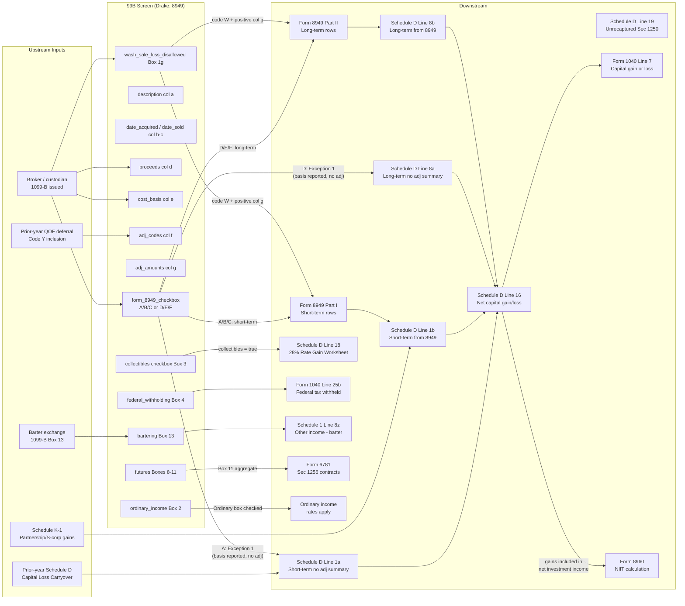

# 1099-B — Proceeds from Broker and Barter Exchange Transactions

## Overview

This screen captures individual security sale and barter exchange transactions
reported on IRS Form 1099-B. For each transaction, the preparer enters the
description, dates, proceeds, basis, and any adjustments. The data flows
directly into Form 8949 (Sales and Other Dispositions of Capital Assets), which
then feeds totals to Schedule D (Capital Gains and Losses), which ultimately
feeds to Form 1040 Line 7 (capital gain or loss). Accurate entry here determines
whether a taxpayer owes tax at 0%, 15%, 20%, 25%, or 28% on their investment
gains, or can deduct capital losses up to $3,000 per year.

**Drake note:** Drake Tax does not have a dedicated "99B" named screen. Instead,
1099-B transactions are entered on the **8949 screen** (accessed via the Income
tab in the 1040 package). The screen code "99B" resolves to this 8949 data-entry
screen. Multiple screen instances are created — one per transaction (or one per
category if using Exception 1 summary entries on screen D2).

**IRS Form:** 1099-B (Proceeds from Broker and Barter Exchange Transactions)
**Drake Screen:** 8949 (Income tab) / D2 (for Exception 1 summary entries on
Schedule D) **Tax Year:** 2025 **Drake Reference:**
https://kb.drakesoftware.com/kb/Drake-Tax/10542.htm **Drake Screen Reference:**
https://kb.drakesoftware.com/kb/Drake-Tax/13157.htm

---

## Data Entry Fields

Required fields first, then optional. Data-entry only — no computed/display
fields.

### Part 1 — Transaction Header / Ownership

| Field        | Type      | Required | Drake Label | Description                                                                                                     | IRS Reference             | URL                                                 |
| ------------ | --------- | -------- | ----------- | --------------------------------------------------------------------------------------------------------------- | ------------------------- | --------------------------------------------------- |
| tsj          | enum      | no       | TSJ         | Taxpayer (T), Spouse (S), or Joint (J). Defaults to T. Used to associate transaction with correct return filer. | Form 8949 header          | https://www.irs.gov/instructions/i8949              |
| federal_code | enum      | no       | F           | 0 = federal return only; blank = applies to all jurisdictions                                                   | Drake software convention | https://kb.drakesoftware.com/kb/Drake-Tax/10542.htm |
| state        | string(2) | no       | State       | Two-letter state abbreviation for state taxability                                                              | State return requirements | —                                                   |

### Part 2 — Form 8949 Classification (determines which checkbox is marked)

| Field              | Type | Required | Drake Label                                        | Description                                                                                                                                                                                                                                                                                                | IRS Reference                                           | URL                                    |
| ------------------ | ---- | -------- | -------------------------------------------------- | ---------------------------------------------------------------------------------------------------------------------------------------------------------------------------------------------------------------------------------------------------------------------------------------------------------- | ------------------------------------------------------- | -------------------------------------- |
| form_8949_checkbox | enum | yes      | "Applicable Part I/Part II check box on Form 8949" | **A** = Short-term, basis reported to IRS, no adjustments; **B** = Short-term, basis NOT reported to IRS; **C** = Short-term, no Form 1099-B received; **D** = Long-term, basis reported to IRS, no adjustments; **E** = Long-term, basis NOT reported to IRS; **F** = Long-term, no Form 1099-B received. | Form 8949 Part I / Part II checkboxes; Instructions p.2 | https://www.irs.gov/instructions/i8949 |

**Rules for checkbox selection:**

- Use A or D when: 1099-B Box 12 ("Basis reported to IRS") is checked AND Box 5
  (noncovered) is NOT checked AND no adjustments are needed in columns f/g
- Use B or E when: Box 5 (noncovered security) IS checked, OR Box 12 is NOT
  checked
- Use C or F when: No Form 1099-B was received at all
- Never use G–L for traditional securities (those are for digital assets on Form
  1099-DA, new for 2025)

### Part 3 — Transaction Detail (mirrors Form 8949 columns a–h)

| Field                     | Type    | Required | Drake Label                   | Description                                                                                                                                                                                                                                                                                        | IRS Reference                                   | URL                                     |
| ------------------------- | ------- | -------- | ----------------------------- | -------------------------------------------------------------------------------------------------------------------------------------------------------------------------------------------------------------------------------------------------------------------------------------------------- | ----------------------------------------------- | --------------------------------------- |
| description               | string  | yes      | Description (col a)           | Description of property sold. For stocks: share count + name or ticker (e.g., "100 sh XYZ Corp"). Must match what appears on Form 1099-B Box 1a. For barter: description of property/services exchanged.                                                                                           | Form 8949 col (a); i8949 p.3                    | https://www.irs.gov/instructions/i8949  |
| date_acquired             | string  | yes      | Date Acquired (col b)         | Date property was acquired. Format: MMDDYYYY. Special values: "VARIOUS" (multiple acquisition dates), "INHERIT" (inherited property — treated as long-term), "INH2010" (inherited after 2010, NJ-specific). Required for covered securities; may be blank for noncovered if broker omitted Box 1b. | Form 8949 col (b); i8949 p.3                    | https://www.irs.gov/instructions/i8949  |
| date_sold                 | string  | yes      | Date Sold or Disposed (col c) | Date property was sold or disposed of. Format: MMDDYYYY. Special values: "BANKRUPT" (treated as short-term loss), "WORTHLSS" (worthless security under IRC §165(g)), "EXPIRED" (option expired — requires paper filing).                                                                           | Form 8949 col (c); i8949 p.3                    | https://www.irs.gov/instructions/i8949  |
| holding_period_type       | enum    | yes      | Type                          | S = short-term (held ≤1 year); L = long-term (held >1 year). Must be consistent with date_acquired / date_sold. Inherited property always = L regardless of dates.                                                                                                                                 | IRC §1222; i8949 p.2                            | https://www.irs.gov/instructions/i8949  |
| ordinary_income           | boolean | no       | Ordinary                      | Check if 1099-B Box 2 "Ordinary" is checked. Indicates gain/loss should be treated as ordinary income rather than capital. Flows to ordinary income line, not Schedule D.                                                                                                                          | 1099-B Box 2; i8949 p.3                         | https://www.irs.gov/instructions/i1099b |
| proceeds                  | number  | yes      | Proceeds (col d)              | Gross proceeds from the sale as shown in 1099-B Box 1d. For barter: fair market value of goods/services received. Do not reduce for selling commissions if 1099-B shows gross proceeds (commissions are an adjustment in col e or col g with code E). Enter 0 if proceeds are zero.                | Form 8949 col (d); i8949 p.3; 1099-B Box 1d     | https://www.irs.gov/instructions/i8949  |
| cost_basis                | number  | yes      | Cost or Other Basis (col e)   | Adjusted cost basis of property sold. From 1099-B Box 1e for covered securities. For noncovered securities, taxpayer must supply. For inherited property: FMV at date of death. Includes commissions paid on purchase. Enter 0 only if actual basis is zero.                                       | Form 8949 col (e); i8949 p.3; 1099-B Box 1e     | https://www.irs.gov/instructions/i8949  |
| accrued_market_discount   | number  | no       | Accrued Discount              | Accrued market discount from 1099-B Box 1f. Amount of discount that accrued while taxpayer held the debt instrument. If entered, use adjustment code D in col f and enter as negative in col g to convert to ordinary income.                                                                      | Form 8949 col (f)/(g); 1099-B Box 1f; i8949 p.4 | https://www.irs.gov/instructions/i8949  |
| wash_sale_loss_disallowed | number  | no       | Wash Sale Loss                | Wash sale loss disallowed from 1099-B Box 1g. Amount of loss not deductible because taxpayer repurchased substantially identical securities within 30 days before or after the loss sale. Enter as positive number; becomes positive adjustment in col g with code W.                              | Form 8949 col (g); 1099-B Box 1g; i8949 p.5     | https://www.irs.gov/instructions/i8949  |

### Part 4 — Adjustments (up to 3 adjustment code + amount pairs)

| Field        | Type   | Required | Drake Label  | Description                                                                                                                           | IRS Reference                  | URL                                    |
| ------------ | ------ | -------- | ------------ | ------------------------------------------------------------------------------------------------------------------------------------- | ------------------------------ | -------------------------------------- |
| adj_code_1   | enum   | no       | Adj 1 Code   | First adjustment code (see Adjustment Codes table below). Enter codes alphabetically if multiple apply to one transaction.            | Form 8949 col (f); i8949 p.4–6 | https://www.irs.gov/instructions/i8949 |
| adj_amount_1 | number | no       | Adj 1 Amount | Dollar amount of first adjustment. Positive increases gain or reduces loss; negative (in parentheses) reduces gain or increases loss. | Form 8949 col (g); i8949 p.4–6 | https://www.irs.gov/instructions/i8949 |
| adj_code_2   | enum   | no       | Adj 2 Code   | Second adjustment code (if multiple codes apply). Enter alphabetically after adj_code_1.                                              | Form 8949 col (f); i8949 p.4   | https://www.irs.gov/instructions/i8949 |
| adj_amount_2 | number | no       | Adj 2 Amount | Dollar amount of second adjustment. Net all adjustment amounts algebraically for total col g effect.                                  | Form 8949 col (g); i8949 p.4   | https://www.irs.gov/instructions/i8949 |
| adj_code_3   | enum   | no       | Adj 3 Code   | Third adjustment code (if applicable).                                                                                                | Form 8949 col (f); i8949 p.4   | https://www.irs.gov/instructions/i8949 |
| adj_amount_3 | number | no       | Adj 3 Amount | Dollar amount of third adjustment.                                                                                                    | Form 8949 col (g); i8949 p.4   | https://www.irs.gov/instructions/i8949 |

### Part 5 — Special Transaction Types

| Field               | Type    | Required | Drake Label      | Description                                                                                                                                                                                                                | IRS Reference                             | URL                                      |
| ------------------- | ------- | -------- | ---------------- | -------------------------------------------------------------------------------------------------------------------------------------------------------------------------------------------------------------------------- | ----------------------------------------- | ---------------------------------------- |
| federal_withholding | number  | no       | Fed W/H          | Federal income tax withheld (backup withholding) from 1099-B Box 4. Flows to Form 1040 Line 25b (federal tax withheld).                                                                                                    | 1099-B Box 4; i1099b p.7                  | https://www.irs.gov/instructions/i1099b  |
| loss_not_allowed    | boolean | no       | Loss Not Allowed | Check if 1099-B Box 7 is checked (loss not allowed because of acquisition of control or substantial change in capital structure). Loss is not deductible.                                                                  | 1099-B Box 7; i1099b p.8                  | https://www.irs.gov/instructions/i1099b  |
| collectibles        | boolean | no       | Collectibles     | Check if 1099-B Box 3 "Collectibles" is checked. Gain taxed at maximum 28% rate; flows to Schedule D 28% Rate Gain Worksheet and Schedule D line 18. Also use adjustment code C in col f.                                  | 1099-B Box 3; Sch D instructions; i1040sd | https://www.irs.gov/instructions/i1040sd |
| qsbs_code           | enum    | no       | QSBS Code        | Qualified Small Business Stock code for Section 1202 exclusion percentage: 50%, 60%, 75%, or 100% exclusion depending on when stock was issued.                                                                            | IRC §1202; i8949 p.6                      | https://www.irs.gov/instructions/i8949   |
| qsbs_amount         | number  | no       | QSBS Amount      | Dollar amount of Section 1202 gain eligible for exclusion. Excluded amount enters as negative in col g with code Q (for excluded portion) or code R (for rollover).                                                        | IRC §1202; i8949 p.6                      | https://www.irs.gov/instructions/i8949   |
| amt_cost_basis      | number  | no       | AMT Cost Basis   | Alternative minimum tax basis, if different from regular basis (e.g., due to ISO stock option exercise where AMT basis = FMV at exercise; regular basis = exercise price). Difference creates AMT adjustment on Form 6251. | IRC §56(b)(3); Form 6251 instructions     | https://www.irs.gov/instructions/i6251   |

### Part 6 — Regulated Futures / Section 1256 Contracts (separate reporting)

| Field                           | Type   | Required | Drake Label | Description                                                                                                                                                   | IRS Reference             | URL                                     |
| ------------------------------- | ------ | -------- | ----------- | ------------------------------------------------------------------------------------------------------------------------------------------------------------- | ------------------------- | --------------------------------------- |
| futures_realized_profit_loss    | number | no       | Box 8       | Profit or loss realized in current year on closed regulated futures/Section 1256 contracts. Only complete with Box 1a and Box 4; do not complete other boxes. | 1099-B Box 8; i1099b p.9  | https://www.irs.gov/instructions/i1099b |
| futures_unrealized_prior_year   | number | no       | Box 9       | Unrealized profit or loss on open contracts at December 31 of prior year.                                                                                     | 1099-B Box 9; i1099b p.9  | https://www.irs.gov/instructions/i1099b |
| futures_unrealized_current_year | number | no       | Box 10      | Unrealized profit or loss on open contracts at December 31 of current year.                                                                                   | 1099-B Box 10; i1099b p.9 | https://www.irs.gov/instructions/i1099b |
| futures_aggregate_profit_loss   | number | no       | Box 11      | Aggregate profit or loss for the year: Box 8 − Box 9 + Box 10.                                                                                                | 1099-B Box 11; i1099b p.9 | https://www.irs.gov/instructions/i1099b |

### Part 7 — Barter Exchange (separate reporting)

| Field     | Type   | Required | Drake Label        | Description                                                                                                                                                                                      | IRS Reference              | URL                                     |
| --------- | ------ | -------- | ------------------ | ------------------------------------------------------------------------------------------------------------------------------------------------------------------------------------------------ | -------------------------- | --------------------------------------- |
| bartering | number | no       | Box 13 (Bartering) | Gross amount received by a member or client of a barter exchange. Includes cash, fair market value of property and services, and trade credits. Taxable as ordinary income in the year received. | 1099-B Box 13; i1099b p.10 | https://www.irs.gov/instructions/i1099b |

### Part 8 — State Information

| Field             | Type   | Required | Drake Label      | Description                                                                        | IRS Reference                                 | URL                                     |
| ----------------- | ------ | -------- | ---------------- | ---------------------------------------------------------------------------------- | --------------------------------------------- | --------------------------------------- |
| state_id_number   | string | no       | State ID #       | Payer's state identification number (1099-B Box 15).                               | 1099-B Box 15; Combined Federal/State program | https://www.irs.gov/instructions/i1099b |
| state_withholding | number | no       | State Tax W/H    | State income tax withheld from proceeds (1099-B Box 16).                           | 1099-B Box 16; i1099b                         | https://www.irs.gov/instructions/i1099b |
| state_use_code    | enum   | no       | State Use Code   | CG (capital gain) or 30 — state-specific classification of the transaction.        | State return instructions                     | —                                       |
| state_adjustment  | number | no       | State Adjustment | Difference between federal and state gain/loss if state has different basis rules. | State return instructions                     | —                                       |
| state_cost_basis  | number | no       | State Cost Basis | Alternate cost basis for state return if different from federal basis.             | State return instructions                     | —                                       |

### Exception 1 Summary Entry (Screen D2 — No Form 8949 Required)

When ALL of the following conditions are met for a group of transactions, a
preparer may bypass Form 8949 entirely and enter aggregate totals directly on
Schedule D:

1. Received Form 1099-B (or substitute) showing basis was reported to IRS
2. No adjustments needed to basis, gain/loss type, or amount
3. 1099-B Box 2 "Ordinary" is NOT checked
4. Not a QOF deferral/termination election

In Drake, use screen **D2** for these entries:

| Field          | Type   | Required | Drake Label         | Description                                                                     | IRS Reference                    | URL                                      |
| -------------- | ------ | -------- | ------------------- | ------------------------------------------------------------------------------- | -------------------------------- | ---------------------------------------- |
| d2_description | string | yes      | Description         | Brief description (e.g., "Various short-term" or "Various long-term")           | Schedule D lines 1a, 8a; i1040sd | https://www.irs.gov/instructions/i1040sd |
| d2_proceeds    | number | yes      | Proceeds            | Total aggregate sale proceeds for the category                                  | Schedule D lines 1a, 8a          | https://www.irs.gov/instructions/i1040sd |
| d2_cost_basis  | number | yes      | Cost or other basis | Total aggregate basis for the category                                          | Schedule D lines 1a, 8a          | https://www.irs.gov/instructions/i1040sd |
| d2_term        | enum   | yes      | Short/Long-term     | ST = short-term (goes to Sch D line 1a); LT = long-term (goes to Sch D line 8a) | Schedule D lines 1a, 8a; i1040sd | https://www.irs.gov/instructions/i1040sd |

---

## Per-Field Routing

| Field                         | Destination                                 | How Used                                                                                                                           | Triggers                                                                                                        | Limit / Cap                                                          | IRS Reference                       | URL                                                 |
| ----------------------------- | ------------------------------------------- | ---------------------------------------------------------------------------------------------------------------------------------- | --------------------------------------------------------------------------------------------------------------- | -------------------------------------------------------------------- | ----------------------------------- | --------------------------------------------------- |
| tsj                           | Internal routing only                       | Associates transaction with T, S, or J filer for separate Schedule D computation                                                   | —                                                                                                               | —                                                                    | Drake convention                    | https://kb.drakesoftware.com/kb/Drake-Tax/10542.htm |
| form_8949_checkbox            | Form 8949, Part I or Part II                | Determines which checkbox (A/B/C or D/E/F) is marked; routes to correct Form 8949 section                                          | Always triggers Form 8949 (unless Exception 1 applies)                                                          | Must be A/B/C for short-term or D/E/F for long-term                  | i8949 p.2                           | https://www.irs.gov/instructions/i8949              |
| description                   | Form 8949 col (a)                           | Appears verbatim on Form 8949                                                                                                      | —                                                                                                               | —                                                                    | i8949 p.3                           | https://www.irs.gov/instructions/i8949              |
| date_acquired                 | Form 8949 col (b)                           | Used to verify holding period; "INHERIT" forces long-term                                                                          | If "VARIOUS" → can still use A/D if no adjustments                                                              | —                                                                    | i8949 p.3                           | https://www.irs.gov/instructions/i8949              |
| date_sold                     | Form 8949 col (c)                           | Used to verify holding period; special codes affect treatment                                                                      | "EXPIRED" requires paper filing (no e-file); "BANKRUPT" = short-term                                            | —                                                                    | i8949 p.3; Drake KB 11790           | https://kb.drakesoftware.com/kb/Drake-Tax/11790.htm |
| holding_period_type           | Form 8949 Part I (S) or Part II (L)         | Determines which Part of Form 8949 receives the transaction                                                                        | —                                                                                                               | —                                                                    | IRC §1222                           | https://www.irs.gov/instructions/i8949              |
| ordinary_income               | Ordinary income line on 1040                | If checked, gain/loss does NOT go to Schedule D; treated as ordinary income on Form 1040                                           | Bypasses Schedule D capital gain treatment                                                                      | —                                                                    | 1099-B Box 2; i1099b p.7            | https://www.irs.gov/instructions/i1099b             |
| proceeds                      | Form 8949 col (d)                           | Gross proceeds; subtracted from col (e) to compute preliminary gain/loss                                                           | —                                                                                                               | None (can be $0 for worthless securities)                            | i8949 p.3                           | https://www.irs.gov/instructions/i8949              |
| cost_basis                    | Form 8949 col (e)                           | Subtracted from proceeds; basis consistency rules require use of estate-tax value for inherited property (IRC §1014)               | If basis inconsistency detected, 20% accuracy penalty applies                                                   | —                                                                    | i8949 p.3; IRC §1014                | https://www.irs.gov/instructions/i8949              |
| accrued_market_discount       | Form 8949 col (g) via code D                | Converts portion of gain from capital to ordinary income using Market Discount Worksheet                                           | Triggers code D entry in col (f); use Market Discount Worksheet to compute                                      | —                                                                    | i8949 p.4                           | https://www.irs.gov/instructions/i8949              |
| wash_sale_loss_disallowed     | Form 8949 col (g) via code W                | Entered as positive number; increases col (h) reducing or eliminating deductible loss                                              | Triggers code W in col (f); disallowed amount adds to basis of replacement security (tracked outside Form 8949) | —                                                                    | i8949 p.5; IRC §1091                | https://www.irs.gov/instructions/i8949              |
| adj_code_1/2/3                | Form 8949 col (f)                           | Code(s) entered alphabetically; explain nature of adjustment in col (g)                                                            | Each code has specific col (g) effect (see Adjustment Codes table below)                                        | Max 3 codes per transaction (Drake limit); IRS allows multiple codes | i8949 p.4–6                         | https://www.irs.gov/instructions/i8949              |
| adj_amount_1/2/3              | Form 8949 col (g)                           | Net adjustment (sum of all adjustment amounts) entered in col (g); positive increases gain, negative (in parentheses) reduces gain | —                                                                                                               | —                                                                    | i8949 p.4–6                         | https://www.irs.gov/instructions/i8949              |
| federal_withholding           | Form 1040 Line 25b                          | Backup withholding flows to total tax payments; reduces tax owed                                                                   | —                                                                                                               | None                                                                 | 1099-B Box 4; Form 1040 Line 25b    | https://www.irs.gov/instructions/i1040              |
| loss_not_allowed              | Form 8949 col (f) code L                    | Loss not deductible; code L entered, positive amount in col (g) negates the loss                                                   | No deduction allowed                                                                                            | —                                                                    | i8949 p.5; 1099-B Box 7             | https://www.irs.gov/instructions/i8949              |
| collectibles                  | Form 8949 col (f) code C → Sch D line 18    | Collectibles gain flows to 28% Rate Gain Worksheet → Schedule D line 18                                                            | Triggers 28% Rate Gain Worksheet computation                                                                    | Max 28% rate                                                         | Sch D instructions; i1040sd         | https://www.irs.gov/instructions/i1040sd            |
| qsbs_code / qsbs_amount       | Form 8949 col (g) via code Q or R           | Section 1202 exclusion reduces recognized gain; excluded amount entered as negative in col (g)                                     | Triggers code Q (exclusion) or R (rollover); remaining 28%-rate gain enters 28% Rate Gain Worksheet             | 50%/75%/100% exclusion rates depending on stock issuance date        | IRC §1202; i8949 p.6                | https://www.irs.gov/instructions/i8949              |
| amt_cost_basis                | Form 6251                                   | AMT gain/loss computed separately using AMT basis; difference from regular gain = Form 6251 AMT adjustment                         | Triggers Form 6251 entry                                                                                        | —                                                                    | IRC §56(b)(3); i6251                | https://www.irs.gov/instructions/i6251              |
| futures_aggregate_profit_loss | Form 6781, Line 1                           | Section 1256 contracts: 40% treated as short-term, 60% as long-term per IRC §1256(a)                                               | Triggers Form 6781; bypasses Form 8949                                                                          | —                                                                    | IRC §1256; i6781                    | https://www.irs.gov/instructions/i6781              |
| bartering                     | Form 1040 Schedule 1 Line 8z (Other income) | Barter income is ordinary income in year received; FMV of goods/services received                                                  | —                                                                                                               | None                                                                 | 1099-B Box 13; i1099b p.10; IRC §83 | https://www.irs.gov/instructions/i1099b             |
| state_withholding             | State return                                | Flows to state tax withheld line on state return                                                                                   | —                                                                                                               | —                                                                    | State return instructions           | —                                                   |

### Form 8949 Column (h) Gain/Loss Computation

For each row:

- col (h) = col (d) − col (e) + col (g)
- Positive result = gain; enter as positive
- Negative result = loss; enter in parentheses
- Net of all col (g) adjustments (sum adj_amount_1 + adj_amount_2 +
  adj_amount_3)

### Schedule D Aggregation

Form 8949 totals flow to Schedule D:

- **Checkbox A transactions** (short-term, basis reported, no adj): Exception 1
  → Sch D line 1a directly (OR via Form 8949 Part I → Sch D line 1b if Form 8949
  is prepared)
- **Checkbox B/C transactions** (short-term, basis not reported or no 1099-B):
  Form 8949 Part I → Sch D line 1b
- **Checkbox D transactions** (long-term, basis reported, no adj): Exception 1 →
  Sch D line 8a directly (OR via Form 8949 Part II → Sch D line 8b)
- **Checkbox E/F transactions** (long-term, basis not reported or no 1099-B):
  Form 8949 Part II → Sch D line 8b

---

## Calculation Logic

### Step 1 — Determine Holding Period for Each Transaction

For each transaction:

- Compute days held = date_sold − date_acquired
- If days held ≤ 365: **short-term** (use checkbox A, B, or C; Form 8949 Part I)
- If days held > 365: **long-term** (use checkbox D, E, or F; Form 8949 Part II)
- Special: `date_acquired = "INHERIT"` or `"INH2010"` → always **long-term**
  regardless of dates
- Special: `date_acquired = "VARIOUS"` → holding period may be mixed; use
  multiple rows or preparer judgment

> **Source:** IRC §1222; Form 8949 Instructions p.2 —
> https://www.irs.gov/instructions/i8949

---

### Step 2 — Determine Basis Reporting Status (Select Form 8949 Checkbox)

For each transaction, evaluate the source Form 1099-B:

- If Box 12 ("Basis reported to IRS") is checked AND Box 5 (noncovered) is NOT
  checked AND no adjustments are needed: → **checkbox A** (short-term) or
  **checkbox D** (long-term) → eligible for Exception 1 (direct to Sch D lines
  1a or 8a)
- If Box 5 (noncovered security) is checked, OR Box 12 is not checked, OR
  adjustments are needed: → **checkbox B** (short-term) or **checkbox E**
  (long-term) → Form 8949 required
- If no Form 1099-B was received: → **checkbox C** (short-term) or **checkbox
  F** (long-term) → Form 8949 required

> **Source:** Form 8949 Instructions, Part I/Part II checkbox descriptions, p.2
> — https://www.irs.gov/instructions/i8949 **Source:** Drake KB 13580
> (Noncovered Securities) — https://kb.drakesoftware.com/kb/Drake-Tax/13580.htm

---

### Step 3 — Compute Preliminary Gain or Loss (Before Adjustments)

For each transaction:

```
preliminary_gain_loss = proceeds (col d) - cost_basis (col e)
```

- Positive = preliminary gain
- Negative = preliminary loss

> **Source:** Form 8949 Instructions, column (h) description, p.3 —
> https://www.irs.gov/instructions/i8949

---

### Step 4 — Apply Adjustments (Column g)

Compute net adjustment:

```
net_col_g = adj_amount_1 + adj_amount_2 + adj_amount_3
           (each amount may be positive or negative per code rules)
```

For each adjustment code, the col (g) direction:

| Code | Col (g) Direction                | Result                                                                              |
| ---- | -------------------------------- | ----------------------------------------------------------------------------------- |
| B    | Per Basis Adjustment Worksheet   | Corrects reported basis                                                             |
| C    | 0                                | Marks collectibles (no numeric adjustment)                                          |
| D    | Negative (in parentheses)        | Reduces capital gain; ordinary income recognized via Market Discount Worksheet      |
| E    | Negative (in parentheses)        | Adds selling expenses / option premiums not on 1099-B; reduces proceeds effectively |
| H    | Negative (in parentheses)        | Excludes gain on main home sale; reduces gain                                       |
| L    | Positive                         | Adds back nondeductible loss (not wash sale); reduces or eliminates loss            |
| M    | 0                                | Exception 2 summary transaction                                                     |
| N    | Nets to 0                        | Nominee reporting; net col h = $0                                                   |
| O    | Per Contingent Payment Worksheet | Converts to ordinary income                                                         |
| Q    | Negative (in parentheses)        | QSBS exclusion; reduces recognized gain                                             |
| R    | Negative (in parentheses)        | QSBS rollover; defers gain                                                          |
| S    | See Schedule D instructions      | Section 1244 excess ordinary loss                                                   |
| T    | 0                                | Gain/loss type correction; no amount adjustment                                     |
| W    | Positive                         | Wash sale loss disallowed; reduces or eliminates deductible loss                    |
| X    | Negative (in parentheses)        | DC Zone / qualified community asset exclusion                                       |
| Y    | See QOF instructions             | Prior-year QOF gain inclusion                                                       |
| Z    | Negative (in parentheses)        | QOF deferral; defers current gain                                                   |

> **Source:** Form 8949 Instructions, Adjustment Codes table, pp.4–6 —
> https://www.irs.gov/instructions/i8949

---

### Step 5 — Compute Final Gain or Loss (Column h)

```
col_h = col_d - col_e + net_col_g
```

- If col_h > 0: **gain** — enter as positive
- If col_h < 0: **loss** — enter in parentheses (negative)
- If col_h = 0: enter 0

> **Source:** Form 8949 Instructions, column (h) description, p.3 —
> https://www.irs.gov/instructions/i8949

---

### Step 6 — Aggregate Totals to Schedule D

Sum all Form 8949 rows by category:

**Short-term (Part I) totals:**

- Sum col (d) proceeds for all A rows → Sch D line 1a col (d) [or 1b if via Form
  8949]
- Sum col (e) basis for all A rows → Sch D line 1a col (e) [or 1b]
- Sum col (h) gain/loss for all A rows → Sch D line 1a col (h) [or 1b]
- Sum B/C rows → Sch D line 1b col (d), (e), (h)

Sch D line 2 = net short-term carryover loss (from Capital Loss Carryover
Worksheet, line 8) Sch D line 3 = net short-term gain/loss from other sources
(partnerships, S-corps, estates) Sch D line 7 = sum of lines 1a + 1b + 2 + 3
(net short-term gain/loss)

**Long-term (Part II) totals:**

- Sum D rows → Sch D line 8a
- Sum E/F rows → Sch D line 8b
- Sch D line 9 = net long-term carryover loss (Capital Loss Carryover Worksheet,
  line 13)
- Sch D line 10 = net long-term gain/loss from other sources (partnerships,
  S-corps, estates)
- Sch D line 11 = capital gain distributions (from 1099-DIV Box 2a)
- Sch D line 13 = collectibles/unrecaptured 1250/28%-rate gain adjustments
- Sch D line 15 = sum of lines 8a + 8b + 9 + 10 + 11 + 12 + 13 + 14 (net
  long-term gain/loss)

Sch D line 16 = line 7 + line 15 (net overall capital gain/loss)

> **Source:** Schedule D Instructions, Lines 1a–16,
> https://www.irs.gov/instructions/i1040sd

---

### Step 7 — Apply Capital Loss Limitation

If Sch D line 16 is a net loss:

- Deductible loss on Form 1040 is limited to the **lesser of**:
  - The net loss (absolute value of line 16)
  - **$3,000** for Single, MFJ, HOH, QSS filers
  - **$1,500** for MFS filers
- Excess loss → Capital Loss Carryover
  - Short-term excess → Sch D line 6 next year
  - Long-term excess → Sch D line 14 next year
- Capital losses carry forward indefinitely with no expiration

> **Source:** IRC §1211(b); Schedule D Instructions, Line 21 —
> https://www.irs.gov/instructions/i1040sd

---

### Step 8 — Apply Preferential Capital Gains Tax Rates

If Sch D line 16 is a net gain, complete the **Qualified Dividend and Capital
Gain Tax Worksheet** (in Form 1040 Instructions) to apply preferential rates:

**Rate structure (TY2025):**

| Rate | Single             | MFS                | MFJ / QSS          | HOH                |
| ---- | ------------------ | ------------------ | ------------------ | ------------------ |
| 0%   | ≤ $48,350          | ≤ $48,350          | ≤ $96,700          | ≤ $64,750          |
| 15%  | $48,351 – $533,400 | $48,351 – $300,000 | $96,701 – $600,050 | $64,751 – $566,700 |
| 20%  | > $533,400         | > $300,000         | > $600,050         | > $566,700         |

**Special rates (override the above for specific gain types):**

- **28% rate**: Collectibles gains and Section 1202 QSBS gains (after
  exclusions) — Schedule D line 18
- **25% rate**: Unrecaptured Section 1250 gain (depreciated real property) —
  Schedule D line 19
- **Ordinary rate**: Short-term capital gains — taxed at ordinary income rates
  (no preferential treatment)

> **Source:** IRC §§1(h), 1222, 1250; IRS Topic 409 —
> https://www.irs.gov/taxtopics/tc409 **Source:** Schedule D Instructions (28%
> Rate Gain Worksheet, Unrecaptured Sec 1250 Gain Worksheet) —
> https://www.irs.gov/instructions/i1040sd

---

### Step 9 — Net Investment Income Tax (NIIT) Assessment

Capital gains that are included in taxable income are also potentially subject
to NIIT at 3.8%:

```
NIIT applies if: MAGI > threshold AND net investment income > 0
NIIT amount = 3.8% × lesser of (net investment income) OR (MAGI - threshold)
```

**TY2025 MAGI thresholds (NOT inflation-adjusted):**

| Filing Status | MAGI Threshold |
| ------------- | -------------- |
| MFJ / QSS     | $250,000       |
| MFS           | $125,000       |
| Single / HOH  | $200,000       |

Net investment income includes: interest, dividends, capital gains, rents,
royalties, and passive activity income from Schedule D.

Reported on **Form 8960** (Net Investment Income Tax). Capital gains from
Schedule D flow to Form 8960 Line 5a.

> **Source:** IRC §1411; IRS Topic 559 — https://www.irs.gov/taxtopics/tc559
> **Note:** NIIT thresholds are statutory and NOT inflation-adjusted. TY2025
> values are same as prior years.

---

### Step 10 — Wash Sale Basis Adjustment (Tracked Outside Form 8949)

When a wash sale occurs (code W), the disallowed loss must be added to the basis
of replacement securities:

```
replacement_basis = purchase_price_of_replacement + disallowed_loss_amount
```

This adjusted basis is used in future tax years when the replacement security is
sold. The basis adjustment is NOT reported on the current-year Form 8949 — it
affects only the future-year entry for the replacement security.

> **Source:** IRC §1091(d); IRS Publication 550, Wash Sales chapter —
> https://www.irs.gov/publications/p550 **Source:** Form 8949 Instructions, Code
> W description, p.5 — https://www.irs.gov/instructions/i8949

---

### Step 11 — Section 1256 Contract Treatment (Regulated Futures)

Section 1256 contracts (regulated futures, foreign currency contracts, certain
options) use **mark-to-market** accounting:

```
aggregate_gain_loss = realized_profit_loss (Box 8)
                    - prior_year_unrealized_gain_loss (Box 9)
                    + current_year_unrealized_gain_loss (Box 10)
```

This equals Box 11 on Form 1099-B.

**60/40 rule:** Regardless of actual holding period:

- 60% of aggregate gain/loss → long-term capital gain/loss
- 40% of aggregate gain/loss → short-term capital gain/loss

Section 1256 contracts are reported on **Form 6781** (Gains and Losses From
Section 1256 Contracts and Straddles), NOT Form 8949.

> **Source:** IRC §1256; Form 6781 Instructions —
> https://www.irs.gov/instructions/i6781 **Source:** 1099-B Instructions, Boxes
> 8–11 — https://www.irs.gov/instructions/i1099b

---

## Adjustment Codes Reference Table

| Code | Name                               | Col (g) Direction                                   | Use Case                                                                              |
| ---- | ---------------------------------- | --------------------------------------------------- | ------------------------------------------------------------------------------------- |
| B    | Basis correction                   | Per worksheet                                       | 1099-B reported incorrect basis to IRS — use Basis Adjustment Worksheet               |
| C    | Collectibles                       | Enter 0                                             | Long-term collectibles gain — flags for 28% rate; no numeric adjustment               |
| D    | Market discount                    | Negative (loss as ordinary income)                  | Accrued market discount on debt instruments; use Market Discount Worksheet            |
| E    | Selling expenses / option premiums | Negative (expenses) or Positive (premiums received) | Expenses not netted in 1099-B proceeds; option premiums                               |
| H    | Home sale exclusion                | Negative (excluded gain)                            | Excludes up to $250,000 ($500,000 MFJ) of gain on principal residence per IRC §121    |
| L    | Nondeductible loss (non-wash)      | Positive (adds back loss)                           | Loss not allowed for reasons other than wash sale (e.g., related party, straddle)     |
| M    | Multiple transactions summary      | 0                                                   | Exception 2: aggregated transactions on attached statement                            |
| N    | Nominee                            | Adjusts to $0 col h                                 | Property sold on behalf of another; net col h = zero                                  |
| O    | Contingent payment                 | Per worksheet                                       | Contingent payment debt instrument; use Contingent Payment Worksheet                  |
| Q    | QSBS exclusion                     | Negative                                            | Section 1202 qualified small business stock gain exclusion                            |
| R    | QSBS rollover                      | Negative                                            | Section 1045 rollover of QSBS gain                                                    |
| S    | Section 1244                       | See Sch D instructions                              | Small business stock loss exceeding ordinary loss limit ($50K/$100K)                  |
| T    | Type correction                    | 0                                                   | 1099-B showed wrong gain type (ST vs LT); re-report on correct Part, no amount change |
| W    | Wash sale                          | Positive (adds back loss)                           | Wash sale loss disallowed under IRC §1091; 30-day window before/after sale            |
| X    | DC Zone / community asset          | Negative                                            | Qualified DC Zone asset or renewal community asset gain exclusion                     |
| Y    | QOF gain inclusion                 | See QOF instructions                                | Prior-year deferred QOF gain being recognized in current year                         |
| Z    | QOF deferral                       | Negative                                            | Deferring current gain into Qualified Opportunity Fund under IRC §1400Z-2             |

> **Source:** Form 8949 Instructions, Adjustment Codes, pp.4–6 —
> https://www.irs.gov/instructions/i8949

---

## Constants & Thresholds (Tax Year 2025)

| Constant                                          | Value                                    | Source                           | URL                                      |
| ------------------------------------------------- | ---------------------------------------- | -------------------------------- | ---------------------------------------- |
| Long-term capital gains 0% rate — Single / MFS    | ≤ $48,350 taxable income                 | IRS Topic 409, TY2025            | https://www.irs.gov/taxtopics/tc409      |
| Long-term capital gains 0% rate — HOH             | ≤ $64,750 taxable income                 | IRS Topic 409, TY2025            | https://www.irs.gov/taxtopics/tc409      |
| Long-term capital gains 0% rate — MFJ / QSS       | ≤ $96,700 taxable income                 | IRS Topic 409, TY2025            | https://www.irs.gov/taxtopics/tc409      |
| Long-term capital gains 15% rate — Single         | $48,351 – $533,400                       | IRS Topic 409, TY2025            | https://www.irs.gov/taxtopics/tc409      |
| Long-term capital gains 15% rate — MFS            | $48,351 – $300,000                       | IRS Topic 409, TY2025            | https://www.irs.gov/taxtopics/tc409      |
| Long-term capital gains 15% rate — MFJ / QSS      | $96,701 – $600,050                       | IRS Topic 409, TY2025            | https://www.irs.gov/taxtopics/tc409      |
| Long-term capital gains 15% rate — HOH            | $64,751 – $566,700                       | IRS Topic 409, TY2025            | https://www.irs.gov/taxtopics/tc409      |
| Long-term capital gains 20% rate — Single         | > $533,400                               | IRS Topic 409, TY2025            | https://www.irs.gov/taxtopics/tc409      |
| Long-term capital gains 20% rate — MFS            | > $300,000                               | IRS Topic 409, TY2025            | https://www.irs.gov/taxtopics/tc409      |
| Long-term capital gains 20% rate — MFJ / QSS      | > $600,050                               | IRS Topic 409, TY2025            | https://www.irs.gov/taxtopics/tc409      |
| Long-term capital gains 20% rate — HOH            | > $566,700                               | IRS Topic 409, TY2025            | https://www.irs.gov/taxtopics/tc409      |
| Collectibles maximum rate                         | 28%                                      | IRC §1(h)(5); IRS Topic 409      | https://www.irs.gov/taxtopics/tc409      |
| Unrecaptured Section 1250 gain maximum rate       | 25%                                      | IRC §1(h)(6); Sch D instructions | https://www.irs.gov/instructions/i1040sd |
| Section 1202 QSBS max rate (after exclusion)      | 28%                                      | IRC §1(h)(4)                     | https://www.irs.gov/instructions/i8949   |
| Capital loss annual deduction limit — most filers | $3,000                                   | IRC §1211(b); Sch D Line 21      | https://www.irs.gov/instructions/i1040sd |
| Capital loss annual deduction limit — MFS         | $1,500                                   | IRC §1211(b); Sch D Line 21      | https://www.irs.gov/instructions/i1040sd |
| Short-term holding period threshold               | ≤ 365 days                               | IRC §1222(1)                     | https://www.irs.gov/instructions/i8949   |
| Long-term holding period threshold                | > 365 days                               | IRC §1222(3)                     | https://www.irs.gov/instructions/i8949   |
| NIIT rate                                         | 3.8%                                     | IRC §1411                        | https://www.irs.gov/taxtopics/tc559      |
| NIIT MAGI threshold — MFJ / QSS                   | $250,000 (not inflation-adjusted)        | IRC §1411(b)(3); Topic 559       | https://www.irs.gov/taxtopics/tc559      |
| NIIT MAGI threshold — MFS                         | $125,000 (not inflation-adjusted)        | IRC §1411(b)(3); Topic 559       | https://www.irs.gov/taxtopics/tc559      |
| NIIT MAGI threshold — Single / HOH                | $200,000 (not inflation-adjusted)        | IRC §1411(b)(3); Topic 559       | https://www.irs.gov/taxtopics/tc559      |
| Section 1256 contract 60/40 split                 | 60% LT / 40% ST                          | IRC §1256(a)(3)                  | https://www.irs.gov/instructions/i6781   |
| Wash sale window                                  | 30 days before + 30 days after sale date | IRC §1091                        | https://www.irs.gov/publications/p550    |
| Section 1244 ordinary loss limit — Single         | $50,000 per year                         | IRC §1244(b)                     | https://www.irs.gov/instructions/i8949   |
| Section 1244 ordinary loss limit — MFJ            | $100,000 per year                        | IRC §1244(b)                     | https://www.irs.gov/instructions/i8949   |

---

## Data Flow Diagram



---

## Edge Cases & Special Rules

### 1. Noncovered Securities (Box 5 Checked)

When Form 1099-B Box 5 is checked, the security is "noncovered" — the broker was
not required to track or report basis. The broker may omit Box 1b (date
acquired), Box 1e (cost), Box 1f (market discount), Box 1g (wash sale), and Box
2 (gain type).

**Impact on Drake entry:**

- The taxpayer must supply all missing information (date acquired, basis)
- If information cannot be obtained, the taxpayer may enter 0 for basis (will
  result in full proceeds being taxable)
- Use checkbox **B** (short-term) or **E** (long-term) — NOT A or D
- Drake has no explicit "Box 5" field; this is captured implicitly by selecting
  B or E

> **Source:** Form 8949 Instructions, Part I/Part II checkbox B and E
> descriptions — https://www.irs.gov/instructions/i8949 **Source:** Drake KB
> 13580 — https://kb.drakesoftware.com/kb/Drake-Tax/13580.htm

---

### 2. Wash Sales (IRC §1091)

A wash sale occurs when a taxpayer sells a security at a loss AND purchases a
**substantially identical** security within **30 days before or 30 days after**
the sale date (61-day window total, including the sale date).

**Entry rules:**

- Enter proceeds and basis as shown on 1099-B
- Enter the disallowed loss amount (Box 1g) in the `wash_sale_loss_disallowed`
  field — this enters as positive col (g) with code W
- Col (h) will be reduced (loss is reduced or eliminated)
- The disallowed amount **adds to the basis of the replacement security** — this
  is tracked separately for when the replacement is sold

**What is "substantially identical":**

- Same stock (identical CUSIP) is clearly substantially identical
- Options and warrants on the same underlying stock: generally substantially
  identical
- Bonds from the same issuer, same maturity: generally substantially identical
- Different stocks of different companies: generally NOT substantially identical
- Note: The IRS has not defined "substantially identical" exhaustively —
  fact-dependent

**Wash sales do NOT apply to:**

- Gains (only losses are subject to wash sale rules)
- Short sales (separate rules under IRC §1091(e))
- Section 1256 contracts (specifically excluded)

> **Source:** IRC §1091; Publication 550, Wash Sales chapter —
> https://www.irs.gov/publications/p550 **Source:** Form 8949 Instructions, Code
> W, p.5 — https://www.irs.gov/instructions/i8949

---

### 3. Inherited Property

Property inherited from a decedent receives a **stepped-up (or stepped-down)
basis** equal to the fair market value at the date of death (or alternate
valuation date if elected).

**Entry rules:**

- `date_acquired`: Enter "INHERIT" (or "INH2010" for NJ e-file)
- `holding_period_type`: Always **L** (long-term), regardless of how long
  decedent OR heir actually held the property
- `cost_basis`: FMV at date of death per estate tax return or qualified
  appraisal
- Basis consistency rule: If property was required to be included in the
  decedent's estate AND it increased estate tax, the heir MUST use basis
  consistent with the estate tax return (Schedule A of Form 8971). Using higher
  basis results in 20% accuracy-related penalty.

> **Source:** IRC §1014; Form 8949 Instructions, Date Acquired field, p.3 —
> https://www.irs.gov/instructions/i8949

---

### 4. Multiple Transactions — Exception 1 (Screen D2)

When a taxpayer has many transactions from one broker and all transactions meet
these criteria:

- Basis was reported to IRS (covered securities)
- No adjustments needed (no wash sales, no corrections)
- Not QOF deferrals

The preparer may enter aggregate totals directly on Schedule D lines 1a
(short-term) or 8a (long-term) using Drake screen **D2** — bypassing Form 8949
entirely for those transactions.

**Limitations:**

- Cannot use if ANY transaction in the group needs an adjustment
- Cannot mix short-term and long-term in the same D2 entry
- Cannot use if the "Ordinary" box is checked on any 1099-B in the group

> **Source:** Schedule D Instructions, Lines 1a and 8a —
> https://www.irs.gov/instructions/i1040sd **Source:** Drake KB 12530 —
> https://kb.drakesoftware.com/kb/Drake-Tax/12530.htm

---

### 5. Exception 2 — Aggregated Statement (Code M)

Alternative to entering each transaction individually. The preparer may attach a
statement (formatted like Form 8949) and enter a single row on Form 8949 with:

- Description ending in "See attached statement"
- No date acquired or date sold
- Adjustment code **M** in col (f)
- Adjustment amount 0 in col (g) unless another code also applies
- Proceeds and cost totals from the statement

**E-file requirements:** Attach the statement as a PDF using Drake's PDF
attachment process or Form 8453 for paper-filed attachment.

> **Source:** Form 8949 Instructions, Exception 2, p.2 —
> https://www.irs.gov/instructions/i8949 **Source:** Drake KB 11978 —
> https://kb.drakesoftware.com/kb/Drake-Tax/11978.htm

---

### 6. Collectibles at 28% Rate

Long-term gains on collectibles (works of art, rugs, antiques, metals including
gold/silver/platinum bullion, gems, stamps, coins, alcoholic beverages, and
certain other tangible property) are taxed at a maximum 28% rate.

**Entry rules:**

- Check `collectibles = true` (corresponds to 1099-B Box 3 "Collectibles"
  checkbox)
- Use checkbox D, E, or F (long-term) — collectibles are only subject to 28%
  rate if long-term
- Also enter adjustment code **C** in col (f) with amount 0 in col (g)
- The gain flows to Schedule D **28% Rate Gain Worksheet**, producing the
  Schedule D line 18 entry

**28% Rate Gain Worksheet (from Schedule D instructions):**

```
Line 1: Total collectibles gain/(loss) from Form 8949 Part II
Line 2: Section 1202 QSBS gain adjustments (28%-rate portion)
Line 3: Collectibles gains from Forms 4684, 6252, 6781, 8824
Line 4: Collectibles gain from 1099-DIV Box 2d / Schedule K-1
Line 5: Long-term capital loss carryover (from line 14 of Sch D)
Line 6: Adjustment for net long-term loss
Line 7: Result → Schedule D line 18 (must be ≥ 0)
```

> **Source:** IRC §1(h)(5); Schedule D Instructions, 28% Rate Gain Worksheet —
> https://www.irs.gov/instructions/i1040sd **Source:** Form 8949 Instructions,
> Code C, p.4 — https://www.irs.gov/instructions/i8949

---

### 7. Unrecaptured Section 1250 Gain at 25% Rate

When depreciable real property (buildings, structures) is sold at a gain, any
gain attributable to prior depreciation deductions is "unrecaptured Section 1250
gain" and taxed at a maximum 25% rate.

**Entry rules:**

- The transaction is entered normally on Form 8949 Part II (long-term)
- The depreciation component is NOT entered on 1099-B — it comes from the sale
  computations
- Schedule D Unrecaptured Section 1250 Gain Worksheet is triggered by the
  presence of depreciated real property in Part II

**This primarily affects:**

- Direct real estate sales (usually also reported on Form 4797)
- Schedule K-1 pass-through of real estate gain
- 1099-DIV Box 2b from REITs

> **Source:** IRC §1(h)(6); Schedule D Instructions, Unrecaptured Section 1250
> Gain Worksheet — https://www.irs.gov/instructions/i1040sd

---

### 8. Qualified Small Business Stock (QSBS) — Section 1202

Gain from sale of qualified small business stock may be partially or fully
excluded from income.

**Exclusion rates depend on acquisition date:**

- Before 2/18/2009: 50% exclusion (remaining 50% subject to 28% rate)
- 2/18/2009 – 9/27/2010: 75% exclusion
- After 9/27/2010: 100% exclusion

**Entry rules:**

- Enter `qsbs_code` (50/75/100)
- Enter `qsbs_amount` (eligible gain amount)
- Excluded portion: code Q in col (f), negative amount in col (g)
- Non-excluded portion of pre-2010 stock: subject to 28% rate → flows to 28%
  Rate Gain Worksheet

> **Source:** IRC §1202; Form 8949 Instructions, Codes Q and R, p.6 —
> https://www.irs.gov/instructions/i8949

---

### 9. Qualified Opportunity Fund (QOF) — Code Z and Y

Taxpayers who elect to defer gains by investing in a Qualified Opportunity Fund:

**Code Z (deferral):**

- Enter the gain transaction normally (proceeds, basis)
- Add adjustment code **Z** in col (f)
- Enter the deferred gain amount as a **negative** in col (g)
- In col (b) date acquired: enter the investment date in the QOF
- In col (a) description: include the QOF's EIN

**Code Y (inclusion of previously deferred gain):**

- Used in the year the QOF investment is sold or the deferral period ends (2026
  for most investments)
- Enter the previously deferred amount as an **inclusion** using code Y

**Box 3 "QOF" on 1099-B:**

- Broker checks this when reporting a QOF investment disposition
- Triggers code Y or Z treatment

> **Source:** IRC §1400Z-2; Form 8949 Instructions, Codes Y and Z, pp.5–6 —
> https://www.irs.gov/instructions/i8949

---

### 10. Section 1256 Contracts (Regulated Futures — Mark-to-Market)

Section 1256 contracts (regulated futures, non-equity options, dealer equity
options, foreign currency contracts) are subject to mark-to-market treatment:

**Entry rules:**

- Do NOT enter these on the main Form 8949 screen
- Use **Form 6781** for these transactions
- In Drake, use the dedicated Section 1256 fields (futures Boxes 8–11)
- The 60/40 rule applies: 60% treated as long-term, 40% treated as short-term

**This means:**

- Even a futures contract held for 1 day → 60% long-term gain
- Even a futures contract held for 2 years → 40% short-term gain

**Form 6781 flows to Schedule D:**

- 40% (short-term portion) → Schedule D Part I
- 60% (long-term portion) → Schedule D Part II

> **Source:** IRC §1256; Form 6781 Instructions —
> https://www.irs.gov/instructions/i6781 **Source:** 1099-B Instructions, Boxes
> 8–11, p.9 — https://www.irs.gov/instructions/i1099b

---

### 11. Ordinary Income Treatment (Box 2 "Ordinary" Checked)

When a broker checks Box 2 "Ordinary" on Form 1099-B:

- The gain or loss is treated as **ordinary income**, NOT capital gain/loss
- It does NOT flow to Schedule D
- It flows to ordinary income lines on the return
- Common situations: short sales closed in the same tax year, certain straddle
  dispositions, certain options

**Entry rules:**

- Check `ordinary_income = true`
- The transaction bypasses Form 8949 for capital gain purposes
- Gain → Schedule 1, other income; Loss → Schedule 1, other deductions

> **Source:** 1099-B Instructions, Box 2, p.7 —
> https://www.irs.gov/instructions/i1099b

---

### 12. Barter Exchange Transactions (Box 13)

Barter exchanges must report member transactions on Form 1099-B. The amount in
Box 13 (Bartering) represents the fair market value of goods, services, and
trade credits received.

**Tax treatment:**

- Barter income is ordinary income in the year received
- Reported on Schedule 1, Line 8z (Other income)
- NOT reported on Schedule D (it is not a capital transaction)
- The taxpayer may have a separate basis question if the bartered property has
  appreciated value when exchanged

> **Source:** 1099-B Instructions, Box 13, p.10 —
> https://www.irs.gov/instructions/i1099b

---

### 13. Basis Consistency Rule for Inherited Property

If property was included in the estate of a decedent AND it was required to be
reported on an estate tax return AND it increased the estate tax liability:

- The heir MUST report basis consistent with the value reported on the estate
  tax return (Form 706)
- The executor must provide Schedule A of Form 8971 (Information Regarding
  Beneficiaries Acquiring Property from a Decedent) to each beneficiary
- Using a higher basis than reported on Form 8971 triggers a **20%
  accuracy-related penalty** under IRC §6662

> **Source:** IRC §1014(f); Form 8971 instructions —
> https://www.irs.gov/instructions/i8971

---

### 14. Alternative Minimum Tax (AMT) Interaction

ISO stock option exercise creates an AMT adjustment: the "spread" (FMV at
exercise minus exercise price) is income for AMT purposes but not regular tax
purposes.

When an ISO stock is later sold:

- **Regular tax basis**: Exercise price (no spread included)
- **AMT basis**: FMV at date of exercise (spread already taxed for AMT)
- **AMT adjustment**: AMT gain < regular gain → negative AMT adjustment on Form
  6251

**Drake entry:**

- Enter regular `cost_basis` normally
- Enter `amt_cost_basis` (the AMT basis = FMV at exercise) in the AMT cost basis
  field
- Drake computes the AMT gain/loss separately and flows the difference to Form
  6251 Line 2i

> **Source:** IRC §56(b)(3); Form 6251 Instructions, Line 2i —
> https://www.irs.gov/instructions/i6251

---

### 15. Digital Assets — New Boxes G–L for Tax Year 2025

For tax year 2025, the IRS added new checkboxes to Form 8949 for digital asset
transactions reported on the new Form 1099-DA (Digital Asset Proceeds from
Broker Transactions):

- **Box G**: Short-term digital assets, basis reported to IRS
- **Box H**: Short-term digital assets, basis NOT reported to IRS
- **Box I**: Short-term digital assets, no Form 1099-DA received
- **Box J**: Long-term digital assets, basis reported to IRS
- **Box K**: Long-term digital assets, basis NOT reported to IRS
- **Box L**: Long-term digital assets, no Form 1099-DA received

**Impact on 99B screen implementation:**

- Checkboxes G–L should NOT be used for traditional securities (stocks, bonds,
  ETFs)
- Only use A–F for traditional broker 1099-B transactions
- Digital asset 1099-DA transactions use G–L

> **Source:** Form 8949 Instructions, Part I/Part II checkbox descriptions
> (2025) — https://www.irs.gov/instructions/i8949 **Source:** Drake KB 18925
> (Form 1099-DA) — https://kb.drakesoftware.com/kb/Drake-Tax/18925.htm

---

### 16. E-File Validation Rules

The following conditions block e-filing and require paper filing:

- **Date field "EXPIRED"** for expired options → must paper-file
- **Negative amounts on Schedule D lines 1a or 8a** → EF Message 2602 prevents
  e-filing
- **Certain state e-file requirements**: NJ requires valid MMDDYYYY dates (not
  "INHERIT"); only "VARIOUS" and "INH2010" accepted

> **Source:** Drake KB 11790 (Acceptable Entries for e-Filing) —
> https://kb.drakesoftware.com/kb/Drake-Tax/11790.htm **Source:** Drake KB 12530
> (Schedule D Lines 1a and 8a) —
> https://kb.drakesoftware.com/kb/Drake-Tax/12530.htm

---

## Sources

All URLs verified to resolve.

| Document                                             | Year | Section                  | URL                                                                                        | Saved as     |
| ---------------------------------------------------- | ---- | ------------------------ | ------------------------------------------------------------------------------------------ | ------------ |
| Drake KB — 1099-B Broker and Barter Transactions     | —    | Full article             | https://kb.drakesoftware.com/kb/Drake-Tax/10542.htm                                        | —            |
| Drake KB — 1099-B Noncovered Securities              | —    | Full article             | https://kb.drakesoftware.com/kb/Drake-Tax/13580.htm                                        | —            |
| Drake KB — Schedule D Lines 1a and 8a                | —    | Full article             | https://kb.drakesoftware.com/kb/Drake-Tax/12530.htm                                        | —            |
| Drake KB — 8949 Import Transactions / PDI / PDF      | —    | Full article             | https://kb.drakesoftware.com/kb/Drake-Tax/11978.htm                                        | —            |
| Drake KB — 8949 Acceptable Entries for e-Filing      | —    | Full article             | https://kb.drakesoftware.com/kb/Drake-Tax/11790.htm                                        | —            |
| Drake KB — 8949 Code on Part I or Part II            | —    | Full article             | https://kb.drakesoftware.com/kb/Drake-Tax/13157.htm                                        | —            |
| Drake Help — Form 8949 Import Columns (GruntWorx)    | 2020 | Column reference         | https://www.drakesoftware.com/sharedassets/help/2020/form-8949-import-gruntworx-trade.html | —            |
| IRS Form 8949 Instructions (2025)                    | 2025 | Full                     | https://www.irs.gov/instructions/i8949                                                     | i8949.pdf    |
| IRS Form 8949 (blank)                                | 2025 | —                        | https://www.irs.gov/pub/irs-pdf/f8949.pdf                                                  | f8949.pdf    |
| IRS Schedule D Instructions (Form 1040)              | 2025 | Full                     | https://www.irs.gov/instructions/i1040sd                                                   | i1040sd.pdf  |
| IRS Schedule D (blank)                               | 2025 | —                        | https://www.irs.gov/pub/irs-pdf/f1040sd.pdf                                                | f1040sd.pdf  |
| IRS Form 1099-B Instructions                         | 2025 | Full                     | https://www.irs.gov/instructions/i1099b                                                    | i1099b.pdf   |
| IRS Form 1099-B (blank)                              | 2025 | —                        | https://www.irs.gov/pub/irs-pdf/f1099b.pdf                                                 | f1099b.pdf   |
| IRS Tax Topic 409 — Capital Gains and Losses         | 2025 | Full                     | https://www.irs.gov/taxtopics/tc409                                                        | —            |
| IRS Tax Topic 559 — Net Investment Income Tax        | 2025 | Full                     | https://www.irs.gov/taxtopics/tc559                                                        | —            |
| IRS Publication 550 (Investment Income and Expenses) | 2024 | Full                     | https://www.irs.gov/publications/p550                                                      | p550.pdf     |
| IRS Publication 544 (Sales and Other Dispositions)   | 2024 | Full                     | https://www.irs.gov/pub/irs-pdf/p544.pdf                                                   | p544.pdf     |
| Rev. Proc. 2024-40 (TY2025 inflation adjustments)    | 2024 | Capital gains thresholds | https://www.irs.gov/pub/irs-drop/rp-24-40.pdf                                              | rp-24-40.pdf |
