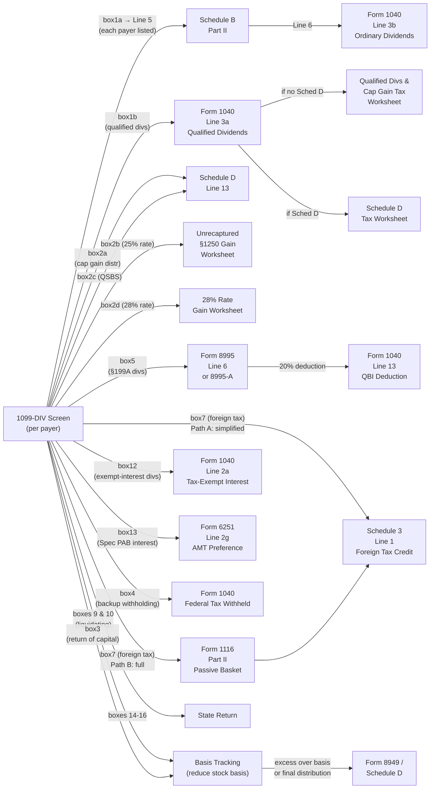

# 1099-DIV Screen — Implementation Context

**Tax Year:** 2025 **Drake Screen ID:** DIV (also: screen 3, line 3) **IRS
Form:** Form 1099-DIV — Dividends and Distributions **Status:** COMPLETE **Last
Updated:** 2026-03-27

---

## Purpose

The `1099div` data-entry screen captures all fields from Form 1099-DIV
(Dividends and Distributions) issued by a payer (broker, mutual fund, REIT,
etc.). A return may have **multiple** 1099-DIV records — one per payer — each
entered as a separate instance on this screen.

The screen is the entry point for dividend and distribution income and feeds
**six** distinct downstream calculation paths simultaneously.

---

## Sources

| #  | Document                                                            | Section / Page                                                        | URL                                                                                                                                        | Date Read  | Notes                                                                                                                                       |
| -- | ------------------------------------------------------------------- | --------------------------------------------------------------------- | ------------------------------------------------------------------------------------------------------------------------------------------ | ---------- | ------------------------------------------------------------------------------------------------------------------------------------------- |
| 1  | Drake Tax — Guide to 1098 and 1099 Informational Returns (KB 11742) | 1099-DIV row                                                          | https://kb.drakesoftware.com/kb/Drake-Tax/11742.htm                                                                                        | 2026-03-27 | Confirms screen name "DIV"; also screen 3 line 3                                                                                            |
| 2  | Instructions for Form 1099-DIV (Rev. Jan 2024)                      | Boxes 1a–16 specific instructions                                     | https://www.irs.gov/pub/irs-pdf/i1099div.pdf                                                                                               | 2026-03-27 | Authoritative box definitions; downloaded to research/                                                                                      |
| 3  | 2025 Instructions for Schedule B (Form 1040)                        | General Instructions, Part I, Part II, Part III                       | https://www.irs.gov/pub/irs-pdf/i1040sb.pdf                                                                                                | 2026-03-27 | $1,500 threshold, nominee rules, Line 5/6 → Form 1040 Line 3b; downloaded to research/i1040sb.pdf                                           |
| 4  | IRS Topic 404 — Dividends                                           | All                                                                   | https://www.irs.gov/taxtopics/tc404                                                                                                        | 2026-03-27 | $1,500 threshold confirmed; liquidating distribution = return of capital                                                                    |
| 5  | IRS Topic 409 — Capital Gains and Losses                            | 2025 rate tables                                                      | https://www.irs.gov/taxtopics/tc409                                                                                                        | 2026-03-27 | 0%/15%/20% breakpoints for 2025 by filing status                                                                                            |
| 6  | Instructions for Form 8995 (web)                                    | Line 6, income thresholds                                             | https://www.irs.gov/instructions/i8995                                                                                                     | 2026-03-27 | Box 5 → Form 8995 Line 6; 20% deduction; $197,300/$394,600 threshold for 8995-A                                                             |
| 7  | IRS Topic 856 — Foreign Tax Credit                                  | Claiming without Form 1116                                            | https://www.irs.gov/taxtopics/tc856                                                                                                        | 2026-03-27 | Conditions for simplified election; passive income basket                                                                                   |
| 8  | Instructions for Form 1116 (web)                                    | De minimis election                                                   | https://www.irs.gov/instructions/i1116                                                                                                     | 2026-03-27 | $300 single / $600 MFJ threshold for skipping Form 1116                                                                                     |
| 9  | Instructions for Form 6251 (web)                                    | Line 2g                                                               | https://www.irs.gov/instructions/i6251                                                                                                     | 2026-03-27 | Box 13 → Form 6251 Line 2g; 2025 AMT exemptions                                                                                             |
| 10 | About Schedule B (Form 1040) — IRS.gov                              | Recent developments                                                   | https://www.irs.gov/forms-pubs/about-schedule-b-form-1040                                                                                  | 2026-03-27 | No changes for 2025; confirms $1,500 threshold                                                                                              |
| 11 | About Form 1099-DIV — IRS.gov                                       | Overview                                                              | https://www.irs.gov/forms-pubs/about-form-1099-div                                                                                         | 2026-03-27 | Rev. Jan 2024 is current; no recent changes                                                                                                 |
| 12 | 2025 Form 1040 Instructions (i1040gi)                               | Lines 3a, 3b; Qualified Dividends and Cap Gain Tax Worksheet          | https://www.irs.gov/pub/irs-pdf/i1040gi.pdf                                                                                                | 2026-03-27 | Downloaded to research/i1040gi.pdf (4.2MB)                                                                                                  |
| 13 | Publication 550 — Investment Income and Expenses (2024)             | Liquidating distributions; foreign tax; §1202; §1250; collectibles    | https://www.irs.gov/pub/irs-pdf/p550.pdf                                                                                                   | 2026-03-27 | Downloaded to research/p550.pdf (2.3MB)                                                                                                     |
| 14 | IRS FAQ — Mutual Funds Costs, Distributions, Etc. (Q4)              | Capital gain distribution reporting — Schedule D vs Form 1040 Line 7a | https://www.irs.gov/faqs/capital-gains-losses-and-sale-of-home/mutual-funds-costs-distributions-etc/mutual-funds-costs-distributions-etc-4 | 2026-03-27 | Confirms dual path: Line 13 Schedule D (standard) or Line 7a Form 1040 (simplified, no other cap transactions)                              |
| 15 | 2025 Instructions for Schedule D (Form 1040) (web)                  | Capital gain distributions — when Schedule D required                 | https://www.irs.gov/instructions/i1040sd                                                                                                   | 2026-03-27 | Confirms Line 7a simplified exception; states Schedule D required for reporting cap gain distrib not reported directly on Form 1040 Line 7a |
| 16 | One Big Beautiful Bill Act (P.L. 119-21) — IRS newsroom             | §67(g) miscellaneous itemized deductions — permanent suspension       | https://www.irs.gov/newsroom/one-big-beautiful-bill-provisions                                                                             | 2026-03-27 | Signed July 4 2025; §67(g) suspension permanent; Box 6 investment expense deduction eliminated permanently                                  |
| 17 | Instructions for Form 8995-A (web)                                  | Phase-out ranges, W-2 wage limitation, UBIA                           | https://www.irs.gov/instructions/i8995a                                                                                                    | 2026-03-27 | §199A phase-out $197,300–$247,300 (single) / $394,600–$494,600 (MFJ); W-2/UBIA limitations do not apply to REIT dividend component          |
| 18 | Form 1040 Instructions 2025 (i1040gi) — web HTML version            | Line 25b — backup withholding from 1099                               | https://www.irs.gov/instructions/i1040gi                                                                                                   | 2026-03-27 | Confirmed: Line 25b = "Form(s) 1099" withholding; Line 25a = W-2; Line 25c = other. Backup withholding from box4 → Line 25b.                |

---

## Drake Screen Fields

Drake screen name: **DIV** Alternative entry path: screen 3, line 3 (for simple
returns)

Each instance of the DIV screen represents one payer's 1099-DIV. The screen
mirrors the IRS form boxes exactly, plus payer identification fields.

| Drake Field | Form 1099-DIV Box | Label                             | Data Type        | Constraints             | IRS Notes                                                       |
| ----------- | ----------------- | --------------------------------- | ---------------- | ----------------------- | --------------------------------------------------------------- |
| `payerName` | —                 | Payer Name                        | string           | Required                | Displayed on Schedule B Part II                                 |
| `payerEIN`  | —                 | Payer FEIN/EIN                    | string (9-digit) | Optional                | Used for payer identification                                   |
| `box1a`     | 1a                | Total Ordinary Dividends          | decimal          | ≥ 0; ≥ box1b            | Includes boxes 1b, 2e, and box 6 amount                         |
| `box1b`     | 1b                | Qualified Dividends               | decimal          | 0 ≤ box1b ≤ box1a       | Cannot be negative                                              |
| `box2a`     | 2a                | Total Capital Gain Distr.         | decimal          | ≥ 0; ≥ sum(2b,2c,2d,2f) | Long-term capital gain distributions                            |
| `box2b`     | 2b                | Unrecap. Sec. 1250 Gain           | decimal          | ≥ 0; ≤ box2a            | 25% rate gain subset of box2a                                   |
| `box2c`     | 2c                | Section 1202 Gain                 | decimal          | ≥ 0; ≤ box2a            | QSBS gain subset of box2a                                       |
| `box2d`     | 2d                | Collectibles (28%) Gain           | decimal          | ≥ 0; ≤ box2a            | 28% rate gain subset of box2a                                   |
| `box2e`     | 2e                | Section 897 Ordinary Divs         | decimal          | ≥ 0; ≤ box1a            | USRPI look-through; RIC/REIT only                               |
| `box2f`     | 2f                | Section 897 Capital Gain          | decimal          | ≥ 0; ≤ box2a            | USRPI look-through; RIC/REIT only                               |
| `box3`      | 3                 | Nondividend Distributions         | decimal          | ≥ 0                     | Return of capital; not taxable income                           |
| `box4`      | 4                 | Federal Income Tax Withheld       | decimal          | ≥ 0                     | Backup withholding                                              |
| `box5`      | 5                 | Section 199A Dividends            | decimal          | ≥ 0; ≤ box1a            | Qualified REIT divs; subset of box1a                            |
| `box6`      | 6                 | Investment Expenses               | decimal          | ≥ 0                     | §67(c) RIC expenses; included in box1a                          |
| `box7`      | 7                 | Foreign Tax Paid                  | decimal          | ≥ 0                     | In US dollars                                                   |
| `box8`      | 8                 | Foreign Country or US Possession  | string           | Optional                | Not required for RICs                                           |
| `box9`      | 9                 | Cash Liquidation Distributions    | decimal          | ≥ 0                     | NOT in box1a; reduces basis                                     |
| `box10`     | 10                | Noncash Liquidation Distributions | decimal          | ≥ 0                     | FMV at distribution date; NOT in box1a                          |
| `box11`     | 11                | FATCA Filing Requirement          | boolean          | —                       | Checkbox only; no calculation                                   |
| `box12`     | 12                | Exempt-Interest Dividends         | decimal          | ≥ 0; ≥ box13            | Includes box13; → Form 1040 Line 2a                             |
| `box13`     | 13                | Specified PAB Interest Divs       | decimal          | ≥ 0; ≤ box12            | → Form 6251 Line 2g (AMT)                                       |
| `box14`     | 14                | State (abbreviation)              | string           | Optional                | State return only                                               |
| `box15`     | 15                | Payer State ID                    | string           | Optional                | State return only                                               |
| `box16`     | 16                | State Income Tax Withheld         | decimal          | ≥ 0                     | State return only                                               |
| `isNominee` | —                 | Received as Nominee               | boolean          | —                       | Drake-specific flag; triggers nominee subtraction on Schedule B |

---

## Data Flow Diagram



---

## Calculation Logic

### 1. Schedule B Trigger and Routing

**Threshold:** Schedule B is required if **total ordinary dividends across all
payers exceed $1,500** (tax year 2025).

Also required regardless of amount if:

- Taxpayer received dividends as a **nominee** (in their name but belonging to
  another)
- Foreign accounts (Part III questions)

**Routing:**

1. Each payer's `box1a` is listed on Schedule B Part II, Line 5 (payer name +
   amount)
2. If nominee dividends received: list full amount on Line 5, then subtract
   "Nominee Distribution" below the subtotal
3. Schedule B Line 6 (total after nominee subtraction) → **Form 1040 Line 3b**

**Source:** 2025 Instructions for Schedule B (Form 1040), Part II;
IRS.gov/pub/irs-pdf/i1040sb.pdf

---

### 2. Qualified Dividends → Form 1040 Line 3a

- `box1b` (Qualified Dividends) is entered directly on **Form 1040 Line 3a**
- Schedule B is NOT used for qualified dividends (only ordinary dividends flow
  through Schedule B)
- Qualified dividends are taxed at preferential capital gains rates via the
  **Qualified Dividends and Capital Gain Tax Worksheet** (in Form 1040
  instructions)

**Worksheet selection decision tree:**

```
Does the return include qualified dividends (box1b > 0) OR any capital gains?
│
├─ NO → Use Tax Table or Tax Computation Worksheet (no preferential rates)
│
└─ YES → Is Schedule D required for this return?
    │
    ├─ YES (taxpayer has other capital transactions) → Use Schedule D Tax Worksheet
    │     (Schedule D Tax Worksheet is found in the Schedule D instructions)
    │
    └─ NO (no other Schedule D transactions) → Use Qualified Dividends and Capital
           Gain Tax Worksheet (QDCGW, found in Form 1040 instructions, Line 16)
```

**Qualified Dividends and Capital Gain Tax Worksheet (QDCGW) — key logic:** The
QDCGW is used when the return has qualified dividends or net long-term capital
gains but Schedule D is not otherwise required. The worksheet isolates the
preferential-rate income and taxes it at 0%/15%/20% while taxing remaining
ordinary income at regular rates. High-level structure:

1. Enter taxable income (Form 1040 Line 15)
2. Enter qualified dividends (Form 1040 Line 3a) and net long-term capital gain
3. Determine the portion of taxable income eligible for preferential rates
4. Apply 0% rate to income within the 0% bracket threshold
5. Apply 15% rate to income in the 15% range
6. Apply 20% rate to income above the 20% threshold
7. Compute tax on remaining ordinary income at regular rates using Tax Table
8. Sum the components → enter on Form 1040 Line 16 (Tax)

When Schedule D IS required, the **Schedule D Tax Worksheet** (in Schedule D
instructions) performs the same preferential-rate computation but also
incorporates Schedule D's 28% rate gain (Line 18) and unrecaptured §1250 gain
(Line 19) at their special rates.

**Source:** Form 1040 Instructions 2025 (i1040gi), Line 16 — Tax section;
Schedule D instructions (https://www.irs.gov/instructions/i1040sd)

**2025 Tax Rates for Qualified Dividends:**

| Rate | Single             | MFJ / QSS          | HOH                | MFS                |
| ---- | ------------------ | ------------------ | ------------------ | ------------------ |
| 0%   | ≤ $48,350          | ≤ $96,700          | ≤ $64,750          | ≤ $48,350          |
| 15%  | $48,351 – $533,400 | $96,701 – $600,050 | $64,751 – $566,700 | $48,351 – $300,000 |
| 20%  | > $533,400         | > $600,050         | > $566,700         | > $300,000         |

**Source:** IRS Topic 409 (https://www.irs.gov/taxtopics/tc409), confirmed for
2025

**Constraint:** `box1b` cannot be negative and cannot exceed `box1a`.

---

### 3. Capital Gain Distributions (Box 2a and Sub-boxes)

`box2a` (Total Capital Gain Distributions) routes via one of two paths:

**Path A — Standard (Schedule D required):** `box2a` → **Schedule D Line 13**
(long-term capital gain distribution). Schedule D is required whenever the
taxpayer has any other capital transactions (gains, losses, carryovers) OR when
any of `box2b`, `box2c`, or `box2d` are > 0 (because those sub-amounts require
Schedule D worksheets).

**Path B — Simplified exception (no Schedule D):** If the taxpayer has **no
other capital transactions** requiring Schedule D AND `box2b` = `box2c` =
`box2d` = 0, the `box2a` amount may be reported directly on **Form 1040 Line
7a** and the appropriate boxes on **Line 7b** checked. Schedule D is not filed
in this case.

> Exact IRS language (Schedule D instructions; IRS FAQ mutual funds #4): "If you
> have no requirement to use Schedule D (Form 1040), report this amount on line
> 7a of Form 1040 or 1040-SR and check the appropriate boxes on line 7b."

**Engine rule:** Always route `box2a` through Schedule D Line 13 when any of the
following are true:

- `box2b`, `box2c`, or `box2d` > 0
- Taxpayer has any other Schedule D entries (from any source)
- Otherwise: use Form 1040 Line 7a simplified path

Sub-amounts flow to specialized rate worksheets (only relevant when Schedule D
is filed):

| Box                        | Rate            | Worksheet / Treatment                                                 | Exact Worksheet Line                                                                   |
| -------------------------- | --------------- | --------------------------------------------------------------------- | -------------------------------------------------------------------------------------- |
| 2b (Unrecap. §1250 Gain)   | 25%             | Unrecaptured Section 1250 Gain Worksheet (in Schedule D instructions) | Enter on **Line 11** of the worksheet; worksheet total flows to **Schedule D Line 19** |
| 2c (Section 1202 Gain)     | 0%–50% excluded | Schedule D; QSBS exclusion (50%/60%/75%/100% by acquisition date)     | Schedule D Line 13 (combined with box2a)                                               |
| 2d (Collectibles 28% Gain) | 28%             | 28% Rate Gain Worksheet (in Schedule D instructions)                  | Enters the 28% Rate Gain Worksheet; result flows to **Schedule D Line 18**             |
| 2e (Section 897 Ordinary)  | Ordinary rates  | Informational for FIRPTA; not relevant for U.S. individual recipients | No separate line — informational only                                                  |
| 2f (Section 897 Capital)   | Cap gain rates  | Informational for FIRPTA; not relevant for U.S. individual recipients | No separate line — informational only                                                  |

**Box 2b — Unrecaptured §1250 Gain Worksheet detail:** The Unrecaptured Section
1250 Gain Worksheet (found within the Schedule D instructions) computes total
unrecaptured §1250 gain at 25% rate:

- Lines 1–3: Enter each §1250 property sold, calculate initial unrecaptured
  gains
- Line 4: Installment sale allocation (three sub-steps)
- Lines 5–10: Aggregate gains from all sources (property sales, partnerships,
  trusts, cap gain distributions)
- **Line 11**: Enter box 2b amount from Form 1099-DIV here (capital gain
  distributions attributable to unrecaptured §1250 gain)
- Line 12: Total unrecaptured §1250 gain → transfers to **Schedule D Line 19**
- Schedule D Line 19 amount is then taxed at 25% via the Schedule D Tax
  Worksheet

**Constraint:** `box2a` ≥ sum of `box2b` + `box2c` + `box2d` + `box2f`

**Source:** Form 1099-DIV instructions Box 2a–2f; IRC §1(h); Schedule D
instructions (https://www.irs.gov/instructions/i1040sd) confirming Unrecaptured
§1250 Gain Worksheet Line 11 for box 2b, Schedule D Lines 18 and 19; IRS FAQ
https://www.irs.gov/faqs/capital-gains-losses-and-sale-of-home/mutual-funds-costs-distributions-etc/mutual-funds-costs-distributions-etc-4

---

### 4. Section 199A Dividends → Form 8995 / 8995-A

`box5` (Section 199A Dividends) = qualified REIT dividends paid by a REIT or
RIC.

- This amount is a **subset of `box1a`** (already included in ordinary
  dividends)
- Additional 20% deduction computed separately on Form 8995 or 8995-A

**Routing and step-by-step calculation:**

**Step 1 — Eligibility check (holding period):**

- REIT stock must be held **> 45 days** during the **91-day window** centered on
  the ex-dividend date (beginning 45 days before the ex-dividend date, ending 45
  days after)
- If holding period NOT met: the box5 amount is NOT a qualified REIT dividend
  and must NOT be included in Form 8995 Line 6
- Source: IRC §199A(b)(2)(B); Form 8995 instructions; confirmed in Form 1099-DIV
  instructions

**Step 2 — Form selection:**

- If taxpayer's 2025 taxable income (before QBI deduction) ≤
  **$197,300** (single/all other) or ≤ **$394,600** (MFJ): use **Form 8995**
- If above those thresholds: use **Form 8995-A** (applies W-2 wage and UBIA
  limitations to QBI from trades/businesses, but NOT to REIT dividends)

**Step 3 — Enter box5 on Form 8995:**

- `box5` → **Form 8995 Line 6** ("Qualified REIT dividends and qualified PTP
  income or (loss)")
- Sum across all 1099-DIV payers with qualified REIT dividends

**Step 4 — Calculate 20% deduction (Form 8995):**

- Form 8995 Line 15 = 20% × (qualified REIT dividends + qualified PTP income
  from Line 6)
- Capped at 20% of taxable income before the QBI deduction minus net capital
  gain
- This is the §199A REIT/PTP component

**Step 5 — Carry deduction to Form 1040:**

- Form 8995 Line 15 → **Form 1040 Line 13** (Qualified Business Income
  Deduction)

**Phase-out / limitation for Form 8995-A (high-income taxpayers):**

- Phase-out begins at $197,300 (single) / $394,600 (MFJ) and ends at $247,300
  (single) / $494,600 (MFJ)
- Within phase-out range: W-2 wage and UBIA limitations phase in proportionally
  on Form 8995-A
- Note: W-2 wage and UBIA limitations apply only to QBI from trades or
  businesses, NOT to qualified REIT dividends (REIT component is always simply
  20% × qualified REIT dividends, even on Form 8995-A)
- Above phase-out endpoint: QBI component from businesses subject to full
  W-2/UBIA limitation; REIT component remains 20% × box5

**Source:** IRC §199A; Form 8995 instructions
(https://www.irs.gov/instructions/i8995); Form 8995-A instructions
(https://www.irs.gov/instructions/i8995a); Reg. §1.199A-3

---

### 5. Foreign Tax Credit (Box 7)

`box7` (Foreign Tax Paid) generates a foreign tax credit. Two routing paths:

**Path A — Simplified Election (no Form 1116):**

All **6** of the following conditions must be satisfied (IRS Topic 856; Form
1116 instructions):

1. **Passive income only:** All foreign source gross income is passive category
   income (e.g., dividends, interest) — no general category income or other
   baskets
2. **Qualified payee statements:** All foreign income and taxes are reported on
   qualified payee statements: Form 1099-DIV, Form 1099-INT, Schedule K-1 (Form
   1041), or Schedule K-3 (Forms 1065/1120-S)
3. **Dollar limit:** Total creditable foreign taxes across all sources are ≤
   **$300** (single/other filers) or ≤ **$600** (married filing jointly) — per
   Form 1116 instructions exact text
4. **Holding period met:** Stock or bonds held ≥ **16 days** in the **31-day
   window** centered on ex-dividend date; taxpayer not obligated to pay the
   amount to another party
5. **No Puerto Rico / Form 4563 exclusions:** Taxpayer is not filing Form 4563
   (exclusion of income from U.S. possessions) and is not excluding income from
   sources within Puerto Rico
6. **Taxes legally owed:** Foreign taxes were legally owed and not eligible for
   a refund or reduced rate under a tax treaty, and paid to countries recognized
   by the U.S. that do not support terrorism

If ALL 6 conditions are met → claim `box7` total directly on **Schedule 3 Line
1** (Foreign Tax Credit, directly on the return without Form 1116).

**Consequence of failing any condition:** Must use Path B (full Form 1116). No
carryback/carryforward available if Path A is used.

**IRS citation:** IRC §904(j); IRS Topic 856
(https://www.irs.gov/taxtopics/tc856); Form 1116 instructions
(https://www.irs.gov/instructions/i1116) — exact text confirmed: "Your total
creditable foreign taxes aren't more than $300 ($600 if married filing a joint
return)"

**Path B — Full Form 1116:**

Step-by-step routing for box 7 when simplified election is not available:

1. **Identify basket:** All dividend income from box 7 goes to the **passive
   income basket** (Form 1116, check box "Passive category income")
2. **Enter foreign tax paid:** `box7` amount → **Form 1116 Part II**, Column (b)
   "Foreign taxes paid" for the relevant country (box 8 = country name)
3. **Enter gross income:** The foreign dividend income (the portion of box1a
   attributable to foreign sources) → Form 1116 Part I
4. **Compute credit limit:** Form 1116 Part III computes: Credit Limit = US tax
   × (Foreign income ÷ Total income). Credit = lesser of (a) foreign taxes paid
   or (b) credit limit
5. **Carry to Schedule 3:** Form 1116 Line 35 (tentative credit) → **Schedule 3
   Line 1** (Foreign Tax Credit)
6. **Carryback/forward:** Any excess foreign tax credit (taxes paid exceeding
   the credit limit) may be carried back **1 year** or carried forward **10
   years** (IRC §904(c))

**Note:** If taxpayer has box7 amounts from multiple payers, aggregate all
passive-basket amounts on one Form 1116 (passive basket). A separate Form 1116
is needed for each different basket (passive vs. general vs. other).

**Source:** IRS Topic 856 (https://www.irs.gov/taxtopics/tc856); Form 1116
instructions (https://www.irs.gov/instructions/i1116); IRC §904

---

### 6. AMT — Specified Private Activity Bond Interest (Box 13)

`box13` (Specified Private Activity Bond Interest Dividends) is a **tax
preference item** for Alternative Minimum Tax.

- `box13` → **Form 6251 Line 2g** (Interest from specified private activity
  bonds exempt from regular tax)
- `box13` is a subset of `box12` and is already included in the `box12` amount

**2025 AMT Exemptions:**

| Filing Status | Exemption | Phaseout Begins |
| ------------- | --------- | --------------- |
| Single / HOH  | $88,100   | $626,350        |
| MFJ / QSS     | $137,000  | $1,252,700      |
| MFS           | $68,500   | $626,350        |

**Source:** Form 6251 instructions (https://www.irs.gov/instructions/i6251)

---

### 7. Exempt-Interest Dividends (Box 12)

`box12` (Exempt-Interest Dividends) = tax-exempt dividends from mutual funds or
other RICs.

- NOT taxable for regular income tax purposes
- → **Form 1040 Line 2a** (Tax-Exempt Interest)
- `box12` includes the `box13` (specified PAB) amount
- `box13` subset additionally flows to Form 6251 Line 2g (see §6 above)

**Source:** Schedule B 2025 instructions, Part I Tax-Exempt Interest section;
i1040sb.pdf p.2

---

### 8. Liquidating Distributions (Boxes 9 and 10)

`box9` (Cash Liquidating Distributions) and `box10` (Noncash Liquidating
Distributions) are **NOT** included in Box 1a. They are not dividends. Do NOT
route to Schedule B.

**Step-by-step basis reduction → Schedule D flow:**

**Step 1 — Determine amount:**

- `box9` (cash): use the dollar amount reported directly
- `box10` (noncash): use **fair market value at the date of distribution**

**Step 2 — Reduce basis:**

- Reduce the taxpayer's adjusted basis in the stock by the distribution amount
- Track cumulatively if multiple distributions from the same liquidation in the
  same year
- Basis cannot go below zero

**Step 3 — Determine if gain is triggered:**

- If cumulative liquidating distributions to date ≤ adjusted basis: **no
  current-year income recognized**; continue tracking basis in engine
- If a distribution causes cumulative distributions to exceed adjusted basis:
  **capital gain recognized** = cumulative distributions − original adjusted
  basis
- A capital **loss** is recognized only after the **final** liquidating
  distribution (when stock is cancelled) if total distributions are less than
  basis

**Step 4 — Characterize:**

- **Long-term** capital gain/loss: stock held > 1 year at date of
  final/triggering distribution
- **Short-term** capital gain/loss: stock held ≤ 1 year

**Step 5 — Report on Form 8949 / Schedule D:**

- Enter on **Form 8949** (Sales and Other Dispositions of Capital Assets):
  - Description: "[Company] liquidating distribution"
  - Date acquired: original stock purchase date
  - Date sold: date of final (or gain-triggering) distribution
  - Proceeds: total cumulative liquidating distributions received
  - Cost basis: original adjusted cost basis in the stock
  - Gain or loss: proceeds − basis
- Form 8949 totals carry to **Schedule D** (Part I for short-term; Part II for
  long-term)

**Engine note:** Engine must track cumulative liquidating distributions per
stock holding across tax years until the liquidation is complete. No
current-year form routing is needed for distributions that do not trigger a
gain.

**Source:** Form 1099-DIV instructions Box 9/10 caution note; IRS Topic 404
(https://www.irs.gov/taxtopics/tc404); Publication 550 (2024)

---

### 9. Nondividend Distributions (Box 3)

`box3` = return of capital; not taxable when received.

- Reduces taxpayer's **basis in the stock**
- No current-year form routing
- If distributions exceed basis: excess = capital gain (Schedule D)
- Engine must track running basis reduction across tax years

---

### 10. Backup Withholding (Box 4)

`box4` → **Form 1040 Line 25b** (Federal Income Tax Withheld — Form(s) 1099).

- Line 25b is the designated line for all 1099-reported withholding including
  backup withholding
- Line 25a is for W-2 withholding; Line 25c is for other forms
- The withholding aggregation node sums box4 across all 1099-DIV records and
  adds to the Line 25b total

**Source:** Form 1040 Instructions 2025 (i1040gi), Line 25 — Federal Income Tax
Withheld section: "Line 25b — Form(s) 1099." Source URL:
https://www.irs.gov/instructions/i1040gi

---

### 11. Investment Expenses (Box 6)

`box6` = recipient's pro-rata share of non-publicly-offered RIC expenses (IRC
§67(c)).

- Already **included in `box1a`** (gross income is grossed up under §67(c))
- **TCJA 2017** originally suspended §67(a)/(g) miscellaneous itemized
  deductions through 2025
- **One Big Beautiful Bill Act (P.L. 119-21, signed July 4, 2025)** made the
  suspension of miscellaneous itemized deductions **permanent** under §67(g).
  The deduction does NOT return in 2026 or any future year under current law.
- For tax year 2025 and all subsequent years: the income inclusion (via `box1a`)
  survives but **no offsetting Schedule A deduction** is available. `box6`
  increases taxable income with no deduction offset.
- Box 6 is still required to be reported by the payer; recipients cannot deduct
  it.

**Source:** IRC §67(c), §67(g); One Big Beautiful Bill Act §70101 (P.L. 119-21);
IRS news https://www.irs.gov/newsroom/one-big-beautiful-bill-provisions; Journal
of Accountancy
https://www.journalofaccountancy.com/news/2025/jun/tax-changes-in-senate-budget-reconciliation-bill/

---

## Constants

| Constant                                              | Value                 | Tax Year | IRS Source                                    | URL                                          |
| ----------------------------------------------------- | --------------------- | -------- | --------------------------------------------- | -------------------------------------------- |
| Schedule B ordinary dividend threshold                | $1,500                | 2025     | Schedule B instructions, General Instructions | https://www.irs.gov/pub/irs-pdf/i1040sb.pdf  |
| Qualified dividend rate — 0% threshold (Single)       | $48,350               | 2025     | IRS Topic 409                                 | https://www.irs.gov/taxtopics/tc409          |
| Qualified dividend rate — 0% threshold (MFJ/QSS)      | $96,700               | 2025     | IRS Topic 409                                 | https://www.irs.gov/taxtopics/tc409          |
| Qualified dividend rate — 0% threshold (HOH)          | $64,750               | 2025     | IRS Topic 409                                 | https://www.irs.gov/taxtopics/tc409          |
| Qualified dividend rate — 0% threshold (MFS)          | $48,350               | 2025     | IRS Topic 409                                 | https://www.irs.gov/taxtopics/tc409          |
| Qualified dividend rate — 15% upper (Single)          | $533,400              | 2025     | IRS Topic 409                                 | https://www.irs.gov/taxtopics/tc409          |
| Qualified dividend rate — 15% upper (MFJ/QSS)         | $600,050              | 2025     | IRS Topic 409                                 | https://www.irs.gov/taxtopics/tc409          |
| Qualified dividend rate — 15% upper (HOH)             | $566,700              | 2025     | IRS Topic 409                                 | https://www.irs.gov/taxtopics/tc409          |
| Qualified dividend rate — 15% upper (MFS)             | $300,000              | 2025     | IRS Topic 409                                 | https://www.irs.gov/taxtopics/tc409          |
| Form 8995 simplified income threshold (Single)        | $197,300              | 2025     | Form 8995 instructions                        | https://www.irs.gov/instructions/i8995       |
| Form 8995 simplified income threshold (MFJ)           | $394,600              | 2025     | Form 8995 instructions                        | https://www.irs.gov/instructions/i8995       |
| Foreign tax credit simplified election max (Single)   | $300                  | 2025     | Form 1116 instructions                        | https://www.irs.gov/instructions/i1116       |
| Foreign tax credit simplified election max (MFJ)      | $600                  | 2025     | Form 1116 instructions                        | https://www.irs.gov/instructions/i1116       |
| AMT exemption (Single/HOH)                            | $88,100               | 2025     | Form 6251 instructions                        | https://www.irs.gov/instructions/i6251       |
| AMT exemption (MFJ/QSS)                               | $137,000              | 2025     | Form 6251 instructions                        | https://www.irs.gov/instructions/i6251       |
| AMT exemption (MFS)                                   | $68,500               | 2025     | Form 6251 instructions                        | https://www.irs.gov/instructions/i6251       |
| AMT exemption phaseout start (Single/HOH)             | $626,350              | 2025     | Form 6251 instructions                        | https://www.irs.gov/instructions/i6251       |
| AMT exemption phaseout start (MFJ)                    | $1,252,700            | 2025     | Form 6251 instructions                        | https://www.irs.gov/instructions/i6251       |
| §199A deduction rate                                  | 20%                   | 2025     | IRC §199A; Form 8995                          | https://www.irs.gov/instructions/i8995       |
| §199A phase-out start (Single/other)                  | $197,300              | 2025     | Form 8995-A instructions                      | https://www.irs.gov/instructions/i8995a      |
| §199A phase-out end (Single/other)                    | $247,300              | 2025     | Form 8995-A instructions                      | https://www.irs.gov/instructions/i8995a      |
| §199A phase-out start (MFJ)                           | $394,600              | 2025     | Form 8995-A instructions                      | https://www.irs.gov/instructions/i8995a      |
| §199A phase-out end (MFJ)                             | $494,600              | 2025     | Form 8995-A instructions                      | https://www.irs.gov/instructions/i8995a      |
| REIT dividend holding period (days, 45-day rule)      | 45 (in 91-day window) | 2025     | Form 1099-DIV instructions                    | https://www.irs.gov/pub/irs-pdf/i1099div.pdf |
| Foreign tax credit holding period (stock, days)       | 16 (in 31-day window) | 2025     | IRS Topic 856                                 | https://www.irs.gov/taxtopics/tc856          |
| QSBS gain exclusion — post Sep 28 2010                | 100%                  | —        | IRC §1202; Form 1099-DIV instructions         | https://www.irs.gov/pub/irs-pdf/i1099div.pdf |
| Collectibles gain rate                                | 28%                   | 2025     | IRC §1(h)                                     | —                                            |
| Unrecaptured §1250 gain rate                          | 25%                   | 2025     | IRC §1(h)                                     | —                                            |
| Unrecaptured §1250 Gain Worksheet — box2b entry line  | Line 11               | 2025     | Schedule D instructions                       | https://www.irs.gov/instructions/i1040sd     |
| Unrecaptured §1250 Gain Worksheet — Schedule D output | Schedule D Line 19    | 2025     | Schedule D instructions                       | https://www.irs.gov/instructions/i1040sd     |
| 28% Rate Gain Worksheet — Schedule D output           | Schedule D Line 18    | 2025     | Schedule D instructions                       | https://www.irs.gov/instructions/i1040sd     |
| Backup withholding (Form 1099) — Form 1040 line       | Line 25b              | 2025     | Form 1040 instructions (i1040gi)              | https://www.irs.gov/instructions/i1040gi     |

---

## Engine Node Design

### Input Fields (per 1099-DIV record)

```typescript
interface Form1099DIV {
  // Payer identification
  payerName: string;
  payerEIN?: string;

  // Core income boxes
  box1a: number; // Total Ordinary Dividends
  box1b: number; // Qualified Dividends (subset of 1a)
  box2a: number; // Total Capital Gain Distr.
  box2b: number; // Unrecap. Sec. 1250 Gain (subset of 2a)
  box2c: number; // Section 1202 Gain (subset of 2a)
  box2d: number; // Collectibles 28% Gain (subset of 2a)
  box2e: number; // Section 897 Ordinary Divs (subset of 1a)
  box2f: number; // Section 897 Capital Gain (subset of 2a)
  box3: number; // Nondividend Distributions (return of capital)

  // Withholding
  box4: number; // Federal Income Tax Withheld

  // §199A
  box5: number; // Section 199A Dividends (subset of 1a)

  // Investment expenses
  box6: number; // Investment Expenses (included in 1a)

  // Foreign tax
  box7: number; // Foreign Tax Paid (USD)
  box8?: string; // Foreign Country or US Possession

  // Liquidating distributions (NOT in 1a)
  box9: number; // Cash Liquidation Distributions
  box10: number; // Noncash Liquidation Distributions

  // FATCA
  box11: boolean; // FATCA Filing Requirement

  // Tax-exempt dividends
  box12: number; // Exempt-Interest Dividends (includes 13)
  box13: number; // Specified PAB Interest Divs (subset of 12)

  // State (optional)
  box14?: string; // State abbreviation
  box15?: string; // Payer state ID
  box16?: number; // State income tax withheld

  // Drake-specific
  isNominee: boolean; // Received as nominee
}
```

### Validation Rules

The following validation rules must be enforced at input. Each rule includes the
numeric condition, the consequence if violated, and the IRS citation.

#### Cross-Field Validation Rules

| #   | Rule                                                                     | Numeric Condition                          | Consequence if Violated                                                                                                                                                                 | IRS Citation                                                           |
| --- | ------------------------------------------------------------------------ | ------------------------------------------ | --------------------------------------------------------------------------------------------------------------------------------------------------------------------------------------- | ---------------------------------------------------------------------- |
| V1  | Qualified dividends cannot exceed total ordinary dividends               | `box1b ≤ box1a`                            | Error: qualified dividends are a subset of ordinary dividends; box1b cannot be reported on Form 1040 Line 3a if it exceeds box1a                                                        | Form 1099-DIV instructions Box 1b: "This amount is included in box 1a" |
| V2  | Unrecaptured §1250 gain cannot exceed total capital gain distributions   | `box2b ≤ box2a`                            | Error: box2b is a sub-component of box2a; cannot be taxed at 25% rate in excess of the reported capital gain                                                                            | Form 1099-DIV instructions Box 2b                                      |
| V3  | Section 1202 gain cannot exceed total capital gain distributions         | `box2c ≤ box2a`                            | Error: box2c is a sub-component of box2a                                                                                                                                                | Form 1099-DIV instructions Box 2c                                      |
| V4  | Collectibles 28% gain cannot exceed total capital gain distributions     | `box2d ≤ box2a`                            | Error: box2d is a sub-component of box2a                                                                                                                                                | Form 1099-DIV instructions Box 2d                                      |
| V5  | Section 897 capital gain cannot exceed total capital gain distributions  | `box2f ≤ box2a`                            | Error: box2f is a sub-component of box2a                                                                                                                                                | Form 1099-DIV instructions Box 2f                                      |
| V6  | Sum of all capital gain sub-amounts cannot exceed total                  | `box2b + box2c + box2d + box2f ≤ box2a`    | Error: the sub-amounts (2b, 2c, 2d, 2f) are all subsets of box2a; their sum cannot exceed box2a                                                                                         | Form 1099-DIV instructions Boxes 2b–2f                                 |
| V7  | Specified PAB interest dividends cannot exceed exempt-interest dividends | `box13 ≤ box12`                            | Error: box13 is a subset of box12; AMT preference item cannot exceed the total tax-exempt dividend                                                                                      | Form 1099-DIV instructions Box 13: "included in box 12"                |
| V8  | §199A dividends cannot exceed total ordinary dividends                   | `box5 ≤ box1a`                             | Error: box5 represents qualified REIT dividends, which are a subset of ordinary dividends (box1a); cannot claim §199A deduction on income not included in ordinary dividends            | IRC §199A(b)(2); Form 1099-DIV instructions Box 5                      |
| V9  | §199A holding period check                                               | REIT stock held > 45 days in 91-day window | Warning/disqualification: if holding period not met, box5 amount is NOT a qualified REIT dividend and must NOT be routed to Form 8995 Line 6; no §199A deduction on unqualified amounts | IRC §199A(b)(2)(B); Reg. §1.199A-3; Form 8995 instructions             |
| V10 | Foreign tax holding period check                                         | Stock held ≥ 16 days in 31-day window      | Warning: if holding period not met, box7 foreign tax is not creditable for that dividend; simplified election (Path A) is also unavailable                                              | IRS Topic 856; IRC §901(k)                                             |

#### Field-Level Constraints

```typescript
// All monetary fields must be ≥ 0
box1a >= 0;
box1b >= 0;
box2a >= 0;
box2b >= 0;
box2c >= 0;
box2d >= 0;
box2e >= 0;
box2f >= 0;
box3 >= 0;
box4 >= 0;
box5 >= 0;
box6 >= 0;
box7 >= 0;
box9 >= 0;
box10 >= 0;
box12 >= 0;
box13 >= 0;
box16 >= 0;

// Subset constraints (cross-field, per above table)
box1b <= box1a; // V1
box2b <= box2a; // V2
box2c <= box2a; // V3
box2d <= box2a; // V4
box2f <= box2a; // V5
box2b + box2c + box2d + box2f <= box2a; // V6
box13 <= box12; // V7
box5 <= box1a; // V8
box2e <= box1a; // informational; §897 ordinary subset of box1a
```

### Output Slots (what this node publishes)

| Output                             | Destination                                                                          | Notes                          |
| ---------------------------------- | ------------------------------------------------------------------------------------ | ------------------------------ |
| `ordinaryDividends` (box1a)        | Schedule B Part II Line 5                                                            | Aggregated across all payers   |
| `qualifiedDividends` (box1b)       | Form 1040 Line 3a                                                                    | Direct; not through Schedule B |
| `capitalGainDistributions` (box2a) | Schedule D Line 13 (standard) OR Form 1040 Line 7a (simplified, no other Schedule D) | Long-term                      |
| `unrecap1250Gain` (box2b)          | Unrecaptured §1250 Gain Worksheet                                                    | 25% rate                       |
| `section1202Gain` (box2c)          | Schedule D / QSBS computation                                                        | Exclusion applies              |
| `collectiblesGain` (box2d)         | 28% Rate Gain Worksheet                                                              |                                |
| `section199ADividends` (box5)      | Form 8995 Line 6                                                                     | 20% QBI deduction              |
| `foreignTaxPaid` (box7)            | Form 1116 Part II or Schedule 3 Line 1                                               | Passive basket                 |
| `exemptInterestDividends` (box12)  | Form 1040 Line 2a                                                                    | Tax-exempt                     |
| `specifiedPABInterest` (box13)     | Form 6251 Line 2g                                                                    | AMT preference                 |
| `federalWithheld` (box4)           | Withholding aggregator                                                               | Federal credit                 |
| `liquidatingCash` (box9)           | Basis tracker → Schedule D                                                           | Return of capital first        |
| `liquidatingNoncash` (box10)       | Basis tracker → Schedule D                                                           | FMV at distribution date       |
| `nondividendDistributions` (box3)  | Basis tracker only                                                                   | No current-year form           |
| `stateWithheld` (box16)            | State return withholding node                                                        |                                |

### Schedule B Node Logic

The Schedule B aggregation node:

1. Collects all 1099-DIV records' `box1a` values
2. Sums them
3. If sum > $1,500 OR any record has `isNominee = true`: generates Schedule B
4. For nominees: lists full payer amount, then subtracts nominee portion
5. Line 6 result → Form 1040 Line 3b

---

## Edge Cases

| Case                                                   | Handling                                                                                                                                                                                                                                                   |
| ------------------------------------------------------ | ---------------------------------------------------------------------------------------------------------------------------------------------------------------------------------------------------------------------------------------------------------- |
| box1b = 0 on all 1099-DIVs                             | No qualified dividend rate applies; all dividends taxed at ordinary rates                                                                                                                                                                                  |
| box2a > 0, no other Schedule D, box2b/2c/2d = 0        | Simplified path available: report box2a directly on Form 1040 Line 7a; check boxes on Line 7b; Schedule D not filed                                                                                                                                        |
| box2a > 0 with any of box2b/2c/2d > 0                  | Schedule D Line 13 required (sub-amounts need Schedule D rate worksheets); Line 7a simplified path not available                                                                                                                                           |
| box1a = 0, box2a > 0                                   | Capital gain distributions from mutual fund with no ordinary dividends; valid (e.g., pure cap gain fund)                                                                                                                                                   |
| box1a ≤ $1,500 across all payers                       | Schedule B not required unless other triggers apply (nominee, foreign accounts)                                                                                                                                                                            |
| box7 > $600 (MFJ)                                      | Form 1116 required; simplified election unavailable                                                                                                                                                                                                        |
| box5 > 0 and taxable income > $394,600 (MFJ)           | Must use Form 8995-A, not Form 8995                                                                                                                                                                                                                        |
| box13 > 0                                              | AMT preference; triggers Form 6251 computation                                                                                                                                                                                                             |
| box9 or box10 > 0                                      | Liquidating distribution; reduces basis, not ordinary income — must NOT flow to Schedule B                                                                                                                                                                 |
| box2e / box2f > 0                                      | Section 897 USRPI look-through; informational only for U.S. individuals; no separate calculation                                                                                                                                                           |
| box11 = true                                           | FATCA checkbox only; no tax calculation impact on 1040                                                                                                                                                                                                     |
| Multiple payers                                        | Each listed separately on Schedule B Line 5; all box1b values summed for Form 1040 Line 3a                                                                                                                                                                 |
| isNominee = true                                       | Full amount on Schedule B, then "Nominee Distribution" subtraction; must issue Form 1099-DIV to actual owner                                                                                                                                               |
| box6 > 0 (Investment Expenses)                         | Grossed into box1a; NO Schedule A deduction available — miscellaneous itemized deduction suspension made PERMANENT by One Big Beautiful Bill Act (P.L. 119-21, July 4 2025). Deduction does not return in 2026.                                            |
| box3 > 0 (Nondividend)                                 | Return of capital; reduces basis; no current-year income recognition                                                                                                                                                                                       |
| Holding period not met for §199A (Validation Rule V9)  | REIT stock NOT held > 45 days in 91-day window centered on ex-dividend date → box5 amount is NOT a qualified REIT dividend; must NOT be routed to Form 8995 Line 6; no §199A deduction on unqualified amounts. Source: IRC §199A(b)(2)(B); Reg. §1.199A-3. |
| Foreign holding period < 16 days (Validation Rule V10) | Stock NOT held ≥ 16 days in 31-day window → box7 foreign tax is not creditable for that dividend; simplified election (Path A) is also unavailable. Source: IRS Topic 856; IRC §901(k).                                                                    |

---

## Upstream Dependencies

| Dependency                                   | What is needed                                                                                                                                   |
| -------------------------------------------- | ------------------------------------------------------------------------------------------------------------------------------------------------ |
| Filing status                                | Required for Schedule B threshold, qualified dividend rate brackets, §199A phaseout, AMT exemption, foreign tax credit simplified election limit |
| Taxable income (pre-QBI)                     | Required to determine Form 8995 vs 8995-A                                                                                                        |
| Stock basis records                          | Required for liquidating distributions (box9/10) and nondividend distributions (box3)                                                            |
| Other foreign tax credits from other sources | Required for total foreign tax tally to determine Path A vs Path B                                                                               |
| Schedule D (existence of)                    | Determines which worksheet applies for qualified dividends                                                                                       |

---

## Downstream Forms Fed

| Form / Schedule        | Lines                                                                                                                               | Trigger                                        |
| ---------------------- | ----------------------------------------------------------------------------------------------------------------------------------- | ---------------------------------------------- |
| Schedule B Part II     | Line 5 (payer list), Line 6 (total)                                                                                                 | box1a > $1,500 OR nominee OR foreign accounts  |
| Form 1040              | Line 3a (qualified divs); Line 3b (ordinary divs); Line 2a (tax-exempt); Line 25b (backup withholding)                              | Always                                         |
| Schedule D             | Line 13 (cap gain distributions); Unrecap §1250 Gain Worksheet Line 11 → Sched D Line 19; 28% Rate Gain Worksheet → Sched D Line 18 | box2a > 0                                      |
| Form 8995 or 8995-A    | Line 6 (§199A qualified REIT divs)                                                                                                  | box5 > 0 (and holding period met)              |
| Form 1116              | Part II (passive basket)                                                                                                            | box7 > 0 AND simplified election not available |
| Schedule 3             | Line 1 (foreign tax credit)                                                                                                         | box7 > 0 (either path A or B)                  |
| Form 6251              | Line 2g (specified PAB interest)                                                                                                    | box13 > 0                                      |
| Form 8949 / Schedule D | Gain/loss on stock (Form 8949 → Schedule D Part I or II)                                                                            | box9 or box10 > 0 (after basis exhausted)      |
| Withholding aggregator | Form 1040 Line 25b (1099 withholding)                                                                                               | box4 > 0                                       |
| State return engine    | Passed through as-is (see State Fields section below)                                                                               | box14/15/16 present                            |

---

## State Fields (Boxes 14–16) — Scope Declaration

**Boxes 14 (State abbreviation), 15 (Payer State ID), and 16 (State Income Tax
Withheld) are OUT OF SCOPE for the federal tax engine.**

These fields are collected by the 1099-DIV screen and passed through unchanged
to the state tax engine. The federal engine:

- Does NOT use box14, box15, or box16 in any federal form calculation
- DOES store them in the record for state engine consumption
- DOES NOT validate state ID format (state engine responsibility)
- DOES validate box16 ≥ 0 (non-negative withholding amount)

The state engine is responsible for routing box16 to the appropriate state
withholding credit and box14/15 for payer identification on state returns.

**IRS note:** The IRS does not require payers to complete boxes 14–16. These are
optional fields for state reporting. Source: Form 1099-DIV instructions, Box
14–16.

---

## Change History

| Date       | Document                                                                | Section                                                                   | URL                                                                                                                                        | Run ID  | Change                                                                                                                                                  |
| ---------- | ----------------------------------------------------------------------- | ------------------------------------------------------------------------- | ------------------------------------------------------------------------------------------------------------------------------------------ | ------- | ------------------------------------------------------------------------------------------------------------------------------------------------------- |
| 2026-03-27 | —                                                                       | —                                                                         | —                                                                                                                                          | init    | Skeleton created                                                                                                                                        |
| 2026-03-27 | Drake KB 11742                                                          | 1099-DIV row                                                              | https://kb.drakesoftware.com/kb/Drake-Tax/11742.htm                                                                                        | phase-1 | Drake screen name "DIV" confirmed; screen 3 line 3 alternative entry                                                                                    |
| 2026-03-27 | Form 1099-DIV Instructions Rev. Jan 2024                                | Boxes 1a–16                                                               | https://www.irs.gov/pub/irs-pdf/i1099div.pdf                                                                                               | phase-2 | All 16 box definitions, constraints, and routing extracted                                                                                              |
| 2026-03-27 | 2025 Instructions for Schedule B                                        | Part II, General                                                          | https://www.irs.gov/pub/irs-pdf/i1040sb.pdf                                                                                                | phase-2 | $1,500 threshold, nominee rules, Line 5/6 → Form 1040 Line 3b                                                                                           |
| 2026-03-27 | IRS Topic 409                                                           | 2025 rate tables                                                          | https://www.irs.gov/taxtopics/tc409                                                                                                        | phase-2 | 0%/15%/20% breakpoints for all filing statuses                                                                                                          |
| 2026-03-27 | Form 8995 instructions                                                  | Line 6, thresholds                                                        | https://www.irs.gov/instructions/i8995                                                                                                     | phase-2 | Box 5 → Form 8995 Line 6; $197,300/$394,600 threshold; 20% deduction                                                                                    |
| 2026-03-27 | IRS Topic 856                                                           | Claiming without Form 1116                                                | https://www.irs.gov/taxtopics/tc856                                                                                                        | phase-2 | Full foreign tax credit conditions; simplified election conditions                                                                                      |
| 2026-03-27 | Form 1116 instructions                                                  | De minimis                                                                | https://www.irs.gov/instructions/i1116                                                                                                     | phase-2 | $300/$600 threshold for simplified foreign tax credit election                                                                                          |
| 2026-03-27 | Form 6251 instructions                                                  | Line 2g, AMT exemptions                                                   | https://www.irs.gov/instructions/i6251                                                                                                     | phase-2 | Box 13 → Form 6251 Line 2g; 2025 AMT exemption amounts                                                                                                  |
| 2026-03-27 | Schedule B instructions 2025                                            | Tax-exempt interest section                                               | https://www.irs.gov/pub/irs-pdf/i1040sb.pdf                                                                                                | phase-2 | Box 12 → Form 1040 Line 2a confirmed                                                                                                                    |
| 2026-03-27 | IRS Topic 404                                                           | Liquidating distributions                                                 | https://www.irs.gov/taxtopics/tc404                                                                                                        | phase-2 | Liquidating distributions = return of capital, then capital gain                                                                                        |
| 2026-03-27 | Form 1040 Instructions 2025 (i1040gi)                                   | Lines 3a/3b; Qualified Divs & Cap Gain Tax Worksheet                      | https://www.irs.gov/pub/irs-pdf/i1040gi.pdf                                                                                                | phase-4 | Downloaded; confirms routing of qualified dividends and capital gain distributions                                                                      |
| 2026-03-27 | Publication 550 (2024)                                                  | Investment income, liquidating distributions                              | https://www.irs.gov/pub/irs-pdf/p550.pdf                                                                                                   | phase-4 | Downloaded; supports liquidating distribution basis-first treatment                                                                                     |
| 2026-03-27 | Form 1116 instructions (web)                                            | De minimis election exact text                                            | https://www.irs.gov/instructions/i1116                                                                                                     | phase-5 | Confirmed exact text: "not more than $300 ($600 if married filing a joint return)"; $300/$600 threshold verified                                        |
| 2026-03-27 | IRS FAQ — Mutual Funds #4                                               | Capital gain distribution reporting                                       | https://www.irs.gov/faqs/capital-gains-losses-and-sale-of-home/mutual-funds-costs-distributions-etc/mutual-funds-costs-distributions-etc-4 | phase-5 | Confirmed dual path: Schedule D Line 13 (standard) vs Form 1040 Line 7a (simplified, no other cap transactions); §3 Per-Field Routing updated           |
| 2026-03-27 | Schedule D instructions (2025)                                          | Capital gain distributions                                                | https://www.irs.gov/instructions/i1040sd                                                                                                   | phase-5 | Confirms Form 1040 Line 7a simplified exception; Schedule D Line 13 standard path                                                                       |
| 2026-03-27 | One Big Beautiful Bill Act (P.L. 119-21, signed July 4 2025)            | §67(g) — miscellaneous itemized deductions                                | https://www.irs.gov/newsroom/one-big-beautiful-bill-provisions                                                                             | phase-5 | §67(g) suspension made PERMANENT; Box 6 investment expense deduction will never return under current law; §11 and Edge Cases updated                    |
| 2026-03-27 | Form 1040 Instructions 2025 (i1040gi) — HTML                            | Line 25b                                                                  | https://www.irs.gov/instructions/i1040gi                                                                                                   | rule-13 | Confirmed box4 (backup withholding) → Form 1040 Line 25b ("Form(s) 1099"); §10 updated with exact line number                                           |
| 2026-03-27 | Schedule D instructions (web)                                           | Unrecaptured §1250 Gain Worksheet Lines 11 and 12; Schedule D Lines 18/19 | https://www.irs.gov/instructions/i1040sd                                                                                                   | rule-13 | box2b → Unrecaptured §1250 Gain Worksheet Line 11 → Schedule D Line 19; box2d → 28% Rate Gain Worksheet → Schedule D Line 18; §3 updated                |
| 2026-03-27 | Form 8995-A instructions (web)                                          | Phase-out ranges, W-2/UBIA limitation                                     | https://www.irs.gov/instructions/i8995a                                                                                                    | rule-13 | §199A phase-out confirmed: $197,300–$247,300 (single) / $394,600–$494,600 (MFJ); REIT component not subject to W-2/UBIA limit; §4 and Constants updated |
| 2026-03-27 | IRS Topic 856                                                           | 6 conditions for simplified foreign tax credit election                   | https://www.irs.gov/taxtopics/tc856                                                                                                        | rule-13 | Confirmed 6 conditions (not 5) including legitimacy and Puerto Rico exclusion; §5 expanded with all 6 conditions and Form 1116 step-by-step             |
| 2026-03-27 | IRS Topic 404; Publication 550                                          | Liquidating distributions basis-first treatment                           | https://www.irs.gov/taxtopics/tc404                                                                                                        | rule-13 | §8 expanded with 5-step basis reduction → Form 8949 / Schedule D flow                                                                                   |
| 2026-03-27 | Form 1040 Instructions; IRC §199A; IRC §901; Form 1099-DIV instructions | Cross-field validation rules                                              | —                                                                                                                                          | rule-13 | Added Validation Rules section with 10 named rules (V1–V10), each with numeric condition, consequence, and IRS citation                                 |
| 2026-03-27 | Form 1040 Instructions; QDCGW                                           | Qualified Dividends and Capital Gain Tax Worksheet decision tree          | https://www.irs.gov/instructions/i1040gi                                                                                                   | rule-13 | §2 updated with full worksheet decision tree and high-level QDCGW step-by-step logic                                                                    |
| 2026-03-27 | Form 1099-DIV instructions                                              | State fields scope declaration                                            | https://www.irs.gov/pub/irs-pdf/i1099div.pdf                                                                                               | rule-13 | Added State Fields section: boxes 14–16 explicitly out of scope for federal engine; passed to state engine as-is                                        |
