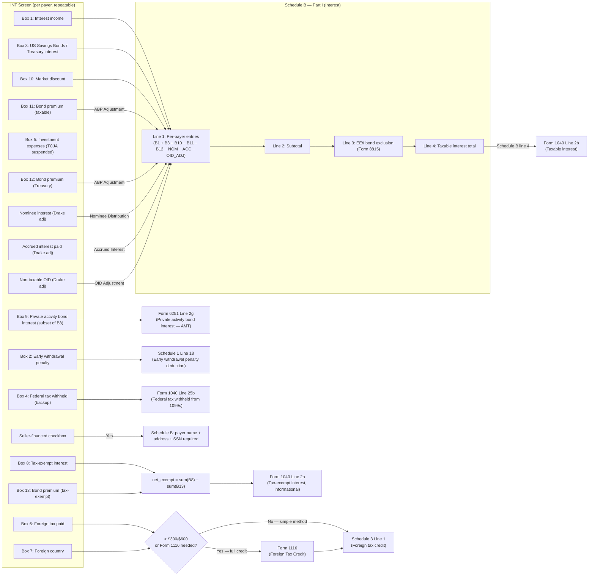

# Screen: 1099-INT (Interest Income)

> Tax Year: 2025 Drake Screen Code: `INT` Status: COMPLETE Last Updated:
> 2026-03-27

---

## 1. Purpose

The 1099-INT screen captures interest income reported on IRS Form 1099-INT. A
separate `INT` screen instance is created per payer (the screen is a repeatable
list). The screen feeds primarily into **Schedule B Part I** and, depending on
box values, also routes to Form 1040 lines 2a/2b, Schedule 1 line 18, Schedule 3
line 1, Form 6251 line 2g, and the payments section (line 25b).

The coding agent must implement this as a repeatable connector node: multiple
1099-INT entries (one per payer) aggregate into a single Schedule B node.

---

## 2. Sources

| #  | Document                                                                               | Section/Page                                                                                                                             | URL                                                                                   | Date Read  |
| -- | -------------------------------------------------------------------------------------- | ---------------------------------------------------------------------------------------------------------------------------------------- | ------------------------------------------------------------------------------------- | ---------- |
| 1  | Drake KB 11742 — Guide to 1099 Informational Returns                                   | INT screen entry                                                                                                                         | https://kb.drakesoftware.com/kb/Drake-Tax/11742.htm                                   | 2026-03-27 |
| 2  | Drake KB 10871 — Schedule B: Form Not Generating                                       | INT screen, Schedule B trigger                                                                                                           | https://kb.drakesoftware.com/kb/Drake-Tax/10871.htm                                   | 2026-03-27 |
| 3  | Drake KB 11523 — 1099-DIV and 1099-INT: Exempt Interest Dividend Not Carrying to State | Box 8 state handling                                                                                                                     | https://kb.drakesoftware.com/kb/Drake-Tax/11523.htm                                   | 2026-03-27 |
| 4  | Drake KB 13316 — 1040/1041: Tax-Exempt OID Interest                                    | Non-taxable OID field on INT screen                                                                                                      | https://kb.drakesoftware.com/kb/Drake-Tax/13316.htm                                   | 2026-03-27 |
| 5  | IRS Instructions for Forms 1099-INT and 1099-OID (Rev. Jan 2024)                       | Boxes 1–17                                                                                                                               | https://www.irs.gov/instructions/i1099int                                             | 2026-03-27 |
| 6  | IRS Instructions for Schedule B (Form 1040) — 2025                                     | Parts I, II, III                                                                                                                         | https://www.irs.gov/instructions/i1040sb                                              | 2026-03-27 |
| 7  | IRS Instructions for Form 1116 (2025)                                                  | Foreign tax credit election                                                                                                              | https://www.irs.gov/instructions/i1116                                                | 2026-03-27 |
| 8  | IRS Instructions for Form 6251 (AMT)                                                   | Line 2g                                                                                                                                  | https://www.irs.gov/instructions/i6251                                                | 2026-03-27 |
| 9  | IRS Publication 550 — Investment Income and Expenses                                   | Bond premium (IRC §171), OID, accrued interest, nominees                                                                                 | https://www.irs.gov/publications/p550                                                 | 2026-03-27 |
| 10 | IRS Instructions for Form 1040 (2025)                                                  | Lines 2a, 2b, 25b; Schedule 3 line 1                                                                                                     | https://www.irs.gov/instructions/i1040gi                                              | 2026-03-27 |
| D1 | IRS Form 1099-INT (Rev. Jan 2024) — form itself                                        | All boxes                                                                                                                                | https://www.irs.gov/pub/irs-pdf/f1099int.pdf                                          | 2026-03-27 |
| D2 | IRS Instructions 1099-INT PDF                                                          | Boxes 1–17                                                                                                                               | https://www.irs.gov/pub/irs-pdf/i1099int.pdf                                          | 2026-03-27 |
| D3 | IRS Schedule B Instructions PDF (2025)                                                 | Parts I–III                                                                                                                              | https://www.irs.gov/pub/irs-pdf/i1040sb.pdf                                           | 2026-03-27 |
| D4 | IRS Publication 550 PDF                                                                | Full pub                                                                                                                                 | https://www.irs.gov/pub/irs-pdf/p550.pdf                                              | 2026-03-27 |
| D5 | IRS Form 6251 Instructions PDF                                                         | Line 2g                                                                                                                                  | https://www.irs.gov/pub/irs-pdf/i6251.pdf                                             | 2026-03-27 |
| D6 | IRS Form 1116 Instructions PDF                                                         | Foreign tax credit                                                                                                                       | https://www.irs.gov/pub/irs-pdf/i1116.pdf                                             | 2026-03-27 |
| 11 | Drake KB 14216 — Interest Income: EF Message 5378 and 5285                             | Confirms box 10 (market discount) is a standard INT screen field in Drake's line total calculation                                       | https://kb.drakesoftware.com/kb/Drake-Tax/14216.htm                                   | 2026-03-27 |
| 12 | IRS IRIS Schemas and Business Rules page                                               | Confirms 1099-INT IRIS schemas exist but are gated behind TCC/SOR (not publicly accessible)                                              | https://www.irs.gov/e-file-providers/iris-schemas-and-business-rules                  | 2026-03-27 |
| 13 | IRS MeF Schemas and Business Rules page                                                | Confirms 1040-series MeF schemas (including Schedule B interest) gated behind SOR (not publicly accessible)                              | https://www.irs.gov/e-file-providers/modernized-e-file-mef-schemas-and-business-rules | 2026-03-27 |
| 14 | IRS Publication 970 — Tax Benefits for Education                                       | Form 8815 eligibility, MAGI phase-out thresholds TY2025 ($99,500–$114,500 single; $149,250–$179,250 MFJ)                                 | https://www.irs.gov/publications/p970                                                 | 2026-03-27 |
| 15 | Treasury Regulation §1.171-2 (Cornell LII)                                             | Bond premium in excess of interest: taxable bond excess = §171 deduction (not capital loss); tax-exempt bond excess = nondeductible loss | https://www.law.cornell.edu/cfr/text/26/1.171-2                                       | 2026-03-27 |
| 16 | IRC §171 (Cornell LII)                                                                 | Bond premium amortization — §171(a)(1) deduction for taxable bonds; §171(a)(2) no deduction for tax-exempt bonds                         | https://www.law.cornell.edu/uscode/text/26/171                                        | 2026-03-27 |

---

## 3. Drake Screen Layout

**Screen code:** `INT` **Navigation:** Income tab → INT (also reachable from
Screen 3 line 2 for amounts < $1,500) **Multiplicity:** Repeatable — one INT
instance per payer/1099-INT form received

### 3.1 Header / Identification Fields

| Drake Field              | Label                                                                     | Type              | Notes                                                                                                                                                                       |
| ------------------------ | ------------------------------------------------------------------------- | ----------------- | --------------------------------------------------------------------------------------------------------------------------------------------------------------------------- |
| Payer name               | Payer's name                                                              | String            | Required                                                                                                                                                                    |
| Payer TIN                | Payer's TIN/EIN                                                           | String (9 digits) | Used for Schedule B display                                                                                                                                                 |
| Account number / CUSIP   | Account number (maps to Box 14: Tax-Exempt and Tax Credit Bond CUSIP No.) | String            | Informational only. IRS box 14 requires the CUSIP of any tax-exempt or tax credit bond for which interest is reported in box 8 or box 1; enter "various" if multiple bonds. |
| Seller-financed checkbox | Seller-financed mortgage                                                  | Boolean           | If checked, payer address fields appear; Schedule B must include payer SSN                                                                                                  |
| Payer street             | Payer's street address                                                    | String            | Visible only when seller-financed checked                                                                                                                                   |
| Payer city/state/zip     | Payer's city, state, ZIP                                                  | String            | Visible only when seller-financed checked                                                                                                                                   |
| Payer SSN                | Payer's SSN                                                               | String (9 digits) | Required when seller-financed checked                                                                                                                                       |

### 3.2 Form 1099-INT Box Fields

| Drake Field | Box # | IRS Label                                             | Type    | Notes                                                                                                                      |
| ----------- | ----- | ----------------------------------------------------- | ------- | -------------------------------------------------------------------------------------------------------------------------- |
| Box 1       | 1     | Interest income                                       | Decimal | Taxable interest; → Sch B line 1                                                                                           |
| Box 2       | 2     | Early withdrawal penalty                              | Decimal | → Sch 1 line 18 (deduction)                                                                                                |
| Box 3       | 3     | Interest on U.S. Savings Bonds and Treas. obligations | Decimal | → Sch B line 1 (separate line for state tracking)                                                                          |
| Box 4       | 4     | Federal income tax withheld                           | Decimal | → 1040 line 25b                                                                                                            |
| Box 5       | 5     | Investment expenses                                   | Decimal | TCJA suspended — no individual deduction; display only                                                                     |
| Box 6       | 6     | Foreign tax paid                                      | Decimal | → Sch 3 line 1 (if ≤ de minimis) or Form 1116                                                                              |
| Box 7       | 7     | Foreign country or U.S. territory                     | String  | Supports Form 1116                                                                                                         |
| Box 8       | 8     | Tax-exempt interest                                   | Decimal | → 1040 line 2a (informational; not taxable)                                                                                |
| Box 9       | 9     | Specified private activity bond interest              | Decimal | → Form 6251 line 2g; included in box 8 total                                                                               |
| Box 10      | 10    | Market discount                                       | Decimal | Only if payer made §1278(b) election; → Sch B line 1 as ordinary income                                                    |
| Box 11      | 11    | Bond premium                                          | Decimal | Reduces box 1 on Sch B; labeled "ABP Adjustment"                                                                           |
| Box 12      | 12    | Bond premium on Treasury obligations                  | Decimal | Reduces box 3 on Sch B; labeled "ABP Adjustment"                                                                           |
| Box 13      | 13    | Bond premium on tax-exempt bond                       | Decimal | Reduces box 8; reduces 1040 line 2a                                                                                        |
| Box 14      | 14    | Tax-exempt and tax credit bond CUSIP no.              | String  | Informational only                                                                                                         |
| Box 15      | 15    | State                                                 | String  | Out of scope for federal engine — passed to state engine as-is                                                             |
| Box 16      | 16    | State identification no.                              | String  | Out of scope for federal engine — passed to state engine as-is                                                             |
| Box 17      | 17    | State tax withheld                                    | Decimal | Out of scope for federal engine — passed to state engine as-is; federal engine does NOT route box 17 to Form 1040 line 25b |

### 3.3 Drake Adjustment Fields (Not on Form 1099-INT)

These are Drake-specific fields that generate adjustments on Schedule B:

| Drake Field      | Label                    | Schedule B Treatment                                                  |
| ---------------- | ------------------------ | --------------------------------------------------------------------- |
| Nominee interest | Nominee distribution     | Subtracted from Sch B line 1 subtotal; labeled "Nominee Distribution" |
| Accrued interest | Accrued interest paid    | Subtracted from Sch B line 1 subtotal; labeled "Accrued Interest"     |
| Non-taxable OID  | Non-taxable OID interest | Subtracted from Sch B line 1 subtotal; labeled "OID Adjustment"       |

---

## 4. Calculation Logic

### 4.1 Taxable Interest (Boxes 1 and 3)

Both box 1 and box 3 amounts flow to Schedule B Part I line 1. Each payer entry
appears as a separate line. Box 3 interest is exempt from state/local tax in
most states and must be tracked separately for state returns, but for federal
purposes it is fully taxable and combines with box 1.

```
taxable_interest_per_payer =
  box1 + box3 + box10 (market discount, if any)
  - box11 (ABP on taxable bonds)
  - box12 (ABP on Treasury obligations)
  - nominee_interest
  - accrued_interest_paid
  - non_taxable_oid_adjustment
```

Aggregated across all INT instances → **Schedule B line 2** (subtotal) →
**Schedule B line 4** (after line 3 EE/I exclusion) → **Form 1040 line 2b**.

### 4.2 Schedule B Threshold

Schedule B is **required** when total taxable interest income (all sources, all
payers) **exceeds $1,500** for the tax year, OR when any of these conditions
apply regardless of amount:

- Interest from seller-financed mortgages
- Accrued interest adjustment is used
- OID adjustment is used
- Bond premium (ABP) adjustment reduces income
- EE/I savings bond education exclusion is claimed (Form 8815)
- Interest received as nominee

Source: IRS Instructions for Schedule B (2025),
https://www.irs.gov/instructions/i1040sb

### 4.3 Tax-Exempt Interest (Box 8)

Box 8 flows to **Form 1040 line 2a** — informational only, not included in
taxable income. Box 9 (specified private activity bond interest) is a subset of
box 8 and does NOT double-count — box 9 is already included in the box 8 total.

Box 13 (bond premium on tax-exempt bond) reduces the box 8 amount. The net
figure appears on Form 1040 line 2a:

```
form_1040_line_2a = sum(box8) - sum(box13)   // across all INT instances
```

Note: Even though tax-exempt interest is not in taxable income, it must still be
reported. It can affect IRMAA (Medicare surcharges), MAGI calculations for
certain phase-outs, and Form 6251 AMT via box 9.

### 4.4 Alternative Minimum Tax — Private Activity Bond Interest (Box 9)

Box 9 amounts flow to **Form 6251 line 2g** — exact label: "Interest From
Private Activity Bonds." This is an AMT preference item.

**Step-by-step logic for Form 6251 line 2g:**

1. Start with `sum(box9)` across all INT instances.
2. Reduce (but not below zero) by any deductions that would have been allowable
   if the box 9 interest were includible in gross income for regular tax
   purposes. Under TCJA (effective through 2025), investment expenses (box 5)
   are not deductible for individuals, so no reduction applies from that source.
   If a taxpayer has investment interest expense allocable to PAB interest that
   would otherwise be deductible under §163(d), that amount would reduce line
   2g.
3. The result (which cannot be negative) is entered on Form 6251 line 2g.

```
form_6251_line_2g = max(0, sum(box9) − allowable_deductions_if_taxable)
// For most 1099-INT filers: allowable_deductions_if_taxable = 0 (TCJA)
// Simplified: form_6251_line_2g = sum(box9)
```

Exceptions — do NOT include in Form 6251 line 2g:

- Qualified New York Liberty Bonds
- Qualified Gulf Opportunity Zone bonds
- Qualified Midwestern disaster area bonds
- Qualified Hurricane Ike disaster area bonds
- Bonds issued in 2009 or 2010 (Build America Bonds and similar)

Note: This is NOT a direct box 9 pass-through — the reduction for allowable
deductions is required by the instructions, even if the reduction is $0 for most
taxpayers under current TCJA rules.

Source: IRS Instructions for Form 6251, line 2g instructions,
https://www.irs.gov/instructions/i6251

### 4.5 Bond Premium Offset (Boxes 11, 12, 13) — IRC §171

Bond premium is the excess paid for a bond above its face (par) value. IRC §171
allows amortization of bond premium as an offset against interest income (for
taxable bonds). The normal case is a reduction of interest income; see excess
ABP rules below for the case when premium exceeds interest in a period.

- **Box 11**: Amortizable bond premium on taxable bonds (other than Treasuries).
  Appears on Schedule B as "ABP Adjustment" subtracted from box 1 income.
- **Box 12**: ABP on Treasury obligations. Appears on Schedule B as "ABP
  Adjustment" subtracted from box 3 income.
- **Box 13**: ABP on tax-exempt bonds. Reduces the tax-exempt interest amount on
  Form 1040 line 2a (not a deduction — simply nets against box 8).

**Excess ABP rules (Treas. Reg. §1.171-2):**

- **Box 11 / Box 12 excess (taxable bonds):** If amortizable bond premium for
  the period exceeds qualified stated interest allocable to that period, the
  excess is treated as a **bond premium deduction** under IRC §171(a)(1) for
  that accrual period — it is NOT a capital loss. The deduction is limited by a
  prior-period inclusion rule: the holder can only deduct excess premium to the
  extent total interest inclusions on the bond in prior periods exceed total
  premium deductions already claimed. Any unused excess carries forward to the
  next period. Source: Treas. Reg. §1.171-2;
  https://www.law.cornell.edu/cfr/text/26/1.171-2

- **Box 13 excess (tax-exempt bonds):** If bond premium on a tax-exempt bond
  exceeds the tax-exempt interest for the period, the excess is a
  **nondeductible loss** — it is not deductible and does not create a capital
  loss. It simply reduces the holder's basis in the bond. The net amount on Form
  1040 line 2a cannot go below zero. Source: Treas. Reg. §1.171-2; IRC
  §171(a)(2) (no deduction allowed for tax-exempt bond premium).

Source: IRS Publication 550, https://www.irs.gov/publications/p550; IRS
i1099int, https://www.irs.gov/instructions/i1099int; Treas. Reg. §1.171-2,
https://www.law.cornell.edu/cfr/text/26/1.171-2

### 4.6 Early Withdrawal Penalty (Box 2)

Deductible as an above-the-line adjustment regardless of whether the taxpayer
itemizes. The deduction can exceed the interest earned on the account. The gross
interest (box 1) is NOT reduced — box 1 and box 2 are reported independently.

```
schedule_1_line_18 = sum(box2)   // across all INT instances
```

Note: This reduces AGI directly. Source: IRS i1040gi,
https://www.irs.gov/instructions/i1040gi

### 4.7 Foreign Tax Credit (Box 6)

**Simple method (no Form 1116)** — available when ALL 4 conditions are met:

1. All foreign source gross income is **passive category income** (interest and
   dividends from a 1099-INT qualify).
2. All foreign income and any foreign taxes paid were reported to the taxpayer
   on a **qualified payee statement** (Form 1099-INT, 1099-DIV, Schedule K-1,
   Schedule K-3, or similar).
3. Total creditable foreign taxes paid ≤
   **$300** (single/all other filing statuses) or ≤ **$600** (married filing
   jointly).
4. The taxpayer is **not an estate or trust**.

If all 4 conditions are met:

```
schedule_3_line_1 = min(sum(box6), regular_tax_before_credits)
// Exact label: Schedule 3 (Form 1040), Line 1 "Foreign Tax Credit"
```

This is a direct credit against tax, capped at the taxpayer's regular tax
liability.

If any condition is NOT met: Form 1116 is required. The 1099-INT data (box 6
amount and box 7 country/territory) feeds into Form 1116 as passive category
income. Form 1116 computes the allowable credit, which then flows to Schedule 3
line 1.

Source: IRS Instructions for Form 1116, https://www.irs.gov/instructions/i1116

### 4.8 Federal Income Tax Withheld / Backup Withholding (Box 4)

Box 4 (federal income tax withheld — backup withholding) flows to **Form 1040
line 25b** (Federal income tax withheld from Forms 1099). This is a direct
credit against tax owed.

```
form_1040_line_25b_contribution = sum(box4)   // across all INT instances
```

Backup withholding is triggered when the recipient has failed to provide a valid
TIN to the payer.

### 4.9 Nominee Interest

When a taxpayer receives a 1099-INT that includes interest belonging to another
person (e.g., joint account where only one SSN is on the 1099), the taxpayer:

1. Reports the **full** box 1 amount on Schedule B line 1
2. Subtracts the portion belonging to others as "Nominee Distribution" below the
   subtotal

The taxpayer who is the nominee should also issue a separate Form 1099-INT to
the actual owner, but that is a payer function, not a return preparation
function.

### 4.10 Accrued Interest Paid on Bond Purchase

When a taxpayer buys a bond between coupon payment dates, they pay accrued
interest to the seller. When they later receive the full coupon, only the
portion earned after purchase is their income. The accrued interest paid is
subtracted from Schedule B using the same mechanism as nominee interest, labeled
"Accrued Interest."

### 4.11 Form 8815 — U.S. Savings Bond Education Interest Exclusion

Form 8815 allows exclusion of interest from Series EE and Series I savings bonds
when proceeds are used for qualified higher education expenses. The excluded
interest appears on **Schedule B line 3** as a subtraction from the line 2
subtotal.

**Trigger conditions (ALL must be met):**

1. The taxpayer cashed Series EE or Series I U.S. savings bonds during TY2025.
2. The bonds were **issued after 1989**.
3. The taxpayer was **age 24 or older** when the bonds were issued.
4. The bond proceeds were used to pay **qualified higher education expenses**
   (tuition and fees, not room/board) at an eligible educational institution, OR
   transferred to a 529 plan or Coverdell ESA.
5. The bonds were issued in the taxpayer's name (and optionally the spouse's
   name) — bonds issued in a dependent's name do not qualify.
6. Filing status is NOT **married filing separately** (MFS filers cannot claim
   this exclusion).

**MAGI phase-out thresholds (TY2025):**

| Filing Status                                            | Phase-out begins | Phase-out complete |
| -------------------------------------------------------- | ---------------- | ------------------ |
| Single / Head of Household / Qualifying Surviving Spouse | $99,500 MAGI     | $114,500 MAGI      |
| Married Filing Jointly                                   | $149,250 MAGI    | $179,250 MAGI      |

Below the phase-out start: full exclusion available. Within the phase-out range:
partial exclusion (prorated). At or above the upper threshold: no exclusion
allowed.

**Calculation sketch:**

```
exclusion_amount = bond_interest × (qualifying_expenses / total_proceeds)
// then reduced proportionally if MAGI falls within phase-out range
// result flows to Schedule B line 3 as the EE/I exclusion subtraction
```

**Engine note:** The INT screen itself does not compute Form 8815. Box 3
interest from U.S. Savings Bonds entered on the INT screen flows normally to
Schedule B line 1. Form 8815 is a separate downstream node that reads the box 3
aggregate, the qualifying expenses, and the taxpayer's MAGI to compute the
Schedule B line 3 amount. The INT screen only needs to ensure box 3 is tracked
separately from box 1 so Form 8815 can isolate it.

Source: IRS Publication 970, Education Savings Bond Program,
https://www.irs.gov/publications/p970; IRS Schedule B Instructions,
https://www.irs.gov/instructions/i1040sb

---

## 5. Constants & Thresholds (TY2025)

| Constant                                           | Value                              | Source                         |
| -------------------------------------------------- | ---------------------------------- | ------------------------------ |
| Form 1099-INT filing threshold (payer)             | $10 (or $600 if in trade/business) | IRS i1099int                   |
| Schedule B required if total interest >            | $1,500                             | IRS i1040sb                    |
| Foreign tax credit simple method limit (single)    | $300                               | IRS i1116                      |
| Foreign tax credit simple method limit (MFJ)       | $600                               | IRS i1116                      |
| Seller-financed mortgage penalty for missing SSN   | $50 per instance                   | IRS i1040sb                    |
| Form 8815 MAGI phase-out begins (single/HoH/QSS)   | $99,500                            | IRS Publication 970 (TY2025)   |
| Form 8815 MAGI phase-out complete (single/HoH/QSS) | $114,500                           | IRS Publication 970 (TY2025)   |
| Form 8815 MAGI phase-out begins (MFJ)              | $149,250                           | IRS Publication 970 (TY2025)   |
| Form 8815 MAGI phase-out complete (MFJ)            | $179,250                           | IRS Publication 970 (TY2025)   |
| Form 8815 — bond must be issued after              | 1989                               | IRS Publication 970; Form 8815 |
| Form 8815 — taxpayer must be age ≥                 | 24 at date of bond issuance        | IRS Publication 970            |

---

## 6. Data Flow Diagram



---

## 7. Edge Cases

| Case                                                        | Handling                                                                                                                                                                                                                                                                                                                 |
| ----------------------------------------------------------- | ------------------------------------------------------------------------------------------------------------------------------------------------------------------------------------------------------------------------------------------------------------------------------------------------------------------------ |
| Box 9 > Box 8                                               | Impossible per IRS spec — box 9 is a subset of box 8. Validate: box 9 ≤ box 8.                                                                                                                                                                                                                                           |
| Box 11 (ABP) > Box 1                                        | If amortized premium exceeds interest in the period, the excess is an **additional deduction under IRC §171(a)(1)** (not a capital loss). The deduction is limited by a prior-period inclusion rule under Treas. Reg. §1.171-2; unused excess carries forward. Engine should issue a warning and flag for manual review. |
| Box 12 (ABP Treasury) > Box 3                               | Same treatment as box 11 excess — additional §171 deduction, not a capital loss. Warn and flag.                                                                                                                                                                                                                          |
| Box 13 > Box 8                                              | If bond premium on tax-exempt bond exceeds the tax-exempt interest, excess is a **nondeductible loss** that reduces the holder's basis in the bond (Treas. Reg. §1.171-2; IRC §171(a)(2)). Not a deduction, not a capital loss. Net on Form 1040 line 2a cannot go below zero — engine hard-blocks `box13 > box8`.       |
| Seller-financed mortgage — missing payer SSN                | Schedule B requires payer name, address, and SSN. Missing SSN may trigger a $50 penalty. Engine should warn.                                                                                                                                                                                                             |
| OID entered on both Screen 3 and INT screen                 | Drake warns against double entry. Engine should validate no duplicate OID for same payer/year.                                                                                                                                                                                                                           |
| Total interest exactly $1,500                               | Schedule B is NOT required (threshold is strictly >$1,500).                                                                                                                                                                                                                                                              |
| Box 5 (Investment expenses) > 0                             | Under TCJA (effective 2018–2025), investment expenses are not deductible for individuals. Display box 5 but do not route to any deduction.                                                                                                                                                                               |
| Box 4 backup withholding with no box 1 income               | Valid — backup withholding can exist independently. Report withholding on 1040 line 25b regardless.                                                                                                                                                                                                                      |
| Foreign tax (box 6) with no income (box 1 = 0)              | Unusual but possible. Flag for review.                                                                                                                                                                                                                                                                                   |
| Market discount (box 10) — no §1278(b) election             | Box 10 is blank if payer did not make the election. Taxpayer must then recognize market discount at disposition (capital gains event, not interest).                                                                                                                                                                     |
| U.S. savings bond interest — deferred                       | Cash method taxpayers may report EE/I bond interest only at redemption. If taxpayer elected annual accrual, they should enter on INT screen each year even without a 1099-INT.                                                                                                                                           |
| Nominee — taxpayer must also issue 1099-INT to actual owner | Out of scope for return preparation. Engine should note this in a warning message.                                                                                                                                                                                                                                       |
| Box 8 tax-exempt interest — IRMAA impact                    | Tax-exempt interest is included in MAGI for Medicare IRMAA surcharge calculations. Engine must include box 8 in MAGI computations.                                                                                                                                                                                       |

---

## 8. Upstream Dependencies

| Dependency                                       | Why                                                               |
| ------------------------------------------------ | ----------------------------------------------------------------- |
| Filing status                                    | Determines foreign tax credit simple method limit ($300 vs. $600) |
| Taxpayer SSN                                     | Required for payer validation and Schedule B                      |
| EE/I savings bond interest exclusion (Form 8815) | Schedule B line 3 depends on Form 8815 computation                |

The INT screen itself has no mandatory upstream screens — it can be entered
independently. However, the Schedule B aggregation node depends on all INT
instances being processed.

---

## 9. Downstream Outputs

| Destination                             | Field/Line                                                                    | Condition                                     | Value                                                                                                                                             |
| --------------------------------------- | ----------------------------------------------------------------------------- | --------------------------------------------- | ------------------------------------------------------------------------------------------------------------------------------------------------- |
| Schedule B Part I line 1                | Per-payer interest entry                                                      | Always                                        | `box1 + box3 + box10 − box11 − box12 − nominees − accrued − oid_adj` per payer                                                                    |
| Form 1040 line 2b                       | Taxable interest                                                              | Aggregated via Sch B line 4                   | Sum of all payer net taxable interest                                                                                                             |
| Form 1040 line 2a                       | Tax-exempt interest                                                           | `sum(box8) > 0`                               | `sum(box8) − sum(box13)`                                                                                                                          |
| Schedule 1 line 18                      | Early withdrawal penalty                                                      | `sum(box2) > 0`                               | `sum(box2)`                                                                                                                                       |
| Form 1040 line 25b                      | Federal tax withheld (1099s)                                                  | `sum(box4) > 0`                               | `sum(box4)`                                                                                                                                       |
| Form 6251 line 2g                       | AMT — private activity bond interest ("Interest From Private Activity Bonds") | `sum(box9) > 0`                               | `max(0, sum(box9) − allowable_deductions_if_taxable)` — see §4.4                                                                                  |
| Schedule 3 line 1                       | Foreign tax credit                                                            | `sum(box6) > 0`                               | Via simple method or Form 1116                                                                                                                    |
| Form 1116                               | Foreign tax credit calculation                                                | `sum(box6) > $300/$600` or non-passive income | `box6`, `box7` per payer                                                                                                                          |
| Schedule B — seller-financed disclosure | Payer name/address/SSN                                                        | Seller-financed checkbox = true               | Payer identification                                                                                                                              |
| State return                            | State income (box 15), state ID (box 16), state tax withheld (box 17)         | `box15/16/17 present`                         | **Out of scope for federal engine** — boxes 15–17 are passed to the state engine as-is; federal engine does not compute or validate state fields. |
| MAGI calculation                        | Modified AGI                                                                  | Always                                        | `sum(box8)` included in MAGI                                                                                                                      |

---

## 10. Implementation Notes for Coding Agent

1. **Node type:** Repeatable input node. Each 1099-INT payer is a separate `INT`
   field-node instance. A downstream `ScheduleB_Interest` connector node
   aggregates all INT instances.

2. **Cross-field validation rules (hard block — MeF rejections):**

   | Rule                           | Condition                                                                                     | Error consequence                                                                                                                                                                                                                                                | IRS citation                         |
   | ------------------------------ | --------------------------------------------------------------------------------------------- | ---------------------------------------------------------------------------------------------------------------------------------------------------------------------------------------------------------------------------------------------------------------- | ------------------------------------ |
   | Box 9 subset of Box 8          | `box9 > box8` (per payer)                                                                     | **MeF hard reject** — box 9 (specified private activity bond interest) is definitionally a subset of box 8 (tax-exempt interest); box 9 cannot exceed box 8 for the same payer                                                                                   | IRS i1099int; Form 6251 instructions |
   | Box 13 cannot exceed Box 8 net | `box13 > box8` (per payer)                                                                    | **Hard block** — bond premium on tax-exempt bond (box 13) cannot exceed the tax-exempt interest (box 8) for that payer; net on Form 1040 line 2a cannot go below zero; excess above box 8 is a nondeductible loss that reduces basis only (Treas. Reg. §1.171-2) | Treas. Reg. §1.171-2                 |
   | Seller-financed completeness   | seller-financed = true AND (payer_name missing OR payer_address missing OR payer_SSN missing) | **Hard block** — Schedule B requires payer name, address, and SSN for seller-financed mortgages                                                                                                                                                                  | IRS i1040sb                          |

3. **Cross-field validation rules (warnings — not hard blocks):**

   | Rule                 | Condition                            | Warning message                                                                                                                                                                                                                 |
   | -------------------- | ------------------------------------ | ------------------------------------------------------------------------------------------------------------------------------------------------------------------------------------------------------------------------------- |
   | Box 11 exceeds Box 1 | `box11 > box1` (per payer)           | "Bond premium (box 11) exceeds taxable interest (box 1) for this payer. The excess ($X) is an additional deduction under IRC §171(a)(1), not a capital loss. Verify with Treas. Reg. §1.171-2. This may warrant manual review." |
   | Box 12 exceeds Box 3 | `box12 > box3` (per payer)           | "Bond premium on Treasury obligations (box 12) exceeds box 3 interest for this payer. Same IRC §171 excess deduction treatment applies."                                                                                        |
   | Box 6 with no income | `box6 > 0 AND box1 = 0 AND box3 = 0` | "Foreign tax paid (box 6) with no taxable interest income — verify payer statement."                                                                                                                                            |
   | No payer name        | payer_name is empty                  | "Payer name is required."                                                                                                                                                                                                       |
   | Box 5 > 0            | `box5 > 0`                           | "Investment expenses (box 5) are not deductible for individuals under TCJA through 2025. This amount is informational only."                                                                                                    |
   | Nominee interest     | nominee_interest > 0                 | "Taxpayer should issue Form 1099-INT to the actual owner of the nominee interest."                                                                                                                                              |

4. **Schedule B trigger:** Engine must evaluate after all INT instances are
   processed. If total `sum(box1 + box3 + market_discount_net)` across all
   payers > $1,500, OR any adjustment flag is set (nominee, accrued, OID, ABP,
   seller-financed, Form 8815), Schedule B must be produced.

5. **State tax on box 3 (U.S. obligations):** Interest from U.S. Savings Bonds
   and Treasury obligations (box 3) is generally exempt from state income tax.
   The state return engine must track box 3 separately from box 1 for this
   subtraction.

6. **OID screen vs. INT screen:** If OID income is < $1,500, it may be entered
   directly on Screen 3 (simplified entry) rather than the INT screen. At
   implementation, ensure no double-routing.

7. **Box 5 display-only:** Collect the value for completeness (it appears on the
   1099-INT), but do not route it to any deduction. TCJA suspended miscellaneous
   itemized deductions through 2025.

---

## 11. MeF / IRIS Schema Notes

> [!] **NEEDS DEVELOPER ACCESS** — The IRS IRIS XML schemas for information
> returns (including Form 1099-INT) and the IRS MeF 1040-series schemas are
> distributed exclusively through the IRS Secure Object Repository (SOR)
> mailbox. Access requires either:
>
> - An approved **IRIS Transmitter Control Code (TCC)** (for 1099 information
>   return e-filing schemas), or
> - An active **IRS e-Services account** with software developer status on an
>   e-file application (for MeF 1040-series schemas).
>
> No publicly verifiable URL exists for these XSD schema files. The
> implementation team must obtain schema packages through the appropriate IRS
> e-Services channels before building MeF submission logic.
>
> Sources: https://www.irs.gov/e-file-providers/iris-schemas-and-business-rules;
> https://www.irs.gov/e-file-providers/modernized-e-file-mef-schemas-and-business-rules

### 11.1 Filing Channels

| Channel                           | System                        | Format                   | Applicable to                               |
| --------------------------------- | ----------------------------- | ------------------------ | ------------------------------------------- |
| Payer e-filing of 1099-INT to IRS | IRIS (replacing FIRE by 2027) | XML (A2A) or portal UI   | Payer-side filing; not return preparation   |
| Taxpayer return e-filing          | MeF (1040 series)             | XML via SOR-gated schema | Schedule B data embedded in 1040 return XML |

The engine being built here handles the **taxpayer return side** (MeF
1040-series). The 1099-INT data entered by the user flows into Schedule B, which
is transmitted as part of the 1040 MeF return. The payer-side IRIS channel is
out of scope.

### 11.2 Known Pub 1220 Amount Codes for FIRE/IRIS (1099-INT Type Return Code: INT)

Publication 1220 (the FIRE system specification, Rev. 2-2026) documents
fixed-field ASCII record layouts for 1099-INT as payer filings. While the XML
element names in the IRIS A2A schema are not publicly verifiable, the logical
field correspondence is well established from IRS form box labels:

| Box | IRS Label                                               | Pub 1220 Amount Code (FIRE) |
| --- | ------------------------------------------------------- | --------------------------- |
| 1   | Interest income                                         | 1                           |
| 2   | Early withdrawal penalty                                | 2                           |
| 3   | Interest on U.S. Savings Bonds and Treasury obligations | 3                           |
| 4   | Federal income tax withheld                             | 4                           |
| 5   | Investment expenses                                     | 5                           |
| 6   | Foreign tax paid                                        | 6                           |
| 8   | Tax-exempt interest                                     | 8                           |
| 9   | Specified private activity bond interest                | 9                           |
| 10  | Market discount                                         | A                           |
| 11  | Bond premium                                            | B                           |
| 12  | Bond premium on Treasury obligations                    | C                           |
| 13  | Bond premium on tax-exempt bond                         | D                           |

> [!] **NEEDS VERIFICATION** — The Amount Code letters (1–9, A–D) above
> represent the standard single-character codes used in the Payer A Record of
> the FIRE/Pub 1220 fixed-field format. IRS Publication 1220 (Rev. 2-2026) is
> publicly available at https://www.irs.gov/pub/irs-pdf/p1220.pdf and contains
> the authoritative Amount Code table in Part C (Record Format Specifications).
> However, the PDF could not be parsed into readable text in this session; the
> amount codes listed above are the conventional values reported in public IRS
> publications but have not been directly extracted from the current Rev. 2-2026
> document by this research session. Verify against the live PDF before
> implementing the FIRE-format encoder.

> [!] The IRIS A2A XML element names (used for MeF/IRIS XML submissions) are NOT
> the same as Pub 1220 amount codes. XML element naming is defined in the
> TCC-gated schema packages and cannot be listed here without a verifiable
> public source.

---

## 12. Change History

| Date       | Document                                                             | Section                                                 | Change                                                                                                                                                                                                                                                                                                                                                                                                                                                                                                                                                                                                                                                                                                                                                                                                             | Run ID      |
| ---------- | -------------------------------------------------------------------- | ------------------------------------------------------- | ------------------------------------------------------------------------------------------------------------------------------------------------------------------------------------------------------------------------------------------------------------------------------------------------------------------------------------------------------------------------------------------------------------------------------------------------------------------------------------------------------------------------------------------------------------------------------------------------------------------------------------------------------------------------------------------------------------------------------------------------------------------------------------------------------------------ | ----------- |
| 2026-03-27 | —                                                                    | —                                                       | Skeleton created                                                                                                                                                                                                                                                                                                                                                                                                                                                                                                                                                                                                                                                                                                                                                                                                   | phase-0     |
| 2026-03-27 | Drake KB 11742, 10871, 11523, 13316                                  | INT screen                                              | Added Drake screen fields, screen code, adjustments, OID handling                                                                                                                                                                                                                                                                                                                                                                                                                                                                                                                                                                                                                                                                                                                                                  | phase-1     |
| 2026-03-27 | IRS i1099int, i1040sb, p550, i6251, i1116, i1040gi                   | All boxes                                               | Added full box map, calculation logic, constants, edge cases                                                                                                                                                                                                                                                                                                                                                                                                                                                                                                                                                                                                                                                                                                                                                       | phase-2     |
| 2026-03-27 | All sources                                                          | Complete                                                | Added data flow diagram, downstream outputs, implementation notes                                                                                                                                                                                                                                                                                                                                                                                                                                                                                                                                                                                                                                                                                                                                                  | phase-3/4/5 |
| 2026-03-27 | Drake KB 14216; IRS i1099int; IRS IRIS/MeF schema pages              | §2 Sources, §3.1, §11 MeF Schema                        | Resolved all 5 open scratchpad questions: confirmed box 10 on INT screen; clarified box 14 CUSIP field label; confirmed `INT` field code; confirmed no covered security checkbox; added §11 MeF Schema with [!] flag for TCC-gated schemas; added Pub 1220 amount code table                                                                                                                                                                                                                                                                                                                                                                                                                                                                                                                                       | phase-5     |
| 2026-03-27 | Treas. Reg. §1.171-2; IRS i6251; IRS Pub 970; IRS i1116; IRS i1040gi | §4.4, §4.5, §4.7, §4.11, §5, §7, §9, §10; Sources table | Rule 13 applied: (1) Corrected bond premium excess treatment — excess on taxable bonds is §171 deduction NOT capital loss; excess on tax-exempt bonds is nondeductible loss NOT basis reduction alone; (2) Added step-by-step Form 6251 line 2g logic with allowable-deductions reduction requirement; (3) Added full Form 8815 eligibility criteria and TY2025 MAGI phase-out thresholds ($99,500–$114,500 single; $149,250–$179,250 MFJ); (4) Expanded foreign tax credit to all 4 conditions with exact labels; (5) Replaced "→ State return" for boxes 15–17 with explicit "out of scope for federal engine" scope statement; (6) Updated cross-field validation table with numeric conditions, error consequences, and IRC/Reg citations; (7) Added sources 14–16 for Pub 970, Treas. Reg. §1.171-2, IRC §171 | rule-13     |
