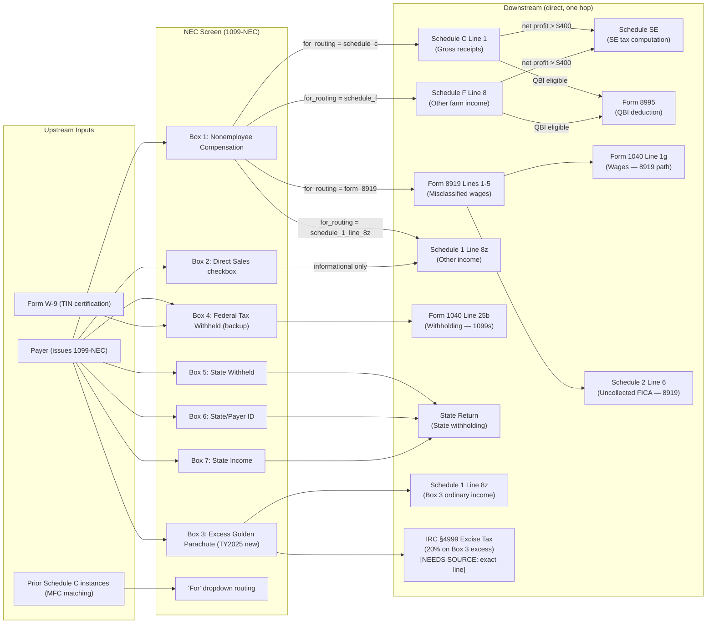

# 1099-NEC — Nonemployee Compensation

## Overview

The NEC screen captures data from Form 1099-NEC (Nonemployee Compensation).
Payers must issue this form when they pay $600 or more in nonemployee
compensation to a contractor, freelancer, or other non-employee during the tax
year. Starting TY2025, Form 1099-NEC also carries a new Box 3 for excess golden
parachute payments (moved from Form 1099-MISC Box 13).

The screen routes Box 1 income to one of four destinations selected by the user
in Drake's "For" dropdown: Schedule C (self-employment, most common), Schedule F
(farming), Form 8919 (worker misclassification), or Schedule 1 Line 8z
(non-business other income). Federal backup withholding (Box 4) flows to Form
1040 Line 25b. State fields (Boxes 5–7) flow to the applicable state return
only.

Box 1 income routed to Schedule C or Schedule F triggers Schedule SE (if net
profit > $400), and may also generate a QBI deduction on Form 8995 (Form 1040
Line 13a). The deductible portion of SE tax (50%) flows to Schedule 1 Line 15 as
an above-the-line deduction reducing AGI.

**IRS Form:** 1099-NEC **Drake Screen:** NEC (also referred to as 99N in some
Drake KB articles) **Tax Year:** 2025 **Drake Reference:**
https://kb.drakesoftware.com/kb/Drake-Tax/16952.htm

---

## Data Entry Fields

Required fields first, then optional. Data-entry only — no computed/display
fields.

| Field                 | Type                               | Required    | Drake Label                             | Description                                                                                                                                                                                                                                                                                                                                              | IRS Reference                               | URL                                                 |
| --------------------- | ---------------------------------- | ----------- | --------------------------------------- | -------------------------------------------------------------------------------------------------------------------------------------------------------------------------------------------------------------------------------------------------------------------------------------------------------------------------------------------------------- | ------------------------------------------- | --------------------------------------------------- |
| payer_name            | string                             | yes         | Payer's name                            | Name of the business or individual paying the compensation                                                                                                                                                                                                                                                                                               | i1099mec, "Who Must File"                   | https://www.irs.gov/instructions/i1099mec           |
| payer_tin             | string (EIN or SSN)                | yes         | Payer's TIN                             | Payer's EIN (XX-XXXXXXX) or SSN (XXX-XX-XXXX)                                                                                                                                                                                                                                                                                                            | i1099mec, "Taxpayer Identification Numbers" | https://www.irs.gov/instructions/i1099mec           |
| recipient_tin         | string (SSN or EIN)                | yes         | Recipient's TIN                         | Recipient's SSN or EIN; if absent or invalid, triggers backup withholding at 24%                                                                                                                                                                                                                                                                         | i1099mec, "Taxpayer Identification Numbers" | https://www.irs.gov/instructions/i1099mec           |
| account_number        | string                             | no          | Account number                          | Payer-assigned identifier; required if payer has multiple accounts for the same recipient                                                                                                                                                                                                                                                                | i1099mec, "Account Number"                  | https://www.irs.gov/instructions/i1099mec           |
| second_tin_notice     | boolean                            | no          | 2nd TIN notice checkbox                 | Mark if IRS notified payer twice within 3 calendar years of an incorrect TIN for this recipient                                                                                                                                                                                                                                                          | i1099mec, "2nd TIN Not."                    | https://www.irs.gov/instructions/i1099mec           |
| box1_nec              | number (dollars, 2 decimal places) | yes         | Box 1: Nonemployee compensation         | Fees, commissions, prizes, awards, and other compensation for services totaling $600 or more. Includes professional service fees, director fees, golden parachute payments (total), commissions to non-employee salespersons, and oil/gas working interest payments. Does NOT include wages (W-2), expense reimbursements, rent, royalties, or interest. | i1099mec, Box 1                             | https://www.irs.gov/instructions/i1099mec           |
| box2_direct_sales     | boolean                            | no          | Box 2: Direct sales of $5,000 or more   | Checkbox only (no dollar amount): mark if payer made direct sales of consumer products totaling $5,000+ to recipient for resale outside a permanent retail establishment                                                                                                                                                                                 | i1099mec, Box 2                             | https://www.irs.gov/instructions/i1099mec           |
| box3_golden_parachute | number (dollars, 2 decimal places) | no          | Box 3: Excess golden parachute payments | NEW for TY2025 (moved from Form 1099-MISC Box 13). Amount of excess parachute payment only (not total). Excess = total payment minus base amount (average annual compensation over most recent 5 tax years, per IRC §280G). Subject to 20% excise tax under IRC §4999 in addition to ordinary income treatment.                                          | i1099mec, Box 3                             | https://www.irs.gov/instructions/i1099mec           |
| box4_federal_withheld | number (dollars, 2 decimal places) | no          | Box 4: Federal income tax withheld      | Backup withholding only, at 24% rate. Applies when: (1) recipient failed to provide TIN, (2) IRS notified payer twice in 3 years of incorrect TIN, or (3) recipient failed to certify TIN on Form W-9. Regular income tax withholding does NOT apply to contractor payments.                                                                             | i1099mec, Box 4                             | https://www.irs.gov/instructions/i1099mec           |
| box5_state_withheld   | number (dollars, 2 decimal places) | no          | Box 5: State income tax withheld        | State income tax withheld (first state only). Optional for federal IRS purposes; may be required by state tax authority.                                                                                                                                                                                                                                 | i1099mec, Box 5                             | https://www.irs.gov/instructions/i1099mec           |
| box6_state_id         | string                             | no          | Box 6: State/Payer's state no.          | State abbreviation and payer's state-issued identification number (first state only). Used by state tax authorities for reconciliation.                                                                                                                                                                                                                  | i1099mec, Box 6                             | https://www.irs.gov/instructions/i1099mec           |
| box7_state_income     | number (dollars, 2 decimal places) | no          | Box 7: State income                     | Amount of income attributable to the state for withholding reconciliation (first state only). Optional for IRS.                                                                                                                                                                                                                                          | i1099mec, Box 7                             | https://www.irs.gov/instructions/i1099mec           |
| for_routing           | enum                               | yes (Drake) | For                                     | Drake-specific dropdown routing field. Determines where Box 1 income flows. Options: "Schedule C", "Schedule F", "Form 8919", "Schedule 1 Line 8". Default if omitted: Schedule C.                                                                                                                                                                       | Drake KB 16952                              | https://kb.drakesoftware.com/kb/Drake-Tax/16952.htm |
| multi_form_code       | string (integer)                   | no          | Multi-form code (MFC)                   | Drake-specific: when multiple Schedule C (or F) forms exist in the return, enter the code matching the correct Schedule C. If blank, defaults to Schedule C instance 1.                                                                                                                                                                                  | Drake KB 11610                              | https://kb.drakesoftware.com/kb/Drake-Tax/11610.htm |

---

## Per-Field Routing

| Field                           | Destination                                                                                                                                      | How Used                                                                                                                                                                    | Triggers                                                                         | Limit / Cap                                                                                               | IRS Reference                                  | URL                                            |
| ------------------------------- | ------------------------------------------------------------------------------------------------------------------------------------------------ | --------------------------------------------------------------------------------------------------------------------------------------------------------------------------- | -------------------------------------------------------------------------------- | --------------------------------------------------------------------------------------------------------- | ---------------------------------------------- | ---------------------------------------------- |
| payer_name                      | Display / e-file schema only                                                                                                                     | Identification and information return matching by IRS; not on Form 1040                                                                                                     | —                                                                                | None                                                                                                      | i1099mec                                       | https://www.irs.gov/instructions/i1099mec      |
| payer_tin                       | E-file schema only                                                                                                                               | IRS information return matching; not on Form 1040                                                                                                                           | —                                                                                | None                                                                                                      | i1099mec                                       | https://www.irs.gov/instructions/i1099mec      |
| recipient_tin                   | E-file schema only                                                                                                                               | Validates recipient; absence or invalidity triggers Box 4 backup withholding at 24%                                                                                         | Box 4 backup withholding if TIN absent/invalid                                   | None                                                                                                      | i1099mec                                       | https://www.irs.gov/instructions/i1099mec      |
| account_number                  | E-file schema only                                                                                                                               | Payer recordkeeping; not on Form 1040                                                                                                                                       | —                                                                                | None                                                                                                      | i1099mec                                       | https://www.irs.gov/instructions/i1099mec      |
| second_tin_notice               | E-file schema only                                                                                                                               | Flags IRS notification history; no 1040 calculation impact                                                                                                                  | —                                                                                | None                                                                                                      | i1099mec                                       | https://www.irs.gov/instructions/i1099mec      |
| box1_nec (→ Schedule C)         | Schedule C Line 1 (Gross receipts or sales) → Schedule C Line 31 (net profit) → Form 1040 Schedule 1 Line 3 (business income) → Form 1040 Line 8 | Box 1 amount added to Schedule C Line 1. Net profit (Line 31) flows to Schedule 1 Line 3, then to Form 1040 Line 8 as total income component.                               | Schedule SE (if net profit > $400); Form 8995 QBI deduction (Form 1040 Line 13a) | None on Box 1 itself. SE tax applies on net profit × 92.35% up to SS wage base of $176,100 for SS portion | i1040sc Line 1, i1040sse                       | https://www.irs.gov/instructions/i1040sc       |
| box1_nec (→ Schedule F)         | Schedule F Line 8 (Other income) → Schedule F net profit → Schedule 1 Line 6 (farm income) → Form 1040 Line 8                                    | Added to Schedule F as other farm income                                                                                                                                    | Schedule SE (if net profit > $400); Form 8995                                    | Same SE tax limits apply                                                                                  | i1040sf                                        | https://www.irs.gov/instructions/i1040sf       |
| box1_nec (→ Form 8919)          | Form 8919 Lines 1–5 (employer name, wages) → Line 6 (total wages) → Form 1040 Line 1g (wages); Form 8919 Line 13 → Schedule 2 Line 6             | Wages treated as misclassified employee wages. Line 6 total enters Form 1040 Line 1g as wages. SS + Medicare tax on Line 13 flows to Schedule 2 Line 6 → Form 1040 Line 17. | Form 8959 (Additional Medicare Tax) if Line 6 wages exceed $200,000              | SS tax capped at $176,100 wage base; Medicare uncapped                                                    | Form 8919 instructions; Schedule 2             | https://www.irs.gov/forms-pubs/about-form-8919 |
| box1_nec (→ Schedule 1 Line 8z) | Schedule 1 Line 8z (Other income) → Schedule 1 Line 10 (total additional income) → Form 1040 Line 8                                              | Non-business NEC (e.g., isolated director's fees). Not subject to SE tax.                                                                                                   | None                                                                             | None                                                                                                      | i1040s1                                        | https://www.irs.gov/instructions/i1040gi       |
| box2_direct_sales               | Informational only — no 1040 line                                                                                                                | Checkbox only; no computation, no routing to any form                                                                                                                       | —                                                                                | None                                                                                                      | i1099mec Box 2                                 | https://www.irs.gov/instructions/i1099mec      |
| box3_golden_parachute           | (1) Schedule 1 Line 8z → Form 1040 Line 8 (ordinary income); (2) Schedule 2 Line 17k ("Tax on golden parachute payments") → Form 1040 Line 17    | Box 3 amount included in ordinary income (Schedule 1 Line 8z). Additionally subject to 20% nondeductible excise tax under IRC §4999 reported on Schedule 2 Line 17k.        | Schedule 2 Line 17k (excise)                                                     | 20% excise on excess amount; no cap on income inclusion                                                   | i1099mec Box 3; IRC §4999; Schedule 2 Line 17k | https://www.irs.gov/instructions/i1099mec      |
| box4_federal_withheld           | Form 1040 Line 25b (Federal income tax withheld — Form(s) 1099)                                                                                  | Credits dollar-for-dollar against total tax liability                                                                                                                       | —                                                                                | None                                                                                                      | 1040 Instructions Line 25b                     | https://www.irs.gov/instructions/i1040gi       |
| box5_state_withheld             | State return (varies by state)                                                                                                                   | Credited against state income tax liability                                                                                                                                 | —                                                                                | None                                                                                                      | State-specific                                 | —                                              |
| box6_state_id                   | State e-file schema                                                                                                                              | Payer identification for state reconciliation                                                                                                                               | —                                                                                | None                                                                                                      | State-specific                                 | —                                              |
| box7_state_income               | State return (varies by state)                                                                                                                   | State income base for withholding reconciliation                                                                                                                            | —                                                                                | None                                                                                                      | State-specific                                 | —                                              |

---

## Calculation Logic

### Step 1 — Determine routing for Box 1 (for_routing field)

The engine uses the `for_routing` field to select the downstream destination for
Box 1:

| for_routing value    | Box 1 goes to       | SE tax applies?                | Notes                                          |
| -------------------- | ------------------- | ------------------------------ | ---------------------------------------------- |
| `schedule_c`         | Schedule C Line 1   | Yes (if net profit > $400)     | Most common path for self-employed             |
| `schedule_f`         | Schedule F Line 8   | Yes (if net profit > $400)     | For farmers                                    |
| `form_8919`          | Form 8919 Lines 1–5 | No (employee FICA, not SE tax) | Worker misclassification; reason code required |
| `schedule_1_line_8z` | Schedule 1 Line 8z  | No                             | Non-business income; isolated payments         |

---

### Step 2 — Schedule C path (most common)

**2a. Add Box 1 to Schedule C Line 1 (Gross receipts or sales)**

When multiple 1099-NEC forms exist for the same business, sum all Box 1 amounts
onto Schedule C Line 1. The Schedule C is identified by its multi_form_code
(MFC) matching.

```
Schedule C Line 1 += box1_nec (for each NEC linked to this Schedule C)
```

> **Source:** IRS Instructions for Schedule C (Form 1040), Line 1 —
> https://www.irs.gov/instructions/i1040sc

**2b. Compute Schedule C net profit**

```
Schedule C Line 31 (net profit/loss) = Line 1 (gross income) + other income lines
                                       − Lines 8–27 (allowable business deductions)
```

**2c. Net profit flows to Schedule 1 Line 3 → Form 1040 Line 8**

```
Schedule 1 Line 3 = Schedule C Line 31 (if positive or negative)
Form 1040 Line 8 = Schedule 1 Line 10 (sum of all Schedule 1 Part I income lines)
```

> **Source:** IRS Instructions for Schedule 1 (Form 1040); 1040 Instructions
> Line 8 — https://www.irs.gov/instructions/i1040gi

---

### Step 3 — Schedule SE (self-employment tax) — triggered by Schedule C/F net profit > $400

**Threshold:** Must file Schedule SE if net earnings from self-employment ≥
$400.

> **Source:** IRS Instructions for Schedule SE (Form 1040), "Who Must File" —
> https://www.irs.gov/instructions/i1040sse

**Step 3a — Compute net earnings from self-employment:**

```
Schedule SE Line 2 = Schedule C Line 31 net profit
  (or Schedule F net profit, or sum if both)
Schedule SE Line 3 = Line 2 × 0.9235   [statutory factor: 1 − 0.0765, per IRC §1402(a)]
```

The 0.9235 factor represents the employer-equivalent deduction (employees don't
pay SE tax on the employer's share of FICA).

**Step 3b — Compute Social Security tax portion:**

```
If Schedule SE Line 3 ≤ $176,100 (SS wage base for TY2025):
  SS tax = Line 3 × 0.124

If Schedule SE Line 3 > $176,100:
  SS tax = $176,100 × 0.124
  (SS tax is capped; wage base = $176,100 for TY2025)
```

> **Source:** SSA announcement TY2025 (wage base $176,100) —
> https://www.ssa.gov/oact/cola/cbb.html; IRS Topic 751 —
> https://www.irs.gov/taxtopics/tc751

**Step 3c — Compute Medicare tax portion:**

```
Medicare tax = Line 3 × 0.029   [no wage base cap; applies to all SE earnings]
```

**Step 3d — Total SE tax:**

```
Schedule SE Line 4 = SS tax + Medicare tax
  = (min(Line 3, $176,100) × 0.124) + (Line 3 × 0.029)
```

> **Source:** IRS Instructions for Schedule SE, Lines 4a–4c —
> https://www.irs.gov/instructions/i1040sse

**Step 3e — SE tax flows to Form 1040:**

```
Schedule SE Line 4 → Schedule 2 Line 4 → Form 1040 Line 17 (total additional taxes)
```

**Step 3f — Deductible half of SE tax (above-the-line deduction):**

```
Schedule 1 Line 15 = Schedule SE Line 4 × 0.50
Form 1040 AGI is reduced by Schedule 1 Line 15
```

> **Source:** IRS Instructions for Schedule SE, "Deduction for One-Half of
> Self-Employment Tax" — https://www.irs.gov/instructions/i1040sse

---

### Step 4 — Additional Medicare Tax (Form 8959) — if SE net earnings + wages > threshold

The 0.9% Additional Medicare Tax applies to combined wages, REIT/PTP income, and
SE net earnings exceeding:

- $200,000 (Single / HOH / QW)
- $250,000 (MFJ)
- $125,000 (MFS)

```
Form 8959 Line 6 = SE net earnings from Schedule SE
Form 8959 computes the Additional Medicare Tax (0.9%) on income above threshold
Form 8959 total → Schedule 2 Line 11 → Form 1040 Line 17
```

> **Source:** IRS Instructions for Form 8959 (2025) —
> https://www.irs.gov/instructions/i8959

---

### Step 5 — Box 4 (Federal Backup Withholding)

```
Form 1040 Line 25b += box4_federal_withheld
```

Box 4 is backup withholding only (24% rate). It flows directly to Form 1040 Line
25b and reduces tax owed dollar-for-dollar (or generates a refund if it exceeds
liability).

> **Source:** IRS Form 1040 Instructions, Line 25b —
> https://www.irs.gov/instructions/i1040gi

---

### Step 6 — QBI Deduction (Form 8995) — for Schedule C / Schedule F route

If Box 1 income flows to Schedule C or Schedule F, the resulting net profit is
generally "qualified business income" eligible for the §199A QBI deduction,
subject to:

**6a. Simple path (Form 8995) — taxable income at or below threshold:**

Use Form 8995 (simpler form) if taxable income (before QBI deduction) ≤:

- $394,600 (MFJ)
- $197,300 (all other filers)

```
QBI = Schedule C / Schedule F net profit (with certain adjustments)
Tentative QBI deduction = QBI × 0.20
QBI deduction = min(Tentative QBI deduction, taxable_income × 0.20)
Form 8995 Line 15 → Form 1040 Line 13a
```

**6b. Complex path (Form 8995-A) — taxable income above threshold:**

Use Form 8995-A if taxable income exceeds the threshold above. W-2 wage
limitations and UBIA property basis limitations apply.

**6c. SSTB phase-out (applies to both forms):**

If the business is a Specified Service Trade or Business (SSTB — including law,
health, consulting, financial services, performing arts, athletics) AND taxable
income exceeds the threshold, the QBI deduction is phased out:

- Phase-out begins: $197,300 (Single/other) / $394,600 (MFJ)
- Phase-out complete: $247,300 (Single/other) / $494,600 (MFJ)
- Above complete phase-out: zero QBI deduction for SSTB income

> **Source:** IRS Instructions for Form 8995 (2025) —
> https://www.irs.gov/instructions/i8995

---

### Step 7 — Form 8919 path (worker misclassification)

If `for_routing` = `form_8919`:

```
Form 8919 Lines 1–5:
  - Employer name
  - Federal EIN
  - Reason code (A, C, G, or H — see Edge Cases)
  - Column (f): wages (box1_nec for this employer)

Form 8919 Line 6 = sum of column (f) for all Lines 1–5
→ Also entered on Form 1040 Line 1g (wages)

Form 8919 Line 7 = SS wage base ($176,100)
Form 8919 Line 8 = SS wages already reported elsewhere (from W-2s, etc.)
Form 8919 Line 9 = Line 7 − Line 8 (remaining SS wage room)
Form 8919 Line 10 = min(Line 6, Line 9) (wages subject to SS tax)
Form 8919 Line 11 = Line 10 × 0.062 (SS tax, employee share = 6.2%)
Form 8919 Line 12 = Line 6 × 0.0145 (Medicare tax, employee share = 1.45%)
Form 8919 Line 13 = Line 11 + Line 12 (total uncollected SS + Medicare)
→ Schedule 2 Line 6 → Form 1040 Line 17
```

> **Source:** Third-party summary of Form 8919 instructions (verified against
> IRS form PDF) — https://taxinstructions.net/form-8919/; IRS About Form 8919 —
> https://www.irs.gov/forms-pubs/about-form-8919

---

### Step 8 — Schedule 1 Line 8z path (non-business income)

If `for_routing` = `schedule_1_line_8z`:

```
Schedule 1 Line 8z += box1_nec
Schedule 1 Line 10 = sum of all Part I lines (Lines 1–9)
Form 1040 Line 8 += Schedule 1 Line 10
```

No Schedule SE. No QBI deduction. Treated as ordinary income only.

> **Source:** IRS Form 1040 Instructions, Line 8 —
> https://www.irs.gov/instructions/i1040gi

---

### Step 9 — Box 3 path (Excess Golden Parachute Payments — TY2025 new)

```
Schedule 1 Line 8z += box3_golden_parachute   [ordinary income inclusion]
```

Additionally, a 20% excise tax under IRC §4999 applies to the excess amount:

```
Excise tax = box3_golden_parachute × 0.20
→ Schedule 2 Line 17k ("Tax on golden parachute payments") → Form 1040 Line 17
```

> **Source:** i1099mec Box 3 — https://www.irs.gov/instructions/i1099mec; IRC
> §4999; Schedule 2 (Form 1040) 2025 Line 17k —
> https://taxinstructions.net/schedule-2-form-1040/

---

## Constants & Thresholds (Tax Year 2025)

| Constant                                                     | Value                                  | Source                                                        | URL                                            |
| ------------------------------------------------------------ | -------------------------------------- | ------------------------------------------------------------- | ---------------------------------------------- |
| NEC reporting threshold (Box 1 filing trigger for payer)     | $600                                   | i1099mec, "Who Must File"                                     | https://www.irs.gov/instructions/i1099mec      |
| Direct sales threshold (Box 2 checkbox trigger for payer)    | $5,000                                 | i1099mec, Box 2                                               | https://www.irs.gov/instructions/i1099mec      |
| Backup withholding rate (Box 4)                              | 24%                                    | i1099mec, Box 4                                               | https://www.irs.gov/instructions/i1099mec      |
| SE tax rate — combined (SS + Medicare)                       | 15.3%                                  | IRC §1401; Schedule SE instructions                           | https://www.irs.gov/instructions/i1040sse      |
| SE tax rate — Social Security portion                        | 12.4%                                  | IRC §1401(a)                                                  | https://www.irs.gov/instructions/i1040sse      |
| SE tax rate — Medicare portion                               | 2.9%                                   | IRC §1401(b)                                                  | https://www.irs.gov/instructions/i1040sse      |
| SE net earnings factor (statutory reduction)                 | 92.35% (multiply net profit by 0.9235) | IRC §1402(a); Schedule SE Line 3                              | https://www.irs.gov/instructions/i1040sse      |
| SE minimum filing threshold (net profit)                     | $400                                   | Schedule SE instructions, "Who Must File"                     | https://www.irs.gov/instructions/i1040sse      |
| Social Security wage base (TY2025)                           | $176,100                               | SSA official announcement TY2025; confirmed via IRS Topic 751 | https://www.irs.gov/taxtopics/tc751            |
| Additional Medicare Tax rate                                 | 0.9%                                   | IRC §3101(b)(2); Form 8959 instructions                       | https://www.irs.gov/instructions/i8959         |
| Additional Medicare Tax threshold — Single / HOH / QW        | $200,000                               | IRC §3101(b)(2); Form 8959 instructions                       | https://www.irs.gov/instructions/i8959         |
| Additional Medicare Tax threshold — MFJ                      | $250,000                               | IRC §3101(b)(2); Form 8959 instructions                       | https://www.irs.gov/instructions/i8959         |
| Additional Medicare Tax threshold — MFS                      | $125,000                               | IRC §3101(b)(2); Form 8959 instructions                       | https://www.irs.gov/instructions/i8959         |
| QBI deduction rate                                           | 20% of qualified business income       | IRC §199A; Form 8995 instructions                             | https://www.irs.gov/instructions/i8995         |
| QBI deduction phase-out threshold (begin) — MFJ              | $394,600                               | Rev. Proc. 2024-40 §3.28; Form 8995 instructions              | https://www.irs.gov/instructions/i8995         |
| QBI deduction phase-out threshold (begin) — All other filers | $197,300                               | Rev. Proc. 2024-40 §3.28; Form 8995 instructions              | https://www.irs.gov/instructions/i8995         |
| QBI deduction phase-out complete — MFJ                       | $494,600                               | Rev. Proc. 2024-40 §3.28; Form 8995 instructions              | https://www.irs.gov/instructions/i8995         |
| QBI deduction phase-out complete — All other filers          | $247,300                               | Rev. Proc. 2024-40 §3.28; Form 8995 instructions              | https://www.irs.gov/instructions/i8995         |
| Excess golden parachute excise tax rate (Box 3)              | 20%                                    | IRC §4999                                                     | https://www.irs.gov/instructions/i1099mec      |
| Form 8919 SS tax rate (employee share)                       | 6.2%                                   | IRC §3101(a)                                                  | https://www.irs.gov/forms-pubs/about-form-8919 |
| Form 8919 Medicare tax rate (employee share)                 | 1.45%                                  | IRC §3101(b)                                                  | https://www.irs.gov/forms-pubs/about-form-8919 |

---

## Data Flow Diagram



---

## Edge Cases & Special Rules

### Multiple 1099-NECs for the same Schedule C business

A sole proprietor may receive multiple Form 1099-NECs from different clients.
Each is entered as a separate NEC screen instance in the engine. All Box 1
amounts for the same business are summed on Schedule C Line 1. The
`multi_form_code` (MFC) field links each NEC entry to the correct Schedule C
when multiple Schedule C forms exist in the return.

If MFC is absent and only one Schedule C exists: all NEC Box 1 amounts sum onto
that Schedule C. If MFC is absent and multiple Schedule C forms exist: the
engine must default to the first Schedule C (MFC = 1) and flag a warning that
the user should specify MFC.

> **Source:** Drake KB 11610 —
> https://kb.drakesoftware.com/kb/Drake-Tax/11610.htm

---

### Form 8919 reason codes (worker misclassification)

Form 8919 requires a reason code for each employer listed. The codes determine
eligibility:

| Code | Reason                                                                                     |
| ---- | ------------------------------------------------------------------------------------------ |
| A    | Filed Form SS-8 and received IRS determination letter stating "employee"                   |
| C    | Received other IRS correspondence stating "employee"                                       |
| G    | Filed Form SS-8 with IRS; still awaiting reply                                             |
| H    | Received W-2 from this employer AND/OR received 1099 where amounts should have been on W-2 |

Code G requires that Form SS-8 actually be filed. Code H is used when the worker
received both a W-2 and a 1099 from the same employer for what the worker
believes is the same employment relationship.

The engine must capture the reason code for each employer row on Form 8919.
Without a valid reason code, Form 8919 cannot be processed.

Form 8919 Line 6 wages are also entered on Form 1040 Line 1g (wages per Form
1040). They are subject to the employer's matching SS and Medicare taxes at the
full employee share (6.2% SS + 1.45% Medicare), capped at the SS wage base of
$176,100 for TY2025.

> **Source:** Form 8919 instructions summary —
> https://taxinstructions.net/form-8919/; IRS About Form 8919 —
> https://www.irs.gov/forms-pubs/about-form-8919

---

### Box 2 (Direct Sales checkbox) — informational only, no 1040 impact

Box 2 is purely informational. It indicates to the IRS that the payer made
direct sales of consumer products ≥ $5,000 to the recipient for resale outside a
permanent retail establishment. This checkbox:

- Creates NO line item on the recipient's Form 1040
- Triggers NO calculation
- Does NOT represent income
- Does NOT trigger Schedule C (the resale income, if any, is reported separately
  on Schedule C based on actual transactions)

> **Source:** i1099mec Box 2 — https://www.irs.gov/instructions/i1099mec

---

### Box 3 (Excess Golden Parachute Payments) — new for TY2025

Effective TY2025, excess parachute payments are reported in Box 3 of Form
1099-NEC (previously Box 13 of Form 1099-MISC). The amount in Box 3 is ONLY the
excess over the "base amount" (average annual compensation for most recent 5 tax
years, per IRC §280G). The total parachute payment is reported in Box 1.

Two tax consequences for the recipient:

1. **Ordinary income**: Box 3 amount included in gross income → Schedule 1 Line
   8z → Form 1040 Line 8
2. **20% excise tax** under IRC §4999: A nondeductible excise tax of 20% × Box 3
   amount → Schedule 2 Line 17k ("Tax on golden parachute payments") → Form 1040
   Line 17

The base amount calculation is performed by the employer/payer, not the
recipient. The recipient simply reports the Box 3 amount as instructed.

> **Source:** i1099mec Box 3 — https://www.irs.gov/instructions/i1099mec; IRC
> §§280G, 4999

---

### Backup withholding (Box 4) — only 24%, not regular withholding

Contractors (non-employees) are generally NOT subject to regular income tax
withholding. Box 4 appears only in three scenarios:

1. Recipient failed to provide a TIN (i.e., did not complete Form W-9)
2. IRS sent payer two B-Notices within 3 calendar years for incorrect TIN for
   this recipient
3. Recipient failed to certify their TIN on Form W-9 under penalties of perjury

The backup withholding rate for TY2025 is 24%. If Box 4 has a value, it means
one of the above applied. The engine should validate that Box 4 is plausible
(24% of Box 1) but should accept any entered value as the user-provided figure
from the physical 1099.

> **Source:** i1099mec Box 4 — https://www.irs.gov/instructions/i1099mec

---

### QBI deduction — SSTB limitation

NEC income routed to Schedule C is generally QBI-eligible under IRC §199A.
However, if the Schedule C business is a Specified Service Trade or Business
(SSTB), the QBI deduction phases out when taxable income (before QBI deduction)
exceeds the threshold:

- For MFJ: phase-out begins at $394,600, fully phased out at $494,600
- For all other filers: phase-out begins at $197,300, fully phased out at
  $247,300

SSTBs include: health (doctors, dentists, nurses, etc.), law, accounting,
actuarial science, performing arts, consulting, athletics, financial services,
brokerage services, and "any trade or business where the principal asset is the
reputation or skill of one or more of its employees or owners."

Engineering, architecture, and most other service businesses are NOT SSTBs.

> **Source:** IRC §199A(d)(1)(B); Form 8995 instructions TY2025 —
> https://www.irs.gov/instructions/i8995

---

### Schedule 1 Line 8z path — not subject to SE tax

When Box 1 income is routed to Schedule 1 Line 8z (other income), it is NOT
subject to self-employment tax. This route is appropriate for:

- A sporadic, isolated payment that does not constitute a "trade or business"
  under IRC §162
- A corporate director who is not in the trade or business of being a director
- Other non-recurring payments for services not conducted as a business

The distinction between trade/business (→ Schedule C, SE tax applies) and
non-business (→ Schedule 1 Line 8z, no SE tax) is factual and depends on the
regularity, continuity, and profit motive of the activity. The engine should not
make this determination automatically — the `for_routing` field captures the
user's (tax professional's) selection.

> **Source:** IRC §1402(a); IRS Instructions for Schedule SE —
> https://www.irs.gov/instructions/i1040sse

---

### Schedule C with no other income or expenses — filing still required

If Box 1 is the only income and there are no deductible expenses, Schedule C
must still be filed (with Line 1 = Box 1 amount, Line 31 = same amount as net
profit). Schedule SE is then also required if net profit ≥ $400.

---

### Payments to corporations — generally NOT reportable on 1099-NEC

Payments to C-corporations and S-corporations generally do NOT require a Form
1099-NEC (except for attorney fees and federal agency payments to service
providers). However, if a 1099-NEC is issued to a corporate recipient, the
engine must still process it. The income flows to the corporation's return, not
to Schedule C/SE.

> **Source:** i1099mec, "Payments to Corporations" —
> https://www.irs.gov/instructions/i1099mec

---

## Sources

All URLs verified to resolve.

| Document                                                             | Year | Section                  | URL                                                 | Saved as                    |
| -------------------------------------------------------------------- | ---- | ------------------------ | --------------------------------------------------- | --------------------------- |
| Drake KB — 1099-NEC Nonemployee Compensation                         | —    | Full article             | https://kb.drakesoftware.com/kb/Drake-Tax/16952.htm | —                           |
| Drake KB — Schedule C: Multiple 1099-MISC/1099-NEC for Same Business | —    | Full article             | https://kb.drakesoftware.com/kb/Drake-Tax/11610.htm | —                           |
| Instructions for Forms 1099-MISC and 1099-NEC                        | 2025 | Full                     | https://www.irs.gov/instructions/i1099mec           | i1099mec.pdf                |
| Instructions for Schedule C (Form 1040)                              | 2025 | Lines 1, 31              | https://www.irs.gov/instructions/i1040sc            | i1040sc.pdf                 |
| Instructions for Schedule SE (Form 1040)                             | 2025 | Who Must File, Lines 2–4 | https://www.irs.gov/instructions/i1040sse           | i1040sse.pdf                |
| Instructions for Form 8995 (QBI Deduction)                           | 2025 | Full, thresholds         | https://www.irs.gov/instructions/i8995              | i8995.pdf                   |
| Instructions for Form 8959 (Additional Medicare Tax)                 | 2025 | Lines 6, 11              | https://www.irs.gov/instructions/i8959              | i8959.pdf                   |
| IRS About Form 8919                                                  | 2025 | Full                     | https://www.irs.gov/forms-pubs/about-form-8919      | —                           |
| Form 8919 Instructions (third-party summary, verified)               | 2025 | Lines 1–13, reason codes | https://taxinstructions.net/form-8919/              | i8919.pdf (form downloaded) |
| IRS Form 1040 Instructions                                           | 2025 | Lines 8, 13a, 17, 25b    | https://www.irs.gov/instructions/i1040gi            | —                           |
| IRS Topic 751 — SS and Medicare withholding rates                    | 2025 | Rates and wage base      | https://www.irs.gov/taxtopics/tc751                 | —                           |
| SSA Contribution and Benefit Base (wage base $176,100 TY2025)        | 2025 | Annual announcement      | https://www.ssa.gov/oact/cola/cbb.html              | —                           |
| Rev. Proc. 2024-40 (TY2025 inflation adjustments)                    | 2024 | §3.28 (QBI thresholds)   | https://www.irs.gov/pub/irs-drop/rp-24-40.pdf       | rp-24-40.pdf                |
| Schedule 2 (Form 1040) 2025 Instructions                             | 2025 | Lines 4, 6, 17k          | https://taxinstructions.net/schedule-2-form-1040/   | —                           |
