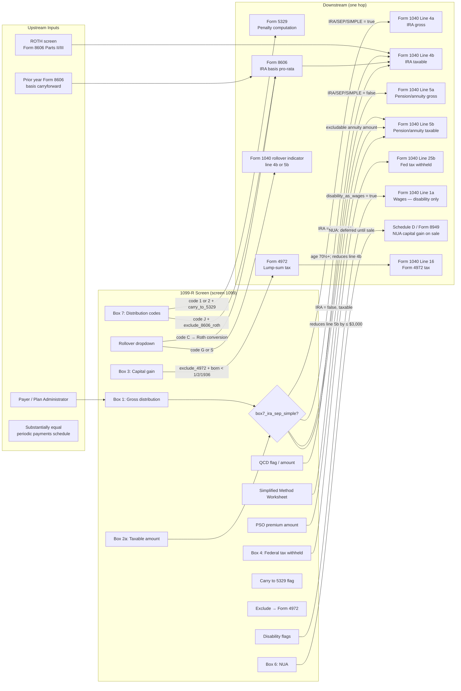

# 1099-R — Distributions From Pensions, Annuities, Retirement or Profit-Sharing Plans, IRAs, Insurance Contracts

## Overview

This screen captures every distribution reported on Form 1099-R: pensions,
annuities, 401(k)/403(b)/profit-sharing plans, traditional IRAs, SEP IRAs,
SIMPLE IRAs, Roth IRAs, and insurance contract distributions. The screen routes
gross and taxable distribution amounts to one of two income lines on Form 1040 —
lines 4a/4b (IRA distributions) or lines 5a/5b (pensions and annuities) — based
on whether Box 7's IRA/SEP/SIMPLE checkbox is marked. Federal withholding
(Box 4) flows to payments line 25b. Secondary forms are triggered by
distribution codes: early distributions trigger Form 5329 (10% or 25% penalty),
lump-sum distributions may trigger Form 4972 (special 10-year averaging),
distributions from IRAs with cost basis trigger Form 8606 (pro-rata
calculation), and Roth IRA non-qualified distributions trigger Form 8606 Part
III. Multiple instances of this screen are aggregated: all IRA distributions
summed for lines 4a/4b; all pension distributions summed for 5a/5b.

**IRS Form:** 1099-R **Drake Screen:** 1099 **Tax Year:** 2025 **Drake
Reference:** https://kb.drakesoftware.com/kb/Drake-Tax/11742.htm **IRS
Instructions (1099-R & 5498):** https://www.irs.gov/instructions/i1099r

---

## Data Entry Fields

Required fields first, then optional. Data-entry only — no computed/display
fields.

| Field                              | Type                  | Required | Drake Label                                                           | Description                                                                                                                                                                                                                                                                                                                                                               | IRS Reference                        | URL                                                 |
| ---------------------------------- | --------------------- | -------- | --------------------------------------------------------------------- | ------------------------------------------------------------------------------------------------------------------------------------------------------------------------------------------------------------------------------------------------------------------------------------------------------------------------------------------------------------------------- | ------------------------------------ | --------------------------------------------------- |
| payer_name                         | string                | yes      | Payer's name                                                          | Name of the plan or institution issuing the distribution                                                                                                                                                                                                                                                                                                                  | i1099r, Payer instructions           | https://www.irs.gov/instructions/i1099r             |
| payer_ein                          | string                | yes      | Federal ID                                                            | Payer's employer identification number (EIN), 9 digits, format XX-XXXXXXX                                                                                                                                                                                                                                                                                                 | i1099r, Payer instructions           | https://www.irs.gov/instructions/i1099r             |
| account_number                     | string                | no       | Account number                                                        | Account or policy number from Form 1099-R                                                                                                                                                                                                                                                                                                                                 | i1099r, Box instructions             | https://www.irs.gov/instructions/i1099r             |
| ts                                 | enum("T","S")         | yes      | T/S                                                                   | Taxpayer (T) or Spouse (S) indicator                                                                                                                                                                                                                                                                                                                                      | Drake KB-11185                       | https://kb.drakesoftware.com/kb/Drake-Tax/11185.htm |
| box1_gross                         | number                | yes      | Box 1 — Gross distribution                                            | Total distribution before any withholding or deductions. Must be ≥ 0. Include direct rollovers, IRA conversions, recharacterizations, and insurance premiums paid by trustees. For employer securities, use fair market value on distribution date.                                                                                                                       | i1099r, Box 1, p.2                   | https://www.irs.gov/instructions/i1099r             |
| box2a_taxable                      | number                | yes      | Box 2a — Taxable amount                                               | Amount includible in gross income. Enter 0 if entire distribution is a rollover or non-taxable. For traditional IRAs, payer may check "taxable amount not determined" — in that case the engine must compute using Form 8606 pro-rata rules. For Roth IRAs, generally blank on the form itself (payer doesn't know basis).                                                | i1099r, Box 2a, p.2                  | https://www.irs.gov/instructions/i1099r             |
| box2b_not_determined               | boolean               | no       | Box 2b — Taxable amount not determined                                | Payer checked this when taxability cannot be determined. When true, engine must compute taxable amount using Form 8606 (if basis exists) or treat entire box1_gross as taxable.                                                                                                                                                                                           | i1099r, Box 2b, p.2                  | https://www.irs.gov/instructions/i1099r             |
| box2b_total_dist                   | boolean               | no       | Box 2b — Total distribution                                           | Payer checked this when entire account balance was distributed. Relevant for Form 4972 lump-sum election eligibility and for tracking account closure.                                                                                                                                                                                                                    | i1099r, Box 2b, p.2                  | https://www.irs.gov/instructions/i1099r             |
| box3_capital_gain                  | number                | no       | Box 3 — Capital gain (included in Box 2a)                             | Net capital gain from employer securities or appreciated property distributed as a lump-sum. Used only when taxpayer elects 20% capital gain treatment under Form 4972 for pre-1974 plan participation. Included in box2a_taxable already.                                                                                                                                | i1099r, Box 3, p.3                   | https://www.irs.gov/instructions/i1099r             |
| box4_fed_tax_withheld              | number                | no       | Box 4 — Federal income tax withheld                                   | Income tax withheld under IRC § 3405. For eligible rollover distributions, mandatory 20% withholding applies. For IRAs, withholding is optional (unless requested). Flows to Form 1040 line 25b.                                                                                                                                                                          | i1099r, Box 4, p.3                   | https://www.irs.gov/instructions/i1099r             |
| box5_employee_contributions        | number                | no       | Box 5 — Employee contributions / Designated Roth / Insurance premiums | After-tax employee contributions, designated Roth account contributions, or insurance premiums recovered tax-free from the distribution. Represents recipient's cost basis in the plan. Reduces the taxable amount in simplified method calculations.                                                                                                                     | i1099r, Box 5, p.3                   | https://www.irs.gov/instructions/i1099r             |
| box6_nua                           | number                | no       | Box 6 — Net unrealized appreciation (NUA)                             | Unrealized appreciation in employer securities distributed in a lump-sum. Not subject to ordinary income tax at distribution. Taxed at long-term capital gain rates when securities are subsequently sold (always long-term per IRS Notice 98-24, regardless of actual holding period). Not included in 5a/5b. Reported on Form 8949/Schedule D when securities are sold. | i1099r, Box 6, p.3; IRS Notice 98-24 | https://www.irs.gov/instructions/i1099r             |
| box7_code1                         | enum                  | yes      | Box 7 — Distribution code (1st)                                       | First distribution code; see Distribution Codes table below. Required on every 1099-R.                                                                                                                                                                                                                                                                                    | i1099r, Box 7, pp.4-7                | https://www.irs.gov/instructions/i1099r             |
| box7_code2                         | enum                  | no       | Box 7 — Distribution code (2nd)                                       | Second distribution code when two codes apply (e.g., "JP" for Roth early distribution). Enter each letter/number in separate dropdown.                                                                                                                                                                                                                                    | i1099r, Box 7, pp.4-7                | https://www.irs.gov/instructions/i1099r             |
| box7_ira_sep_simple                | boolean               | yes      | Box 7 — IRA/SEP/SIMPLE checkbox                                       | Indicates the distribution is from an IRA, SEP IRA, or SIMPLE IRA. When checked: income routes to Form 1040 lines 4a/4b. When unchecked: income routes to Form 1040 lines 5a/5b. Critical for correct line routing.                                                                                                                                                       | i1099r, Box 7, p.4                   | https://www.irs.gov/instructions/i1099r             |
| box8_other                         | number                | no       | Box 8 — Other                                                         | Used for: annuity contract values in lump-sum distributions, long-term care insurance charges against cash surrender value, or annuitized contract values. Included in computing adjusted total taxable amount for Form 4972.                                                                                                                                             | i1099r, Box 8, p.7                   | https://www.irs.gov/instructions/i1099r             |
| box9a_pct_total                    | number                | no       | Box 9a — Your percentage of total distribution                        | Recipient's percentage share of total distribution when multiple beneficiaries receive the same distribution. Range: 0.0–100.0. Used for pro-rating among beneficiaries.                                                                                                                                                                                                  | i1099r, Box 9a, p.7                  | https://www.irs.gov/instructions/i1099r             |
| box9b_total_employee_contributions | number                | no       | Box 9b — Total employee contributions                                 | Cumulative after-tax contributions to the plan by the employee. Used to determine the total cost basis for simplified method or general rule calculations.                                                                                                                                                                                                                | i1099r, Box 9b, p.7                  | https://www.irs.gov/instructions/i1099r             |
| box10_irr_within_5yr               | number                | no       | Box 10 — Amount allocable to IRR within 5 years                       | For in-plan Roth rollovers (IRR), the portion distributable within 5 years of rollover initiation. Subject to IRC § 72(t) penalty rules.                                                                                                                                                                                                                                  | i1099r, Box 10, p.7                  | https://www.irs.gov/instructions/i1099r             |
| box11_first_year_roth              | number                | no       | Box 11 — 1st year of designated Roth contributions                    | Four-digit tax year in which contributions to the designated Roth account first began. Used to determine when the 5-tax-year qualification period is met for designated Roth accounts.                                                                                                                                                                                    | i1099r, Box 11, p.7                  | https://www.irs.gov/instructions/i1099r             |
| box12_fatca                        | boolean               | no       | Box 12 — FATCA filing requirement                                     | Check if distribution involves a Foreign Financial Institution reporting requirement under Chapter 4. Rare in domestic returns.                                                                                                                                                                                                                                           | i1099r, Box 12, p.7                  | https://www.irs.gov/instructions/i1099r             |
| box13_date_of_payment              | date                  | no       | Box 13 — Date of payment                                              | Distribution payment date (YYYY-MM-DD).                                                                                                                                                                                                                                                                                                                                   | i1099r, Box 13, p.7                  | https://www.irs.gov/instructions/i1099r             |
| box14_state_tax                    | number                | no       | Box 14 — State income tax withheld                                    | State income tax withheld from the distribution. May have two entries for distributions spanning two states.                                                                                                                                                                                                                                                              | i1099r, Boxes 14-19, p.8             | https://www.irs.gov/instructions/i1099r             |
| box15_payer_state                  | string                | no       | Box 15 — Payer's state / state ID                                     | Two-character state abbreviation and payer's state tax ID number.                                                                                                                                                                                                                                                                                                         | i1099r, Boxes 14-19, p.8             | https://www.irs.gov/instructions/i1099r             |
| box16_state_distribution           | number                | no       | Box 16 — State distribution                                           | Amount of distribution allocable to the state.                                                                                                                                                                                                                                                                                                                            | i1099r, Boxes 14-19, p.8             | https://www.irs.gov/instructions/i1099r             |
| box17_local_tax                    | number                | no       | Box 17 — Local income tax withheld                                    | Local income tax withheld from the distribution.                                                                                                                                                                                                                                                                                                                          | i1099r, Boxes 14-19, p.8             | https://www.irs.gov/instructions/i1099r             |
| box18_locality_name                | string                | no       | Box 18 — Name of locality                                             | Name of the locality that imposed local tax.                                                                                                                                                                                                                                                                                                                              | i1099r, Boxes 14-19, p.8             | https://www.irs.gov/instructions/i1099r             |
| box19_local_distribution           | number                | no       | Box 19 — Local distribution                                           | Amount of distribution allocable to the local taxing jurisdiction.                                                                                                                                                                                                                                                                                                        | i1099r, Boxes 14-19, p.8             | https://www.irs.gov/instructions/i1099r             |
| rollover_code                      | enum("C","G","S","X") | no       | Rollover into another qualified plan                                  | Drake dropdown for rollover treatment. C = IRA converted to Roth (→ Form 8606 line 16); G = taxable direct rollover to Roth (reported on Form 1040); S = rolled over into same account type (displays rollover indicator on 1040); X = rolled over into another plan (requires partial rollover amount if partial).                                                       | Drake KB-11185                       | https://kb.drakesoftware.com/kb/Drake-Tax/11185.htm |
| partial_rollover_amount            | number                | no       | Partial rollover amount                                               | Dollar amount of partial rollover when not the full distribution was rolled over. Used with rollover_code = X.                                                                                                                                                                                                                                                            | Drake KB-10177                       | https://kb.drakesoftware.com/kb/Drake-Tax/10177.htm |
| disability_flag                    | boolean               | no       | 1099-R for disability?                                                | Marks the distribution as disability income. Affects whether income is wages (if reported as wages on 1040) or pension income.                                                                                                                                                                                                                                            | Drake KB-17107                       | https://kb.drakesoftware.com/kb/Drake-Tax/17107.htm |
| disability_as_wages                | boolean               | no       | Reported as wages on 1040?                                            | When true and disability_flag is true: income reports on Form 1040 as wages; Schedule screen code 011 must also be completed. Only valid before taxpayer reaches minimum retirement age.                                                                                                                                                                                  | Drake KB-17107                       | https://kb.drakesoftware.com/kb/Drake-Tax/17107.htm |
| carry_to_5329                      | boolean               | no       | Carry this entry to Form 5329 and compute 10% penalty or exception    | Routes the taxable amount to Form 5329 Part I for early distribution penalty or exception calculation. Required when distribution code is 1 (early, no exception) or 2 (early, exception applies) and box7_ira_sep_simple is true.                                                                                                                                        | Drake KB-17107; i5329                | https://kb.drakesoftware.com/kb/Drake-Tax/17107.htm |
| exclude_4972                       | boolean               | no       | Exclude here; distribution is reported on Form 4972                   | Prevents income from flowing to Form 1040 income lines. Distribution is instead reported on Form 4972 (10-year averaging / lump-sum election). Only valid for taxpayers born before January 2, 1936 receiving a qualifying lump-sum distribution.                                                                                                                         | Drake KB-17107                       | https://kb.drakesoftware.com/kb/Drake-Tax/17107.htm |
| exclude_8606_roth                  | boolean               | no       | Exclude here; distribution reported on Form 8606/ROTH/8915D/8915E     | Prevents income from flowing to Form 1040 income lines. Used for: Roth IRA distributions requiring Form 8606 basis calculation; disaster distributions (8915D/8915E). For code J Roth distributions: check this box, then complete the ROTH screen (Form 8606 Parts II/III).                                                                                              | Drake KB-17107; KB-16070             | https://kb.drakesoftware.com/kb/Drake-Tax/17107.htm |
| qcd_full                           | boolean               | no       | 100% QCD (up to $108,000)                                             | Special Tax Treatments tab. Marks entire distribution (up to the $108,000 annual QCD limit for 2025) as a qualified charitable distribution. Amounts within the limit are excluded from Form 1040 taxable income. QCD does not qualify as a charitable deduction — it is an income exclusion.                                                                             | Drake KB-11400; Pub 590-B            | https://kb.drakesoftware.com/kb/Drake-Tax/11400.htm |
| qcd_partial_amount                 | number                | no       | Partial QCD amount                                                    | Special Tax Treatments tab. Dollar amount of the QCD portion when only part of the distribution is charitable. Must be ≤ $108,000 for TY2025.                                                                                                                                                                                                                             | Drake KB-11400                       | https://kb.drakesoftware.com/kb/Drake-Tax/11400.htm |
| pso_premium                        | number                | no       | Public Safety Officer (PSO) insurance premium                         | Special Tax Treatments tab. Retired PSO can exclude up to $3,000/year in distributions used directly to pay health/accident insurance premiums. Excluded from Form 1040 income. IRC § 402(l).                                                                                                                                                                             | Drake KB-11742                       | https://kb.drakesoftware.com/kb/Drake-Tax/11742.htm |
| simplified_method_flag             | boolean               | no       | Use Simplified General Rule Worksheet                                 | Special Tax Treatments tab. Activates the Simplified Method Worksheet to compute the excludable (tax-free) portion of annuity payments when taxpayer has cost basis in the plan. Required for most qualified plan annuities starting after November 18, 1996.                                                                                                             | Pub 575, Worksheet A                 | https://www.irs.gov/publications/p575               |
| cost_in_contract                   | number                | no       | Cost (investment) in the contract                                     | Simplified Method Worksheet input. Taxpayer's after-tax investment in the plan as of the annuity starting date (net of any tax-free amounts already received). From box5_employee_contributions or box9b.                                                                                                                                                                 | Pub 575, Worksheet A, Line 1         | https://www.irs.gov/publications/p575               |
| annuity_start_date                 | date                  | no       | Annuity starting date                                                 | First payment date of the annuity. Used to look up the expected months from Table 1 (single life) or Table 2 (joint life).                                                                                                                                                                                                                                                | Pub 575, Worksheet A                 | https://www.irs.gov/publications/p575               |
| age_at_annuity_start               | number                | no       | Age at annuity starting date                                          | Taxpayer's age at the annuity starting date. Used with Table 1 (single-life) to determine expected months.                                                                                                                                                                                                                                                                | Pub 575, Table 1                     | https://www.irs.gov/publications/p575               |
| joint_annuity                      | boolean               | no       | Joint and survivor annuity?                                           | If true, use Table 2 (combined ages) instead of Table 1 (single age) for expected months calculation.                                                                                                                                                                                                                                                                     | Pub 575, Worksheet A                 | https://www.irs.gov/publications/p575               |
| combined_ages_at_start             | number                | no       | Combined ages at annuity starting date (joint annuity)                | Sum of both annuitants' ages at annuity starting date. Required when joint_annuity is true. Used with Table 2.                                                                                                                                                                                                                                                            | Pub 575, Table 2                     | https://www.irs.gov/publications/p575               |
| prior_excludable_recovered         | number                | no       | Previously tax-free amounts already recovered                         | Total cost already recovered tax-free in prior years. Used to reduce cost_in_contract to remaining unrecovered basis.                                                                                                                                                                                                                                                     | Pub 575, Worksheet A, Line 2b        | https://www.irs.gov/publications/p575               |
| altered_or_handwritten             | boolean               | no       | Was this 1099-R altered or handwritten?                               | Flags unusual form presentation. EF validation warning may trigger.                                                                                                                                                                                                                                                                                                       | Drake KB-17107                       | https://kb.drakesoftware.com/kb/Drake-Tax/17107.htm |
| no_distribution_received           | boolean               | no       | No distribution received (ignore screen)                              | When true: retain screen data for prior-year carryforward but do not include in current-year calculations.                                                                                                                                                                                                                                                                | Drake KB-17107                       | https://kb.drakesoftware.com/kb/Drake-Tax/17107.htm |

---

## Distribution Codes for Box 7 (Complete Reference)

All codes from IRS Instructions for Forms 1099-R and 5498 (2025), pp. 4–7 —
https://www.irs.gov/instructions/i1099r

| Code | Description                                                                         | Tax Treatment                                                                                        | Triggers                                                                                    |
| ---- | ----------------------------------------------------------------------------------- | ---------------------------------------------------------------------------------------------------- | ------------------------------------------------------------------------------------------- |
| 1    | Early distribution, no known exception                                              | Taxable; 10% penalty applies                                                                         | Form 5329 Part I                                                                            |
| 2    | Early distribution, exception applies (age 59½ or over, or another exception)       | Taxable; penalty may be reduced/waived                                                               | Form 5329 Part I if exception to be claimed                                                 |
| 3    | Disability                                                                          | Taxable as ordinary income (or wages if disability_as_wages)                                         | Disability routing                                                                          |
| 4    | Death                                                                               | Taxable to beneficiary                                                                               | No penalty                                                                                  |
| 5    | Prohibited transaction                                                              | IRA treated as distributed on Jan 1 of year; ordinary income                                         | Form 5329                                                                                   |
| 6    | Section 1035 exchange                                                               | Non-taxable exchange of insurance contracts                                                          | No income                                                                                   |
| 7    | Normal distribution (age 59½ or older)                                              | Taxable; no penalty                                                                                  | None                                                                                        |
| 8    | Excess contributions plus earnings / excess deferrals (taxable in year contributed) | Earnings portion taxable; correction of excess                                                       | Return of excess contribution rules                                                         |
| A    | Permitted withdrawal from eligible auto-contribution arrangement (EACA)             | Taxable; no 10% penalty                                                                              | —                                                                                           |
| B    | Designated Roth account distribution (not qualified)                                | May be taxable depending on basis and 5-year period                                                  | Form 8606 or ROTH screen                                                                    |
| C    | Distributions from designated Roth account (deemed IRA)                             | May be taxable                                                                                       | ROTH screen                                                                                 |
| D    | Distributions under section 72(t)(2)(D)                                             | Taxable                                                                                              | QDRO / domestic relations                                                                   |
| E    | Distributions under EPCRS § 415 correction                                          | Corrective; special treatment                                                                        | —                                                                                           |
| F    | Charitable gift annuity                                                             | Partially taxable                                                                                    | Annuity exclusion rules                                                                     |
| G    | Direct rollover to eligible retirement plan                                         | Non-taxable rollover; $0 in box 2a                                                                   | Show rollover indicator on 1040                                                             |
| H    | Direct rollover to Roth IRA                                                         | Taxable conversion; included in income                                                               | Form 8606 if basis involved                                                                 |
| J    | Early distribution from Roth IRA                                                    | May be taxable (contributions non-taxable; earnings taxable before age 59½ and before 5-year period) | Check "exclude, reported on 8606/ROTH"; complete ROTH screen Part III; Form 5329 if penalty |
| K    | Distribution of non-marketable IRA assets                                           | Special valuation rules                                                                              | —                                                                                           |
| L    | Loan treated as distribution (deemed distribution)                                  | Taxable; 10% penalty if < age 59½                                                                    | Form 5329                                                                                   |
| M    | Qualified plan loan offset                                                          | Taxable in year of offset                                                                            | 60-day rollover window                                                                      |
| N    | Recharacterization in same tax year                                                 | Not income                                                                                           | —                                                                                           |
| P    | Excess contributions returned (plus earnings, taxable in year returned)             | Earnings taxable                                                                                     | —                                                                                           |
| Q    | Qualified distribution from Roth IRA                                                | Non-taxable (age 59½+ AND 5-year rule met)                                                           | No income                                                                                   |
| R    | Recharacterization of prior year contribution                                       | Not income in current year                                                                           | —                                                                                           |
| S    | Transfer from SIMPLE IRA to traditional IRA (within 2-year period)                  | Non-taxable                                                                                          | SIMPLE 2-year rule                                                                          |
| T    | Roth IRA distribution — qualified under different 5-year rule                       | Non-taxable                                                                                          | —                                                                                           |
| U    | Distributions from qualified funding nonrecourse debt                               | Special treatment                                                                                    | —                                                                                           |
| V    | Distributions from qualified offset amount                                          | Taxable                                                                                              | —                                                                                           |
| W    | Qualified long-term care insurance charges                                          | Not income                                                                                           | —                                                                                           |
| Y    | Qualified charitable distribution (QCD) — **new for 2025, optional**                | Non-taxable; excluded from income                                                                    | QCD income exclusion; no charitable deduction                                               |

**Multi-code combinations:** Enter each code in a separate dropdown. Common
combinations: JP (early Roth distribution), 8 + additional code. Code Y paired
with secondary code 4, 7, or K per 2025 instructions.

---

## Per-Field Routing

| Field                                 | Destination                                   | How Used                                                                                                                                                                                                                                                                                                                         | Triggers                                                                                          | Limit / Cap                                                     | IRS Reference                         | URL                                                 |
| ------------------------------------- | --------------------------------------------- | -------------------------------------------------------------------------------------------------------------------------------------------------------------------------------------------------------------------------------------------------------------------------------------------------------------------------------- | ------------------------------------------------------------------------------------------------- | --------------------------------------------------------------- | ------------------------------------- | --------------------------------------------------- |
| box1_gross (IRA = true)               | Form 1040, Line 4a                            | Total gross IRA distributions (sum of all 1099-R instances with box7_ira_sep_simple = true). Reported whether or not taxable.                                                                                                                                                                                                    | —                                                                                                 | None                                                            | 1040 Instructions, Line 4a            | https://www.irs.gov/instructions/i1040gi            |
| box2a_taxable (IRA = true)            | Form 1040, Line 4b                            | Taxable IRA distribution amount. Summed across all IRA 1099-Rs. Reduced by QCD exclusion and cost basis recovery.                                                                                                                                                                                                                | Form 8606 if basis > 0; QCD exclusion                                                             | None                                                            | 1040 Instructions, Line 4b; Pub 590-B | https://www.irs.gov/publications/p590b              |
| box1_gross (IRA = false)              | Form 1040, Line 5a                            | Total gross pension/annuity distributions. Summed across all non-IRA 1099-Rs.                                                                                                                                                                                                                                                    | —                                                                                                 | None                                                            | 1040 Instructions, Line 5a; Pub 575   | https://www.irs.gov/publications/p575               |
| box2a_taxable (IRA = false)           | Form 1040, Line 5b                            | Taxable pension/annuity amount. Reduced by Simplified Method excludable amount or General Rule exclusion ratio.                                                                                                                                                                                                                  | Simplified Method Worksheet if cost basis > 0; Form 4972 if lump-sum election; disability routing | None                                                            | 1040 Instructions, Line 5b; Pub 575   | https://www.irs.gov/publications/p575               |
| box4_fed_tax_withheld                 | Form 1040, Line 25b                           | Federal income tax withheld from pensions/annuities. Summed with all other 1099-R withholding.                                                                                                                                                                                                                                   | —                                                                                                 | None                                                            | 1040 Instructions, Line 25b           | https://www.irs.gov/instructions/i1040gi            |
| box6_nua                              | Form 8949 / Schedule D (when securities sold) | Not reported at distribution time (tax deferred). When employer securities are subsequently sold: the NUA portion is always long-term capital gain (per IRS Notice 98-24); reported on Form 8949 and Schedule D. Taxpayer may elect to include NUA in income at distribution time — if so, report on line 5b as ordinary income. | Long-term capital gain on sale; or ordinary income if elected                                     | None                                                            | IRS Notice 98-24; Pub 575             | https://www.irs.gov/pub/irs-drop/not98-24.pdf       |
| box3_capital_gain                     | Form 4972, Part II                            | Used only when taxpayer elects 20% capital gain treatment for pre-1974 plan participation in a lump-sum distribution. 20% rate applies to this amount.                                                                                                                                                                           | Form 4972 election (born before 1/2/1936 only)                                                    | Must be ≤ box2a_taxable                                         | i1099r, Box 3; Form 4972 Part II      | https://www.irs.gov/instructions/i1099r             |
| box7_code1 / box7_code2               | Routing logic                                 | Controls whether income is taxable, what forms are triggered, whether rollover indicator appears on 1040                                                                                                                                                                                                                         | Forms 5329, 8606, 4972                                                                            | —                                                               | i1099r, Box 7                         | https://www.irs.gov/instructions/i1099r             |
| box14_state_tax                       | State return                                  | State income tax withheld                                                                                                                                                                                                                                                                                                        | —                                                                                                 | Per state                                                       | State instructions                    | —                                                   |
| rollover_code = G                     | Form 1040, rollover indicator                 | Direct rollover: $0 taxable; rollover indicator shown on Form 1040 line 4b or 5b                                                                                                                                                                                                                                                 | —                                                                                                 | —                                                               | Drake KB-10177                        | https://kb.drakesoftware.com/kb/Drake-Tax/10177.htm |
| rollover_code = S                     | Form 1040, rollover indicator                 | Same-account rollover: shows rollover indicator                                                                                                                                                                                                                                                                                  | —                                                                                                 | —                                                               | Drake KB-10177                        | https://kb.drakesoftware.com/kb/Drake-Tax/10177.htm |
| rollover_code = C                     | Form 8606, Line 16                            | IRA converted to Roth IRA; taxable conversion                                                                                                                                                                                                                                                                                    | Form 8606                                                                                         | —                                                               | Drake KB-11185                        | https://kb.drakesoftware.com/kb/Drake-Tax/11185.htm |
| disability_flag + disability_as_wages | Form 1040, Line 1a (wages)                    | Disability income before minimum retirement age reported as wages; Schedule code 011                                                                                                                                                                                                                                             | —                                                                                                 | —                                                               | Drake KB-17107                        | https://kb.drakesoftware.com/kb/Drake-Tax/17107.htm |
| carry_to_5329                         | Form 5329, Part I, Line 1                     | Early distribution amount subject to 10% penalty; taxpayer then selects exception code on 5329                                                                                                                                                                                                                                   | Form 5329                                                                                         | 10% of taxable amount (25% for SIMPLE IRA within 2-year period) | i5329; Pub 575                        | https://www.irs.gov/instructions/i5329              |
| qcd_full / qcd_partial_amount         | Form 1040, Line 4b (excluded)                 | QCD amount excluded from taxable income on line 4b (reduces line 4b vs. line 4a, write "QCD" on Form 1040 per instructions); does not generate charitable deduction                                                                                                                                                              | —                                                                                                 | $108,000/person for TY2025                                      | Pub 590-B; Drake KB-11400             | https://kb.drakesoftware.com/kb/Drake-Tax/11400.htm |
| pso_premium                           | Form 1040, Line 5b (excluded)                 | PSO insurance premium excluded from pension income; reduces line 5b                                                                                                                                                                                                                                                              | —                                                                                                 | $3,000/year per IRC § 402(l)                                    | IRC § 402(l)                          | https://www.irs.gov/instructions/i1099r             |
| exclude_4972                          | Form 4972                                     | Entire distribution excluded from 1040 income lines; computed tax from Form 4972 flows to Form 1040, Line 16 (check Form 4972 box)                                                                                                                                                                                               | Form 4972 (born before 1/2/1936 required)                                                         | Full distribution                                               | Drake KB-17107                        | https://kb.drakesoftware.com/kb/Drake-Tax/17107.htm |
| exclude_8606_roth                     | Form 8606 / ROTH screen                       | Distribution excluded from 1040 income lines; taxable portion computed on Form 8606 then flows to 1040 line 4b                                                                                                                                                                                                                   | Form 8606; ROTH screen                                                                            | Roth basis ordering rules                                       | Drake KB-17107; KB-16070              | https://kb.drakesoftware.com/kb/Drake-Tax/17107.htm |

---

## Calculation Logic

### Step 1 — Determine Account Type (IRA vs. Pension/Annuity)

Check `box7_ira_sep_simple`:

- **True** → IRA distribution → routes to Form 1040 Lines 4a / 4b
- **False** → Pension or annuity → routes to Form 1040 Lines 5a / 5b

> **Source:** IRS Instructions for Forms 1099-R and 5498 (2025), Box 7
> instructions, p.4 — https://www.irs.gov/instructions/i1099r

---

### Step 2 — Determine Gross Distribution (Lines 4a or 5a)

Sum `box1_gross` across all 1099-R instances of each type:

```
line_4a = SUM(box1_gross for all instances where box7_ira_sep_simple = true)
line_5a = SUM(box1_gross for all instances where box7_ira_sep_simple = false)
```

Report on the appropriate line regardless of taxability.

> **Source:** 2025 Form 1040 Instructions, Lines 4a and 5a —
> https://www.irs.gov/instructions/i1040gi

---

### Step 3 — Determine Taxable Amount

The taxable amount for each 1099-R depends on distribution code and
circumstances:

**Case A — Direct rollover (codes G, S, X, rollover_code in {G,S,X,C}):**

- Taxable amount = $0 (rollover is not income)
- Show rollover indicator on Form 1040 (line 4b or 5b)
- Exception: rollover_code = C (Roth conversion) → taxable as Roth conversion
  income; flows to Form 8606 Line 16

**Case B — Qualified Roth distribution (code Q or T):**

- Taxable amount = $0 (qualified distribution; age 59½+ AND 5-year rule met)
- Both 1040 lines 4a and 4b show $0 for these

**Case C — Non-qualified Roth distribution (code J):**

- Check `exclude_8606_roth` → go to ROTH screen (Form 8606 Part III)
- Form 8606 Part III computes taxable amount using ordering rules:
  1. Contributions first (non-taxable; basis from all Roth IRA contributions)
  2. Conversions/rollovers (non-taxable if 5-year period met; otherwise subject
     to 10% penalty)
  3. Earnings (taxable if not qualified distribution)
- Taxable earnings flow to Form 1040 Line 4b
- If taxpayer under age 59½: taxable portion also subject to 10% penalty on Form
  5329

**Case D — IRA distribution with cost basis (traditional IRA,
box2b_not_determined or basis known from prior Form 8606):**

- Must file Form 8606 Part I
- **Pro-rata rule:** Non-taxable fraction = (Total non-deductible contributions
  in all traditional IRAs) ÷ (Total value of all traditional IRAs on Dec 31,
  2025 + outstanding rollovers + distribution amount)
- Taxable amount = box1_gross × (1 − non-taxable fraction)
- Non-taxable portion tracked as remaining basis for future years
- Key: ALL traditional, SEP, and SIMPLE IRAs are aggregated; you cannot isolate
  one IRA with basis

> **Source:** IRS Instructions for Form 8606 (2025), Part I —
> https://www.irs.gov/instructions/i8606; Pub 590-B —
> https://www.irs.gov/publications/p590b

**Case E — Pension/annuity with cost basis (Simplified Method):**

Required for: qualified employee plan annuities with annuity starting date after
November 18, 1996.

**Worksheet A — Simplified Method (from Pub 575 Table 1 and Table 2):**

1. **Line 1:** Enter cost in the contract as of annuity starting date (=
   box5_employee_contributions or box9b, reduced by any amounts previously
   excluded)
2. **Line 2a:** Enter total annuity payments received before the annuity
   starting date (generally $0 for most plans)
3. **Line 2b:** Enter exclusions already taken before current year (from prior
   year worksheets)
4. **Line 2c:** Subtract: Line 1 minus Lines 2a and 2b = remaining cost to
   recover
5. **Line 3:** From **Table 1** (single-life) or **Table 2** (joint-life) —
   expected months:

   **Table 1 — Single-life annuity (annuity starting date after Dec 31, 1997):**

   | Age at Annuity Starting Date | Expected Months |
   | ---------------------------- | --------------- |
   | 55 or under                  | 360             |
   | 56–60                        | 310             |
   | 61–65                        | 260             |
   | 66–70                        | 210             |
   | 71 or older                  | 160             |

   **Table 2 — Multiple-lives annuity (joint and survivor):**

   | Combined Ages at Annuity Starting Date | Expected Months |
   | -------------------------------------- | --------------- |
   | 110 or under                           | 410             |
   | 111–120                                | 360             |
   | 121–130                                | 310             |
   | 131–140                                | 260             |
   | 141 or older                           | 210             |

6. **Line 4:** Monthly exclusion = Line 2c ÷ Line 3 (round to nearest cent)
7. **Line 5:** Exclusion for this year = Line 4 × number of months payments
   received in 2025
8. **Line 6:** If Line 5 > amount received this year, limit to amount received
9. **Line 7:** Taxable pension income = total pension received − Line 6 (the
   excludable amount)

Once cumulative exclusions equal cost_in_contract: all subsequent payments are
fully taxable.

> **Source:** IRS Publication 575 (2025), Worksheet A and Tables 1 & 2 —
> https://www.irs.gov/publications/p575; IRS Tax Topic 411 —
> https://www.irs.gov/taxtopics/tc411

**Case F — General Rule (nonqualified plans, annuity start before Nov 19,
1996):**

- Compute exclusion ratio = investment in contract ÷ expected return (using IRS
  actuarial tables in Pub 939)
- Tax-free portion per year = exclusion ratio × gross payments received
- See IRS Publication 939 — https://www.irs.gov/publications/p939

---

### Step 4 — QCD Exclusion (IRA distributions only)

If `qcd_full` = true or `qcd_partial_amount` > 0:

```
qcd_amount = MIN(qcd_partial_amount OR box1_gross if qcd_full, 108_000)
```

Conditions that must all be true for QCD to be valid:

- Taxpayer age 70½ or older at time of distribution
- Distribution made directly from IRA trustee to qualified charity (not IRA to
  taxpayer to charity)
- Account type: traditional IRA, Roth IRA, or inactive SEP/SIMPLE IRA (NOT
  active SEP or SIMPLE receiving contributions in current year)
- Charity must be a 501(c)(3) public charity (not donor-advised fund, supporting
  organization, or private foundation)

Reporting on Form 1040:

- Line 4a: full box1_gross (still reported as gross distribution)
- Line 4b: box2a_taxable − qcd_amount (the QCD amount is excluded; write "QCD"
  next to line 4b per instructions)
- No charitable deduction may be claimed for the QCD amount

**One-time QCD to split-interest entity (SECURE 2.0, § 408(d)(8)(F)):**

- Single one-time election per taxpayer
- 2025 limit: $54,000 (indexed; per Notice 2024-80)
- Funds a charitable remainder annuity trust (CRAT), charitable remainder
  unitrust (CRUT), or charitable gift annuity
- Counts against the $108,000 annual QCD limit
- Not available for pooled income funds

**Code Y (new for TY2025, optional):**

- Box 7 code Y identifies a QCD on the 1099-R form
- For TY2025, use of code Y is **optional** for financial institutions (IRS
  guidance issued October 16, 2025)
- Code Y always paired with a secondary code: 4 (death), 7 (normal), or K
  (non-marketable assets)
- Engine must handle QCDs both with and without code Y present

> **Source:** IRS Pub 590-B (2025) — https://www.irs.gov/publications/p590b;
> Drake KB-11400 — https://kb.drakesoftware.com/kb/Drake-Tax/11400.htm; Ascensus
> article on Code Y —
> https://thelink.ascensus.com/articles/2025/7/14/what-you-need-to-know-about-new-distribution-code-y-for-qualified-charitable-distributions

---

### Step 5 — Early Distribution Penalty (Form 5329)

Triggered when:

- Distribution code = 1 (early, no exception)
- Distribution code = 2 (early, exception applies — taxpayer must claim
  exception on Form 5329)
- Distribution code = J with taxable Roth earnings and taxpayer < age 59½
- `carry_to_5329` = true on Drake screen

**Standard penalty:** 10% × taxable amount included in income

**SIMPLE IRA 25% penalty:**

- When the distribution is from a SIMPLE IRA AND was received within 2 years of
  the date of the taxpayer's first participation in the SIMPLE plan
- Penalty = 25% × taxable amount (instead of 10%)
- Entry in Drake: manually enter on Form 5329 Part I, Line 4 (the 25% amount)

**Exception codes** (enter on Form 5329, Part I, Line 2):

| Code | Exception                                                               | Notes                                                             |
| ---- | ----------------------------------------------------------------------- | ----------------------------------------------------------------- |
| 01   | Separation from service at age 55+ (age 50 for public safety employees) | Qualified plans only; not IRAs                                    |
| 02   | Substantially equal periodic payments (SEPP under § 72(t))              | Modification penalty applies if changed within 5 years or age 59½ |
| 03   | Total and permanent disability                                          | —                                                                 |
| 04   | Death                                                                   | —                                                                 |
| 05   | Unreimbursed medical expenses exceeding 7.5% of AGI                     | —                                                                 |
| 06   | Qualified domestic relations order (QDRO)                               | Qualified plans only                                              |
| 07   | Unemployment insurance premium payments                                 | IRA only; unemployed 12+ weeks                                    |
| 08   | Qualified higher education expenses                                     | IRA only                                                          |
| 09   | First-time homebuyer ($10,000 lifetime limit)                           | IRA only                                                          |
| 10   | IRS levy                                                                | —                                                                 |
| 11   | Qualified reservist distributions (active duty 180+ days)               | —                                                                 |
| 12   | Distribution incorrectly coded as early                                 | Provide explanation                                               |
| 13   | Section 457 plan (non-governmental)                                     | —                                                                 |
| 14   | Pre-March 1986 separation with written schedule                         | Rare                                                              |
| 15   | Section 404(k) stock dividends                                          | —                                                                 |
| 16   | Annuity from pre-August 14, 1982 investment                             | Rare                                                              |
| 17   | Federal employee phased retirement                                      | —                                                                 |
| 18   | Section 414(w) EACA withdrawal                                          | —                                                                 |
| 19   | Qualified birth or adoption ($5,000/person; repay within 3 years)       | —                                                                 |
| 20   | Terminal illness (84-month certification)                               | —                                                                 |
| 21   | Corrective excess contribution distributions                            | —                                                                 |
| 22   | Domestic abuse victim ($10,000/year max, $110,000 three-year limit)     | New under SECURE 2.0                                              |
| 23   | Emergency personal expense ($1,000/year; $7,000 lifetime)               | New under SECURE 2.0                                              |
| 99   | Multiple exceptions apply                                               | Attach explanation                                                |

> **Source:** IRS Instructions for Form 5329 (2025) —
> https://www.irs.gov/instructions/i5329; IRS Pub 590-B —
> https://www.irs.gov/publications/p590b

---

### Step 6 — Lump-Sum Distribution / Form 4972 (Born Before 1/2/1936)

Triggered when `exclude_4972` = true.

**Eligibility requirements (ALL must be met):**

1. Taxpayer born before January 2, 1936 (or qualifying beneficiary of such a
   person)
2. Distribution is the **entire balance** from all of the employer's plans of
   one kind paid in a single tax year
3. Distribution is from a **qualified employer plan only** (NOT IRAs, NOT 403(b)
   annuities)
4. Triggering event: death, reaching age 59½, separation from service, or
   disability (self-employed)
5. Taxpayer was a plan participant for at least 5 years before the distribution
   year (not required for death)
6. No prior post-1986 election made for this participant

**Form 4972 calculations:**

_Part II — Capital gain election (optional):_

- Use box3_capital_gain (pre-1974 plan participation)
- Tax = box3_capital_gain × 20%
- Reports to Form 1040 Line 16

_Part III — 10-year averaging (optional):_

- Separate Part III computation using 1986 tax rates applied to 1/10 of
  distribution
- Enter ordinary income portion (box2a_taxable − box3_capital_gain)
- Compute minimum distribution allowance, then apply 10-year tax
- Total from Form 4972 adds to Form 1040, Line 16 with "Form 4972" checkbox

> **Source:** Form 4972 instructions; IRS Topic 412 —
> https://www.irs.gov/taxtopics/tc412; accountably.com —
> https://accountably.com/irs-forms/f4972/

---

### Step 7 — Federal Withholding

```
line_25b += box4_fed_tax_withheld  (across all 1099-R instances)
```

> **Source:** 2025 Form 1040 Instructions, Line 25b —
> https://www.irs.gov/instructions/i1040gi

---

### Step 8 — Disability Income Routing

When `disability_flag` = true AND `disability_as_wages` = true:

- Report income on Form 1040 Line 1a (wages) instead of lines 4b/5b
- Only valid before taxpayer reaches the plan's minimum retirement age
- Drake requires completing Schedule screen code 011

> **Source:** Drake KB-17107 —
> https://kb.drakesoftware.com/kb/Drake-Tax/17107.htm

---

### Step 9 — Public Safety Officer (PSO) Insurance Premium Exclusion

When `pso_premium` > 0:

- Retired government public safety officer (law enforcement, fire, emergency
  medical services, etc.)
- Maximum exclusion: $3,000 per year (IRC § 402(l))
- Distribution must be made directly to the insurer or reimbursed
- Excluded from Form 1040 Line 5b (reduces taxable pension amount)
- Taxpayer cannot also claim the same premiums as medical expense deduction on
  Schedule A

> **Source:** IRC § 402(l); Drake KB-11742 —
> https://kb.drakesoftware.com/kb/Drake-Tax/11742.htm

---

## Constants & Thresholds (Tax Year 2025)

| Constant                                               | Value                                                | Source                                              | URL                                                                                                      |
| ------------------------------------------------------ | ---------------------------------------------------- | --------------------------------------------------- | -------------------------------------------------------------------------------------------------------- |
| QCD annual limit per person                            | $108,000                                             | IRS COLA announcement IR-2024-285; Pub 590-B (2025) | https://www.irs.gov/publications/p590b                                                                   |
| One-time QCD to split-interest entity                  | $54,000                                              | Notice 2024-80 (SECURE 2.0 § 408(d)(8)(F) indexed)  | https://www.irs.gov/publications/p590b                                                                   |
| PSO insurance premium exclusion                        | $3,000                                               | IRC § 402(l) (not indexed)                          | https://www.irs.gov/instructions/i1099r                                                                  |
| Early distribution penalty (standard)                  | 10%                                                  | IRC § 72(t)                                         | https://www.irs.gov/instructions/i5329                                                                   |
| Early distribution penalty (SIMPLE IRA within 2 years) | 25%                                                  | IRC § 72(t)(6)                                      | https://www.irs.gov/instructions/i5329                                                                   |
| Early distribution threshold age                       | 59½                                                  | IRC § 72(t)(2)(A)                                   | https://www.irs.gov/publications/p590b                                                                   |
| QCD minimum age                                        | 70½                                                  | IRC § 408(d)(8)(B)                                  | https://www.irs.gov/publications/p590b                                                                   |
| RMD required beginning age                             | 73                                                   | SECURE 2.0 Act; IRC § 401(a)(9)                     | https://www.irs.gov/retirement-plans/retirement-plan-and-ira-required-minimum-distributions-faqs         |
| RMD missed distribution penalty                        | 25% (10% if corrected within 2 years)                | SECURE 2.0 Act; IRC § 4974(a)                       | https://www.irs.gov/retirement-plans/retirement-plan-and-ira-required-minimum-distributions-faqs         |
| Form 4972 eligibility (born before)                    | January 2, 1936                                      | IRC § 402(e)                                        | https://accountably.com/irs-forms/f4972/                                                                 |
| Form 4972 — 20% capital gain rate (pre-1974)           | 20%                                                  | IRC § 402(e)(4)(B)                                  | https://www.irs.gov/taxtopics/tc412                                                                      |
| Form 4972 — 5-year plan participation requirement      | 5 years                                              | IRC § 402(e)(4)(H)                                  | https://accountably.com/irs-forms/f4972/                                                                 |
| 1099-R filing threshold                                | $10 or more                                          | IRC § 6047; i1099r p.1                              | https://www.irs.gov/instructions/i1099r                                                                  |
| Automatic rollover limit                               | $7,000 (increased from $5,000 effective Jan 1, 2024) | i1099r; SECURE 2.0                                  | https://www.irs.gov/instructions/i1099r                                                                  |
| IRA contribution limit                                 | $7,000                                               | Rev. Proc. 2024-40; IRS COLA page                   | https://www.irs.gov/retirement-plans/cola-increases-for-dollar-limitations-on-benefits-and-contributions |
| IRA catch-up (age 50+)                                 | $1,000                                               | IRC § 219(b)(5)(B) (not indexed)                    | https://www.irs.gov/retirement-plans/cola-increases-for-dollar-limitations-on-benefits-and-contributions |
| Defined contribution limit (415(c))                    | $70,000                                              | Rev. Proc. 2024-40                                  | https://www.irs.gov/retirement-plans/cola-increases-for-dollar-limitations-on-benefits-and-contributions |
| Qualified birth/adoption distribution limit            | $5,000 per birth/adoption                            | IRC § 72(t)(2)(H); Form 5329 exception 19           | https://www.irs.gov/instructions/i5329                                                                   |
| Emergency expense distribution limit                   | $1,000/year                                          | IRC § 72(t)(2)(I); Form 5329 exception 23           | https://www.irs.gov/instructions/i5329                                                                   |
| Domestic abuse victim distribution annual limit        | $10,000                                              | IRC § 72(t)(2)(K); Form 5329 exception 22           | https://www.irs.gov/instructions/i5329                                                                   |
| First-time homebuyer exception (IRA only)              | $10,000 lifetime                                     | IRC § 72(t)(2)(F); Form 5329 exception 09           | https://www.irs.gov/instructions/i5329                                                                   |
| Simplified Method Table 1 — age ≤55                    | 360 months                                           | Pub 575 (2025), Worksheet A Table 1                 | https://www.irs.gov/publications/p575                                                                    |
| Simplified Method Table 1 — age 56–60                  | 310 months                                           | Pub 575 (2025), Worksheet A Table 1                 | https://www.irs.gov/publications/p575                                                                    |
| Simplified Method Table 1 — age 61–65                  | 260 months                                           | Pub 575 (2025), Worksheet A Table 1                 | https://www.irs.gov/publications/p575                                                                    |
| Simplified Method Table 1 — age 66–70                  | 210 months                                           | Pub 575 (2025), Worksheet A Table 1                 | https://www.irs.gov/publications/p575                                                                    |
| Simplified Method Table 1 — age 71+                    | 160 months                                           | Pub 575 (2025), Worksheet A Table 1                 | https://www.irs.gov/publications/p575                                                                    |
| Simplified Method Table 2 — combined ≤110              | 410 months                                           | Pub 575 (2025), Worksheet A Table 2                 | https://www.irs.gov/publications/p575                                                                    |
| Simplified Method Table 2 — combined 111–120           | 360 months                                           | Pub 575 (2025), Worksheet A Table 2                 | https://www.irs.gov/publications/p575                                                                    |
| Simplified Method Table 2 — combined 121–130           | 310 months                                           | Pub 575 (2025), Worksheet A Table 2                 | https://www.irs.gov/publications/p575                                                                    |
| Simplified Method Table 2 — combined 131–140           | 260 months                                           | Pub 575 (2025), Worksheet A Table 2                 | https://www.irs.gov/publications/p575                                                                    |
| Simplified Method Table 2 — combined 141+              | 210 months                                           | Pub 575 (2025), Worksheet A Table 2                 | https://www.irs.gov/publications/p575                                                                    |

---

## Data Flow Diagram



---

## Edge Cases & Special Rules

### Multiple 1099-R Instances

A taxpayer may have multiple 1099-R forms (multiple IRAs, multiple pension
sources). Aggregate correctly:

- Sum ALL IRA box1_gross values → Line 4a total
- Sum ALL IRA taxable amounts → Line 4b total (after 8606 pro-rata if basis
  exists)
- Sum ALL pension box1_gross → Line 5a total
- Sum ALL pension taxable amounts → Line 5b total
- Sum ALL box4_fed_tax_withheld → Line 25b

Do not mix IRA and pension/annuity lines.

> **Source:** 2025 Form 1040 Instructions, Lines 4a–5b —
> https://www.irs.gov/instructions/i1040gi

---

### IRA Pro-Rata Rule (Form 8606)

When a traditional IRA owner has made any nondeductible contributions (basis
from prior Form 8606 Line 14):

All traditional IRAs, SEP IRAs, and SIMPLE IRAs **must be aggregated** — you
cannot isolate one IRA with basis while ignoring others. The non-taxable
fraction applies to the combined pool.

```
non_taxable_fraction = total_basis_in_all_trad_IRAs
                       ÷ (total_FMV_all_trad_IRAs_on_Dec31_2025 + total_distributions_in_2025)

taxable_IRA_distribution = box1_gross × (1 − non_taxable_fraction)
remaining_basis = total_basis − (box1_gross × non_taxable_fraction)
```

File Form 8606 even if the entire distribution appears taxable (to preserve
basis tracking).

> **Source:** IRS Instructions for Form 8606 (2025) —
> https://www.irs.gov/instructions/i8606; Pub 590-B —
> https://www.irs.gov/publications/p590b

---

### Roth IRA Ordering Rules (Code J — Non-Qualified)

When a Roth IRA distribution is not a qualified distribution, apply ordering
rules in this exact sequence:

1. **Regular contributions** (always tax-free and penalty-free)
2. **Conversion amounts and rollover amounts** within 5-year period (tax-free
   but subject to 10% penalty if within 5 years of conversion AND taxpayer <
   age 59½)
3. **Earnings** (taxable + 10% penalty if < age 59½ and not a qualified
   distribution)

> **Source:** IRS Pub 590-B (2025) — https://www.irs.gov/publications/p590b

---

### Roth IRA 5-Year Rule — Two Separate Tests

**Test 1 (for qualified distributions — codes Q and T):**

- Must be 5 tax years since the first tax year a Roth IRA contribution was made
  to ANY Roth IRA
- AND must meet an additional condition: age 59½, death, disability, or
  first-time home purchase
- Satisfied: distribution is entirely tax-free (code Q)

**Test 2 (for conversion amounts — code J with prior conversions):**

- Each conversion has its own separate 5-year holding period
- If conversion was within 5 years AND taxpayer < age 59½: the conversion amount
  is subject to 10% penalty even though the tax was already paid on conversion

> **Source:** IRS Pub 590-B (2025) — https://www.irs.gov/publications/p590b

---

### Roth IRA Code J — Complete Entry Flow in Drake

1. Enter 1099-R with code J in Box 7
2. Check "Exclude here; distribution is reported on Form 8606/ROTH"
3. Navigate to ROTH screen; set T or S designator
4. Enter distribution amount in Part III, Line 19 (total nonqualified Roth IRA
   distributions)
5. Enter applicable basis amounts at bottom of ROTH screen
6. Taxable earnings calculate on Form 8606 Line 25c → flows to Form 1040 Line 4b
7. If taxable amount > $0 and taxpayer < age 59½: complete Form 5329 Line 1 for
   early distribution penalty
8. Drake Return Note 126 generates when code J appears

> **Source:** Drake KB-16070 —
> https://kb.drakesoftware.com/kb/Drake-Tax/16070.htm

---

### Designated Roth Account (401(k) Roth, 403(b) Roth) — Code B

Code B distributions are from designated Roth accounts within employer plans
(not Roth IRAs).

- Uses box11_first_year_roth to determine 5-tax-year qualification period
- Qualified distribution (5 years met AND age 59½/death/disability): non-taxable
- Non-qualified: basis from employer plan Roth contributions is non-taxable;
  earnings are taxable
- Routes to Form 1040 Lines 5a/5b (pension/annuity lines, NOT IRA lines) because
  box7_ira_sep_simple = false for 401k/403b

> **Source:** i1099r, Box 7 Code B, p.5 —
> https://www.irs.gov/instructions/i1099r

---

### SIMPLE IRA 25% Early Distribution Penalty (2-Year Rule)

If the SIMPLE IRA distribution occurred within 2 years of the date the taxpayer
first participated in the SIMPLE IRA plan:

- Penalty = 25% (not 10%)
- Applies to the entire distribution amount (no partial exception)
- Drake does not auto-compute this — must manually enter on Form 5329 Part I,
  Line 4
- After the 2-year period, standard 10% applies

> **Source:** IRS Instructions for Form 5329 (2025), Part I instructions —
> https://www.irs.gov/instructions/i5329

---

### Required Minimum Distributions (RMD) — Not Rollover Eligible

RMDs (required distributions after age 73) are **not eligible rollover
distributions**. Key consequences:

- No 20% mandatory withholding (voluntary withholding applies)
- Cannot be rolled over to another plan or IRA
- If rolled over by mistake, the rollover is invalid — excess contribution rules
  apply to the receiving account
- Missed RMD: 25% excise tax on amount NOT distributed (reduced to 10% if
  corrected within 2 years via amended return)
- RMD formula: prior year Dec 31 account balance ÷ life expectancy factor from
  Uniform Lifetime Table III (or Joint and Last Survivor Table II if spouse is
  sole beneficiary and more than 10 years younger)

> **Source:** IRS RMD FAQs —
> https://www.irs.gov/retirement-plans/retirement-plan-and-ira-required-minimum-distributions-faqs

---

### Inherited IRA / 10-Year Rule

For IRAs inherited from owners who died after December 31, 2019 (and beneficiary
is not an eligible designated beneficiary):

- Entire balance must be distributed by December 31 of the 10th year after the
  owner's death
- Annual RMDs not required during the 10 years (unless the deceased had already
  begun RMDs — then annual distributions required in years 1-9 as well)
- Eligible designated beneficiaries (surviving spouse, minor children,
  disabled/chronically ill, those within 10 years of owner's age) may use life
  expectancy payout

> **Source:** IRS RMD FAQs —
> https://www.irs.gov/retirement-plans/retirement-plan-and-ira-required-minimum-distributions-faqs

---

### Net Unrealized Appreciation (NUA) — Box 6

NUA applies only when employer stock is distributed in-kind from a qualified
employer plan.

- At distribution: cost basis of shares is ordinary income (included in
  box2a_taxable; reported on line 5b)
- NUA itself (box6_nua) is **not** taxed at distribution (deferred)
- When shares are eventually sold: NUA portion is **always** long-term capital
  gain regardless of actual holding period after distribution (IRS Notice 98-24)
- Additional appreciation above NUA after distribution: short-term or long-term
  based on actual holding period
- Taxpayer election: may choose to include NUA in income at distribution — rare
  (increases tax basis, avoids future capital gain reporting)

> **Source:** IRS Notice 98-24 — https://www.irs.gov/pub/irs-drop/not98-24.pdf;
> IRS Topic 412 — https://www.irs.gov/taxtopics/tc412

---

### Section 1035 Exchange — Code 6

Code 6 indicates a tax-free exchange of insurance contracts under IRC § 1035
(life insurance policy for annuity, annuity for annuity, etc.).

- No income recognized
- Does not flow to any 1040 income line
- Gross amount still reported in box1_gross and on Line 5a/4a for informational
  purposes with $0 on taxable line

> **Source:** i1099r, Box 7 Code 6 — https://www.irs.gov/instructions/i1099r

---

### Prohibited Transaction — Code 5

If an IRA owner engages in a prohibited transaction, the entire IRA is treated
as distributed on January 1 of the year the prohibited transaction occurred.

- Entire fair market value is ordinary income
- 10% early distribution penalty also applies if owner < age 59½
- This is an extraordinary situation; the payer may not always issue a 1099-R;
  may require manual entry

> **Source:** i1099r, Box 7 Code 5 — https://www.irs.gov/instructions/i1099r

---

### QCD Code Y — TY2025 Optional Implementation

Starting with TY2025, payers MAY use code Y in Box 7 to identify QCDs. The
engine must:

1. Accept code Y on input without error
2. Pair code Y with a secondary code (4, 7, or K) per instructions
3. Still handle QCDs without code Y (majority of 2025 1099-Rs will not have code
   Y)
4. The QCD exclusion logic on the screen (qcd_full / qcd_partial_amount) remains
   the primary mechanism regardless of whether code Y is present

> **Source:** Ascensus article —
> https://thelink.ascensus.com/articles/2025/7/14/what-you-need-to-know-about-new-distribution-code-y-for-qualified-charitable-distributions

---

### Disability Income Before Minimum Retirement Age

When a taxpayer receives a disability pension and has NOT yet reached the plan's
minimum retirement age:

- Check `disability_flag` = true
- If income should be treated as wages: check `disability_as_wages` = true →
  routes to Line 1a
- Complete Drake Schedule screen with code 011
- Once taxpayer reaches minimum retirement age: income switches to pension
  (lines 5a/5b)

> **Source:** Drake KB-17107 —
> https://kb.drakesoftware.com/kb/Drake-Tax/17107.htm

---

### Qualified Long-Term Care Insurance — Code W

Code W reports charges against the cash surrender value of an annuity contract
or life insurance policy for qualified long-term care insurance. These amounts
are generally not income if they meet the requirements of IRC § 7702B.

- No income to report
- Does not flow to any 1040 income line in normal circumstances

> **Source:** i1099r, Box 7 Code W — https://www.irs.gov/instructions/i1099r

---

## Sources

All URLs verified to resolve.

| Document                                                | Year | Section                                        | URL                                                                                                                                        | Saved as          |
| ------------------------------------------------------- | ---- | ---------------------------------------------- | ------------------------------------------------------------------------------------------------------------------------------------------ | ----------------- |
| Drake KB — 1099-R Guide to 1098 and 1099 Returns        | —    | Full article                                   | https://kb.drakesoftware.com/kb/Drake-Tax/11742.htm                                                                                        | —                 |
| Drake KB — 1099-R Roth Distributions and Rollovers      | —    | Full article                                   | https://kb.drakesoftware.com/kb/Drake-Tax/11185.htm                                                                                        | —                 |
| Drake KB — 1099-R Taxable Amount FAQs                   | —    | Full article                                   | https://kb.drakesoftware.com/kb/Drake-Tax/10437.htm                                                                                        | —                 |
| Drake KB — 1099-R Additional Information Check Boxes    | —    | Full article                                   | https://kb.drakesoftware.com/kb/Drake-Tax/17107.htm                                                                                        | —                 |
| Drake KB — 1099-R Box 7 Code J                          | —    | Full article                                   | https://kb.drakesoftware.com/kb/Drake-Tax/16070.htm                                                                                        | —                 |
| Drake KB — 1099-R Qualified Charitable Distribution     | —    | Full article                                   | https://kb.drakesoftware.com/kb/Drake-Tax/11400.htm                                                                                        | —                 |
| Drake KB — 1099-R ROLLOVER Checkbox or Literal          | —    | Full article                                   | https://kb.drakesoftware.com/kb/Drake-Tax/10177.htm                                                                                        | —                 |
| Drake KB — Form 5329 Common Scenarios                   | —    | Full article                                   | https://kb.drakesoftware.com/kb/Drake-Tax/13788.htm                                                                                        | —                 |
| IRS Instructions for Forms 1099-R and 5498 (2025)       | 2025 | Boxes 1-19, Distribution Codes                 | https://www.irs.gov/instructions/i1099r                                                                                                    | docs/i1099r.pdf   |
| IRS Publication 575 (2025) — Pension and Annuity Income | 2025 | Simplified Method, Lines 5a/5b, General Rule   | https://www.irs.gov/publications/p575                                                                                                      | docs/p575.pdf     |
| IRS Publication 590-B (2025) — IRA Distributions        | 2025 | IRA rules, Roth rules, QCD, RMD, Form 8606     | https://www.irs.gov/publications/p590b                                                                                                     | docs/p590b.pdf    |
| IRS Instructions for Form 5329 (2025)                   | 2025 | Exception codes, penalty rates                 | https://www.irs.gov/instructions/i5329                                                                                                     | —                 |
| IRS Instructions for Form 8606 (2025)                   | 2025 | Pro-rata rule, basis tracking, Roth Part III   | https://www.irs.gov/instructions/i8606                                                                                                     | —                 |
| IRS Topic 411 — General Rule and Simplified Method      | 2025 | Simplified vs General Rule                     | https://www.irs.gov/taxtopics/tc411                                                                                                        | —                 |
| IRS Topic 412 — Lump-Sum Distributions                  | 2025 | Form 4972 eligibility, NUA                     | https://www.irs.gov/taxtopics/tc412                                                                                                        | —                 |
| IRS Form 4972 — Lump-Sum Tax                            | 2025 | 10-year averaging, capital gain election       | https://accountably.com/irs-forms/f4972/                                                                                                   | —                 |
| IRS RMD FAQs                                            | 2025 | Age 73, Uniform Lifetime Table, 10-year rule   | https://www.irs.gov/retirement-plans/retirement-plan-and-ira-required-minimum-distributions-faqs                                           | —                 |
| IRS COLA — Retirement Plan Limits 2025                  | 2025 | IRA $7,000, 401k $23,500, 415(c) $70,000       | https://www.irs.gov/retirement-plans/cola-increases-for-dollar-limitations-on-benefits-and-contributions                                   | —                 |
| IRS 2025 Form 1040 Instructions                         | 2025 | Lines 4a, 4b, 5a, 5b, 25b                      | https://www.irs.gov/instructions/i1040gi                                                                                                   | docs/i1040gi.pdf  |
| Rev. Proc. 2024-40 — TY2025 COLA adjustments            | 2024 | Retirement plan contribution limits for TY2025 | https://www.irs.gov/pub/irs-drop/rp-24-40.pdf                                                                                              | docs/rp-24-40.pdf |
| IRS Notice 98-24 — NUA                                  | 1998 | Always long-term capital gain for NUA          | https://www.irs.gov/pub/irs-drop/not98-24.pdf                                                                                              | —                 |
| Ascensus — Code Y for QCDs (2025)                       | 2025 | Code Y optional for 2025; pairing rules        | https://thelink.ascensus.com/articles/2025/7/14/what-you-need-to-know-about-new-distribution-code-y-for-qualified-charitable-distributions | —                 |
