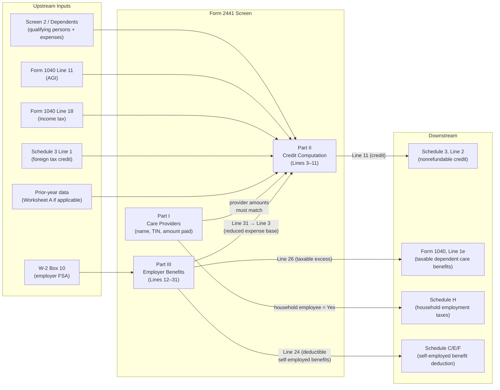

# Child and Dependent Care Expenses — Form 2441

## Overview

Form 2441 serves two distinct but interacting purposes:

1. **Child and Dependent Care Credit (Part II):** A nonrefundable credit for
   work-related expenses paid to care for qualifying children or disabled
   dependents/spouses while the taxpayer (and spouse, if MFJ) worked or looked
   for work. The credit reduces income tax dollar-for-dollar but cannot create a
   refund. **Flows to Schedule 3, Line 2.**

2. **Employer-Provided Dependent Care Benefit Exclusion (Part III):** Excludes
   employer-sponsored dependent care assistance (e.g., FSA / cafeteria plan, W-2
   Box 10) from gross income, up to a statutory limit. Excess amounts above the
   exclusion limit are taxable. **Taxable excess flows to Form 1040, Line 1e.**

When a taxpayer has BOTH employer benefits AND out-of-pocket care expenses, Part
III must be completed first; its result reduces the qualifying expenses
available for the Part II credit.

**Key upstream dependencies:**

- W-2 Box 10 (employer-provided dependent care benefits) — feeds Part III
- Drake Screen 2 (Dependents) — qualifying person names, SSNs, and expenses must
  match provider totals
- Form 1040 Line 11 (AGI) — determines credit percentage in Part II
- Form 1040 Line 18 (income tax) — determines credit limit (nonrefundable cap)

**Key downstream outputs:**

- Schedule 3, Line 2 — the credit amount
- Form 1040, Line 1e — taxable dependent care benefits (if employer benefits
  exceed exclusion)
- Schedule H (possible trigger) — if provider is a household employee

**IRS Form:** 2441 **Drake Screen:** 2441 (providers and credit computation);
also Screen 2 (Dependents) for qualifying persons **Tax Year:** 2025 **Drake
Reference:** https://kb.drakesoftware.com/kb/Drake-Tax/11750.htm

---

## Data Entry Fields

Required fields first, then optional. Data-entry only — no computed/display
fields.

### PART I — Care Providers (Line 1)

Enter one row per care provider. Drake shows 3 providers per screen page;
additional providers can be added. The same provider total must reconcile with
qualifying person expense totals (Drake validation note "CHILD CARE AMOUNTS
DIFFER" if mismatch).

| Field                          | Type           | Required         | Drake Label                  | Description                                                                                                                                                                                                                                              | IRS Reference                                 | URL                                    |
| ------------------------------ | -------------- | ---------------- | ---------------------------- | -------------------------------------------------------------------------------------------------------------------------------------------------------------------------------------------------------------------------------------------------------- | --------------------------------------------- | -------------------------------------- |
| provider_name                  | string         | yes              | "Name and address"           | Full name of care provider or organization (and address if individual)                                                                                                                                                                                   | Form 2441 Instructions, Part I, Line 1(a)     | https://www.irs.gov/instructions/i2441 |
| provider_address               | string         | yes (individual) | "Address"                    | Street address — required for individual providers, omit for employer                                                                                                                                                                                    | Form 2441 Instructions, Part I, Line 1(a)     | https://www.irs.gov/instructions/i2441 |
| provider_tin                   | string         | yes              | "Taxpayer ID Number"         | SSN/ITIN (individual) or EIN (organization). Special codes if TIN unavailable: `LAFCP` (living abroad foreign provider), `TAXEXEMPT` (tax-exempt org), `REFUSED` (provider refused), `UNABLE` (unable to obtain). Must attach statement if not provided. | Form 2441 Instructions, Part I, Line 1(b)–(c) | https://www.irs.gov/instructions/i2441 |
| provider_tin_type              | enum: SSN\|EIN | yes              | "EIN checkbox"               | SSN/ITIN for individuals; EIN for organizations — Drake checkbox                                                                                                                                                                                         | Form 2441 Instructions, Part I, Line 1(c)     | https://www.irs.gov/instructions/i2441 |
| provider_is_household_employee | boolean        | yes              | "Household employee? Yes/No" | Whether provider is a household employee. If Yes, may trigger Schedule H (Household Employment Taxes).                                                                                                                                                   | Form 2441 Instructions, Part I, Line 1(d)     | https://www.irs.gov/instructions/i2441 |
| provider_amount_paid           | number (≥0)    | yes              | "Amount paid"                | Total dollars paid to this provider in 2025, including amounts employer paid directly to the provider on taxpayer's behalf                                                                                                                               | Form 2441 Instructions, Part I, Line 1(e)     | https://www.irs.gov/instructions/i2441 |

**Provider validation rules (must check):**

- Provider CANNOT be taxpayer's spouse
- Provider CANNOT be parent of a qualifying child under age 13
- Provider CANNOT be any person claimable as taxpayer's dependent
- Provider CANNOT be taxpayer's own child under age 19 (even if not a dependent)

### PART II — Qualifying Persons (Line 2)

Entered on Drake Screen 2 (Dependents), not on Screen 2441 directly. Multiple
qualifying persons are listed; each generates a separate row on the form.

| Field                             | Type        | Required    | Drake Label                                                 | Description                                                                                                                                                                            | IRS Reference                              | URL                                                 |
| --------------------------------- | ----------- | ----------- | ----------------------------------------------------------- | -------------------------------------------------------------------------------------------------------------------------------------------------------------------------------------- | ------------------------------------------ | --------------------------------------------------- |
| qualifying_person_name            | string      | yes         | Dependent name                                              | First and last name of qualifying person                                                                                                                                               | Form 2441 Instructions, Part II, Line 2(a) | https://www.irs.gov/instructions/i2441              |
| qualifying_person_ssn             | string      | yes         | Dependent SSN                                               | SSN exactly as shown on Social Security card. Must be obtained before return due date (including extensions).                                                                          | Form 2441 Instructions, Part II, Line 2(b) | https://www.irs.gov/instructions/i2441              |
| qualifying_person_over12_disabled | boolean     | conditional | "Disabled" checkbox                                         | Check ONLY if person is OVER age 12 AND was physically or mentally incapable of caring for themselves during 2025. If a child is under 13, leave unchecked (age alone qualifies them). | Form 2441 Instructions, Part II, Line 2(c) | https://www.irs.gov/instructions/i2441              |
| qualifying_person_expenses        | number (≥0) | yes         | "Qualifying childcare expenses incurred and paid in 2025"   | Dollar amount of qualifying care expenses paid for this person during 2025. Do NOT include 2024 expenses paid in 2025 here (those go to Worksheet A / Line 9b).                        | Form 2441 Instructions, Part II, Line 2(d) | https://www.irs.gov/instructions/i2441              |
| include_without_expenses          | boolean     | no          | "Include dependent on Form 2441 without qualified expenses" | Drake checkbox — include qualifying person on form even if no current-year expenses (used when employer benefits were applied to this person, for reconciliation)                      | Drake KB 11750                             | https://kb.drakesoftware.com/kb/Drake-Tax/11750.htm |

### PART II — Credit Computation Override Fields

These are normally computed from other return data, but Drake provides override
fields for edge cases (student/disabled spouse).

| Field                           | Type    | Required    | Drake Label                | Description                                                                                                                                                                                                                                                                   | IRS Reference                                | URL                                    |
| ------------------------------- | ------- | ----------- | -------------------------- | ----------------------------------------------------------------------------------------------------------------------------------------------------------------------------------------------------------------------------------------------------------------------------- | -------------------------------------------- | -------------------------------------- |
| taxpayer_earned_income_override | number  | conditional | "Field 4" (Drake override) | Taxpayer's earned income — override for Part II Line 4. Required if taxpayer is disabled/student for some months. Normally auto-computed from return data.                                                                                                                    | Form 2441 Instructions, Lines 4–5            | https://www.irs.gov/instructions/i2441 |
| spouse_earned_income_override   | number  | conditional | "Field 5" (Drake override) | Spouse's earned income — override for Part II Line 5. For MFJ returns where spouse was student or disabled some months, compute: (actual earned income for non-qualifying months) + ($250 or $500 × number of qualifying months).                                             | Form 2441 Instructions, Lines 4–5            | https://www.irs.gov/instructions/i2441 |
| prior_year_expenses_credit      | number  | no          | Line 9b                    | Credit for 2024 qualifying care expenses paid in 2025, computed via Worksheet A. Enter only if 2024 credit was not maximized.                                                                                                                                                 | Form 2441 Instructions, Line 9b, Worksheet A | https://www.irs.gov/instructions/i2441 |
| checkbox_mfs_attestation        | boolean | conditional | "Checkbox A"               | MFS filers ONLY: attest that (1) lived apart from spouse last 6 months of 2025, (2) qualifying person's main home was taxpayer's home for more than half of 2025, (3) taxpayer paid more than half of the cost of keeping up that home. Must check all 3 to claim the credit. | Form 2441 Instructions, Line A               | https://www.irs.gov/instructions/i2441 |
| checkbox_deemed_income_used     | boolean | conditional | "Checkbox B"               | Check if $250 or $500 per month of deemed earned income was entered on Lines 4, 5, 18, or 19 for a student or disabled spouse                                                                                                                                                 | Form 2441 Instructions, Line B               | https://www.irs.gov/instructions/i2441 |

### PART III — Employer-Provided Dependent Care Benefits

Complete ONLY if employer-provided dependent care benefits were received (W-2
Box 10 > 0 or self-employed program amounts). Part III must be completed BEFORE
Part II when employer benefits exist.

| Field                                 | Type        | Required    | Drake Label                 | Description                                                                                                                                                                                                                                                                            | IRS Reference                                 | URL                                    |
| ------------------------------------- | ----------- | ----------- | --------------------------- | -------------------------------------------------------------------------------------------------------------------------------------------------------------------------------------------------------------------------------------------------------------------------------------- | --------------------------------------------- | -------------------------------------- |
| employer_benefits_received            | number (≥0) | conditional | Line 12                     | Total employer-provided dependent care benefits: W-2 Box 10 amounts PLUS any amounts received as a self-employed person or partner through a dependent care assistance program. Do NOT include amounts already in Box 1 wages (already included because they exceeded the plan limit). | Form 2441 Instructions, Part III, Line 12     | https://www.irs.gov/instructions/i2441 |
| prior_year_carryforward_used          | number (≥0) | no          | Line 13                     | Amounts carried forward from 2024 FSA and used during a 2025 grace period allowed by the employer plan (per Notice 2005-42). Enter only if employer plan includes a grace period.                                                                                                      | Form 2441 Instructions, Part III, Line 13     | https://www.irs.gov/instructions/i2441 |
| forfeited_or_carryforward_out         | number (≥0) | no          | Line 14                     | Unused amounts that were either forfeited (not received because actual expenses were insufficient) or carried forward into 2026 (if employer plan permits).                                                                                                                            | Form 2441 Instructions, Part III, Line 14     | https://www.irs.gov/instructions/i2441 |
| all_expenses_incurred_2025            | number (≥0) | conditional | Line 16                     | ALL qualifying expenses incurred in 2025 regardless of when paid — used in Part III to limit the exclusion to actual expenses. This may differ from the Line 2 totals (which are expenses PAID in 2025).                                                                               | Form 2441 Instructions, Part III, Line 16     | https://www.irs.gov/instructions/i2441 |
| self_employed_benefits                | number (≥0) | conditional | Line 22                     | Self-employment or partnership dependent care benefits included in Line 12. Enter 0 (or leave blank) if all benefits are from W-2 employment. If nonzero, deductible on the applicable business schedule.                                                                              | Form 2441 Instructions, Part III, Line 22     | https://www.irs.gov/instructions/i2441 |
| taxpayer_earned_income_part3_override | number      | conditional | "Field 18" (Drake override) | Taxpayer's earned income for Part III Line 18 — same definition as Lines 4/5 but EXCLUDES dependent care benefits shown on Line 12. Override for student/disabled months.                                                                                                              | Form 2441 Instructions, Part III, Lines 18–19 | https://www.irs.gov/instructions/i2441 |
| spouse_earned_income_part3_override   | number      | conditional | "Field 19" (Drake override) | Spouse's earned income for Part III Line 19 — same definition. Deemed income rules apply for student/disabled months ($250/$500/month). Override available in Drake.                                                                                                                   | Form 2441 Instructions, Part III, Lines 18–19 | https://www.irs.gov/instructions/i2441 |

---

## Per-Field Routing

| Field                                   | Destination                                                         | How Used                                                                                      | Triggers                                               | Limit / Cap                                                                     | IRS Reference                                                    | URL                                    |
| --------------------------------------- | ------------------------------------------------------------------- | --------------------------------------------------------------------------------------------- | ------------------------------------------------------ | ------------------------------------------------------------------------------- | ---------------------------------------------------------------- | -------------------------------------- |
| provider_amount_paid (all summed)       | Form 2441, internal (Part II Line 3 computation)                    | Summed across all providers; must reconcile with qualifying person expense totals             | Mismatch with Screen 2 totals triggers Drake NOTE      | None (cap applied at Line 3)                                                    | Form 2441 Instructions, Part I                                   | https://www.irs.gov/instructions/i2441 |
| qualifying_person_expenses (all summed) | Form 2441 Line 3                                                    | Summed; then capped at $3,000 (1 person) or $6,000 (2+ persons) to produce Line 3             | None                                                   | $3,000 (1 person) / $6,000 (2+ persons) — IRC §21(c)                            | Form 2441 Instructions, Lines 2–3                                | https://www.irs.gov/instructions/i2441 |
| qualifying_person_over12_disabled       | Form 2441 Part II (qualifying person status)                        | Enables person over 12 to qualify; without this checkbox, only children under 13 qualify      | Allows person 13+ to be included as qualifying person  | N/A                                                                             | Form 2441 Instructions, Line 2(c)                                | https://www.irs.gov/instructions/i2441 |
| taxpayer_earned_income (Line 4)         | Form 2441 Line 6                                                    | Part of three-way minimum (Line 3, Line 4, Line 5) that limits qualifying expenses for credit | None                                                   | Limited to lesser of two spouses' earned income                                 | Form 2441 Instructions, Lines 4–6                                | https://www.irs.gov/instructions/i2441 |
| spouse_earned_income (Line 5)           | Form 2441 Line 6                                                    | Part of three-way minimum                                                                     | Student/disabled → $250/$500 deemed income per month   | $250/month (1 person) or $500/month (2+ persons) if student/disabled            | Form 2441 Instructions, Lines 4–6                                | https://www.irs.gov/instructions/i2441 |
| prior_year_expenses_credit (Line 9b)    | Form 2441 Line 9c (9a + 9b)                                         | Added to current-year credit; then multiplied by percentage in Line 8                         | Worksheet A required                                   | Cannot exceed 2024 unused credit capacity                                       | Form 2441 Instructions, Worksheet A, Line 9b                     | https://www.irs.gov/instructions/i2441 |
| employer_benefits_received (Line 12)    | Form 2441 Part III (Lines 15–26, then 27–31)                        | Reduces qualifying expenses available for Part II credit via Lines 27–31                      | Triggers Part III computation                          | $5,000 (MFJ/single) / $2,500 (MFS) exclusion cap                                | Form 2441 Instructions, Line 21                                  | https://www.irs.gov/instructions/i2441 |
| taxable_benefits (Line 26)              | Form 1040, Line 1e                                                  | Excess employer benefits above exclusion limit — reported as wages                            | —                                                      | Positive amount only; $0 if exclusion covers all benefits                       | Form 2441 Instructions, Line 26; Form 1040 Instructions, Line 1e | https://www.irs.gov/instructions/i2441 |
| credit_amount (Line 11)                 | Schedule 3, Line 2                                                  | Nonrefundable credit reducing income tax liability                                            | —                                                      | Cannot exceed Form 1040 Line 18 minus Schedule 3 Line 1 minus Form 8978 Line 14 | Form 2441 Instructions, Lines 10–11; Schedule 3                  | https://www.irs.gov/instructions/i2441 |
| provider_is_household_employee          | Schedule H                                                          | If Yes for any provider, taxpayer may owe household employment taxes (Schedule H)             | Schedule H if household employee paid ≥ $2,800 in 2025 | N/A                                                                             | Form 2441 Instructions, Part I, Line 1(d)                        | https://www.irs.gov/instructions/i2441 |
| self_employed_benefits (Line 22)        | Schedule C Line 14 / Schedule E Lines 19 or 28 / Schedule F Line 15 | Deductible portion of self-employment dependent care benefits                                 | Self-employment schedule deduction                     | min(Line 20, Line 21, Line 23)                                                  | Form 2441 Instructions, Line 24                                  | https://www.irs.gov/instructions/i2441 |

---

## Calculation Logic

### Overview

There are two separate computations. If no employer benefits exist (Line 12 =
0), skip Part III and go directly to Part II. If employer benefits exist,
complete Part III first, then use Line 31 result as input to Part II.

---

### Part III Computation — Employer-Provided Dependent Care Benefits

Complete when W-2 Box 10 > 0 or self-employed program benefits exist.

#### Step P3-1 — Net Benefits (Lines 12–15)

```
Line 15 = Line 12 + Line 13 − Line 14
```

- Line 12: Total employer benefits received (W-2 Box 10 + self-employed)
- Line 13: Prior-year carryforward used in grace period (add)
- Line 14: Forfeited or carried to next year (subtract)
- Line 15: Net benefits

> **Source:** Form 2441 Instructions, Part III, Lines 12–15 —
> https://www.irs.gov/instructions/i2441

#### Step P3-2 — Limit to Actual Expenses (Line 17)

```
Line 17 = min(Line 15, Line 16)
```

- Line 16: All qualifying expenses incurred in 2025 (regardless of payment date)
- Cannot exclude more than actual qualifying expenses

> **Source:** Form 2441 Instructions, Part III, Lines 16–17 —
> https://www.irs.gov/instructions/i2441

#### Step P3-3 — Apply Earned Income Limit (Lines 18–20)

```
Line 18 = Taxpayer's earned income (excl. dependent care benefits on Line 12)
Line 19 = Spouse's earned income (same definition; deemed income rules apply)
Line 20 = min(Line 17, Line 18, Line 19)
```

- Single filer: Line 20 = min(Line 17, Line 18) [no Line 19]
- For months spouse was full-time student or disabled: use $250/month (1
  qualifying person) or $500/month (2+ qualifying persons) as deemed income for
  those months

> **Source:** Form 2441 Instructions, Part III, Lines 18–20 —
> https://www.irs.gov/instructions/i2441

#### Step P3-4 — Apply Statutory Exclusion Cap (Lines 21–25)

```
Line 21 = $5,000  (MFJ or single)
         OR
         $2,500  (MFS — if meeting the 3-part attestation requirement)
```

NOTE: For TY2025, this is $5,000/$2,500. Pub. L. 119-21 raised this to
$7,500/$3,750 but the effective date is tax years BEGINNING AFTER December 31,
2025 — does NOT apply to TY2025.

For **employee-only** benefits (Line 22 = 0):

```
Line 22 = 0
Line 23 = Line 15 − Line 22 = Line 15
Line 24 = 0  (no deductible benefits for employees)
Line 25 = min(Line 20, Line 21)  ← excluded amount
Line 26 = Line 23 − Line 25  ← taxable (if positive); else $0
```

For **self-employed / partnership** benefits (Line 22 > 0):

```
Line 22 = self-employment portion of Line 12
Line 23 = Line 15 − Line 22
Line 24 = min(Line 20, Line 21, Line 23)  ← deductible on business schedule
Line 25 = min(Line 20, Line 21) − Line 24  ← excluded amount
Line 26 = Line 23 − Line 25  ← taxable
```

Line 26 (taxable benefits): if > 0, enter on **Form 1040, Line 1e**.

> **Source:** Form 2441 Instructions, Part III, Lines 21–26;
> teachmepersonalfinance.com/irs-form-2441-instructions —
> https://www.irs.gov/instructions/i2441

#### Step P3-5 — Compute Residual Qualifying Expenses for Part II Credit (Lines 27–31)

This step determines how much, if any, of the qualifying expense cap remains
after employer benefits are applied.

```
Line 27 = $3,000 (1 qualifying person) OR $6,000 (2+ qualifying persons)
Line 28 = Line 24 + Line 25  (total excluded/deductible benefits)
Line 29 = Line 27 − Line 28  (residual expense cap; if ≤ 0, no Part II credit)
Line 30 = sum of qualifying person expenses (Line 2 column d) minus Line 28 adjustments
Line 31 = min(Line 29, Line 30)
```

**Line 31 result → enters Part II as Line 3** (replaces the standard Line 3
calculation when Part III was required).

If Line 31 = 0 or negative: Part II credit = $0 (no further computation needed).

**Key interaction example:**

- Taxpayer: 1 qualifying person, $3,000 FSA exclusion (Line 25), $3,000
  out-of-pocket expenses
- Line 27 = $3,000; Line 28 = $3,000; Line 29 = $0 → no credit
- Taxpayer: 2 qualifying persons, $5,000 FSA exclusion, $6,000+ out-of-pocket
- Line 27 = $6,000; Line 28 = $5,000; Line 29 = $1,000 → up to $1,000 eligible
  for credit

> **Source:** Form 2441 Instructions, Part III, Lines 27–31;
> teachmepersonalfinance.com/irs-form-2441-instructions —
> https://www.irs.gov/instructions/i2441

---

### Part II Computation — Child and Dependent Care Credit

#### Step P2-1 — Qualifying Expenses Cap (Line 3)

If Part III was NOT completed (no employer benefits):

```
Line 3 = min(sum of qualifying_person_expenses, expense_cap)
         where expense_cap = $3,000 (1 qualifying person) OR $6,000 (2+ qualifying persons)
```

If Part III WAS completed:

```
Line 3 = Line 31 from Part III
```

> **Source:** Form 2441 Instructions, Part II, Lines 2–3, and Lines 27–31 —
> https://www.irs.gov/instructions/i2441

#### Step P2-2 — Earned Income Limitation (Lines 4–6)

```
Line 4 = Taxpayer's earned income for 2025
         = Wages (Form 1040 Line 1z) minus foreign earned income exclusion (Form 2555)
           PLUS net SE income (Schedule SE Line 3 minus Schedule 1 Line 15)
           PLUS statutory employee income (Schedule C)
           [optional: nontaxable combat pay if elected]
           NOT including: investment income, pensions, SS, child support, unemployment

Line 5 = Spouse's earned income (same definition; MFJ only)
         For any month spouse was a full-time student or disabled:
           substitute $250/month if 1 qualifying person
           substitute $500/month if 2+ qualifying persons
           (only one spouse can claim deemed income in overlapping months)

Line 6 = min(Line 3, Line 4, Line 5)
         Single filer: min(Line 3, Line 4)   [no spouse]
```

**Full-time student definition:** Enrolled as full-time student at a school for
some part of each of 5 calendar months during 2025 (months need not be
consecutive). Excludes on-the-job training, correspondence courses,
internet-only schools (unless accredited institution).

**Disabled definition:** Physically or mentally unable to care for themselves,
OR requires constant attention to prevent injury to themselves or others.

> **Source:** Form 2441 Instructions, Lines 4–6 —
> https://www.irs.gov/instructions/i2441

#### Step P2-3 — Add Prior-Year Expenses (Lines 9a–9c)

```
Line 9a = Line 6 × Line 8  (credit for current year expenses — see Step P2-4)
Line 9b = result from Worksheet A (credit for 2024 expenses paid in 2025)
Line 9c = Line 9a + Line 9b
```

**Worksheet A** (compute separately and attach):

1. Line 1: Amount from 2024 Form 2441 Line 3 (prior year qualifying expense
   base)
2. Line 2: 2024 qualifying expenses paid in 2025 (new cash payments for 2024
   care)
3. Line 3: Line 1 + Line 2
4. Line 4: $3,000 or $6,000 (2024 expense cap)
5. Line 5: 2024 dependent care benefits deducted/excluded (2024 Form 2441 Lines
   24 + 25)
6. Line 6: Line 4 − Line 5
7. Line 7: Smaller of 2024 taxpayer's earned income or 2024 spouse's earned
   income
8. Line 8: Smallest of Lines 3, 6, or 7
9. Line 9: 2024 Form 2441 Line 6 (amount on which 2024 credit was actually
   computed)
10. Line 10: Line 8 − Line 9. If zero or negative: STOP — no additional credit
    available.
11. Line 11: 2024 AGI (from 2024 Form 1040 Line 11)
12. Line 12: Credit percentage from TY2024 table for Line 11 AGI
13. Line 13: Line 10 × Line 12 = **enter on 2025 Form 2441 Line 9b**

Attach copy of Worksheet A to the return.

> **Source:** Form 2441 Instructions, Worksheet A —
> https://www.irs.gov/instructions/i2441

#### Step P2-4 — Apply Credit Percentage (Lines 7–8)

```
Line 7 = AGI from Form 1040, Line 11  (regular AGI, not modified)
Line 8 = decimal from credit percentage table (see Constants section)
```

Multiply Line 6 × Line 8 = Line 9a (credit for current-year expenses).

The percentage is applied to Line 6 (post-earned-income-limitation expenses),
NOT to Line 3 directly. The order matters:

1. Line 3: cap at $3,000/$6,000
2. Line 6: further reduce by earned income minimum
3. Line 8: look up percentage from AGI
4. Line 9a = Line 6 × Line 8

> **Source:** Form 2441 Instructions, Lines 7–8 —
> https://www.irs.gov/instructions/i2441

#### Step P2-5 — Apply Credit Limit (Lines 10–11)

The credit is **nonrefundable** — it cannot exceed the taxpayer's income tax
liability.

```
Line 10 (credit limit) = Form 1040 Line 18
                         − Schedule 3 Line 1 (foreign tax credit)
                         − Form 8978 Line 14 (partner's BBA audit adjustment)

Line 11 (actual credit) = min(Line 9c, Line 10)
```

If Line 10 ≤ 0: credit = $0. Enter Line 11 on **Schedule 3, Line 2**.

> **Source:** Form 2441 Instructions, Lines 10–11 —
> https://www.irs.gov/instructions/i2441

---

## Constants & Thresholds (Tax Year 2025)

| Constant                                                                 | Value                          | Source                                                                                | URL                                                               |
| ------------------------------------------------------------------------ | ------------------------------ | ------------------------------------------------------------------------------------- | ----------------------------------------------------------------- |
| Maximum qualifying expenses — 1 qualifying person                        | $3,000                         | IRC §21(c)(1) — fixed by statute, not inflation-indexed                               | https://www.law.cornell.edu/uscode/text/26/21                     |
| Maximum qualifying expenses — 2+ qualifying persons                      | $6,000                         | IRC §21(c)(2) — fixed by statute, not inflation-indexed                               | https://www.law.cornell.edu/uscode/text/26/21                     |
| Maximum employer-provided dependent care exclusion (MFJ/single) — TY2025 | $5,000                         | IRC §129(a)(2)(A) — pre-amendment amount; amendment by Pub. L. 119-21 applies TY2026+ | https://www.law.cornell.edu/uscode/text/26/129                    |
| Maximum employer-provided dependent care exclusion (MFS) — TY2025        | $2,500                         | IRC §129(a)(2)(B) — pre-amendment amount                                              | https://www.law.cornell.edu/uscode/text/26/129                    |
| TY2026 employer exclusion limit (NOT TY2025)                             | $7,500 ($3,750 MFS)            | Pub. L. 119-21, §70404(a), effective for TY beginning after Dec 31, 2025              | https://www.law.cornell.edu/uscode/text/26/129                    |
| Deemed earned income — 1 qualifying person, per month                    | $250                           | Form 2441 Instructions, Lines 4–5; IRC §21(d)(2)                                      | https://www.irs.gov/instructions/i2441                            |
| Deemed earned income — 2+ qualifying persons, per month                  | $500                           | Form 2441 Instructions, Lines 4–5; IRC §21(d)(2)                                      | https://www.irs.gov/instructions/i2441                            |
| Credit % — AGI $0–$15,000                                                | 35% (0.35)                     | IRC §21(a)(2); Form 2441 Instructions, Line 8 table — NOT inflation-indexed           | https://www.irs.gov/instructions/i2441                            |
| Credit % — AGI $15,001–$17,000                                           | 34% (0.34)                     | IRC §21(a)(2); Form 2441 Instructions                                                 | https://www.irs.gov/instructions/i2441                            |
| Credit % — AGI $17,001–$19,000                                           | 33% (0.33)                     | IRC §21(a)(2); Form 2441 Instructions                                                 | https://www.irs.gov/instructions/i2441                            |
| Credit % — AGI $19,001–$21,000                                           | 32% (0.32)                     | IRC §21(a)(2); Form 2441 Instructions                                                 | https://www.irs.gov/instructions/i2441                            |
| Credit % — AGI $21,001–$23,000                                           | 31% (0.31)                     | IRC §21(a)(2); Form 2441 Instructions                                                 | https://www.irs.gov/instructions/i2441                            |
| Credit % — AGI $23,001–$25,000                                           | 30% (0.30)                     | IRC §21(a)(2); Form 2441 Instructions                                                 | https://www.irs.gov/instructions/i2441                            |
| Credit % — AGI $25,001–$27,000                                           | 29% (0.29)                     | IRC §21(a)(2); Form 2441 Instructions                                                 | https://www.irs.gov/instructions/i2441                            |
| Credit % — AGI $27,001–$29,000                                           | 28% (0.28)                     | IRC §21(a)(2); Form 2441 Instructions                                                 | https://www.irs.gov/instructions/i2441                            |
| Credit % — AGI $29,001–$31,000                                           | 27% (0.27)                     | IRC §21(a)(2); Form 2441 Instructions                                                 | https://www.irs.gov/instructions/i2441                            |
| Credit % — AGI $31,001–$33,000                                           | 26% (0.26)                     | IRC §21(a)(2); Form 2441 Instructions                                                 | https://www.irs.gov/instructions/i2441                            |
| Credit % — AGI $33,001–$35,000                                           | 25% (0.25)                     | IRC §21(a)(2); Form 2441 Instructions                                                 | https://www.irs.gov/instructions/i2441                            |
| Credit % — AGI $35,001–$37,000                                           | 24% (0.24)                     | IRC §21(a)(2); Form 2441 Instructions                                                 | https://www.irs.gov/instructions/i2441                            |
| Credit % — AGI $37,001–$39,000                                           | 23% (0.23)                     | IRC §21(a)(2); Form 2441 Instructions                                                 | https://www.irs.gov/instructions/i2441                            |
| Credit % — AGI $39,001–$41,000                                           | 22% (0.22)                     | IRC §21(a)(2); Form 2441 Instructions                                                 | https://www.irs.gov/instructions/i2441                            |
| Credit % — AGI $41,001–$43,000                                           | 21% (0.21)                     | IRC §21(a)(2); Form 2441 Instructions                                                 | https://www.irs.gov/instructions/i2441                            |
| Credit % — AGI $43,001 and above                                         | 20% (0.20)                     | IRC §21(a)(2); Form 2441 Instructions — floor rate, never lower                       | https://www.irs.gov/instructions/i2441                            |
| Credit is nonrefundable for TY2025                                       | Yes — cannot exceed income tax | IRC §21(a)(1); ARP 2021 expansion expired after TY2021                                | https://www.irs.gov/newsroom/child-and-dependent-care-credit-faqs |

---

## Data Flow Diagram



---

## Edge Cases & Special Rules

### 1. Married Filing Separately (MFS) — Restricted but Not Prohibited

MFS filers can claim the credit ONLY if ALL three conditions are met (Checkbox
A):

1. Lived apart from spouse during the **last 6 months of 2025**
2. The qualifying person's main home was the taxpayer's home for **more than
   half of 2025**
3. The taxpayer paid **more than half** of the cost of keeping up that home for
   2025

MFS filers who qualify: use $2,500 (not $5,000) for employer benefit exclusion
cap (Line 21). Same credit computation otherwise.

MFS filers who do NOT meet all three conditions: **cannot claim the credit** but
may still claim the employer benefit exclusion (up to $2,500) if otherwise
eligible.

> **Source:** Form 2441 Instructions, Lines A and B, MFS special rules —
> https://www.irs.gov/instructions/i2441

---

### 2. Disabled or Student Spouse — Deemed Earned Income

When either spouse is a full-time student or physically/mentally unable to care
for themselves during any month of 2025, that spouse is **deemed** to have
earned income for those months:

- **$250 per month** if 1 qualifying person
- **$500 per month** if 2+ qualifying persons

**How to calculate the override (Lines 4/5 or 18/19):**

1. Identify which months the spouse was a student or disabled (any part of a
   month counts)
2. Count those months (N = number of qualifying months, max 12)
3. Multiply: N × $250 (or $500) = deemed income for qualifying months
4. Add actual earned income for non-qualifying months
5. Enter the total as the spouse's earned income override in Drake

**Only one spouse** may claim deemed income in any given month — if both were
disabled/students the same month, one must use actual (zero) income.

**Full-time student definition:** Enrolled full-time at a school for some part
of each of at least 5 calendar months during 2025 (months need not be
consecutive). Does NOT include on-the-job training, correspondence, or
internet-only schools (unless accredited).

**Disabled definition:** Physically or mentally unable to care for themselves,
OR requires constant attention to prevent injury.

> **Source:** Form 2441 Instructions, Lines 4–5, 18–19 —
> https://www.irs.gov/instructions/i2441

---

### 3. Child Turns 13 During the Year

A child who turns 13 during 2025 is a qualifying person **only for the portion
of the year they were under age 13**. The qualifying expenses must cover only
care provided during those months (before the birthday). Expenses for care after
the 13th birthday do not qualify unless the child is disabled (see rule above).

> **Source:** Form 2441 Instructions, Qualifying Persons —
> https://www.irs.gov/instructions/i2441

---

### 4. Divorced or Separated Parents — Custodial Parent Rule

Even if the non-custodial parent claims the dependency exemption (Form 8332
release), the **custodial parent** is the one who can claim the childcare
credit. The custodial parent = the parent with whom the child lived for the
greater number of nights in 2025.

Exception: If nights are exactly equal (183/183), the parent with the higher AGI
is treated as custodial.

The credit is NOT tied to who claims the child as a dependent for exemption
purposes — this is a common misconception. The child must have been a qualifying
child under the residency test (lived with claiming parent more than half the
year).

> **Source:** Form 2441 Instructions, Qualifying Persons, divorced/separated
> parent rule — https://www.irs.gov/instructions/i2441

---

### 5. Employer Benefits + Credit Interaction — Key Scenarios

When Part III is completed, Lines 27–31 determine how much of the expense cap
remains:

| Scenario                     | Qualifying Persons | FSA Exclusion | Line 27 | Line 28 | Line 29                        | Part II Credit Possible? |
| ---------------------------- | ------------------ | ------------- | ------- | ------- | ------------------------------ | ------------------------ |
| FSA only (no extra expenses) | 1                  | $3,000        | $3,000  | $3,000  | $0                             | No                       |
| FSA + extra expenses         | 1                  | $3,000        | $3,000  | $3,000  | $0                             | No                       |
| FSA + extra expenses         | 2+                 | $5,000        | $6,000  | $5,000  | $1,000                         | Yes (on $1,000)          |
| FSA exceeds cap              | 1                  | $5,000        | $3,000  | $3,000  | $0                             | No (FSA > cap)           |
| No FSA                       | 1                  | $0            | —       | —       | Line 3 = min($3,000, expenses) | Yes                      |

> **Source:** Form 2441 Instructions, Lines 27–31 —
> https://www.irs.gov/instructions/i2441

---

### 6. Provider Restrictions — Cannot Be a Relative/Dependent

The following people CANNOT be listed as care providers, even if they actually
provided care:

- Taxpayer's spouse
- Parent of the qualifying child (if child is under 13)
- Any person the taxpayer can claim as a dependent
- Taxpayer's own child under age 19 (even if not claimable as dependent)

Payments to these individuals do NOT qualify — no credit and no exclusion.

> **Source:** Form 2441 Instructions, Part I, provider restrictions —
> https://www.irs.gov/instructions/i2441

---

### 7. Provider Due Diligence — What to Do When TIN Unavailable

Taxpayer must make a genuine effort to obtain provider TIN (Form W-10 or other
documentation). If provider refuses or is unavailable:

- Enter all available information (name, address)
- Enter the special code in the TIN field: `REFUSED`, `UNABLE`, `LAFCP`, or
  `TAXEXEMPT`
- Attach a statement to the return explaining the situation
- Failure to show due diligence may result in IRS disallowing the credit

> **Source:** Form 2441 Instructions, Due Diligence note —
> https://www.irs.gov/instructions/i2441

---

### 8. Out-of-Home Care Restrictions

Out-of-home care (day care center, nursery) qualifies ONLY if:

- The qualifying person is **under 13**, OR
- The qualifying person regularly spends **at least 8 hours per day** in the
  taxpayer's home
- If a dependent care center (serves adults): must comply with all applicable
  state/local regulations AND serve **more than 6 persons per day** for
  compensation

Day camps qualify. **Overnight camps do NOT qualify** (regardless of
activities). Before/after-school programs for school-age children DO qualify.

Education expenses: kindergarten and above tuition does NOT qualify. Preschool
for children under kindergarten age DOES qualify. Day camp with specialized
activities qualifies.

> **Source:** Form 2441 Instructions, Qualified Expenses —
> https://www.irs.gov/instructions/i2441

---

### 9. Grace Period Carryforward (Line 13)

If employer's FSA plan includes a grace period (allowed by Notice 2005-42),
unused 2024 FSA amounts may be carried into 2025 and spent during the first 2.5
months (January 1 – March 15, 2025). These carry-forward amounts used during the
grace period are entered on Line 13.

Grace periods are employer-optional — verify whether employer plan includes one
before entering any amount on Line 13.

> **Source:** Form 2441 Instructions, Line 13; IRS Notice 2005-42 —
> https://www.irs.gov/instructions/i2441

---

### 10. Self-Employed and Partner Dependent Care Benefits

Self-employed individuals may operate a dependent care assistance program
through their own sole proprietorship. Partners may receive dependent care
benefits through their partnership. These amounts:

- Are included on Line 12 (same as W-2 benefits)
- If excluded, are deducted on the business schedule (not as a personal
  deduction):
  - Schedule C: Line 14
  - Schedule E: Line 19 (partnership/S-corp) or Line 28
  - Schedule F: Line 15

The self-employed person cannot be the sole employee covered by their own plan
(see IRC §129(d)(1)–(4) nondiscrimination rules) — this is a compliance note,
not a data-entry field.

> **Source:** Form 2441 Instructions, Line 24 —
> https://www.irs.gov/instructions/i2441

---

### 11. Double-Counting Prohibition — Schedule A Medical Expenses

Some expenses for care of a disabled person may qualify as medical expenses
deductible on Schedule A. The same dollar amount CANNOT be claimed as both a
Form 2441 qualifying care expense AND a Schedule A medical expense.

If an expense is claimed on both, the IRS will disallow the duplicate.

> **Source:** Form 2441 Instructions, Qualified Expenses —
> https://www.irs.gov/instructions/i2441

---

### 12. Provider Amount vs. Qualifying Person Expense Reconciliation

Drake requires that provider total payments (Part I) reconcile with qualifying
person expenses entered on Screen 2 (Dependents). Common Drake notes:

- **"CHILD CARE AMOUNTS DIFFER"**: Total expenses on Screen 2 differs from
  provider payments on 2441
- **EF Message 5066 "No Child Care Expenses Incurred"**: Provider payments
  entered but no qualifying person expenses on Screen 2

The IRS does not strictly require these to balance to the penny — a provider may
be paid for multiple types of services — but the care expenses must represent
the portion paid for qualifying care. Drake's reconciliation is a data-entry
validation, not a legal requirement.

> **Source:** Drake KB 12802, Drake KB 12815 —
> https://kb.drakesoftware.com/Site/Browse/12802;
> https://kb.drakesoftware.com/Site/Browse/12815

---

### 13. Credit Is Nonrefundable for TY2025

The 2021 American Rescue Plan Act temporarily made the credit refundable and
raised expense limits to $8,000/$16,000 for TY2021 only. Those changes expired
after TY2021. For TY2025, the credit is fully nonrefundable — it can reduce tax
to $0 but cannot generate a refund.

> **Source:** IRS Child and Dependent Care Credit FAQs —
> https://www.irs.gov/newsroom/child-and-dependent-care-credit-faqs

---

### 14. Household Employee — Schedule H Trigger

If any provider is marked as a household employee (Line 1(d) = Yes) AND that
employee was paid $2,800 or more in cash wages during 2025, the taxpayer must
file Schedule H (Household Employment Taxes) with their return. This applies to
babysitters, nannies, au pairs, etc. hired directly by the taxpayer.

Note: If care is provided by a licensed childcare agency or day care center (not
a household employee), Schedule H is not triggered.

> **Source:** Form 2441 Instructions, Part I, Line 1(d); IRS Schedule H
> Instructions — https://www.irs.gov/instructions/i2441

---

## Sources

All URLs verified to resolve.

| Document                                                       | Year                                   | Section                      | URL                                                                | Saved as  |
| -------------------------------------------------------------- | -------------------------------------- | ---------------------------- | ------------------------------------------------------------------ | --------- |
| Drake KB — 2441 Child and Dependent Care Credit                | —                                      | Full article                 | https://kb.drakesoftware.com/kb/Drake-Tax/11750.htm                | —         |
| IRS Instructions for Form 2441 (2025)                          | 2025                                   | Full                         | https://www.irs.gov/instructions/i2441                             | i2441.pdf |
| IRS Publication 503 — Child and Dependent Care Expenses        | 2025                                   | Full                         | https://www.irs.gov/pub/irs-pdf/p503.pdf                           | p503.pdf  |
| IRC §21 — Expenses for Household and Dependent Care Services   | current                                | §21(a)(2), §21(c), §21(d)(2) | https://www.law.cornell.edu/uscode/text/26/21                      | —         |
| IRC §129 — Dependent Care Assistance Programs                  | current (as amended by Pub. L. 119-21) | §129(a)(2)                   | https://www.law.cornell.edu/uscode/text/26/129                     | —         |
| IRS Child and Dependent Care Credit FAQs                       | 2025                                   | Full                         | https://www.irs.gov/newsroom/child-and-dependent-care-credit-faqs  | —         |
| IRS Instructions for Schedule 3 (Form 1040)                    | 2025                                   | Line 2                       | https://www.irs.gov/instructions/i1040s3                           | —         |
| IRS Instructions for Form 1040                                 | 2025                                   | Line 1e                      | https://www.irs.gov/instructions/i1040gi                           | —         |
| TeachMePersonalFinance — Form 2441 Instructions Guide          | 2025                                   | Lines 22–31 detail           | https://www.teachmepersonalfinance.com/irs-form-2441-instructions/ | —         |
| Drake KB 12802 — 2441 Notes in View Point to Data Entry Issues | —                                      | Full                         | https://kb.drakesoftware.com/Site/Browse/12802                     | —         |
| Drake KB 12815 — EF Message 5066                               | —                                      | Full                         | https://kb.drakesoftware.com/Site/Browse/12815                     | —         |
