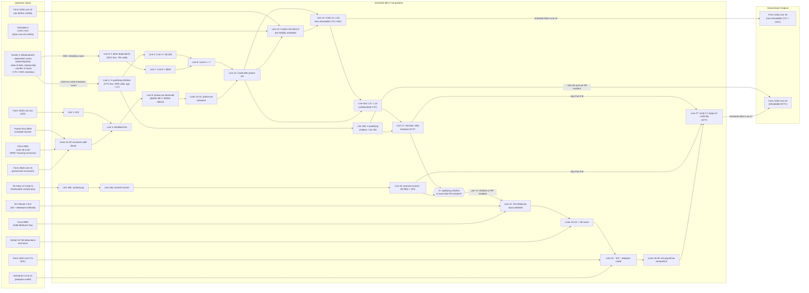

# Schedule 8812 — Credits for Qualifying Children and Other Dependents

## Overview

Schedule 8812 is the IRS form used to calculate three related credits: the Child
Tax Credit (CTC), the Credit for Other Dependents (ODC), and the Additional
Child Tax Credit (ACTC). The CTC and ODC are non-refundable credits that reduce
tax liability (output to Form 1040 Line 19). The ACTC is a refundable credit
that can generate a refund even when tax liability is zero (output to Form 1040
Line 28).

The schedule is always required when any of these credits are claimed — there is
no simplified path. It depends on dependent data entered on Form 1040's
Dependents section (Screen 2 in Drake) and on earned income data from the
return. It also depends on prior-credit data from Schedule 3 (used in the Credit
Limit Worksheet A to determine remaining tax liability available to absorb the
non-refundable portion).

Key facts for TY2025:

- CTC is $2,200 per qualifying child (increased from $2,000 under the One Big
  Beautiful Bill Act, signed July 4, 2025, Public Law 119-21)
- ACTC maximum is $1,700 per qualifying child (refundable portion)
- ODC is $500 per qualifying other dependent
- Phase-out begins at modified AGI $400,000 (MFJ) or $200,000 (all others)
- Phase-out rate: $50 per $1,000 (or fraction thereof) of modified AGI above
  threshold
- To claim CTC/ACTC: qualifying child must have a valid SSN (employment-valid,
  issued before return due date)
- To claim ODC: dependent must have SSN, ITIN, or ATIN issued by return due date

**IRS Form:** Schedule 8812 (Form 1040) **Drake Screen:** 8812 (with dependent
data from Screen 2) **Tax Year:** 2025 **Drake Reference:**
https://kb.drakesoftware.com/kb/Drake-Tax/18340.htm **IRS Form (PDF):**
https://www.irs.gov/pub/irs-pdf/f1040s8.pdf **IRS Instructions (PDF):**
https://www.irs.gov/pub/irs-pdf/i1040s8.pdf **IRS Instructions (HTML):**
https://www.irs.gov/instructions/i1040s8 **Instructions Published:** January 23,
2026 (covers TY2025)

---

## Data Entry Fields

Required fields first, then optional. Data-entry only — no computed/display
fields.

The 8812 screen has two categories of inputs: (1) dependent-level fields entered
on the Form 1040 Dependents section / Drake Screen 2, which flow automatically
into Schedule 8812, and (2) a small set of fields entered directly on Drake
Screen 8812.

### Dependent-Level Fields (per dependent — entered on Screen 2 / Form 1040 Dependents section)

| Field                       | Type             | Required              | Drake Label                            | Description                                                                                                                                                                                                               | IRS Reference                                                                                      | URL                                         |
| --------------------------- | ---------------- | --------------------- | -------------------------------------- | ------------------------------------------------------------------------------------------------------------------------------------------------------------------------------------------------------------------------- | -------------------------------------------------------------------------------------------------- | ------------------------------------------- |
| dependent_first_name        | string           | yes                   | First name                             | Dependent's legal first name                                                                                                                                                                                              | Form 1040, Dependents section row (1)                                                              | https://www.irs.gov/pub/irs-pdf/f1040.pdf   |
| dependent_last_name         | string           | yes                   | Last name                              | Dependent's legal last name                                                                                                                                                                                               | Form 1040, Dependents section row (2)                                                              | https://www.irs.gov/pub/irs-pdf/f1040.pdf   |
| dependent_ssn               | string (9-digit) | yes                   | SSN                                    | Dependent's SSN, ITIN, or ATIN. For CTC/ACTC: must be a valid SSN (employment-valid, issued before return due date). For ODC: SSN, ITIN, or ATIN issued by return due date.                                               | i1040s8.pdf, "TIN Requirements", p.1                                                               | https://www.irs.gov/pub/irs-pdf/i1040s8.pdf |
| dependent_relationship      | string           | yes                   | Relationship                           | Relationship to taxpayer (child, stepchild, foster child, sibling, etc.)                                                                                                                                                  | Form 1040, Dependents section row (4); i1040s8.pdf p.1                                             | https://www.irs.gov/pub/irs-pdf/i1040s8.pdf |
| dependent_dob               | date             | yes                   | Date of birth                          | Used to determine if child is under age 17 at end of 2025 (age 16 or younger on Dec 31, 2025). Note: child born Dec 31, 2025 qualifies; child born Dec 30, 2008 (turns 17 on Dec 30, 2025) does NOT qualify for CTC/ACTC. | i1040s8.pdf, "Credits for Qualifying Children", p.2                                                | https://www.irs.gov/pub/irs-pdf/i1040s8.pdf |
| dependent_months_in_home    | integer (0–12)   | yes                   | Months in home                         | Number of months dependent lived with taxpayer in 2025. Used as part of the dependency test.                                                                                                                              | Form 1040, Dependents section row (5); Instructions for Form 1040, Who Qualifies as Your Dependent | https://www.irs.gov/instructions/i1040gi    |
| child_tax_credit_box        | boolean          | yes (if claiming CTC) | "Child tax credit" checkbox            | Check this box in row (7) of the Dependents section for each child claimed for CTC. Cannot be checked AND "Credit for other dependents" for the same person.                                                              | i1040s8.pdf, "Line 4", p.2                                                                         | https://www.irs.gov/pub/irs-pdf/i1040s8.pdf |
| credit_other_dependents_box | boolean          | yes (if claiming ODC) | "Credit for other dependents" checkbox | Check this box in row (7) for dependents claimed for ODC. Cannot be checked AND "Child tax credit" for the same person.                                                                                                   | i1040s8.pdf, "Line 6", p.2                                                                         | https://www.irs.gov/pub/irs-pdf/i1040s8.pdf |
| ssn_not_valid_for_work      | boolean          | no                    | "SSN is not valid for work"            | Flag on Drake Screen 2 Dependent tab. If checked, child is ineligible for CTC/ACTC but may qualify for ODC (if the dependent has an SSN, ITIN, or ATIN).                                                                  | i1040s8.pdf, "Valid SSN", p.1                                                                      | https://www.irs.gov/pub/irs-pdf/i1040s8.pdf |
| dependent_us_citizen        | boolean          | yes (ODC)             | U.S. citizen/national/resident alien   | For ODC: dependent must be a U.S. citizen, U.S. national, or U.S. resident alien. Drake Screen 2 captures citizenship.                                                                                                    | i1040s8.pdf, "Credit for Other Dependents (ODC)", p.2                                              | https://www.irs.gov/pub/irs-pdf/i1040s8.pdf |

### Due Diligence Override Fields (per dependent — entered on Screen 2 Due Diligence tab in Drake)

| Field                 | Type    | Required | Drake Label                                                                                                              | Description                                                                                                                       | IRS Reference                     | URL                                                 |
| --------------------- | ------- | -------- | ------------------------------------------------------------------------------------------------------------------------ | --------------------------------------------------------------------------------------------------------------------------------- | --------------------------------- | --------------------------------------------------- |
| odc_only_override     | boolean | no       | "Eligible for Other Dependents Credit only"                                                                              | Override to force this dependent to qualify only for ODC (not CTC). Use when dependent fails CTC criteria but meets ODC criteria. | Drake KB 18340; i1040s8.pdf p.1–2 | https://kb.drakesoftware.com/kb/Drake-Tax/18340.htm |
| not_eligible_override | boolean | no       | "Not Eligible for Child Tax Credit OR Other Dependents Credit"                                                           | Override to exclude this dependent from all CTC/ODC/ACTC calculations.                                                            | Drake KB 18340                    | https://kb.drakesoftware.com/kb/Drake-Tax/18340.htm |
| form_8332_override    | boolean | no       | "Taxpayer has Form 8332 or substantially similar statement from custodial parent and qualifies for the Child Tax Credit" | Noncustodial parent uses Form 8332 (or equivalent) to claim CTC for a child who lives with the other parent.                      | Drake KB 18340; IRC §152(e)       | https://kb.drakesoftware.com/kb/Drake-Tax/18340.htm |

### Return-Level Fields (entered directly on Drake Screen 8812)

| Field                       | Type             | Required | Drake Label                                 | Description                                                                                                                                                                                                                 | IRS Reference                                          | URL                                                 |
| --------------------------- | ---------------- | -------- | ------------------------------------------- | --------------------------------------------------------------------------------------------------------------------------------------------------------------------------------------------------------------------------- | ------------------------------------------------------ | --------------------------------------------------- |
| puerto_rico_excluded_income | number (dollars) | no       | "Income from Puerto Rico that you excluded" | Amount of income excluded under §933 (bona fide PR residents). Flows to Schedule 8812 Line 2a. Used to increase modified AGI for the phase-out calculation.                                                                 | f1040s8.pdf, Line 2a; i1040s8.pdf                      | https://www.irs.gov/pub/irs-pdf/f1040s8.pdf         |
| form_2555_amounts           | number (dollars) | no       | "Amounts from Form 2555, lines 45 and 50"   | Foreign earned income exclusion / housing exclusion amounts. Flows to Schedule 8812 Line 2b. Used to increase modified AGI.                                                                                                 | f1040s8.pdf, Line 2b                                   | https://www.irs.gov/pub/irs-pdf/f1040s8.pdf         |
| form_4563_amount            | number (dollars) | no       | "Amount from Form 4563, line 15"            | Income exclusion for residents of American Samoa or other possessions. Flows to Schedule 8812 Line 2c. Used to increase modified AGI.                                                                                       | f1040s8.pdf, Line 2c                                   | https://www.irs.gov/pub/irs-pdf/f1040s8.pdf         |
| nontaxable_combat_pay       | number (dollars) | no       | "Nontaxable combat pay (Line 18b)"          | Total nontaxable combat pay received in 2025 by taxpayer (and spouse if MFJ). Normally auto-populated from W-2 Box 12 Code Q. Can increase earned income for ACTC purposes.                                                 | f1040s8.pdf, Line 18b; i1040s8.pdf "Line 18b", p.3     | https://www.irs.gov/pub/irs-pdf/i1040s8.pdf         |
| do_not_claim_actc           | boolean          | no       | "Do not claim Additional Child Tax Credit"  | Opt-out of the refundable ACTC. When checked, Part II-A and II-B are not completed and Line 28 of Form 1040 is zero. Sometimes used for religious objections to refundable credits.                                         | Drake KB 18340                                         | https://kb.drakesoftware.com/kb/Drake-Tax/18340.htm |
| bona_fide_pr_resident       | boolean          | no       | Bona fide resident of Puerto Rico indicator | Marks taxpayer as a bona fide PR resident for TY2025. Triggers Part II-B completion even with fewer than 3 qualifying children, and modifies Line 18a (exclude PR income) and Line 21 (include PR employer withheld taxes). | i1040s8.pdf, "Bona Fide Residents of Puerto Rico", p.3 | https://www.irs.gov/pub/irs-pdf/i1040s8.pdf         |

---

## Per-Field Routing

| Field                                   | Destination                              | How Used                                                                                                                                                  | Triggers                                                                                  | Limit / Cap                                                      | IRS Reference                                              | URL                                                 |
| --------------------------------------- | ---------------------------------------- | --------------------------------------------------------------------------------------------------------------------------------------------------------- | ----------------------------------------------------------------------------------------- | ---------------------------------------------------------------- | ---------------------------------------------------------- | --------------------------------------------------- |
| child_tax_credit_box (count)            | Schedule 8812, Line 4                    | Counted (sum of all "Child tax credit" boxes checked) to determine number of qualifying children                                                          | Multiplied by $2,200 at Line 5                                                            | No cap on count; credit is capped by tax liability and phase-out | f1040s8.pdf Line 4; i1040s8.pdf "Line 4" p.2               | https://www.irs.gov/pub/irs-pdf/i1040s8.pdf         |
| credit_other_dependents_box (count)     | Schedule 8812, Line 6                    | Counted to determine number of other dependents                                                                                                           | Multiplied by $500 at Line 7                                                              | No cap on count; credit is capped by tax liability and phase-out | f1040s8.pdf Line 6; i1040s8.pdf "Line 6" p.2               | https://www.irs.gov/pub/irs-pdf/i1040s8.pdf         |
| puerto_rico_excluded_income             | Schedule 8812, Line 2a                   | Added to AGI (Line 1) to compute modified AGI (Line 3)                                                                                                    | Increases phase-out exposure                                                              | None                                                             | f1040s8.pdf Lines 2a, 3                                    | https://www.irs.gov/pub/irs-pdf/f1040s8.pdf         |
| form_2555_amounts                       | Schedule 8812, Line 2b                   | Added to AGI to compute modified AGI                                                                                                                      | Increases phase-out exposure; also disqualifies ACTC (Form 2555 filers cannot claim ACTC) | None                                                             | f1040s8.pdf Lines 2b, 3; i1040s8.pdf Part II-A caution p.3 | https://www.irs.gov/pub/irs-pdf/i1040s8.pdf         |
| form_4563_amount                        | Schedule 8812, Line 2c                   | Added to AGI to compute modified AGI                                                                                                                      | Increases phase-out exposure                                                              | None                                                             | f1040s8.pdf Lines 2c, 3                                    | https://www.irs.gov/pub/irs-pdf/f1040s8.pdf         |
| nontaxable_combat_pay                   | Schedule 8812, Line 18b                  | Added to earned income for ACTC earned income test                                                                                                        | Increases ACTC eligibility; may also affect EIC (separate election)                       | None                                                             | f1040s8.pdf Line 18b; i1040s8.pdf "Line 18b" p.3           | https://www.irs.gov/pub/irs-pdf/i1040s8.pdf         |
| do_not_claim_actc                       | Schedule 8812, Parts II-A and II-B       | If checked, skip all of Part II-A and Part II-B; enter $0 on Form 1040 Line 28                                                                            | Suppresses ACTC computation and Form 1040 Line 28                                         | N/A                                                              | Drake KB 18340                                             | https://kb.drakesoftware.com/kb/Drake-Tax/18340.htm |
| bona_fide_pr_resident                   | Schedule 8812, Lines 18a and 21          | Modifies Line 18a calculation (exclude PR income) and Line 21 calculation (include PR employer withholding); triggers Part II-B regardless of child count | Allows ACTC with ≥1 qualifying child (PR residents)                                       | None                                                             | i1040s8.pdf "Bona Fide Residents of Puerto Rico" p.3       | https://www.irs.gov/pub/irs-pdf/i1040s8.pdf         |
| dependent_ssn (invalid/missing for CTC) | Schedule 8812 Line 4 excluded            | Child without valid SSN cannot be counted on Line 4; may be counted on Line 6 for ODC if they have ITIN/ATIN                                              | Routes child from Line 4 → Line 6 (ODC only)                                              | CTC/ACTC disallowed; ODC available at $500                       | i1040s8.pdf "Valid SSN" p.1                                | https://www.irs.gov/pub/irs-pdf/i1040s8.pdf         |
| odc_only_override                       | Schedule 8812 Line 4 (excluded) / Line 6 | Forces child to Line 6 (ODC) only, regardless of age/SSN status                                                                                           | Removes child from Line 4                                                                 | $500 ODC only                                                    | Drake KB 18340                                             | https://kb.drakesoftware.com/kb/Drake-Tax/18340.htm |
| form_8332_override                      | Schedule 8812 Line 4 (included)          | Allows noncustodial parent to claim CTC for a child                                                                                                       | CTC and ACTC available to noncustodial parent                                             | Normal CTC/ACTC limits                                           | Drake KB 18340; IRC §152(e)                                | https://kb.drakesoftware.com/kb/Drake-Tax/18340.htm |

---

## Calculation Logic

### Overview of the Three Credits

Schedule 8812 computes three separate outputs:

1. **CTC + ODC (non-refundable)** → Schedule 8812 Line 14 → Form 1040 Line 19
2. **ACTC (refundable)** → Schedule 8812 Line 27 → Form 1040 Line 28

The non-refundable portion is limited to the taxpayer's remaining tax liability
after other credits. The refundable ACTC has no such limitation but is capped at
$1,700 per qualifying child.

---

### Part I — Child Tax Credit and Credit for Other Dependents (Lines 1–14)

#### Step 1 — Compute Modified AGI (Lines 1–3)

**Line 1:** Enter Form 1040/1040-SR/1040-NR Line 11a (Adjusted Gross Income).

**Line 2a:** Enter income from Puerto Rico excluded under §933.

**Line 2b:** Enter amounts from Form 2555, Lines 45 and 50 (foreign earned
income exclusion + housing exclusion).

**Line 2c:** Enter amount from Form 4563, Line 15 (possession income exclusion).

**Line 2d:** Add Lines 2a + 2b + 2c.

**Line 3 (Modified AGI):** Line 1 + Line 2d.

> **Source:** Schedule 8812 (Form 1040) 2025, Lines 1–3, p.1 —
> https://www.irs.gov/pub/irs-pdf/f1040s8.pdf **Source:** i1040s8.pdf, "Modified
> AGI", p.2 — https://www.irs.gov/pub/irs-pdf/i1040s8.pdf

#### Step 2 — Count Qualifying Children and Dependents (Lines 4–8)

**Line 4:** Count the number of "Child tax credit" boxes checked in row (7) of
the Dependents section on Form 1040/1040-SR (or row (6) on Form 1040-NR). Each
child counted must: (a) be a dependent, (b) be under age 17 at end of 2025, (c)
have a valid SSN (employment-valid, issued before return due date). The same
person cannot appear on both Line 4 and Line 6.

**Line 5:** Line 4 × $2,200.

**Line 6:** Count the number of "Credit for other dependents" boxes checked in
row (7). Each counted dependent must: (a) be a dependent, (b) NOT be eligible
for CTC/ACTC, (c) be a U.S. citizen/national/resident alien, (d) have a valid
SSN, ITIN, or ATIN issued by return due date. The same person cannot appear on
both Line 4 and Line 6.

**Line 7:** Line 6 × $500.

**Line 8:** Line 5 + Line 7 (total tentative credit before phase-out).

> **Source:** f1040s8.pdf Lines 4–8 —
> https://www.irs.gov/pub/irs-pdf/f1040s8.pdf **Source:** i1040s8.pdf "Line 4",
> "Line 6", p.2 — https://www.irs.gov/pub/irs-pdf/i1040s8.pdf

#### Step 3 — Apply Phase-Out Reduction (Lines 9–12)

**Line 9 (Phase-out threshold):**

- If MFJ: $400,000
- All other filing statuses (Single, MFS, HOH, QSS): $200,000

**Line 10 (Excess AGI):** Line 3 − Line 9.

- If zero or less → enter $0 (no phase-out).
- If more than zero and not a multiple of $1,000 → round UP to the next multiple
  of $1,000. For example: result of $425 → enter $1,000; result of $1,025 →
  enter $2,000; result of $1,000 → enter $1,000 (already a multiple).

**Line 11 (Phase-out amount):** Line 10 × 5% (0.05). This is the reduction in
credit per $1,000 of excess AGI = $50 reduction per $1,000.

**Line 12 (Credit after phase-out):**

- If Line 8 > Line 11: Line 8 − Line 11 (credit survives phase-out).
- If Line 8 ≤ Line 11: $0 → STOP. No CTC, ODC, or ACTC available.

> **Source:** f1040s8.pdf Lines 9–12 —
> https://www.irs.gov/pub/irs-pdf/f1040s8.pdf **Source:** i1040s8.pdf "Limits on
> the CTC and ODC", p.2 — https://www.irs.gov/pub/irs-pdf/i1040s8.pdf

#### Step 4 — Apply Tax Liability Limit (Lines 13–14)

**Line 13:** Enter the result from Credit Limit Worksheet A (see below). This
represents the taxpayer's remaining tax liability after other non-refundable
credits that can absorb the CTC/ODC.

**Line 14 (Non-refundable CTC + ODC):** The smaller of Line 12 or Line 13.

- Enter this amount on Form 1040/1040-SR/1040-NR, **Line 19**.

> **Source:** f1040s8.pdf Lines 13–14 —
> https://www.irs.gov/pub/irs-pdf/f1040s8.pdf

#### Credit Limit Worksheet A (off-form worksheet — keep for your records)

This worksheet computes the tax liability remaining after credits that are
applied before CTC/ODC.

**Step A1:** Enter Form 1040 Line 18 (tax plus AMT, before credits).

**Step A2:** Sum of the following Schedule 3 lines (only include if applicable):

- Schedule 3, Line 1 (foreign tax credit)
- Schedule 3, Line 2 (child and dependent care credit)
- Schedule 3, Line 3 (education credits)
- Schedule 3, Line 4 (retirement savings credit)
- Schedule 3, Line 5b (residential clean energy credit — Part II)
- Schedule 3, Line 6d (general business credit)
- Schedule 3, Line 6f (credit for federal tax on fuels)
- Schedule 3, Line 6l (other credits from Form 3800)
- Schedule 3, Line 6m (other credits) Enter the total.

**Step A3:** A1 − A2 (tax remaining after above credits).

**Step A4:** Enter the result from Credit Limit Worksheet B (if applicable);
otherwise enter $0. (Applicable only if taxpayer claims one or more of: Form
8396 mortgage interest credit, Form 8839 adoption credit, Form 5695 Part I
residential clean energy credit, or Form 8859 DC homebuyer credit — AND is not
filing Form 2555 — AND Line 4 of Schedule 8812 > 0.)

**Step A5 (Line 13 amount):** A3 − A4. Enter this on Schedule 8812 Line 13.

> **Source:** i1040s8.pdf, "Credit Limit Worksheet A", pp. 3–4 —
> https://www.irs.gov/pub/irs-pdf/i1040s8.pdf

#### Credit Limit Worksheet B (off-form worksheet — only if all three conditions in Worksheet A Step 4 are met)

This worksheet adjusts for taxpayers who are also claiming mortgage interest
credit (Form 8396), adoption credit (Form 8839), residential clean energy credit
(Form 5695 Part I), or DC homebuyer credit (Form 8859), since those credits
interact with ACTC.

**Step B1:** Enter Schedule 8812 Line 12.

**Step B2:** (Number of qualifying children from Schedule 8812 Line 4) × $1,700.

**Step B3:** Enter earned income from Earned Income Worksheet, Line 7 (see
below).

**Step B4:** Is Step B3 > $2,500?

- No → enter $0 on Step B5; go to Step B6.
- Yes → Step B3 − $2,500.

**Step B5:** Step B4 × 15% (0.15).

**Step B6:** Is Step B2 ≥ $5,100?

- No (less than $5,100) → If bona fide PR resident and Step B5 < Step B1, go to
  Step B7. Otherwise skip Steps B7–B10, enter $0 on Step B11, go to Step B12.
- Yes (≥ $5,100) → If Step B5 ≥ Step B1, skip Steps B7–B10, enter $0 on Step
  B11, go to Step B12. Otherwise go to Step B7.

**Step B7:** Social security tax withheld (W-2 Box 4, or PR Form 499R-2/W-2PR
Box 21) PLUS Medicare tax withheld (W-2 Box 6, or PR Form 499R-2/W-2PR Box 23).
If employer withheld Additional Medicare Tax or Tier 1 RRTA taxes → use
Additional Medicare Tax and RRTA Tax Worksheet to compute this amount instead.

**Step B8:** Sum of: Schedule 1 Line 15 (deductible SE tax); Schedule 2 Line 5
(unreported SS tax); Schedule 2 Line 6 (uncollected SS/Medicare tax); Schedule 2
Line 13 (Additional Medicare Tax).

**Step B9:** Step B7 + Step B8.

**Step B10 (1040/1040-SR filers):** Form 1040 Line 27a (EIC) + Schedule 3 Line
11 (adoption credit). For 1040-NR filers: Schedule 3 Line 11 only.

**Step B11:** Step B9 − Step B10. If zero or less → $0.

**Step B12:** Larger of Step B5 or Step B11.

**Step B13:** Smaller of Step B2 or Step B12.

**Step B14 (→ Worksheet A Step 4):**

- If Step B13 > Step B1 → $0.
- Otherwise → Step B1 − Step B13.

Then compute: sum of applicable credits from Schedule 3 Lines 5a (mortgage
interest credit), 6c (adoption credit), 6g (residential clean energy Part I), 6h
(DC homebuyer credit).

**Step B15:** Total of the above credits from Schedule 3.

Enter Step B14 minus Step B15 as the value flowing to Worksheet A Step 4.

> **Source:** i1040s8.pdf, "Credit Limit Worksheet B", pp. 4–6 —
> https://www.irs.gov/pub/irs-pdf/i1040s8.pdf

---

### Part II-A — Additional Child Tax Credit for All Filers (Lines 15–20, then Line 27)

**Pre-condition:** Only complete Part II-A if Line 12 > Line 14 (there is CTC
not absorbed by tax liability) AND if you are NOT filing Form 2555 (FEIE filers
cannot claim ACTC).

**Line 15:** Reserved for future use (leave blank).

**Line 16a:** Line 12 − Line 14 (unabsorbed CTC — potential ACTC amount).

- If zero → STOP. No ACTC.

**Line 16b:** (Number from Line 4) × $1,700.

- If zero → STOP. No ACTC.
- Note: Only children with valid SSNs count for Line 16b (same count as Line 4).

**Line 17:** Smaller of Line 16a or Line 16b (tentative ACTC capped at $1,700
per qualifying child).

**Line 18a (Earned income):** Use the Earned Income Chart or Earned Income
Worksheet (see below). Include nontaxable combat pay (Line 18b) in earned income
if elected. Income excluded under a tax treaty is NOT included.

**Line 18b (Nontaxable combat pay):** Total nontaxable combat pay received in
2025 (W-2 Box 12 Code Q, or Form 1040 Line 1i). Adding this to Line 18a
increases potential ACTC.

**Line 19 (Earned income excess):**

- Is Line 18a > $2,500?
  - No → leave Line 19 blank; enter $0 on Line 20.
  - Yes → Line 18a − $2,500. Enter result.

**Line 20 (15% method ACTC):** Line 19 × 15% (0.15).

**Routing after Line 20:**

- Is Line 16b < $5,100 (i.e., fewer than 3 qualifying children for ACTC, since 3
  × $1,700 = $5,100)?
  - No (Line 16b ≥ $5,100, i.e., 3+ qualifying children) → AND bona fide PR
    resident → go to Line 21 (Part II-B). OR if Line 20 ≥ Line 17 → skip Part
    II-B, enter Line 17 on Line 27. Otherwise → go to Line 21 (Part II-B).
  - Yes (Line 16b < $5,100, fewer than 3 qualifying children):
    - If bona fide PR resident → go to Line 21 (Part II-B).
    - Otherwise → skip Part II-B; enter smaller of Line 17 or Line 20 on **Line
      27**.

> **Source:** f1040s8.pdf Part II-A (Lines 15–20) —
> https://www.irs.gov/pub/irs-pdf/f1040s8.pdf **Source:** i1040s8.pdf "Part
> II-A", p.3 — https://www.irs.gov/pub/irs-pdf/i1040s8.pdf

#### Earned Income Worksheet (when required)

Required when: (a) self-employed taxpayer uses optional method for SE income, OR
(b) taxpayer is sent here from Credit Limit Worksheet B instructions for Line
18a.

**Line EI-1a:** Form 1040/1040-SR/1040-NR Line 1z (total wages/salaries/tips).

**Line EI-1b:** Total nontaxable combat pay received (also entered on Schedule
8812 Line 18b).

**Lines EI-2a–2e:** Self-employment income adjustments:

- EI-2a: Statutory employee income from Schedule C Line 1.
- EI-2b: Net profit/(loss) from Schedule C Line 31 + Schedule K-1 (Form 1065)
  Box 14 Code A (non-farming). Do not include statutory employee income or
  treaty-exempt amounts.
- EI-2c: Net farm profit/(loss) from Schedule F Line 34 + farm partnerships
  Schedule K-1 Box 14 Code A.
- EI-2d: If farm optional method used → amount from Schedule SE Line 15.
  Otherwise skip.
- EI-2e: If Line EI-2c is a profit → smaller of EI-2c or EI-2d. If EI-2c is a
  loss → the loss amount.

**Line EI-3:** EI-1a + EI-1b + EI-2a + EI-2b + EI-2e. If zero or less → stop;
enter $0 on Schedule 8812 Line 18a.

**Line EI-4:** Medicaid waiver payments excluded from income (Schedule 1 Line
8s) that the taxpayer does NOT want to include in earned income. Enter $0 to
include all nontaxable Medicaid waiver payments in earned income.

**Line EI-5:** Schedule 1 Line 15 (deductible SE health insurance).

**Line EI-6:** EI-4 + EI-5.

**Line EI-7 (→ Schedule 8812 Line 18a):** EI-3 − EI-6.

> **Source:** i1040s8.pdf, "Earned Income Worksheet", pp. 7–8 —
> https://www.irs.gov/pub/irs-pdf/i1040s8.pdf

---

### Part II-B — Certain Filers with Three or More Qualifying Children and Bona Fide Puerto Rico Residents (Lines 21–26)

**Triggers:** Use Part II-B if (a) taxpayer has 3+ qualifying children AND Line
20 < Line 17 OR (b) taxpayer is a bona fide PR resident (with any number of
qualifying children).

**Line 21 (Withheld payroll taxes):**

- Social security tax withheld from W-2 Box 4 (and PR Form 499R-2/W-2PR Box 21)
- PLUS Medicare tax withheld from W-2 Box 6 (and PR Form 499R-2/W-2PR Box 23)
- If MFJ: include spouse's amounts.
- If employer withheld Additional Medicare Tax or Tier 1 RRTA taxes → use the
  Additional Medicare Tax and RRTA Tax Worksheet (see below) to compute this
  amount.

**Line 22:** Sum of: Schedule 1 Line 15 (deductible SE tax) + Schedule 2 Line 5
(unreported SS tax) + Schedule 2 Line 6 (uncollected SS/Medicare on tips) +
Schedule 2 Line 13 (Additional Medicare Tax on SE income).

**Line 23:** Line 21 + Line 22.

**Line 24 (Earned income credits to subtract):**

- 1040/1040-SR filers: Form 1040 Line 27a (EIC amount) + Schedule 3 Line 11
  (adoption credit).
- 1040-NR filers: Schedule 3 Line 11 only.

**Line 25:** Line 23 − Line 24. If zero or less → $0.

**Line 26:** Larger of Line 20 or Line 25.

**Line 27 (Final ACTC → Form 1040 Line 28):** Smaller of Line 17 or Line 26.

- Enter this amount on Form 1040/1040-SR/1040-NR, **Line 28**.

> **Source:** f1040s8.pdf Part II-B (Lines 21–27) —
> https://www.irs.gov/pub/irs-pdf/f1040s8.pdf **Source:** i1040s8.pdf "Part
> II-B", p.3 — https://www.irs.gov/pub/irs-pdf/i1040s8.pdf

#### Additional Medicare Tax and RRTA Tax Worksheet (when required for Lines 21 and Worksheet B Step B7)

Required when employer withheld Additional Medicare Tax or Tier 1 RRTA taxes.

**Social Security, Medicare, and Additional Medicare Tax on Wages:**

- Line W1: SS tax withheld (W-2 Box 4 + PR Form 499R-2/W-2PR Box 21).
- Line W2: Medicare tax withheld including any Additional Medicare Tax withheld
  (W-2 Box 6 + PR Form 499R-2/W-2PR Box 23).
- Line W3: Amount from Form 8959, Line 7 (Additional Medicare Tax on wages).
- Line W4: W1 + W2 + W3.
- Line W5: Additional Medicare Tax withheld (Form 8959, Line 22).
- Line W6: W4 − W5.

**Additional Medicare Tax on Self-Employment Income:**

- Line W7: One-half of Form 8959, Line 13 (Additional Medicare Tax on SE
  income).

**Tier 1 RRTA Taxes (railroad employees/representatives):**

- Lines W8–W11: Tier 1 tax, Medicare tax, Additional Medicare Tax from W-2 Box
  14 and Form 8959 Line 17 (for employees). Sum = W11.
- Lines W12–W15: One-half of corresponding RRTA amounts from Form CT-2 (for
  employee representatives). Sum = W15.

**Line W16 (→ Line 21 of Schedule 8812):** W6 + W7 + W11 + W15.

> **Source:** i1040s8.pdf, "Additional Medicare Tax and RRTA Tax Worksheet", p.9
> — https://www.irs.gov/pub/irs-pdf/i1040s8.pdf

---

## Constants & Thresholds (Tax Year 2025)

| Constant                                                                  | Value                                                          | Source                                                                                                           | URL                                           |
| ------------------------------------------------------------------------- | -------------------------------------------------------------- | ---------------------------------------------------------------------------------------------------------------- | --------------------------------------------- |
| CTC per qualifying child                                                  | $2,200                                                         | One Big Beautiful Bill Act (Public Law 119-21, enacted July 4 2025); reflected in i1040s8.pdf p.1 ("What's New") | https://www.irs.gov/pub/irs-pdf/i1040s8.pdf   |
| ACTC max per qualifying child                                             | $1,700                                                         | Rev. Proc. 2024-40, §2.05; i1040s8.pdf "Reminders" p.1                                                           | https://www.irs.gov/pub/irs-drop/rp-24-40.pdf |
| ODC per qualifying dependent                                              | $500                                                           | f1040s8.pdf Line 7 (Line 6 × $500)                                                                               | https://www.irs.gov/pub/irs-pdf/f1040s8.pdf   |
| Phase-out AGI threshold — MFJ                                             | $400,000                                                       | f1040s8.pdf Line 9; i1040s8.pdf "Limits on the CTC and ODC" p.2                                                  | https://www.irs.gov/pub/irs-pdf/i1040s8.pdf   |
| Phase-out AGI threshold — all other filing statuses                       | $200,000                                                       | f1040s8.pdf Line 9; i1040s8.pdf "Limits on the CTC and ODC" p.2                                                  | https://www.irs.gov/pub/irs-pdf/i1040s8.pdf   |
| Phase-out rate                                                            | $50 per $1,000 (or fraction) of modified AGI above threshold   | f1040s8.pdf Lines 10–11 (Line 10 rounded up to next $1,000, × 5%)                                                | https://www.irs.gov/pub/irs-pdf/f1040s8.pdf   |
| ACTC earned income floor                                                  | $2,500                                                         | f1040s8.pdf Line 19; i1040s8.pdf Credit Limit Worksheet B Step B4                                                | https://www.irs.gov/pub/irs-pdf/f1040s8.pdf   |
| ACTC rate on earned income above floor                                    | 15% (0.15)                                                     | f1040s8.pdf Line 20                                                                                              | https://www.irs.gov/pub/irs-pdf/f1040s8.pdf   |
| Part II-B threshold (3+ children test)                                    | Line 16b ≥ $5,100 (i.e., 3 × $1,700)                           | f1040s8.pdf Part II-A routing note after Line 20                                                                 | https://www.irs.gov/pub/irs-pdf/f1040s8.pdf   |
| Qualifying child age cutoff                                               | Under age 17 at end of 2025 (born on or after January 1, 2009) | i1040s8.pdf "Credits for Qualifying Children" p.1–2                                                              | https://www.irs.gov/pub/irs-pdf/i1040s8.pdf   |
| EIC investment income limit (for context — affects Line 24/EIC, not ACTC) | $11,950                                                        | Rev. Proc. 2024-40, §2.06(2)                                                                                     | https://www.irs.gov/pub/irs-drop/rp-24-40.pdf |

---

## Data Flow Diagram

---

## Edge Cases & Special Rules

### 1. Child Born and Died in 2025 with No SSN

If a qualifying child was born and died in 2025 and the taxpayer does not have
an SSN for the child, the taxpayer can still claim the CTC and ACTC by attaching
a copy of the child's birth certificate, death certificate, or hospital records
showing the child was born alive. In this case, write "DIED" in the SSN field on
the Dependents section of Form 1040.

> **Source:** i1040s8.pdf, "Death or birth of child", p.1 —
> https://www.irs.gov/pub/irs-pdf/i1040s8.pdf

### 2. ITIN Child — ODC Only, Not CTC/ACTC

A child who has an ITIN (not a valid SSN for employment) does not qualify for
the CTC or ACTC. The child may qualify for the $500 ODC if all ODC requirements
are met (U.S. citizen/national/resident alien, claimed as dependent, TIN issued
by return due date). Use Drake Screen 2 "SSN is not valid for work" flag or
"Eligible for Other Dependents Credit only" override to route the child to Line
6 instead of Line 4.

> **Source:** i1040s8.pdf, "Valid SSN" and "Credit for Other Dependents (ODC)",
> p.1–2 — https://www.irs.gov/pub/irs-pdf/i1040s8.pdf

### 3. Form 2555 (FEIE) Filers Cannot Claim ACTC

Taxpayers who file Form 2555 (foreign earned income exclusion) cannot claim the
ACTC. However, they CAN still claim the non-refundable CTC and ODC. The Form
2555 amounts are added to AGI for the modified AGI phase-out test on Lines 2b
and 3. Part II-A must be skipped for FEIE filers.

> **Source:** i1040s8.pdf, "Caution" under Part II-A, p.3 —
> https://www.irs.gov/pub/irs-pdf/i1040s8.pdf

### 4. Phase-Out Rounding Trap

The phase-out reduction on Line 10 uses ceiling rounding (round UP to next
multiple of $1,000, not standard rounding). If modified AGI exceeds the
threshold by $1 → round up to $1,000, and the credit is reduced by $50. This is
not standard rounding — it is always the NEXT multiple of $1,000 above the
result. Example: excess of $425 → $1,000 → $50 reduction. Excess of $1,000 →
$1,000 (already a multiple) → $50 reduction. Excess of $1,001 → $2,000 → $100
reduction.

> **Source:** f1040s8.pdf Line 10 instructions —
> https://www.irs.gov/pub/irs-pdf/f1040s8.pdf

### 5. Noncustodial Parent with Form 8332

A noncustodial parent can claim the CTC (and ACTC) for a child if the custodial
parent releases the exemption via Form 8332 (or a substantially similar
statement). The child must still meet the CTC requirements (under 17, valid
SSN). Drake tracks this via the Screen 2 Due Diligence override "Taxpayer has
Form 8332 or substantially similar statement."

> **Source:** IRC §152(e); Drake KB 18340 —
> https://kb.drakesoftware.com/kb/Drake-Tax/18340.htm

### 6. ACTC Opt-Out ("Do Not Claim ACTC" Checkbox)

If the taxpayer elects not to claim the refundable ACTC (for any reason,
including religious objections to refundable credits), check the "Do not claim
Additional Child Tax Credit" box on Drake Screen 8812. This sets Form 1040 Line
28 to $0. The non-refundable CTC and ODC are unaffected.

> **Source:** Drake KB 18340 —
> https://kb.drakesoftware.com/kb/Drake-Tax/18340.htm

### 7. Bona Fide Residents of Puerto Rico — Special Rules

PR residents have two special modifications:

- **Line 18a:** Include only earned income reported on Form 1040/1040-SR.
  Exclude income earned in Puerto Rico that is excluded as a bona fide PR
  resident.
- **Line 21:** Include ALL withheld SS/Medicare taxes including those shown on
  Puerto Rico Form 499R-2/W-2PR (Box 21 for SS tax, Box 23 for Medicare tax).
- **Part II-B trigger:** PR residents go to Part II-B even if they have fewer
  than 3 qualifying children.
- **Alternative path:** PR residents who are NOT required to file Form 1040 may
  instead claim ACTC on Form 1040-SS, Part II.

> **Source:** i1040s8.pdf, "Bona Fide Residents of Puerto Rico", p.3 —
> https://www.irs.gov/pub/irs-pdf/i1040s8.pdf

### 8. ACTC Refund Delay

The IRS cannot issue refunds before mid-February 2026 for 2025 returns that
properly claim ACTC. This applies to the ENTIRE refund, not just the ACTC
portion. The engine should surface this as an informational note in the return
output.

> **Source:** i1040s8.pdf, "Delayed refund for returns claiming ACTC", p.1 —
> https://www.irs.gov/pub/irs-pdf/i1040s8.pdf

### 9. SSN Joint Return Exception

For joint returns, only one spouse needs a valid SSN to claim CTC/ACTC. The
other spouse must have either a valid SSN or an ITIN issued on or before the
return due date. If neither spouse has a valid SSN, neither CTC nor ACTC can be
claimed on the original or amended 2025 return.

> **Source:** i1040s8.pdf, "SSN Required Before the Due Date of Your Return",
> p.1 — https://www.irs.gov/pub/irs-pdf/i1040s8.pdf

### 10. Prior-Year Disallowance — Form 8862 Requirement

If the taxpayer's CTC, ACTC, or ODC was denied or reduced in any year after 2015
for a reason other than a math or clerical error, they must attach Form 8862 to
their 2025 return to claim these credits. If the error was due to
reckless/intentional disregard → 2-year ban. If due to fraud → 10-year ban. The
engine must surface this flag and attach Form 8862 when applicable.

> **Source:** i1040s8.pdf, "Form 8862 may be required", p.1 —
> https://www.irs.gov/pub/irs-pdf/i1040s8.pdf

### 11. Credit Limit Worksheet B — When Triggered

Worksheet B is required only when ALL THREE of the following are true
simultaneously:

1. The taxpayer is claiming at least one of: mortgage interest credit (Form
   8396), adoption credit (Form 8839), residential clean energy credit (Form
   5695, Part I), or DC homebuyer credit (Form 8859).
2. The taxpayer is NOT filing Form 2555.
3. Schedule 8812 Line 4 > 0 (there are qualifying children for CTC).

Failing to complete Worksheet B when required will understate the CTC/ODC limit
and potentially overstate the ACTC.

> **Source:** i1040s8.pdf, "Line 13" and Credit Limit Worksheet A instructions,
> p.2–4 — https://www.irs.gov/pub/irs-pdf/i1040s8.pdf

### 12. MFS Filing Status

Married Filing Separately filers use the $200,000 phase-out threshold (same as
Single, HOH, QSS) — NOT the $400,000 MFJ threshold. There is no explicit
prohibition on MFS filers claiming CTC/ODC/ACTC under Schedule 8812 rules.
However, the dependency rules (who can claim the child) may restrict the MFS
spouse's ability to claim the credit. MFS filers who lived apart from their
spouse all year and meet other conditions may have special rules under IRC
§32(d) for EIC but this does not affect the CTC/ODC/ACTC phase-out threshold.

> **Source:** f1040s8.pdf Line 9 — https://www.irs.gov/pub/irs-pdf/f1040s8.pdf

### 13. Adopted Children

An adopted child (including a child lawfully placed for legal adoption) is
always treated as the taxpayer's own child. For ODC: if the taxpayer is a U.S.
citizen or national and the adopted child lived with them all year as a
household member in 2025, the child is considered a U.S. resident alien for ODC
purposes, even if not formally a U.S. citizen.

> **Source:** i1040s8.pdf, "Adopted child" under both CTC and ODC sections, p.2
> — https://www.irs.gov/pub/irs-pdf/i1040s8.pdf

### 14. Welfare Benefits and ACTC

ACTC refunds cannot be counted as income for determining eligibility for
federal/state programs (TANF, Medicaid, SSI, SNAP). The refund cannot be counted
as a resource for at least 12 months after receipt. This is informational for
taxpayer counseling but has no impact on Schedule 8812 computation.

> **Source:** i1040s8.pdf, "Effect of Credit on Welfare Benefits", p.1 —
> https://www.irs.gov/pub/irs-pdf/i1040s8.pdf

### 15. Trump Accounts (Form 4547) — No Impact on Schedule 8812

The One Big Beautiful Bill Act created "Trump accounts" (new IRAs) for children
born 2025–2028. The authorized individual may elect a $1,000 pilot contribution
via Form 4547, filed with the 2025 return. This does not modify Schedule 8812 in
any way. The two elections are independent.

> **Source:** i1040s8.pdf, "What's New — Trump accounts", p.1 —
> https://www.irs.gov/pub/irs-pdf/i1040s8.pdf

---

## Sources

All URLs verified to resolve.

| Document                                                 | Year | Section                                    | URL                                                                                        | Saved as     |
| -------------------------------------------------------- | ---- | ------------------------------------------ | ------------------------------------------------------------------------------------------ | ------------ |
| Drake Tax KB — 8812: CTC, ACTC, and ODC                  | —    | Full article                               | https://kb.drakesoftware.com/kb/Drake-Tax/18340.htm                                        | —            |
| Schedule 8812 (Form 1040) — 2025 form                    | 2025 | Full form                                  | https://www.irs.gov/pub/irs-pdf/f1040s8.pdf                                                | f1040s8.pdf  |
| Instructions for Schedule 8812 (Form 1040) (2025)        | 2025 | Full instructions (published Jan 23, 2026) | https://www.irs.gov/pub/irs-pdf/i1040s8.pdf                                                | i1040s8.pdf  |
| Instructions for Schedule 8812 (Form 1040) (2025) — HTML | 2025 | Full                                       | https://www.irs.gov/instructions/i1040s8                                                   | —            |
| Rev. Proc. 2024-40 — TY2025 inflation adjustments        | 2025 | §2.05 (ACTC $1,700 per child)              | https://www.irs.gov/pub/irs-drop/rp-24-40.pdf                                              | rp-24-40.pdf |
| Form 1040 (2025)                                         | 2025 | Lines 19 and 28                            | https://www.irs.gov/pub/irs-pdf/f1040.pdf                                                  | f1040.pdf    |
| IRS Update to 2025 Instructions for Schedule 8812        | 2025 | Minor heading correction                   | https://www.irs.gov/forms-pubs/update-to-the-2025-instructions-for-schedule-8812-form-1040 | —            |
| IRS One Big Beautiful Bill Provisions                    | 2025 | CTC increase to $2,200                     | https://www.irs.gov/newsroom/one-big-beautiful-bill-provisions                             | —            |
