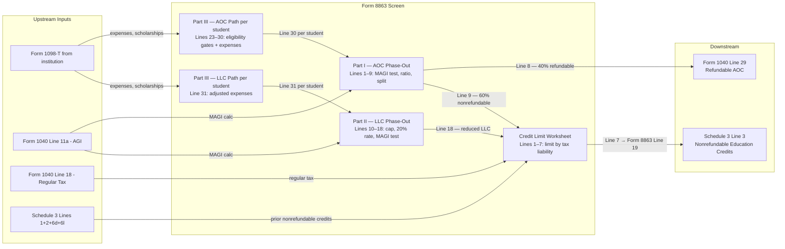

# Form 8863 — Education Credits (American Opportunity and Lifetime Learning Credits)

## Overview

This screen captures all data required to compute the **American Opportunity
Credit (AOC)** and **Lifetime Learning Credit (LLC)** under IRC §25A. These are
tax credits based on qualified tuition and education expenses paid for eligible
students (the filer, spouse, or dependents) at accredited postsecondary
institutions.

- The **AOC** is worth up to **$2,500 per eligible student**, of which 40% may
  be refundable. It is limited to 4 tax years per student and requires at least
  half-time enrollment in a degree program.
- The **LLC** is worth up to **$2,000 per return** (not per student), is
  nonrefundable, and is available for any postsecondary enrollment including
  single courses and job-skills training.

Both credits are phased out by MAGI. Only one credit may be claimed per student
per year; both may appear on the same return for different students.

**Form 8863 feeds two downstream destinations:**

- Refundable AOC → **Form 1040, Line 29**
- Nonrefundable credits (AOC nonrefundable portion + LLC) → **Schedule 3, Line
  3** (via Credit Limit Worksheet)

**IRS Form:** 8863 **Drake Screen:** 8863 (also alias: "8863 > 'Additional Educ.
Inst.' tab") **Tax Year:** 2025 **Drake Reference:**
https://kb.drakesoftware.com/kb/Drake-Tax/12153.htm

---

## Data Entry Fields

Required fields first, then optional. These are the data-entry fields only —
computed lines are documented in Calculation Logic.

A **separate Part III must be completed for each student**. Parts I and II are
completed once per return after all Part IIIs are done.

### Part III — Per-Student Data Entry (one set per eligible student)

| Field                            | Type                | Required    | Drake Label                                                                                             | Description                                                                                                                                                                                                                                                                      | IRS Reference                                                         | URL                                       |
| -------------------------------- | ------------------- | ----------- | ------------------------------------------------------------------------------------------------------- | -------------------------------------------------------------------------------------------------------------------------------------------------------------------------------------------------------------------------------------------------------------------------------- | --------------------------------------------------------------------- | ----------------------------------------- |
| `student_name`                   | string              | yes         | "Student name"                                                                                          | Full name of the student as shown on page 1 of the return                                                                                                                                                                                                                        | Form 8863 (2025), Part III, Line 20                                   | https://www.irs.gov/pub/irs-pdf/f8863.pdf |
| `student_ssn`                    | string (SSN/TIN)    | yes         | "Student SSN"                                                                                           | Student's SSN or other TIN (ITIN/ATIN) as shown on page 1 of the return. Must be issued by return due date (incl. extensions)                                                                                                                                                    | Form 8863 (2025), Part III, Line 21; i8863 (2025), Line 21            | https://www.irs.gov/pub/irs-pdf/i8863.pdf |
| `institution_a_name`             | string              | yes         | "Name of first educational institution"                                                                 | Full name of the institution where qualified expenses were paid                                                                                                                                                                                                                  | Form 8863 (2025), Part III, Line 22(a)                                | https://www.irs.gov/pub/irs-pdf/f8863.pdf |
| `institution_a_address`          | string              | yes         | "Address" (column a)                                                                                    | Street address, city, state, ZIP of first institution. Foreign address: do not abbreviate country name, follow country's postal convention                                                                                                                                       | Form 8863 (2025), Part III, Line 22(a)(1); i8863 (2025), Line 22      | https://www.irs.gov/pub/irs-pdf/i8863.pdf |
| `institution_a_1098t_received`   | boolean             | yes         | "Did student receive Form 1098-T from this institution for 2025?"                                       | Whether institution issued Form 1098-T for 2025 to the student                                                                                                                                                                                                                   | Form 8863 (2025), Part III, Line 22(a)(2)                             | https://www.irs.gov/pub/irs-pdf/f8863.pdf |
| `institution_a_1098t_box7_prior` | boolean             | yes         | "Did student receive Form 1098-T from this institution for 2024 with box 7 checked?"                    | Whether 2024 Form 1098-T had box 7 checked (indicates institution billed for courses beginning in first 3 months of the following year)                                                                                                                                          | Form 8863 (2025), Part III, Line 22(a)(3)                             | https://www.irs.gov/pub/irs-pdf/f8863.pdf |
| `institution_a_ein`              | string (XX-XXXXXXX) | conditional | "Enter the institution's EIN"                                                                           | **Required if claiming AOC for this student** OR if either 1098-T box was checked "Yes". Source: Form 1098-T or institution directly                                                                                                                                             | Form 8863 (2025), Part III, Line 22(a)(4); i8863 (2025), Reminder p.1 | https://www.irs.gov/pub/irs-pdf/i8863.pdf |
| `institution_b_name`             | string              | no          | "Name of second educational institution (if any)"                                                       | If student attended a second institution, full name                                                                                                                                                                                                                              | Form 8863 (2025), Part III, Line 22(b)                                | https://www.irs.gov/pub/irs-pdf/f8863.pdf |
| `institution_b_address`          | string              | no          | "Address" (column b)                                                                                    | Address of second institution                                                                                                                                                                                                                                                    | Form 8863 (2025), Part III, Line 22(b)(1)                             | https://www.irs.gov/pub/irs-pdf/f8863.pdf |
| `institution_b_1098t_received`   | boolean             | no          | "Did student receive Form 1098-T from this institution for 2025?"                                       | Whether second institution issued 1098-T                                                                                                                                                                                                                                         | Form 8863 (2025), Part III, Line 22(b)(2)                             | https://www.irs.gov/pub/irs-pdf/f8863.pdf |
| `institution_b_1098t_box7_prior` | boolean             | no          | "Did student receive Form 1098-T from this institution for 2024 with box 7 checked?"                    | Whether 2024 1098-T from second institution had box 7 checked                                                                                                                                                                                                                    | Form 8863 (2025), Part III, Line 22(b)(3)                             | https://www.irs.gov/pub/irs-pdf/f8863.pdf |
| `institution_b_ein`              | string (XX-XXXXXXX) | conditional | "Enter the institution's EIN" (column b)                                                                | Required if claiming AOC for this student at second institution OR if 1098-T checkboxes are Yes                                                                                                                                                                                  | Form 8863 (2025), Part III, Line 22(b)(4)                             | https://www.irs.gov/pub/irs-pdf/f8863.pdf |
| `aoc_claimed_4_prior_years`      | boolean             | yes         | "Has AOC been claimed for this student for any 4 prior tax years?"                                      | Line 23: "Yes" → student ineligible for AOC this year; skip to Line 31 (LLC only). "No" → continue to Line 24                                                                                                                                                                    | Form 8863 (2025), Part III, Line 23; i8863 (2025), Line 23 p.8        | https://www.irs.gov/pub/irs-pdf/i8863.pdf |
| `enrolled_half_time`             | boolean             | conditional | "Was student enrolled at least half-time for at least one academic period in 2025 in a degree program?" | Line 24: Required for AOC eligibility. "Yes" → go to Line 25. "No" → student ineligible for AOC; skip to Line 31                                                                                                                                                                 | Form 8863 (2025), Part III, Line 24; i8863 (2025), Line 24 p.8        | https://www.irs.gov/pub/irs-pdf/i8863.pdf |
| `completed_4_years_postsec`      | boolean             | conditional | "Did student complete the first 4 years of postsecondary education before 2025?"                        | Line 25: "Yes" → ineligible for AOC; skip to Line 31. "No" → go to Line 26. Institution determines year count; academic credit from proficiency exams excluded from count                                                                                                        | Form 8863 (2025), Part III, Line 25; i8863 (2025), Line 25 p.9        | https://www.irs.gov/pub/irs-pdf/i8863.pdf |
| `felony_drug_conviction`         | boolean             | conditional | "Was student convicted of a felony for possession or distribution of a controlled substance?"           | Line 26: "Yes" → ineligible for AOC; skip to Line 31. "No" → eligible for AOC; complete Lines 27–30. Conviction must be federal or state, entered before end of 2025                                                                                                             | Form 8863 (2025), Part III, Line 26; i8863 (2025), Line 26 p.9        | https://www.irs.gov/pub/irs-pdf/i8863.pdf |
| `aoc_adjusted_expenses`          | number (dollars)    | conditional | "Adjusted qualified education expenses" (Line 27)                                                       | AOC-eligible expenses for this student, after reducing by tax-free assistance and refunds. **Cap: do not enter more than $4,000**. Complete Adjusted QEE Worksheet first. Required only if claiming AOC for this student (Lines 23–26 all passed)                                | Form 8863 (2025), Part III, Line 27; i8863 (2025), Line 27 p.9        | https://www.irs.gov/pub/irs-pdf/i8863.pdf |
| `llc_adjusted_expenses`          | number (dollars)    | conditional | "Adjusted qualified education expenses" (Line 31)                                                       | LLC-eligible expenses for this student, after reducing by tax-free assistance and refunds. No per-student cap at this entry point (cap applied at return level: $10,000 across all students). Required only if claiming LLC for this student (not claiming AOC for same student) | Form 8863 (2025), Part III, Line 31; i8863 (2025), Line 31 p.9        | https://www.irs.gov/pub/irs-pdf/i8863.pdf |

### Additional Institution Data (per student)

If a student attended **more than 2 institutions**, attach an additional copy of
page 2 completed only through Line 22.

### Per-Return Data Entry (Parts I and II — completed once, after all Part IIIs)

| Field                                 | Type             | Required    | Drake Label                   | Description                                                                                                                                                                                                                                                               | IRS Reference                                                                             | URL                                       |
| ------------------------------------- | ---------------- | ----------- | ----------------------------- | ------------------------------------------------------------------------------------------------------------------------------------------------------------------------------------------------------------------------------------------------------------------------- | ----------------------------------------------------------------------------------------- | ----------------------------------------- |
| `filer_magi`                          | number (dollars) | yes         | "Enter MAGI" (Lines 3 and 14) | Filer's Modified Adjusted Gross Income. Generally = Form 1040 Line 11a (AGI). Add back: foreign earned income exclusion, foreign housing exclusion/deduction, Puerto Rico income exclusion, American Samoa income exclusion (Form 4563 Line 15). See MAGI Worksheet below | Form 8863 (2025), Lines 3 and 14; i8863 (2025), Lines 3, 14 p.7; p970 Worksheets 2-1, 3-1 | https://www.irs.gov/pub/irs-pdf/i8863.pdf |
| `taxpayer_under_24_no_refundable_aoc` | boolean          | conditional | Checkbox near Line 7          | Check if: taxpayer was under 24 at end of 2025 AND (under 18, OR age 18 with earned income < half support, OR age 18–23 full-time student with earned income < half support) AND at least one parent alive AND not filing MFJ. If checked, entire AOC is nonrefundable    | Form 8863 (2025), Line 7 checkbox; i8863 (2025), Line 7 pp.6–7                            | https://www.irs.gov/pub/irs-pdf/i8863.pdf |

---

## Per-Field Routing

| Field                                                           | Destination                                           | How Used                                                                                                                                                                      | Triggers                                                                                    | Limit / Cap                                                        | IRS Reference                                        | URL                                         |
| --------------------------------------------------------------- | ----------------------------------------------------- | ----------------------------------------------------------------------------------------------------------------------------------------------------------------------------- | ------------------------------------------------------------------------------------------- | ------------------------------------------------------------------ | ---------------------------------------------------- | ------------------------------------------- |
| `student_name`                                                  | Form 8863 Part III (identity)                         | Identifies the student for eligibility determination                                                                                                                          | —                                                                                           | —                                                                  | Form 8863 Line 20                                    | https://www.irs.gov/pub/irs-pdf/f8863.pdf   |
| `student_ssn`                                                   | Form 8863 Part III (identity); IRS e-file validation  | Matched against IRS TIN database to confirm student TIN is valid and issued by return due date                                                                                | Student must have TIN by due date (incl. extensions)                                        | —                                                                  | Form 8863 Line 21; i8863 p.1                         | https://www.irs.gov/pub/irs-pdf/i8863.pdf   |
| `institution_a_ein` / `institution_b_ein`                       | Form 8863 Line 22(a)(4)/(b)(4); IRS e-file validation | Required for AOC claim; validated against IRS records                                                                                                                         | AOC claim → EIN mandatory                                                                   | —                                                                  | i8863 pp.1, 8                                        | https://www.irs.gov/pub/irs-pdf/i8863.pdf   |
| `institution_a_1098t_received` / `institution_b_1098t_received` | Form 8863 Line 22(a)(2)/(b)(2)                        | If "No", taxpayer must satisfy alternate substantiation rules                                                                                                                 | If "No" → taxpayer must demonstrate enrollment and substantiate payment                     | —                                                                  | i8863 pp.1–2                                         | https://www.irs.gov/pub/irs-pdf/i8863.pdf   |
| `aoc_claimed_4_prior_years`                                     | Eligibility gate (Line 23)                            | "Yes" → skip Lines 24–30, go directly to Line 31 (LLC only allowed)                                                                                                           | Routes AOC-ineligible student directly to LLC path                                          | —                                                                  | Form 8863 Line 23; i8863 p.8                         | https://www.irs.gov/pub/irs-pdf/i8863.pdf   |
| `enrolled_half_time`                                            | Eligibility gate (Line 24)                            | "No" → skip Lines 25–30, go to Line 31 (LLC path)                                                                                                                             | At-less-than-half-time students ineligible for AOC                                          | —                                                                  | Form 8863 Line 24; i8863 p.8                         | https://www.irs.gov/pub/irs-pdf/i8863.pdf   |
| `completed_4_years_postsec`                                     | Eligibility gate (Line 25)                            | "Yes" → skip Lines 26–30, go to Line 31 (LLC path)                                                                                                                            | Students who completed 4 years ineligible for AOC                                           | —                                                                  | Form 8863 Line 25; i8863 p.9                         | https://www.irs.gov/pub/irs-pdf/i8863.pdf   |
| `felony_drug_conviction`                                        | Eligibility gate (Line 26)                            | "Yes" → skip Lines 27–30, go to Line 31 (LLC path; felony does NOT disqualify LLC)                                                                                            | Felony conviction disqualifies AOC only                                                     | —                                                                  | Form 8863 Line 26; i8863 p.9                         | https://www.irs.gov/pub/irs-pdf/i8863.pdf   |
| `aoc_adjusted_expenses`                                         | Form 8863 Part III Lines 27–30 → Part I Line 1        | 100% of first $2,000 + 25% of next $2,000. Line 27 → Line 28 (subtract $2,000) → Line 29 (×25%) → Line 30 (per-student tentative credit). Summed across all students → Line 1 | Only if all AOC eligibility gates pass (Lines 23–26 = No/No/No/No)                          | Entry cap: $4,000 max at Line 27                                   | Form 8863 Lines 27–30; i8863 Lines 27–30 p.9         | https://www.irs.gov/pub/irs-pdf/i8863.pdf   |
| `llc_adjusted_expenses`                                         | Form 8863 Part III Line 31 → Part II Line 10          | Summed across all students. Return-level cap: lesser of total or $10,000. 20% rate applied to capped amount                                                                   | LLC path (all cases where AOC not claimed for this student)                                 | No per-student cap at entry; $10,000 cap at return level (Line 11) | Form 8863 Lines 31, 10–11; i8863 Lines 31, 10 p.7, 9 | https://www.irs.gov/pub/irs-pdf/i8863.pdf   |
| `filer_magi`                                                    | Form 8863 Lines 3 and 14                              | Used to compute phase-out ratio for both AOC (Lines 2–7) and LLC (Lines 13–18). If MAGI ≥ ceiling → credit = $0                                                               | Phase-out and credit elimination                                                            | AOC ceiling: $90,000 single / $180,000 MFJ; LLC same ceilings      | Form 8863 Lines 2–7, 13–18; i8863 pp.7, 3            | https://www.irs.gov/pub/irs-pdf/i8863.pdf   |
| Form 8863 Line 8 (Refundable AOC)                               | **Form 1040, Line 29**                                | Entered directly on Form 1040 as refundable credit                                                                                                                            | —                                                                                           | Max $1,000 per student (40% of max $2,500)                         | Form 8863 (2025) Line 8; Form 1040 (2025) Line 29    | https://www.irs.gov/pub/irs-pdf/f1040.pdf   |
| Form 8863 Line 19 (Nonrefundable credits)                       | **Schedule 3, Line 3**                                | Entered on Schedule 3; adds to total nonrefundable credits (Schedule 3 Line 8 → Form 1040 Line 20)                                                                            | Limited to tax liability minus certain prior nonrefundable credits (Credit Limit Worksheet) | Cannot exceed net tax liability                                    | Form 8863 (2025) Line 19; Schedule 3 (2025) Line 3   | https://www.irs.gov/pub/irs-pdf/f1040s3.pdf |

---

## Calculation Logic

### Overview of Flow

Each student has a separate Part III. After all Part IIIs are complete, Parts I
and II are completed.

```
For each student:
  → Determine AOC eligibility (Lines 23–26 gates)
  → If AOC eligible: compute per-student AOC tentative credit (Lines 27–30)
  → If AOC ineligible or taxpayer chooses LLC: capture LLC expenses (Line 31)

Per return:
  → Sum all Line 30 values → Line 1 (total tentative AOC)
  → Apply AOC MAGI phase-out → Lines 2–7
  → Split refundable (Line 8 → Form 1040 Line 29) vs nonrefundable (Line 9)
  → Sum all Line 31 values → Line 10 (total LLC expenses)
  → Apply $10,000 cap → Line 11
  → Apply 20% rate → Line 12
  → Apply LLC MAGI phase-out → Lines 13–18
  → Apply Credit Limit Worksheet → Line 19 → Schedule 3 Line 3
```

---

### Step 1 — Adjusted Qualified Education Expenses Worksheet (per student, per academic period)

Complete separately for each student, for each academic period.

**Qualified education expenses (QEE):**

- **AOC:** Tuition + required enrollment fees + course materials (books,
  supplies, equipment needed for a course of study, whether or not purchased
  from the institution)
- **LLC:** Tuition + required enrollment fees + books/supplies/equipment **only
  if required to be paid to the institution as a condition of
  enrollment/attendance**

**Does NOT qualify (both credits):** Room and board, insurance, medical expenses
(including student health fees), transportation, personal/family living
expenses, sports/games/hobbies courses unless part of degree program.

**Adjustments — subtract from QEE:**

1. Tax-free scholarships/fellowship grants allocated to QEE for the period
   (including Pell grants; unless student includes in gross income, in which
   case do not reduce)
2. Tax-free employer-provided educational assistance
3. Veterans' educational assistance
4. Any other tax-free educational assistance (not gifts or inheritances)
5. Refunds of QEE received in 2025 or received after 2025 but before return is
   filed

**Formula:**

```
Adjusted QEE = Total QEE paid in 2025 for the period
             − Tax-free assistance received in 2025 for the period
             − Tax-free assistance received in 2026 before return filed for the period
             − Refunds received in 2025 or in 2026 before return filed
```

Result: enter on Line 27 (AOC, max $4,000) or Line 31 (LLC, no cap here).

> **Source:** Form 8863 (2025), Adjusted Qualified Education Expenses Worksheet,
> p.2; i8863 (2025), Adjusted Qualified Education Expenses section, pp.4–6; p970
> (2025), ch.2–3 — https://www.irs.gov/pub/irs-pdf/i8863.pdf

---

### Step 2 — Per-Student AOC Tentative Credit (Part III Lines 27–30)

**Only perform if all four AOC eligibility conditions are met** (Lines 23, 24,
25, 26 all answered No):

```
Line 27: Adjusted QEE (from Step 1), maximum entry: $4,000
Line 28: max(Line 27 − $2,000, 0)
Line 29: Line 28 × 0.25
Line 30: if Line 28 = 0: Line 27
         if Line 28 > 0: $2,000 + Line 29
```

**Examples:**

- QEE = $4,000: Line 27=$4,000, Line 28=$2,000, Line 29=$500, Line 30=$2,500 ✓
- QEE = $2,500: Line 27=$2,500, Line 28=$500, Line 29=$125, Line 30=$2,125
- QEE = $1,500: Line 27=$1,500, Line 28=$0, Line 29=$0, Line 30=$1,500

> **Source:** Form 8863 (2025), Part III, Lines 27–30; i8863 (2025), Lines
> 27–30, p.9 — https://www.irs.gov/pub/irs-pdf/i8863.pdf

---

### Step 3 — AOC Phase-Out (Part I Lines 1–7)

```
Line 1:  Sum of all Part III Line 30 values (across all AOC students)

Line 2:  MAGI ceiling:
         - MFJ: $180,000
         - All others (Single, HOH, QSS): $90,000

Line 3:  Filer MAGI = Form 1040 Line 11a (AGI)
         + Form 2555 Line 45 (foreign earned income exclusion + housing exclusion), if applicable
         + Form 2555 Line 50 (foreign housing deduction), if applicable
         + Puerto Rico income excluded, if applicable
         + Form 4563 Line 15 (American Samoa income excluded), if applicable

Line 4:  Line 2 − Line 3
         If Line 4 ≤ 0: STOP. No education credit allowed.

Line 5:  Phase-out range:
         - MFJ: $20,000
         - All others: $10,000

Line 6:  Phase-out fraction = min(Line 4 ÷ Line 5, 1.000), rounded to 3 decimal places

Line 7:  Reduced tentative AOC = Line 1 × Line 6
```

> **Source:** Form 8863 (2025), Part I, Lines 1–7; i8863 (2025), Lines 3, 7,
> pp.6–7; p970 (2025), Phaseout example p.20 —
> https://www.irs.gov/pub/irs-pdf/i8863.pdf

---

### Step 4 — Refundable vs. Nonrefundable AOC Split (Part I Lines 7–9)

**Determine if taxpayer qualifies for refundable AOC.** The refundable portion
is DENIED if ALL of the following apply:

1. Taxpayer was under age 24 at end of 2025, AND
2. One of the following:
   - (a) Under age 18 at end of 2025, OR
   - (b) Age 18 at end of 2025 AND earned income < half of support, OR
   - (c) Age 19–23 at end of 2025 AND full-time student AND earned income < half
     of support
3. At least one parent was alive at end of 2025
4. Taxpayer is NOT filing a joint return

**If refundable AOC is denied:**

- Check the box on Line 7
- Skip Line 8
- Enter Line 7 amount on Line 9 (treat entire credit as nonrefundable)

**If refundable AOC is allowed:**

```
Line 8: Refundable AOC = Line 7 × 0.40
         → Enter on Form 1040, Line 29

Line 9: Nonrefundable AOC portion = Line 7 − Line 8
         → Enters Credit Limit Worksheet, Line 2
```

> **Source:** Form 8863 (2025), Lines 7–9; i8863 (2025), Lines 7–9, pp.6–7; p970
> (2025), Refundable Part of Credit, pp.20–21 —
> https://www.irs.gov/pub/irs-pdf/i8863.pdf

---

### Step 5 — LLC Tentative Credit (Part II Lines 10–12)

```
Line 10: Sum of all Part III Line 31 values (across all LLC students)
         (If Line 10 = 0: skip Lines 11–17, enter $0 on Line 18, go to Line 19)

Line 11: min(Line 10, $10,000)   ← per-return cap on LLC expenses

Line 12: Line 11 × 0.20         ← 20% rate; max = $2,000
```

> **Source:** Form 8863 (2025), Part II, Lines 10–12; i8863 (2025), Lines 10–12,
> p.7; p970 (2025), Figuring the Credit p.29 —
> https://www.irs.gov/pub/irs-pdf/i8863.pdf

---

### Step 6 — LLC Phase-Out (Part II Lines 13–18)

Uses the **same MAGI thresholds** as the AOC phase-out:

```
Line 13: MAGI ceiling:
         - MFJ: $180,000
         - All others: $90,000

Line 14: Filer MAGI (same computation as Line 3 above)

Line 15: Line 13 − Line 14
         If Line 15 ≤ 0: enter $0 on Line 18, go to Line 19.

Line 16: Phase-out range:
         - MFJ: $20,000
         - All others: $10,000

Line 17: Phase-out fraction = min(Line 15 ÷ Line 16, 1.000), rounded to 3 decimal places

Line 18: Reduced LLC = Line 12 × Line 17
         → Enters Credit Limit Worksheet, Line 1
```

> **Source:** Form 8863 (2025), Part II, Lines 13–18; i8863 (2025), Lines 14,
> 18, p.7; p970 (2025), LLC Phaseout example p.29 —
> https://www.irs.gov/pub/irs-pdf/i8863.pdf

---

### Step 7 — Credit Limit Worksheet

This worksheet limits nonrefundable education credits to the taxpayer's
remaining tax liability after prior nonrefundable credits. It is described in
the Form 8863 instructions but computed separately.

```
CLW Line 1: Form 8863 Line 18 (reduced LLC)
CLW Line 2: Form 8863 Line 9 (nonrefundable AOC portion)
CLW Line 3: CLW Line 1 + CLW Line 2  (total potential nonrefundable education credits)

CLW Line 4: Form 1040 Line 18 (regular tax)
CLW Line 5: Schedule 3 Lines 1 + 2 + 6d + 6l  (prior nonrefundable credits)
CLW Line 6: CLW Line 4 − CLW Line 5            (remaining tax liability)

CLW Line 7: min(CLW Line 3, CLW Line 6)
            → This is the nonrefundable education credit
            → Enter on Form 8863 Line 19 → Schedule 3 Line 3
```

> **Source:** i8863 (2025), Credit Limit Worksheet, p.7 —
> https://www.irs.gov/pub/irs-pdf/i8863.pdf

---

### Step 8 — Final Output Routing

```
Refundable AOC:     Form 8863 Line 8  → Form 1040 Line 29
Nonrefundable:      Form 8863 Line 19 → Schedule 3 Line 3
```

Schedule 3 Line 3 flows to Schedule 3 Line 8 (total nonrefundable credits),
which flows to Form 1040 Line 20 (total nonrefundable credits from Schedule 3).

> **Source:** Form 8863 (2025), Lines 8, 19; Form 1040 (2025), Line 29; Schedule
> 3 (2025), Lines 3, 8; Form 1040 (2025), Line 20 —
> https://www.irs.gov/pub/irs-pdf/f1040.pdf |
> https://www.irs.gov/pub/irs-pdf/f1040s3.pdf

---

## Constants & Thresholds (Tax Year 2025)

These thresholds are **statutory** under IRC §25A(d) — they are **not**
inflation-adjusted and therefore do not appear in Rev. Proc. 2024-40. Confirmed
as unchanged from TY2024.

| Constant                                                  | Value                   | Source                                                       | URL                                       |
| --------------------------------------------------------- | ----------------------- | ------------------------------------------------------------ | ----------------------------------------- |
| AOC max credit per student                                | $2,500                  | IRC §25A(b)(1); Form 8863 (2025) Instructions p.2; Table 1   | https://www.irs.gov/pub/irs-pdf/i8863.pdf |
| AOC expense rate — first $2,000                           | 100%                    | IRC §25A(b)(1)(A); Form 8863 (2025) Lines 27–30; p970 p.19   | https://www.irs.gov/pub/irs-pdf/p970.pdf  |
| AOC expense rate — next $2,000                            | 25%                     | IRC §25A(b)(1)(B); Form 8863 (2025) Line 29; p970 p.19       | https://www.irs.gov/pub/irs-pdf/p970.pdf  |
| AOC per-student expense cap (data entry)                  | $4,000                  | Form 8863 (2025) Line 27 instruction; i8863 p.9              | https://www.irs.gov/pub/irs-pdf/i8863.pdf |
| AOC refundable percentage                                 | 40%                     | IRC §25A(i)(1); Form 8863 (2025) Line 8                      | https://www.irs.gov/pub/irs-pdf/f8863.pdf |
| AOC nonrefundable percentage                              | 60%                     | IRC §25A(i)(1); Form 8863 (2025) Line 9 = Line 7 − Line 8    | https://www.irs.gov/pub/irs-pdf/f8863.pdf |
| AOC MAGI phase-out lower bound (Single/HOH/QSS)           | $80,000                 | IRC §25A(d)(2); i8863 p.2; p970 p.20                         | https://www.irs.gov/pub/irs-pdf/p970.pdf  |
| AOC MAGI phase-out upper bound / ceiling (Single/HOH/QSS) | $90,000                 | IRC §25A(d)(2); Form 8863 (2025) Line 2; i8863 p.2           | https://www.irs.gov/pub/irs-pdf/i8863.pdf |
| AOC MAGI phase-out lower bound (MFJ)                      | $160,000                | IRC §25A(d)(2); i8863 p.2; p970 p.20                         | https://www.irs.gov/pub/irs-pdf/p970.pdf  |
| AOC MAGI phase-out upper bound / ceiling (MFJ)            | $180,000                | IRC §25A(d)(2); Form 8863 (2025) Line 2; i8863 p.2           | https://www.irs.gov/pub/irs-pdf/i8863.pdf |
| AOC phase-out range (Single/HOH/QSS)                      | $10,000                 | Form 8863 (2025) Line 5                                      | https://www.irs.gov/pub/irs-pdf/f8863.pdf |
| AOC phase-out range (MFJ)                                 | $20,000                 | Form 8863 (2025) Line 5                                      | https://www.irs.gov/pub/irs-pdf/f8863.pdf |
| LLC max credit per return                                 | $2,000                  | IRC §25A(c)(1); Form 8863 (2025) Instructions p.3; p970 p.29 | https://www.irs.gov/pub/irs-pdf/p970.pdf  |
| LLC expense cap per return                                | $10,000                 | IRC §25A(c)(1); Form 8863 (2025) Line 11                     | https://www.irs.gov/pub/irs-pdf/f8863.pdf |
| LLC rate                                                  | 20%                     | IRC §25A(c)(1); Form 8863 (2025) Line 12                     | https://www.irs.gov/pub/irs-pdf/f8863.pdf |
| LLC MAGI phase-out lower bound (Single/HOH/QSS)           | $80,000                 | IRC §25A(d)(2); i8863 p.3; p970 p.29                         | https://www.irs.gov/pub/irs-pdf/p970.pdf  |
| LLC MAGI phase-out upper bound / ceiling (Single/HOH/QSS) | $90,000                 | IRC §25A(d)(2); Form 8863 (2025) Line 13; i8863 p.3          | https://www.irs.gov/pub/irs-pdf/i8863.pdf |
| LLC MAGI phase-out lower bound (MFJ)                      | $160,000                | IRC §25A(d)(2); i8863 p.3; p970 p.29                         | https://www.irs.gov/pub/irs-pdf/p970.pdf  |
| LLC MAGI phase-out upper bound / ceiling (MFJ)            | $180,000                | IRC §25A(d)(2); Form 8863 (2025) Line 13                     | https://www.irs.gov/pub/irs-pdf/i8863.pdf |
| LLC phase-out range (Single/HOH/QSS)                      | $10,000                 | Form 8863 (2025) Line 16                                     | https://www.irs.gov/pub/irs-pdf/f8863.pdf |
| LLC phase-out range (MFJ)                                 | $20,000                 | Form 8863 (2025) Line 16                                     | https://www.irs.gov/pub/irs-pdf/f8863.pdf |
| AOC maximum years per student                             | 4 tax years             | IRC §25A(b)(2)(A); Form 8863 Line 23; i8863 p.8              | https://www.irs.gov/pub/irs-pdf/i8863.pdf |
| LLC maximum years per student                             | Unlimited               | IRC §25A(c); i8863 p.3                                       | https://www.irs.gov/pub/irs-pdf/i8863.pdf |
| "Kiddie rule" age threshold for nonrefundable-only AOC    | Under 24 at end of 2025 | IRC §25A(i)(2); i8863 Line 7 pp.6–7                          | https://www.irs.gov/pub/irs-pdf/i8863.pdf |

---

## Data Flow Diagram



**Conditional routing notes:**

- If MAGI ≥ $90,000 (single) or $180,000 (MFJ) → no credit (Form 8863 Line 4 ≤ 0
  → stop)
- If "kiddie rule" applies → entire AOC becomes nonrefundable (Line 8 = $0; Line
  9 = Line 7)
- If AOC claimed for a student → Line 31 must be $0 for that student (cannot
  claim both for same student)
- If AOC ineligible for a student (Lines 23–26 gates fail) → only Line 31 (LLC)
  may be used for that student

---

## Edge Cases & Special Rules

### 1. Married Filing Separately — Both Credits Disallowed

Taxpayers with filing status MFS cannot claim either the AOC or the LLC. The
engine must check filing status before allowing Form 8863.

> **Source:** i8863 (2025), Who cannot claim a credit, item 2, p.2; p970 (2025),
> Who Can't Claim the Credit (ch.2 p.11, ch.3 p.22) —
> https://www.irs.gov/pub/irs-pdf/i8863.pdf

---

### 2. Nonresident Alien — Both Credits Disallowed

If the taxpayer or spouse was a nonresident alien for any part of 2025 and did
not elect to be treated as a resident alien, neither credit may be claimed.

> **Source:** i8863 (2025), Who cannot claim a credit, item 3, p.2; p970 ch.2
> p.11, ch.3 p.22 — https://www.irs.gov/pub/irs-pdf/i8863.pdf

---

### 3. Taxpayer Claimed as Dependent — Both Credits Disallowed

If the filer is themselves claimed as a dependent on another person's return,
they cannot claim either credit.

> **Source:** i8863 (2025), Who cannot claim a credit, item 1, p.2; p970 ch.2
> p.11, ch.3 p.22 — https://www.irs.gov/pub/irs-pdf/i8863.pdf

---

### 4. AOC — Maximum 4 Tax Years Per Student

The AOC may only be claimed for a given student for 4 tax years total (not
necessarily consecutive). Count all prior tax years when the credit was claimed
for this student by anyone (the filer, or any other person). If already claimed
4 times → not eligible for AOC for this student. If claimed 3 or fewer times →
still eligible.

The engine must track prior AOC claims per student. Drake asks this as Line 23
(Yes/No).

> **Source:** i8863 (2025), Line 23, p.8; Examples 1–2 p.8; p970 ch.2 p.10 —
> https://www.irs.gov/pub/irs-pdf/i8863.pdf

---

### 5. AOC — "First 4 Years" Rule (Completed Postsecondary Education)

The AOC requires the student to NOT have completed the first 4 years of
postsecondary education (freshman–senior) as determined by the institution
before the beginning of 2025. Academic credit awarded solely for performance on
proficiency examinations (e.g., AP exams, CLEP) does not count toward the 4
years.

> **Source:** i8863 (2025), Line 25, p.9; p970 ch.2 pp.10, 17 —
> https://www.irs.gov/pub/irs-pdf/i8863.pdf

---

### 6. AOC — Half-Time Enrollment Required

For AOC, the student must have been enrolled at least half-time for at least one
academic period beginning in 2025 (or in the first 3 months of 2026 if expenses
were paid in 2025) in a program leading to a degree, certificate, or other
recognized credential. "Half-time" is defined by the institution; minimum
standard set by U.S. Dept. of Education.

LLC does NOT require half-time enrollment — any enrollment in one or more
courses qualifies.

> **Source:** i8863 (2025), Line 24, p.8; p970 ch.2 pp.10, 17 —
> https://www.irs.gov/pub/irs-pdf/i8863.pdf

---

### 7. Felony Drug Conviction — AOC Only

A student convicted of a federal or state felony for possession or distribution
of a controlled substance before the end of 2025 is ineligible for the AOC. The
LLC is not affected by a felony drug conviction.

> **Source:** i8863 (2025), Line 26, p.9; Table 1, p.2; p970 ch.2 p.10 —
> https://www.irs.gov/pub/irs-pdf/i8863.pdf

---

### 8. TIN Requirement — Return Due Date Deadline

Both the filer and each student must have a TIN (SSN, ITIN, or ATIN) issued by
the due date of the 2025 return (including extensions). If no TIN is issued by
that date, the credit cannot be claimed on either the original or amended return
— even if a TIN is later issued.

Exception: If an ATIN or ITIN is applied for on or before the due date AND the
IRS issues it as a result of that application, the IRS treats it as issued on or
before the due date.

> **Source:** i8863 (2025), Reminders p.1; p970 ch.2 p.11 —
> https://www.irs.gov/pub/irs-pdf/i8863.pdf

---

### 9. "Kiddie Rule" — AOC Fully Nonrefundable for Certain Young Filers

The refundable 40% portion of the AOC is denied to a taxpayer who, at end of
2025:

- Was under age 24, AND
- Was under 18 OR (age 18 with earned income < half support) OR (age 19–23,
  full-time student, earned income < half support), AND
- Had at least one living parent, AND
- Is not filing a joint return

"Earned income" = wages, salaries, professional fees, other payments for
personal services. Does NOT include passive income or corporate distributions.
"Support" = food, shelter, clothing, medical, education, etc. (FMV for
property/lodging). "Full-time student" = enrolled full-time at eligible
institution for any part of 5 calendar months in 2025.

When this rule applies: skip Line 8, put Line 7 amount directly on Line 9
(entire credit is nonrefundable).

> **Source:** i8863 (2025), Line 7, pp.6–7; p970 (2025), Refundable Part of
> Credit, pp.20–21 — https://www.irs.gov/pub/irs-pdf/i8863.pdf

---

### 10. AOC Disallowance for Fraud or Recklessness

If the AOC was previously denied due to a final determination of
reckless/intentional disregard of rules: banned for 2 years. If due to fraud:
banned for 10 years. Form 8862 must be attached on the first return after a
disallowance period.

> **Source:** i8863 (2025), Reminders p.1; Form 8862 instructions —
> https://www.irs.gov/pub/irs-pdf/i8863.pdf

---

### 11. Multiple Students — Per-Student vs. Per-Return Rules

- **AOC**: computed per student (up to $2,500 per student). Sum all Part III
  Line 30 values → Line 1.
- **LLC**: computed per return (max $2,000 per return regardless of number of
  students). Sum all Part III Line 31 values → Line 10, then cap at $10,000 at
  Line 11.
- **Both may appear on same return** for different students (e.g., AOC for one
  student, LLC for another).
- **Cannot claim both for the same student** in the same year.

> **Source:** i8863 (2025), Table 1 p.2; Lines 1, 10, p.6–7; p970 ch.2 p.11,
> ch.3 p.22 — https://www.irs.gov/pub/irs-pdf/i8863.pdf

---

### 12. Multiple Institutions per Student

If a student attended up to 2 institutions, enter both in column (a) and (b) of
Line 22. If more than 2, attach additional copies of page 2 completed only
through Line 22. Expenses from all institutions for the same student are
combined for the credit computation.

> **Source:** i8863 (2025), Line 22 p.8 —
> https://www.irs.gov/pub/irs-pdf/i8863.pdf

---

### 13. Prepaid Expenses (First 3 Months of 2026)

Qualified education expenses paid in 2025 for an academic period beginning in
January, February, or March 2026 may be included in 2025 expenses. Expenses paid
in 2024 or for periods beginning April 2026 or later cannot be used.

> **Source:** i8863 (2025), Prepaid Expenses, p.4; p970 ch.2 p.12 —
> https://www.irs.gov/pub/irs-pdf/i8863.pdf

---

### 14. Scholarship Inclusion Strategy (Pell Grant Optimization)

Normally, tax-free scholarships reduce adjusted QEE. However, if a scholarship
can by its terms be used for nonqualified expenses (such as room and board), the
student may choose to include some or all of the scholarship in gross income.
Amounts included in income are treated as paying nonqualified expenses, thereby
increasing adjusted QEE and potentially increasing the credit.

**When to consider this strategy:** When (QEE − total scholarships) < $4,000 for
AOC or < $10,000 for LLC.

The engine should not auto-apply this strategy — it requires a taxpayer
election. Flag as an optimization opportunity if applicable.

> **Source:** i8863 (2025), Tax-free educational assistance section, pp.4–5;
> p970 ch.2 Coordination with Pell grants pp.14–16 —
> https://www.irs.gov/pub/irs-pdf/p970.pdf

---

### 15. Credit Recapture (Post-Filing Refunds)

If a refund of 2025 QEE is received after the 2025 return is filed, or if
tax-free educational assistance is received after filing, the taxpayer must
recapture excess credit. The taxpayer refigures the 2025 credit using reduced
expenses and includes the difference as additional tax on the year the
refund/assistance was received.

The engine should flag this as a future-year tax event, not a current-year
input.

> **Source:** i8863 (2025), Credit recapture, pp.5–6; p970 ch.2 Credit recapture
> p.14 — https://www.irs.gov/pub/irs-pdf/i8863.pdf

---

### 16. Dependency Allocation — Who Claims the Credit

If the student is claimed as a dependent: only the person claiming the dependent
can claim the credit; the student cannot. If no one claims the student as a
dependent: only the student can claim the credit. A third party (grandparent,
divorced parent) who pays expenses directly to the institution: those expenses
are treated as paid by the student, then either by the person who claims the
student or by the student if unclaimed.

> **Source:** i8863 (2025), Who can claim a dependent's expenses, p.2; p970 ch.2
> pp.18–19 — https://www.irs.gov/pub/irs-pdf/p970.pdf

---

### 17. MAGI Calculation — Foreign Income Add-Backs

For most filers, MAGI = AGI (Form 1040 Line 11a). However, filers must add back
any excluded:

- Foreign earned income (Form 2555 Line 45)
- Foreign housing exclusion/deduction (Form 2555 Lines 45, 50)
- Puerto Rico income exclusion
- American Samoa income exclusion (Form 4563 Line 15)

This applies to BOTH the AOC (Line 3) and LLC (Line 14) phase-out calculations.

> **Source:** i8863 (2025), Lines 3 and 14, p.7; p970 Worksheets 2-1, 3-1 —
> https://www.irs.gov/pub/irs-pdf/p970.pdf

---

### 18. No Double Benefit — Coordination with Other Tax Benefits

The same QEE cannot be used to:

- Claim both AOC and LLC for the same student
- Claim a deduction (e.g., on Schedule C as business expense) and an education
  credit
- Figure the tax-free portion of a Coverdell ESA or 529 plan distribution
- Claim both an education credit and the student loan interest deduction for the
  same expenses

> **Source:** i8863 (2025), Qualified Education Expenses, p.3; p970 ch.2 No
> Double Benefit p.13, ch.3 No Double Benefit p.24 —
> https://www.irs.gov/pub/irs-pdf/p970.pdf

---

## Sources

All URLs verified to resolve.

| Document                                          | Year | Section           | URL                                                 | Saved as     |
| ------------------------------------------------- | ---- | ----------------- | --------------------------------------------------- | ------------ |
| Drake KB — 8863: Education Benefits               | —    | Full article      | https://kb.drakesoftware.com/kb/Drake-Tax/12153.htm | —            |
| IRS Form 8863 Instructions                        | 2025 | Full              | https://www.irs.gov/pub/irs-pdf/i8863.pdf           | i8863.pdf    |
| IRS Form 8863                                     | 2025 | Full form         | https://www.irs.gov/pub/irs-pdf/f8863.pdf           | f8863.pdf    |
| IRS Publication 970 — Tax Benefits for Education  | 2025 | Chapters 1–3      | https://www.irs.gov/pub/irs-pdf/p970.pdf            | p970.pdf     |
| Rev. Proc. 2024-40 (TY2025 inflation adjustments) | 2024 | All sections      | https://www.irs.gov/pub/irs-drop/rp-24-40.pdf       | rp-24-40.pdf |
| Schedule 3 (Form 1040)                            | 2025 | Line 3            | https://www.irs.gov/pub/irs-pdf/f1040s3.pdf         | f1040s3.pdf  |
| Form 1040                                         | 2025 | Lines 11a, 18, 29 | https://www.irs.gov/pub/irs-pdf/f1040.pdf           | —            |
