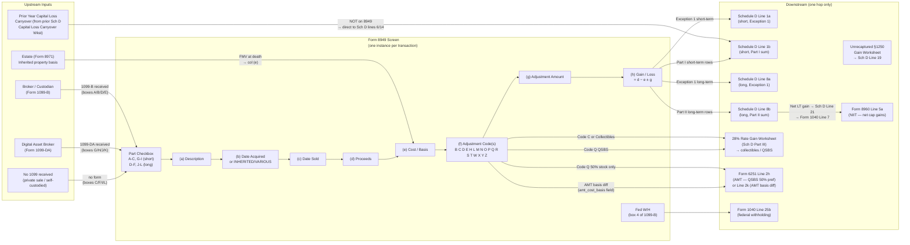

# Form 8949 — Sales and Other Dispositions of Capital Assets

## Overview

Form 8949 is the line-by-line capital transaction detail form. Every taxable
sale, exchange, or other disposition of a capital asset must be reported here —
one row per transaction — unless Exception 1 or Exception 2 applies. Each row
captures what was sold, when it was acquired and sold, the sales proceeds, the
tax basis, any adjustments (e.g., wash sale disallowance, basis corrections,
exclusions), and the resulting gain or loss.

Totals from Form 8949 aggregate onto Schedule D (Capital Gains and Losses),
which nets all short-term and long-term gains/losses and routes the result to
Form 1040 Line 7.

**This screen covers:**

- Stocks, bonds, mutual funds, ETFs
- Digital assets (cryptocurrency) — via 1099-DA checkboxes G/H/I (short) and
  J/K/L (long)
- Investment real estate (not personal residence exclusion, not business
  property)
- Options (non-Section 1256)
- Collectibles (art, coins, stamps, gems)
- Qualified Small Business Stock (Section 1202)
- Qualified Opportunity Fund investments
- Worthless securities
- Nonbusiness bad debts

**This screen does NOT cover:**

- Business property → Form 4797
- Section 1256 contracts (futures, regulated futures) → Form 6781
- Installment sale income received → Form 6252
- Section 988 foreign currency transactions → ordinary income treatment, bypass
  8949

**IRS Form:** 8949 **Drake Screen:** 8949 (Income tab → Sale of Assets) **Tax
Year:** 2025 **Drake Reference:**

- https://kb.drakesoftware.com/kb/Drake-Tax/11978.htm (Import / PDI / PDF
  Attachment)
- https://kb.drakesoftware.com/kb/Drake-Tax/10542.htm (1099-B Broker
  Transactions)
- https://kb.drakesoftware.com/kb/Drake-Tax/13157.htm (Part I/II Code Selection)
- https://kb.drakesoftware.com/kb/Drake-Tax/10139.htm (Schedule D Import)
- https://www.drakesoftware.com/sharedassets/help/2023/form-8949-import-gruntworx-trade.html
  (Import column spec)

---

## Data Entry Fields

One Form 8949 screen instance = one transaction row. Required fields first, then
optional.

### Core Fields (directly map to Form 8949 columns)

| Field               | Type   | Required | Drake Label                           | Description                                                                                                                                                                                                                                                                                                                                                                                                                                                                                                                                                                                                                                                                        | IRS Reference                               | URL                                    |
| ------------------- | ------ | -------- | ------------------------------------- | ---------------------------------------------------------------------------------------------------------------------------------------------------------------------------------------------------------------------------------------------------------------------------------------------------------------------------------------------------------------------------------------------------------------------------------------------------------------------------------------------------------------------------------------------------------------------------------------------------------------------------------------------------------------------------------- | ------------------------------------------- | -------------------------------------- |
| part                | enum   | yes      | "Applicable Part I/Part II check box" | Selects which Part and Box applies. Valid values: A, B, C, G, H, I (Part I, short-term) or D, E, F, J, K, L (Part II, long-term). See checkbox table below for when each applies.                                                                                                                                                                                                                                                                                                                                                                                                                                                                                                  | Form 8949 Instructions, Part I/II — p.1     | https://www.irs.gov/instructions/i8949 |
| col_a_description   | string | yes      | "Description of property"             | Name and description of the asset sold. For stocks: ticker symbol + share count (e.g., "100 sh. XYZ Corp"). For digital assets: full name or abbreviation + quantity (e.g., "0.5 BTC"). For a home: property address. No length limit specified but should match 1099-B description.                                                                                                                                                                                                                                                                                                                                                                                               | Form 8949 Instructions, Column (a) — p.2    | https://www.irs.gov/instructions/i8949 |
| col_b_date_acquired | string | yes      | "Date acquired"                       | Date the asset was acquired (MM/DD/YYYY). Use "VARIOUS" if multiple purchase lots with different acquisition dates are combined on one row (requires attached breakdown). Use "INHERITED" if the asset was inherited — this also forces Part II (long-term) regardless of holding period.                                                                                                                                                                                                                                                                                                                                                                                          | Form 8949 Instructions, Column (b) — p.2    | https://www.irs.gov/instructions/i8949 |
| col_c_date_sold     | string | yes      | "Date sold or disposed of"            | Date of sale or disposition (MM/DD/YYYY). For publicly traded securities: use the trade date, not the settlement date. For short sales: use the date the short was closed (property delivered to broker). For worthless securities: use December 31 of the tax year in which the security became worthless. For expired options: use the expiration date.                                                                                                                                                                                                                                                                                                                          | Form 8949 Instructions, Column (c) — p.2    | https://www.irs.gov/instructions/i8949 |
| col_d_proceeds      | number | yes      | "Proceeds (sales price)"              | Gross sales price or other consideration received. If a Form 1099-B or 1099-DA was received, use the reported amount in box 1d (1099-B) or box 2a (1099-DA). If the 1099-B shows gross proceeds and selling expenses were NOT subtracted by the broker, use the gross amount here and use code E to deduct selling expenses in column (g). If no 1099-B received, use the actual proceeds minus any selling expenses (net proceeds). For expired options: enter 0 or "EXPIRED". For worthless securities: enter 0.                                                                                                                                                                 | Form 8949 Instructions, Column (d) — pp.2–3 | https://www.irs.gov/instructions/i8949 |
| col_e_cost_basis    | number | yes      | "Cost or other basis"                 | Original purchase price plus all acquisition costs (commissions, transfer taxes). Must be adjusted for: stock splits (divide cost proportionally), reinvested dividends (add to basis), return-of-capital distributions (reduce basis), depreciation taken on income property (reduce basis). For inherited property: use FMV on date of death (or alternate valuation date). For gifted property: use donor's adjusted basis (or FMV at gift date if lower and property sold at loss). For 1099-B transactions with basis reported (boxes A or D): use the reported basis; if incorrect, correct it with code B in column (f). For expired written options: enter 0 or "EXPIRED". | Form 8949 Instructions, Column (e) — p.3    | https://www.irs.gov/instructions/i8949 |
| col_f_code_1        | enum   | no       | "Code" (1st code)                     | First adjustment code (if any). Must be a valid code from the adjustment code table. If multiple codes apply, enter them in alphabetical order across col_f_code_1, col_f_code_2, col_f_code_3.                                                                                                                                                                                                                                                                                                                                                                                                                                                                                    | Form 8949 Instructions, Column (f) — p.3    | https://www.irs.gov/instructions/i8949 |
| col_f_code_2        | enum   | no       | "Code" (2nd code)                     | Second adjustment code (if any). Optional.                                                                                                                                                                                                                                                                                                                                                                                                                                                                                                                                                                                                                                         | Form 8949 Instructions, Column (f) — p.3    | https://www.irs.gov/instructions/i8949 |
| col_f_code_3        | enum   | no       | "Code" (3rd code)                     | Third adjustment code (if any). Optional.                                                                                                                                                                                                                                                                                                                                                                                                                                                                                                                                                                                                                                          | Form 8949 Instructions, Column (f) — p.3    | https://www.irs.gov/instructions/i8949 |
| col_g_adjustment    | number | no       | "Amount of adjustment"                | Net dollar amount of all adjustments identified in column (f). Enter as a POSITIVE number if the adjustment increases gain (or decreases loss). Enter as a NEGATIVE number (or in parentheses) if it decreases gain (or increases loss). If multiple codes apply, combine all adjustments into a single net figure. If codes require entering 0 only, enter 0.                                                                                                                                                                                                                                                                                                                     | Form 8949 Instructions, Column (g) — pp.3–4 | https://www.irs.gov/instructions/i8949 |

**Computed field (engine calculates; not user-entered):**

| Field           | Formula                                              | Notes                            |
| --------------- | ---------------------------------------------------- | -------------------------------- |
| col_h_gain_loss | col_d_proceeds − col_e_cost_basis ± col_g_adjustment | Positive = gain; negative = loss |

---

### Drake Additional Fields (beyond the basic 8949 columns)

These appear on the Drake 8949 screen and/or its Additional Info tab:

| Field               | Type    | Required | Drake Label        | Description                                                                                                                                                                     | Routing                                                                            |
| ------------------- | ------- | -------- | ------------------ | ------------------------------------------------------------------------------------------------------------------------------------------------------------------------------- | ---------------------------------------------------------------------------------- |
| tsj                 | enum    | no       | "TSJ"              | Taxpayer (T), Spouse (S), or Joint (J) ownership indicator. Defaults to T. Used for MFJ returns to allocate gains/losses.                                                       | Allocates the transaction to the correct taxpayer for state returns and MFS splits |
| federal_code        | enum    | no       | "F" (Federal code) | 0 = exclude from federal return; blank = include. Used for state-only transactions.                                                                                             | Omits from federal Form 8949 if set to 0                                           |
| state               | string  | no       | "State"            | Two-letter state abbreviation where gain/loss is taxable.                                                                                                                       | Routes to state return                                                             |
| state_id            | string  | no       | "State ID #"       | State-specific ID number for the transaction.                                                                                                                                   | State return                                                                       |
| state_tax_withheld  | number  | no       | "State Tax W/H"    | State income tax withheld on the transaction.                                                                                                                                   | State tax withheld credit                                                          |
| amt_cost_basis      | number  | no       | "AMT Cost Basis"   | Adjusted basis for AMT purposes (may differ from regular tax basis, e.g., for ISO stock exercised). When provided, the engine uses this to compute AMT gain/loss for Form 6251. | Form 6251, Line 2k                                                                 |
| accrued_discount    | number  | no       | "Accrued Discount" | Amount of accrued market discount on a bond. Automatically creates code D adjustment.                                                                                           | Links to code D computation                                                        |
| wash_sale_loss      | number  | no       | "Wash Sale Loss"   | Amount of wash sale disallowance. Automatically creates code W adjustment.                                                                                                      | Links to code W; wash sale loss added to basis of replacement shares               |
| federal_withholding | number  | no       | "Fed W/H"          | Federal income tax withheld by broker (from 1099-B box 4).                                                                                                                      | Form 1040 Line 25b (total federal tax withheld)                                    |
| loss_not_allowed    | boolean | no       | "Loss Not Allowed" | Check (X) if the loss is not deductible (e.g., related-party sale). Automatically creates code L adjustment.                                                                    | code L                                                                             |
| collectibles        | boolean | no       | "Collectibles"     | Check if this is a collectibles transaction (art, coins, stamps, gems). Automatically applies the 28% rate treatment. Do NOT also create a manual code C entry.                 | 28% Rate Gain Worksheet (Schedule D)                                               |
| qsbs_code           | enum    | no       | "QSBS Code"        | Q1 = 50% exclusion (pre-2/18/2009); Q2 = 75% exclusion (2/18/2009–9/27/2010); Q3 = 100% exclusion (post-9/27/2010).                                                             | Section 1202 exclusion computation → code Q                                        |
| qsbs_amount         | number  | no       | "QSBS Amount"      | Dollar amount of Section 1202 gain. Combined with qsbs_code to compute the excluded amount in column (g).                                                                       | code Q adjustment                                                                  |
| state_use_code      | string  | no       | "State Use Code"   | State-specific code (e.g., CG, 30) for state capital gain treatment.                                                                                                            | State return                                                                       |
| state_adjustment    | number  | no       | "State Adjustment" | State gain/loss adjustment (when state treatment differs from federal).                                                                                                         | State return                                                                       |
| state_cost_basis    | number  | no       | "State Cost Basis" | Alternate basis for state purposes.                                                                                                                                             | State return                                                                       |
| llc_number          | number  | no       | "LLC Number"       | LLC entity number for multi-entity returns.                                                                                                                                     | Entity routing                                                                     |

---

## Part I / Part II Checkbox Reference

### Part I — Short-Term (held 1 year or less)

| Checkbox | Meaning                                                                                                                           | Use When                                                                                                    |
| -------- | --------------------------------------------------------------------------------------------------------------------------------- | ----------------------------------------------------------------------------------------------------------- |
| A        | Form 1099-B received; broker reported basis to IRS (box 12 = "Basis reported to IRS"); no adjustments to boxes 1d/1e/1f/1g needed | Standard brokerage transaction, basis reported, no corrections needed                                       |
| B        | Form 1099-B received; broker did NOT report basis to IRS (or basis was left blank)                                                | Noncovered securities (purchased before broker basis-reporting requirements, typically pre-2011 for stocks) |
| C        | No Form 1099-B or 1099-DA received; non-digital asset                                                                             | Private sales, sales not through a reportable broker, gifted property, some mutual fund liquidations        |
| G        | Form 1099-DA received; digital asset broker reported basis to IRS; short-term                                                     | Crypto sold through a compliant broker, basis reported                                                      |
| H        | Form 1099-DA received; digital asset broker did NOT report basis                                                                  | Crypto sold through a broker but without basis reporting                                                    |
| I        | No Form 1099-DA received; short-term digital asset                                                                                | Self-custodied crypto, pre-regulatory transfers, P2P crypto sales                                           |

### Part II — Long-Term (held more than 1 year)

| Checkbox | Meaning                                                                     | Use When                                                                      |
| -------- | --------------------------------------------------------------------------- | ----------------------------------------------------------------------------- |
| D        | Form 1099-B received; broker reported basis to IRS; no adjustments needed   | Standard brokerage transaction, basis reported, held > 1 year, no corrections |
| E        | Form 1099-B received; broker did NOT report basis                           | Noncovered long-term securities                                               |
| F        | No Form 1099-B or 1099-DA received; non-digital asset; held > 1 year        | Private long-term sales, inherited property, gifted property held long-term   |
| J        | Form 1099-DA received; digital asset broker reported basis; long-term       | Long-term crypto, basis reported by broker                                    |
| K        | Form 1099-DA received; digital asset broker did NOT report basis; long-term | Long-term crypto without basis reporting                                      |
| L        | No Form 1099-DA received; long-term digital asset                           | Long-term self-custodied crypto                                               |

**Holding period rule:** "Held 1 year or less" means the date_sold minus
date_acquired is 365 days or fewer. "Held more than 1 year" means 366 days or
more.

**Inherited property exception:** Always use a Part II checkbox (long-term)
regardless of actual holding period. Enter "INHERITED" in column (b).

> **Source:** IRS Topic 409, "Capital Gains Rates" —
> https://www.irs.gov/taxtopics/tc409; Form 8949 Instructions, Column (b) —
> https://www.irs.gov/instructions/i8949

---

## Adjustment Codes (Column f)

Up to 3 codes per row, entered alphabetically. Net all adjustments into one
figure for column (g).

| Code | Trigger / When Used                                                                                                                             | Column (g) Entry                                                                                                                          | Additional Actions                                                                                                                                       |
| ---- | ----------------------------------------------------------------------------------------------------------------------------------------------- | ----------------------------------------------------------------------------------------------------------------------------------------- | -------------------------------------------------------------------------------------------------------------------------------------------------------- |
| B    | Basis shown on Form 1099-B/DA is incorrect                                                                                                      | Enter correction amount: positive if basis was understated (increases gain), negative if overstated (decreases gain)                      | Attach explanation if e-filing                                                                                                                           |
| C    | Transaction involves collectibles (art, antiques, coins, stamps, gems, metals, rugs)                                                            | Enter 0 (unless another adjustment also applies)                                                                                          | Triggers 28% Rate Gain Worksheet; do NOT also check the Drake collectibles checkbox if entering code C manually                                          |
| D    | Bond with accrued market discount                                                                                                               | Use Market Discount Worksheet in Pub 550; enter result as a negative (reduces capital gain; recharacterized as ordinary interest income)  | See Pub 550, Market Discount section                                                                                                                     |
| E    | Selling expenses or option premiums paid/received NOT already included in proceeds or basis on Form 1099-B/DA                                   | Expenses paid: enter as negative (reduces proceeds). Option premiums received: enter as positive (increases proceeds)                     | Common when 1099-B shows gross (not net) proceeds                                                                                                        |
| H    | Gain excluded under Section 121 (principal residence exclusion)                                                                                 | Enter excluded gain as a negative number                                                                                                  | Entire gain excluded → don't report at all. Partial exclusion → report on 8949 Part II with code H                                                       |
| L    | Loss that is NOT deductible for reasons other than wash sale (e.g., related-party sale under Section 267, straddle loss, personal-use property) | Enter disallowed loss as a positive number (increases col h toward 0)                                                                     | Personal-use losses not deductible at all                                                                                                                |
| M    | Aggregate row: multiple transactions summarized using attached statement (Exception 2)                                                          | Enter 0 unless another code also applies                                                                                                  | Attach statement showing each individual transaction in same format as 8949; required when using Exception 2                                             |
| N    | Nominee: received 1099-B/DA in your name but proceeds/basis belong to someone else                                                              | Enter the adjustment that makes col (h) = zero                                                                                            | Actual owner must separately report the transaction                                                                                                      |
| O    | "Ordinary" box checked in box 2 on Form 1099-B or box 6 on Form 1099-DA (contingent payment debt instrument using noncontingent bond method)    | Enter adjustment per Contingent Payment Debt Instrument Worksheet                                                                         | Converts portion of gain/loss to ordinary income                                                                                                         |
| P    | Sale of partnership interest by a nonresident alien or foreign corporation; triggers Reg. §1.864(c)(8) ECI rules                                | Enter Reg. §1.864(c)(8) adjustment amount                                                                                                 | Complex international provision                                                                                                                          |
| Q    | Section 1202 Qualified Small Business Stock (QSBS) gain exclusion                                                                               | Enter excluded gain as a negative number. Q1 = 50% of gain; Q2 = 75% of gain; Q3 = 100% of gain (see QSBS thresholds below)               | Remaining included gain taxed at 28% → triggers 28% Rate Gain Worksheet. Pre-2009 stock (Q1): excluded amount × 7% = AMT preference on Form 6251 Line 2h |
| R    | Rollover of gain into similar property (Section 1045 QSBS rollover within 60 days)                                                              | Enter postponed/deferred gain as a negative number                                                                                        | Must have reinvested in replacement QSBS within 60 days                                                                                                  |
| S    | Section 1244 stock loss; ordinary loss exceeds annual limit                                                                                     | See Schedule D instructions — ordinary portion extracted separately                                                                       | Ordinary loss limit: $50,000 (Single) / $100,000 (MFJ). Excess above limit remains as capital loss on Schedule D                                         |
| T    | Gain/loss type (short vs. long-term) shown on 1099-B/DA is incorrect                                                                            | Enter 0 if no other adjustment applies                                                                                                    | Corrects Part I vs Part II classification without changing dollar amount                                                                                 |
| W    | Wash sale: sold a security at a loss and bought substantially identical securities within 30 days before or after the sale                      | Enter disallowed loss as a POSITIVE number                                                                                                | Disallowed loss is added to basis of replacement securities; holding period of replacement securities also includes the disallowed loss period           |
| X    | DC Zone business asset or Renewal Community asset exclusion                                                                                     | Enter excluded amount as a negative number                                                                                                | Rare; applies to specific empowerment zone/renewal community transactions                                                                                |
| Y    | Previously deferred QOF gain is now recognized (QOF investment disposed of or QOF lost status)                                                  | Per QOF disposition instructions                                                                                                          | Recognizes gain that was deferred in a prior year with code Z                                                                                            |
| Z    | Electing to defer capital gain by investing in a Qualified Opportunity Fund within 180 days of the sale                                         | Enter deferred gain as a negative number. Leave columns (c), (d), and (e) blank for the deferral entry. Enter the QOF's EIN in column (a) | Each QOF investment reported separately. The original sale (triggering the gain) is also reported separately on 8949 before the deferral row             |

> **Source:** IRS Form 8949 Instructions, "Columns (f) and (g) — Adjustments,"
> pp. 3–6 — https://www.irs.gov/instructions/i8949

---

## Per-Field Routing

| Field                                                    | Destination                                         | How Used                                                                                          | Triggers                                                             | Limit / Cap                                                                              | IRS Reference                                        | URL                                      |
| -------------------------------------------------------- | --------------------------------------------------- | ------------------------------------------------------------------------------------------------- | -------------------------------------------------------------------- | ---------------------------------------------------------------------------------------- | ---------------------------------------------------- | ---------------------------------------- |
| All Part I rows (A, B, C, G, H, I) — col_h sum           | Schedule D, Line 1b                                 | Sum of all Part I col_h values                                                                    | —                                                                    | None                                                                                     | Sch D Instructions, Line 1b                          | https://www.irs.gov/instructions/i1040sd |
| All Part II rows (D, E, F, J, K, L) — col_h sum          | Schedule D, Line 8b                                 | Sum of all Part II col_h values                                                                   | —                                                                    | None                                                                                     | Sch D Instructions, Line 8b                          | https://www.irs.gov/instructions/i1040sd |
| Exception 1 short-term                                   | Schedule D, Line 1a                                 | Summary total from qualifying Box A/G transactions with no adjustments                            | Must meet ALL Exception 1 criteria                                   | Only if 1099-B/DA with basis reported, no adjustments needed, "Ordinary" box not checked | Sch D Instructions, Line 1a                          | https://www.irs.gov/instructions/i1040sd |
| Exception 1 long-term                                    | Schedule D, Line 8a                                 | Summary total from qualifying Box D/J transactions with no adjustments                            | Must meet ALL Exception 1 criteria                                   | Same as above                                                                            | Sch D Instructions, Line 8a                          | https://www.irs.gov/instructions/i1040sd |
| code C or collectibles checkbox                          | 28% Rate Gain Worksheet (Schedule D Part III)       | Collectibles gains are subject to 28% max rate                                                    | Any collectibles transaction                                         | 28% maximum rate                                                                         | Sch D Instructions, 28% Rate Gain Worksheet          | https://www.irs.gov/instructions/i1040sd |
| code Q (QSBS) included portion                           | 28% Rate Gain Worksheet (Schedule D Part III)       | QSBS included gain taxed at 28%                                                                   | Any code Q transaction with included (non-excluded) gain             | 28% maximum rate on included portion                                                     | Sch D Instructions, 28% Rate Gain Worksheet          | https://www.irs.gov/instructions/i1040sd |
| code Q (QSBS 50% exclusion — pre-2009 stock)             | Form 6251, Line 2h                                  | AMT preference: excluded gain × 7%                                                                | Only 50% exclusion (Q1) stock                                        | Subject to AMT at rate up to 28%                                                         | Form 6251 Instructions, Line 2h                      | https://www.irs.gov/instructions/i6251   |
| amt_cost_basis differs from regular basis                | Form 6251, Line 2k                                  | AMT gain/loss = proceeds − amt_cost_basis; difference from regular gain is the Line 2k adjustment | Any transaction where AMT basis ≠ regular basis (e.g., ISO exercise) | None                                                                                     | Form 6251 Instructions, Line 2k                      | https://www.irs.gov/instructions/i6251   |
| Schedule D Line 21 (total cap gain/loss)                 | Form 1040, Line 7                                   | Net capital gain or loss for the year                                                             | All transactions aggregate here                                      | $3,000 deduction limit for net losses ($1,500 MFS)                                       | Form 1040 Instructions, Line 7; Sch D Instructions   | https://www.irs.gov/instructions/i1040sd |
| Net capital gain (Sch D line 21 > 0)                     | Form 8960, Line 5a                                  | Included in net investment income for NIIT                                                        | MAGI > threshold (see Constants)                                     | 3.8% NIIT on lesser of NII or MAGI excess over threshold                                 | Form 8960 Instructions, Line 5a                      | https://www.irs.gov/instructions/i8960   |
| Net capital loss (Sch D net < 0) — amount over $3k limit | Capital Loss Carryover Worksheet → next year Sch D  | Short-term excess → next year Sch D Line 6; long-term excess → next year Sch D Line 14            | Net loss exceeds $3,000 ($1,500 MFS)                                 | Carry forward indefinitely; character preserved                                          | Sch D Instructions, Capital Loss Carryover Worksheet | https://www.irs.gov/instructions/i1040sd |
| federal_withholding (Fed W/H)                            | Form 1040, Line 25b                                 | Total federal tax withheld                                                                        | Any transaction with withholding                                     | None                                                                                     | Form 1040 Instructions, Line 25b                     | https://www.irs.gov/instructions/i1040   |
| Unrecaptured §1250 gain (from real property)             | Sch D Line 19 via Unrecaptured §1250 Gain Worksheet | 25% max rate applies; worksheet also used for pass-through gains from partnerships/S corps        | Any sale of depreciated real property held > 1 year                  | 25% maximum rate                                                                         | Sch D Instructions, Line 19                          | https://www.irs.gov/instructions/i1040sd |

---

## Calculation Logic

### Step 1 — Classify Each Transaction as Short-Term or Long-Term

For each transaction row:

```
holding_days = date_sold − date_acquired (calendar days)

if col_b_date_acquired == "INHERITED":
  → Part II (long-term), regardless of holding period
else if holding_days > 365:
  → Part II (long-term)
else:
  → Part I (short-term)
```

> **Source:** IRS Topic 409 — https://www.irs.gov/taxtopics/tc409; Form 8949
> Instructions, Column (b) — https://www.irs.gov/instructions/i8949

---

### Step 2 — Assign Checkbox (A–F, G–L)

```
if part == "short-term":
  if is_digital_asset:
    if received_1099_DA and basis_reported_to_IRS:  → checkbox G
    elif received_1099_DA and basis_NOT_reported:    → checkbox H
    else (no 1099-DA):                               → checkbox I
  else:
    if received_1099_B and basis_reported_to_IRS:   → checkbox A
    elif received_1099_B and basis_NOT_reported:     → checkbox B
    else (no 1099-B):                                → checkbox C

if part == "long-term":
  same logic but use D/E/F (non-digital) and J/K/L (digital)
```

"Basis reported to IRS" means the broker checked box 12 ("Cost basis reported to
IRS") on Form 1099-B, or the digital asset broker reported basis on Form
1099-DA.

> **Source:** Form 8949 Instructions, Part I and Part II —
> https://www.irs.gov/instructions/i8949

---

### Step 3 — Compute Gain or Loss per Transaction Row

```
col_h = col_d_proceeds − col_e_cost_basis ± col_g_adjustment

If col_h > 0: capital gain
If col_h < 0: capital loss (report as negative)
If col_h = 0: no gain/loss (still report the row if required)
```

> **Source:** Form 8949 Instructions, Column (h) —
> https://www.irs.gov/instructions/i8949

---

### Step 4 — Aggregate Totals and Route to Schedule D

```
short_term_total = SUM of col_h for all Part I rows (all checkboxes A, B, C, G, H, I combined)
  → Schedule D, Line 1b

long_term_total = SUM of col_h for all Part II rows (all checkboxes D, E, F, J, K, L combined)
  → Schedule D, Line 8b
```

**Exception 1 (bypass Form 8949):** If ALL of the following are true for a set
of transactions:

- Received Form 1099-B or 1099-DA showing basis reported to IRS
- No adjustments needed to boxes 1d, 1e, 1f, 1g (1099-B) or 1h, 1i (1099-DA)
- "Ordinary" box NOT checked in box 2 (1099-B) or box 6 (1099-DA)
- Not deferring or terminating a QOF investment

Then report summary totals directly on Schedule D without completing Form 8949:

- Short-term summary → Schedule D, Line 1a
- Long-term summary → Schedule D, Line 8a

> **Source:** Form 8949 Instructions, Exceptions 1 and 2; Schedule D
> Instructions — https://www.irs.gov/instructions/i1040sd

---

### Step 5 — Schedule D Net Calculation

Schedule D Part I (Short-Term):

```
Sch D Line 7 = Line 1a + Line 1b + Line 2 [Form 4684 casualty/theft] + Line 3 [Form 6252 installment] + Line 4 [Form 6781 Section 1256 40%] + Line 5 [Form 8824 like-kind] + Line 6 [prior-year short-term carryover]
```

Schedule D Part II (Long-Term):

```
Sch D Line 15 = Line 8a + Line 8b + Line 9 [Form 4684] + Line 10 [Form 6252] + Line 11 [Form 4797 §1231 gains] + Line 12 [Form 6781 Section 1256 60%] + Line 13 [Form 8824] + Line 13 [capital gain distributions from 1099-DIV box 2a] + Line 14 [prior-year long-term carryover]
```

Schedule D Overall:

```
Sch D Line 16 = Line 7 + Line 15

If Line 16 > 0 AND Line 15 > 0:
  → Use Qualified Dividends and Capital Gain Tax Worksheet (Form 1040 instructions)
    to compute tax at preferential rates (0%, 15%, 20%, 25%, 28%)

If Line 16 ≤ 0:
  → Net capital loss
  → Deduct min(|Line 16|, $3,000) on Form 1040 Line 7 (or $1,500 if MFS)
  → Carry excess forward using Capital Loss Carryover Worksheet
```

Sch D Line 21 = the amount that flows to Form 1040 Line 7.

> **Source:** Schedule D Instructions, Lines 7, 15, 16, 21 —
> https://www.irs.gov/instructions/i1040sd

---

### Step 6 — Capital Gain Tax Rate Application (Long-Term Only)

Long-term capital gains (Part II) are taxed at preferential rates using the
Qualified Dividends and Capital Gain Tax Worksheet. The applicable rate depends
on the taxpayer's taxable income:

| Rate | Single           | MFJ / QSS        | MFS              | HOH              |
| ---- | ---------------- | ---------------- | ---------------- | ---------------- |
| 0%   | ≤ $48,350        | ≤ $96,700        | ≤ $48,350        | ≤ $64,750        |
| 15%  | $48,351–$533,400 | $96,701–$600,050 | $48,351–$300,000 | $64,751–$566,700 |
| 20%  | > $533,400       | > $600,050       | > $300,000       | > $566,700       |

**Special rates (not standard long-term rates):**

- Collectibles gains (code C): maximum 28% rate
- Section 1202 QSBS included gain (code Q): maximum 28% rate
- Unrecaptured Section 1250 gain (real property depreciation): maximum 25% rate
- Short-term capital gains: taxed as ordinary income at graduated rates
  (10%–37%)

**28% Rate Gain Worksheet:** Triggered when Schedule D Part III, Line 17 = "Yes"
(any collectibles gain or unrecaptured §1250 gain exists). Complete this
worksheet before computing tax.

> **Source:** IRS Topic 409 — https://www.irs.gov/taxtopics/tc409; Schedule D
> Instructions, Part III — https://www.irs.gov/instructions/i1040sd

---

### Step 7 — Net Investment Income Tax (NIIT)

If net capital gains exist and taxpayer's MAGI exceeds the threshold:

```
NIIT = 3.8% × min(NII, MAGI − threshold)

where:
  NII = net investment income (includes net capital gains from Sch D, interest, dividends, passive rents)
  threshold = $200,000 (Single/HOH/MFS) or $250,000 (MFJ/QSS) or $125,000 (MFS)
```

Net capital gains from Schedule D Line 21 flow to Form 8960 Line 5a (adjustments
on Line 5b).

> **Source:** IRC §1411; Form 8960 Instructions —
> https://www.irs.gov/instructions/i8960; IRS Topic 559 —
> https://www.irs.gov/taxtopics/tc559

---

### Step 8 — Capital Loss Carryover (if net loss)

If the net capital loss exceeds $3,000 ($1,500 MFS), the excess is carried
forward:

```
Current year deduction = min(|net_capital_loss|, $3,000)  [or $1,500 MFS]
Carryover = net_capital_loss − current_year_deduction

Short-term carryover portion → next year Schedule D, Line 6
Long-term carryover portion → next year Schedule D, Line 14
```

Character (short/long) of carryover is preserved. Compute using the Capital Loss
Carryover Worksheet in the Schedule D instructions.

> **Source:** Schedule D Instructions, Capital Loss Carryover Worksheet —
> https://www.irs.gov/instructions/i1040sd

---

## Constants & Thresholds (Tax Year 2025)

| Constant                                                   | Value                                                           | Source                                         | URL                                      |
| ---------------------------------------------------------- | --------------------------------------------------------------- | ---------------------------------------------- | ---------------------------------------- |
| LTCG 0% rate — Single / MFS threshold (max)                | $48,350 taxable income                                          | Rev. Proc. 2024-40; IRS Topic 409              | https://www.irs.gov/taxtopics/tc409      |
| LTCG 0% rate — MFJ / QSS threshold (max)                   | $96,700 taxable income                                          | Rev. Proc. 2024-40; IRS Topic 409              | https://www.irs.gov/taxtopics/tc409      |
| LTCG 0% rate — HOH threshold (max)                         | $64,750 taxable income                                          | Rev. Proc. 2024-40; IRS Topic 409              | https://www.irs.gov/taxtopics/tc409      |
| LTCG 15% rate — Single range                               | $48,351–$533,400                                                | Rev. Proc. 2024-40; IRS Topic 409              | https://www.irs.gov/taxtopics/tc409      |
| LTCG 15% rate — MFJ / QSS range                            | $96,701–$600,050                                                | Rev. Proc. 2024-40; IRS Topic 409              | https://www.irs.gov/taxtopics/tc409      |
| LTCG 15% rate — MFS range                                  | $48,351–$300,000                                                | Rev. Proc. 2024-40; IRS Topic 409              | https://www.irs.gov/taxtopics/tc409      |
| LTCG 15% rate — HOH range                                  | $64,751–$566,700                                                | Rev. Proc. 2024-40; IRS Topic 409              | https://www.irs.gov/taxtopics/tc409      |
| LTCG 20% rate — Single threshold (min)                     | > $533,400                                                      | Rev. Proc. 2024-40; IRS Topic 409              | https://www.irs.gov/taxtopics/tc409      |
| LTCG 20% rate — MFJ / QSS threshold (min)                  | > $600,050                                                      | Rev. Proc. 2024-40; IRS Topic 409              | https://www.irs.gov/taxtopics/tc409      |
| LTCG 20% rate — MFS threshold (min)                        | > $300,000                                                      | Rev. Proc. 2024-40; IRS Topic 409              | https://www.irs.gov/taxtopics/tc409      |
| LTCG 20% rate — HOH threshold (min)                        | > $566,700                                                      | Rev. Proc. 2024-40; IRS Topic 409              | https://www.irs.gov/taxtopics/tc409      |
| Collectibles max rate                                      | 28%                                                             | IRC §1(h)(4); IRS Topic 409                    | https://www.irs.gov/taxtopics/tc409      |
| Unrecaptured §1250 gain max rate                           | 25%                                                             | IRC §1(h)(1)(D); IRS Topic 409                 | https://www.irs.gov/taxtopics/tc409      |
| QSBS max rate (included portion)                           | 28%                                                             | IRC §1(h)(4); Form 8949 Instructions           | https://www.irs.gov/instructions/i8949   |
| Capital loss annual deduction — Single/MFJ/HOH/QSS         | $3,000                                                          | IRC §1211(b); Sch D Instructions               | https://www.irs.gov/instructions/i1040sd |
| Capital loss annual deduction — MFS                        | $1,500                                                          | IRC §1211(b); Sch D Instructions               | https://www.irs.gov/instructions/i1040sd |
| NIIT rate                                                  | 3.8%                                                            | IRC §1411                                      | https://www.irs.gov/instructions/i8960   |
| NIIT MAGI threshold — Single / HOH                         | $200,000                                                        | IRC §1411(b)(1)(A); IRS Topic 559              | https://www.irs.gov/taxtopics/tc559      |
| NIIT MAGI threshold — MFJ / QSS                            | $250,000                                                        | IRC §1411(b)(1)(B); IRS Topic 559              | https://www.irs.gov/taxtopics/tc559      |
| NIIT MAGI threshold — MFS                                  | $125,000                                                        | IRC §1411(b)(1)(C); IRS Topic 559              | https://www.irs.gov/taxtopics/tc559      |
| Section 1202 QSBS exclusion — acquired after 9/27/2010     | 100% of gain (max $10,000,000 or 10× adjusted basis per issuer) | IRC §1202(a)(4)                                | https://www.irs.gov/instructions/i8949   |
| Section 1202 QSBS exclusion — acquired 2/18/2009–9/27/2010 | 75% of gain                                                     | IRC §1202(a)(3)                                | https://www.irs.gov/instructions/i8949   |
| Section 1202 QSBS exclusion — acquired before 2/18/2009    | 50% of gain                                                     | IRC §1202(a)(1)                                | https://www.irs.gov/instructions/i8949   |
| Section 1202 QSBS AMT preference (50% exclusion only)      | Excluded gain × 7%                                              | IRC §57(a)(7); Form 6251 Instructions, Line 2h | https://www.irs.gov/instructions/i6251   |
| Section 1244 ordinary loss limit — Single                  | $50,000/year                                                    | IRC §1244(b)                                   | https://www.irs.gov/instructions/i8949   |
| Section 1244 ordinary loss limit — MFJ                     | $100,000/year                                                   | IRC §1244(b)                                   | https://www.irs.gov/instructions/i8949   |
| Section 121 home sale exclusion — Single                   | $250,000                                                        | IRC §121(b)(1)                                 | https://www.irs.gov/publications/p523    |
| Section 121 home sale exclusion — MFJ                      | $500,000                                                        | IRC §121(b)(2)                                 | https://www.irs.gov/publications/p523    |
| QOF gain deferral investment window                        | 180 days from date of sale                                      | IRC §1400Z-2(a)(1)                             | https://www.irs.gov/instructions/i8949   |

---

## Data Flow Diagram



---

## Edge Cases & Special Rules

### 1. Wash Sale Rule (Code W)

A wash sale occurs when a security is sold at a loss and substantially identical
securities are purchased within the 30-day window before or after the sale date
(61-day total window centered on the sale date).

**Reporting:**

- Report the transaction normally on the appropriate 8949 Part/checkbox
- Enter code "W" in column (f)
- Enter the amount of the DISALLOWED loss as a POSITIVE number in column (g)
- Column (h) will show $0 or a reduced gain (the wash sale loss is negated by
  the positive adjustment)

**Basis adjustment:** The disallowed wash sale loss is added to the cost basis
of the replacement shares. The holding period of the replacement shares also
includes the holding period of the sold shares.

**If the 1099-B shows an incorrect wash sale amount:** Enter the correct
disallowed loss in column (g) and attach a written explanation when e-filing.

**"Substantially identical" includes:** The same stock or bond; call options on
the same stock if the options are deep in the money. Does NOT include: stock of
a different company; preferred vs. common stock of the same company (generally);
ETFs that track the same index (unsettled legal question).

> **Source:** Form 8949 Instructions, Code W —
> https://www.irs.gov/instructions/i8949; IRC §1091; IRS Pub 550, "Wash Sales" —
> https://www.irs.gov/publications/p550

---

### 2. Inherited Property

- Enter "INHERITED" in column (b) (date acquired)
- Always report in Part II (long-term) regardless of how long decedent or
  beneficiary held the property
- Basis = Fair Market Value on the date of death (or alternate valuation date if
  elected by estate)
- If Form 8971 (Information Regarding Beneficiaries) with Schedule A was
  received: basis MUST be consistent with the final estate tax value. Penalty
  for inconsistency: 20% of the underpayment attributable to the inconsistency
  (IRC §6662(k))

> **Source:** Form 8949 Instructions, Column (b) —
> https://www.irs.gov/instructions/i8949; IRC §1014; IRC §6662(k)

---

### 3. Sale of Principal Residence (Code H)

Section 121 allows exclusion of up to $250,000 of gain ($500,000 MFJ) if the
taxpayer owned and used the property as a principal residence for at least 2 of
the 5 years before the sale.

- If the ENTIRE gain is excluded: Do NOT report the sale on Form 8949 or
  Schedule D
- If PART of the gain is taxable (gain exceeds exclusion, or partial exclusion
  applies):
  - Report on Form 8949, Part II (long-term, assuming held > 1 year)
  - Enter code "H" in column (f)
  - Enter the excluded amount as a NEGATIVE number in column (g)
  - Column (h) shows only the taxable portion

**Partial exclusion** applies (proportional reduction of exclusion) if the
taxpayer fails to meet the 2-year residency test due to a qualified exception
(change of employment, health, unforeseen circumstances).

> **Source:** Form 8949 Instructions, Code H; IRC §121; IRS Publication 523 —
> https://www.irs.gov/publications/p523

---

### 4. Multiple Instances / Large Volume of Transactions

There is no limit on the number of Form 8949 rows. For large volumes:

- Use Drake's import feature (Excel/CSV/TSV with GruntWorx)
- Or use Exception 2: summarize on one 8949 row with code M and attach a
  detailed statement

Each Drake 8949 screen = one transaction. All rows within the same Part (I or
II) are aggregated when computing the Schedule D total.

---

### 5. Digital Assets (Cryptocurrency / NFTs)

For TY2025, Form 1099-DA is issued by digital asset brokers. Treatment parallels
1099-B:

- Short-term (≤1 year): checkboxes G (basis reported), H (not reported), I (no
  form)
- Long-term (>1 year): checkboxes J (basis reported), K (not reported), L (no
  form)
- Column (a): include full asset name or abbreviation + quantity (e.g., "0.5
  Bitcoin")
- If no specific ID method was elected in writing before the trade: IRS requires
  FIFO basis assignment
- Each trade (crypto-to-crypto exchange, NFT sale, etc.) is a separate taxable
  event requiring its own row
- Staking rewards / mining income: taxed as ordinary income at receipt (not on
  8949); when later sold, the FMV at receipt becomes the basis and proceeds are
  reported on 8949

> **Source:** Drake KB — https://kb.drakesoftware.com/kb/Drake-Tax/18925.htm;
> Form 8949 Instructions — https://www.irs.gov/instructions/i8949

---

### 6. Section 1202 — Qualified Small Business Stock (QSBS) (Code Q)

Exclusion from gain on sale of QSBS held more than 5 years (IRC §1202):

- 100% excluded: acquired after September 27, 2010 (max $10,000,000 or 10×
  adjusted basis per issuer)
- 75% excluded: acquired February 18, 2009 through September 27, 2010
- 50% excluded: acquired before February 18, 2009

**Reporting:**

- Enter code Q in column (f)
- Enter the excluded portion as a NEGATIVE number in column (g)
  - 100% stock: excluded amount = full gain
  - 75% stock: excluded amount = gain × 75%
  - 50% stock: excluded amount = gain × 50%
- The INCLUDED (taxable) portion = gain minus excluded amount
- The included portion is subject to the 28% maximum rate → triggers 28% Rate
  Gain Worksheet

**AMT impact (50% exclusion stock only):**

- Form 6251 Line 2h = excluded gain × 7% (AMT preference item)
- Does NOT apply to 75% or 100% exclusion stock

> **Source:** Form 8949 Instructions, Code Q; IRC §1202; Form 6251 Instructions,
> Line 2h — https://www.irs.gov/instructions/i6251

---

### 7. Qualified Opportunity Fund (QOF) — Codes Y and Z

**Deferring a capital gain (Code Z):**

- Original sale is reported normally on Form 8949 (shows the full gain)
- A SEPARATE 8949 row is then added to defer the gain:
  - Column (a): EIN of the QOF (no description of property)
  - Columns (c), (d), (e): leave blank
  - Column (f): code Z
  - Column (g): enter the deferred gain as a NEGATIVE number
  - Column (h): $0 (deferred gain fully offset)
- Must be within 180 days of the original sale
- Each QOF investment is a separate row

**Recognizing previously deferred gain (Code Y):**

- When a QOF investment is disposed of (sold, gifted, transferred) or the QOF
  loses its qualified status
- Enter code Y; follow QOF disposition instructions

> **Source:** Form 8949 Instructions, Codes Y and Z —
> https://www.irs.gov/instructions/i8949

---

### 8. Form 4797 — What Does NOT Go on Form 8949

The following assets are reported on Form 4797 (Sales of Business Property), NOT
Form 8949:

- Depreciable business property (Section 1245 personal property; Section 1250
  real property)
- Section 1231 property (real or depreciable property used in business, held > 1
  year)
- Ordinary income recapture (Section 1245 / 1250 recapture)

**Interaction with Schedule D:**

- If Form 4797 Part I (Section 1231) produces a net GAIN: flows to Schedule D
  Line 11 directly (not via 8949)
- If Form 4797 Part I produces a net LOSS: treated as ordinary loss on Form 4797
  Part II — does NOT appear on Form 8949 or Schedule D
- Unrecaptured Section 1250 gain: flows to Schedule D Line 19 via the
  Unrecaptured §1250 Gain Worksheet

> **Source:** Schedule D Instructions, Line 11; Form 4797 Instructions —
> https://www.irs.gov/instructions/i4797

---

### 9. Section 1256 Contracts (Futures) — NOT on Form 8949

Regulated futures contracts, foreign currency contracts, non-equity options,
dealer equity options, and dealer securities futures contracts are Section 1256
contracts. They are reported on **Form 6781** (not Form 8949):

- Mandatory 60/40 rule: 60% long-term, 40% short-term regardless of actual
  holding period
- Mark-to-market: treat as sold at FMV on last business day of the year
- Totals from Form 6781 flow directly to Schedule D Lines 4 (short-term 40%) and
  12 (long-term 60%)

> **Source:** Form 6781; Schedule D Instructions, Lines 4 and 12 —
> https://www.irs.gov/instructions/i1040sd

---

### 10. Short Sales

A short sale is a sale of borrowed securities, closed when you later purchase
and deliver the securities.

- Column (b) (date acquired): date you acquired the property delivered to the
  broker to close the short
- Column (c) (date sold): date you delivered property to the broker to close the
  short sale
- Report in the year the short sale is CLOSED (settled), not when opened
- Holding period: determined by the date you acquired the closing property. If
  you acquired substantially identical property within 30 days before/after the
  short sale (while the short was open), any resulting LOSS is treated as
  long-term even if the closing property was held short-term

> **Source:** Schedule D Instructions, "Short Sales" —
> https://www.irs.gov/instructions/i1040sd

---

### 11. Options

**Purchased options that expire worthless:**

- Enter expiration date in column (c)
- Enter "EXPIRED" or $0 in column (d) (proceeds)
- Enter original premium paid in column (e) (cost)
- Report in Part I or II based on holding period of the option itself

**Written (sold) options that expire worthless:**

- Enter expiration date in column (b)
- Enter "EXPIRED" or $0 in column (e) (cost)
- Enter premium received in column (d) (proceeds)
- Capital gain — Part I or II based on holding period

**Exercised call options bought by you:**

- If 1099-B reflects exercise: premium incorporated in proceeds; no separate
  entry needed
- If not reflected on 1099-B (pre-2014): add the premium paid as a positive
  adjustment using code E

**Section 1256 options (non-equity options, dealer options):** → Form 6781, NOT
Form 8949

> **Source:** Schedule D Instructions, "Gain or Loss From Options" —
> https://www.irs.gov/instructions/i1040sd

---

### 12. Worthless Securities

When a security becomes completely worthless:

- Report in the tax year the security becomes worthless
- Column (c) (date sold): use **December 31** of the tax year in which the
  security became worthless
- Column (d) (proceeds): $0
- Holding period: based on when the security was acquired (normal rules — can be
  short-term or long-term)
- A stock held ≤ 1 year when it becomes worthless → Part I (short-term capital
  loss)
- A stock held > 1 year when it becomes worthless → Part II (long-term capital
  loss)

> **Source:** IRS Publication 550, "Worthless Securities" —
> https://www.irs.gov/publications/p550

---

### 13. Nonbusiness Bad Debts

A nonbusiness bad debt (a loan to a friend, personal guarantee, etc.) that
becomes wholly worthless:

- Treated as a SHORT-TERM capital loss regardless of holding period
- Report on Form 8949, Part I (use checkbox C — no 1099-B)
- Column (a): name of debtor + "Bad Debt"
- Column (b): date the debt was created
- Column (c): date the debt became wholly worthless
- Column (d): $0 (proceeds — nothing received)
- Column (e): amount lent (basis)

> **Source:** Form 8949 Instructions, "Nonbusiness Bad Debts" —
> https://www.irs.gov/instructions/i8949; IRC §166(d)

---

### 14. Personal-Use Property

- Loss on personal-use property (car, furniture, jewelry held for personal use):
  NOT deductible, NOT reported on Form 8949
- Gain on personal-use property reported on Form 1099-K: TAXABLE, must be
  reported on Form 8949 (use checkbox C — no 1099-B)
- Loss on personal-use property sold via online platform where a 1099-K is
  issued: still NOT deductible; report on 8949 with a code L entry to zero out
  the loss

> **Source:** Form 8949 Instructions — https://www.irs.gov/instructions/i8949

---

### 15. AMT and Capital Gains

Capital gains generally receive the same preferential rate treatment under AMT
as under regular tax. Exceptions:

1. **QSBS 50% exclusion (pre-2009 stock):** Excluded gain × 7% = AMT preference
   item → Form 6251 Line 2h
2. **AMT cost basis differs from regular tax basis** (e.g., for ISO stock
   exercised between 1987–2000, or for certain depreciated property): Compute
   AMT gain separately using the AMT basis → Form 6251 Line 2k adjustment
3. **Capital loss carryovers:** May differ between regular tax and AMT if AMT
   and regular tax gains/losses differed in prior years. Compute the AMT capital
   loss carryover separately using the AMT Capital Loss Carryover Worksheet in
   Form 6251 instructions. Apply the $3,000 limitation separately.

> **Source:** Form 6251 Instructions, Lines 2h and 2k —
> https://www.irs.gov/instructions/i6251

---

### 16. Filing Status Effects

- **MFS (Married Filing Separately):** Capital loss deduction limit is $1,500
  (not $3,000). NIIT threshold is $125,000 (not $200,000). LTCG 15% rate tops
  out at $300,000 (not $533,400 or $600,050). Spouses generally cannot share
  capital loss carryovers from each other's pre-marriage returns.
- **MFJ:** $500,000 Section 121 home sale exclusion (vs $250,000 for single).
  Both spouses' wages/income affect the AGI threshold for NIIT.
- All filing statuses: same Form 8949 field structure; only thresholds and
  limits differ.

---

## Sources

All URLs verified to resolve.

| Document                                                     | Year | Section                                                     | URL                                                                                        | Saved as     |
| ------------------------------------------------------------ | ---- | ----------------------------------------------------------- | ------------------------------------------------------------------------------------------ | ------------ |
| Drake KB — 8949 Import / PDI / PDF Attachment                | —    | Full article                                                | https://kb.drakesoftware.com/kb/Drake-Tax/11978.htm                                        | —            |
| Drake KB — 1099-B Broker and Barter Transactions             | —    | Full article                                                | https://kb.drakesoftware.com/kb/Drake-Tax/10542.htm                                        | —            |
| Drake KB — 8949 Code on Part I or II                         | —    | Full article                                                | https://kb.drakesoftware.com/kb/Drake-Tax/13157.htm                                        | —            |
| Drake KB — Schedule D / 8949 Import                          | —    | Full article                                                | https://kb.drakesoftware.com/kb/Drake-Tax/10139.htm                                        | —            |
| Drake Help — Form 8949 Import Column Spec                    | 2023 | Full import spec                                            | https://www.drakesoftware.com/sharedassets/help/2023/form-8949-import-gruntworx-trade.html | —            |
| Drake KB — Form 1099-DA Digital Asset                        | —    | Full article                                                | https://kb.drakesoftware.com/kb/Drake-Tax/18925.htm                                        | —            |
| IRS Form 8949 Instructions                                   | 2025 | Full                                                        | https://www.irs.gov/instructions/i8949                                                     | i8949.pdf    |
| IRS Schedule D (Form 1040) Instructions                      | 2025 | Full                                                        | https://www.irs.gov/instructions/i1040sd                                                   | i1040sd.pdf  |
| IRS Topic 409 — Capital Gains and Losses                     | 2025 | Full                                                        | https://www.irs.gov/taxtopics/tc409                                                        | —            |
| IRS Topic 559 — Net Investment Income Tax                    | 2025 | NIIT thresholds                                             | https://www.irs.gov/taxtopics/tc559                                                        | —            |
| IRS Form 8960 Instructions                                   | 2025 | Lines 5a, 5b, 17                                            | https://www.irs.gov/instructions/i8960                                                     | —            |
| IRS Form 6251 Instructions                                   | 2025 | Lines 2h, 2k, Part III                                      | https://www.irs.gov/instructions/i6251                                                     | —            |
| IRS Publication 550 — Investment Income and Expenses         | 2025 | Wash sales, worthless securities, market discount           | https://www.irs.gov/publications/p550                                                      | p550.pdf     |
| IRS Publication 544 — Sales and Other Dispositions of Assets | 2025 | Capital gains overview                                      | https://www.irs.gov/publications/p544                                                      | p544.pdf     |
| IRS Publication 523 — Selling Your Home                      | 2025 | Section 121 exclusion                                       | https://www.irs.gov/publications/p523                                                      | —            |
| Rev. Proc. 2024-40                                           | 2024 | §3 (TY2025 inflation adjustments, capital gains thresholds) | https://www.irs.gov/pub/irs-drop/rp-24-40.pdf                                              | rp-24-40.pdf |
