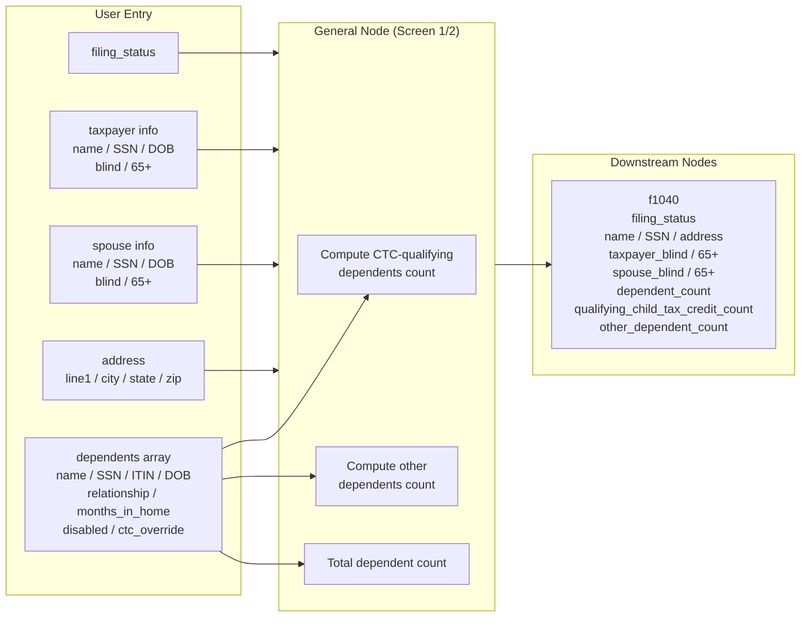

# General (Screen 1/2) — Form 1040 Personal Info & Dependents

## Overview

Drake Screen 1 (alias Screen 2) captures the taxpayer's personal identity (name, SSN, DOB, blindness, age-65+ status), filing status, mailing address, spouse information, and the full dependent list. This is the foundational node for every 1040 return: filing status drives tax brackets, standard deduction, and multiple credit phase-out thresholds; dependent counts drive the Child Tax Credit (CTC) and Credit for Other Dependents (ODC) calculations. The node routes a structured summary to `f1040` (header fields + dependent counts + filing_status).

**IRS Form:** 1040
**Drake Screen:** 1 (alias: 2)
**Tax Year:** 2025
**Drake Reference:** https://kb.drakesoftware.com/ (Screen 1 / Screen 2 — personal info and dependent data entry)

---

## Data Entry Fields

| Field | Type | Required | Drake Label | Description | IRS Reference | URL |
| ----- | ---- | -------- | ----------- | ----------- | ------------- | --- |
| filing_status | enum (FilingStatus) | Yes | Filing Status | One of: Single, MFJ, MFS, HOH, QSS | 1040 checkboxes 1–5 | https://www.irs.gov/instructions/i1040gi |
| taxpayer_first_name | string | No | First Name | Taxpayer first name | 1040 Name line | https://www.irs.gov/instructions/i1040gi |
| taxpayer_last_name | string | No | Last Name | Taxpayer last name | 1040 Name line | https://www.irs.gov/instructions/i1040gi |
| taxpayer_ssn | string | No | SSN | Taxpayer Social Security Number | 1040 SSN line | https://www.irs.gov/instructions/i1040gi |
| taxpayer_dob | string | No | Date of Birth | ISO date (YYYY-MM-DD) — used to determine age 65+ | Pub 501 p.3 | https://www.irs.gov/publications/p501 |
| taxpayer_blind | boolean | No | Blind | Taxpayer is legally blind | 1040 Standard Deduction Worksheet | https://www.irs.gov/instructions/i1040gi |
| taxpayer_age_65_or_older | boolean | No | Age 65 or older | Taxpayer is 65+ at year end | 1040 Standard Deduction Worksheet | https://www.irs.gov/instructions/i1040gi |
| spouse_first_name | string | No | Spouse First Name | Spouse first name (MFJ/MFS) | 1040 Name line | https://www.irs.gov/instructions/i1040gi |
| spouse_last_name | string | No | Spouse Last Name | Spouse last name (MFJ/MFS) | 1040 Name line | https://www.irs.gov/instructions/i1040gi |
| spouse_ssn | string | No | Spouse SSN | Spouse Social Security Number | 1040 Spouse SSN line | https://www.irs.gov/instructions/i1040gi |
| spouse_dob | string | No | Spouse DOB | ISO date — used to determine spouse age 65+ | Pub 501 p.3 | https://www.irs.gov/publications/p501 |
| spouse_blind | boolean | No | Spouse Blind | Spouse is legally blind | 1040 Standard Deduction Worksheet | https://www.irs.gov/instructions/i1040gi |
| spouse_age_65_or_older | boolean | No | Spouse 65 or older | Spouse is 65+ at year end | 1040 Standard Deduction Worksheet | https://www.irs.gov/instructions/i1040gi |
| address_line1 | string | No | Address | Street address | 1040 Address line | https://www.irs.gov/instructions/i1040gi |
| address_city | string | No | City | City | 1040 City/State/ZIP line | https://www.irs.gov/instructions/i1040gi |
| address_state | string | No | State | 2-letter state code | 1040 City/State/ZIP line | https://www.irs.gov/instructions/i1040gi |
| address_zip | string | No | ZIP Code | 5-digit or ZIP+4 | 1040 City/State/ZIP line | https://www.irs.gov/instructions/i1040gi |
| dependents | array of DependentItem | No | Dependents | List of all claimed dependents | 1040 Dependents section | https://www.irs.gov/instructions/i1040gi |

### DependentItem fields

| Field | Type | Required | Description | IRS Reference | URL |
| ----- | ---- | -------- | ----------- | ------------- | --- |
| first_name | string | Yes | Dependent first name | 1040 Dependents column (a) | https://www.irs.gov/instructions/i1040gi |
| last_name | string | Yes | Dependent last name | 1040 Dependents column (a) | https://www.irs.gov/instructions/i1040gi |
| ssn | string | No | SSN — required for CTC | 1040 Dependents column (b) | https://www.irs.gov/instructions/i1040gi |
| itin | string | No | ITIN — disqualifies CTC | 1040 Dependents column (b) | https://www.irs.gov/instructions/i1040gi |
| dob | string | Yes | Date of birth (YYYY-MM-DD) — used for age test | Pub 501, age test | https://www.irs.gov/publications/p501 |
| relationship | enum (DependentRelationship) | Yes | Relationship to taxpayer | 1040 Dependents column (c) | https://www.irs.gov/instructions/i1040gi |
| months_in_home | integer 0–12 | Yes | Months lived in taxpayer's home during year | Pub 501, residency test | https://www.irs.gov/publications/p501 |
| qualifying_child_for_ctc | boolean | No | Override: explicitly mark as qualifying/not | Pub 972 / Form 8812 instructions | https://www.irs.gov/pub/irs-pdf/i8812.pdf |
| disabled | boolean | No | Permanently and totally disabled (waives age test) | Pub 501, age test exception | https://www.irs.gov/publications/p501 |

---

## Per-Field Routing

| Field | Destination | How Used | Triggers | Limit / Cap | IRS Reference | URL |
| ----- | ----------- | -------- | -------- | ----------- | ------------- | --- |
| filing_status | f1040 | Routes as filing_status; drives tax bracket, std deduction, and phase-outs | Always | — | 1040 checkboxes 1–5 | https://www.irs.gov/instructions/i1040gi |
| taxpayer_first_name | f1040 | Pass-through header field | Always | — | 1040 Name line | https://www.irs.gov/instructions/i1040gi |
| taxpayer_last_name | f1040 | Pass-through header field | Always | — | 1040 Name line | https://www.irs.gov/instructions/i1040gi |
| taxpayer_ssn | f1040 | Pass-through header field | Always | — | 1040 SSN line | https://www.irs.gov/instructions/i1040gi |
| taxpayer_blind | f1040 | Used in standard deduction additional amount | If present | — | 1040 Std Deduction Worksheet | https://www.irs.gov/instructions/i1040gi |
| taxpayer_age_65_or_older | f1040 | Used in standard deduction additional amount | If present | — | 1040 Std Deduction Worksheet | https://www.irs.gov/instructions/i1040gi |
| spouse_first_name | f1040 | Pass-through header field (MFJ/MFS) | If present | — | 1040 Name line | https://www.irs.gov/instructions/i1040gi |
| spouse_last_name | f1040 | Pass-through header field | If present | — | — | — |
| spouse_ssn | f1040 | Pass-through header field | If present | — | 1040 Spouse SSN | https://www.irs.gov/instructions/i1040gi |
| spouse_blind | f1040 | Used in standard deduction additional amount | If present | — | 1040 Std Deduction Worksheet | https://www.irs.gov/instructions/i1040gi |
| spouse_age_65_or_older | f1040 | Used in standard deduction additional amount | If present | — | 1040 Std Deduction Worksheet | https://www.irs.gov/instructions/i1040gi |
| address_* | f1040 | Pass-through address fields | If present | — | 1040 Address | https://www.irs.gov/instructions/i1040gi |
| dependent_count | f1040 | Total number of claimed dependents | Always (from dependents array) | — | 1040 Dependents section | https://www.irs.gov/instructions/i1040gi |
| qualifying_child_tax_credit_count | f1040 | Count of dependents qualifying for CTC (SSN + under 17 + >6 months in home) | Computed from dependents | — | Pub 972 / Form 8812 | https://www.irs.gov/pub/irs-pdf/i8812.pdf |
| other_dependent_count | f1040 | Count of dependents who do NOT qualify for CTC but are still claimed | Computed from dependents | — | 1040 line 19 / Pub 501 | https://www.irs.gov/publications/p501 |

---

## Calculation Logic

### Step 1 — Validate filing status
Accept one of five enum values: `single`, `mfj`, `mfs`, `hoh`, `qss`. Route directly to f1040 as `filing_status`.
> **Source:** IRS Form 1040 Instructions 2025, Filing Status section — https://www.irs.gov/instructions/i1040gi

### Step 2 — Compute age at year-end for each dependent
Use `December 31, 2025` as the reference date. Compute age from dependent's `dob` (YYYY-MM-DD). A child is "under 17" if their age at December 31, 2025 is less than 17.

Exception: if `disabled = true`, the age test is waived for the qualifying child test (the dependent may be any age and still qualify as a qualifying child).
> **Source:** IRS Publication 501 (2025), Age Test, p.12 — https://www.irs.gov/publications/p501

### Step 3 — Determine if each dependent qualifies for Child Tax Credit (CTC)
All four conditions must be true for CTC qualification:
1. Has SSN (not ITIN only) — `ssn` is present AND `itin` is absent
2. Under age 17 at December 31, 2025 OR `disabled = true`
3. Lived with taxpayer more than 6 months (`months_in_home > 6`)
4. Qualifying relationship (son, daughter, stepchild, foster child, sibling, stepsibling, half-sibling, grandchild, or descendant of these)

If `qualifying_child_for_ctc` override is provided, it takes precedence over the computed result.
> **Source:** IRS Publication 501 (2025), Qualifying Child for CTC — https://www.irs.gov/publications/p501
> **Source:** IRS Child Tax Credit page — https://www.irs.gov/credits-deductions/individuals/child-tax-credit

### Step 4 — Count dependent categories
- `qualifying_child_tax_credit_count`: count of dependents where `isQualifyingChildForCTC() = true`
- `other_dependent_count`: count of dependents where `isQualifyingChildForCTC() = false`
- `dependent_count`: total count of all dependents

### Step 5 — Assemble f1040 output
Route all computed fields plus pass-through personal info fields to the `f1040` node. Only include fields that exist in f1040's inputSchema.
> **Source:** nodes/2025/f1040/outputs/f1040/index.ts

---

## Constants & Thresholds (Tax Year 2025)

| Constant | Value | Source | URL |
| -------- | ----- | ------ | --- |
| Standard deduction — Single | $15,750 | IRS Form 1040 Instructions 2025 | https://www.irs.gov/instructions/i1040gi |
| Standard deduction — MFJ | $31,500 | IRS Form 1040 Instructions 2025 | https://www.irs.gov/instructions/i1040gi |
| Standard deduction — MFS | $15,750 | IRS Form 1040 Instructions 2025 | https://www.irs.gov/instructions/i1040gi |
| Standard deduction — HOH | $23,625 | IRS Form 1040 Instructions 2025 | https://www.irs.gov/instructions/i1040gi |
| Standard deduction — QSS | $31,500 | IRS Form 1040 Instructions 2025 | https://www.irs.gov/instructions/i1040gi |
| Additional std deduction — Single/HOH (65+ or blind) | $1,600 | IRS TC551 | https://www.irs.gov/taxtopics/tc551 |
| Additional std deduction — MFJ/MFS/QSS (65+ or blind, per person) | $1,350 | IRS TC551 | https://www.irs.gov/taxtopics/tc551 |
| Child Tax Credit per qualifying child | $2,200 | f8812 node (One Big Beautiful Bill Act, PL 119-21) | nodes/2025/f1040/inputs/f8812/index.ts |
| ACTC max per qualifying child | $1,700 | f8812 node | nodes/2025/f1040/inputs/f8812/index.ts |
| Credit for Other Dependents per dependent | $500 | IRS Child Tax Credit page | https://www.irs.gov/credits-deductions/individuals/child-tax-credit |
| CTC phaseout — MFJ threshold | $400,000 | f8812 node | nodes/2025/f1040/inputs/f8812/index.ts |
| CTC phaseout — Others threshold | $200,000 | f8812 node | nodes/2025/f1040/inputs/f8812/index.ts |
| Age cutoff for CTC | Under 17 at Dec 31, 2025 | IRS Pub 501 / CTC rules | https://www.irs.gov/publications/p501 |
| Qualifying relative gross income limit | $5,200 | IRS Pub 501 (2025) | https://www.irs.gov/publications/p501 |

---

## Data Flow Diagram

---

## Edge Cases & Special Rules

1. **MFS with different addresses**: Both spouses file separately; only one address captured here. The other spouse's data entry is on their own return.

2. **HOH qualification**: Taxpayer must be unmarried, have paid >50% cost of keeping up the home, and a qualifying person must have lived in the home >6 months. A parent can qualify even without living in the home (special parent-dependent rule in Pub 501). The general node does not validate HOH eligibility — it accepts the user's filing status selection.

3. **QSS (Qualifying Surviving Spouse)**: Applies for the 2 years after spouse's death if taxpayer has a dependent child and has not remarried. Node accepts `qss` as a valid filing status without additional validation.

4. **Adopted children vs biological**: Same qualifying child rules apply — no distinction needed in the relationship enum. Both map to `son`/`daughter`.

5. **Dependents who filed their own joint return**: Such dependents are disqualified from being claimed. The `general` node does not validate this; it trusts the input.

6. **Part-year residence for dependents**: `months_in_home` captures this. A dependent with `months_in_home <= 6` does not qualify for CTC.

7. **Child of divorced/separated parents (Form 8332)**: The custodial parent normally claims the child. If the noncustodial parent claims via Form 8332 release, the `qualifying_child_for_ctc` override flag is set `true` on that dependent to bypass the residency test. The `general` node respects this override.

8. **Dependent with ITIN vs SSN**: If only `itin` is present (no `ssn`), the dependent does NOT qualify for CTC ($2,200) but may still qualify for ODC ($500). The `ssn` field must be present for CTC.

9. **Disabled dependent**: Setting `disabled = true` waives the under-17 age test. A disabled adult child can qualify as a qualifying child for CTC if they otherwise meet residency, relationship, and support tests.

10. **Personal exemption**: Eliminated by TCJA 2017, not restored for 2025. No personal exemption computation needed.

---

## Sources

| Document | Year | Section | URL | Saved as |
| -------- | ---- | ------- | --- | -------- |
| IRS Form 1040 General Instructions | 2025 | Filing Status, Dependents, Standard Deduction | https://www.irs.gov/instructions/i1040gi | online |
| IRS Publication 501 | 2025 | Qualifying Child tests, HOH, QSS, Divorced parents | https://www.irs.gov/publications/p501 | .research/docs/p501.pdf |
| IRS Tax Topic 551 | 2025 | Standard Deduction amounts and additional deductions | https://www.irs.gov/taxtopics/tc551 | online |
| IRS Child Tax Credit | 2025 | CTC qualifying rules, phaseout thresholds | https://www.irs.gov/credits-deductions/individuals/child-tax-credit | online |
| nodes/2025/f1040/inputs/f8812/index.ts | 2025 | TY2025 CTC/ACTC constants (One Big Beautiful Bill Act) | local | local |
| nodes/2025/f1040/types.ts | 2025 | FilingStatus enum values (lowercase strings) | local | local |
