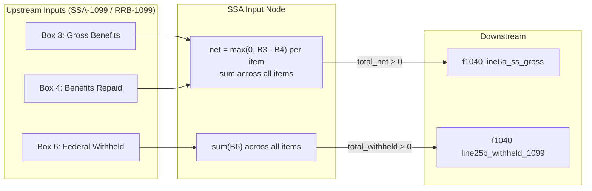

# SSA-1099 — Social Security Benefit Statement

## Overview

This screen captures Social Security (and equivalent Railroad Retirement Board) benefit amounts from Form SSA-1099 / RRB-1099. It routes the net benefit amount (Box 5) to Form 1040 line 6a and voluntary federal withholding (Box 6) to Form 1040 line 25b. Multiple SSA-1099s (e.g., taxpayer + spouse, or multiple corrections) are aggregated before routing. The taxability worksheet (determining how much of line 6a is taxable, shown on line 6b) is computed by a downstream intermediate node — not here.

**IRS Form:** SSA-1099 / RRB-1099
**Drake Screen:** SSA
**Tax Year:** 2025
**Drake Reference:** Authenticated (not publicly accessible); derived from IRS Form 1040 instructions

---

## Data Entry Fields

| Field | Type | Required | Drake Label | Description | IRS Reference | URL |
| ----- | ---- | -------- | ----------- | ----------- | ------------- | --- |
| payer_name | string | yes | Payer Name | Name of payer (Social Security Administration or Railroad Retirement Board) | Form SSA-1099, top of form | https://www.ssa.gov |
| box3_gross_benefits | number ≥0 | yes | Box 3 — Gross Benefits | Total social security benefits paid to you in 2025 | i1040gi.pdf, Lines 6a/6b instructions | .research/docs/i1040gi.pdf |
| box4_repaid | number ≥0 | no | Box 4 — Benefits Repaid | Total benefits you repaid to SSA or RRB in 2025 | i1040gi.pdf, Lines 6a/6b instructions | .research/docs/i1040gi.pdf |
| box6_federal_withheld | number ≥0 | no | Box 6 — Federal Tax Withheld | Voluntary federal income tax withheld (W-4V); shown in box 6 of Form SSA-1099 | i1040gi.pdf, Line 25b instructions | .research/docs/i1040gi.pdf |
| is_rrb | boolean | no | RRB-1099 | Check if this is a Railroad Retirement Board (RRB-1099) rather than SSA-1099; treated identically for federal taxability | i1040gi.pdf, Lines 6a/6b instructions | .research/docs/i1040gi.pdf |

---

## Per-Field Routing

| Field | Destination | How Used | Triggers | Limit / Cap | IRS Reference | URL |
| ----- | ----------- | -------- | -------- | ----------- | ------------- | --- |
| box3_gross_benefits − box4_repaid (= box5 net) | f1040 line6a_ss_gross | Sum of all items' net benefits (Box 5 = Box 3 - Box 4); if Box 4 > Box 3 for any item, clamp that item's net to 0 | Sum > 0 | None | i1040gi.pdf, Line 6a | .research/docs/i1040gi.pdf |
| box6_federal_withheld | f1040 line25b_withheld_1099 | Sum of all items' Box 6 amounts | Sum > 0 | None | i1040gi.pdf, Line 25b | .research/docs/i1040gi.pdf |
| box3_gross_benefits | (informational) | Not separately routed; only used internally to compute net = box3 - box4 | — | — | — | — |
| box4_repaid | (informational) | Used to compute net; if sum of box4 > sum of box3 across all items, no benefits are taxable | — | — | Pub 915; i1040gi.pdf | .research/docs/i1040gi.pdf |

---

## Calculation Logic

### Step 1 — Compute net benefit (Box 5) per item

```
net_i = max(0, box3_gross_benefits_i - (box4_repaid_i ?? 0))
```

Each item's net is clamped to zero if repayments exceed gross for that item.

> **Source:** IRS Form 1040 Instructions (i1040gi.pdf), Lines 6a and 6b section — "box 5" defined as Box 3 minus Box 4. `.research/docs/i1040gi.pdf`

### Step 2 — Aggregate net benefits across all items

```
total_net = sum(net_i for all items)
```

Form 1040 Worksheet Line 1 states: "Enter the total amount from box 5 of **all** your Forms SSA-1099 and RRB-1099."

> **Source:** IRS Form 1040 Instructions (i1040gi.pdf), Social Security Benefits Worksheet Line 1. `.research/docs/i1040gi.pdf`

### Step 3 — Route to Form 1040 line 6a

```
if total_net > 0:
  emit f1040 { line6a_ss_gross: total_net }
```

Line 6a shows the gross (net-of-repayments) Social Security amount. Line 6b (taxable portion) is computed by a downstream SS taxability intermediate node using the full tax return context.

> **Source:** IRS Form 1040 Instructions (i1040gi.pdf), Lines 6a and 6b. `.research/docs/i1040gi.pdf`

### Step 4 — Route federal withholding to Form 1040 line 25b

```
total_withheld = sum(box6_federal_withheld_i ?? 0 for all items)
if total_withheld > 0:
  emit f1040 { line25b_withheld_1099: total_withheld }
```

The IRS instructions for line 25b explicitly state: "This should be shown in box 4 of Form 1099, **box 6, of Form SSA-1099**, or box 10 of Form RRB-1099."

> **Source:** IRS Form 1040 Instructions (i1040gi.pdf), Line 25b — Form(s) 1099. `.research/docs/i1040gi.pdf`

---

## Constants & Thresholds (Tax Year 2025)

These constants are used in the downstream SS taxability intermediate node, NOT in this input node. Documented here for reference.

| Constant | Value | Source | URL |
| -------- | ----- | ------ | --- |
| Base amount — Married Filing Jointly | $32,000 | i1040gi.pdf, SS Benefits Worksheet Line 8 | .research/docs/i1040gi.pdf |
| Base amount — Single / HOH / QSS / MFS lived apart | $25,000 | i1040gi.pdf, SS Benefits Worksheet Line 8 | .research/docs/i1040gi.pdf |
| Base amount — MFS lived together any time in 2025 | $0 | i1040gi.pdf, SS Benefits Worksheet Line 8 | .research/docs/i1040gi.pdf |
| Second tier threshold — MFJ | $44,000 (= $32,000 + $12,000) | i1040gi.pdf, SS Benefits Worksheet Line 10 | .research/docs/i1040gi.pdf |
| Second tier threshold — Single / HOH / QSS / MFS apart | $34,000 (= $25,000 + $9,000) | i1040gi.pdf, SS Benefits Worksheet Line 10 | .research/docs/i1040gi.pdf |

---

## Data Flow Diagram



---

## Edge Cases & Special Rules

1. **Repayments exceed gross for a single item**: If `box4_repaid > box3_gross_benefits` for an individual item, clamp that item's net to 0. (The overall-return exception in i1040gi.pdf — "your total repayments (box 4) were more than your total benefits for 2025 (box 3)" — applies at the return level across all SSA items, handled by the downstream taxability node.)

2. **Multiple SSA-1099s (e.g., taxpayer + spouse, or corrected forms)**: Sum all items' net benefits before routing. The worksheet says "all your Forms SSA-1099 and RRB-1099."

3. **RRB-1099**: Treated identically to SSA-1099 for federal taxability. The `is_rrb` flag is informational; it does not change routing logic in this node.

4. **Zero net benefits**: If `total_net <= 0`, do not emit `line6a_ss_gross` output (no SS income to report).

5. **Lump-sum prior-year election (Pub 915 Method)**: Taxpayers may elect to treat lump-sum retroactive benefits under a special method (Worksheets 2–4 in Pub 915). This election is out of scope for this input node; it is handled by the downstream SS taxability intermediate node using the `lump_sum_year` flag passed through. However, the `box3_gross_benefits` still reflects the full amount received (including lump-sum portions).

6. **MFS — lived with spouse any time in 2025**: The $0 base amount means benefits may be 85% taxable regardless of income. This is determined by the downstream taxability node, not this input node.

7. **Workers' compensation offset**: Workers' comp amounts that reduce SS benefits are reflected in Box 3 (SSA computes the net before Box 3); this input node does not need a separate WC offset field.

---

## Sources

| Document | Year | Section | URL | Saved as |
| -------- | ---- | ------- | --- | -------- |
| IRS Form 1040 Instructions | 2025 | Lines 6a, 6b, 6c, 6d — Social Security Benefits | https://www.irs.gov/instructions/i1040gi | .research/docs/i1040gi.pdf |
| IRS Form 1040 Instructions | 2025 | Line 25b — Form(s) 1099 (Box 6 of SSA-1099) | https://www.irs.gov/instructions/i1040gi | .research/docs/i1040gi.pdf |
| IRS Form 1040 Instructions | 2025 | Social Security Benefits Worksheet — Lines 6a and 6b (all 18 lines) | https://www.irs.gov/instructions/i1040gi | .research/docs/i1040gi.pdf |
| IRS Publication 915 | 2025 | Worksheet A (quick taxability check), Box 3/4/5 definitions, Lump-sum rules | https://www.irs.gov/publications/p915 | .research/docs/p915.pdf (fetched via web, binary compressed) |
| IRS Tax Topic 423 | 2025 | Social Security Benefits — voluntary withholding, workers' comp offset, lump-sum | https://www.irs.gov/taxtopics/tc423 | — |
