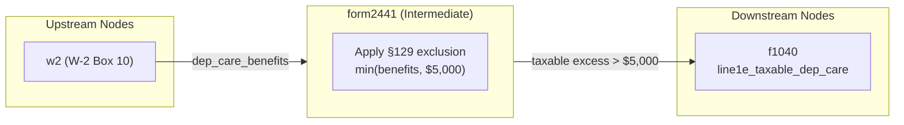

# Form 2441 — Child and Dependent Care Expenses (Intermediate Node)

## Overview

The intermediate `form2441` node receives **employer-provided dependent care benefits** (W-2 Box 10) from the W2 input node. It applies the IRC §129 exclusion limit and routes:

- **Taxable excess** (employer benefits exceeding the exclusion cap) → `f1040` line 1e
- There is no credit computation in this node; the child and dependent care credit is computed separately by the `f2441` input node (which handles the full Form 2441 credit workflow including out-of-pocket expenses, qualifying persons, and AGI-based credit rates).

**Role in the system:**
- `w2` input node → emits `dep_care_benefits` → `form2441` intermediate node
- `form2441` intermediate node → emits `line1e_taxable_dep_care` → `f1040` output node (only when employer benefits exceed exclusion limit)
- The `f2441` input node handles the full credit computation including the interaction with employer benefits

**IRS Form:** Form 2441, Part III (Dependent Care Benefits)
**Drake Screen:** 2441
**Tax Year:** 2025
**Drake Reference:** https://kb.drakesoftware.com/Site/Browse/13641

---

## Input Fields
Fields received from upstream NodeOutput objects.

| Field | Type | Source Node | Description | IRS Reference | URL |
| ----- | ---- | ----------- | ----------- | ------------- | --- |
| dep_care_benefits | number (nonneg) | w2 | Total Box 10 employer-provided dependent care benefits from all W-2s | Form 2441 Part III Line 12; IRC §129 | https://www.irs.gov/instructions/i2441 |

---

## Calculation Logic

### Step 1 — Apply IRC §129 exclusion limit

The maximum amount excludable from gross income for employer-provided dependent care is:
- **$5,000** — all filing statuses except married filing separately
- **$2,500** — married filing separately (MFS)

**Note on intermediate node scope:** The W2 node only sends `dep_care_benefits`; it does not send `filing_status`. The intermediate node defaults to the $5,000 limit. The MFS case ($2,500 limit) is handled by the `f2441` input node when taxpayer-level context (filing status) is available.

```
excluded_benefits = min(dep_care_benefits, 5000)
taxable_benefits = max(0, dep_care_benefits - 5000)
```

> **Source:** IRC §129(a)(2); Form 2441 Instructions, Part III Line 26, p.4 — https://www.irs.gov/instructions/i2441

### Step 2 — Route taxable excess to Form 1040 line 1e

If `taxable_benefits > 0`, emit to `f1040`:
```
{ line1e_taxable_dep_care: taxable_benefits }
```

Line 1e on Form 1040 reports taxable dependent care benefits (employer benefits that exceed the exclusion cap).

> **Source:** Form 1040 (2025), Line 1e; Form 2441 Instructions, Line 26 — https://www.irs.gov/instructions/i2441

### Step 3 — Zero case

If `dep_care_benefits` is 0 or absent, emit no outputs.

---

## Output Routing

| Output Field | Destination Node | Line / Field | Condition | IRS Reference | URL |
| ------------ | ---------------- | ------------ | --------- | ------------- | --- |
| line1e_taxable_dep_care | f1040 | Line 1e | dep_care_benefits > 5000 | Form 2441 Line 26; IRC §129(a)(2) | https://www.irs.gov/instructions/i2441 |

---

## Constants & Thresholds (Tax Year 2025)

| Constant | Value | Source | URL |
| -------- | ----- | ------ | --- |
| EMPLOYER_EXCLUSION_LIMIT | $5,000 | IRC §129(a)(2); Form 2441 Instructions p.4 | https://www.irs.gov/instructions/i2441 |

**Note:** The $2,500 MFS limit is NOT applicable in this node because the W2 node does not pass filing_status. MFS handling is in the `f2441` input node.

---

## Data Flow Diagram



---

## Edge Cases & Special Rules

1. **Benefits exactly at $5,000:** Fully excluded. No output to f1040.
2. **Benefits below $5,000:** Fully excluded. No output.
3. **Benefits above $5,000:** Excess is taxable income on line 1e.
4. **Zero or absent benefits:** No outputs.
5. **MFS limit ($2,500):** NOT handled here. The MFS case must be resolved at the `f2441` input node level where filing_status is known.
6. **Interaction with credit computation:** This node only handles the taxability of employer benefits. The credit itself (and the interaction between excluded benefits and the credit expense cap) is handled by `f2441` input node.

---

## Sources

| Document | Year | Section | URL | Saved as |
| -------- | ---- | ------- | --- | -------- |
| Form 2441 Instructions | 2025 | Part III, Lines 12–26 | https://www.irs.gov/instructions/i2441 | .research/docs/i2441.pdf |
| Form 2441 | 2025 | Part III | https://www.irs.gov/pub/irs-pdf/f2441.pdf | .research/docs/f2441.pdf |
| IRC §129 | current | (a)(2) — exclusion limit | https://www.law.cornell.edu/uscode/text/26/129 | N/A |
| IRS Publication 503 | 2025 | Employer-Provided Benefits | https://www.irs.gov/pub/irs-pdf/p503.pdf | .research/docs/p503.pdf |
