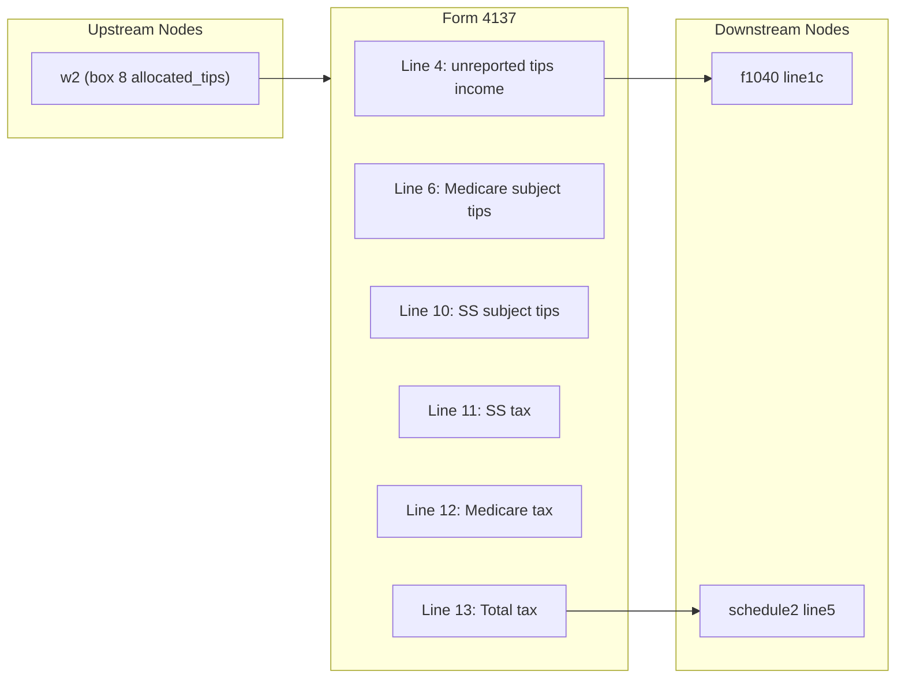

# Form 4137 — Social Security and Medicare Tax on Unreported Tip Income

## Overview
**IRS Form:** Form 4137
**Drake Screen:** 4137
**Tax Year:** 2025
**Drake Reference:** https://kb.drakesoftware.com (screen code 4137)

---
## Input Fields
| Field | Type | Source Node | Description | IRS Reference | URL |
| ----- | ---- | ----------- | ----------- | ------------- | --- |
| allocated_tips | number (nonneg) | w2 | W-2 box 8 allocated tips total | Form 4137 line 1 col(c) | https://www.irs.gov/pub/irs-pdf/f4137.pdf |
| total_tips_received | number (nonneg, optional) | screen 4137 | Total cash and charge tips received (line 2) | Form 4137 line 2 | https://www.irs.gov/pub/irs-pdf/f4137.pdf |
| reported_tips | number (nonneg, optional) | screen 4137 | Total tips reported to employer(s) (line 3) | Form 4137 line 3 | https://www.irs.gov/pub/irs-pdf/f4137.pdf |
| sub_$20_tips | number (nonneg, optional) | screen 4137 | Tips not required to report (<$20/month) (line 5) | Form 4137 line 5 | https://www.irs.gov/pub/irs-pdf/f4137.pdf |
| ss_wages_from_w2 | number (nonneg, optional) | w2/screen | W-2 boxes 3+7 total SS wages+tips (line 8) | Form 4137 line 8 | https://www.irs.gov/pub/irs-pdf/f4137.pdf |

---
## Calculation Logic
### Step 1 — Unreported Tip Income (Line 4)
`unreported_tips = total_tips_received - reported_tips`
Default: if only `allocated_tips` provided, use that as `unreported_tips`.
This amount is included as income on Form 1040 line 1c.

### Step 2 — Sub-$20 Tips Exclusion (Line 5)
`sub_$20 = sub_$20_tips ?? 0`
Tips totaling less than $20 in a calendar month are not subject to SS/Medicare tax.

### Step 3 — Medicare Subject Tips (Line 6)
`medicare_subject = unreported_tips - sub_$20`
All unreported tips above the $20/month threshold are subject to Medicare tax.

### Step 4 — SS Wage Base Room (Lines 7-9)
`ss_room = max(0, SS_WAGE_BASE - ss_wages_from_w2)`
SS_WAGE_BASE = $176,100 for TY2025.

### Step 5 — SS Subject Tips (Line 10)
`ss_subject = min(medicare_subject, ss_room)`
Capped at the remaining SS wage base room.

### Step 6 — SS Tax (Line 11)
`ss_tax = ss_subject × 0.062`

### Step 7 — Medicare Tax (Line 12)
`medicare_tax = medicare_subject × 0.0145`

### Step 8 — Total Tax (Line 13)
`total_tax = ss_tax + medicare_tax`
Goes to Schedule 2 line 5.

---
## Output Routing
| Output Field | Destination Node | Line / Field | Condition | IRS Reference | URL |
| ------------ | ---------------- | ------------ | --------- | ------------- | --- |
| unreported_tip_income | f1040 | line1c_unreported_tips | unreported_tips > 0 | Form 4137 line 4 | https://www.irs.gov/pub/irs-pdf/f4137.pdf |
| unreported_tip_tax | schedule2 | line5_unreported_tip_tax | total_tax > 0 | Form 4137 line 13 | https://www.irs.gov/pub/irs-pdf/f4137.pdf |

---
## Constants & Thresholds (Tax Year 2025)
| Constant | Value | Source | URL |
| -------- | ----- | ------ | --- |
| SS_WAGE_BASE | $176,100 | Form 4137 line 7; IRS What's New 2025 | https://www.irs.gov/pub/irs-pdf/f4137.pdf |
| SS_RATE | 6.2% (0.062) | Form 4137 line 11 | https://www.irs.gov/pub/irs-pdf/f4137.pdf |
| MEDICARE_RATE | 1.45% (0.0145) | Form 4137 line 12 | https://www.irs.gov/pub/irs-pdf/f4137.pdf |

---
## Data Flow Diagram

---
## Edge Cases & Special Rules
- If `total_tips_received` not provided, use `allocated_tips` as the unreported tip amount (W2 box 8 is the trigger)
- If `reported_tips` >= `total_tips_received`, no unreported tips → no outputs
- If SS wages from W-2 >= $176,100, no SS tax (line 9 = 0)
- Tips < $20/month are NOT subject to SS or Medicare tax (line 5 exclusion)
- Line 6 also feeds Form 8959 line 2 for Additional Medicare Tax calculation
- Railroad Retirement Tax Act employees: don't use Form 4137 (out of scope)
- $20/month rule applies per-employer, not in aggregate

---
## Sources
| Document | Year | Section | URL | Saved as |
| -------- | ---- | ------- | --- | -------- |
| Form 4137 | 2025 | All lines | https://www.irs.gov/pub/irs-pdf/f4137.pdf | .research/docs/f4137.pdf |
| IRS About Form 4137 | 2025 | Purpose | https://www.irs.gov/forms-pubs/about-form-4137 | N/A |
| Publication 531 | 2025 | Tip reporting | https://www.irs.gov/publications/p531 | N/A |
