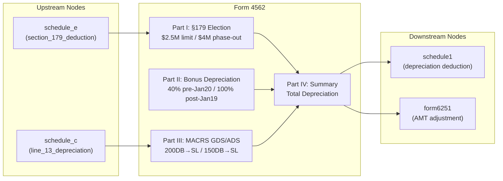

# Form 4562 — Depreciation and Amortization

## Overview
**IRS Form:** Form 4562
**Drake Screen:** 4562 (screen_code: "4562")
**Tax Year:** 2025

---
## Input Fields
| Field | Type | Source Node | Description | IRS Reference | URL |
| ----- | ---- | ----------- | ----------- | ------------- | --- |
| section_179_deduction | number | schedule_e | Pre-computed §179 election amount from real estate professionals | Part I, Line 12 | https://www.irs.gov/instructions/i4562 |
| section_179_cost | number | (direct) | Total cost of §179 property placed in service | Part I, Line 2 | https://www.irs.gov/instructions/i4562 |
| section_179_carryover | number | (direct) | Disallowed §179 carryover from 2024 | Part I, Line 10 | https://www.irs.gov/instructions/i4562 |
| business_income_limit | number | (direct) | Taxable income from active trade/business for §179 income limit | Part I, Line 11 | https://www.irs.gov/instructions/i4562 |
| bonus_depreciation_basis | number | (direct) | Depreciable basis eligible for bonus depreciation (pre-Jan 20, 2025) | Part II, Line 14 | https://www.irs.gov/instructions/i4562 |
| bonus_depreciation_basis_post_jan19 | number | (direct) | Depreciable basis eligible for 100% bonus (post-Jan 19, 2025) | Part II, Line 14 | https://www.irs.gov/instructions/i4562 |
| macrs_gds_basis | number | (direct) | Unadjusted basis of GDS MACRS property placed in service | Part III-A, Lines 19a-19j | https://www.irs.gov/instructions/i4562 |
| macrs_gds_recovery_period | number | (direct) | GDS recovery period in years (3,5,7,10,15,20) | Part III-A, Lines 19a-19j | https://www.irs.gov/instructions/i4562 |
| macrs_gds_year_of_service | number | (direct) | Which year of recovery (1-N) for MACRS percentage lookup | Part III-A, Line 19 col g | https://www.irs.gov/instructions/i4562 |
| macrs_ads_basis | number | (direct) | Unadjusted basis of ADS MACRS property | Part III-C, Lines 20a-20e | https://www.irs.gov/instructions/i4562 |
| macrs_prior_depreciation | number | (direct) | MACRS depreciation on assets placed in service in prior years | Part III-A, Line 17 | https://www.irs.gov/instructions/i4562 |
| listed_property_depreciation | number | (direct) | Depreciation on listed property (Part V result) | Part IV, Line 22 | https://www.irs.gov/instructions/i4562 |
| amortization_amount | number | (direct) | Amortization for costs beginning in 2025 (Part VI, Line 42) | Part VI, Line 44 | https://www.irs.gov/instructions/i4562 |
| elect_out_bonus | boolean | (direct) | Election to not claim special depreciation allowance | Part II | https://www.irs.gov/instructions/i4562 |
| elect_40pct_bonus | boolean | (direct) | Election to take 40% instead of 100% for post-Jan-19 property | Part II | https://www.irs.gov/instructions/i4562 |

---
## Calculation Logic

### Step 1 — Section 179 Election (Part I)
1. Start with max §179 limit: $2,500,000
2. Reduce by: max(0, total_cost_of_179_property - $4,000,000) (phase-out)
3. Elected amount = min(cost, reduced limit)
4. Apply business income limitation: elected amount cannot exceed taxable income from active trade/business
5. Disallowed amount = carryover to 2026 (Line 13)

### Step 2 — Special Depreciation Allowance (Part II, Line 14)
- Property placed in service before Jan 20, 2025: 40% of depreciable basis (60% for long-production/aircraft)
- Property placed in service after Jan 19, 2025: 100% of depreciable basis (or elect 40%)
- If elect_out_bonus=true: 0%
- Depreciable basis = cost - §179 deduction - any credits

### Step 3 — MACRS GDS Depreciation (Part III-A, Lines 19a-19j)
- Use Table A percentages (200DB/HY convention) for 3,5,7,10-year property
- Use Table B percentages (150DB/HY) for 15,20-year property
- Multiply unadjusted basis (net of §179 and bonus) by applicable percentage
- Prior-year MACRS goes on Line 17

### Step 4 — Summary (Part IV, Line 22)
- Total depreciation = §179 + bonus + MACRS prior + MACRS current + listed property

### Step 5 — AMT Adjustment
- 200DB vs 150DB difference triggers AMT preference → route to form6251

---
## Output Routing
| Output Field | Destination Node | Line / Field | Condition | IRS Reference | URL |
| ------------ | ---------------- | ------------ | --------- | ------------- | --- |
| total_depreciation | schedule1 | Line 3 (via Sch C) / Line 17 (via Sch E) | Always | Part IV Line 22 | https://www.irs.gov/instructions/i4562 |
| amt_depreciation_adjustment | form6251 | Line 2m | When 200DB used (200DB - 150DB difference) | Instructions p.3 | https://www.irs.gov/instructions/i4562 |
| section_179_allowed | schedule1 | Carried to business schedule | When §179 elected | Part I Line 12 | https://www.irs.gov/instructions/i4562 |

---
## Constants & Thresholds (Tax Year 2025)
| Constant | Value | Source | URL |
| -------- | ----- | ------ | --- |
| SECTION_179_LIMIT | $2,500,000 | P.L. 119-21 (One Big Beautiful Bill Act) | https://www.irs.gov/instructions/i4562 |
| SECTION_179_PHASEOUT_THRESHOLD | $4,000,000 | IRS Instructions Line 3 | https://www.irs.gov/instructions/i4562 |
| SUV_SECTION_179_CAP | $31,300 | IRS Instructions Line 26/27 col (i) | https://www.irs.gov/instructions/i4562 |
| BONUS_DEPRECIATION_PRE_JAN20 | 40% (60% long-production) | P.L. 119-21 §70301 | https://www.irs.gov/instructions/i4562 |
| BONUS_DEPRECIATION_POST_JAN19 | 100% (elect 40%) | P.L. 119-21 §70301 | https://www.irs.gov/instructions/i4562 |
| LUXURY_AUTO_YEAR1_2025 | $12,200 (no bonus) / $20,200 (with bonus) | Table 2 | https://www.irs.gov/instructions/i4562 |
| LUXURY_AUTO_YEAR2_PLUS | $19,600 (year 2) | Table 2 | https://www.irs.gov/instructions/i4562 |

---
## Data Flow Diagram

---
## Edge Cases & Special Rules

1. **§179 phase-out**: Dollar-for-dollar reduction above $4,000,000 — at $6,500,000 the deduction is zero
2. **Business income limit**: §179 cannot exceed taxable income from active trade/business; disallowed = carryover
3. **SUV cap**: §179 for SUVs limited to $31,300 regardless of cost
4. **Bonus election-out**: Irrevocable election to not claim bonus depreciation
5. **AMT**: 200DB generates AMT preference (200DB - 150DB); 150DB or SL = no AMT adjustment
6. **Listed property ≤50% business use**: No §179, no bonus — must use ADS straight-line
7. **Mid-quarter convention**: Applies when >40% of total MACRS basis placed in service in Q4
8. **Luxury auto limits**: Annual cap applies regardless of actual depreciation computed
9. **Post-Jan 19, 2025 property**: Eligible for 100% bonus (new P.L. 119-21 rules)

---
## Sources
| Document | Year | Section | URL | Saved as |
| -------- | ---- | ------- | --- | -------- |
| Instructions for Form 4562 | 2025 | Full | https://www.irs.gov/pub/irs-pdf/i4562.pdf | .research/docs/i4562.pdf |
| IRS Form 4562 | 2025 | All Parts | https://www.irs.gov/pub/irs-pdf/f4562.pdf | N/A |
| P.L. 119-21 (One Big Beautiful Bill Act) | 2025 | §70301 | https://www.congress.gov | N/A |
