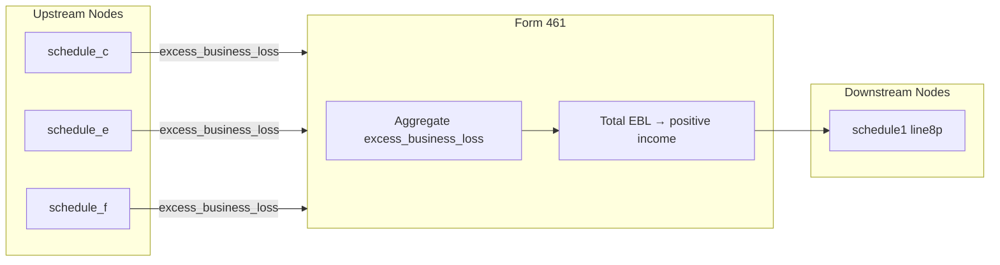

# Form 461 — Limitation on Business Losses

## Overview
**IRS Form:** Form 461
**Drake Screen:** 461
**Tax Year:** 2025

---
## Input Fields
| Field | Type | Source Node | Description | IRS Reference | URL |
| ----- | ---- | ----------- | ----------- | ------------- | --- |
| excess_business_loss | number (nonneg) | schedule_c, schedule_e, schedule_f | Pre-computed excess business loss from upstream nodes | IRC §461(l) | https://www.irs.gov/pub/irs-pdf/i461.pdf |
| filing_status | FilingStatus enum | upstream | Determines threshold ($313k single / $626k MFJ) | Rev. Proc. 2024-40 §2.32 | https://www.irs.gov/pub/irs-pdf/i461.pdf |

**Design note:** Upstream nodes (schedule_c) compute the threshold check and send only the pre-computed
excess to form461. form461 aggregates excesses from all upstream sources and routes the total to
Schedule 1 Line 8p.

---
## Calculation Logic
### Step 1 — Aggregate excess business losses
Sum all `excess_business_loss` values received from upstream nodes (accumulator pattern).

### Step 2 — Route to Schedule 1 Line 8p
The total excess business loss is reported as "other income" on Schedule 1 Line 8p with notation "ELA".
It is entered as a **positive number** (increases taxable income).

### Step 3 — NOL carryforward (informational)
The excess business loss becomes a Net Operating Loss (NOL) carryforward per Form 172.
This is tracked for subsequent years but not computed within the current-year return.

---
## Output Routing
| Output Field | Destination Node | Line / Field | Condition | IRS Reference | URL |
| ------------ | ---------------- | ------------ | --------- | ------------- | --- |
| line8p_excess_business_loss | schedule1 | Schedule 1 Line 8p | total > 0 | IRC §461(l) | https://www.irs.gov/pub/irs-pdf/i461.pdf |

---
## Constants & Thresholds (Tax Year 2025)
| Constant | Value | Source | URL |
| -------- | ----- | ------ | --- |
| EBL_THRESHOLD_SINGLE | $313,000 | Rev. Proc. 2024-40, Sec. 2.32 | https://www.irs.gov/irb/2024-45_IRB#REV-PROC-2024-40 |
| EBL_THRESHOLD_MFJ | $626,000 | Rev. Proc. 2024-40, Sec. 2.32 | https://www.irs.gov/irb/2024-45_IRB#REV-PROC-2024-40 |

---
## Data Flow Diagram

---
## Edge Cases & Special Rules
1. **Zero excess**: If total excess = 0, emit no outputs (early return).
2. **Accumulation**: Multiple upstream nodes may contribute; total is the sum.
3. **MFJ threshold**: $626,000 (double the single threshold). Determined by upstream, not form461 itself.
4. **Capital losses**: Losses from capital assets are NOT included in business deductions for EBL purposes.
5. **At-risk / passive**: EBL rules apply AFTER at-risk (Form 6198) and passive activity (Form 8582) rules.
6. **Noncorporate only**: Form 461 applies only to noncorporate taxpayers.
7. **NOL carryforward**: Excess becomes an NOL under Form 172, not deductible in current year.
8. **OBBBA**: P.L. 119-21 permanently extended the disallowance (no sunset).

---
## Sources
| Document | Year | Section | URL | Saved as |
| -------- | ---- | ------- | --- | -------- |
| Instructions for Form 461 | 2025 | General & Specific Instructions | https://www.irs.gov/pub/irs-pdf/i461.pdf | .research/docs/i461.pdf |
| Rev. Proc. 2024-40 | 2024 | Sec. 2.32 | https://www.irs.gov/irb/2024-45_IRB#REV-PROC-2024-40 | — |
| IRC §461(l) | — | Limitation on excess business losses | https://uscode.house.gov/view.xhtml?req=granuleid:USC-prelim-title26-section461 | — |
