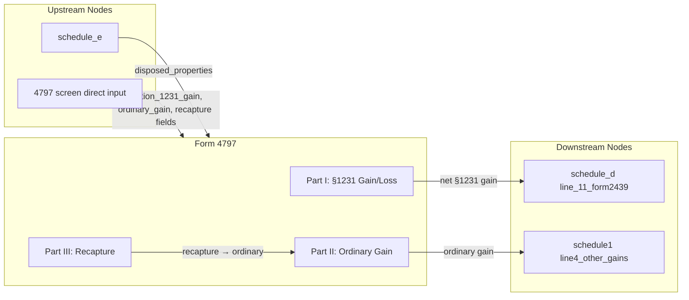

# Form 4797 — Sales of Business Property

## Overview
**IRS Form:** Form 4797
**Drake Screen:** 4797
**Tax Year:** 2025

---
## Input Fields
| Field | Type | Source Node | Description | IRS Reference | URL |
| ----- | ---- | ----------- | ----------- | ------------- | --- |
| disposed_properties | number | schedule_e | Count of disposed rental properties | Sch E Part II | — |
| section_1231_gain | number | direct (4797 screen) | Net §1231 gain from Part I line 9 (after nonrecaptured loss offset) | IRC §1231 | — |
| section_1231_loss | number | direct (4797 screen) | Net §1231 loss from Part I line 7 (when negative) | IRC §1231 | — |
| ordinary_gain | number | direct (4797 screen) | Part II line 18b/20 ordinary gain (incl. recaptured depreciation from Part III) | IRC §1245/1250 | — |
| recapture_1245 | number | direct (4797 screen) | §1245 depreciation recapture from Part III line 25 | IRC §1245 | — |
| recapture_1250 | number | direct (4797 screen) | §1250 additional depreciation recapture from Part III line 26 | IRC §1250 | — |
| nonrecaptured_1231_loss | number | direct (4797 screen) | Prior-year nonrecaptured §1231 losses (Part I line 8) | IRC §1231(c) | — |

---
## Calculation Logic

### Step 1 — Part I: Net Section 1231 Gain/Loss
- Taxpayer provides gross §1231 gain (line 7 if positive) and nonrecaptured prior losses (line 8)
- Net §1231 gain = section_1231_gain − nonrecaptured_1231_loss (floor 0)
- If result > 0, that amount goes to Schedule D line 11 as long-term capital gain
- The portion offset by nonrecaptured losses becomes ordinary income (line 12 → Part II)

### Step 2 — Part II: Ordinary Gains and Losses
- ordinary_gain is the pre-computed total from Part II (line 18b + Part III recapture)
- Routes to Schedule 1 as "other gains" (line 4 of Schedule 1 / Form 1040 line 4)

### Step 3 — Recapture amounts
- recapture_1245 and recapture_1250 are included in ordinary_gain; no separate routing needed
- The recaptured ordinary income from prior §1231 losses also included in ordinary_gain

---
## Output Routing
| Output Field | Destination Node | Line / Field | Condition | IRS Reference | URL |
| ------------ | ---------------- | ------------ | --------- | ------------- | --- |
| net_section_1231_gain | schedule_d | line_11_form2439 | section_1231_gain > nonrecaptured_1231_loss | IRC §1231; Sch D line 11 | — |
| ordinary_gain | schedule1 | line4_other_gains | ordinary_gain > 0 | F1040 line 4 / Sch 1 line 4 | — |

---
## Constants & Thresholds (Tax Year 2025)
| Constant | Value | Source | URL |
| -------- | ----- | ------ | --- |
| None | — | — | — |

---
## Data Flow Diagram

---
## Edge Cases & Special Rules
- When section_1231_gain ≤ nonrecaptured_1231_loss: the entire gain is ordinary income (no LT capital gain to Schedule D)
- When section_1231_gain is zero or negative (pure §1231 loss): ordinary loss, no output to Schedule D
- disposed_properties alone (from schedule_e) is an indicator field — does not drive computation; actual sale data must be present
- Part III recapture (§1245/§1250) is always ordinary income regardless of holding period
- §1250 recapture for MACRS post-1986 real property is generally $0 (straight-line depreciation); unrecaptured §1250 gain is capital gain handled by the unrecaptured_1250_worksheet

---
## Sources
| Document | Year | Section | URL | Saved as |
| -------- | ---- | ------- | --- | -------- |
| Instructions for Form 4797 | 2025 | All Parts | https://www.irs.gov/pub/irs-pdf/i4797.pdf | .research/docs/i4797.pdf |
| IRC §1231 | — | Net §1231 gain/loss | — | — |
| IRC §1245 | — | Depreciation recapture | — | — |
| IRC §1250 | — | Additional depreciation recapture | — | — |
