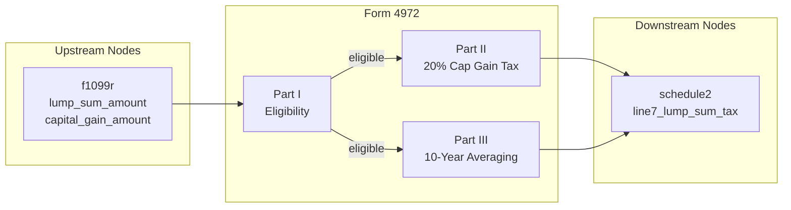

# Form 4972 — Tax on Lump-Sum Distributions

## Overview
**IRS Form:** Form 4972
**Drake Screen:** 4972
**Tax Year:** 2025

Form 4972 computes the special tax on qualifying lump-sum distributions from qualified retirement plans. Available only to taxpayers (or their beneficiaries) born before January 2, 1936. The taxpayer may elect either or both: (a) 20% capital gain treatment on the pre-1974 portion (Part II), and (b) 10-year averaging on the ordinary income portion (Part III). The resulting tax replaces normal income tax on the distributed amount and is added to Schedule 2, line 7.

---
## Input Fields
| Field | Type | Source Node | Description | IRS Reference | URL |
| ----- | ---- | ----------- | ----------- | ------------- | --- |
| lump_sum_amount | number | f1099r | Total gross distribution (box1_gross) | Form 4972, Line 8 | https://www.irs.gov/pub/irs-pdf/f4972.pdf |
| capital_gain_amount | number | f1099r | Pre-1974 capital gain (box3_capital_gain) | Form 4972, Part II, Line 6 | https://www.irs.gov/pub/irs-pdf/f4972.pdf |
| born_before_1936 | boolean | user | Taxpayer/participant born before 1/2/1936 | Form 4972, Part I, Q1 | https://www.irs.gov/pub/irs-pdf/f4972.pdf |
| elect_capital_gain | boolean | user | Elect 20% capital gain treatment (Part II) | Form 4972, Part I | https://www.irs.gov/pub/irs-pdf/f4972.pdf |
| elect_10yr_averaging | boolean | user | Elect 10-year averaging (Part III) | Form 4972, Part I | https://www.irs.gov/pub/irs-pdf/f4972.pdf |
| death_benefit_exclusion | number | user | Pre-1984 death benefit exclusion (up to $5,000) | Form 4972, Part III, Line 10 | https://www.irs.gov/pub/irs-pdf/f4972.pdf |

---
## Calculation Logic

### Part I — Eligibility Check
Taxpayer must be born before January 2, 1936 (or the participant in the plan died and was born before 1/2/1936). This is the primary eligibility gate.

### Part II — Capital Gain Election (20%)
- Line 6: Capital gain portion (pre-1974 participation) = box3_capital_gain from 1099-R
- Line 7: Tax = Line 6 × 20%

### Part III — 10-Year Averaging
1. Line 8: Adjusted total taxable amount (lump_sum_amount)
2. Line 9: Subtract capital gain portion elected in Part II → ordinary income = Line 8 − Line 6
3. Line 10: Death benefit exclusion (pre-1984 plans only, up to $5,000)
4. Line 11: 1/10 of (Line 9 − Line 10) = one-tenth ordinary income
5. Line 12: Tax on Line 11 using the 1986 single-filer rate schedule
6. Line 13: Line 12 × 10 = tentative tax
7. Lines 14–17: Minimum Distribution Allowance (MDA) computation
   - MDA = lesser of $10,000 or 50% of total taxable amount
   - Reduced by 20% × (total taxable − $20,000) when total taxable > $20,000
   - MDA = 0 when total taxable ≥ $70,000
8. Line 18: Adjusted tax = Line 13 minus reduction from MDA

### Total Tax
= Part II tax (Line 7) + Part III tax (Line 18), when respective elections made

---
## Output Routing
| Output Field | Destination Node | Line / Field | Condition | IRS Reference | URL |
| ------------ | ---------------- | ------------ | --------- | ------------- | --- |
| lump_sum_tax | schedule2 | line7_lump_sum_tax | always when eligible | Form 4972, Line 7 + Line 18 | https://www.irs.gov/pub/irs-pdf/f4972.pdf |

---
## Constants & Thresholds (Tax Year 2025)
| Constant | Value | Source | URL |
| -------- | ----- | ------ | --- |
| CAPITAL_GAIN_RATE | 0.20 (20%) | Form 4972 Part II | https://www.irs.gov/pub/irs-pdf/f4972.pdf |
| MDA_MAX | $10,000 | Form 4972, Line 15 | https://www.irs.gov/pub/irs-pdf/f4972.pdf |
| MDA_PHASE_OUT_THRESHOLD | $20,000 | Form 4972, Line 16 | https://www.irs.gov/pub/irs-pdf/f4972.pdf |
| MDA_PHASE_OUT_RATE | 20% | Form 4972, Line 16 | https://www.irs.gov/pub/irs-pdf/f4972.pdf |
| DEATH_BENEFIT_MAX | $5,000 | Form 4972, Line 10 | https://www.irs.gov/pub/irs-pdf/f4972.pdf |
| ELIGIBILITY_BIRTHDATE | 1936-01-02 | Form 4972, Part I | https://www.irs.gov/pub/irs-pdf/f4972.pdf |

### 1986 Single-Filer Rate Schedule (10-year averaging)
| Income Over | But Not Over | Tax Rate |
|-------------|--------------|----------|
| $0 | $2,480 | 11% |
| $2,480 | $3,670 | 12% |
| $3,670 | $5,940 | 14% |
| $5,940 | $8,200 | 15% |
| $8,200 | $12,840 | 16% |
| $12,840 | $17,270 | 18% |
| $17,270 | $22,900 | 20% |
| $22,900 | $26,700 | 23% |
| $26,700 | $34,500 | 26% |
| $34,500 | $43,800 | 30% |
| $43,800 | $60,600 | 34% |
| $60,600 | $85,600 | 38% |
| $85,600 | $109,400 | 42% |
| $109,400 | $162,400 | 45% |
| $162,400 | $215,400 | 49% |
| $215,400 | — | 50% |

---
## Data Flow Diagram

---
## Edge Cases & Special Rules
- No output if born_before_1936 = false (not eligible)
- No output if neither elect_capital_gain nor elect_10yr_averaging
- If only Part II elected: only capital gain tax (Line 7) flows to Schedule 2
- If only Part III elected: only 10-year averaging tax flows to Schedule 2
- Death benefit exclusion ($5,000 max) only available for pre-1984 distributions
- MDA computation: if total taxable ≤ $20,000, MDA = min($10,000, 50% × taxable)
  - If total taxable > $20,000: subtract 20% × (taxable − $20,000) from the base MDA
  - MDA cannot be negative
- The 10-year averaging uses the 1986 rate schedule (not current year rates)

---
## Sources
| Document | Year | Section | URL | Saved as |
| -------- | ---- | ------- | --- | -------- |
| Form 4972 | 2024 | All parts | https://www.irs.gov/pub/irs-pdf/f4972.pdf | — |
| Instructions for Form 4972 | 2024 | All | https://www.irs.gov/instructions/i4972 | — |
| Publication 575 | 2024 | Lump-Sum Distributions | https://www.irs.gov/publications/p575 | — |
| f1099r context.md | 2025 | Form 4972 routing | project file | — |
