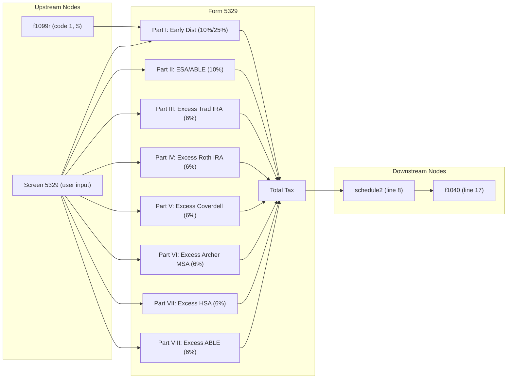

# Form 5329 — Additional Taxes on Qualified Plans

## Overview
**IRS Form:** Form 5329
**Drake Screen:** 5329
**Tax Year:** 2025

---
## Input Fields
| Field | Type | Source Node | Description | IRS Reference | URL |
| ----- | ---- | ----------- | ----------- | ------------- | --- |
| early_distribution | number (optional) | f1099r | Taxable early distribution amount (line 1) | Part I, Line 1 | https://www.irs.gov/pub/irs-pdf/f5329.pdf |
| early_distribution_exception | number (optional) | user/screen | Exception code 01–23 or 99 (line 2) | Part I, Line 2 | https://www.irs.gov/pub/irs-pdf/f5329.pdf |
| simple_ira_early_distribution | number (optional) | f1099r | Early dist from SIMPLE IRA within 2 years (25% rate) | Part I, Line 4 caution | https://www.irs.gov/instructions/i5329 |
| esa_able_distribution | number (optional) | user/screen | Taxable ESA/QTP/ABLE distribution (Part II, line 5) | Part II, Line 5 | https://www.irs.gov/pub/irs-pdf/f5329.pdf |
| esa_able_exception | number (optional) | user/screen | Exception amount for ESA/ABLE (line 6) | Part II, Line 6 | https://www.irs.gov/pub/irs-pdf/f5329.pdf |
| excess_traditional_ira | number (optional) | user/screen | Excess contributions to traditional IRAs (line 16) | Part III, Line 16 | https://www.irs.gov/pub/irs-pdf/f5329.pdf |
| traditional_ira_value | number (optional) | user/screen | FMV of traditional IRAs on Dec 31, 2025 | Part III, Line 17 | https://www.irs.gov/pub/irs-pdf/f5329.pdf |
| excess_roth_ira | number (optional) | user/screen | Excess contributions to Roth IRAs (line 24) | Part IV, Line 24 | https://www.irs.gov/pub/irs-pdf/f5329.pdf |
| roth_ira_value | number (optional) | user/screen | FMV of Roth IRAs on Dec 31, 2025 | Part IV, Line 25 | https://www.irs.gov/pub/irs-pdf/f5329.pdf |
| excess_coverdell_esa | number (optional) | user/screen | Excess contributions to Coverdell ESAs (line 32) | Part V, Line 32 | https://www.irs.gov/pub/irs-pdf/f5329.pdf |
| coverdell_esa_value | number (optional) | user/screen | FMV of Coverdell ESAs on Dec 31, 2025 | Part V, Line 33 | https://www.irs.gov/pub/irs-pdf/f5329.pdf |
| excess_archer_msa | number (optional) | user/screen | Excess contributions to Archer MSAs (line 40) | Part VI, Line 40 | https://www.irs.gov/pub/irs-pdf/f5329.pdf |
| archer_msa_value | number (optional) | user/screen | FMV of Archer MSAs on Dec 31, 2025 | Part VI, Line 41 | https://www.irs.gov/pub/irs-pdf/f5329.pdf |
| excess_hsa | number (optional) | user/screen | Excess contributions to HSAs (line 48) | Part VII, Line 48 | https://www.irs.gov/pub/irs-pdf/f5329.pdf |
| hsa_value | number (optional) | user/screen | FMV of HSAs on Dec 31, 2025 | Part VII, Line 49 | https://www.irs.gov/pub/irs-pdf/f5329.pdf |
| excess_able | number (optional) | user/screen | Excess contributions to ABLE account (line 50) | Part VIII, Line 50 | https://www.irs.gov/pub/irs-pdf/f5329.pdf |
| able_value | number (optional) | user/screen | FMV of ABLE account on Dec 31, 2025 | Part VIII, Line 51 | https://www.irs.gov/pub/irs-pdf/f5329.pdf |

---
## Calculation Logic
### Step 1 — Part I: Early Distributions (10% or 25% penalty)
- Line 1: early distribution amount
- Line 2: exception amount (fully or partially exempt portion)
- Line 3: line 1 − line 2 = amount subject to tax
- Line 4: 10% × line 3 (or 25% if SIMPLE IRA within first 2 years, code S)
- → Schedule 2 line 8

### Step 2 — Part II: ESA/ABLE Distributions (10% penalty)
- Line 5: taxable ESA/QTP/ABLE distributions
- Line 6: exception amount
- Line 7: line 5 − line 6
- Line 8: 10% × line 7
- → Schedule 2 line 8

### Step 3 — Part III: Excess Traditional IRA Contributions (6% penalty)
- Line 16: total excess contributions (current + carryover)
- Line 17: 6% × min(line 16, traditional_ira_value)
- → Schedule 2 line 8

### Step 4 — Part IV: Excess Roth IRA Contributions (6% penalty)
- Line 24: total excess Roth contributions
- Line 25: 6% × min(line 24, roth_ira_value)
- → Schedule 2 line 8

### Step 5 — Parts V–VIII: Excess Contributions to ESA/MSA/HSA/ABLE (6% each)
- Formula: 6% × min(excess, account_value)
- → Schedule 2 line 8

---
## Output Routing
| Output Field | Destination Node | Line / Field | Condition | IRS Reference | URL |
| ------------ | ---------------- | ------------ | --------- | ------------- | --- |
| line8_form5329_tax | schedule2 | line 8 | total > 0 | Form 5329 (all parts) → Sch 2 line 8 | https://www.irs.gov/pub/irs-pdf/f5329.pdf |

---
## Constants & Thresholds (Tax Year 2025)
| Constant | Value | Source | URL |
| -------- | ----- | ------ | --- |
| EARLY_DIST_RATE | 0.10 (10%) | IRC §72(t)(1) | https://www.irs.gov/instructions/i5329 |
| SIMPLE_IRA_RATE | 0.25 (25%) | IRC §72(t)(6) | https://www.irs.gov/instructions/i5329 |
| EXCESS_CONTRIB_RATE | 0.06 (6%) | IRC §4973 | https://www.irs.gov/instructions/i5329 |

---
## Data Flow Diagram

---
## Edge Cases & Special Rules
- SIMPLE IRA within first 2 years of participation: 25% rate (not 10%) — code S on 1099-R
- Exception codes (01–23, 99): reduce early distribution subject to tax
- Excess contributions: tax is 6% of lesser of (excess amount) or (account FMV on Dec 31)
- Part IX (RMD 25% penalty) is NOT present on 2025 Form 5329 — do not implement
- If no penalty applies (all exceptions or zero excess), no output is produced
- All penalty amounts aggregate to a single Schedule 2 line 8 output

---
## Sources
| Document | Year | Section | URL | Saved as |
| -------- | ---- | ------- | --- | -------- |
| Form 5329 | 2025 | All parts | https://www.irs.gov/pub/irs-pdf/f5329.pdf | .research/docs/f5329.pdf |
| Instructions for Form 5329 | 2025 | All | https://www.irs.gov/pub/irs-pdf/i5329.pdf | .research/docs/i5329.pdf |
