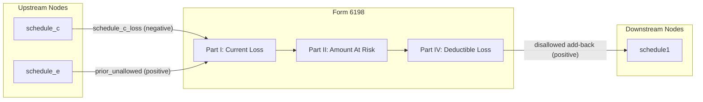

# Form 6198 — At-Risk Limitations

## Overview
**IRS Form:** Form 6198
**Drake Screen:** 6198
**Tax Year:** 2025

---
## Input Fields
| Field | Type | Source Node | Description | IRS Reference | URL |
| ----- | ---- | ----------- | ----------- | ------------- | --- |
| schedule_c_loss | number (≤0) | schedule_c | Net loss from Schedule C activity when "not all at risk" box checked | Part I Line 1 | https://www.irs.gov/instructions/i6198 |
| prior_unallowed | number (≥0) | schedule_e | Prior year suspended at-risk losses carried forward | Part I Line 1 | https://www.irs.gov/instructions/i6198 |
| amount_at_risk | number (≥0) | (taxpayer input) | Amount at risk at end of tax year (Part II line 10b or Part III line 19b) | Part II/III | https://www.irs.gov/instructions/i6198 |
| current_year_income | number (optional) | (taxpayer input) | Income/gains from activity (lines 1-4 when positive) | Part I Lines 1-4 | https://www.irs.gov/instructions/i6198 |

---
## Calculation Logic
### Step 1 — Current Year Profit/Loss (Part I, Line 5)
- Line 5 = sum of income lines (1-4) minus deduction lines (1-4 losses)
- Input: schedule_c_loss (negative) + prior_unallowed (as loss carryforward)

### Step 2 — Amount At Risk (Part II Line 10b or Part III Line 19b)
- Simplified: provided directly as `amount_at_risk`
- Represents taxpayer's economic stake (recourse loans + cash invested + QNF for real property)

### Step 3 — Deductible Loss (Part IV, Line 21)
- If line 5 profit ≥ 0: no limitation, report all items in full
- If line 5 loss ≤ amount_at_risk: loss fully deductible (line 21 = line 5)
- If line 5 loss > amount_at_risk: deductible loss limited to amount_at_risk

### Step 4 — Suspended Loss
- suspended = total_loss - deductible_loss
- Carried to next year; reduces at-risk amount for following year

---
## Output Routing
| Output Field | Destination Node | Line / Field | Condition | IRS Reference | URL |
| ------------ | ---------------- | ------------ | --------- | ------------- | --- |
| at_risk_disallowed_add_back | schedule1 | line3_schedule_c (positive) | disallowed > 0 | Part IV Line 21 | https://www.irs.gov/instructions/i6198 |

---
## Constants & Thresholds (Tax Year 2025)
| Constant | Value | Source | URL |
| -------- | ----- | ------ | --- |
| None | — | IRC §465 | https://www.irs.gov/pub/irs-pdf/i6198.pdf |

---
## Data Flow Diagram

---
## Edge Cases & Special Rules
- If amount_at_risk = 0: entire loss is suspended (full disallowance)
- If loss = 0 (income or breakeven): no limitation needed, return no output
- Prior year suspended losses (prior_unallowed from schedule_e) add to current year loss
- Recapture: if at-risk drops below zero due to distributions, recapture applies (Pub. 925)
  — not modeled in this node (recapture is an edge case for future enhancement)
- Real property pre-1987 exception: not subject to at-risk rules (not modeled here)

---
## Sources
| Document | Year | Section | URL | Saved as |
| -------- | ---- | ------- | --- | -------- |
| Instructions for Form 6198 | 2025 | All | https://www.irs.gov/instructions/i6198 | .research/docs/i6198.pdf |
| IRC §465 | 2025 | At-Risk Rules | https://uscode.house.gov/view.xhtml?req=granuleid:USC-prelim-title26-section465 | — |
| Pub. 925 | 2025 | At-Risk Rules | https://www.irs.gov/pub/irs-pdf/p925.pdf | — |
