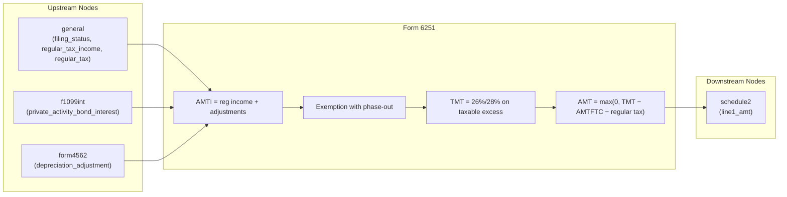

# Form 6251 — Alternative Minimum Tax—Individuals

## Overview
**IRS Form:** Form 6251
**Drake Screen:** 6251
**Tax Year:** 2025

---
## Input Fields
| Field | Type | Source Node | Description | IRS Reference | URL |
| ----- | ---- | ----------- | ----------- | ------------- | --- |
| filing_status | FilingStatus enum | general | Determines exemption amounts and rate brackets | Form 6251 Line 5 Worksheet | https://www.irs.gov/pub/irs-pdf/i6251.pdf |
| regular_tax_income | number | (upstream) | Regular taxable income (Form 1040 line 15 approx) | Form 6251 Line 1 | https://www.irs.gov/pub/irs-pdf/i6251.pdf |
| regular_tax | number | (upstream) | Regular tax liability (Form 1040 line 16 minus Form 4972) | Form 6251 Line 10 | https://www.irs.gov/pub/irs-pdf/i6251.pdf |
| iso_adjustment | number | upstream | ISO exercise adjustment (FMV − exercise price) | Form 6251 Line 2i | https://www.irs.gov/pub/irs-pdf/i6251.pdf |
| depreciation_adjustment | number | form4562 | Post-1986 depreciation AMT adjustment | Form 6251 Line 2l | https://www.irs.gov/pub/irs-pdf/i6251.pdf |
| nol_adjustment | number | upstream | AMT NOL deduction (ATNOLD) | Form 6251 Line 2f | https://www.irs.gov/pub/irs-pdf/i6251.pdf |
| private_activity_bond_interest | number | f1099int | Tax-exempt interest from private activity bonds | Form 6251 Line 2g | https://www.irs.gov/pub/irs-pdf/i6251.pdf |
| qsbs_adjustment | number | upstream | 7% of excluded QSBS gain (section 1202) | Form 6251 Line 2h | https://www.irs.gov/pub/irs-pdf/i6251.pdf |
| other_adjustments | number | upstream | Net of all other Part I adjustments/preferences | Form 6251 Lines 2a–2e, 2j–2t, 3 | https://www.irs.gov/pub/irs-pdf/i6251.pdf |
| amtftc | number | form_1116 | AMT foreign tax credit | Form 6251 Line 8 | https://www.irs.gov/pub/irs-pdf/i6251.pdf |

---
## Calculation Logic
### Step 1 — AMTI (Line 4)
AMTI = regular_tax_income + iso_adjustment + depreciation_adjustment + nol_adjustment + private_activity_bond_interest + qsbs_adjustment + other_adjustments

### Step 2 — Exemption (Line 5)
Full exemption from table: Single/HOH=$88,100, MFJ/QSS=$137,000, MFS=$68,500
Phase-out: 25% × max(0, AMTI − phase-out threshold)
Exemption = max(0, full_exemption − 25% × max(0, AMTI − threshold))

### Step 3 — Taxable Excess (Line 6)
Line 6 = max(0, Line 4 − Line 5)

### Step 4 — Tentative Minimum Tax (Line 7)
If Line 6 ≤ $239,100: TMT = Line 6 × 26%
If Line 6 > $239,100: TMT = Line 6 × 28% − $4,782
(MFS: threshold $119,550, adjustment $2,391)

### Step 5 — Net AMT (Lines 9–11)
Line 9 = Line 7 − AMTFTC
Line 10 = regular tax
Line 11 = max(0, Line 9 − Line 10)

---
## Output Routing
| Output Field | Destination Node | Line / Field | Condition | IRS Reference | URL |
| ------------ | ---------------- | ------------ | --------- | ------------- | --- |
| line1_amt | schedule2 | Line 1 | AMT > 0 | Form 6251 Line 11 → Schedule 2 Line 1 | https://www.irs.gov/pub/irs-pdf/i6251.pdf |

---
## Constants & Thresholds (Tax Year 2025)
| Constant | Value | Source | URL |
| -------- | ----- | ------ | --- |
| Exemption — Single/HOH | $88,100 | IRS Instructions i6251 TY2025 | https://www.irs.gov/pub/irs-pdf/i6251.pdf |
| Exemption — MFJ/QSS | $137,000 | IRS Instructions i6251 TY2025 | https://www.irs.gov/pub/irs-pdf/i6251.pdf |
| Exemption — MFS | $68,500 | IRS Instructions i6251 TY2025 | https://www.irs.gov/pub/irs-pdf/i6251.pdf |
| Phase-out start — Single/HOH | $626,350 | IRS Instructions i6251 TY2025 | https://www.irs.gov/pub/irs-pdf/i6251.pdf |
| Phase-out start — MFJ/QSS | $1,252,700 | IRS Instructions i6251 TY2025 | https://www.irs.gov/pub/irs-pdf/i6251.pdf |
| Phase-out start — MFS | $626,350 | IRS Instructions i6251 TY2025 | https://www.irs.gov/pub/irs-pdf/i6251.pdf |
| 26%/28% bracket threshold | $239,100 ($119,550 MFS) | IRS Instructions i6251 TY2025 | https://www.irs.gov/pub/irs-pdf/i6251.pdf |
| 28% rate adjustment | $4,782 ($2,391 MFS) | IRS Instructions i6251 TY2025 | https://www.irs.gov/pub/irs-pdf/i6251.pdf |

---
## Data Flow Diagram

---
## Edge Cases & Special Rules
- MFS: phase-out threshold same as Single but exemption is $68,500; bracket threshold halved to $119,550
- If AMTI ≥ zero-exemption threshold (Single: $978,750, MFJ: $1,800,700, MFS: $900,350), exemption = $0 — skip worksheet, use line 4 directly as line 6
- AMT = 0 when regular tax ≥ tentative minimum tax → no output
- ISO exercise: for AMT, income = FMV − exercise price (not recognized for regular tax)
- Part III (capital gains rates) not implemented; upstream should pre-compute TMT if capital gains apply

---
## Sources
| Document | Year | Section | URL | Saved as |
| -------- | ---- | ------- | --- | -------- |
| Instructions for Form 6251 | 2025 | All | https://www.irs.gov/pub/irs-pdf/i6251.pdf | .research/docs/i6251.pdf |
| IRS Form 6251 | 2025 | All | https://www.irs.gov/pub/irs-pdf/f6251.pdf | — |
