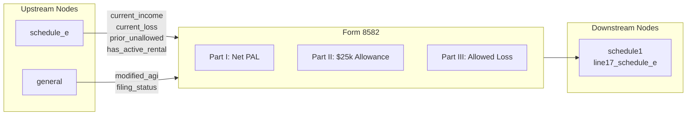

# Form 8582 — Passive Activity Loss Limitations

## Overview
**IRS Form:** Form 8582
**Drake Screen:** 8582
**Tax Year:** 2025

---
## Input Fields
| Field | Type | Source Node | Description | IRS Reference | URL |
| ----- | ---- | ----------- | ----------- | ------------- | --- |
| current_income | number | schedule_e | Current-year net passive income (sum of profitable activities) | Part I lines 1a/2a | https://www.irs.gov/instructions/i8582 |
| current_loss | number | schedule_e | Current-year net passive loss (positive amount) | Part I lines 1b/2b | https://www.irs.gov/instructions/i8582 |
| prior_unallowed | number | schedule_e | Prior-year unallowed PAL carryforward | Part I lines 1c/2c | https://www.irs.gov/instructions/i8582 |
| has_active_rental | boolean | schedule_e | True if any activity_type="A" (active rental RE) | Part II | https://www.irs.gov/instructions/i8582 |
| has_other_passive | boolean | schedule_e | True if any activity_type="B" (other passive) | Part V | https://www.irs.gov/instructions/i8582 |
| modified_agi | number | (caller/upstream) | Modified AGI for Part II phase-out | Part II, Line 6 | https://www.irs.gov/instructions/i8582 |
| active_participation | boolean | (caller) | Actively participated in rental RE | Part II eligibility | https://www.irs.gov/instructions/i8582 |
| filing_status | string | general | MFS disqualifies Part II if lived with spouse | Part II Caution | https://www.irs.gov/instructions/i8582 |

---
## Calculation Logic

### Step 1 — Combine Passive Income and Loss (Part I)
- net_rental = current_income_rental - current_loss_rental - prior_unallowed_rental
- net_other = current_income_other - current_loss_other - prior_unallowed_other
- overall_pal = net_rental + net_other
- If overall_pal >= 0: no PAL, all losses allowed

### Step 2 — Special $25k Allowance (Part II, active rental RE only)
- Only if has_active_rental AND active_participation AND modified_agi available
- rental_net_loss = |net_rental| (when net_rental < 0)
- max_allowance = min(rental_net_loss, $25,000)
- Phase-out: if MAGI > $100k: reduce by 50% × (MAGI - $100k)
- special_allowance = max(0, max_allowance - phase_out_reduction)
- MFS (lived apart): thresholds halved ($12,500 / $75k)

### Step 3 — Total Allowed Loss (Part III)
- allowed = min(|overall_pal|, passive_income + special_allowance)
- disallowed = |overall_pal| - allowed (carries forward)

### Step 4 — Route Allowed Loss
- Allowed loss → schedule1.line17_schedule_e (as negative)

---
## Output Routing
| Output Field | Destination Node | Line / Field | Condition | IRS Reference | URL |
| ------------ | ---------------- | ------------ | --------- | ------------- | --- |
| allowed passive loss | schedule1 | line17_schedule_e | When PAL exists and allowance > 0 | Part III Line 11 | https://www.irs.gov/instructions/i8582 |

---
## Constants & Thresholds (Tax Year 2025)
| Constant | Value | Source | URL |
| -------- | ----- | ------ | --- |
| RENTAL_ALLOWANCE_MAX | $25,000 | IRC §469(i)(2) | https://www.irs.gov/pub/irs-pdf/i8582.pdf |
| MAGI_LOWER_THRESHOLD | $100,000 | IRC §469(i)(3)(A) | https://www.irs.gov/pub/irs-pdf/i8582.pdf |
| MAGI_UPPER_THRESHOLD | $150,000 | IRC §469(i)(3)(A) | https://www.irs.gov/pub/irs-pdf/i8582.pdf |
| PHASE_OUT_RATE | 50% | IRC §469(i)(3)(B) | https://www.irs.gov/pub/irs-pdf/i8582.pdf |
| MFS_ALLOWANCE_MAX | $12,500 | IRC §469(i)(5)(B) | https://www.irs.gov/pub/irs-pdf/i8582.pdf |
| MFS_MAGI_LOWER | $50,000 | IRC §469(i)(5)(B) | https://www.irs.gov/pub/irs-pdf/i8582.pdf |
| MFS_MAGI_UPPER | $75,000 | IRC §469(i)(5)(B) | https://www.irs.gov/pub/irs-pdf/i8582.pdf |

---
## Data Flow Diagram

---
## Edge Cases & Special Rules
1. If overall PAL ≥ 0 (passive income ≥ passive loss + prior unallowed): no restriction, return empty outputs
2. MFS filers who lived with spouse ANY time during year: not eligible for Part II; use Part III directly
3. MAGI ≥ $150,000: special allowance = $0; entire rental RE loss disallowed (unless offset by passive income)
4. No active_rental flag: skip Part II entirely, go straight to Part III
5. Prior unallowed losses from prior years are included in the PAL calculation (Part IV/V col c)
6. Disallowed losses carry forward (not modeled in current-year output; carryforward tracking is out of scope)

---
## Sources
| Document | Year | Section | URL | Saved as |
| -------- | ---- | ------- | --- | -------- |
| Instructions for Form 8582 | 2025 | All | https://www.irs.gov/pub/irs-pdf/i8582.pdf | .research/docs/i8582.pdf |
| IRC §469 | 2025 | §469(i) | https://uscode.house.gov/view.xhtml?req=granuleid:USC-prelim-title26-section469 | N/A |
