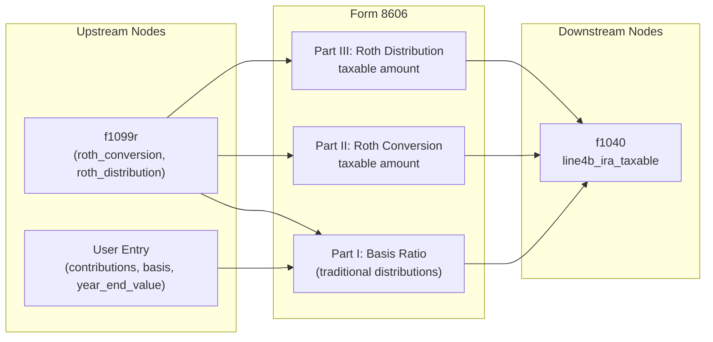

# Form 8606 — Nondeductible IRAs

## Overview
**IRS Form:** Form 8606
**Drake Screen:** `8606` (alias: `ROTH`)
**Tax Year:** 2025

---
## Input Fields
| Field | Type | Source Node | Description | IRS Reference | URL |
| ----- | ---- | ----------- | ----------- | ------------- | --- |
| nondeductible_contributions | number (nonneg) | user entry | Nondeductible traditional IRA contributions this year | Part I, Line 1 | https://www.irs.gov/instructions/i8606 |
| prior_basis | number (nonneg, opt) | carry-forward | Total basis from prior year Form 8606 | Part I, Line 2 | https://www.irs.gov/instructions/i8606 |
| year_end_ira_value | number (nonneg) | user entry | FMV of all traditional IRAs on Dec 31, 2025 | Part I, Line 6 | https://www.irs.gov/instructions/i8606 |
| traditional_distributions | number (nonneg, opt) | f1099r routed | Total traditional IRA distributions (non-conversion) | Part I, Line 7 | https://www.irs.gov/instructions/i8606 |
| roth_conversion | number (nonneg, opt) | f1099r routed | Amount converted from traditional to Roth | Part I, Line 8 / Part II | https://www.irs.gov/instructions/i8606 |
| roth_distribution | number (nonneg, opt) | f1099r routed | Roth IRA distributions received | Part III, Line 19 | https://www.irs.gov/instructions/i8606 |
| distribution_code | enum, opt | f1099r routed | 1099-R box 7 code for Roth distribution | Part III | https://www.irs.gov/instructions/i8606 |
| roth_basis_contributions | number (nonneg, opt) | carry-forward | Cumulative basis in regular Roth contributions | Part III, Line 22 | https://www.irs.gov/instructions/i8606 |
| roth_basis_conversions | number (nonneg, opt) | carry-forward | Cumulative basis in Roth conversions/rollovers | Part III, Line 24 | https://www.irs.gov/instructions/i8606 |

---
## Calculation Logic
### Part I — Nondeductible Contributions to Traditional IRAs and Distributions From Traditional IRAs

**Line 3:** total_basis = nondeductible_contributions + prior_basis
**Line 6:** year_end_ira_value (user-supplied)
**Line 7:** traditional_distributions
**Line 8:** roth_conversion
**Line 9:** denominator = year_end_ira_value + traditional_distributions + roth_conversion
**Line 10:** nontaxable_amount = (total_basis / denominator) × (traditional_distributions + roth_conversion)
  - If denominator = 0, nontaxable_amount = 0
  - Capped so nontaxable_amount ≤ total_basis
**Line 11:** nontaxable_conversions = nontaxable_amount × roth_conversion / (traditional_distributions + roth_conversion)
  - If (traditional_distributions + roth_conversion) = 0, nontaxable_conversions = 0
**Line 12:** nontaxable_distributions = nontaxable_amount - nontaxable_conversions
**Line 13:** taxable_traditional = traditional_distributions - nontaxable_distributions
**Line 14:** remaining_basis = total_basis - nontaxable_amount  (carries forward)

### Part II — Conversions from Traditional IRA to Roth IRA
**Line 16:** conversion_amount = roth_conversion
**Line 17:** nontaxable_conversions (from Line 11)
**Line 18:** taxable_conversion = max(0, roth_conversion - nontaxable_conversions)

### Part III — Distributions From Roth IRAs
**Total Roth basis:** roth_basis_contributions + roth_basis_conversions
**Taxable Roth:** max(0, roth_distribution - total_roth_basis)
(Simplified — does not implement homebuyer exception or 5-year rule tracking)

### Output to f1040 line4b_ira_taxable
Combined taxable = taxable_traditional + taxable_conversion + taxable_roth_distribution

---
## Output Routing
| Output Field | Destination Node | Line / Field | Condition | IRS Reference | URL |
| ------------ | ---------------- | ------------ | --------- | ------------- | --- |
| line4b_ira_taxable | f1040 | Line 4b | combined taxable > 0 | Part I Line 13, Part II Line 18, Part III | https://www.irs.gov/instructions/i8606 |

---
## Constants & Thresholds (Tax Year 2025)
| Constant | Value | Source | URL |
| -------- | ----- | ------ | --- |
| Contribution limit (under 50) | $7,000 | IRS Pub 590-A | https://www.irs.gov/pub/irs-pdf/p590a.pdf |
| Contribution limit (50+) | $8,000 | IRS Pub 590-A | https://www.irs.gov/pub/irs-pdf/p590a.pdf |

---
## Data Flow Diagram

---
## Edge Cases & Special Rules
1. **Zero denominator:** If year_end_value + distributions + conversions = 0, skip basis ratio (nothing to allocate)
2. **Full basis recovery:** If nontaxable_amount ≥ total_basis, remaining_basis = 0
3. **No distributions:** If no traditional distributions and no conversions, Part I produces no f1040 output
4. **All deductible:** If prior_basis = 0 and nondeductible_contributions = 0, all distributions fully taxable
5. **Roth qualified distributions:** If roth_distribution ≤ roth_basis, taxable_roth = 0
6. **No Roth distribution:** If roth_distribution = 0, Part III produces no output

---
## Sources
| Document | Year | Section | URL | Saved as |
| -------- | ---- | ------- | --- | -------- |
| Instructions for Form 8606 | 2025 | Part I, II, III | https://www.irs.gov/pub/irs-pdf/i8606.pdf | .research/docs/i8606.pdf |
| Drake KB — 8606 screen | 2025 | Screen 8606 / ROTH | https://kb.drakesoftware.com | — |
