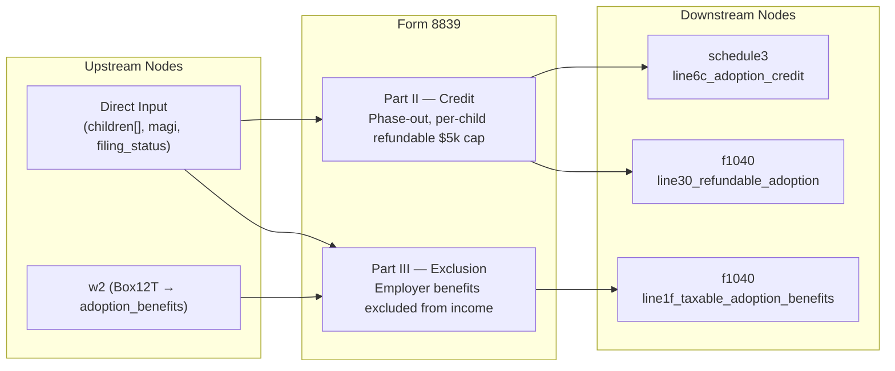

# Form 8839 — Qualified Adoption Expenses

## Overview
**IRS Form:** Form 8839
**Drake Screen:** 8839
**Tax Year:** 2025

---
## Input Fields
| Field | Type | Source Node | Description | IRS Reference | URL |
| ----- | ---- | ----------- | ----------- | ------------- | --- |
| adoption_benefits | number | w2 (Box12T) | Employer-provided adoption benefits | Part III Line 22 | i8839 p7 |
| children | array | direct | Per-child adoption data | Part I/II | i8839 p3 |
| children[].qualified_expenses | number | direct | Qualified adoption expenses paid | Part II Line 5 | i8839 p7 |
| children[].special_needs | boolean | direct | Child is US special needs | Part I Col (d) | i8839 p4 |
| children[].prior_year_credit | number | direct | Credit claimed in prior years for same child | Part II Line 3 | i8839 p7 |
| magi | number | direct | Modified adjusted gross income | Part II Line 7 / Line 25 | i8839 p9 |
| prior_year_credit_carryforward | number | direct | Unused nonrefundable credit from prior years | Line 18 / Line 3 | i8839 p7 |
| filing_status | enum | direct | Filing status (MFS restricted) | General Instructions | i8839 p2 |
| income_tax_liability | number | direct | Tax liability for credit limit worksheet | Line 17 | i8839 p7 |

---
## Calculation Logic

### Step 1 — Per-Child Credit (Part II Lines 2-11b)
- Line 2: $17,280 (max credit per child)
- Line 3: prior_year_credit for same child
- Line 5: qualified_expenses (or $17,280 for special needs, minus prior_year_credit)
- Line 6: min(line2 - line3, line5), clamped to >= 0
- Phase-out fraction = clamp((magi - 259190) / 40000, 0, 1), rounded to 3 decimal places
- Line 11a: line6 × (1 - phase_out_fraction)
- Line 11b (refundable per child): min(line11a, 5000)

### Step 2 — Totals (Lines 11c-14)
- Line 11c: sum of line11b across all children (total refundable)
- Line 12: sum of line11a across all children
- Line 13: line 11c → f1040 line 30 (refundable)
- Line 14: line 12 (nonrefundable + refundable combined)

### Step 3 — Nonrefundable Credit (Lines 16-17)
- Line 16: line14 - line13 (nonrefundable portion)
- Line 17: min(line16, income_tax_liability) — credit limit worksheet result
- → Schedule 3 line 6c

### Step 4 — Employer Exclusion (Part III)
- Line 19: $17,280 max per child
- Line 22: adoption_benefits (total received from W-2 Box 12T)
- Line 23: min(line19 × num_children, line22), after phase-out
- Phase-out applies to exclusion too: exclusion × (1 - phase_out_fraction)
- Taxable benefits = line22 - excluded_amount → f1040 line 1f (if > 0)

---
## Output Routing
| Output Field | Destination Node | Line / Field | Condition | IRS Reference | URL |
| ------------ | ---------------- | ------------ | --------- | ------------- | --- |
| line6c_adoption_credit | schedule3 | Line 6c | nonrefundable > 0 | Part II Line 17 | i8839 p7 |
| line30_refundable_adoption | f1040 | Line 30 | refundable > 0 | Part II Line 13 | i8839 p7 |
| line1f_taxable_adoption_benefits | f1040 | Line 1f | taxable benefits > 0 | Part III Line 31 | i8839 p7 |

---
## Constants & Thresholds (Tax Year 2025)
| Constant | Value | Source | URL |
| -------- | ----- | ------ | --- |
| MAX_CREDIT_PER_CHILD | 17280 | Rev Proc 2024-40 / IRS i8839 2025 | https://www.irs.gov/instructions/i8839 |
| PHASE_OUT_START | 259190 | IRS i8839 2025 What's New | https://www.irs.gov/instructions/i8839 |
| PHASE_OUT_END | 299190 | IRS i8839 2025 What's New | https://www.irs.gov/instructions/i8839 |
| PHASE_OUT_RANGE | 40000 | PHASE_OUT_END - PHASE_OUT_START | computed |
| MAX_REFUNDABLE_PER_CHILD | 5000 | IRS i8839 2025 What's New | https://www.irs.gov/instructions/i8839 |

---
## Data Flow Diagram

---
## Edge Cases & Special Rules
1. **Special needs child**: Line 5 = $17,280 minus any prior year credit claimed, even if $0 expenses paid
2. **MFS filers**: Generally cannot claim credit or exclusion (blocked unless mfs_exception flag set)
3. **Phase-out**: Applies to BOTH credit (Part II) and exclusion (Part III)
4. **Cannot double-dip**: Expenses reimbursed by employer are not qualified expenses for the credit
5. **Refundable cap**: $5,000 per child max refundable; excess is nonrefundable (subject to credit limit)
6. **Credit limit worksheet**: Nonrefundable credit limited to tax liability; we accept income_tax_liability as input
7. **Carryforward**: Unused nonrefundable credit carries forward 5 years (we model receipt of carryforward as input)
8. **Foreign child**: Cannot take credit/exclusion until adoption is final (adoption_final flag required)
9. **Multi-child**: Each child calculated separately; totals aggregated

---
## Sources
| Document | Year | Section | URL | Saved as |
| -------- | ---- | ------- | --- | -------- |
| Instructions for Form 8839 | 2025 | All parts | https://www.irs.gov/instructions/i8839 | .research/docs/i8839.pdf |
| Rev Proc 2024-40 | 2024 | TY2025 inflation adjustments | https://www.irs.gov/pub/irs-drop/rp-24-40.pdf | — |
