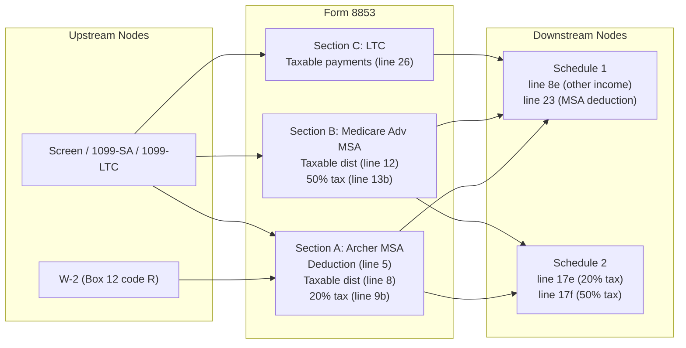

# Form 8853 — Archer MSAs and Long-Term Care Insurance Contracts

## Overview
**IRS Form:** Form 8853
**Drake Screen:** 8853 (alias: MSA)
**Tax Year:** 2025

---
## Input Fields
| Field | Type | Source Node | Description | IRS Reference | URL |
| ----- | ---- | ----------- | ----------- | ------------- | --- |
| employer_archer_msa | number (optional) | W-2 node (Box 12 code R) | Employer contributions to Archer MSA | Part I, Line 1 | https://www.irs.gov/pub/irs-pdf/f8853.pdf |
| taxpayer_archer_msa_contributions | number (optional) | screen | Taxpayer contributions to Archer MSA in 2025 | Part I, Line 2 | https://www.irs.gov/pub/irs-pdf/f8853.pdf |
| line3_limitation_amount | number (optional) | screen (pre-computed) | Limitation from Line 3 chart (65%/75% of deductible × eligible months/12) | Part I, Line 3 | https://www.irs.gov/pub/irs-pdf/f8853.pdf |
| compensation | number (optional) | screen | Compensation from employer maintaining HDHP | Part I, Line 4 | https://www.irs.gov/pub/irs-pdf/f8853.pdf |
| archer_msa_distributions | number (optional) | screen (1099-SA box 1) | Total distributions from all Archer MSAs | Part II, Line 6a | https://www.irs.gov/pub/irs-pdf/f8853.pdf |
| archer_msa_rollover | number (optional) | screen | Rollover distributions + withdrawn excess contributions | Part II, Line 6b | https://www.irs.gov/pub/irs-pdf/f8853.pdf |
| archer_msa_qualified_expenses | number (optional) | screen | Unreimbursed qualified medical expenses | Part II, Line 7 | https://www.irs.gov/pub/irs-pdf/f8853.pdf |
| archer_msa_exception | boolean (optional) | screen | Check if any dist on line 8 meets exception to 20% tax | Part II, Line 9a | https://www.irs.gov/pub/irs-pdf/f8853.pdf |
| medicare_advantage_distributions | number (optional) | screen (1099-SA box 1) | Total distributions from Medicare Advantage MSAs | Section B, Line 10 | https://www.irs.gov/pub/irs-pdf/f8853.pdf |
| medicare_advantage_qualified_expenses | number (optional) | screen | Qualified medical expenses for Medicare Advantage MSA | Section B, Line 11 | https://www.irs.gov/pub/irs-pdf/f8853.pdf |
| medicare_advantage_exception | boolean (optional) | screen | Check if exception to 50% tax applies | Section B, Line 13a | https://www.irs.gov/pub/irs-pdf/f8853.pdf |
| ltc_gross_payments | number (optional) | screen (1099-LTC box 1) | Gross LTC payments on per diem/periodic basis | Section C, Line 17 | https://www.irs.gov/pub/irs-pdf/f8853.pdf |
| ltc_qualified_contract_amount | number (optional) | screen | Amount on line 17 from qualified LTC insurance contracts | Section C, Line 18 | https://www.irs.gov/pub/irs-pdf/f8853.pdf |
| ltc_accelerated_death_benefits | number (optional) | screen | Accelerated death benefits (chronically ill, per diem) | Section C, Line 19 | https://www.irs.gov/pub/irs-pdf/f8853.pdf |
| ltc_period_days | number (optional) | screen | Number of days in the LTC period | Section C, Line 21 | https://www.irs.gov/pub/irs-pdf/f8853.pdf |
| ltc_actual_costs | number (optional) | screen | Costs incurred for qualified LTC services during period | Section C, Line 22 | https://www.irs.gov/pub/irs-pdf/f8853.pdf |
| ltc_reimbursements | number (optional) | screen | Reimbursements for qualified LTC services | Section C, Line 24 | https://www.irs.gov/pub/irs-pdf/f8853.pdf |

---
## Calculation Logic

### Section A Part I — Archer MSA Deduction (Lines 1–5)
- Line 5 (deduction) = min(line2_taxpayer_contributions, line3_limitation, line4_compensation)
- Deduction routes to Schedule 1 Part II line 23
- Employer contributions (line 1) reduce available deduction space (handled by limitation)

### Section A Part II — Archer MSA Distributions (Lines 6a–9b)
- Line 6c = line6a_total_distributions - line6b_rollovers
- Line 8 = max(0, line6c - line7_qualified_expenses) → taxable distributions → Schedule 1 line 8e
- Line 9b = line8 × 20% unless exception applies → Schedule 2 line 17e

### Section B — Medicare Advantage MSA Distributions (Lines 10–13b)
- Line 12 = max(0, line10 - line11_qualified_expenses) → taxable → Schedule 1 line 8e
- Line 13b = line12 × 50% unless exception applies → Schedule 2 line 17f

### Section C — Long-Term Care Insurance Contracts (Lines 14–26)
- Line 20 = line18_qualified_ltc + line19_accelerated_death_benefits
- Line 21 = $420 × ltc_period_days (per diem limit, Rev. Proc. 2024-40 §2.62)
- Line 23 = max(line21, line22_actual_costs) (exclusion amount)
- Line 25 = max(0, line23 - line24_reimbursements) (per diem limitation)
- Line 26 = max(0, line20 - line25) → taxable LTC payments → Schedule 1 line 8e

---
## Output Routing
| Output Field | Destination Node | Line / Field | Condition | IRS Reference | URL |
| ------------ | ---------------- | ------------ | ---------- | ------------- | --- |
| line8e_archer_msa_dist | schedule1 | line 8e | taxable Archer MSA > 0 | Part II, Line 8 | https://www.irs.gov/pub/irs-pdf/f8853.pdf |
| line8e_archer_msa_dist | schedule1 | line 8e | taxable Medicare Adv MSA > 0 | Section B, Line 12 | https://www.irs.gov/pub/irs-pdf/f8853.pdf |
| line8e_archer_msa_dist | schedule1 | line 8e | taxable LTC payments > 0 | Section C, Line 26 | https://www.irs.gov/pub/irs-pdf/f8853.pdf |
| line23_archer_msa_deduction | schedule1 | line 23 | deduction > 0 | Part I, Line 5 | https://www.irs.gov/pub/irs-pdf/f8853.pdf |
| line17e_archer_msa_tax | schedule2 | line 17e | 20% tax > 0 | Part II, Line 9b | https://www.irs.gov/pub/irs-pdf/f8853.pdf |
| line17f_medicare_advantage_msa_tax | schedule2 | line 17f | 50% tax > 0 | Section B, Line 13b | https://www.irs.gov/pub/irs-pdf/f8853.pdf |

---
## Constants & Thresholds (Tax Year 2025)
| Constant | Value | Source | URL |
| -------- | ----- | ------ | --- |
| LTC per diem limit | $420/day | Rev. Proc. 2024-40 §2.62 | https://www.irs.gov/irb/2024-44_IRB |
| HDHP self-only min deductible | $2,850 | IRS Notice / Pub. 969 | https://www.irs.gov/pub/irs-pdf/i8853.pdf |
| HDHP self-only max deductible | $4,300 | IRS Notice / Pub. 969 | https://www.irs.gov/pub/irs-pdf/i8853.pdf |
| HDHP family min deductible | $5,700 | IRS Notice / Pub. 969 | https://www.irs.gov/pub/irs-pdf/i8853.pdf |
| HDHP family max deductible | $8,550 | IRS Notice / Pub. 969 | https://www.irs.gov/pub/irs-pdf/i8853.pdf |
| Archer MSA self-only limit | 65% of annual deductible | IRC §220(b)(2) | https://www.irs.gov/pub/irs-pdf/i8853.pdf |
| Archer MSA family limit | 75% of annual deductible | IRC §220(b)(2) | https://www.irs.gov/pub/irs-pdf/i8853.pdf |
| Archer MSA excess distribution tax | 20% (0.20) | IRC §220(f)(4) | https://www.irs.gov/pub/irs-pdf/i8853.pdf |
| Medicare Advantage MSA excess dist tax | 50% (0.50) | IRC §138(c)(2) | https://www.irs.gov/pub/irs-pdf/i8853.pdf |

---
## Data Flow Diagram

---
## Edge Cases & Special Rules
- Employer contributions (line 1) reduce the allowable deduction but do NOT themselves become deductible
- If employer contributions exceed the line 3 limitation, no deduction is allowed and excess goes to Form 5329
- Exception to 20% tax: death, disability, or age 65+ (line 9a checkbox)
- Exception to 50% tax: death or disability only (NOT age 65) (line 13a checkbox)
- LTC taxable amount is zero when per diem payments ≤ $420/day (all excluded)
- Section C only applies if payments are per diem or periodic; lump sums are handled differently
- Multiple LTC periods require separate Section C computations (we accept pre-summed totals)

---
## Sources
| Document | Year | Section | URL | Saved as |
| -------- | ---- | ------- | --- | -------- |
| Instructions for Form 8853 | 2025 | All sections | https://www.irs.gov/pub/irs-pdf/i8853.pdf | .research/docs/i8853.pdf |
| Form 8853 | 2025 | All lines | https://www.irs.gov/pub/irs-pdf/f8853.pdf | .research/docs/f8853.pdf |
| Rev. Proc. 2024-40 | 2024 | §2.62 (LTC per diem) | https://www.irs.gov/irb/2024-44_IRB | — |
