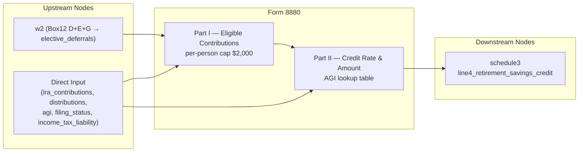

# Form 8880 — Credit for Qualified Retirement Savings Contributions

## Overview
**IRS Form:** Form 8880
**Drake Screen:** 8880
**Tax Year:** 2025

---
## Input Fields
| Field | Type | Source Node | Description | IRS Reference | URL |
| ----- | ---- | ----------- | ----------- | ------------- | --- |
| elective_deferrals | number | w2 (Box12 D+E+G) | Combined 401k/403b/457b deferrals (all W-2s) | Part I Line 1b | i8880 |
| elective_deferrals_taxpayer | number | direct | Taxpayer 401k/403b/457b deferrals | Part I col (a) Line 1b | i8880 |
| elective_deferrals_spouse | number | direct | Spouse 401k/403b/457b deferrals | Part I col (b) Line 1b | i8880 |
| ira_contributions_taxpayer | number | direct | Taxpayer IRA contributions (trad + Roth) | Part I col (a) Line 1a | i8880 |
| ira_contributions_spouse | number | direct | Spouse IRA contributions (trad + Roth) | Part I col (b) Line 1a | i8880 |
| distributions_taxpayer | number | direct | Taxpayer disqualifying distributions | Part I col (a) Line 2 | i8880 |
| distributions_spouse | number | direct | Spouse disqualifying distributions | Part I col (b) Line 2 | i8880 |
| agi | number | direct | Adjusted gross income | Part II Line 5 | i8880 |
| filing_status | enum | direct | Filing status | Part II Line 6 lookup | i8880 |
| income_tax_liability | number | direct | Tax liability for credit limit | Part II Line 9 | i8880 |

---
## Calculation Logic
### Step 1 — Per-person eligible contributions (Part I)
- Line 1: total contributions = ira_contributions + elective_deferrals (per person)
- Line 2: disqualifying distributions received
- Line 3: max(Line 1 - Line 2, 0)
- Line 4: min(Line 3, $2,000) — contribution cap per person

### Step 2 — Credit rate (Part II, Line 6)
AGI thresholds for TY2025:
- Single/MFS/QSS: 50% ≤$23,000; 20% $23,001–$25,000; 10% $25,001–$38,250; 0% >$38,250
- HOH: 50% ≤$34,500; 20% $34,501–$37,500; 10% $37,501–$57,375; 0% >$57,375
- MFJ: 50% ≤$46,000; 20% $46,001–$50,000; 10% $50,001–$76,500; 0% >$76,500

### Step 3 — Credit amount (Part II, Lines 7–10)
- Line 7: taxpayer_line4 + spouse_line4
- Line 8: Line 7 × credit_rate
- Line 9: income_tax_liability (provided as input; if absent, no credit limit applied)
- Line 10: min(Line 8, Line 9) if income_tax_liability provided; else Line 8

---
## Output Routing
| Output Field | Destination Node | Line / Field | Condition | IRS Reference | URL |
| ------------ | ---------------- | ------------ | --------- | ------------- | --- |
| line4_retirement_savings_credit | schedule3 | Line 4 | credit > 0 | Part II Line 10 | i8880 |

---
## Constants & Thresholds (Tax Year 2025)
| Constant | Value | Source | URL |
| -------- | ----- | ------ | --- |
| CONTRIBUTION_CAP | 2000 | IRC §25B(b)(1); IRS i8880 2025 | https://www.irs.gov/instructions/i8880 |
| AGI_50_SINGLE | 23000 | Rev Proc 2024-40 | https://www.irs.gov/pub/irs-drop/rp-24-40.pdf |
| AGI_20_SINGLE | 25000 | Rev Proc 2024-40 | |
| AGI_10_SINGLE | 38250 | Rev Proc 2024-40 | |
| AGI_50_HOH | 34500 | Rev Proc 2024-40 | |
| AGI_20_HOH | 37500 | Rev Proc 2024-40 | |
| AGI_10_HOH | 57375 | Rev Proc 2024-40 | |
| AGI_50_MFJ | 46000 | Rev Proc 2024-40 | |
| AGI_20_MFJ | 50000 | Rev Proc 2024-40 | |
| AGI_10_MFJ | 76500 | Rev Proc 2024-40 | |

---
## Data Flow Diagram

---
## Edge Cases & Special Rules
1. **MFJ both spouses**: Each can contribute up to $2,000; total eligible up to $4,000
2. **Non-MFJ**: Only taxpayer column (col a) applies
3. **Elective deferrals from W-2**: Sent as single field; treated as taxpayer-only unless `elective_deferrals_taxpayer`/`_spouse` override
4. **Distributions offset**: If distributions exceed contributions, eligible = 0 (not negative)
5. **Zero credit**: If AGI exceeds threshold or no contributions, no output emitted
6. **Credit limit**: If income_tax_liability provided, credit is capped at tax liability
7. **Nonrefundable**: Cannot exceed tax liability; no carryforward modeled here

---
## Sources
| Document | Year | Section | URL | Saved as |
| -------- | ---- | ------- | --- | -------- |
| Instructions for Form 8880 | 2025 | All parts | https://www.irs.gov/instructions/i8880 | .research/docs/i8880.pdf |
| Rev Proc 2024-40 | 2024 | TY2025 inflation adjustments | https://www.irs.gov/pub/irs-drop/rp-24-40.pdf | .research/docs/rp-24-40.pdf |
