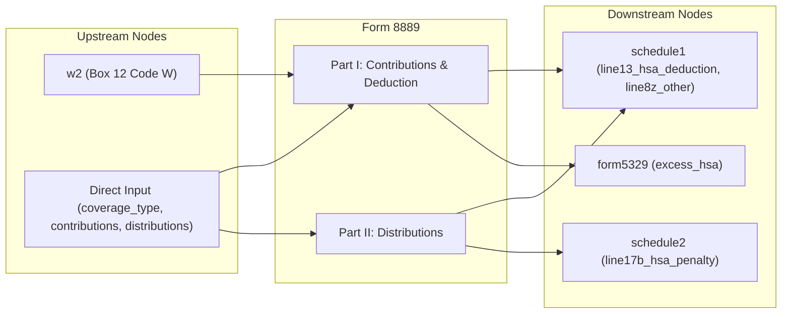

# Form 8889 — Health Savings Accounts (HSAs)

## Overview
**IRS Form:** Form 8889
**Drake Screen:** 8889 (alias: HSA)
**Tax Year:** 2025

---
## Input Fields
| Field | Type | Source Node | Description | IRS Reference | URL |
| ----- | ---- | ----------- | ----------- | ------------- | --- |
| employer_hsa_contributions | number | w2 (Box 12 Code W) | Employer contributions to HSA | IRC §106(d) | - |
| coverage_type | enum(self_only/family) | direct | HDHP coverage type determines contribution limit | IRC §223(b)(2) | - |
| taxpayer_hsa_contributions | number | direct | Taxpayer's own HSA contributions | IRC §223(a) | - |
| age_55_or_older | boolean | direct | Enables $1,000 catch-up contribution | IRC §223(b)(3) | - |
| hsa_distributions | number | direct | Total HSA distributions (from 1099-SA box 1) | IRC §223(f) | - |
| qualified_medical_expenses | number | direct | Qualified medical expenses paid from HSA | IRC §213(d) | - |
| distribution_exception | boolean | direct | Exception to 20% penalty (death/disability/Medicare) | IRC §223(f)(4) | - |

---
## Calculation Logic
### Step 1 — Part I: HSA Contributions and Deduction
1. Determine annual limit by coverage type (self_only: $4,300, family: $8,550)
2. Add catch-up if age_55_or_older (+$1,000)
3. Total contributions = taxpayer_hsa_contributions + employer_hsa_contributions
4. Deductible amount = min(taxpayer_hsa_contributions, limit - employer_hsa_contributions)
5. Excess = max(0, total_contributions - limit) → form5329 excess_hsa

### Step 2 — Part II: HSA Distributions
1. Taxable distributions = max(0, hsa_distributions - qualified_medical_expenses)
2. If taxable > 0: route to schedule1 (other income)
3. Penalty subject to 20% = taxable (unless exception applies)
4. 20% penalty → schedule2 line17b

---
## Output Routing
| Output Field | Destination Node | Line / Field | Condition | IRS Reference | URL |
| ------------ | ---------------- | ------------ | --------- | ------------- | --- |
| HSA deduction | schedule1 | line13_hsa_deduction | taxpayer_contributions > 0, within limit | IRC §223(a) | - |
| Taxable distribution | schedule1 | line8z_other | hsa_distributions > qualified_expenses | IRC §223(f)(2) | - |
| 20% penalty | schedule2 | line17b_hsa_penalty | taxable distribution, no exception | IRC §223(f)(4)(A) | - |
| Excess contributions | form5329 | excess_hsa | total > annual limit | IRC §4973(a)(2) | - |

---
## Constants & Thresholds (Tax Year 2025)
| Constant | Value | Source | URL |
| -------- | ----- | ------ | --- |
| Self-only HDHP contribution limit | $4,300 | IRS Rev. Proc. 2024-25 | https://www.irs.gov/pub/irs-drop/rp-24-25.pdf |
| Family HDHP contribution limit | $8,550 | IRS Rev. Proc. 2024-25 | https://www.irs.gov/pub/irs-drop/rp-24-25.pdf |
| Catch-up contribution (age 55+) | $1,000 | IRC §223(b)(3) | - |
| Non-qualified distribution penalty rate | 20% | IRC §223(f)(4)(A) | - |
| Excess contribution excise rate | 6% | IRC §4973 | - |

---
## Data Flow Diagram

---
## Edge Cases & Special Rules
- Employer contributions (Box 12 Code W) reduce the available personal deduction limit
- If enrolled in Medicare: no HSA contributions allowed
- Catch-up only applies if NOT enrolled in Medicare
- Disability/death/Medicare enrollment: exempt from 20% penalty (exception flag)
- Last-month rule: can contribute full-year limit if enrolled by Dec 1 (not modeled here)
- Rollover from FSA/HRA to HSA: not subject to contribution limit (not modeled)

---
## Sources
| Document | Year | Section | URL | Saved as |
| -------- | ---- | ------- | --- | -------- |
| IRS Form 8889 Instructions | 2025 | All Parts | https://www.irs.gov/instructions/i8889 | .research/docs/i8889.pdf |
| IRS Rev. Proc. 2024-25 | 2024 | HSA limits | https://www.irs.gov/pub/irs-drop/rp-24-25.pdf | - |
| IRC §223 | - | Health Savings Accounts | - | - |
