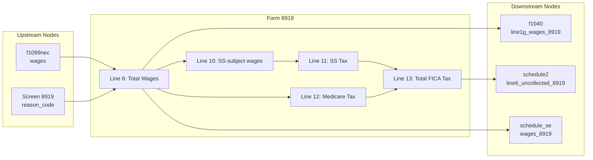

# Form 8919 — Uncollected Social Security and Medicare Tax on Wages

## Overview
**IRS Form:** Form 8919
**Drake Screen:** 8919
**Tax Year:** 2025

---
## Input Fields
| Field | Type | Source Node | Description | IRS Reference | URL |
| ----- | ---- | ----------- | ----------- | ------------- | --- |
| wages | number (required) | f1099nec, direct entry | Total wages from misclassifying employer | Form 8919 lines 1–5 → line 6 | https://www.irs.gov/instructions/i8919 |
| reason_code | ReasonCode enum (required) | screen 8919 | Reason worker is filing (A–H) | Form 8919 Part I | https://www.irs.gov/instructions/i8919 |
| prior_ss_wages | number (optional) | upstream | Prior SS wages (boxes 3+7 from W-2) to offset wage base | Form 8919 line 9 | https://www.irs.gov/instructions/i8919 |

---
## Calculation Logic
### Step 1 — Determine Reason Code
Taxpayer selects A–H based on situation (misclassified employee).

### Step 2 — Wages (Line 6)
Sum of wages reported in Part I (from all employers listed).

### Step 3 — SS Wage Base Check (Lines 8–10)
- Line 8: Prior SS wages (from W-2 boxes 3+7)
- Line 9: Remaining SS wage base = max(0, $176,100 − line 8)
- Line 10: Wages subject to SS = min(line 6, line 9)

### Step 4 — SS Tax (Line 11)
line 10 × 6.2%

### Step 5 — Medicare Tax (Line 12)
line 6 × 1.45% (no cap)

### Step 6 — Total Tax (Line 13)
line 11 + line 12 → Schedule 2 line 6

---
## Output Routing
| Output Field | Destination Node | Line / Field | Condition | IRS Reference | URL |
| ------------ | ---------------- | ------------ | --------- | ------------- | --- |
| wages | f1040 | line 1g | wages > 0 | Form 1040 Instructions line 1g | https://www.irs.gov/instructions/i1040gi |
| total_tax | schedule2 | line 6 | total_tax > 0 | Schedule 2 line 6 | https://www.irs.gov/instructions/i1040s2 |
| wages | schedule_se | wages_8919 | wages > 0 | Schedule SE line 8c | https://www.irs.gov/instructions/i1040sse |

---
## Constants & Thresholds (Tax Year 2025)
| Constant | Value | Source | URL |
| -------- | ----- | ------ | --- |
| SS_WAGE_BASE | $176,100 | Rev Proc 2024-40 §3.28 | https://www.irs.gov/pub/irs-drop/rp-24-40.pdf |
| SS_RATE | 6.2% | IRC §3101(a) | https://www.irs.gov/pub/irs-pdf/i8919.pdf |
| MEDICARE_RATE | 1.45% | IRC §3101(b) | https://www.irs.gov/pub/irs-pdf/i8919.pdf |

---
## Data Flow Diagram

---
## Edge Cases & Special Rules
- If wages = 0, emit no outputs
- SS tax is capped at SS_WAGE_BASE; Medicare has no cap
- prior_ss_wages offsets the wage base (taxpayer may have W-2 wages too)
- All reason codes A–H are valid; node does not change calculation based on code
- Worker pays only employee share (6.2% SS + 1.45% Medicare), not SE rate

---
## Sources
| Document | Year | Section | URL | Saved as |
| -------- | ---- | ------- | --- | -------- |
| Form 8919 Instructions | 2025 | All | https://www.irs.gov/instructions/i8919 | i8919.pdf |
| Schedule 2 Instructions | 2025 | Line 6 | https://www.irs.gov/instructions/i1040s2 | — |
| Schedule SE Instructions | 2025 | Line 8c | https://www.irs.gov/instructions/i1040sse | — |
| Rev Proc 2024-40 | 2024 | §3.28 | https://www.irs.gov/pub/irs-drop/rp-24-40.pdf | — |
