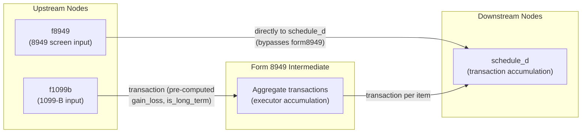

# Form 8949 — Sales and Other Dispositions of Capital Assets

## Overview
**IRS Form:** Form 8949
**Drake Screen:** 8949
**Tax Year:** 2025

---
## Input Fields
| Field | Type | Source Node | Description | IRS Reference | URL |
| ----- | ---- | ----------- | ----------- | ------------- | --- |
| part | enum A-F | f1099b | Which checkbox box (A=1099-B basis reported, B=1099-B no basis, C=no 1099-B, D/E/F=long-term equivalents) | Form 8949 Part I/II | https://www.irs.gov/instructions/i8949 |
| description | string | f1099b | Asset description | Form 8949 col (a) | — |
| date_acquired | string | f1099b | Date acquired | Form 8949 col (b) | — |
| date_sold | string | f1099b | Date sold or disposed | Form 8949 col (c) | — |
| proceeds | number | f1099b | Proceeds (sales price) | Form 8949 col (d) | — |
| cost_basis | number | f1099b | Cost or other basis | Form 8949 col (e) | — |
| adjustment_codes | string? | f1099b | Adjustment code(s) (e.g., W=wash sale, B=basis adjustment) | Form 8949 col (f) | — |
| adjustment_amount | number? | f1099b | Adjustment to gain/loss | Form 8949 col (g) | — |
| gain_loss | number | f1099b (pre-computed) | Col (h) = col (d) - col (e) + col (g) | Form 8949 col (h) | — |
| is_long_term | boolean | f1099b (pre-computed) | True if part D/E/F (held >1yr) | IRC §1222 | — |

---
## Calculation Logic
### Step 1 — Short-Term vs Long-Term Classification
- Parts A, B, C → Short-term (held ≤ 1 year) → Schedule D Part I
- Parts D, E, F → Long-term (held > 1 year) → Schedule D Part II

### Step 2 — Gain/Loss Computation
- Gain/Loss = Proceeds (col d) - Cost Basis (col e) + Adjustment (col g)
- Pre-computed by f1099b input node; form8949 intermediate passes through

### Step 3 — Wash Sale Adjustment (Code W)
- Disallowed wash sale loss is entered as positive adjustment_amount
- Reduces (or eliminates) the loss — already reflected in gain_loss from f1099b

### Step 4 — Route to Schedule D
- Each transaction passed individually via `transaction` accumulation key
- schedule_d aggregates into line totals

---
## Output Routing
| Output Field | Destination Node | Line / Field | Condition | IRS Reference | URL |
| ------------ | ---------------- | ------------ | --------- | ------------- | --- |
| transaction | schedule_d | Lines 1b/2/3 (ST) or 8b/9/10 (LT) | Each transaction | Schedule D Instructions | — |

---
## Constants & Thresholds (Tax Year 2025)
| Constant | Value | Source | URL |
| -------- | ----- | ------ | --- |
| Short-term parts | A, B, C | IRC §1222(1) | — |
| Long-term parts | D, E, F | IRC §1222(3) | — |

---
## Data Flow Diagram

---
## Edge Cases & Special Rules
1. **Zero transactions**: if no transactions, return empty outputs
2. **Wash sale (code W)**: adjustment_amount is positive (disallowed loss); gain_loss from f1099b already reflects this
3. **Basis adjustment (code B)**: adjustment_amount corrects overstated/understated basis
4. **All zero gain/loss**: still routes to schedule_d for accuracy
5. **Mixed short/long-term**: each transaction routes independently; schedule_d aggregates by term

---
## Sources
| Document | Year | Section | URL | Saved as |
| -------- | ---- | ------- | --- | -------- |
| Form 8949 Instructions | 2024 | All | https://www.irs.gov/instructions/i8949 | — |
| Schedule D Instructions | 2024 | All | https://www.irs.gov/instructions/i1040sd | — |
| IRC §1222 | Current | Capital gain/loss holding periods | https://uscode.house.gov/view.xhtml?req=granuleid:USC-prelim-title26-section1222 | — |
