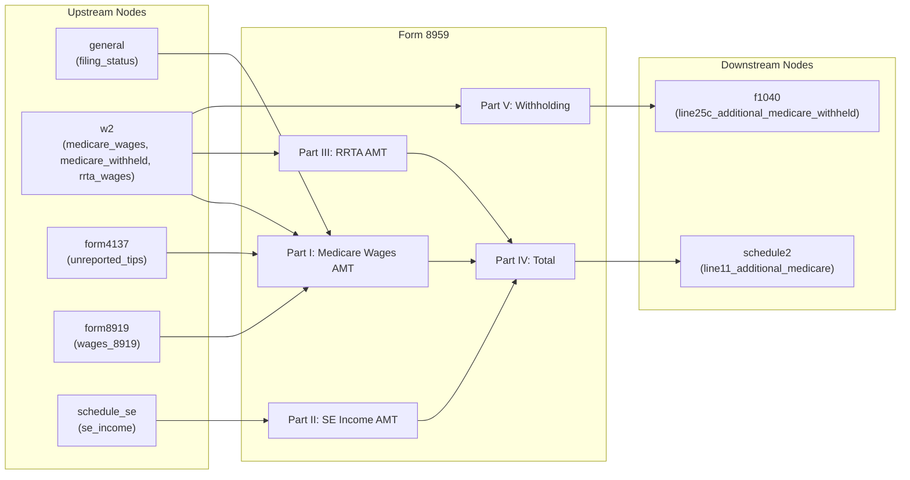

# Form 8959 — Additional Medicare Tax

## Overview
**IRS Form:** Form 8959
**Drake Screen:** None (no matching entry in screens.json)
**Tax Year:** 2025

---
## Input Fields
| Field | Type | Source Node | Description | IRS Reference | URL |
| ----- | ---- | ----------- | ----------- | ------------- | --- |
| filing_status | FilingStatus enum | general | Filing status determines threshold | IRC §3101(b)(2) | i8959 p.1 |
| medicare_wages | number (optional) | w2 | Total Medicare wages & tips (W-2 box 5) | Form 8959 line 1 | i8959 p.3 |
| unreported_tips | number (optional) | form4137 | Unreported tips (Form 4137 line 6) | Form 8959 line 2 | i8959 p.3 |
| wages_8919 | number (optional) | form8919 | Wages from Form 8919 line 6 | Form 8959 line 3 | i8959 p.3 |
| se_income | number (optional) | schedule_se | SE income from Sch SE Part I line 6 | Form 8959 line 8 | i8959 p.3 |
| rrta_wages | number (optional) | w2 | RRTA compensation (W-2 box 14) | Form 8959 line 14 | i8959 p.3 |
| medicare_withheld | number (optional) | w2 | Medicare tax withheld (W-2 box 6 + codes B+N) | Form 8959 line 19 | i8959 p.4 |
| rrta_medicare_withheld | number (optional) | w2 | Additional Medicare Tax withheld on RRTA (W-2 box 14) | Form 8959 line 23 | i8959 p.4 |

---
## Calculation Logic

### Step 1 — Determine Threshold by Filing Status
- MFJ: $250,000
- MFS: $125,000
- Single / HOH / QSS: $200,000

### Step 2 — Part I: Medicare Wages
- Line 4 = medicare_wages + unreported_tips + wages_8919
- Line 6 = max(0, line4 - threshold)
- Line 7 = line6 × 0.009

### Step 3 — Part II: SE Income
- Line 9 = line 4 (total Medicare wages+tips)
- Line 10 = max(0, threshold - line9)  [reduced threshold]
- Line 11 = max(0, se_income - line10)
- Line 12 = min(se_income, line11)  [if SE income < 0, use 0]
- Line 13 = max(0, line12) × 0.009

### Step 4 — Part III: RRTA
- Line 16 = max(0, rrta_wages - threshold)  [NOT reduced by wages]
- Line 17 = line16 × 0.009

### Step 5 — Part IV: Total
- Line 18 = line7 + line13 + line17

### Step 6 — Part V: Withholding
- Line 24 = medicare_withheld + rrta_medicare_withheld

---
## Output Routing
| Output Field | Destination Node | Line / Field | Condition | IRS Reference | URL |
| ------------ | ---------------- | ------------ | --------- | ------------- | --- |
| line18_amt_tax | schedule2 | line11_additional_medicare | line18 > 0 | Form 8959 line 18 → Sch 2 line 11 | i8959 p.4 |
| line24_withheld | f1040 | line25c_additional_medicare_withheld | line24 > 0 | Form 8959 line 24 → F1040 line 25c | i8959 p.4 |

---
## Constants & Thresholds (Tax Year 2025)
| Constant | Value | Source | URL |
| -------- | ----- | ------ | --- |
| AMT_RATE | 0.009 | IRC §3101(b)(2) | i8959 p.1 |
| MFJ_THRESHOLD | 250,000 | Not indexed | i8959 p.1 |
| MFS_THRESHOLD | 125,000 | Not indexed | i8959 p.1 |
| SINGLE_HOH_QSS_THRESHOLD | 200,000 | Not indexed | i8959 p.1 |

---
## Data Flow Diagram

---
## Edge Cases & Special Rules
1. SE income loss (negative SE) → zero for Part II (negative shouldn't count)
2. RRTA threshold is NOT reduced by wages (separate pools per instructions Example 7)
3. Wages DO reduce the SE income threshold (instructions Example 3)
4. If no wages at all, SE threshold = full filing status threshold
5. MFS threshold: $125k (half of MFJ) — not $200k like Single
6. All thresholds are NOT indexed for inflation

---
## Sources
| Document | Year | Section | URL | Saved as |
| -------- | ---- | ------- | --- | -------- |
| Instructions for Form 8959 | 2025 | All parts | https://www.irs.gov/pub/irs-pdf/i8959.pdf | .research/docs/i8959.pdf |
| IRC §3101(b)(2) | — | AMT rate | https://uscode.house.gov/view.xhtml?req=granuleid:USC-prelim-title26-section3101 | — |
