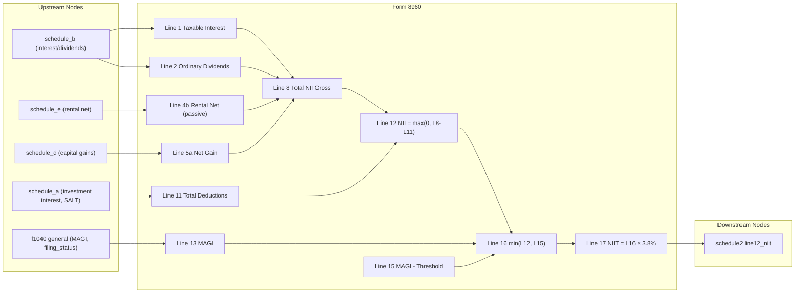

# Form 8960 — Net Investment Income Tax

## Overview
**IRS Form:** Form 8960
**Drake Screen:** 8960
**Tax Year:** 2025
**IRC Reference:** §1411
**Scope:** Individuals (Part I–III, lines 1–17)

---
## Input Fields
| Field | Type | Source Node | Description | IRS Reference | URL |
| ----- | ---- | ----------- | ----------- | ------------- | --- |
| filing_status | FilingStatus enum | general/f1040 | Determines MAGI threshold | Form 8960 line 14 | https://www.irs.gov/instructions/i8960 |
| magi | number | f1040/general | Modified Adjusted Gross Income | Form 8960 line 13 | https://www.irs.gov/instructions/i8960 |
| line1_taxable_interest | number? | schedule_b/INT | Taxable interest (Form 1040 line 2b) | Form 8960 line 1 | https://www.irs.gov/instructions/i8960 |
| line2_ordinary_dividends | number? | schedule_b/DIV | Ordinary dividends (Form 1040 line 3b) | Form 8960 line 2 | https://www.irs.gov/instructions/i8960 |
| line3_annuities | number? | manual/1099-R | Annuities subject to NIIT | Form 8960 line 3 | https://www.irs.gov/instructions/i8960 |
| line4a_passive_income | number? | schedule_c/e/f | Passive trade/business/rental income | Form 8960 line 4a | https://www.irs.gov/instructions/i8960 |
| line4b_rental_net | number? | schedule_e | Net rental income (carry_to_8960=true) | Form 8960 line 4b | https://www.irs.gov/instructions/i8960 |
| line5a_net_gain | number? | schedule_d/8949 | Net gain from disposition of property | Form 8960 line 5a | https://www.irs.gov/instructions/i8960 |
| line5b_net_gain_adjustment | number? | manual | Gains excluded from NII (negative=exclude) | Form 8960 line 5b | https://www.irs.gov/instructions/i8960 |
| line7_other_modifications | number? | manual | Other NII modifications (NOL, §62(a)(1)) | Form 8960 line 7 | https://www.irs.gov/instructions/i8960 |
| line9a_investment_interest_expense | number? | schedule_a | Investment interest expense (Sch A line 9) | Form 8960 line 9a | https://www.irs.gov/instructions/i8960 |
| line9b_state_local_tax | number? | schedule_a | State/local/foreign taxes allocable to NII | Form 8960 line 9b | https://www.irs.gov/instructions/i8960 |
| line10_additional_modifications | number? | manual | Additional deductions/modifications | Form 8960 line 10 | https://www.irs.gov/instructions/i8960 |

---
## Calculation Logic
### Part I — Net Investment Income (lines 1–8)
- Line 8 = line1 + line2 + line3 + line4a + line4b + line5a + line5b + line7
  (line4b and line5b may be negative adjustments)

### Part II — Investment Expenses (lines 9a–11)
- Line 11 = line9a + line9b + line10

### Part III — Tax Computation (lines 12–17)
- Line 12 = max(0, line8 - line11)  — Net Investment Income
- Line 13 = MAGI
- Line 14 = threshold per filing status
- Line 15 = max(0, line13 - line14)  — MAGI excess over threshold
- Line 16 = min(line12, line15)  — smaller of NII or MAGI excess
- Line 17 = line16 × 0.038  — NIIT

### Early return condition
If MAGI ≤ threshold (line15 = 0) → no NIIT, no output.
If NII ≤ 0 (line12 = 0) → no NIIT, no output.

---
## Output Routing
| Output Field | Destination Node | Line / Field | Condition | IRS Reference | URL |
| ------------ | ---------------- | ------------ | --------- | ------------- | --- |
| line17 NIIT | schedule2 | line12_niit | line17 > 0 | Form 8960 line 17 → Sch 2 line 12 | https://www.irs.gov/instructions/i8960 |

---
## Constants & Thresholds (Tax Year 2025)
| Constant | Value | Source | URL |
| -------- | ----- | ------ | --- |
| NIIT_RATE | 0.038 (3.8%) | IRC §1411(a)(1) | https://www.irs.gov/instructions/i8960 |
| THRESHOLD_MFJ | $250,000 | Form 8960 instructions, TY2025 | https://www.irs.gov/instructions/i8960 |
| THRESHOLD_QSS | $250,000 | Form 8960 instructions, TY2025 | https://www.irs.gov/instructions/i8960 |
| THRESHOLD_MFS | $125,000 | Form 8960 instructions, TY2025 | https://www.irs.gov/instructions/i8960 |
| THRESHOLD_SINGLE | $200,000 | Form 8960 instructions, TY2025 | https://www.irs.gov/instructions/i8960 |
| THRESHOLD_HOH | $200,000 | Form 8960 instructions, TY2025 | https://www.irs.gov/instructions/i8960 |

Note: Thresholds are NOT indexed for inflation.

---
## Data Flow Diagram

---
## Edge Cases & Special Rules
1. **MAGI below threshold**: no NIIT due; return empty outputs.
2. **Zero NII**: no NIIT due even if MAGI > threshold.
3. **NII < MAGI excess**: NIIT = NII × 3.8% (NII is limiting factor).
4. **MAGI excess < NII**: NIIT = MAGI_excess × 3.8% (MAGI excess is limiting factor).
5. **Negative deductions**: line4b and line5b can be negative (adjustments); NII floored at 0 (line12 = max(0,...)).
6. **Self-employment income**: excluded from NII per IRC §1411(c)(6).
7. **MFS threshold**: $125,000 — not half of MFJ; intentionally punitive.
8. **Rounding**: round to cents (2 decimal places) to avoid IEEE-754 drift.

---
## Sources
| Document | Year | Section | URL | Saved as |
| -------- | ---- | ------- | --- | -------- |
| Instructions for Form 8960 | 2025 | All | https://www.irs.gov/pub/irs-pdf/i8960.pdf | .research/docs/i8960.pdf |
| IRC §1411 | Current | Net Investment Income Tax | https://www.law.cornell.edu/uscode/text/26/1411 | — |
