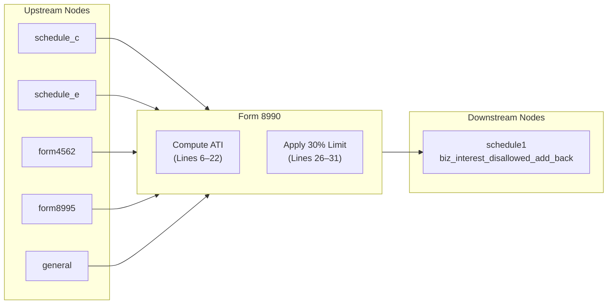

# Form 8990 — Limitation on Business Interest Expense Under Section 163(j)

## Overview
**IRS Form:** Form 8990
**Drake Screen:** 8990
**Tax Year:** 2025
**IRS Instructions:** Rev. December 2025 (P.L. 119-21 — OBBBA reinstates depreciation add-back)

---
## Input Fields
| Field | Type | Source Node | Description | IRS Reference | URL |
| ----- | ---- | ----------- | ----------- | ------------- | --- |
| business_interest_expense | number >= 0 | schedule_c, schedule_e | Current year BIE (line 1) | §163(j), Form 8990 line 1 | i8990.pdf p.9 |
| prior_disallowed_carryforward | number >= 0 | prior year Form 8990 line 31 | Prior year disallowed BIE carryover (line 2) | Form 8990 line 2 | i8990.pdf p.9 |
| floor_plan_interest | number >= 0 | dealer/floor plan | Floor plan financing interest expense (line 4) | §163(j), Form 8990 line 4 | i8990.pdf p.10 |
| tentative_taxable_income | number | f1040/schedule_c | Tentative taxable income before 163(j) (line 6) | Form 8990 line 6 | i8990.pdf p.10 |
| depreciation_amortization | number >= 0 | form4562 | Deduction for depreciation/amortization/depletion (line 11, TY>2024) | Form 8990 line 11 | i8990.pdf p.10 |
| nol_deduction | number >= 0 | prior year | NOL deduction under §172 (line 9) | Form 8990 line 9 | i8990.pdf p.10 |
| qbi_deduction | number >= 0 | form8995 | QBI deduction §199A (line 10) | Form 8990 line 10 | i8990.pdf p.10 |
| business_interest_income | number >= 0 | investment | Business interest income (line 23/25) | Form 8990 line 23 | i8990.pdf p.11 |
| avg_gross_receipts | number >= 0 | general | Average annual gross receipts for 3 prior years | §448(c), §163(j)(3) | i8990.pdf p.2 |
| is_tax_shelter | boolean | general | Whether taxpayer is a tax shelter (§448(d)(3)) | §163(j)(3) | i8990.pdf p.2 |

---
## Calculation Logic

### Small Business Exemption Check
If avg_gross_receipts <= $31,000,000 AND is_tax_shelter == false → no limitation, return no outputs.

### Step 1 — Total BIE Subject to Limitation (Section I)
```
line5_total_bie = business_interest_expense + prior_disallowed_carryforward
```
Floor plan interest (line 4) is separately tracked — it is deductible without limit.

### Step 2 — ATI (Section II, Lines 6–22)
```
ati_raw = tentative_taxable_income
        + business_interest_expense          (line 8 — add back BIE)
        + nol_deduction                      (line 9 — add back NOL)
        + qbi_deduction                      (line 10 — add back §199A)
        + depreciation_amortization          (line 11 — TY2025 reinstated)
        - business_interest_income           (line 18 — reduce by BII)
ati = max(0, ati_raw)                        (line 22 — floor at zero)
```

### Step 3 — Limitation (Section IV)
```
line26_ati_limit  = ati × 30%
line29_max_deduct = line26_ati_limit + floor_plan_interest + business_interest_income
line30_deductible = min(line5_total_bie, line29_max_deduct)
line31_disallowed = line5_total_bie - line30_deductible   (>= 0)
```

### Step 4 — Output
If disallowed > 0: route to schedule1 as `biz_interest_disallowed_add_back`

---
## Output Routing
| Output Field | Destination Node | Line / Field | Condition | IRS Reference | URL |
| ------------ | ---------------- | ------------ | --------- | ------------- | --- |
| biz_interest_disallowed_add_back | schedule1 | Schedule 1 other income | disallowed > 0 | §163(j)(1) | i8990.pdf p.1 |

---
## Constants & Thresholds (Tax Year 2025)
| Constant | Value | Source | URL |
| -------- | ----- | ------ | --- |
| SMALL_BIZ_GROSS_RECEIPTS_THRESHOLD | $31,000,000 | IRC §163(j)(3), §448(c), Rev. Proc. 2025-xx | i8990.pdf p.2 |
| ATI_APPLICABLE_PERCENTAGE | 30% | IRC §163(j)(1)(B) | i8990.pdf p.4 |

---
## Data Flow Diagram


---
## Edge Cases & Special Rules
1. **Small business exemption**: avg_gross_receipts <= $31M and not a tax shelter → exempt, no outputs
2. **Floor plan interest**: fully deductible; increases the cap but is not itself limited
3. **Zero ATI**: only floor plan + BII can offset BIE; remaining BIE is disallowed
4. **Prior carryforward**: added to current year BIE for total subject to limit
5. **ATI floor**: ATI cannot be negative (floor at zero) for individuals, corporations
6. **TY2025 depreciation add-back**: P.L. 119-21 reinstates line 11 for TY beginning after 2024

---
## Sources
| Document | Year | Section | URL | Saved as |
| -------- | ---- | ------- | --- | -------- |
| Instructions for Form 8990 | 2025 | All | https://www.irs.gov/pub/irs-pdf/i8990.pdf | .research/docs/i8990.pdf |
| IRC §163(j) | 2025 | Limitation on business interest | https://uscode.house.gov | — |
| P.L. 119-21 (OBBBA) | 2025 | §163(j) ATI add-back reinstated | — | — |
