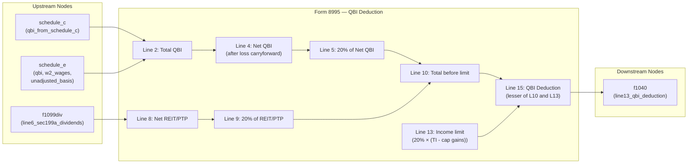

# Form 8995 — Qualified Business Income Deduction Simplified Computation

## Overview
Form 8995 computes the Qualified Business Income (QBI) deduction under IRC §199A for eligible
taxpayers whose taxable income is at or below the threshold amounts ($197,300 single / $394,600 MFJ
for TY2025). Taxpayers above the threshold must use Form 8995-A instead.

The form aggregates QBI from sole proprietorships (Schedule C), pass-through rentals (Schedule E),
and Section 199A dividends from REITs/regulated investment companies (Form 1099-DIV box 5). It
computes 20% of the net QBI, limits it to 20% of taxable income (before QBI deduction, minus net
capital gain), and outputs the resulting deduction to Form 1040, line 13.

**IRS Form:** Form 8995
**Drake Screen:** 8995
**Tax Year:** 2025
**Drake Reference:** https://kb.drakesoftware.com/Site/Browse/17476

---

## Input Fields
Fields received from upstream NodeOutput objects.

| Field | Type | Source Node | Description | IRS Reference | URL |
| ----- | ---- | ----------- | ----------- | ------------- | --- |
| `qbi_from_schedule_c` | number | schedule_c | Net profit from Schedule C (sole proprietorship QBI) | Form 8995, Line 1c | IRS Instructions for Form 8995 (2025), p.4 |
| `qbi` | number | schedule_e | Net QBI from rental/pass-through (Schedule E) | Form 8995, Line 1c | IRS Instructions for Form 8995 (2025), p.4 |
| `w2_wages` | number | schedule_e | W-2 wages from pass-through (informational; used only in Form 8995-A) | Form 8995-A | IRS Instructions for Form 8995 (2025), p.2 |
| `unadjusted_basis` | number | schedule_e | UBIA of qualified property (informational; used only in Form 8995-A) | Form 8995-A | IRS Instructions for Form 8995 (2025), p.2 |
| `line6_sec199a_dividends` | number | f1099div | Section 199A dividends from REITs (Form 1099-DIV box 5) | Form 8995, Line 6 | IRS Instructions for Form 8995 (2025), p.3 |
| `taxable_income` | number | (via executor) | Taxable income before QBI deduction (Form 1040, line 11) | Form 8995, Line 11 | IRS Instructions for Form 8995 (2025), p.4 |
| `net_capital_gain` | number | (via executor) | Net capital gain (from Schedule D / Form 1040) | Form 8995, Line 12 | IRS Instructions for Form 8995 (2025), p.4 |
| `qbi_loss_carryforward` | number | (prior year) | Prior-year QBI net loss carryforward | Form 8995, Line 3 | IRS Instructions for Form 8995 (2025), p.4 |
| `reit_loss_carryforward` | number | (prior year) | Prior-year REIT/PTP net loss carryforward | Form 8995, Line 7 | IRS Instructions for Form 8995 (2025), p.4 |

---

## Calculation Logic

### Step 1 — Aggregate QBI from all trades/businesses (Line 2)
Sum all per-business QBI amounts: `qbi_from_schedule_c` + `qbi` (from Schedule E).
This is the total of Line 1c amounts across all trades or businesses.
> **Source:** IRS Instructions for Form 8995 (2025), Line 1–2, p.4 — https://www.irs.gov/pub/irs-pdf/i8995.pdf

### Step 2 — Add prior-year QBI loss carryforward (Line 3)
Add the qualified portion of prior-year trade or business (loss) carryforward.
Losses from a prior year that created a net QBI loss are carried forward as negative QBI.
Line 3 reduces current-year QBI.
> **Source:** IRS Instructions for Form 8995 (2025), Line 3, p.4 — https://www.irs.gov/pub/irs-pdf/i8995.pdf

### Step 3 — Compute net QBI (Line 4)
`line4 = line2 + line3` (line3 is negative for loss carryforwards).
If line4 is negative, no QBI deduction is allowed. The loss carries forward to next year.
> **Source:** IRS Instructions for Form 8995 (2025), Line 4, p.4 — https://www.irs.gov/pub/irs-pdf/i8995.pdf

### Step 4 — Compute QBI component — 20% of net QBI (Line 5)
`line5 = line4 × 0.20`
If line4 is negative (net loss), line5 is zero (no deduction; carry loss forward).
> **Source:** IRS Instructions for Form 8995 (2025), Line 5; IRC §199A(a) — https://www.irs.gov/pub/irs-pdf/i8995.pdf

### Step 5 — Total qualified REIT dividends/PTP income (Line 6)
Enter qualified REIT dividends from Form 1099-DIV box 5 (section 199A dividends).
This is the `line6_sec199a_dividends` input.
> **Source:** IRS Instructions for Form 8995 (2025), Line 6, p.3 — https://www.irs.gov/pub/irs-pdf/i8995.pdf

### Step 6 — Add prior-year REIT/PTP loss carryforward (Line 7)
Add the prior-year REIT/PTP qualified net loss carryforward (entered as negative number).
> **Source:** IRS Instructions for Form 8995 (2025), Line 7, p.4 — https://www.irs.gov/pub/irs-pdf/i8995.pdf

### Step 7 — Compute net REIT/PTP (Line 8)
`line8 = line6 + line7` (line7 is negative for carryforwards).
If line8 is negative, carry loss to next year; line8 treated as zero for deduction.
> **Source:** IRS Instructions for Form 8995 (2025), Line 8, p.4 — https://www.irs.gov/pub/irs-pdf/i8995.pdf

### Step 8 — Compute REIT/PTP component — 20% of net REIT/PTP (Line 9)
`line9 = max(0, line8) × 0.20`
> **Source:** IRS Instructions for Form 8995 (2025), Line 9; IRC §199A(c) — https://www.irs.gov/pub/irs-pdf/i8995.pdf

### Step 9 — Total QBI deduction before income limitation (Line 10)
`line10 = line5 + line9`
> **Source:** IRS Instructions for Form 8995 (2025), Line 10 — https://www.irs.gov/pub/irs-pdf/i8995.pdf

### Step 10 — Taxable income before QBI deduction (Line 11)
The executor provides `taxable_income`. For Form 1040 filers:
`line11 = Form 1040 line 11a (tentative taxable income before QBI deduction), minus lines 12e and 13b`.
> **Source:** IRS Instructions for Form 8995 (2025), Line 11, p.4 — https://www.irs.gov/pub/irs-pdf/i8995.pdf

### Step 11 — Net capital gain (Line 12)
From Form 1040 line 3a plus net capital gain from Schedule D (or line 7a if Schedule D not required).
> **Source:** IRS Instructions for Form 8995 (2025), Line 12, p.4 — https://www.irs.gov/pub/irs-pdf/i8995.pdf

### Step 12 — Income limitation base (Lines 11 minus 12)
`income_limit_base = max(0, taxable_income - net_capital_gain)`
The QBI deduction cannot exceed 20% of this amount.
> **Source:** IRS Instructions for Form 8995 (2025), Lines 11–12; IRC §199A(a)(2) — https://www.irs.gov/pub/irs-pdf/i8995.pdf

### Step 13 — Income limitation (Line 13)
`line13_limit = income_limit_base × 0.20`
> **Source:** IRS Instructions for Form 8995 (2025), Line 13; IRC §199A(a)(2) — https://www.irs.gov/pub/irs-pdf/i8995.pdf

### Step 14 — QBI deduction (Line 15 = the lesser of Line 10 and Line 13)
`qbi_deduction = min(line10, line13_limit)`
This is the deduction entered on Form 1040, line 13.
> **Source:** IRS Instructions for Form 8995 (2025), Line 15; IRC §199A(a) — https://www.irs.gov/pub/irs-pdf/i8995.pdf

### Step 15 — Carryforward of net QBI loss (Line 16)
If `line4 < 0`, carry the loss to next year: `qbi_loss_carryforward_out = line4`.
If `line4 >= 0`, carryforward is zero.
> **Source:** IRS Instructions for Form 8995 (2025), Line 16, p.5 — https://www.irs.gov/pub/irs-pdf/i8995.pdf

### Step 16 — Carryforward of net REIT/PTP loss (Line 17)
If `line8 < 0`, carry the loss to next year: `reit_loss_carryforward_out = line8`.
If `line8 >= 0`, carryforward is zero.
> **Source:** IRS Instructions for Form 8995 (2025), Line 17, p.5 — https://www.irs.gov/pub/irs-pdf/i8995.pdf

---

## Output Routing

| Output Field | Destination Node | Line / Field | Condition | IRS Reference | URL |
| ------------ | ---------------- | ------------ | --------- | ------------- | --- |
| `line13_qbi_deduction` | f1040 | Form 1040, Line 13 | `qbi_deduction > 0` | IRC §199A(a) | https://www.irs.gov/pub/irs-pdf/i8995.pdf |

---

## Constants & Thresholds (Tax Year 2025)

| Constant | Value | Source | URL |
| -------- | ----- | ------ | --- |
| QBI deduction rate | 20% (0.20) | IRC §199A(a) | https://www.irs.gov/pub/irs-pdf/i8995.pdf |
| Income threshold — Single / All other | $197,300 | Rev. Proc. 2024-40; IRS Instructions for Form 8995 (2025), p.1 | https://www.irs.gov/pub/irs-pdf/i8995.pdf |
| Income threshold — MFJ | $394,600 | Rev. Proc. 2024-40; IRS Instructions for Form 8995 (2025), p.1 | https://www.irs.gov/pub/irs-pdf/i8995.pdf |

**Note:** Form 8995 is used only when taxable income ≤ threshold. Above the threshold, taxpayers
must use Form 8995-A. This routing decision is made by upstream nodes (e.g. f1099div) before data
reaches this node. Form 8995 itself does not re-check or enforce this threshold.

---

## Data Flow Diagram

---

## Edge Cases & Special Rules

1. **Net QBI loss carryforward:** If total QBI is negative (net loss year), no QBI deduction is
   allowed. The net loss carries forward to reduce QBI in future years (Line 16).

2. **REIT/PTP net loss carryforward:** If REIT dividends plus carryforward yield a net negative,
   no REIT/PTP component is allowed. Loss carries forward (Line 17).

3. **Income limitation can reduce deduction to zero:** If taxable income equals net capital gain
   (e.g., only long-term cap gains, no ordinary income), the income limitation base is zero, and
   the QBI deduction is zero.

4. **Both QBI and REIT dividends present:** Line 10 sums both components before applying the
   income limitation.

5. **Zero inputs:** If all inputs are zero or absent, no f1040 output is produced.

6. **w2_wages and unadjusted_basis ignored:** These fields are accepted (passed through from
   schedule_e) but are not used in the simplified computation. They are only relevant for Form
   8995-A (W-2 wages/UBIA limitation). This node accepts them without error but does not use them.

---

## Sources

| Document | Year | Section | URL | Saved as |
| -------- | ---- | ------- | --- | -------- |
| IRS Instructions for Form 8995 | 2025 | All lines | https://www.irs.gov/pub/irs-pdf/i8995.pdf | .research/docs/i8995.pdf |
| IRS Form 8995 | 2025 | Full form | https://www.irs.gov/pub/irs-pdf/f8995.pdf | .research/docs/f8995.pdf |
| IRC §199A | — | Qualified Business Income | https://www.law.cornell.edu/uscode/text/26/199A | — |
| Rev. Proc. 2024-40 | 2024 | TY2025 inflation adjustments | https://www.irs.gov/pub/irs-drop/rp-24-40.pdf | — |
