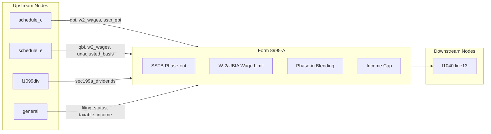

# Form 8995-A — Qualified Business Income Deduction

## Overview
**IRS Form:** Form 8995-A
**Drake Screen:** 8995 (shared with 8995)
**Tax Year:** 2025

---
## Input Fields
| Field | Type | Source Node | Description | IRS Reference | URL |
| ----- | ---- | ----------- | ----------- | ------------- | --- |
| filing_status | enum | general | Filing status determines threshold | IRC §199A(b)(3)(B) | |
| taxable_income | number | f1040 (computed) | Taxable income before QBI deduction | Form 8995-A line 1 | |
| net_capital_gain | number | schedule_d | Net capital gain (reduces income limit) | Reg. §1.199A-1(b)(4) | |
| qbi | number | schedule_c, schedule_e | Qualified business income (non-SSTB) | Form 8995-A Part I | |
| w2_wages | number | schedule_c, schedule_e | W-2 wages from qualified business | Form 8995-A Part II | |
| unadjusted_basis | number | schedule_c, schedule_e | UBIA of qualified property | Form 8995-A Part II | |
| sstb_qbi | number | schedule_c, schedule_e | QBI from SSTB (specified service) | Form 8995-A Part I | |
| sstb_w2_wages | number | schedule_c, schedule_e | W-2 wages from SSTB | Form 8995-A Part II | |
| sstb_unadjusted_basis | number | schedule_c, schedule_e | UBIA from SSTB | Form 8995-A Part II | |
| line6_sec199a_dividends | number | f1099div | Section 199A REIT dividends | Form 8995-A line 6 | |
| qbi_loss_carryforward | number≤0 | prior year | Prior QBI net loss carryforward | Form 8995-A line 3 | |
| reit_loss_carryforward | number≤0 | prior year | Prior REIT/PTP net loss carryforward | Form 8995-A line 7 | |

---
## Calculation Logic

### Step 1 — Determine Phase-in
Thresholds (TY2025): $197,300 single, $394,600 MFJ
Phase-in range: threshold to threshold + $100,000
- reduction_ratio = clamp((taxable_income - threshold) / 100,000, 0, 1)

### Step 2 — Adjust SSTB Amounts
If reduction_ratio > 0 (in or above phase-in range):
- adjusted_sstb_qbi = sstb_qbi × (1 - reduction_ratio)
- adjusted_sstb_w2 = sstb_w2_wages × (1 - reduction_ratio)
- adjusted_sstb_ubia = sstb_unadjusted_basis × (1 - reduction_ratio)
If reduction_ratio = 1: SSTB entirely phased out (no QBI from SSTB)

### Step 3 — Total QBI and Wages
total_qbi = (qbi + adjusted_sstb_qbi) + qbi_loss_carryforward
total_w2 = w2_wages + adjusted_sstb_w2
total_ubia = unadjusted_basis + adjusted_sstb_ubia

### Step 4 — QBI Component (before wage limitation)
qbi_before_limit = max(0, total_qbi) × 20%

### Step 5 — W-2/UBIA Wage Limitation
wage_limit_a = 50% × total_w2
wage_limit_b = 25% × total_w2 + 2.5% × total_ubia
applicable_wage_limit = max(wage_limit_a, wage_limit_b)

### Step 6 — Apply Phase-in to Limitation
If reduction_ratio = 0: qbi_component = qbi_before_limit  (no wage limit applies)
If reduction_ratio = 1: qbi_component = min(qbi_before_limit, applicable_wage_limit)
If 0 < reduction_ratio < 1: (partial phase-in)
  phase_in_amount = reduction_ratio × (qbi_before_limit - applicable_wage_limit)
  qbi_component = qbi_before_limit - max(0, phase_in_amount)

### Step 7 — REIT/PTP Component
net_reit = max(0, line6_sec199a_dividends + reit_loss_carryforward)
reit_component = net_reit × 20%

### Step 8 — Total Before Income Cap
total_before_cap = qbi_component + reit_component

### Step 9 — Income Cap
income_cap = max(0, taxable_income - net_capital_gain) × 20%
final_deduction = min(total_before_cap, income_cap)

---
## Output Routing
| Output Field | Destination Node | Line / Field | Condition | IRS Reference | URL |
| ------------ | ---------------- | ------------ | --------- | ------------- | --- |
| line13_qbi_deduction | f1040 | Line 13 | final_deduction > 0 | Form 1040 line 13 | |

---
## Constants & Thresholds (Tax Year 2025)
| Constant | Value | Source | URL |
| -------- | ----- | ------ | --- |
| THRESHOLD_SINGLE | $197,300 | Rev. Proc. 2024-40 | https://www.irs.gov/pub/irs-drop/rp-24-40.pdf |
| THRESHOLD_MFJ | $394,600 | Rev. Proc. 2024-40 | |
| PHASE_IN_RANGE | $100,000 | IRC §199A(b)(3)(B)(ii) | |
| QBI_RATE | 20% | IRC §199A(a) | |
| W2_LIMIT_A | 50% of W-2 wages | IRC §199A(b)(2)(A)(i) | |
| W2_LIMIT_B | 25% W-2 + 2.5% UBIA | IRC §199A(b)(2)(A)(ii) | |

---
## Data Flow Diagram

---
## Edge Cases & Special Rules
1. SSTB fully phased out above phase-in range (reduction_ratio = 1)
2. Non-SSTB not affected by SSTB rules regardless of income
3. If QBI is negative, treated as zero for deduction (but carryforward applies next year)
4. Phase-in: only the limitation is phased in, not the rate itself
5. W-2 wage limit does NOT apply below threshold (simplification matches form8995 behavior)
6. REIT dividends never subject to W-2 wage limitation

---
## Sources
| Document | Year | Section | URL | Saved as |
| -------- | ---- | ------- | --- | -------- |
| Instructions for Form 8995-A | 2024 | All | https://www.irs.gov/instructions/i8995a | .research/docs/i8995a.pdf |
| IRC §199A | current | (a)-(b) | https://www.law.cornell.edu/uscode/text/26/199A | — |
| Rev. Proc. 2024-40 | 2024 | §3.24 | https://www.irs.gov/pub/irs-drop/rp-24-40.pdf | — |
