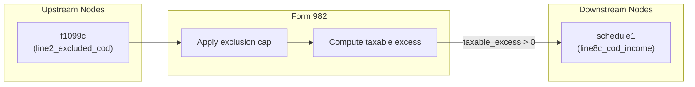

# Form 982 — Reduction of Tax Attributes Due to Discharge of Indebtedness

## Overview
**IRS Form:** Form 982
**Drake Screen:** 982
**Tax Year:** 2025

---
## Input Fields
| Field | Type | Source Node | Description | IRS Reference | URL |
| ----- | ---- | ----------- | ----------- | ------------- | --- |
| line2_excluded_cod | number | f1099c | Total excluded COD amount (line 2) | Form 982 Line 2 | https://www.irs.gov/pub/irs-pdf/f982.pdf |
| exclusion_type | enum | f1099c / user | Reason for exclusion: bankruptcy, insolvency, farm_debt, real_property_business, qpri | Form 982 Lines 1a-1e | https://www.irs.gov/instructions/i982 |
| insolvency_amount | number (optional) | user | For insolvency: liabilities minus FMV of assets immediately before discharge | IRC §108(a)(1)(B) | https://www.irs.gov/instructions/i982 |
| qpri_mfs | boolean (optional) | user | True if married filing separately (lowers QPRI cap from $750k to $375k) | Form 982 Line 1e | https://www.irs.gov/instructions/i982 |

---
## Calculation Logic
### Step 1 — Determine Applicable Cap
- bankruptcy: no cap
- insolvency: cap = insolvency_amount
- farm_debt: no explicit dollar cap (limited by tax attributes — not enforced in return)
- real_property_business: no explicit dollar cap (limited by adjusted basis)
- qpri: cap = $750,000 ($375,000 if MFS); discharges before Jan 1, 2026 only

### Step 2 — Compute Excluded Amount
excluded = min(line2_excluded_cod, applicable_cap)

### Step 3 — Taxable Excess
taxable_excess = line2_excluded_cod - excluded
If taxable_excess > 0 → route to schedule1 line8c_cod_income

---
## Output Routing
| Output Field | Destination Node | Line / Field | Condition | IRS Reference | URL |
| ------------ | ---------------- | ------------ | --------- | ------------- | --- |
| line8c_cod_income | schedule1 | line8c | taxable_excess > 0 | Form 982; IRC §108 | https://www.irs.gov/instructions/i982 |

---
## Constants & Thresholds (Tax Year 2025)
| Constant | Value | Source | URL |
| -------- | ----- | ------ | --- |
| QPRI_CAP_STANDARD | 750000 | IRC §108(a)(1)(E); Form 982 instructions | https://www.irs.gov/instructions/i982 |
| QPRI_CAP_MFS | 375000 | IRC §108(a)(1)(E); Form 982 instructions | https://www.irs.gov/instructions/i982 |

---
## Data Flow Diagram

---
## Edge Cases & Special Rules
- Insolvency cap: excluded amount cannot exceed insolvency margin
  (total liabilities minus total FMV of assets immediately before discharge)
- QPRI: applies only to discharges before January 1, 2026
- QPRI: MFS filers capped at $375,000; all others at $750,000
- If line2_excluded_cod = 0, no output produced
- Bankruptcy (Title 11) exclusion has no dollar cap
- Tax attribute reductions (NOL, credit carryovers, basis reductions) are Part II/III of Form 982
  and are tracked as carry-forward adjustments — not computed on the 1040 return itself

---
## Sources
| Document | Year | Section | URL | Saved as |
| -------- | ---- | ------- | --- | -------- |
| Instructions for Form 982 | 2021 (Rev. Dec 2021) | All | https://www.irs.gov/pub/irs-pdf/i982.pdf | .research/docs/i982.pdf |
| IRC §108 | 2025 | §108(a), §108(b) | https://www.law.cornell.edu/uscode/text/26/108 | — |
