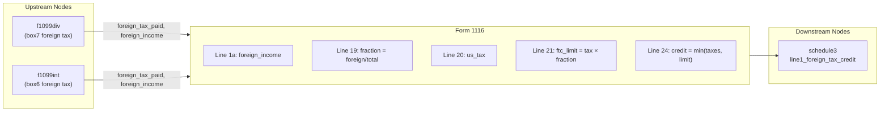

# Form 1116 — Foreign Tax Credit

## Overview
**IRS Form:** Form 1116
**Drake Screen:** 1116
**Tax Year:** 2025

---
## Input Fields
| Field | Type | Source Node | Description | IRS Reference | URL |
| ----- | ---- | ----------- | ----------- | ------------- | --- |
| foreign_tax_paid | number | f1099div (box7), f1099int (box6) | Total creditable foreign taxes paid/accrued | IRC §901 | https://www.irs.gov/pub/irs-pdf/i1116.pdf |
| foreign_income | number | f1099div, f1099int | Gross foreign source income (Line 1a) | Form 1116 Part I | https://www.irs.gov/pub/irs-pdf/i1116.pdf |
| total_income | number | upstream aggregation | Worldwide gross income from all sources (Line 3e) | Form 1116 Part I Line 3e | https://www.irs.gov/pub/irs-pdf/i1116.pdf |
| us_tax_before_credits | number | f1040 (line 16) | Regular tax liability before credits (Line 20) | Form 1116 Part III Line 20 | https://www.irs.gov/pub/irs-pdf/i1116.pdf |
| income_category | IncomeCategory enum | upstream | Category of foreign income (passive, general, etc.) | Form 1116 Part I checkbox | https://www.irs.gov/pub/irs-pdf/i1116.pdf |
| filing_status | FilingStatus enum | start node | Determines de minimis threshold | IRS instructions p.1 | https://www.irs.gov/pub/irs-pdf/i1116.pdf |

---
## Calculation Logic
### Step 1 — De minimis check (election, upstream)
If total creditable foreign taxes ≤ $300 ($600 MFJ) and all from 1099 payee statements,
no Form 1116 is needed. The upstream node (f1099div/f1099int) handles this routing.
This node only receives input when above the threshold.

### Step 2 — FTC Limitation (Part III, IRC §904(a))
```
limitation_fraction = min(1, foreign_income / total_income)
ftc_limit = us_tax_before_credits × limitation_fraction
allowed_credit = min(foreign_taxes_paid, ftc_limit)
```

### Step 3 — Output
Route `allowed_credit` → schedule3 line1_foreign_tax_credit

---
## Output Routing
| Output Field | Destination Node | Line / Field | Condition | IRS Reference | URL |
| ------------ | ---------------- | ------------ | --------- | ------------- | --- |
| allowed_credit | schedule3 | line1_foreign_tax_credit | credit > 0 | Schedule 3 Part I Line 1 | https://www.irs.gov/pub/irs-pdf/f1040s3.pdf |

---
## Constants & Thresholds (Tax Year 2025)
| Constant | Value | Source | URL |
| -------- | ----- | ------ | --- |
| DE_MINIMIS_SINGLE | $300 | IRS Instructions p.1 | https://www.irs.gov/pub/irs-pdf/i1116.pdf |
| DE_MINIMIS_MFJ | $600 | IRS Instructions p.1 | https://www.irs.gov/pub/irs-pdf/i1116.pdf |

---
## Data Flow Diagram


---
## Edge Cases & Special Rules
1. **No foreign income** → no output (nothing to credit)
2. **FTC ≤ limitation** → full credit (credit = foreign_taxes_paid)
3. **FTC > limitation** → limited credit (credit = ftc_limit); excess carries forward 10 yr / back 1 yr (not modeled here)
4. **Zero US tax** → no credit (limitation = 0)
5. **Passive vs General category** — tracked via income_category enum; separate Form 1116 per category
6. **De minimis** → handled upstream; this node only fires when above threshold

---
## Sources
| Document | Year | Section | URL | Saved as |
| -------- | ---- | ------- | --- | -------- |
| Instructions for Form 1116 | 2025 | All parts | https://www.irs.gov/pub/irs-pdf/i1116.pdf | i1116.pdf |
| Form 1116 | 2025 | Parts I–IV | https://www.irs.gov/pub/irs-pdf/f1116.pdf | — |
| IRC §904 | — | FTC Limitation | https://www.law.cornell.edu/uscode/text/26/904 | — |
