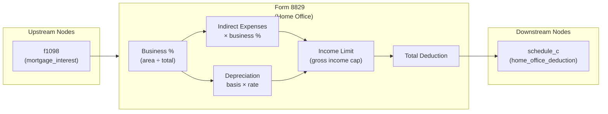

# Form 8829 — Expenses for Business Use of Your Home

## Overview
Form 8829 computes the allowable home office deduction for Schedule C (self-employment). It takes actual home expenses (mortgage interest, insurance, utilities, etc.) and a business-use percentage (business area / total area) and applies the gross income limitation to determine the deductible amount. Any excess expenses carry forward to the next year. The result is the "home office deduction" that flows to Schedule C line 30.

**IRS Form:** Form 8829
**Drake Screen:** 8829
**Tax Year:** 2025
**Drake Reference:** https://kb.drakesoftware.com/Site/Browse/1 (no specific article found; general KB reference)

---

## Input Fields
Fields received from upstream NodeOutput objects and user-entered fields on the Drake 8829 screen.

| Field | Type | Source Node | Description | IRS Reference | URL |
| ----- | ---- | ----------- | ----------- | ------------- | --- |
| `mortgage_interest` | number (optional) | f1098 | Mortgage interest allocated to home office | Form 8829 Line 18 | https://www.irs.gov/instructions/i8829 |
| `total_area` | number (optional) | user (8829 screen) | Total area of home in sq ft (Line 1) | Form 8829 Part I Line 1 | https://www.irs.gov/instructions/i8829 |
| `business_area` | number (optional) | user (8829 screen) | Area used exclusively for business (Line 2) | Form 8829 Part I Line 2 | https://www.irs.gov/instructions/i8829 |
| `gross_income_limit` | number (optional) | user (8829 screen) | Gross income limit = tentative profit from Sch C before home office (Line 8) | Form 8829 Part II Line 8 | https://www.irs.gov/instructions/i8829 |
| `direct_expenses` | number (optional) | user (8829 screen) | Direct expenses (benefit only business part) | Form 8829 Part II | https://www.irs.gov/instructions/i8829 |
| `insurance` | number (optional) | user (8829 screen) | Homeowner's/renter's insurance (indirect) | Form 8829 Line 19 | https://www.irs.gov/instructions/i8829 |
| `rent` | number (optional) | user (8829 screen) | Rent paid for home (indirect) | Form 8829 Line 19 | https://www.irs.gov/instructions/i8829 |
| `repairs_maintenance` | number (optional) | user (8829 screen) | Repairs and maintenance (indirect) | Form 8829 Line 20 | https://www.irs.gov/instructions/i8829 |
| `utilities` | number (optional) | user (8829 screen) | Utilities (indirect) | Form 8829 Line 21 | https://www.irs.gov/instructions/i8829 |
| `other_expenses` | number (optional) | user (8829 screen) | Other indirect expenses | Form 8829 Line 22 | https://www.irs.gov/instructions/i8829 |
| `prior_year_operating_carryover` | number (optional) | user (8829 screen) | Prior year unallowed operating expenses (from 2024 Form 8829 Line 43) | Form 8829 Line 25 | https://www.irs.gov/instructions/i8829 |
| `home_fmv_or_basis` | number (optional) | user (8829 screen) | Smaller of adjusted basis or FMV of home (excluding land) for depreciation | Form 8829 Part III Line 37 | https://www.irs.gov/instructions/i8829 |
| `first_business_use_month` | number (optional) | user (8829 screen) | Month home first used for business (1=Jan … 12=Dec) for TY2025 depreciation rate lookup | Form 8829 Part III Line 41 | https://www.irs.gov/instructions/i8829 |
| `prior_year_depreciation_carryover` | number (optional) | user (8829 screen) | Prior year unallowed excess depreciation (from 2024 Form 8829 Line 44) | Form 8829 Line 31 | https://www.irs.gov/instructions/i8829 |

---

## Calculation Logic

### Step 1 — Business Percentage (Part I)
Divide business area by total area to get business-use percentage.

- Line 1: `total_area`
- Line 2: `business_area`
- Line 7: `business_pct = business_area / total_area`  (capped at 1.0)

> **Source:** IRS Instructions for Form 8829 (TY2025), Part I, p.1 — https://www.irs.gov/instructions/i8829

### Step 2 — Apply Business Percentage to Indirect Expenses (Part II)
Each indirect expense is multiplied by business_pct. Direct expenses are used at 100%.

- Indirect total = `(insurance + rent + repairs_maintenance + utilities + other_expenses) × business_pct`
- Mortgage interest (from f1098) is already the business-allocated amount; used directly.
- Operating expenses subtotal = `indirect_total + mortgage_interest`

> **Source:** IRS Instructions for Form 8829 (TY2025), Part II Lines 16–22 — https://www.irs.gov/instructions/i8829

### Step 3 — Depreciation (Part III)
Depreciation of the business portion of the home using MACRS 39-year (non-residential real property).

- Line 39: `business_basis = home_fmv_or_basis × business_pct`
- Line 41: `depreciation = business_basis × depreciation_rate`  (rate from table by first-use month)
- Rate table for TY2025 first-year use:
  - January: 2.461%
  - February: 2.247%
  - March: 2.033%
  - April: 1.819%
  - May: 1.605%
  - June: 1.391%
  - July: 1.177%
  - August: 0.963%
  - September: 0.749%
  - October: 0.535%
  - November: 0.321%
  - December: 0.107%
- Prior year use (business use started before 2025): 2.564%

> **Source:** IRS Instructions for Form 8829 (TY2025), Part III Line 41 — https://www.irs.gov/instructions/i8829

### Step 4 — Total Operating Expenses + Prior Year Carryover (Lines 23–26)
- Line 23: Total operating expenses = `operating_expenses_subtotal`
- Line 25: Prior year operating carryover
- Line 26: Total = `Line 23 + Line 25`

> **Source:** IRS Instructions for Form 8829 (TY2025), Part II Lines 23–26

### Step 5 — Gross Income Limitation (Lines 27–34)
The total deduction (operating + depreciation) cannot exceed the gross income from the business use of the home (Line 8 = tentative profit from Schedule C before the home office deduction).

- Line 27: `income_limit = gross_income_limit` (Line 8)
- Line 28: `allowable_operating = min(Line 26, Line 27)`
- Remaining limit: `Line 33 = max(0, Line 27 - Line 28)`
- Line 32: Depreciation total = `depreciation + prior_year_depreciation_carryover`
- Line 34: `allowable_depreciation = min(Line 32, Line 33)`

> **Source:** IRS Instructions for Form 8829 (TY2025), Part II Lines 27–34 — https://www.irs.gov/instructions/i8829

### Step 6 — Total Allowable Deduction (Line 35)
- Line 35: `total_deduction = allowable_operating + allowable_depreciation`
- Line 37 (deduction to Sch C): same as Line 35 when no casualty losses involved

> **Source:** IRS Instructions for Form 8829 (TY2025), Part II Lines 35–37

### Step 7 — Carryover (Part IV)
- Operating carryover: `max(0, (operating_expenses + prior_year_operating_carryover) - allowable_operating)`
- Depreciation carryover: `max(0, (depreciation + prior_year_depreciation_carryover) - allowable_depreciation)`
- Carryovers are informational only (not output to downstream nodes in this engine — no downstream carryover node exists)

> **Source:** IRS Instructions for Form 8829 (TY2025), Part IV Lines 43–44 — https://www.irs.gov/instructions/i8829

---

## Output Routing

| Output Field | Destination Node | Line / Field | Condition | IRS Reference | URL |
| ------------ | ---------------- | ------------ | --------- | ------------- | --- |
| `home_office_deduction` | schedule_c | Line 30 | total_deduction > 0 | Form 8829 Line 37 → Sch C Line 30 | https://www.irs.gov/instructions/i8829 |

---

## Constants & Thresholds (Tax Year 2025)

| Constant | Value | Source | URL |
| -------- | ----- | ------ | --- |
| Depreciation rate — January first use | 2.461% | IRS Instructions Form 8829, Part III Line 41 Table | https://www.irs.gov/instructions/i8829 |
| Depreciation rate — February first use | 2.247% | IRS Instructions Form 8829, Part III Line 41 Table | https://www.irs.gov/instructions/i8829 |
| Depreciation rate — March first use | 2.033% | IRS Instructions Form 8829, Part III Line 41 Table | https://www.irs.gov/instructions/i8829 |
| Depreciation rate — April first use | 1.819% | IRS Instructions Form 8829, Part III Line 41 Table | https://www.irs.gov/instructions/i8829 |
| Depreciation rate — May first use | 1.605% | IRS Instructions Form 8829, Part III Line 41 Table | https://www.irs.gov/instructions/i8829 |
| Depreciation rate — June first use | 1.391% | IRS Instructions Form 8829, Part III Line 41 Table | https://www.irs.gov/instructions/i8829 |
| Depreciation rate — July first use | 1.177% | IRS Instructions Form 8829, Part III Line 41 Table | https://www.irs.gov/instructions/i8829 |
| Depreciation rate — August first use | 0.963% | IRS Instructions Form 8829, Part III Line 41 Table | https://www.irs.gov/instructions/i8829 |
| Depreciation rate — September first use | 0.749% | IRS Instructions Form 8829, Part III Line 41 Table | https://www.irs.gov/instructions/i8829 |
| Depreciation rate — October first use | 0.535% | IRS Instructions Form 8829, Part III Line 41 Table | https://www.irs.gov/instructions/i8829 |
| Depreciation rate — November first use | 0.321% | IRS Instructions Form 8829, Part III Line 41 Table | https://www.irs.gov/instructions/i8829 |
| Depreciation rate — December first use | 0.107% | IRS Instructions Form 8829, Part III Line 41 Table | https://www.irs.gov/instructions/i8829 |
| Depreciation rate — prior year use (pre-2025 start) | 2.564% | IRS Instructions Form 8829, Part III Line 41 | https://www.irs.gov/instructions/i8829 |

---

## Data Flow Diagram

---

## Edge Cases & Special Rules

1. **Zero total area**: If `total_area` is 0 or missing, business_pct = 0 → no deduction. Return empty outputs.
2. **Income limitation**: Total deduction (operating + depreciation) cannot exceed gross income from business home use. Excess carries forward.
3. **Gross income limit = 0**: If gross_income_limit is 0, no deduction is allowed in current year. All expenses carry forward.
4. **Prior year carryovers**: Prior year operating and depreciation carryovers are subject to the same income limitation in the current year.
5. **Depreciation only when basis provided**: If `home_fmv_or_basis` is absent, no depreciation is computed.
6. **First use month 1–12**: Must be in range 1–12 for TY2025 rate. Out-of-range defaults to prior-year rate (2.564%).
7. **Mortgage interest from f1098**: The `mortgage_interest` field is already business-allocated (no further business_pct multiplication needed — f1098 sends the full qualifying amount).
8. **No casualty losses in scope**: Casualty losses (Form 4684) and their interaction with Form 8829 are out of scope for this node; only operating expenses and depreciation are modeled.

---

## Sources

| Document | Year | Section | URL | Saved as |
| -------- | ---- | ------- | --- | -------- |
| IRS Instructions for Form 8829 | 2025 | Parts I–IV | https://www.irs.gov/instructions/i8829 | .research/docs/i8829.pdf |
| IRS Form 8829 | 2025 | All Parts | https://www.irs.gov/pub/irs-pdf/f8829.pdf | .research/docs/f8829.pdf |
