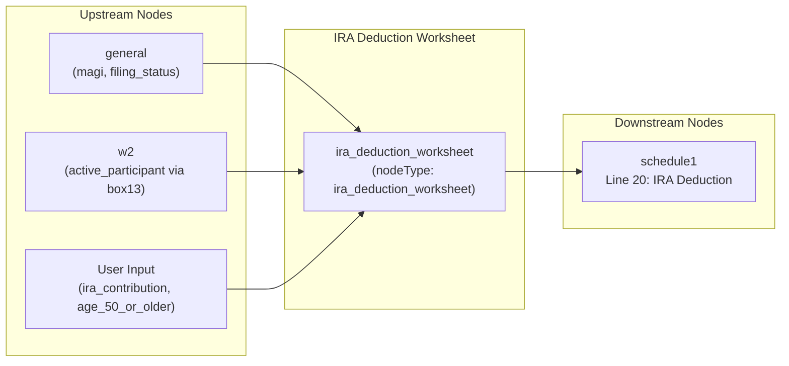

# IRA Deduction Worksheet

## Overview
**IRS Form:** Schedule 1, Line 20 (IRA Deduction Worksheet)
**Drake Screen:** None (no screen found in screens.json)
**Tax Year:** 2025

---
## Input Fields
| Field | Type | Source Node | Description | IRS Reference | URL |
| ----- | ---- | ----------- | ----------- | ------------- | --- |
| filing_status | FilingStatus enum | upstream | Filing status of taxpayer | Pub 590-A p. 12 | https://www.irs.gov/publications/p590a |
| magi | number | upstream (f1040/general) | Modified Adjusted Gross Income | Pub 590-A Worksheet 1-1 | https://www.irs.gov/publications/p590a |
| ira_contribution | number | user input | Traditional IRA contribution for the year | Pub 590-A p. 6 | https://www.irs.gov/publications/p590a |
| active_participant | boolean | W-2 Box 13 / user | Is taxpayer covered by employer retirement plan | Pub 590-A p. 12 | https://www.irs.gov/publications/p590a |
| age_50_or_older | boolean | user | Is taxpayer age 50+ (enables catch-up contribution) | IRC §219(b)(5)(B) | https://www.irs.gov/publications/p590a |
| spouse_active_participant | boolean (optional) | W-2 Box 13 / user | Is spouse covered by employer plan (MFJ only) | Pub 590-A p. 14 | https://www.irs.gov/publications/p590a |

---
## Calculation Logic
### Step 1 — Determine Maximum IRA Contribution Limit
- Under age 50: $7,000
- Age 50 or older: $8,000 (includes $1,000 catch-up)

### Step 2 — Determine if Phase-out Applies
- If taxpayer is NOT active participant AND (not MFJ OR spouse is not active participant): fully deductible
- If taxpayer IS active participant: phase-out based on filing status MAGI
- If MFJ and taxpayer NOT active participant but spouse IS: non-covered-spouse phase-out range

### Step 3 — Compute Phase-out Reduction
- Reduction ratio = (MAGI - phase_out_lower) / (phase_out_upper - phase_out_lower), clamped 0–1
- Reduced limit = contribution_limit × (1 - reduction_ratio)
- Round UP to nearest $10 (IRS rule)
- Minimum: if reduced amount > 0 but < $200, use $200
- If MAGI >= phase_out_upper: reduced limit = 0 (no deduction)

### Step 4 — Compute Deductible Amount
- Deductible = min(ira_contribution, reduced_limit)
- Route to Schedule 1 Line 20

---
## Output Routing
| Output Field | Destination Node | Line / Field | Condition | IRS Reference | URL |
| ------------ | ---------------- | ------------ | --------- | ------------- | --- |
| line20_ira_deduction | schedule1 | Line 20 | deductible > 0 | IRC §219; Pub 590-A | https://www.irs.gov/publications/p590a |

---
## Constants & Thresholds (Tax Year 2025)
| Constant | Value | Source | URL |
| -------- | ----- | ------ | --- |
| CONTRIBUTION_LIMIT | $7,000 | IRC §219(b)(5)(A); Rev Proc 2024-40 | https://www.irs.gov/pub/irs-drop/rp-24-40.pdf |
| CATCH_UP_LIMIT | $8,000 (age 50+) | IRC §219(b)(5)(B) | https://www.irs.gov/pub/irs-drop/rp-24-40.pdf |
| PHASE_OUT_SINGLE_LOWER | $79,000 | Rev Proc 2024-40 | https://www.irs.gov/pub/irs-drop/rp-24-40.pdf |
| PHASE_OUT_SINGLE_UPPER | $89,000 | Rev Proc 2024-40 | https://www.irs.gov/pub/irs-drop/rp-24-40.pdf |
| PHASE_OUT_MFJ_LOWER | $126,000 | Rev Proc 2024-40 | https://www.irs.gov/pub/irs-drop/rp-24-40.pdf |
| PHASE_OUT_MFJ_UPPER | $146,000 | Rev Proc 2024-40 | https://www.irs.gov/pub/irs-drop/rp-24-40.pdf |
| PHASE_OUT_NON_COVERED_SPOUSE_LOWER | $236,000 | Rev Proc 2024-40 | https://www.irs.gov/pub/irs-drop/rp-24-40.pdf |
| PHASE_OUT_NON_COVERED_SPOUSE_UPPER | $246,000 | Rev Proc 2024-40 | https://www.irs.gov/pub/irs-drop/rp-24-40.pdf |
| PHASE_OUT_MFS_LOWER | $0 | Pub 590-A p. 14 | https://www.irs.gov/publications/p590a |
| PHASE_OUT_MFS_UPPER | $10,000 | Pub 590-A p. 14 | https://www.irs.gov/publications/p590a |
| PHASE_OUT_ROUNDING | $10 | Pub 590-A Worksheet 1-2 | https://www.irs.gov/publications/p590a |
| MINIMUM_DEDUCTION | $200 | Pub 590-A Worksheet 1-2 | https://www.irs.gov/publications/p590a |

---
## Data Flow Diagram

---
## Edge Cases & Special Rules
1. **MFS active participant**: Phase-out is $0–$10,000 (very narrow), effectively eliminates deduction for most MFS filers
2. **Non-covered MFJ spouse**: If taxpayer is NOT active participant but filing MFJ and spouse IS active participant, phase-out is $236,000–$246,000
3. **Contribution exceeds limit**: Cap at contribution limit before phase-out
4. **Zero contribution**: No output emitted
5. **Both thresholds hit (above upper)**: Deduction = 0, no output
6. **Minimum deduction rule**: If reduced amount is > 0, minimum is $200
7. **Rounding**: Reduced limit rounded UP to nearest $10

---
## Sources
| Document | Year | Section | URL | Saved as |
| -------- | ---- | ------- | --- | -------- |
| IRS Pub 590-A | 2024 (TY2024) | Worksheets 1-1, 1-2 | https://www.irs.gov/publications/p590a | .research/docs/p590a.pdf |
| Rev Proc 2024-40 | 2024 | §3.19 IRA phase-out ranges | https://www.irs.gov/pub/irs-drop/rp-24-40.pdf | — |
| IRC §219 | — | IRA deduction rules | https://www.law.cornell.edu/uscode/text/26/219 | — |
