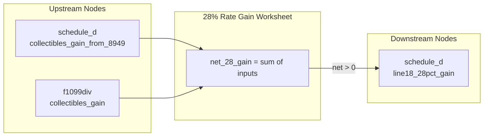

# 28% Rate Gain Worksheet

## Overview
**IRS Form:** Schedule D Tax Worksheet / 28% Rate Gain Worksheet (Schedule D Instructions, p. 17)
**Drake Screen:** None (intermediate computation node)
**Tax Year:** 2025

---
## Input Fields
| Field | Type | Source Node | Description | IRS Reference | URL |
| ----- | ---- | ----------- | ----------- | ------------- | --- |
| collectibles_gain_from_8949 | number (nonneg) | schedule_d | LT collectibles/QOF gains from Form 8949 (adjustment codes C or Q) | Sch D line 18 / 28% Rate Gain Worksheet line 1 | https://www.irs.gov/instructions/i1040sd |
| collectibles_gain | number (nonneg) | f1099div | Collectibles gain distributions from 1099-DIV box 2d | Sch D line 18 / 28% Rate Gain Worksheet line 2 | https://www.irs.gov/instructions/i1040sd |

---
## Calculation Logic
### Step 1 — Collectibles Gains
Net 28% gain = collectibles_gain_from_8949 + collectibles_gain

The 28% rate applies to net collectibles gains (coins, stamps, art, antiques, metals per IRC §408(m)) and Section 1202 gain (50% excluded QSBS gains that are not fully excluded). Both are taxed at a maximum 28% rate per IRC §1(h)(5) and §1(h)(7).

Section 1202 exclusion: when less than 100% of QSBS gain is excluded, the non-excluded portion is subject to 28% rate. This arrives via adjustment code C on Form 8949.

### Step 2 — Net gain computation
If net_28_gain > 0: output to schedule_d as line18_28pct_gain
If net_28_gain <= 0: no output (losses reduce the 28% gain pool but don't cross into negative)

---
## Output Routing
| Output Field | Destination Node | Line / Field | Condition | IRS Reference | URL |
| ------------ | ---------------- | ------------ | --------- | ------------- | --- |
| line18_28pct_gain | schedule_d | Schedule D Tax Worksheet Line 18 | net_28_gain > 0 | Sch D Tax Worksheet line 18 | https://www.irs.gov/instructions/i1040sd |

---
## Constants & Thresholds (Tax Year 2025)
| Constant | Value | Source | URL |
| -------- | ----- | ------ | --- |
| Max collectibles rate | 28% | IRC §1(h)(5) | https://www.law.cornell.edu/uscode/text/26/1 |

---
## Data Flow Diagram

---
## Edge Cases & Special Rules
- Zero input: return empty outputs
- Net loss (only possible if inputs are negative, which schemas prevent): no output
- Section 1202 partial exclusion (pre-2010 QSBS): taxed at 28%; arrives via code C on 8949
- QOF gains (code Q): treated the same as collectibles for 28% rate purposes in this aggregation
- Only LT gains qualify for 28% rate treatment; ST gains are ordinary income regardless

---
## Sources
| Document | Year | Section | URL | Saved as |
| -------- | ---- | ------- | --- | -------- |
| Schedule D Instructions | 2025 | 28% Rate Gain Worksheet | https://www.irs.gov/instructions/i1040sd | i1040sd.pdf |
| IRC §1(h)(5) | — | Collectibles gains max rate | https://www.law.cornell.edu/uscode/text/26/1 | — |
| IRC §1(h)(7) | — | Section 1202 gain max rate | https://www.law.cornell.edu/uscode/text/26/1 | — |
