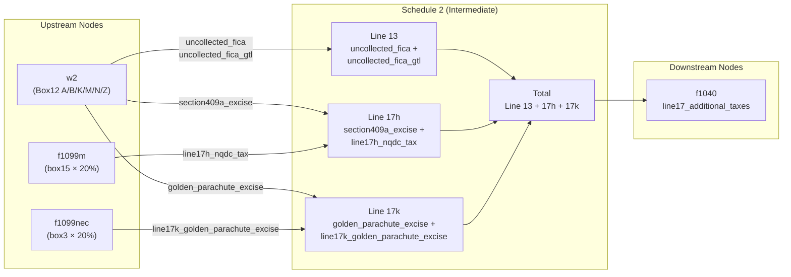

# Schedule 2 — Additional Taxes

## Overview
Schedule 2 aggregates "additional taxes" from multiple upstream sources into a single total that flows to Form 1040 Line 17. It collects excise taxes, uncollected FICA taxes, and penalty taxes that are pre-calculated by upstream nodes (W-2, 1099-NEC, 1099-MISC) and simply sums them by line, then emits the aggregate to the main 1040.

The node is a pure aggregation node: no new calculations are performed. Each input field maps to a specific Schedule 2 line number. The combined total of all lines flows to Form 1040, Line 17 (Other Taxes).

**IRS Form:** Schedule 2 (Form 1040)
**Drake Screen:** Screen "5"
**Tax Year:** 2025
**Drake Reference:** https://kb.drakesoftware.com (screen code "5" maps to Schedule 2)

---

## Input Fields
Fields received from upstream NodeOutput objects.

| Field | Type | Source Node | Description | IRS Reference | URL |
| ----- | ---- | ----------- | ----------- | ------------- | --- |
| `uncollected_fica` | number (nonneg) | w2 | Uncollected SS+Medicare tax on tips (Box 12 codes A+B) | Schedule 2 Line 13 | .research/docs/f1040s2.pdf |
| `uncollected_fica_gtl` | number (nonneg) | w2 | Uncollected SS+Medicare on group-term life ins >$50k (Box 12 codes M+N) | Schedule 2 Line 13 | .research/docs/f1040s2.pdf |
| `golden_parachute_excise` | number (nonneg) | w2 | 20% excise on excess golden parachute payments (Box 12 code K) | Schedule 2 Line 17k | .research/docs/f1040s2.pdf |
| `section409a_excise` | number (nonneg) | w2 | §409A failure excise on NQDC amounts (Box 12 code Z) | Schedule 2 Line 17h | .research/docs/f1040s2.pdf |
| `line17k_golden_parachute_excise` | number (nonneg) | f1099nec | 20% excise on excess golden parachute (box3 × 20%) | Schedule 2 Line 17k | .research/docs/f1040s2.pdf |
| `line17h_nqdc_tax` | number (nonneg) | f1099m | §409A excise on NQDC failure (box15 × 20%) | Schedule 2 Line 17h | .research/docs/f1040s2.pdf |

---

## Calculation Logic

### Step 1 — Line 13: Uncollected SS/Medicare on tips and GTL
Line 13 = `uncollected_fica` + `uncollected_fica_gtl`

Both come from W-2 Box 12:
- Codes A and B: uncollected SS tax and Medicare tax on tips
- Codes M and N: uncollected SS tax and Medicare tax on group-term life insurance cost

> **Source:** IRS Schedule 2 (Form 1040), Line 13, "Uncollected social security and Medicare or RRTA tax on tips or group-term life insurance" — .research/docs/f1040s2.pdf

### Step 2 — Line 17h: §409A excise tax
Line 17h = `section409a_excise` + `line17h_nqdc_tax`

Both represent the 20% excise tax imposed under IRC §409A on nonqualified deferred compensation plans that fail §409A requirements. Pre-calculated by upstream nodes at 20% of the includible NQDC amount.

> **Source:** IRC §409A(a)(1)(B); IRS Schedule 2 Line 17h — .research/docs/f1040s2.pdf

### Step 3 — Line 17k: Golden parachute excise tax
Line 17k = `golden_parachute_excise` + `line17k_golden_parachute_excise`

Both represent the 20% excise tax imposed under IRC §4999 on excess parachute payments. Pre-calculated by upstream nodes at 20% of the parachute payment amount.

> **Source:** IRC §4999; IRS Schedule 2 Line 17k — .research/docs/f1040s2.pdf

### Step 4 — Total additional taxes
total = line13 + line17h + line17k

This total flows to Form 1040, Line 17 (Other Taxes, Schedule 2).

> **Source:** Form 1040 (2024/2025), Line 17: "Other taxes, including self-employment tax, from Schedule 2, line 10" — .research/docs/f1040.pdf

---

## Output Routing

| Output Field | Destination Node | Line / Field | Condition | IRS Reference | URL |
| ------------ | ---------------- | ------------ | --------- | ------------- | --- |
| `line17_additional_taxes` | f1040 | Line 17 | total > 0 | Form 1040 Line 17 | .research/docs/f1040.pdf |

---

## Constants & Thresholds (Tax Year 2025)

| Constant | Value | Source | URL |
| -------- | ----- | ------ | --- |
| §409A excise rate | 20% (statutory) | IRC §409A(a)(1)(B) | https://www.law.cornell.edu/uscode/text/26/409A |
| Golden parachute excise rate | 20% (statutory) | IRC §4999 | https://www.law.cornell.edu/uscode/text/26/4999 |

No inflation-adjusted constants apply to these lines in TY2025.

---

## Data Flow Diagram

---

## Edge Cases & Special Rules

1. **All-zero inputs**: If no upstream node sends any non-zero amount, Schedule 2 should emit no output (early return).

2. **Multiple sources for same line**: `golden_parachute_excise` (from W-2 Box12 K) and `line17k_golden_parachute_excise` (from 1099-NEC box3 × 20%) both feed Line 17k — they must be summed.

3. **§409A sources**: `section409a_excise` (W-2 Box12 Z) and `line17h_nqdc_tax` (1099-MISC box15 × 20%) both feed Line 17h — they must be summed.

4. **Negative values**: None of these fields can be negative. All input fields are `nonnegative`.

5. **Partial inputs**: Any subset of fields may be present; absent fields default to 0.

---

## Sources

| Document | Year | Section | URL | Saved as |
| -------- | ---- | ------- | --- | -------- |
| Schedule 2 (Form 1040) | 2025 | All lines | https://www.irs.gov/pub/irs-pdf/f1040s2.pdf | .research/docs/f1040s2.pdf |
| Form 1040 | 2025 | Line 17 | https://www.irs.gov/pub/irs-pdf/f1040.pdf | .research/docs/f1040.pdf |
| Form 1040 General Instructions | 2024 | Schedule 2 section | https://www.irs.gov/pub/irs-pdf/i1040gi.pdf | .research/docs/i1040gi.pdf |
| IRC §409A | — | §409A(a)(1)(B) | https://www.law.cornell.edu/uscode/text/26/409A | — |
| IRC §4999 | — | §4999 | https://www.law.cornell.edu/uscode/text/26/4999 | — |
